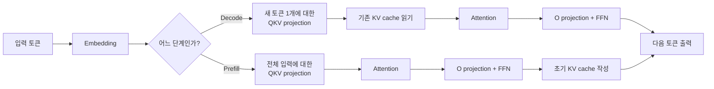
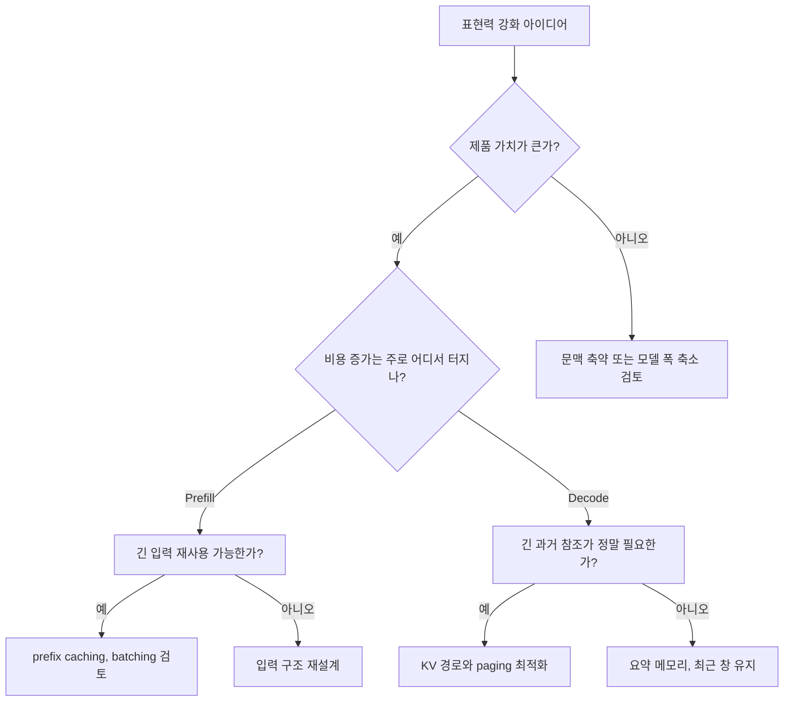

# Transformer Inference

## 수업 개요
이 챕터는 Transformer를 "attention 식 하나"로 소개하지 않고, 실제 요청이 `prefill -> decode`를 지나며 어떤 계산과 어떤 메모리 읽기를 만들어 내는지 따라간다. 핵심 질문은 단순하다. 더 긴 문맥, 더 넓은 표현 공간, 더 자주 과거를 참조하는 모델 설정이 실제 품질을 얼마나 올리고, 그 대가로 prefill FLOPs와 decode memory traffic을 얼마나 늘리느냐이다 [S1][S2]. 2026년 기준의 serving 문서가 prefix caching, paged attention, continuous batching 같은 기능을 별도 운영 항목으로 다루는 이유도 이 tradeoff가 여전히 현재형이기 때문이다 [S3]. 최신 runtime release note가 계속 갱신되는 사실 자체도, 추론 경로 최적화가 끝난 문제가 아니라는 보조 신호로 읽을 수 있다 [S4].

## 학습 목표
- `prefill`과 `decode`를 서로 다른 비용 구조로 설명할 수 있다.
- self-attention을 설명할 때 `QKV projection`, `output projection`, `FFN`, `KV cache`를 함께 묶어 말할 수 있다.
- 더 긴 문맥, 더 많은 head, 더 큰 hidden/FFN이 어떤 품질 이득을 주고 어떤 비용을 늘리는지 서비스 관점에서 비교할 수 있다.
- "느리다"는 불만을 TTFT 문제와 TPOT 문제로 분리해 진단 순서를 세울 수 있다.

## 수업 전에 생각할 질문
- 코드 질의봇에서 긴 저장소 prefix를 계속 넣는 것은 언제 가치가 크고, 언제 prefill 낭비가 될까?
- 말하기 튜터에서 긴 대화 이력을 유지하면 피드백 품질은 얼마나 좋아지고, decode 비용은 어디까지 감수할 만할까?
- attention head나 hidden size를 키우면 모델은 무엇을 더 잘할 수 있고, 어떤 비용표가 즉시 바뀔까?

## 강의 스크립트
### Part 1. 요청 하나를 `prefill`과 `decode`로 갈라 본다
**학습자:** Transformer 추론이라고 하면 attention score 계산부터 떠오르는데, 실무에서도 거기서 시작하나요?

**교수자:** 실무에서는 더 앞단에서 시작합니다. "지금 느린 구간이 prefill인가, decode인가"부터 나눕니다. prefill은 입력 프롬프트 전체를 한 번에 통과시키는 구간이고, decode는 새 토큰을 하나씩 만들며 과거를 계속 참조하는 구간입니다.

**학습자:** 같은 모델인데도 진단표가 달라진다는 말이군요.

**교수자:** 그렇습니다. `저장소 코드 질의봇`은 긴 파일 묶음을 처음 읽을 때 prefill이 두드러집니다. 반면 `실시간 말하기 튜터`는 세션이 이어질수록 decode가 길어지며 과거 대화의 K/V를 계속 읽습니다. 둘 다 Transformer지만 사용자가 느끼는 지연의 성질이 다릅니다.

**교수자:** 이 그림에서 먼저 봐야 할 것은 "attention이 있는가"가 아닙니다. 무엇을 새로 계산하고, 무엇을 저장해 두었다가 반복해서 읽는가입니다.

### Part 2. attention은 중심이지만, 비용표 전체는 아니다
**학습자:** 그래도 Transformer의 상징은 attention 아닌가요?

**교수자:** 상징은 맞습니다. 다만 추론 비용을 attention score 계산 하나로 환원하면 레이어의 절반이 사라집니다. 각 레이어는 hidden state를 받아 `Q`, `K`, `V`로 투영하고, attention 출력을 다시 합친 뒤 FFN까지 거칩니다 [S1].

#### 핵심 수식 1. Scaled Dot-Product Attention
$$
\mathrm{Attention}(Q, K, V) = \mathrm{softmax}\left(\frac{QK^\top}{\sqrt{d_k}}\right)V
$$

**교수자:** 이 식은 토큰 간 상호작용을 설명합니다. 그런데 서비스 지연을 따질 때는 곧바로 옆 질문이 붙어야 합니다. "`Q/K/V`를 만들 projection 비용은 얼마인가?", "attention 뒤의 output projection과 FFN은 얼마나 큰가?", "기존 `K/V`를 다시 계산하지 않고 cache에서 읽는 대가가 얼마나 큰가?" 같은 질문이죠.

**학습자:** 그러면 attention은 관계를 정하고, projection과 FFN은 그 관계를 실제 표현력으로 바꾸는 블록이라고 볼 수 있겠네요.

**교수자:** 그 표현이 좋습니다. 추론 품질은 이 블록들의 합으로 나오고, 추론 비용도 마찬가지입니다.

### Part 3. prefill은 큰 계산을 몰아서 하고, decode는 긴 과거를 계속 읽는다
**학습자:** 두 단계의 비용 차이를 한 번에 잡는 기준이 있나요?

**교수자:** 거친 감각은 있습니다. prefill은 긴 입력 전체를 한 번에 흘려 보내므로 attention과 projection, FFN이 함께 커집니다. decode는 새 토큰 하나만 계산하지만 과거 `K/V`를 계속 참조하므로 토큰당 읽는 바이트가 문맥 길이와 함께 불어납니다 [S1][S2].

#### 핵심 수식 2. prefill과 decode의 거친 비용 감각
$$
\mathrm{Prefill\ FLOPs}\sim O(L \cdot T_{ctx}^{2} \cdot d_{model} + L \cdot T_{ctx} \cdot d_{model} \cdot d_{ff}),
\qquad
\mathrm{Decode\ Bytes/token}\approx 2 \cdot L \cdot T_{ctx} \cdot H_{kv} \cdot d_{head} \cdot b
$$

**교수자:** 왼쪽은 문맥 길이와 모델 폭이 prefill 계산량을 키우는 방향을, 오른쪽은 문맥 길이와 KV 구조가 decode memory traffic을 키우는 방향을 보여 줍니다. 정확한 회계 장부가 아니라, 어느 항이 어디서 불어나는지 잡는 지도라고 생각하면 됩니다.

**학습자:** 결국 첫 토큰 지연은 왼쪽 표를, 후반 토큰 지연은 오른쪽 표를 먼저 의심하면 되겠네요.

**교수자:** 맞습니다. TTFT가 문제면 prefill, TPOT이 문제면 decode 쪽으로 질문이 이동합니다.

### Part 4. 표현력이 공짜는 아니다
**학습자:** 여기서 말하는 tradeoff가 "표현력과 계산량"인데, 실제로 무엇을 키우면 어떤 이득이 생기나요?

**교수자:** 네 가지를 분리해서 보는 편이 좋습니다.

- 더 긴 문맥: 오래전 지시, 긴 문서 근거, 저장소 전역 참조를 유지하기 쉽다. 대신 prefill에서는 더 긴 입력 전체를 처리해야 하고, decode에서는 더 긴 KV를 매 토큰 읽는다.
- 더 많은 head 또는 더 넓은 head: 서로 다른 관계를 병렬로 볼 여지가 생긴다. 코드 참조, 장거리 의존성, 포맷 규칙 같은 패턴을 분리해 잡는 데 유리할 수 있다. 대신 projection 크기와 attention 상태가 함께 커진다.
- 더 큰 hidden/FFN: 더 풍부한 중간 표현과 더 강한 변환 능력을 준다. 애매한 요구를 정리하거나 복합 규칙을 합성하는 품질이 좋아질 수 있다. 대신 prefill의 projection/FFN FLOPs가 크게 늘고, 가중치 읽기 비용도 무거워진다.
- 더 자주 과거를 참조하는 사용 방식: 말하기 튜터나 긴 상담 세션처럼 최근뿐 아니라 몇 분 전 피드백까지 계속 꺼내 쓰면 일관성은 좋아질 수 있다. 하지만 decode에서는 토큰당 cache read가 더 자주 길게 발생한다.

**학습자:** 그러면 "긴 문맥이 좋다"는 말만으로는 부족하겠네요. 어디서 제품 가치가 생기는지까지 써야 하니까요.

**교수자:** 정확합니다. `코드 질의봇`은 긴 prefix 재사용이 제품 가치와 바로 연결됩니다. 파일 경로, 심볼, 에러 로그가 같은 세션에서 반복되기 때문이죠. 여기서는 긴 문맥의 가치가 크고, prefix caching 같은 기법으로 prefill 낭비도 줄일 수 있습니다 [S3]. 반대로 `말하기 튜터`는 40턴 전 발화를 끝까지 들고 가는 것이 정말 필요한지 따져야 합니다. 최근 피드백 6~8턴만으로 품질이 충분하다면, 긴 문맥 유지가 늘리는 decode 비용이 더 클 수 있습니다.

### Part 5. 제품 가치를 기준으로 병목을 읽는다
**학습자:** 병목 진단만이 아니라 제품 가치까지 같이 보라는 말이 인상적입니다.

**교수자:** 운영에서는 그 둘을 분리하면 안 됩니다. 예를 들어 `사내 코드 질의봇`은 긴 저장소 prefix가 답의 정확도를 실제로 끌어올립니다. 심볼 정의와 호출 위치를 한 번에 잡아야 하기 때문입니다. 이때는 긴 문맥이 만든 prefill 비용을 감수할 이유가 있습니다. 대신 공통 prefix를 재사용해 같은 비용을 매번 다시 내지 않도록 해야 합니다 [S3].

**교수자:** 반대로 `실시간 말하기 튜터`는 세션 전체를 무조건 길게 들고 가는 것보다, 최근 교정 포인트와 발음 습관 요약만 유지하는 편이 더 낫기도 합니다. 아주 긴 문맥이 피드백 품질을 조금 올려도, 후반 decode가 눈에 띄게 느려지면 사용자는 바로 체감합니다.

**학습자:** 결국 "병목이 어디냐"와 "그 병목이 사는 이유가 제품 가치냐"를 같이 물어야 하네요.

**교수자:** 네. 같은 비용 증가라도 제품 가치를 직접 만들면 감수할 수 있고, 가치가 약하면 줄여야 합니다.

### Part 6. 엔진 문서와 release note를 같이 보는 이유
**학습자:** 이 챕터는 기초인데도 왜 엔진 문서가 들어오나요?

**교수자:** 수식만 보면 Transformer 추론이 고정된 절차처럼 보이기 쉽기 때문입니다. 하지만 실제 serving 엔진은 prefix caching, paged attention, continuous batching처럼 같은 모델을 다른 실행 경로로 돌립니다 [S3]. 이 기능들은 논문 바깥의 디테일이 아니라, 바로 앞에서 본 `prefill 낭비`와 `decode cache traffic`을 줄이기 위한 장치입니다.

**학습자:** 그럼 [S4]는 어떤 역할인가요?

**교수자:** [S4]는 구체 알고리즘의 근거라기보다 최신성 보조 근거입니다. 2026년에도 런타임 릴리스 노트가 계속 갱신된다는 사실 자체가, 배포 경로와 실행 최적화가 여전히 현재형 운영 문제라는 점을 보여 줍니다. 이 챕터에서 일반화의 근거는 [S1][S2][S3]이고, [S4]는 "지금도 이 영역이 움직이고 있다"는 수준으로만 읽는 편이 안전합니다.

## 자주 헷갈리는 포인트
- attention이 Transformer의 핵심 개념인 것과, serving 병목의 최댓값이 항상 attention인 것은 다르다.
- 긴 문맥은 품질을 올릴 수 있지만, 같은 문맥 길이가 prefill과 decode에서 다른 방식으로 비용을 늘린다.
- head 수나 hidden size를 키우면 표현력은 늘 수 있지만, 그 이득이 실제 제품 가치로 이어지는지 따져야 한다.
- KV cache는 재계산을 줄이기 위한 장치이면서, decode에서 memory traffic을 늘리는 원인이기도 하다.
- "모델이 느리다"는 한 문장만으로는 부족하다. 첫 토큰이 느린지, 후반 토큰이 느린지, 그리고 그 비용이 제품 가치와 연결되는지를 함께 적어야 한다.

## 사례로 다시 보기
### 사례 1. 모노레포 코드 질의봇
여러 디렉터리의 파일 경로, 에러 로그, 테스트 실패 메시지를 함께 넣어야 정확한 답이 나온다. 긴 문맥이 실제 제품 가치를 만든다. 대신 같은 저장소 prefix가 반복되므로, 이 서비스는 긴 문맥 자체를 포기하기보다 prefill 중복을 줄이는 방향이 낫다 [S3].

### 사례 2. 실시간 말하기 튜터
오답 교정의 일관성을 위해 최근 교정 히스토리가 필요하다. 하지만 세션 전체를 길게 유지할수록 decode에서 KV cache read가 쌓여 후반 토큰이 느려질 수 있다. 여기서는 "긴 문맥이 정말 피드백 품질을 얼마나 올리는가"를 먼저 측정해야 한다.

### 사례 3. 계약 검토 요약 도구
긴 조항을 함께 보며 요약과 차이점을 설명해야 하므로 hidden/FFN이 충분히 커서 복합 조건을 정리하는 능력이 중요할 수 있다. 다만 이 선택은 prefill의 projection/FFN 비용을 크게 키운다. 정확도 개선이 미미하면 모델 폭 확장은 과한 투자다.

### 사례 4. 사내 FAQ 챗봇의 흔한 오진
"답이 어색하니 head 수를 늘리자"는 제안이 나왔지만, 실제 문제는 제품 문맥이 짧고 질문도 단순해서 표현력 부족이 아니었다. 이 경우는 더 많은 head보다 프롬프트 정리와 요청 경로 고정비 축소가 먼저다.

## 핵심 정리
- Transformer 추론은 `prefill`과 `decode`로 나눠 봐야 병목이 보인다.
- self-attention만으로는 부족하다. projection, FFN, KV cache를 같이 봐야 실제 비용 구조가 드러난다 [S1].
- 더 긴 문맥, 더 많은 head, 더 큰 hidden/FFN은 표현력을 늘릴 수 있지만, 그 대가로 prefill FLOPs와 decode memory traffic도 함께 늘어난다 [S1][S2].
- 제품 가치가 큰 표현력 강화는 유지하되, prefix caching·paged attention·batching 같은 엔진 기능으로 비용을 줄이는 접근이 실무적이다 [S3].
- [S4]는 특정 결론을 직접 증명하는 자료라기보다, 2026년에도 런타임 최적화가 계속 업데이트되는 현재형 주제라는 최신성 보조 근거다.

## 복습 체크리스트
- [ ] `prefill`과 `decode`를 TTFT/TPOT과 연결해 설명할 수 있다.
- [ ] attention 설명 뒤에 `QKV projection`, `output projection`, `FFN`을 빠뜨리지 않고 말할 수 있다.
- [ ] 긴 문맥, head 수, hidden/FFN 확대가 어떤 품질 이득과 비용 증가를 만드는지 사례와 함께 설명할 수 있다.
- [ ] 코드 질의봇과 말하기 튜터에서 긴 문맥의 제품 가치가 왜 다를 수 있는지 설명할 수 있다.
- [ ] prefix caching이나 paged attention 같은 엔진 기능을 볼 때, 그것이 prefill 절감용인지 decode cache 절감용인지 구분할 수 있다.

## 대안과 비교
| 선택 | 기대되는 표현력 이득 | 주로 늘어나는 비용 | 병목이 자주 드러나는 곳 | 실제 제품 가치 판단 기준 | 먼저 볼 완화책 |
| --- | --- | --- | --- | --- | --- |
| 더 긴 문맥 | 긴 문서 근거 유지, 멀리 떨어진 단서 연결, 저장소 전역 참조 | prefill 입력 처리량 증가, decode KV read 증가 | TTFT와 긴 세션 TPOT 모두 | 코드 질의봇처럼 장거리 참조가 정확도에 직접 기여하는가 | prefix reuse, 문맥 요약, 최근 창 분리 [S3] |
| 더 많은/넓은 head | 서로 다른 관계 패턴을 병렬로 포착할 여지 증가 | projection 크기, attention 상태, cache 구조 부담 | prefill 계산량과 decode cache 크기 | 규칙 충돌이나 장거리 의존성 처리가 실제 오답 원인인가 | head 확장 전 오류 유형 분석 |
| 더 큰 hidden/FFN | 복합 규칙 합성, 미묘한 표현 구분, 추론 여지 확대 | projection/FFN FLOPs 증가, 가중치 읽기 부담 증가 | 특히 prefill | 계약 검토처럼 복잡한 조건 조합이 핵심 가치인가 | 모델 폭 확장 전 프롬프트/데이터 품질 점검 |
| 과거를 더 자주 참조하는 운용 | 대화 일관성, 개인화, 누적 피드백 유지 | decode 토큰당 cache read 증가 | 긴 세션 TPOT | 말하기 튜터에서 오래된 피드백이 현재 품질을 실제로 얼마나 올리는가 | 세션 요약 메모리, 최근 N턴 유지 |
| 공통 prefix 재사용 | 표현력 유지한 채 동일 맥락 반복 비용 절감 | 구현 복잡도와 cache 관리 비용 | prefill | 저장소/정책 문서처럼 반복 prefix가 많은가 | prefix caching, request grouping [S3] |

## 참고 이미지

- 캡션: Roofline model
- 출처 번호: [I1]
- 왜 이 그림이 필요한지: prefill과 decode를 같은 "느림"으로 묶지 않고, 어떤 구간이 compute 쪽 압박을 받고 어떤 구간이 bandwidth 쪽 압박을 받는지 시각적으로 붙잡게 해 준다 [S2].

- 캡션: vLLM logo
- 출처 번호: [I2]
- 왜 이 그림이 필요한지: 제공된 자산 중 실제 serving 엔진 맥락을 가리키는 외부 이미지다. 본문에서 paged attention과 prefix caching은 Mermaid로 직접 설명하고, 이 이미지는 그 기능들이 문서화된 엔진 세계로 이어진다는 연결 표식으로 사용한다 [S3].

## 출처
| 번호 | 제목 | 발행 주체 | 날짜 | URL | 사용 이유 |
| --- | --- | --- | --- | --- | --- |
| [S1] | Attention Is All You Need | Google Research / arXiv | 2017-06-12 | [https://arxiv.org/abs/1706.03762](https://arxiv.org/abs/1706.03762) | self-attention, multi-head 구조, projection과 autoregressive 추론의 기본 구조를 설명하는 기준 출처 |
| [S2] | Roofline: an insightful visual performance model for multicore architectures | Communications of the ACM | 2009-04-01 | [https://dl.acm.org/doi/10.1145/1498765.1498785](https://dl.acm.org/doi/10.1145/1498765.1498785) | prefill/decode를 compute 압박과 bandwidth 압박으로 나눠 읽는 성능 모델의 기준 출처 |
| [S3] | vLLM Documentation | vLLM project | 2026-01-07 | [https://docs.vllm.ai/en/latest/](https://docs.vllm.ai/en/latest/) | prefix caching, paged attention, batching 같은 serving 기능을 추론 경로와 연결하기 위한 기준선 |
| [S4] | AWS Neuron release notes 2.26.0 | AWS Neuron | 2026-03-08 (accessed) | [https://awsdocs-neuron.readthedocs-hosted.com/en/v2.26.1/release-notes/2.26.0/](https://awsdocs-neuron.readthedocs-hosted.com/en/v2.26.1/release-notes/2.26.0/) | 2026년에도 추론 런타임과 배포 경로가 계속 업데이트되는 현재형 영역임을 보여 주는 최신성 보조 근거 |
