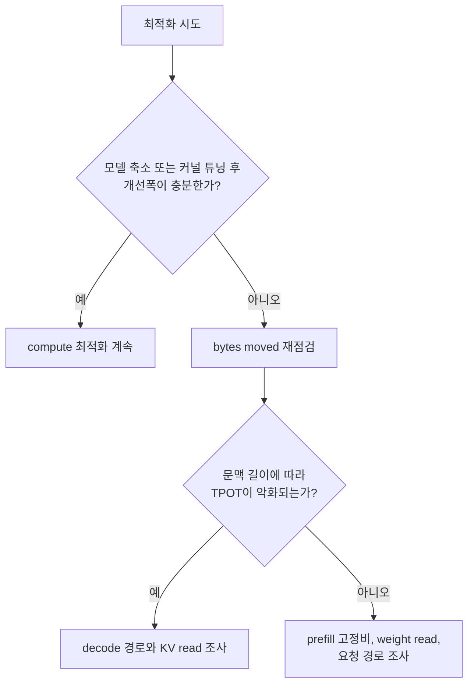
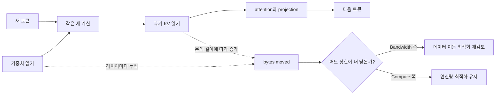
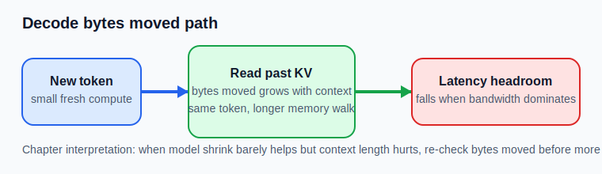

# Memory, Bandwidth, Latency

## 수업 개요
이 챕터는 Transformer 입문을 반복하지 않고, `왜 FLOPs를 줄였는데도 latency가 그대로인가`를 판단하는 틀을 만든다. Self-attention은 모델의 기본 구조를 설명해 주지만 [S1], 실제 지연은 종종 `얼마나 계산했는가`보다 `토큰 하나를 만들기 위해 몇 바이트를 읽고 썼는가`에 더 민감하다 [S2]. 그래서 이 장의 핵심은 개념 소개보다 진단 순서다. 먼저 compute를 볼지, 아니면 bytes moved를 다시 셀지 결정하는 기준을 세운다.

## 학습 목표
- `FLOPs / Effective Compute`와 `Bytes Moved / Effective Bandwidth`를 같이 적는 이유를 설명할 수 있다.
- Roofline을 `이제 compute 최적화를 멈추고 bytes moved를 다시 볼 때인가`를 판단하는 도구로 사용할 수 있다.
- `prefill`과 `decode`를 입문 개념이 아니라 서로 다른 진단 조건으로 구분할 수 있다.
- 모델 축소나 커널 튜닝 효과가 작을 때, 어떤 신호가 bandwidth 쪽 재점검을 요구하는지 사례로 설명할 수 있다.

## 수업 전에 생각할 질문
- 모델 폭을 줄였는데 `TPOT`이 2~3%만 좋아졌다면, 무엇을 먼저 의심해야 할까?
- 긴 문맥일수록 느려지는데 장비 utilization은 높게 보인다면, 이 숫자는 무엇을 말해 주고 무엇은 말해 주지 못할까?
- 같은 8B 모델이라도 `메일 제목 자동 라우터`와 `32K 계약 비교 도구`가 전혀 다른 최적화 순서를 가져야 하는 이유는 무엇일까?

## 강의 스크립트
### Part 1. 첫 질문은 "몇 FLOPs냐"가 아니라 "몇 바이트를 옮겼냐"다
**학습자:** 모델을 줄였는데도 속도가 거의 그대로입니다. 최적화 방향이 틀린 건가요?

**교수자:** 틀렸다기보다 지배 항을 잘못 골랐을 가능성이 큽니다. 추론 단계의 latency는 계산과 메모리 이동 중 더 느린 쪽 상한을 따라갑니다 [S2]. 그래서 모델 축소가 바로 체감 속도로 이어지지 않을 수 있어요.

#### 핵심 수식 1. 토큰 단위 latency를 거칠게 보는 틀
$$
\mathrm{Latency}_{step}
\approx
\max\left(
\frac{\mathrm{FLOPs}}{\mathrm{Effective\ Compute}},
\frac{\mathrm{Bytes\ Moved}}{\mathrm{Effective\ Bandwidth}}
\right)
$$

**학습자:** 그러면 FLOPs가 줄어도 오른쪽 항이 그대로면 개선이 거의 없겠네요.

**교수자:** 맞습니다. 특히 긴 문맥 decode는 새로 계산하는 양보다, 이미 만든 상태와 가중치를 다시 읽는 비용이 더 큰 항이 되기 쉽습니다 [S1][S2].

### Part 2. Roofline은 성능 그림이 아니라 "중단 신호"를 주는 도구다
**학습자:** Roofline은 HPC 교과서 그림처럼 느껴지는데, 여기서도 그대로 쓰나요?

**교수자:** 여기서는 더 실용적으로 씁니다. Roofline의 핵심 질문은 하나입니다. `지금 workload는 compute ceiling에 막혀 있나, bandwidth ceiling에 막혀 있나?` [S2]

#### 핵심 수식 2. arithmetic intensity와 상한
$$
\mathrm{AI}=\frac{\mathrm{FLOPs}}{\mathrm{Bytes\ Moved}},
\qquad
\mathrm{Perf}_{\max}\le\min\left(\mathrm{Peak\ FLOPs},\ \mathrm{Bandwidth}\times\mathrm{AI}\right)
$$

**교수자:** arithmetic intensity가 낮으면, 연산 유닛이 남아 있어도 메모리 이동이 먼저 성능을 자릅니다. 이때 compute 최적화를 계속 밀면 수고에 비해 개선이 너무 작을 수 있습니다.

**학습자:** 결국 Roofline은 "이제 다른 질문으로 넘어가라"는 신호를 주는 셈이네요.

**교수자:** 정확합니다. 이 장에서는 그 전환 시점을 잡는 감각을 익히는 게 중요합니다.

### Part 3. prefill과 decode는 입문 용어가 아니라 서로 다른 비용표다
**학습자:** 그래도 같은 레이어를 도는 건 맞잖아요. 왜 구분이 그렇게 중요한가요?

**교수자:** 같은 레이어를 돌아도 사용자가 느끼는 문제는 다릅니다. `prefill`은 긴 입력 전체를 처리해 `TTFT`를 흔들고, `decode`는 새 토큰을 반복 생성해 `TPOT`을 흔듭니다 [S1]. 이 차이를 묶어 버리면, 긴 입력 중복 문제와 긴 문맥 read 문제를 같은 처방으로 다루게 됩니다.

**학습자:** 그러면 이 챕터에서 prefill/decode를 다시 다루는 이유는 구조 설명이 아니라 진단 분기군요.

**교수자:** 그렇죠. 여기서는 개념 소개가 아니라 "느림의 형태가 어디서 시작되는가"를 나누는 표지판으로 씁니다.

### Part 4. compute 최적화를 멈추고 bytes moved를 다시 볼 신호
**학습자:** 실무에서 그 전환 시점을 어떻게 잡나요?

**교수자:** 네 가지 신호를 먼저 봅니다.

- 모델 크기 축소나 커널 튜닝 후 개선폭이 예상보다 매우 작다.
- 문맥 길이가 길어질수록 `TPOT`이 더 나빠진다.
- 첫 토큰보다 후반 토큰이 더 흔들린다.
- utilization 숫자는 높아 보이는데, 문맥 길이 변화가 latency를 훨씬 더 크게 흔든다.

**교수자:** 이런 신호가 모이면 `compute를 더 깎자`보다 `이번 토큰에서 실제로 얼마나 읽고 쓰는가`를 다시 적는 편이 낫습니다.

**학습자:** 이 그림을 보니 `새 토큰 계산량`만 보면 왜 오진이 생기는지 알겠습니다.

**교수자:** 맞습니다. decode에서 문제를 만드는 건 "새 계산이 작다"보다 "작은 계산을 위해 긴 메모리 산책을 한다"는 점입니다.

### Part 5. 실패 사례로 보면 판단 프레임이 더 선명해진다
**학습자:** 사례로 보면 어떤 차이가 생기나요?

**교수자:** 세 가지를 보죠.

**교수자:** `32K 계약 조항 비교` 서비스에서 팀이 먼저 모델 폭을 줄였습니다. FLOPs는 줄었는데 `TPOT` 개선은 3%뿐이었습니다. 이때 계속 compute만 파면 시간이 낭비됩니다. 긴 문맥이 핵심 가치인 서비스라면, 먼저 `문맥 길이와 bytes moved가 같이 늘었는가`를 다시 봐야 합니다.

**교수자:** `메일 제목 자동 라우터`는 반대입니다. 문맥이 짧고 출력도 거의 분류 라벨 한두 개로 끝납니다. 여기서는 긴 KV read가 지배적일 가능성이 낮으니, prefill 고정비나 요청 경로 오버헤드를 줄이는 편이 더 직접적일 수 있습니다.

**교수자:** `라이브 자막 후편집기`는 또 다릅니다. 답변이 시작된 뒤 뒤쪽 토큰이 흔들리면 화면 자막이 바로 끊겨 보입니다. 이때는 `TTFT`보다 `TPOT`과 문맥 길이 민감도를 먼저 봐야 하고, compute 최적화의 기대값도 낮춰 잡아야 합니다.

**학습자:** 결국 "같은 모델"보다 "같은 문제 형태인가"가 더 중요하군요.

**교수자:** 그렇습니다. 이 챕터의 판단 프레임은 모델 구조보다 증상과 비용표를 먼저 맞추는 데 있습니다.

### Part 6. 최신 문서는 이론 증명이 아니라 운영 기준선이다
**학습자:** 브리프의 최신성 문장이 꽤 강한데, [S3]와 [S4]는 이 장의 핵심 공식을 직접 뒷받침하는 자료는 아니지 않나요?

**교수자:** 맞습니다. [S3]는 최신 serving 문서 기준선이고, [S4]는 `AWS Neuron release notes 2.26.0`처럼 runtime 표면이 계속 바뀌는 현실을 보여 주는 자료입니다. 둘 다 Roofline 자체를 새로 설명하는 문서는 아닙니다.

**교수자:** 그래서 이 장에서 [S3][S4]의 역할은 제한적입니다. `정적 FLOPs 표만 보고 진단을 끝내지 말라`는 운영 기준선을 주는 데 쓰고, memory-bandwidth 판단의 직접 근거는 여전히 [S2]와 Part 1-4의 비용 분해에서 가져옵니다. 다시 말해 `bytes moved를 따로 다시 세는 습관`은 이 장의 실무 해석이고, [S3][S4]는 그 해석이 여전히 현재형 문제라는 점을 보조하는 기준선입니다.

**학습자:** 그러면 최신성의 핵심은 `무조건 bandwidth부터 보라`가 아니라, `serving/runtime 표면이 계속 바뀌니 memory movement 진단도 살아 있는 운영 질문으로 보라`에 가깝네요.

**교수자:** 그렇습니다. 아래 참고 이미지 2는 Part 1-4의 `decode bytes moved` 판단을 붙잡는 수업용 도식이고, [S3][S4]는 그런 판단을 정적인 교과서 문장으로 닫지 말라는 운영 기준선으로만 씁니다.

## 자주 헷갈리는 포인트
- `bandwidth-bound`는 연산이 적다는 뜻이 아니라, 더 낮은 상한이 메모리 이동 쪽이라는 뜻이다.
- `prefill`과 `decode`를 다시 구분하는 이유는 입문 설명이 아니라 `TTFT`와 `TPOT`을 다른 처방으로 연결하기 위해서다.
- 모델 축소가 실패했다고 해서 최적화가 틀린 것은 아니다. 줄인 항이 지배 항이 아니었을 수 있다.
- 높은 utilization은 장비가 바쁘다는 신호일 뿐, 그 바쁨이 compute인지 memory path인지를 자동으로 분리해 주지 않는다.
- [S3][S4]의 최신성은 "문서와 런타임이 계속 관리되는 주제"라는 사실까지는 지지하지만, 구체적인 운영 우선순위는 별도 해석임을 구분해야 한다.

## 사례로 다시 보기
### 사례 1. 계약 검토 보조의 잘못된 첫 처방
증상은 `긴 문맥에서 TPOT 악화`였다. 그런데 팀은 먼저 모델 폭을 줄였다. 결과가 미미했다면, 다음 단계는 더 작은 모델이 아니라 `문맥 길이 증가에 따라 bytes moved가 얼마나 같이 커졌는지`를 다시 세는 것이다.

### 사례 2. 메일 제목 라우터의 과한 decode 집착
문맥이 짧고 출력도 짧은 서비스에 긴 문맥용 처방을 그대로 들이대면 오버엔지니어링이 된다. 이 경우에는 `prefill` 고정비, 반복 입력, 요청 경로 오버헤드가 더 먼저일 수 있다.

### 사례 3. 라이브 자막 후편집기의 후반 토큰 흔들림
첫 토큰은 빨랐는데 문장이 길어질수록 자막 후반이 끊긴다. 이 현상은 `첫 답변이 늦다`는 문제와 다른 분류다. 여기서는 `decode`, `TPOT`, `문맥 길이 민감도`를 한 묶음으로 봐야 한다.

## 핵심 정리
- 이 장의 질문은 `무슨 연산이 있나`보다 `이번 토큰을 위해 무엇을 얼마나 옮기나`다.
- Roofline은 LLM serving에서도 `compute 최적화를 계속할지 멈추고 bytes moved를 다시 셀지`를 가르는 실무 도구다 [S2].
- `prefill`과 `decode`는 같은 모델의 두 단계가 아니라, 서로 다른 병목 진단표로 읽어야 한다 [S1].
- 모델 축소 효과가 작고 문맥 길이에 따라 `TPOT`이 악화되면, compute보다 bytes moved가 지배 항일 가능성을 먼저 점검해야 한다.
- [S3]와 [S4]가 직접 보여 주는 것은 `serving 문서`와 `runtime release note`가 2026년에도 현재형 기준선이라는 사실이다.
- 이 문서들로부터 추론하면, 현대 추론 최적화는 정적인 FLOPs 계산만이 아니라 실행 경로와 메모리 이동을 함께 읽는 습관이 필요하다.

## 복습 체크리스트
- [ ] `Latency_step`을 compute 항과 bandwidth 항 중 큰 값으로 보는 이유를 설명할 수 있다.
- [ ] arithmetic intensity가 낮을 때 왜 compute 최적화 기대값이 작아질 수 있는지 말할 수 있다.
- [ ] `TTFT` 문제와 `TPOT` 문제를 서로 다른 진단표로 나눌 수 있다.
- [ ] 모델 축소 효과가 작은 상황에서 bytes moved 재점검으로 전환할 신호를 2개 이상 말할 수 있다.
- [ ] `[S3][S4]가 직접 말한 사실`과 `이 챕터가 거기서 끌어낸 운영 해석`을 구분할 수 있다.

## 대안과 비교
| 관측 신호 | compute 최적화를 계속할 조건 | bytes moved 재점검으로 전환할 조건 | 먼저 볼 것 |
| --- | --- | --- | --- |
| 모델 축소 후 개선폭이 큼 | FLOPs 감소가 latency 개선으로 바로 이어짐 | 개선폭이 작고 ceiling mismatch가 의심됨 | 수식 1의 두 항 비교 |
| `TTFT`만 큼 | 긴 입력 처리나 요청 고정비가 중심 | 후반 토큰보다 첫 응답이 문제 | prefill 경로, 입력 반복 |
| `TPOT`이 문맥 길이에 민감 | 짧은 문맥에서만 느린 문제 | 긴 문맥일수록 더 느려짐 | decode 경로, bytes moved |
| utilization이 높음 | 다른 지표도 compute 쪽과 일치 | 문맥 길이 변화가 latency를 더 크게 흔듦 | utilization 외에 문맥 길이 민감도 |
| 최신 문서를 읽을 때 | 문서가 직접 말한 사실만 인용 | 사실 위에 운영 해석을 따로 표시 | `[S3][S4]` 사실/해석 분리 |

## 참고 이미지

- 캡션: Roofline model
- 출처 번호: [I1]
- 왜 이 그림이 필요한지: `compute ceiling`과 `bandwidth ceiling`을 한 번에 보여 주기 때문에, 이 장의 핵심 판단인 `언제 compute 최적화를 멈출지`를 직관적으로 붙잡아 준다 [S2].

- 캡션: Decode bytes moved path
- 출처 번호: [I2]
- 왜 이 그림이 필요한지: `새 계산은 작아도 과거 상태를 읽는 경로가 길어지면 latency headroom이 줄어든다`는 이 장의 판단을 시각화한다. 동시에 Part 6에서 설명한 것처럼, 이 그림은 [S1][S2]를 바탕으로 만든 수업용 도식이고 [S3][S4]는 이런 memory movement 진단이 여전히 현재형 운영 문제라는 기준선을 주는 역할에 머문다.

## 출처
| 번호 | 제목 | 발행 주체 | 날짜 | URL | 사용 이유 |
| --- | --- | --- | --- | --- | --- |
| [S1] | Attention Is All You Need | Google Research / arXiv | 2017-06-12 | [https://arxiv.org/abs/1706.03762](https://arxiv.org/abs/1706.03762) | self-attention과 autoregressive 추론 구조, `prefill/decode` 구분의 기본 배경 |
| [S2] | Roofline: an insightful visual performance model for multicore architectures | Communications of the ACM | 2009-04-01 | [https://dl.acm.org/doi/10.1145/1498765.1498785](https://dl.acm.org/doi/10.1145/1498765.1498785) | arithmetic intensity, compute ceiling, bandwidth ceiling을 latency 판단 틀로 연결 |
| [S3] | vLLM Documentation | vLLM project | 2026-01-07 | [https://docs.vllm.ai/en/latest/](https://docs.vllm.ai/en/latest/) | 최신 serving 문서 기준선으로서, 이 챕터의 최신성 문장을 사실/해석으로 분리하는 기준 |
| [S4] | AWS Neuron release notes 2.26.0 | AWS Neuron | 2026-03-08 (accessed) | [https://awsdocs-neuron.readthedocs-hosted.com/en/v2.26.1/release-notes/2.26.0/](https://awsdocs-neuron.readthedocs-hosted.com/en/v2.26.1/release-notes/2.26.0/) | 2026-03-08 접근 시점의 runtime release note 기준선으로서, 문서 최신성의 범위를 한정 |
