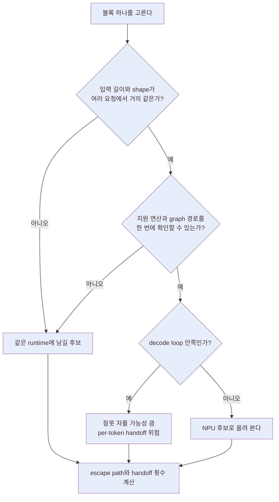
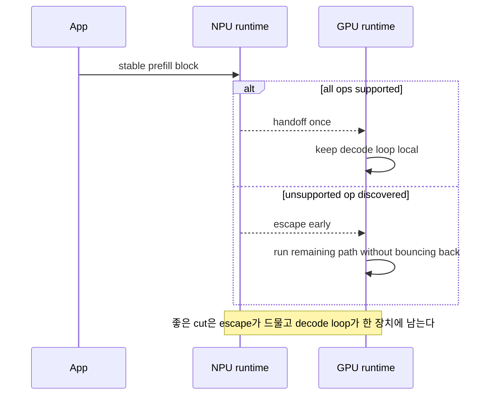
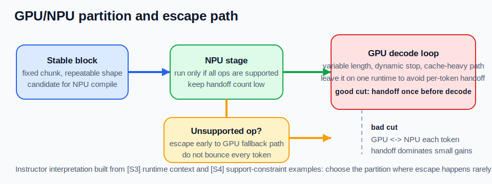

# GPU vs NPU Mental Model

## 수업 개요
이 챕터는 GPU와 NPU를 성능표 두 칸으로 비교하지 않고, `어떤 블록을 어느 runtime에 맡길 것인가`라는 실행 모델 문제로 다룬다. Transformer가 attention과 feed-forward 블록을 반복한다는 사실은 [S1]이 준다. Roofline은 그 블록이 계산보다 데이터 이동에 더 묶여 있을 수 있음을 보여 준다 [S2]. vLLM 문서는 serving이 커널 하나가 아니라 scheduler, batching, KV cache를 포함한 runtime 문제라는 맥락을 준다 [S3]. AWS Neuron release note는 특정 NPU runtime의 지원 범위가 버전과 기능 단위로 관리된다는 사례를 준다 [S4]. 이 네 가지를 합치면, 장치 선택의 핵심 질문은 `누가 더 센가`보다 `어디서 끊으면 handoff와 escape path가 폭발하는가`, 그리고 `언제 전력 효율이 실제 배터리·발열 이득으로 남는가`가 된다.

## 학습 목표
- GPU와 NPU를 연산 장치 이름이 아니라 서로 다른 실행 계약으로 설명할 수 있다.
- `[S3]가 직접 말하는 runtime 사실`과 `교수자가 거기서 끌어낸 설계 해석`을 구분할 수 있다.
- `stable block`, `variable decode`, `unsupported-op escape path`를 기준으로 partition을 고를 수 있다.
- sustained decode 길이, thermal budget, battery target, compile amortization, handoff 횟수, escape 확률을 함께 적어 `유연성`과 `전력 효율`을 동시에 평가할 수 있다.
- hybrid 구성이 빨라 보이는데도 실제 latency와 총 시스템 전력이 함께 나빠지는 경계를 설명할 수 있다.

## 수업 전에 생각할 질문
- 같은 Transformer 블록인데 왜 어떤 부분은 NPU 후보이고 어떤 부분은 GPU에 남겨 두는가?
- `NPU가 있으니 저전력으로 끝내자`라는 말은 어느 지점부터 위험해지는가?
- hybrid가 실패하는 가장 흔한 이유는 장치 성능 부족일까, 아니면 partition 경계일까?

## 강의 스크립트
### Part 1. 출처가 직접 말하는 것과 강의 해석을 먼저 나눈다
**학습자:** GPU와 NPU를 비교하는 챕터인데, 왜 장치 설명보다 출처 해석부터 시작하나요?

**교수자:** 이 챕터는 그 구분을 먼저 해야 안전합니다. [S1]이 직접 주는 사실은 Transformer가 attention과 feed-forward 같은 반복 블록으로 구성된다는 점입니다. [S2]가 직접 주는 사실은 성능이 `peak FLOPs`만이 아니라 arithmetic intensity와 bandwidth ceiling에도 묶인다는 점입니다.

**교수자:** [S3]가 직접 주는 사실은 serving이 scheduler, batching, KV cache 같은 runtime 층을 가진다는 맥락입니다. [S4]가 직접 주는 사실은 특정 NPU runtime의 지원 범위와 기능이 release note로 관리된다는 점입니다. 여기까지는 출처의 직접 영역입니다.

**학습자:** 그럼 "GPU는 기준선", "NPU는 정적 블록 담당" 같은 문장은요?

**교수자:** 그건 강의 해석입니다. 이 챕터는 위 사실들을 바탕으로, `변동성이 큰 decode loop는 한 runtime에 오래 남기고`, `shape가 안정적이며 지원 범위가 확인된 블록만 다른 장치 후보로 올려 보자`는 설계 규칙을 제안합니다. 해석과 사실을 섞지 않는 게 중요합니다.

### Part 2. 장치 비교표보다 먼저 그릴 것은 partition 선이다
**학습자:** 그래도 실무에서는 결국 GPU냐 NPU냐를 결정해야 하잖아요.

**교수자:** 그래서 더더욱 partition 선부터 그립니다. Transformer 블록은 겉보기에는 반복되지만, serving 중에는 모든 블록이 같은 성격으로 실행되지 않습니다. 일부는 같은 길이와 같은 shape로 반복되고, 일부는 decode 종료 시점이 매번 달라집니다 [S1][S3].

**교수자:** NPU 후보를 찾을 때도 먼저 묻는 건 "이 블록이 빨라 보이나?"가 아닙니다. `shape가 안정적인가`, `지원 안 되는 연산이 끼면 어디로 escape하는가`, `경계를 몇 번 넘는가`를 먼저 묻습니다. 그다음에야 장치 이득을 계산합니다.

#### 수식 1. 블록 성격을 먼저 가르는 최소 식
$$
\mathrm{AI}=\frac{\mathrm{FLOPs}}{\mathrm{Bytes\ moved}}
$$

이 식은 장치 비교를 시작하기 전에, 지금 보는 블록이 계산보다 메모리 이동에 더 묶여 있는지 묻게 만든다 [S2]. 같은 matmul이 보여도 `bytes moved`가 길게 따라붙는 경로라면, 장치를 바꾸는 것보다 경계 횟수를 줄이는 편이 더 중요할 수 있다.

**학습자:** decode 안쪽이냐 바깥쪽이냐가 그렇게 중요합니까?

**교수자:** 이 챕터에서는 그게 핵심입니다. decode loop 안쪽에서 장치를 자주 바꾸면, 작은 연산 이득이 경계 비용에 바로 잡아먹힙니다.

### Part 3. 나쁜 cut은 블록이 아니라 토큰마다 경계를 넘긴다
**학습자:** 구체적으로 어떤 cut이 나쁜가요?

**교수자:** 예를 들어 회의 요약기에서 `고정 길이 chunk 요약 prefill`은 NPU 후보처럼 보일 수 있습니다. 그런데 그 뒤의 `최종 답변 decode`를 토큰마다 GPU와 NPU 사이에서 오가게 자르면, 설계는 거의 실패합니다.

**학습자:** 왜요? decode에도 똑같이 matmul이 있잖아요.

**교수자:** matmul이 있다는 사실만으로는 충분하지 않습니다. decode는 종료 시점이 가변적이고, 토큰마다 cache 상태가 달라지고, 작은 작업이 매우 많이 반복됩니다 [S1][S3]. 이때 per-token handoff가 붙으면 장치 내부 이득보다 경계 오버헤드가 더 커질 수 있습니다.

#### 수식 2. partition은 경계 비용까지 합산해서 본다
$$
T_{\mathrm{partition}}=\sum_i T_i + N_{\mathrm{handoff}} \cdot t_{\mathrm{handoff}} + N_{\mathrm{escape}} \cdot t_{\mathrm{escape}}
$$

여기서 중요한 것은 `N_handoff`와 `N_escape`다. 장치별 단품 시간이 좋아 보여도, 잘못 자른 partition은 경계를 자주 넘기면서 총 시간을 악화시킨다. [S4]를 이 식의 일반론 근거로 쓰면 과장이다. 다만 [S4]는 `지원 제약이 실제로 release note 수준에서 관리된다`는 사례를 주므로, `N_escape`를 설계 초반에 적어 두라는 해석에는 도움을 준다.

**학습자:** 그러면 hybrid의 핵심은 "둘 다 쓴다"가 아니라 "한 번 넘기고 오래 머문다"네요.

**교수자:** 맞습니다. hybrid가 맞는 설계라도, 토큰마다 왕복하면 사실상 나쁜 hybrid입니다.

### Part 4. 사례 추적: 노트북 회의 요약기를 어디서 끊을 것인가
**학습자:** 하나의 사례를 끝까지 보고 싶습니다. 어디서 끊으면 손해가 나는지요.

**교수자:** 노트북 회의 요약기를 보죠. 입력 전처리 단계가 회의록을 `512-token chunk`로 잘라 반복 요약하고, 마지막에 전체 회의에 대한 자유 형식 요약을 생성한다고 가정합시다.

**학습자:** 첫 번째 chunk 요약 경로는 shape가 꽤 안정적이겠네요.

**교수자:** 그렇습니다. 그래서 이 챕터의 설계 해석에서는 그 블록을 NPU 후보로 올립니다. 반대로 마지막 자유 형식 요약 decode는 길이가 흔들리고, 사용자가 중간 편집을 넣을 수도 있으니 GPU 기준선으로 남기는 편이 안전합니다. 여기서 중요한 이유는 단지 latency가 아닙니다. 짧고 가변적인 decode에서는 `GPU -> NPU` 전환 때 드는 동기화와 fallback 비용이 배터리 이득보다 먼저 커질 수 있기 때문입니다.

**교수자:** 중요한 건 중간 경계입니다. chunk 요약 결과를 모두 모은 뒤 최종 decode를 시작하기 전에 한 번 handoff하는 건 검토할 수 있습니다. 하지만 최종 decode 중간에 특정 projection만 NPU로 보내는 cut은 거의 항상 나쁩니다. 작고 잦은 왕복이 생기기 때문입니다.

**학습자:** unsupported op가 chunk 요약 블록 안에서 나오면요?

**교수자:** 그때는 escape를 일찍 결정합니다. NPU에 조금 돌리다가 다시 GPU로, 다시 NPU로 튀는 식은 피합니다. escape가 필요하면 한 번 빠져서 남은 경로를 같은 runtime에 두는 쪽이 낫습니다. [S4]는 바로 이런 지원 제약이 실제 배포에서 버전별로 관리된다는 점을 보여 주는 벤더 사례입니다.

### Part 5. 이 챕터에서 쓰는 결정표
**학습자:** 결국 어떤 표를 만들어야 하나요?

**교수자:** 장치 이름 표가 아니라 아래 같은 partition 결정표를 만듭니다. 여기서 `유연성`은 shape 변동, decode 길이 변동, escape 대응 편의성으로 보고, `전력 효율`은 긴 decode 길이, 열 예산, 배터리 목표가 실제로 남는지로 봅니다.

| 블록 | 유연성 점수에 중요한 것 | 전력 효율 점수에 중요한 것 | 추천 배치 | 왜 그렇게 보나 |
| --- | --- | --- | --- | --- |
| 512-token chunk 요약 prefill | shape 변동이 작고 escape 확률을 미리 점검 가능 | compile amortization이 되고 handoff가 한 번이면 이득을 남길 수 있음 | NPU 후보 | 반복 shape라 NPU cut을 검토할 수 있고, 열 예산이 빡빡한 노트북에서는 배터리 이득도 기대할 수 있다 |
| chunk 결과 합치기 | 유연성은 높지만 cut 추가 가치가 작음 | 계산량이 짧아 전력 이득을 남기기 어려움 | GPU/CPU 유지 | 경계 하나 더 만드는 순간 handoff 비용이 전력·latency 이득을 같이 잠식한다 |
| 최종 자유 형식 decode | 종료 시점과 cache 상태가 흔들려 유연성이 중요 [S3] | sustained decode가 충분히 길지 않으면 NPU 이득이 손실되기 쉬움 | GPU 기준선 | 길이 변동이 큰 경로는 GPU가 덜 효율적이어도 전체 시스템 비용이 더 낮을 수 있다 |
| decode 중 projection 일부만 분리 | escape와 fallback 대응이 복잡해짐 | per-token handoff가 누적돼 전력 이득이 거의 사라짐 | 피함 | 작은 블록 가속보다 왕복 비용과 열 증가가 더 빨리 누적된다 |
| unsupported op 발생 후 잔여 경로 | 유연성이 최우선 | 전력 효율보다 단순한 종료 경로가 중요 | escape 후 한 장치 유지 | 왕복 fallback보다 단순한 경로가 latency와 총 전력을 함께 덜 망친다 |

**학습자:** 이 표는 성능표보다 훨씬 설계 문서 같네요.

**교수자:** 그게 목적입니다. 이 챕터의 mental model은 벤치마크 캡처보다 partition 표를 먼저 쓰는 습관입니다.

### Part 6. 서버 챗봇과 비교하면 같은 규칙이 더 선명해진다
**학습자:** 회의 요약기 말고 서버 챗봇은 다르게 보나요?

**교수자:** 네. 다중 사용자 챗봇은 긴 질문과 짧은 질문이 섞이고, 종료 시점이 더 불규칙합니다. 그래서 강의 해석상 GPU 기준선을 더 강하게 잡고 시작합니다. 이유는 GPU가 항상 더 효율적이라서가 아니라, 유연성이 높은 경로를 한 runtime에 오래 두는 편이 handoff와 fallback으로 생기는 전력 낭비를 막기 쉽기 때문입니다.

**교수자:** 반대로 회의 요약기는 정해진 chunk 전처리처럼 안정 블록을 찾기 쉬워서 hybrid 후보가 더 자연스럽습니다. 그리고 edge 음성 비서처럼 thermal budget이 작은 제품은 이 차이가 더 커집니다. wake-word 이후 짧은 intent decode만 반복되는 경로라면 NPU 후보를 억지로 늘리기보다, 고정 feature extraction 블록만 NPU에 두고 가변 답변 생성은 GPU/CPU에 남기는 편이 총 전력과 응답 안정성을 같이 지키기 쉽습니다.

## 자주 헷갈리는 포인트
- `[S3]가 직접 말하는 사실`과 `교수자의 해석`은 다르다. [S3]는 serving runtime 맥락을 주고, "변동 decode는 GPU 기준선으로 보자"는 문장은 이 챕터의 설계 해석이다.
- `[S4]`는 특정 NPU runtime 사례다. 이를 근거로 "모든 NPU는 이렇다"라고 일반화하면 과장이다.
- NPU 후보 블록은 `연산이 큰 블록`이 아니라 `shape가 안정적이고 escape가 드문 블록`에 가깝다.
- hybrid 실패의 대표 원인은 장치 부족이 아니라 `decode loop 안쪽을 잘못 자른 cut`이다.
- `전력 효율`은 NPU 사용 비율과 동의어가 아니다. 짧은 decode, 잦은 handoff, 높은 escape 확률이면 NPU cut이 오히려 총 전력과 발열을 악화시킬 수 있다.
- Roofline은 이 챕터의 주연이 아니다. 다만 `bytes moved`가 큰 경로에서는 장치 변경보다 경계 축소가 더 중요할 수 있다는 경고판 역할을 한다 [S2].

## 사례로 다시 보기
### 사례 1. 회의 요약기에서 좋은 cut
- 회의록을 고정 길이 chunk로 나눈다.
- 같은 프롬프트로 반복하는 chunk 요약 prefill만 NPU 후보로 올린다.
- 최종 자유 형식 decode는 GPU에 남긴다.
- unsupported op가 나오면 GPU로 일찍 escape하고, 남은 경로를 한 runtime에서 유지한다.

### 사례 2. 회의 요약기에서 나쁜 cut
- 최종 decode 중 일부 projection만 NPU로 분리한다.
- 토큰마다 GPU와 NPU가 왕복한다.
- 작은 블록 가속 이득보다 handoff와 fallback이 커진다.
- 결과적으로 hybrid를 썼는데도 latency와 배터리 둘 다 나빠질 수 있다.

### 사례 3. GPU가 덜 효율적이어도 더 싸게 끝나는 경우
- 사용자가 자주 편집하는 모바일 PC copilot처럼 decode 길이와 종료 시점이 계속 흔들린다.
- 이때 GPU가 순수 전력 효율은 낮아 보여도, 한 runtime에 오래 두면 handoff와 escape 대응 비용을 줄여 총 시스템 비용이 더 낮아질 수 있다.
- 즉 `유연성`이 `명목상 NPU 효율`을 이기는 구간이 실제로 존재한다.

### 사례 4. edge 음성 비서와의 대비
- 챗봇은 요청 길이와 종료 시점이 더 흔들린다.
- wake-word 이후 feature extraction처럼 고정 길이 블록은 NPU 후보가 될 수 있지만, 짧은 intent decode는 handoff를 감수할 만큼 길지 않을 수 있다.
- 그래서 안정 블록을 찾기 전까지는 GPU 기준선으로 두는 해석이 더 보수적이다.
- 여기서도 핵심은 "GPU가 무조건 빠르다"가 아니라 "경계를 성급히 늘리지 않는다"이다.

## 핵심 정리
- GPU vs NPU 비교는 장치 우열표보다 partition 설계 문제에 가깝다.
- [S1]은 반복 블록 구조를, [S2]는 `AI`와 bandwidth ceiling을, [S3]는 serving runtime 맥락을, [S4]는 특정 NPU runtime의 지원 제약 사례를 제공한다.
- 이 출처들을 바탕으로 한 강의 해석은 간단하다. `stable block만 후보로 분리하고, variable decode는 한 runtime에 남기며, unsupported-op escape path를 먼저 적어라.`
- `유연성`은 shape 변동, decode 길이 변동, escape 대응 편의성으로 읽고, `전력 효율`은 긴 decode, battery target, thermal budget, compile amortization이 실제로 남는지로 읽는다.
- 좋은 hybrid는 장치를 많이 쓰는 설계가 아니라 `handoff가 적고 escape가 드문 설계`다.
- 나쁜 hybrid는 보통 decode loop 안쪽을 잘못 자른다.

## 복습 체크리스트
- [ ] [S3]의 runtime 맥락과 교수자의 설계 해석을 구분해 말할 수 있다.
- [ ] [S4]를 NPU 일반론이 아니라 특정 runtime 지원 사례로 설명할 수 있다.
- [ ] partition 표를 만들 때 `shape 안정성`, `decode loop 내부 여부`, `escape path`를 함께 적을 수 있다.
- [ ] per-token handoff가 왜 작은 블록 이득을 무너뜨리는지 설명할 수 있다.
- [ ] 회의 요약기 사례에서 좋은 cut과 나쁜 cut을 구별할 수 있다.

## 대안과 비교
| 선택 | 잘 맞는 출발 조건 | 기대 이점 | 먼저 적어야 할 위험 |
| --- | --- | --- | --- |
| GPU 중심 | decode 길이와 종료 시점이 자주 흔들리는 경로 | runtime을 자주 바꾸지 않고 변동성을 흡수하기 쉽다 | `bytes moved`가 큰데도 장치만 바꾸려는 오판 |
| NPU 중심 | 같은 shape의 안정 블록이 길게 반복되고 thermal budget이 빡빡한 경로 | compile 가능한 반복 구간의 효율과 전력 이득을 노릴 수 있다 | 지원 범위 미확인, escape path 부재, 짧은 세션이라 amortization 실패 |
| Hybrid | 안정 블록과 가변 decode가 명확히 분리되고 handoff가 적은 파이프라인 | 안정 블록의 효율과 가변 블록의 유연성을 함께 가져간다 | decode loop 안쪽 cut, per-token handoff, 잦은 fallback, 전력 이득 상쇄 |

## 참고 이미지

- 캡션: Roofline model
- 출처 번호: [I1]
- 왜 필요한가: 이 챕터의 주제는 장치 비교지만, block-level 판단에서 `AI`와 `bytes moved`를 무시하면 잘못된 partition이 나오기 쉽다. 그래서 Roofline 이미지는 본문 전체가 아니라 `경계 비용이 계산 이득을 덮을 수 있다`는 보조 경고판으로만 사용한다 [S2].

- 캡션: GPU/NPU partition and escape path
- 출처 번호: [I2], [S3], [S4]
- 왜 필요한가: vLLM 로고처럼 장식 역할을 하는 그림 대신, 이 챕터의 실제 판단 기준인 `stable block`, `handoff once`, `unsupported-op escape`, `bad cut inside decode`를 한 장에 묶는다. [S3]의 runtime 맥락과 [S4]의 지원 제약 사례를 일반화하지 않고, 강의 해석이 어디서 시작되는지도 같이 표시한다.

## 출처
| 번호 | 제목 | 발행 주체 | 날짜 | URL | 사용 이유 |
| --- | --- | --- | --- | --- | --- |
| [S1] | Attention Is All You Need | Google Research / arXiv | 2017-06-12 | https://arxiv.org/abs/1706.03762 | Transformer의 반복 블록 구조와 autoregressive 생성 경로의 기본 배경 |
| [S2] | Roofline: an insightful visual performance model for multicore architectures | Communications of the ACM | 2009-04-01 | https://dl.acm.org/doi/10.1145/1498765.1498785 | arithmetic intensity, bandwidth ceiling, 경계 비용 해석의 보조 기준 |
| [S3] | vLLM Documentation | vLLM project | 2026-01-07 | https://docs.vllm.ai/en/latest/ | serving이 scheduler, batching, KV cache를 포함한 runtime 문제라는 맥락 |
| [S4] | AWS Neuron release notes 2.26.0 | AWS Neuron | 2026-03-08 (accessed) | https://awsdocs-neuron.readthedocs-hosted.com/en/v2.26.1/release-notes/2.26.0/ | 특정 NPU runtime의 지원 범위와 제약이 버전 기준으로 관리된다는 사례 |
