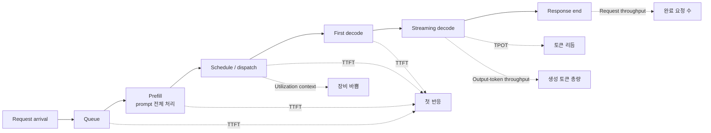
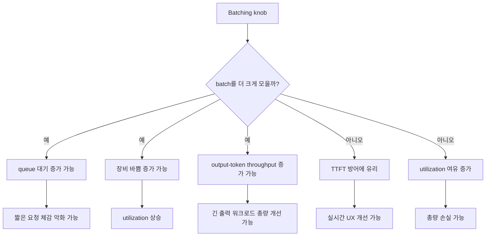
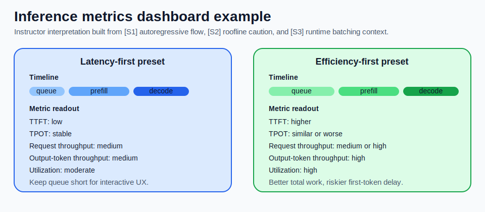

# LLM Inference Metrics

## 수업 개요
이 챕터는 `TTFT`, `TPOT`, `request throughput`, `output-token throughput`, `utilization`을 따로 외우지 않고, 요청이 들어온 뒤 첫 토큰이 나오고 응답이 끝날 때까지의 시간축 위에 다시 배치한다. 출처 기반 사실은 네 가지다. Transformer의 출력은 autoregressive하게 한 토큰씩 이어진다 [S1]. Roofline은 성능을 `peak FLOPs`만이 아니라 bandwidth ceiling과 arithmetic intensity로도 읽게 만든다 [S2]. vLLM 같은 serving runtime 문서는 scheduler, batching, KV cache 같은 실행 계층을 드러낸다 [S3]. 그리고 AWS Neuron 같은 벤더 runtime은 기능과 제약 변경을 release note 문맥으로 계속 공지한다 [S4].

운영 해석은 그다음이다. long context와 structured output workload에서는 단일 `TPS` 숫자 하나로는 체감 지연과 장비 효율을 같이 설명하기 어렵다. 그래서 이 수업은 `request throughput`과 `output-token throughput`을 분리하고, `TTFT`와 `TPOT`을 같은 대시보드에서 읽는 습관을 만든다. 이 문장은 `[S4]`의 직접 사실이 아니라 `[S1]`과 `[S3]`가 주는 생성 구조와 runtime 맥락을 바탕으로 한 운영 해석이다.

## 학습 목표
- `TTFT`를 `queue`, `prefill`, `schedule`, `first decode`로 나눠 설명할 수 있다.
- `TPOT`이 첫 토큰 이후의 decode 리듬을 나타낸다는 점을 설명할 수 있다.
- `throughput`을 `request throughput`과 `output-token throughput`으로 나눠 정의하고 각각의 쓰임을 말할 수 있다.
- `utilization`이 중요한 운영 지표이지만 목표 함수 그 자체는 아니라는 점을 설명할 수 있다.
- 출처 기반 사실과 교수자의 운영 해석을 구분해 사례별 우선 지표를 정할 수 있다.

## 수업 전에 생각할 질문
- 같은 시간에 완료한 요청 수가 늘었는데도 사용자가 더 답답하다고 느끼는 경우는 왜 생길까?
- `output-token throughput`이 높은데 `TTFT`가 나쁜 시스템은 어떤 사용자에게 특히 거슬릴까?
- 장문 계약서를 읽고 JSON을 반환하는 API라면 `request throughput`, `output-token throughput`, `TTFT` 중 무엇을 먼저 봐야 할까?

## 강의 스크립트
### Part 1. 지표는 숫자 목록이 아니라 시간축의 표식이다
**학습자:** 대시보드에 숫자가 너무 많습니다. 결국 "빠른가, 아닌가"만 보면 안 됩니까?

**교수자:** 그 질문이 제일 위험합니다. 출처 기반 사실부터 보죠. `[S1]`은 출력이 한 토큰씩 이어지는 autoregressive 생성이라는 점을 줍니다. `[S3]`는 serving에서 scheduler, batching, KV cache 같은 runtime 계층이 따로 존재한다는 맥락을 줍니다. 이 둘을 합치면 첫 토큰 전과 첫 토큰 후를 같은 속도 숫자로 덮어버리면 안 된다는 결론이 나옵니다.

**학습자:** 그러면 `TTFT`와 `TPOT`이 각각 앞부분과 뒷부분을 보는 건가요?

**교수자:** 맞습니다. 운영 해석으로 바꾸면 `TTFT`는 침묵 구간이고, `TPOT`은 스트리밍 리듬입니다. 총량 계열 지표는 `request throughput`과 `output-token throughput`으로 다시 나눠 봐야 하고, `utilization`은 장비가 얼마나 바빴는지 보는 맥락 지표입니다. 숫자 다섯 개를 따로 외우는 게 아니라, 하나의 요청 타임라인에 꽂아 넣어야 합니다.

### Part 2. `TTFT`는 첫 반응까지의 경로를 분해하게 만든다
**학습자:** `TTFT`가 길면 모델이 느리다고 봐도 되나요?

**교수자:** 출처 기반 사실로는 그렇게 단정할 수 없습니다. `[S3]`가 보여 주는 runtime 맥락에는 queueing과 scheduling이 있고, `[S1]`의 생성 구조를 runtime에 대응시키면 prompt를 한 번 읽는 prefill과 첫 decode 준비가 따로 있습니다. 그래서 `TTFT`는 "모델 한 번 돌리는 시간"이 아닙니다.

**학습자:** 그러면 `TTFT`를 바로 분해해야겠네요.

**교수자:** 그렇죠. 이 식은 암기용이 아니라 디버깅 순서용입니다.

$$
\mathrm{TTFT}=T_{\mathrm{queue}}+T_{\mathrm{prefill}}+T_{\mathrm{schedule}}+T_{\mathrm{first\ decode}}, \qquad
\mathrm{TPOT}=\frac{T_{\mathrm{response\ end}}-T_{\mathrm{first\ token}}}{N_{\mathrm{output}}-1}
$$

운영 해석: `TTFT`가 나쁘면 모델 아키텍처를 탓하기 전에 `queue -> prefill -> schedule -> first decode` 순으로 쪼개 본다. `TPOT`이 나쁘면 첫 토큰 이후 반복되는 decode 경로를 의심한다.

**학습자:** 같은 모델이라도 긴 문서 요청은 `TTFT`가 훨씬 불리하겠군요.

**교수자:** 네. 출처 기반 사실은 `[S1]`의 토큰 생성 구조와 `[S3]`의 runtime 계층뿐입니다. 운영 해석으로는 long context 요청일수록 `prefill` 비중이 커지고, 짧은 질의가 많은 서비스일수록 queue 정책이 `TTFT`를 더 크게 흔든다고 볼 수 있습니다.

### Part 3. `throughput`을 둘로 나누지 않으면 회의가 꼬인다
**학습자:** 그런데 현장에서는 아직도 `TPS`라고 한 줄로 말하던데요.

**교수자:** 그래서 회의가 자주 꼬입니다. `throughput`은 최소한 둘로 나눠야 합니다. `request throughput`은 완료한 요청 수이고, `output-token throughput`은 생성한 출력 토큰 수입니다. 두 값은 함께 좋아질 수도 있지만, 한쪽만 좋아질 수도 있습니다.

**학습자:** 예를 들면요?

**교수자:** FAQ 챗봇처럼 답이 짧은 서비스는 `request throughput`이 더 중요할 수 있습니다. 반대로 장문 요약기나 코드 생성기는 요청 수가 같아도 출력 길이가 길어 `output-token throughput`이 더 민감합니다. 같은 `TPS` 한 줄로 합치면 어느 쪽을 올렸는지 보이지 않습니다.

$$
\mathrm{Request\ Throughput}=\frac{N_{\mathrm{completed\ requests}}}{T_{\mathrm{wall}}}, \qquad
\mathrm{Output\mbox{-}Token\ Throughput}=\frac{\sum_i N_{\mathrm{output},i}}{T_{\mathrm{wall}}}, \qquad
\mathrm{Utilization}=\frac{T_{\mathrm{device\ busy}}}{T_{\mathrm{wall}}}
$$

출처 기반 사실: `[S3]`는 batching과 scheduler 같은 runtime 선택지가 총량에 영향을 주는 serving 맥락을 준다. 운영 해석: 그래서 bare `throughput`이라고만 보고하지 말고, 최소한 `request throughput`과 `output-token throughput`을 분리하고, 실시간 서비스에서는 이 둘 옆에 `TTFT`를 함께 둔다.

### Part 4. `TPOT`은 decode의 리듬이고, 그 해석에는 메모리 관점이 필요하다
**학습자:** 첫 토큰만 빨리 나오면 좋은 것 아닌가요?

**교수자:** 답이 한두 토큰이면 그럴 수 있습니다. 하지만 출력이 길어지면 사용자는 첫 토큰 뒤의 리듬을 금방 체감합니다. `[S2]`의 Roofline 관점은 여기서 중요합니다. 어떤 경로는 계산량보다 data movement에 더 묶일 수 있고 [S2], 반복되는 decode 단계는 바로 그런 의심을 하게 만드는 구간입니다.

**학습자:** 그러면 `TPOT`은 `peak FLOPs`보다 메모리 이동에 더 예민할 수 있다는 뜻이군요.

**교수자:** 그 문장은 `[S2]`에서 바로 가져온 일반식의 적용입니다. "항상 decode가 memory-bound다"라고 단정하면 과장입니다. 하지만 운영 해석으로는 `TPOT`이 나쁠 때 `모델이 크다`만 보지 말고 cache 접근과 반복 단계의 bytes moved를 함께 의심하라는 뜻입니다.

### Part 5. batching은 보통 한 지표를 올리고 다른 지표를 흔든다
**학습자:** 운영자는 결국 batch를 어떻게 잡느냐가 중요하겠네요.

**교수자:** 네. `[S3]`가 직접 주는 사실은 runtime이 batching과 scheduling을 가진다는 점입니다. 그다음부터는 운영 해석입니다. 더 큰 batch는 장비를 더 바쁘게 만들어 `output-token throughput`이나 `utilization`을 밀어 올릴 수 있습니다. 하지만 같은 순간에 들어온 짧은 요청은 queue에서 더 오래 기다릴 수 있으니 `TTFT`가 악화될 수 있습니다.

**학습자:** 결국 batch는 무조건 크게 잡는 게 아니라 서비스 목표에 맞춰야 하겠네요.

**교수자:** 맞습니다. `utilization`을 목표 함수처럼 다루면 여기서 자주 틀립니다. 출처 기반 사실은 `[S3]`가 runtime knobs를 제공한다는 점이고, 운영 해석은 `utilization`이 높아도 queue가 길면 실시간 서비스 품질은 나쁠 수 있다는 점입니다.

### Part 6. 사례 1. 실시간 코딩 도우미는 `TTFT`와 `TPOT`을 먼저 지킨다
**학습자:** 코딩 도우미처럼 짧은 요청과 긴 요청이 섞인 서비스는 어떤 순서로 봐야 합니까?

**교수자:** 우선순위는 보통 `TTFT -> TPOT -> request throughput -> utilization`입니다. 사용자는 첫 반응 공백과 스트리밍 끊김을 먼저 기억하기 때문입니다.

**학습자:** `output-token throughput`은 덜 중요합니까?

**교수자:** 덜 중요하다기보다 두 번째 줄입니다. 코드 생성처럼 길게 출력되는 요청에는 중요하지만, 짧은 수정 제안이 많은 서비스에서는 완료 요청 수와 첫 반응이 더 직접적입니다. 운영 해석으로는 짧은 요청 비중이 높을수록 큰 batch가 `request throughput`을 조금 올려도 `TTFT` 악화가 더 크게 느껴질 수 있습니다.

**교수자:** 흔한 오해도 있습니다. `utilization`이 60%면 비효율이라고 단정하는 겁니다. 실시간 서비스에서는 일부 여유를 남겨 `TTFT`를 지키는 설정이 오히려 정답일 수 있습니다. 이건 일반적 규칙이지, `[S3]`가 "60%가 좋다"라고 말해 준 사실은 아닙니다.

### Part 7. 사례 2. 장문 계약서 JSON 추출 API는 단일 `TPS`가 특히 위험하다
**학습자:** long context와 structured output이 같이 있으면 왜 더 복잡해집니까?

**교수자:** 출처 기반 사실부터 보죠. `[S1]`의 autoregressive 생성 구조 때문에 출력은 토큰 단위로 이어지고, `[S3]`의 runtime 맥락 때문에 긴 입력을 처리하는 prefill과 이후 decode를 따로 관찰할 수 있습니다. 운영 해석으로는 긴 계약서가 `TTFT`를 키우고, 엄격한 JSON 형식은 decode 단계의 안정성 문제를 따로 드러내기 쉽습니다.

**학습자:** 그래서 `output-token throughput`만 높아도 안심할 수 없겠네요.

**교수자:** 그렇습니다. 이 API에서는 `TTFT`, `output-token throughput`, `request throughput`을 함께 봐야 합니다. `output-token throughput`은 생성 총량을, `request throughput`은 같은 시간에 몇 건을 끝냈는지를 보여 주므로 둘이 같은 질문에 답하지 않습니다. 그리고 형식 유효성 실패율이나 재생성 비율 같은 보조 지표를 붙이는 게 안전합니다. 이 마지막 문장은 운영 해석입니다. `[S4]`를 이런 품질 지표의 직접 근거로 쓰면 과장이고, `[S4]`는 어디까지나 런타임과 배포 경로가 버전 문맥에서 계속 갱신된다는 최신성 보조 사례로만 둬야 합니다.

### Part 8. 문제 제기에서 시작하는 디버깅 순서
**학습자:** 장애가 났을 때는 네 지표를 어떤 순서로 봅니까?

**교수자:** complaint first로 갑니다.

1. "첫 반응이 늦다"면 `TTFT`부터 분해한다.
2. "첫 토큰 이후가 끊긴다"면 `TPOT`과 decode 구간을 본다.
3. "동시에 많이 못 받는다"면 `request throughput`과 `output-token throughput`을 분리해서 본다.
4. 그다음 `utilization`으로 장비 포화인지 정책 문제인지 맥락을 확인한다.

**교수자:** 이 순서가 중요한 이유는 숫자를 한꺼번에 올리려 하면 tradeoff를 숨기기 쉽기 때문입니다. `[S2]`는 ceiling이 하나가 아니라는 관점을 주고, `[S3]`는 runtime knob가 여러 개라는 맥락을 줍니다. 운영 해석으로는 한 지표의 개선이 다른 지표의 악화와 맞바뀌는지 항상 같이 봐야 합니다.

## 자주 헷갈리는 포인트
- 출처 기반 사실: 출력은 autoregressive하게 이어진다 [S1]. 운영 해석: 그래서 첫 토큰 전 구간과 첫 토큰 후 구간을 같은 속도 숫자로 보고하면 문제 위치가 가려진다.
- 출처 기반 사실: Roofline은 bandwidth ceiling과 arithmetic intensity를 함께 보게 만든다 [S2]. 운영 해석: `TPOT`이 나쁠 때는 FLOPs만 보지 말고 반복 단계의 data movement도 의심한다.
- 출처 기반 사실: serving runtime에는 scheduler, batching, KV cache 같은 계층이 있다 [S3]. 운영 해석: `TTFT` 문제를 모델 파라미터만으로 설명하려 들면 진단이 늦어진다.
- 일반적 규칙: `utilization`이 높다고 건강한 서비스라고 단정하지 않는다. queue가 길면 실시간 UX는 이미 나빠졌을 수 있다.
- 일반적 규칙: throughput 보고서는 `request throughput`과 `output-token throughput`을 분리해야 한다. 둘을 합쳐 `TPS` 한 줄로 내면 완료 요청 수를 올린 것인지, 출력 토큰 총량을 올린 것인지 보이지 않는다.
- 최신성 보조 사례: `[S4]`는 런타임 지원 경로가 버전 문서로 계속 갱신된다는 점을 보여 준다. 운영 해석: 벤더별 수치를 비교할 때는 runtime version을 같이 적는 습관이 필요하다.

## 사례로 다시 보기
### 사례 1. 실시간 코딩 도우미
- 먼저 볼 지표: `TTFT`, `TPOT`
- 두 번째 줄 지표: `request throughput`, `utilization`
- 이유: 짧은 요청이 많아 첫 반응과 스트리밍 리듬이 체감 품질을 좌우한다.
- 흔한 실수: batch를 키워 `utilization`과 `output-token throughput`을 올렸다고 만족하지만, 짧은 요청의 `TTFT` 악화를 놓친다.

### 사례 2. 장문 계약서 JSON 추출 API
- 먼저 볼 지표: `TTFT`, `output-token throughput`
- 두 번째 줄 지표: `request throughput`, 형식 유효성 실패율
- 이유: long context는 prefill을 키우고, structured output은 decode 안정성을 따로 보게 만든다.
- 흔한 실수: `TPS`가 좋아졌다는 이유로 배치 정책을 밀어붙였다가 첫 반응 지연과 재생성 비용을 함께 키운다.

### 사례 3. 야간 배치 요약 파이프라인
- 먼저 볼 지표: `request throughput`, `output-token throughput`
- 두 번째 줄 지표: `utilization`, 총 완료 시간
- 이유: 실시간 UX보다 제한된 시간 안에 얼마나 많이 끝내느냐가 중요하다.
- 흔한 실수: 배치 작업인데도 낮은 `TTFT`만 보고 좋은 설정이라고 판단해 총 완료량을 희생한다.

## 핵심 정리
- `TTFT`는 첫 반응까지의 합성 지표이고, `TPOT`은 첫 토큰 이후 decode 리듬이다.
- `throughput`은 최소한 `request throughput`과 `output-token throughput`으로 나눠 읽어야 한다.
- `[S2]`가 주는 Roofline 관점은 `TPOT` 해석에서 compute ceiling만 보지 않게 만든다.
- `[S3]`가 주는 runtime 맥락은 queue, batching, scheduling, KV cache 같은 운영 선택지가 지표를 흔든다는 사실을 보여 준다.
- 벤더 release note는 runtime 기능과 제약이 버전 문맥에서 갱신된다는 최신성 보조 사례다. structured output 보조 지표 같은 운영 규칙의 직접 근거로 과장해 쓰면 안 된다.

## 복습 체크리스트
- [ ] `TTFT`를 `queue`, `prefill`, `schedule`, `first decode`로 나눠 설명할 수 있다.
- [ ] `TPOT`이 왜 첫 토큰 이후의 체감 품질과 연결되는지 말할 수 있다.
- [ ] `request throughput`과 `output-token throughput`의 차이를 사례로 설명할 수 있다.
- [ ] `utilization`을 왜 맥락 지표라고 부르는지 설명할 수 있다.
- [ ] 실시간 코딩 도우미와 장문 계약서 JSON API에서 우선 지표 순서가 어떻게 달라지는지 비교할 수 있다.

## 대안과 비교
| 운영 우선순위 | 먼저 볼 지표 | 잘 맞는 워크로드 | 기대 이점 | 먼저 감시할 위험 |
| --- | --- | --- | --- | --- |
| 저지연 우선 | `TTFT`, `TPOT` | 채팅, 코드 도우미, 상담 UI | 첫 반응과 스트리밍 품질 개선 | `request throughput` 손실, 장비 여유 비용 |
| 총량 우선 | `request throughput`, `output-token throughput` | 야간 배치, 대량 요약 | 제한 시간 내 완료량 증가 | queue 누적, 짧은 요청 공정성 저하 |
| 긴 출력 우선 | `TPOT`, `output-token throughput` | 코드 생성, 장문 요약 | 긴 응답의 리듬과 총량 동시 관리 | `TTFT` 악화 은폐 |
| 형식 안정성 우선 | `TTFT`, 형식 유효성, `request throughput` | structured output API | 응답 시작과 결과 사용 가능성 동시 관리 | 재생성 비용, 단일 `TPS` 오판 |

## 참고 이미지

- 캡션: Roofline model
- 출처 번호: [I1]
- 왜 필요한가: `[S2]`의 핵심인 bandwidth ceiling과 arithmetic intensity를 한눈에 상기시키는 그림이다. 이 챕터에서는 `TPOT`을 "연산량 하나로만 해석하지 않는다"는 보조 배경으로 사용한다.

- 캡션: Inference metrics dashboard example
- 출처 번호: [I2], [S1], [S2], [S3]
- 왜 필요한가: 장식 역할의 로고 이미지를 빼고, queue/prefill/decode/batching이 `TTFT`, `TPOT`, `request throughput`, `output-token throughput`, `utilization`을 어떻게 서로 다르게 움직이는지 한 장에 묶는다. 그림 안의 비교 문장은 출처 기반 사실을 조합한 운영 해석이며, `[S4]`는 이 그림의 직접 근거로 쓰지 않았다.

## 출처
| 번호 | 제목 | 발행 주체 | 날짜 | URL | 사용 이유 |
| --- | --- | --- | --- | --- | --- |
| [S1] | Attention Is All You Need | Google Research / arXiv | 2017-06-12 | https://arxiv.org/abs/1706.03762 | autoregressive 생성과 Transformer 추론 경로의 기본 배경 |
| [S2] | Roofline: an insightful visual performance model for multicore architectures | Communications of the ACM | 2009-04-01 | https://dl.acm.org/doi/10.1145/1498765.1498785 | bandwidth ceiling, arithmetic intensity, data movement 관점의 성능 해석 |
| [S3] | vLLM Documentation | vLLM project | 2026-01-07 | https://docs.vllm.ai/en/latest/ | scheduler, batching, KV cache 등 serving runtime 관점에서 지표를 읽는 기준선 |
| [S4] | AWS Neuron release notes 2.26.0 | AWS Neuron | 2026-03-08 (accessed) | https://awsdocs-neuron.readthedocs-hosted.com/en/v2.26.1/release-notes/2.26.0/ | 런타임 기능과 배포 경로가 버전 문맥에서 관리된다는 최신성 보조 사례 |
