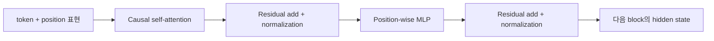
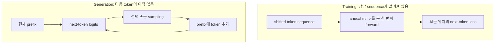

# Transformer와 Autoregressive Language Model

## 수업 개요
GPT 계열 모델을 이해하려면 Transformer라는 신경망 구조와 autoregressive라는 확률 모델링 방식을 분리해서 본 뒤 다시 결합해야 한다. Transformer는 token 표현이 attention과 feed-forward network를 통과하며 갱신되는 방법을 정한다. Autoregressive language model은 문장 확률을 왼쪽에서 오른쪽 조건부 확률의 곱으로 분해한다. Decoder-only LLM은 두 선택을 결합해, 주어진 prefix 다음에 올 token의 분포를 반복해서 예측한다 [S1][S2][S3].

이 챕터는 서빙 최적화를 설명하지 않는다. Transformer block의 내부, causal mask의 의미, 학습과 생성의 계산 의존성, 폭과 깊이가 표현 능력에 주는 영향을 먼저 세운다. 마지막에는 모델이 serving system에 넘기는 **의미론적 계약**만 정리한다. 그 계약을 어떻게 빠르게 실행할지는 서빙 시스템 설계 과정의 문제다.

## 학습 목표
- Transformer decoder block에서 self-attention, MLP, residual connection, normalization의 역할을 구분할 수 있다.
- causal mask가 미래 token의 정보 누출을 막으면서 모든 학습 위치의 loss를 동시에 계산하게 하는 원리를 설명할 수 있다.
- sequence probability와 next-token conditional probability의 관계를 식으로 설명할 수 있다.
- 같은 모델도 training에서는 여러 위치를 병렬 계산하지만 generation에서는 출력 의존성 때문에 순차적으로 진행되는 이유를 말할 수 있다.
- hidden width, layer depth, attention head, MLP가 표현과 capacity에 기여하는 방식을 과장 없이 설명할 수 있다.
- tokenizer, position, attention semantics, logits 등 serving system이 보존해야 할 model contract를 작성할 수 있다.

## 수업 전에 생각할 질문
- 정답 문장을 전부 알고 학습하는데도 왜 미래 token을 가려야 할까?
- 한 번의 forward pass에서 모든 위치의 예측을 만들 수 있다면, 생성도 한 번에 끝낼 수 있지 않을까?
- 파라미터 수가 큰 모델은 정확히 무엇을 더 저장하거나 계산할 수 있는가?

## 강의 스크립트

### Part 1. 구조와 확률 모델을 먼저 분리한다

**교수자:** 다음 문장의 확률을 모델링한다고 해 봅시다. `비가 와서 우산을 폈다.` 이 문장 전체의 확률을 한 숫자로 바로 예측해야 할까요?

**학습자:** 문장을 token으로 나누고, 앞 token을 조건으로 다음 token의 확률을 차례로 예측할 수 있습니다.

**교수자:** 그것이 autoregressive factorization입니다. 문맥 $c$와 token sequence $x_{1:n}$이 있을 때 chain rule로 다음처럼 씁니다.

$$
p_\theta(x_{1:n}\mid c)
=\prod_{i=1}^{n}p_\theta(x_i\mid c,x_{<i})
$$

이 식은 특정 신경망 구조를 요구하지 않습니다. RNN도 이 확률분해를 사용할 수 있습니다. GPT의 중요한 선택은 각 조건부 분포를 decoder-only Transformer로 parameterize한 것입니다 [S2][S3].

**학습자:** 그렇다면 `Transformer = autoregressive model`은 아니군요.

**교수자:** 맞습니다. 원래 Transformer에는 encoder와 decoder가 모두 있었고, encoder self-attention은 양방향이었습니다. Decoder의 masked self-attention만 미래 위치를 보지 못했습니다 [S1]. 이후 GPT 계열은 decoder 성격의 causal stack을 language model의 중심으로 삼았습니다 [S2][S3]. 구조와 확률분해를 같은 말로 취급하면 masked language model이나 diffusion language model과 비교할 때 혼란이 생깁니다.

### Part 2. 한 block 안에서 표현은 어떻게 바뀌는가

**학습자:** token ID가 들어간 뒤 다음-token 확률이 나오기까지, 한 Transformer block에서는 무슨 일이 일어납니까?

**교수자:** 먼저 token ID와 위치 정보가 hidden vector로 표현됩니다. 각 block은 크게 두 종류의 변환을 수행합니다. Self-attention은 현재 위치가 앞선 위치들의 정보를 선택해 섞게 하고, MLP는 각 위치에서 그 표현을 비선형적으로 변환합니다. Residual connection은 이전 표현과 새 변환을 더해 정보와 gradient가 여러 층을 지나갈 경로를 만들고, normalization은 activation의 척도를 조절합니다. 원래 Transformer는 residual을 더한 뒤 normalization하는 post-norm 순서였고 [S1], 이후 모델은 normalization 위치를 달리할 수 있으므로 checkpoint의 block 정의를 그대로 읽어야 합니다.

$$
Q=HW_Q,\quad K=HW_K,\quad V=HW_V
$$

$$
\mathrm{Attn}(H)=\mathrm{softmax}\!\left(\frac{QK^\top}{\sqrt{d_k}}+M\right)V
$$

여기서 $H$는 각 위치의 hidden state이고 $M$은 허용되지 않은 attention 연결에 매우 작은 값을 더하는 mask입니다. Multi-head attention은 서로 다른 projection을 사용해 여러 관계를 병렬로 표현한 뒤 다시 합칩니다 [S1].

**학습자:** Attention이 token 사이의 정보 이동이라면 MLP는 부수적인 층입니까?

**교수자:** 부수적이라고 보면 안 됩니다. Attention은 어떤 위치의 정보를 가져올지 정하지만, 가져온 표현을 특징 공간에서 변환하는 일은 MLP가 맡습니다. 원 논문의 decoder layer도 masked multi-head attention, encoder-decoder attention, position-wise feed-forward network를 별도 sublayer로 구성했습니다 [S1]. Decoder-only 모델에서는 encoder-decoder attention이 빠지고 causal self-attention과 MLP가 반복됩니다 [S2][S3].

### Part 3. Causal mask는 단순한 삼각형이 아니다

**교수자:** 네 token `나는 / 물을 / 마셨 / 다`를 학습한다고 하겠습니다. `물을` 위치의 hidden state가 `마셨`이나 `다`를 볼 수 있다면 어떤 문제가 생길까요?

**학습자:** 다음 token을 예측하면서 정답을 미리 보는 정보 누출이 생깁니다.

**교수자:** 그래서 위치 $i$는 자신과 그 이전 위치에만 attention할 수 있습니다. 행이 query 위치, 열이 key 위치라면 mask는 아래 삼각형 모양입니다.

| Query \ Key | 나는 | 물을 | 마셨 | 다 |
| --- | ---: | ---: | ---: | ---: |
| 나는 | 허용 | 차단 | 차단 | 차단 |
| 물을 | 허용 | 허용 | 차단 | 차단 |
| 마셨 | 허용 | 허용 | 허용 | 차단 |
| 다 | 허용 | 허용 | 허용 | 허용 |

Transformer 논문은 decoder가 이후 위치를 참조하지 못하도록 masking하고, output embedding을 한 위치 오른쪽으로 offset해 위치 $i$의 예측이 알려진 이전 출력에만 의존하게 했습니다 [S1]. GPT의 language-model objective도 이전 token들을 조건으로 다음 token의 log-likelihood를 최대화합니다 [S2].

**학습자:** 그런데 표의 대각선은 자기 자신을 볼 수 있습니다. 그러면 여전히 정답 누출 아닌가요?

**교수자:** 입력과 target을 한 칸 밀어 놓는다는 점이 중요합니다. 모델 입력 위치에 `나는`이 있다면 그 위치의 logits는 `물을`을 맞히는 데 사용됩니다. Hidden state가 입력 token 자신을 보는 것은 허용되지만, 예측 대상 token은 입력의 다음 위치입니다. `shifted input + causal mask + shifted target`을 하나의 계약으로 봐야 합니다.

### Part 4. 학습은 병렬인데 생성은 왜 순차적인가

**학습자:** Causal mask 때문에 각 위치가 앞만 본다면 학습도 왼쪽부터 한 칸씩 계산해야 하지 않습니까?

**교수자:** 학습 데이터에는 정답 prefix가 이미 전부 있습니다. 각 위치가 참조할 수 있는 범위만 mask로 제한하면, 행렬 연산 한 번에 여러 위치의 hidden state와 logits를 계산할 수 있습니다. 각 target에 대한 cross-entropy도 함께 합산합니다 [S1][S2].

$$
\mathcal{L}(\theta)
=-\sum_{i=1}^{n}\log p_\theta(x_i\mid c,x_{<i})
$$

**학습자:** 생성 시점에도 빈 위치를 미리 만들어 같은 계산을 하면 안 됩니까?

**교수자:** 아직 생성하지 않은 token은 정답 prefix로 넣을 수 없습니다. $x_i$를 샘플링해야 $x_{i+1}$의 조건이 완성됩니다. 따라서 autoregressive **확률 계약** 자체가 token 사이에 순서를 만듭니다. 모델이 각 step에서 내놓는 것은 완성 문장이 아니라 vocabulary 전체에 대한 다음-token logits입니다.

**교수자:** 이 차이를 흔히 `training은 parallel, generation은 sequential`이라고 요약합니다. 단, 학습이 모든 면에서 완전히 병렬이라는 뜻은 아닙니다. Layer는 순서대로 통과해야 합니다. 병렬화되는 것은 한 layer 안의 여러 token 위치이며, 생성의 token 의존성과 구분해야 합니다.

### Part 5. Logits에서 문장이 나오는 경계

**학습자:** 모델이 logits를 내놓는 순간 문장이 결정된 것 아닌가요?

**교수자:** 아닙니다. 마지막 hidden state $h_i$를 vocabulary 차원의 logits로 투영하고 softmax를 적용하면 조건부 분포가 됩니다.

$$
p_\theta(x_{i+1}=v\mid x_{\le i},c)
=\mathrm{softmax}(W_{out}h_i)_v
$$

그 분포에서 어떤 token을 고를지는 greedy, temperature sampling, top-k, nucleus sampling 같은 decoding policy가 결정합니다. Language model은 분포를 정의하고, decoding policy는 그 분포를 사용해 한 경로를 선택합니다. 둘을 구분해야 모델 품질 문제와 생성 정책 문제를 섞지 않습니다.

**학습자:** GPT-2가 다양한 task를 별도 supervised training 없이 수행한 것도 이 next-token objective만으로 가능했다는 주장입니까?

**교수자:** GPT-2 보고서는 충분히 크고 다양한 WebText에서 language modeling을 학습하면 task를 자연어 맥락으로 지정해 zero-shot behavior를 끌어낼 수 있음을 보였습니다 [S3]. 이것은 모든 능력이 보장된다는 뜻이 아니라, 단일 autoregressive objective가 다양한 조건부 패턴을 학습할 수 있다는 증거입니다.

### Part 6. 표현과 capacity를 무엇으로 읽을 것인가

**학습자:** 모델을 넓히거나 깊게 만들면 표현력이 커진다고 말합니다. 정확히 어떤 의미입니까?

**교수자:** 먼저 구조 수준에서 봅시다.

- `d_model`이 커지면 각 token 위치가 유지하는 hidden vector의 차원이 커진다.
- attention head와 projection은 token 사이의 서로 다른 관계를 표현할 여러 subspace를 제공한다.
- MLP의 중간 차원은 각 위치의 표현을 더 큰 특징 공간에서 변환할 여지를 준다.
- layer가 깊어지면 attention을 통한 정보 혼합과 MLP 변환을 여러 단계 합성할 수 있다.

그러나 `차원이 두 배면 능력이 두 배`처럼 해석할 수는 없습니다. Capacity는 데이터, 학습 compute, optimization과 함께 봐야 합니다. Scaling-law 연구는 model size, dataset size, training compute가 language-model loss와 예측 가능한 관계를 보인다고 보고했지만 [S4], Chinchilla 연구는 고정된 compute에서 큰 모델을 적은 token으로 학습하는 것보다 model size와 training token 수를 함께 조정하는 편이 낫다는 결과를 제시했습니다 [S5].

**학습자:** 그렇다면 파라미터가 많다는 것은 더 좋은 모델이라는 결론이 아니라, 더 큰 함수 공간을 학습할 가능성이 있다는 정도입니까?

**교수자:** 그 표현이 정확합니다. 구조가 제공하는 capacity와 실제 학습으로 얻은 능력은 다릅니다. 데이터가 부족하거나 optimization이 맞지 않으면 큰 capacity를 활용하지 못합니다. 반대로 같은 파라미터 수라도 tokenizer, context 구성, objective, 데이터 혼합이 달라지면 모델 행동이 달라집니다 [S4][S5].

### Part 7. 모델이 serving에 넘기는 계약

**교수자:** 이제 경계를 그어 봅시다. 학습된 autoregressive Transformer를 serving system에 전달할 때 무엇이 보존되어야 할까요?

**학습자:** 우선 weights와 tokenizer가 필요합니다.

**교수자:** 맞습니다. 여기에 의미론적 조건이 더 붙습니다.

| 계약 항목 | 모델 이론에서 정해지는 내용 | 어기면 생기는 문제 |
| --- | --- | --- |
| Tokenizer와 vocabulary | 문자열을 token ID로 바꾸는 규칙, special token, vocabulary index | 같은 문자열이 다른 ID가 되거나 logits 해석이 틀림 |
| Sequence convention | BOS/EOS, prompt와 continuation의 배치, 입력-target shift | 종료 조건과 next-token target이 달라짐 |
| Position semantics | position encoding 방식과 지원 위치 범위 | 같은 token sequence라도 다른 hidden state가 됨 |
| Attention semantics | causal visibility, padding 처리, 필요하면 local/grouped 구조 | 미래 정보 누출 또는 학습 때와 다른 조건부 분포 |
| Block architecture | layer 수, hidden/MLP 차원, head 구성, activation, normalization, residual 순서 | checkpoint tensor와 계산 그래프가 불일치 |
| Output semantics | 마지막 hidden state에서 vocabulary logits로 가는 projection과 weight tying 여부 | token probability가 잘못 계산됨 |
| Numeric requirements | weights dtype과 연산 중 허용되는 정밀도 오차 | 분포가 허용 범위 밖으로 달라질 수 있음 |

SentencePiece는 raw sentence에서 직접 subword model을 학습하고 language-independent tokenization을 제공하지만, normalization과 segmentation 규칙까지 모델 파일의 일부로 취급해야 재현됩니다 [S6]. Tokenizer가 단순한 전처리 유틸리티가 아니라 model contract인 이유입니다.

**학습자:** KV cache나 batching도 계약에 포함되지 않습니까?

**교수자:** causal attention에서 과거 위치의 key와 value가 이후 계산에 필요하다는 **수학적 의존성**까지는 모델 계약입니다. 그것을 저장할지 다시 계산할지, 요청끼리 어떻게 묶을지는 serving 구현의 선택입니다. 이 경계를 유지해야 모델 문서를 특정 엔진의 현재 최적화 기법으로 오염시키지 않습니다.

**학습자:** 그러면 serving system의 성공 조건은 모델과 똑같은 계산 순서를 그대로 흉내 내는 것입니까?

**교수자:** 계산 순서는 바꾸거나 합칠 수 있습니다. 중요한 것은 허용 오차 안에서 같은 tokenization, visibility, position, block function, logits semantics를 보존하는 것입니다. 빠른 구현은 계약의 의미를 보존하면서 실행 계획을 바꾸는 작업입니다.

## 자주 헷갈리는 포인트
- Transformer는 신경망 구조이고 autoregressive factorization은 확률분해다. 둘은 자주 결합되지만 같은 개념이 아니다.
- Causal mask는 학습을 token-by-token loop로 만드는 장치가 아니다. 정답 sequence가 주어진 학습에서는 여러 위치를 동시에 계산할 수 있다.
- Decoder-only Transformer의 `decoder`는 원래 encoder-decoder Transformer의 decoder와 완전히 동일하지 않다. 보통 cross-attention 없이 causal self-attention과 MLP를 쌓는다.
- 모델은 logits와 조건부 분포를 만든다. Temperature나 top-p 같은 선택 규칙은 decoding policy다.
- 파라미터 수는 capacity의 한 지표이지, 데이터와 compute가 통제되지 않은 모델 사이의 품질 보증서가 아니다 [S4][S5].
- Tokenizer와 position convention은 모델 밖의 사소한 설정이 아니라 checkpoint 의미를 재현하는 계약이다 [S6].

## 사례로 점검하기

### 사례 1. 학습 loss가 비정상적으로 낮다
학습 입력과 target을 같은 위치에 놓고 diagonal까지 허용했다. 모델은 문맥에서 다음 token을 추론한 것이 아니라 현재 위치의 정답 embedding을 읽었다. 해결은 attention만 무작정 더 가리는 것이 아니라 입력-target shift와 causal mask를 함께 확인하는 것이다.

### 사례 2. 같은 checkpoint인데 구현마다 출력이 다르다
Weights는 같지만 한 구현이 다른 tokenizer normalization을 사용했다. 첫 token부터 ID sequence가 달라졌으므로 이후 logits가 같은지 비교하는 것은 의미가 없다. 먼저 raw text, normalized text, token IDs, position IDs를 차례로 대조해야 한다 [S6].

### 사례 3. 큰 모델이면 항상 충분히 학습됐다는 주장
파라미터 수만 늘리고 training token 수를 고정했다면 추가 capacity가 충분히 학습되지 않을 수 있다. 고정 compute 조건에서는 model size와 dataset size의 배분을 함께 비교해야 한다 [S4][S5].

### 사례 4. Generation을 한 번의 forward로 바꾸자는 제안
빈 output slot을 미리 배치해도 각 token의 실제 조건은 앞에서 생성된 token이다. 한 번의 causal forward로 아직 모르는 prefix를 대신할 수 없다. 이 순서를 바꾸려면 단순 최적화가 아니라 모델의 factorization이나 generation algorithm 자체를 바꿔야 한다.

## 핵심 정리
- Autoregressive LM은 sequence probability를 왼쪽 prefix에 조건부인 next-token probability의 곱으로 분해한다 [S2][S3].
- Transformer block은 causal self-attention으로 위치 사이 정보를 섞고, MLP로 각 위치의 표현을 변환하며, residual과 normalization으로 깊은 합성을 구성한다 [S1].
- 학습에서는 정답 prefix가 알려져 있어 causal mask 아래 여러 위치의 loss를 동시에 계산할 수 있지만, 생성에서는 방금 선택한 token이 다음 조건이 되므로 token 의존성이 남는다.
- Width, depth, head, MLP dimension은 capacity를 형성하지만 실제 성능은 데이터와 training compute의 배분에 좌우된다 [S4][S5].
- Serving system은 tokenizer, sequence와 position convention, attention visibility, block architecture, output logits의 의미를 보존해야 한다. 캐시·배치·실행 계획은 그 계약을 지키는 범위에서 바꿀 수 있다.

## 복습 체크리스트
- [ ] Transformer 구조와 autoregressive factorization을 서로 다른 문장으로 정의할 수 있다.
- [ ] Input-target shift와 causal mask가 함께 필요한 이유를 설명할 수 있다.
- [ ] Training의 position 병렬성과 generation의 token 순차성을 구분할 수 있다.
- [ ] Attention과 MLP가 표현 갱신에서 맡는 역할을 비교할 수 있다.
- [ ] Model size만으로 품질을 단정할 수 없는 이유를 compute와 data 관점에서 말할 수 있다.
- [ ] Serving system에 전달할 model contract를 여섯 항목 이상 작성할 수 있다.

## 출처
| 번호 | 제목 | 발행 주체 | 날짜 | URL | 사용 이유 |
| --- | --- | --- | --- | --- | --- |
| [S1] | Attention Is All You Need | Vaswani et al. / NeurIPS | 2017-06-12 | [https://arxiv.org/abs/1706.03762](https://arxiv.org/abs/1706.03762) | Transformer encoder-decoder, scaled dot-product attention, multi-head attention, causal decoder mask, position-wise FFN의 원 출처 |
| [S2] | Improving Language Understanding by Generative Pre-Training | Radford et al. / OpenAI | 2018-06-11 | [https://cdn.openai.com/research-covers/language-unsupervised/language_understanding_paper.pdf](https://cdn.openai.com/research-covers/language-unsupervised/language_understanding_paper.pdf) | Transformer 기반 autoregressive language-model objective와 generative pretraining의 원 출처 |
| [S3] | Language Models are Unsupervised Multitask Learners | Radford et al. / OpenAI | 2019-02-14 | [https://cdn.openai.com/better-language-models/language_models_are_unsupervised_multitask_learners.pdf](https://cdn.openai.com/better-language-models/language_models_are_unsupervised_multitask_learners.pdf) | Decoder-only next-token modeling과 자연어 맥락에 따른 zero-shot behavior를 설명하는 1차 기술 보고서 |
| [S4] | Scaling Laws for Neural Language Models | Kaplan et al. / OpenAI | 2020-01-23 | [https://arxiv.org/abs/2001.08361](https://arxiv.org/abs/2001.08361) | Model size, dataset size, training compute와 language-model loss의 경험적 관계를 설명하는 원 논문 |
| [S5] | Training Compute-Optimal Large Language Models | Hoffmann et al. / DeepMind | 2022-03-29 | [https://arxiv.org/abs/2203.15556](https://arxiv.org/abs/2203.15556) | 고정 compute에서 model parameter와 training token 배분을 함께 봐야 한다는 근거 |
| [S6] | SentencePiece: A simple and language independent subword tokenizer and detokenizer for Neural Text Processing | Kudo and Richardson / EMNLP | 2018-08-19 | [https://aclanthology.org/D18-2012/](https://aclanthology.org/D18-2012/) | Tokenization과 normalization 규칙이 model input semantics를 구성한다는 1차 출처 |
