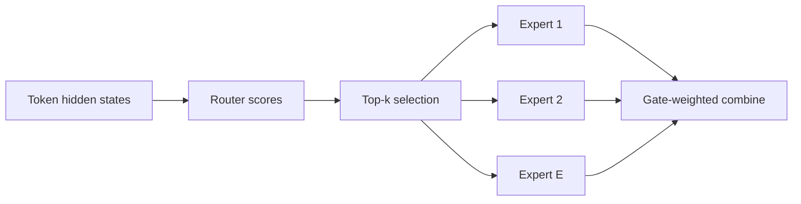

# MoE Architecture and Conditional Computation

## 수업 개요
Dense Transformer의 FFN은 모든 token에 같은 파라미터를 적용한다. Mixture-of-Experts(MoE)는 여러 FFN expert를 준비한 뒤 router가 token마다 일부 expert만 선택한다. 모델의 전체 용량은 늘리면서 한 token이 거치는 계산은 제한하는 `conditional computation`이 핵심이다 [S1].

이 장에서는 MoE를 분산 통신 기법이 아니라 모델 architecture로 읽는다. 총 파라미터와 활성 파라미터, router의 top-k 선택, capacity와 load-balancing objective를 차례로 살펴본다. 마지막에는 모델이 serving runtime에 넘겨야 할 contract를 명시한다. 실제 dispatch, all-to-all, placement와 EPLB는 `MoE Serving and Expert Parallelism` 장의 주제다.

## 학습 목표
- Dense FFN과 sparse MoE layer의 차이를 conditional computation 관점에서 설명할 수 있다.
- 총 파라미터 수와 token당 활성 파라미터 수를 구분할 수 있다.
- Router score, top-k gating, weighted combine의 forward path를 설명할 수 있다.
- Expert capacity와 overflow semantics가 모델 동작을 어떻게 바꾸는지 말할 수 있다.
- Load-balancing objective가 필요한 이유와 한계를 설명할 수 있다.
- GShard top-2와 Switch Transformer top-1을 구조적 trade-off로 비교할 수 있다.
- Runtime이 알아야 할 serving contract를 작성할 수 있다.

## 수업 전에 생각할 질문
- 파라미터가 열 배 많은 모델이 token당 계산량은 비슷할 수 있는가?
- Router가 항상 같은 expert를 고르면 큰 MoE의 용량을 활용한다고 볼 수 있는가?
- Capacity를 넘은 token을 버리는 것과 다른 expert로 보내는 것은 같은 모델인가?

## 강의 스크립트

### Part 1. MoE는 FFN을 조건부 경로로 바꾼다
**교수자:** Dense FFN에서는 hidden state $h_i$가 들어오면 모든 token이 같은 함수를 통과합니다. MoE layer는 그 자리에 $E$개의 expert와 router를 둡니다. Sparsely-Gated MoE의 핵심은 입력마다 작은 expert 부분집합만 활성화하는 것입니다 [S1].

$$
y_i = \sum_{e \in \operatorname{TopK}(g(h_i), k)} p_{i,e} f_e(h_i)
$$

$g$는 router logits, $p_{i,e}$는 선택 expert에 정규화된 gate weight, $f_e$는 expert FFN이다. 모든 expert를 계산한 뒤 일부 출력을 고르는 것이 아니라 선택된 expert만 실행하는 것이 sparse MoE의 계산 계약이다 [S1][S2].

**학습자:** Attention도 token마다 다른 위치를 고르는데 무엇이 다른가요?

**교수자:** Attention은 sequence 안의 정보 경로를 고르고, MoE router는 어떤 FFN 파라미터를 실행할지 고릅니다. 서로 다른 sparsity 축입니다.

### Part 2. 총 파라미터와 활성 파라미터는 다른 크기다
저장해야 하는 전체 expert와 한 token이 실제로 통과하는 expert를 나눠 세면 다음과 같다.

$$
\begin{aligned}
P_{\mathrm{total}} &\approx P_{\mathrm{shared}} + E P_{\mathrm{expert}} \\
P_{\mathrm{active/token}} &\approx P_{\mathrm{shared}} + k P_{\mathrm{expert}}
\end{aligned}
$$

$E$가 커져도 $k$를 작게 유지하면 전체 모델 용량과 token당 expert 계산을 분리할 수 있다 [S1][S2]. 하지만 이 식은 선택된 행렬 곱만 센다. Router, token 이동, padding과 expert별 batch 불균형까지 포함한 serving latency 식은 아니다.

**학습자:** Active parameter가 같은 두 MoE는 계산 특성도 같나요?

**교수자:** 아닙니다. Expert 수와 크기, top-k, router 분포, overflow 규칙이 다르면 같은 active parameter 수라도 모델의 함수와 실행 경로가 달라집니다.

### Part 3. Router는 선택과 혼합을 함께 정의한다
Top-k가 2라면 한 token은 두 expert 출력을 gate weight로 합친다. GShard는 top-2 gating을 대규모 multilingual Transformer에 적용하면서 capacity와 auxiliary loss를 함께 설계했다 [S2]. Switch Transformer는 expert 하나만 고르는 top-1 routing으로 경로를 단순화하면서도 큰 sparse model의 이득을 보였다 [S3].

| 항목 | GShard top-2 | Switch top-1 |
| --- | --- | --- |
| token당 expert | 최대 2개 | 1개 |
| 출력 | 두 expert 출력의 가중 결합 | 선택 expert 출력 |
| 구조적 장점 | 복수 expert 표현 혼합 | routing과 실행 경로 단순화 |
| 함께 볼 조건 | 두 경로의 capacity와 gate weight | 단일 경로 집중과 overflow |
| 근거 | [S2] | [S3] |

**학습자:** Top-2가 표현력이 더 크니 항상 낫다고 보면 될까요?

**교수자:** 두 변환을 혼합할 수 있지만 두 경로를 모두 실행해야 하고 router도 이를 안정적으로 배분해야 합니다. Top-1과 top-2는 단순한 품질 서열이 아니라 허용할 expert 혼합과 sparse 실행의 복잡도 사이의 선택입니다.

### Part 4. Capacity는 모델 semantics다
한 batch의 token이 같은 expert를 선택할 수 있으므로 expert별 입력 크기는 흔들린다. GShard와 Switch Transformer는 expert가 한 routing group에서 처리할 token slot을 capacity로 제한한다 [S2][S3].

$$
C_e = \left\lceil \alpha \frac{B k}{E} \right\rceil
$$

$B$는 routing group의 token 수, $k$는 top-k, $E$는 expert 수, $\alpha$는 capacity factor다. 균등 분배 기대치에 여유분을 둔 학습용 표현이다 [합성] [S2][S3].

**학습자:** Capacity를 넘은 token은 runtime이 알아서 처리하면 되지 않나요?

**교수자:** 그 처리가 모델의 함수에 영향을 줍니다. 초과 token을 drop하고 residual만 남길지, 차선 expert로 보낼지, 더 큰 capacity로 패딩할지에 따라 forward 결과가 달라진다 [S2][S3]. Routing group과 overflow 규칙은 모델 정의에 포함되어야 합니다.

### Part 5. Load balancing은 expert collapse를 막는다
Task loss만 최적화하면 router가 소수 expert를 반복 선택할 수 있다. 그러면 나머지 expert는 충분한 token을 받지 못하고 conditional capacity도 활용되지 않는다. 초기 Sparsely-Gated MoE부터 importance와 load의 균형을 위한 보조 손실을 사용했고 [S1], GShard와 Switch Transformer도 expert 사용을 분산시키는 목적을 유지한다 [S2][S3].

$$
\mathcal{L}=\mathcal{L}_{\mathrm{task}}+\lambda\mathcal{L}_{\mathrm{balance}}
$$

**학습자:** 그러면 추론에서도 모든 expert가 같은 수의 token을 받나요?

**교수자:** 아닙니다. 보조 손실은 균형을 유도할 뿐 강제하지 않는다. 실제 prompt 분포가 달라지면 hot expert가 생길 수 있고, 지나치게 강한 균형 제약은 유용한 specialization을 방해할 수도 있습니다.

### Part 6. Serving contract를 명시한다
Runtime이 같은 모델을 재현하려면 weight만으로 부족하다.

| Contract 항목 | 모델이 정의해야 하는 내용 | 누락 시 문제 |
| --- | --- | --- |
| Expert layout | layer별 expert 수, FFN shape, shared expert | weight 배치와 kernel 선택 불가 |
| Routing | score 정규화, top-k, gate weight 결합 | token 경로와 출력 변화 |
| Capacity | routing group, factor 또는 고정 capacity | buffer와 overflow 판단 불명확 |
| Overflow semantics | drop, residual, reroute 등 | 구현마다 모델 의미가 달라짐 |
| Precision | router와 expert dtype | routing 안정성과 수치 결과 변화 |
| Observability keys | expert id, token count, overflow 집계 위치 | skew와 모델 동작 연결 불가 |

**학습자:** Expert를 어느 GPU에 둘지도 모델 contract인가요?

**교수자:** Expert id와 weight 구조는 모델 contract지만 특정 GPU나 node에 놓는 결정은 serving plan입니다. 모델은 `무엇을 선택하고 어떻게 합칠지`, runtime은 `어디로 보내고 어떻게 기다릴지`를 책임집니다.

## 자주 헷갈리는 포인트
- MoE는 여러 모델을 ensemble하는 방식이 아니라 한 layer에서 token별 expert FFN을 선택하는 architecture다 [S1].
- 전체 파라미터가 크다는 말은 token당 FLOPs가 그만큼 크다는 뜻이 아니다.
- Top-k는 forward graph와 출력 결합 방식을 정의하는 모델 값이다 [S2][S3].
- Overflow 처리는 runtime 편의 기능에 그치지 않으며 모델 출력에 영향을 줄 수 있다 [S2][S3].
- Load-balancing loss는 완전한 균형을 보장하지 않는다 [S1][S2][S3].

## 핵심 정리
- MoE의 본질은 일부 expert만 token별로 실행하는 conditional computation이다 [S1].
- $P_{\mathrm{total}}$과 $P_{\mathrm{active/token}}$을 분리하면 모델 용량과 token당 expert 계산을 따로 볼 수 있다.
- GShard top-2와 Switch top-1은 expert 혼합과 실행 단순성 사이에서 다른 선택을 한다 [S2][S3].
- Serving에는 top-k, capacity, overflow와 combine 규칙을 checkpoint와 함께 넘겨야 한다.

## 복습 체크리스트
- Dense FFN을 MoE로 바꾸면 어떤 함수가 새로 생기는지 설명할 수 있는가?
- 총 파라미터와 활성 파라미터를 식으로 구분할 수 있는가?
- Top-2와 top-1의 출력 결합 차이를 설명할 수 있는가?
- Capacity overflow 정책이 모델 semantics인 이유를 말할 수 있는가?
- Serving contract를 다섯 가지 이상 적을 수 있는가?

## 출처
| 번호 | 제목 | 발행 주체 | 날짜 | URL | 사용 이유 |
| --- | --- | --- | --- | --- | --- |
| [S1] | Outrageously Large Neural Networks: The Sparsely-Gated Mixture-of-Experts Layer | Google Research / arXiv | 2017-01-23 | https://arxiv.org/abs/1701.06538 | conditional computation, sparse gating, load-balancing objective의 출발점 |
| [S2] | GShard: Scaling Giant Models with Conditional Computation and Automatic Sharding | Google Research / arXiv | 2020-06-29 | https://arxiv.org/abs/2006.16668 | top-2 gating, expert capacity와 distributed MoE 구조 |
| [S3] | Switch Transformers: Scaling to Trillion Parameter Models with Simple and Efficient Sparsity | Google Research / JMLR | 2022-01-01 | https://arxiv.org/abs/2101.03961 | top-1 routing, capacity와 overflow 처리 단순화 |
