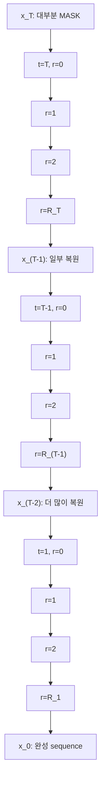
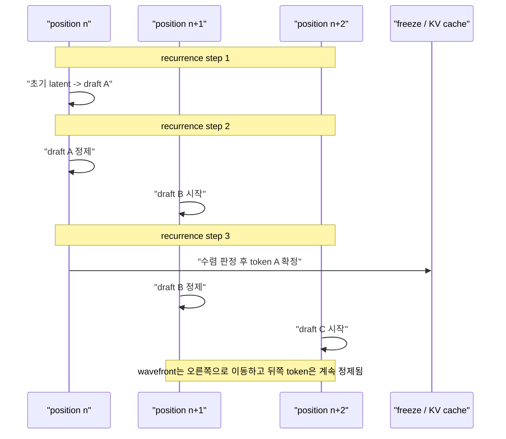
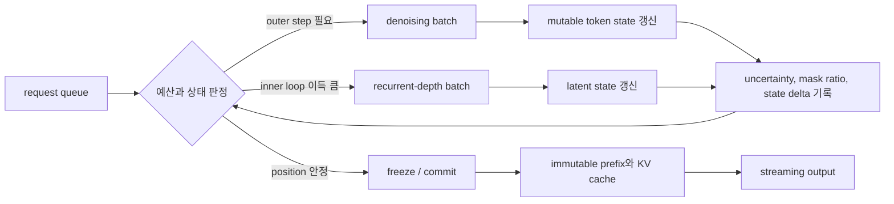

# 수렴으로 보는 반복 정제: Diffusion LLM과 Recurrent-Depth Transformer

## 수업 개요
Diffusion LLM과 looped/recurrent-depth Transformer는 서로 다른 계보에서 출발했다. 전자는 오염된 token sequence를 여러 denoising step에 걸쳐 복원하는 생성 모델이고, 후자는 같은 Transformer block을 깊이 방향으로 반복해 hidden state를 정제하는 architecture다. 학습 objective, 상태 공간, attention mask, 출력 확정 방식이 다르므로 둘을 같은 모델이라고 부르면 틀린다 [S1][S2][S3].

그런데 inference trace를 한 단계씩 펼쳐 보면 둘은 같은 질문을 던진다. `현재 상태에 공유된 update operator를 한 번 더 적용하면 답이 더 좋아지는가?` 이 관점에서는 token-space denoising과 hidden-space recurrence를 모두 반복 정제(iterative refinement)로 표현할 수 있다. 2025년의 *Efficient Parallel Samplers for Recurrent-Depth Models and Their Connection to Diffusion Language Models*는 이 유사성을 sampler 수준에서 실제 병렬 생성으로 연결했고, 2026년의 LoopMDM과 R-MDM은 diffusion step 내부에 recurrent depth를 넣어 두 축을 하나의 모델 안에서 결합했다 [S4][S5][S6].

이 챕터의 목표는 두 계열을 억지로 동일시하는 것이 아니다. 공통 상태 전이식이 무엇을 설명하고 무엇을 숨기는지, `denoising-step x recurrent-depth`의 2차원 계산 공간이 왜 생기는지, 수렴과 종료를 serving system이 어떤 계약으로 바꿔야 하는지를 정확히 구분한다. batching, cache layout, scheduler 구현은 챕터 04에서 자세히 다루고 여기서는 모델과 sampler가 serving에 요구하는 조건까지만 도출한다.

## 학습 목표
- Diffusion LLM과 recurrent-depth Transformer를 공통 상태 전이식으로 표현할 수 있다.
- 공통 식의 `상태`, `조건`, `시간`, `종료 조건`이 두 계열에서 어떻게 다른지 설명할 수 있다.
- 2510.14961의 diffusion-forcing sampler가 recurrent-depth decoding을 대각선 wavefront로 병렬화하는 원리를 설명할 수 있다.
- LoopMDM과 R-MDM이 diffusion step 내부에 recurrence를 넣는 방식과 실험 범위의 차이를 구분할 수 있다.
- denoising step과 recurrent depth를 독립적인 test-time compute 축으로 보고 예산을 배분할 수 있다.
- 수렴 판정, token freeze, mutable state, KV sharing이 기존 AR serving 계약을 어떻게 바꾸는지 설명할 수 있다.

## 수업 전에 생각할 질문
- 같은 함수를 여러 번 호출한다는 사실만으로 그 모델을 diffusion model이라고 부를 수 있는가?
- denoising step을 절반으로 줄이고 각 step의 recurrent depth를 두 배로 늘리면 계산량과 품질이 같은가?
- 아직 바뀔 수 있는 token과 이미 확정된 token을 한 batch에 넣으려면 scheduler는 무엇을 추적해야 하는가?
- hidden state의 변화량이 작아졌다는 사실은 정답이 맞다는 뜻인가, 단지 잘못된 상태에 멈췄다는 뜻인가?

## 강의 스크립트

### Part 1. 두 계보가 만나는 질문: 무엇이 한 번 더 좋아지는가
**교수자:** 먼저 두 모델을 가장 짧은 식으로 써 보겠습니다.

$$
z_{k+1}=F_\theta(z_k, k, c)
$$

$z_k$는 현재 상태, $F_\theta$는 반복 적용되는 update operator, $k$는 반복 단계, $c$는 변하지 않거나 천천히 바뀌는 조건입니다. 이 식은 diffusion에도 recurrence에도 쓸 수 있습니다.

**학습자:** 식이 같으면 결국 같은 architecture를 다른 이름으로 부르는 것 아닙니까?

**교수자:** 아닙니다. 식은 계산의 골격만 남긴 추상화입니다. masked diffusion LM에서는 $z_k$가 `[MASK]`를 포함한 token sequence 또는 그 분포이고, $k$는 noise level에서 clean data로 가는 denoising time입니다. recurrent-depth Transformer에서는 $z_k$가 hidden representation이고, $k$는 같은 block을 몇 번 통과했는지를 뜻합니다 [S1][S2][S3].

같은 미분방정식 꼴로 표현된 두 물리계가 같은 물질은 아니듯, 같은 상태 전이 꼴로 썼다고 학습 분포와 생성 의미까지 같아지지는 않습니다. 대신 이 식은 두 계열에 공통으로 물을 수 있는 질문을 줍니다.

- update가 수렴하는가?
- 몇 번 반복해야 충분한가?
- 모든 위치에 같은 반복 횟수가 필요한가?
- 중간 상태를 읽거나 확정해도 되는가?
- 반복을 늘릴 때 품질이 단조롭게 좋아지는가?

**학습자:** 그러면 `수렴`은 두 계열을 합치는 정의가 아니라 비교 좌표입니까?

**교수자:** 정확합니다. 이 챕터에서 수렴은 family name이 아니라 runtime behavior를 읽는 좌표입니다.

### Part 2. 바깥 반복과 안쪽 반복
**교수자:** 두 계열을 한 모델 안에 놓으면 반복축이 두 개 생깁니다. diffusion의 denoising step을 $t$, recurrent depth를 $r$이라고 하겠습니다.

$$
h_{t,0}=E_\theta(x_t,t,c),\qquad
h_{t,r+1}=R_\theta(h_{t,r},x_t,t,r,c),\qquad
x_{t-1}\sim D_\theta(h_{t,R_t})
$$

바깥쪽에서는 $x_t$가 $x_{t-1}$로 이동합니다. mask가 줄거나 token posterior가 바뀌는 diffusion trajectory입니다. 안쪽에서는 같은 denoising step $t$를 유지한 채 hidden state $h_{t,r}$를 반복해서 정제합니다. $R_t$는 step마다 다를 수도 있습니다.

#### 시각 자료 1. denoising step x recurrent depth 계산 격자

**학습자:** 총 계산량은 결국 $T\times R$이니 어느 축에 쓰든 같지 않습니까?

**교수자:** FLOP의 거친 상한만 보면 그렇게 보일 수 있습니다.

$$
C_{\text{iter}}\approx\sum_{t=1}^{T}R_t\,C_R(L_t,B_t)+\sum_{t=1}^{T}C_{\text{outer}}(L_t,B_t)
$$

하지만 두 축은 교환 가능하지 않습니다. denoising step을 한 번 진행하면 visible/masked token의 구성과 sampling distribution이 바뀝니다. recurrent depth를 한 번 늘리면 같은 $x_t$를 조건으로 hidden computation만 깊어집니다. 전자는 생성 상태를 이동시키고, 후자는 그 이동을 결정하는 계산을 더 수행합니다. `네 번 얕게 복원`과 `한 번 깊게 복원`은 같은 transition kernel이 아닙니다.

### Part 3. Diffusion LLM의 수렴: token 상태를 복원한다
**교수자:** masked diffusion LM의 시작 상태는 보통 많은 위치가 mask인 sequence입니다. denoiser는 양방향 context를 사용해 clean token posterior를 예측하고, sampler가 일부 위치를 unmask하거나 다시 mask합니다. MDLM은 absorbing-mask diffusion objective를 weighted masked-LM loss로 단순화해 이 계열의 학습과 likelihood를 정리했습니다 [S2].

**학습자:** 매 step에서 모델은 이미 정답 분포를 예측하는데 왜 여러 step이 필요합니까?

**교수자:** 여러 masked position의 답은 서로 의존하기 때문입니다. 한 번의 forward pass에서 각 위치의 marginal prediction이 그럴듯해도, 동시에 확정한 조합이 일관되지 않을 수 있습니다. 한 위치가 드러나면 다음 pass의 조건이 달라지고 다른 위치의 posterior도 바뀝니다. 반복은 `모델이 같은 질문을 못 알아들어서`가 아니라 `조건 자체가 점진적으로 구체화되기 때문에` 필요합니다.

여기서 수렴은 하나로 정의되지 않습니다.

- 정해진 noise schedule의 마지막 step에 도달한다.
- 남은 mask 수가 0이 된다.
- token prediction 또는 posterior 변화가 threshold 아래로 내려간다.
- 품질을 유지하는 범위에서 early exit criterion을 만족한다.

이 중 첫 두 개는 절차적 종료이고, 뒤 두 개는 상태 기반 종료입니다. 어느 것도 정답성을 직접 보증하지 않습니다. 특히 적은 step sampler는 denoiser가 정확해도 목표 분포와 다른 transition을 만들 수 있으므로, `빠르게 안정됨`과 `올바른 분포에서 샘플링됨`을 구분해야 합니다.

### Part 4. Recurrent depth의 수렴: hidden state를 깊게 한다
**교수자:** Universal Transformer는 self-attention과 transition function을 깊이 방향으로 반복하고 adaptive computation time을 결합했습니다 [S1]. 현대 recurrent-depth LLM은 이 생각을 큰 decoder-only model로 확장합니다. Huginn 계열은 prelude $P$, recurrent block $R$, coda $C$로 나눌 수 있습니다 [S3].

$$
e=P(x),\qquad s_0\sim\mathcal{N}(0,\sigma^2I),\qquad
s_{r+1}=R(e,s_r),\qquad p=C(s_R)
$$

**학습자:** random state에서 시작해 반복 정제한다면 이것은 이미 continuous diffusion 아닙니까?

**교수자:** inference 모양은 강하게 닮았습니다. 2510.14961도 Huginn의 random latent state가 입력 $e$에 조건화되어 반복적으로 정제된다는 점에서 `continuous, though causal, diffusion language model`로 볼 수 있다고 제안합니다 [S4]. 그러나 제한어를 빼면 안 됩니다.

Huginn은 randomized unrolling과 truncated backpropagation으로 recurrent computation을 학습한 causal LM입니다 [S3][S4]. 표준 diffusion처럼 명시적인 forward corruption process와 그 역과정의 likelihood objective로 학습한 모델이 아닙니다. hidden state가 처음에는 random하다는 사실만으로 확률적 diffusion 정의가 자동으로 생기지 않습니다.

**학습자:** 그렇다면 recurrent depth에서 수렴은 무엇을 봅니까?

**교수자:** hidden state의 상대 변화량, logit 안정성, token prediction의 변화, 최대 recurrence budget 등을 볼 수 있습니다. 가장 단순한 latent criterion은 다음과 같습니다.

$$
\delta_r=\frac{\lVert s_r-s_{r-1}\rVert_2}{\lVert s_r\rVert_2}
$$

$\delta_r<\epsilon$이면 충분히 안정되었다고 판정할 수 있습니다. 다만 작은 변화량은 correctness가 아니라 local stability입니다. update operator가 contraction이면 fixed point 수렴을 논할 수 있지만, 실제 대규모 recurrent block이 contraction이라는 보장은 없습니다 [S4][S7].

### Part 5. 2510.14961: 깊이를 기다리지 않고 대각선으로 생성한다
**교수자:** 표준 recurrent-depth AR decoding은 token 하나에 $R$회의 recurrence를 모두 쓴 뒤 다음 token으로 이동합니다. 시간축으로 그리면 직사각형의 한 열을 끝까지 내려간 뒤 옆 열로 가는 방식입니다. 2510.14961은 이 순서를 바꿉니다 [S4].

중간 recurrence에서도 coda로 draft token을 읽고 다음 위치를 열어 둡니다. 다음 forward pass에서는 앞 위치의 latent를 더 정제하면서 새 위치의 초기 draft도 함께 계산합니다. recurrence depth와 token position을 대각선 wavefront로 전진시키는 셈입니다.

#### 시각 자료 2. recurrent-depth의 대각선 diffusion-forcing wavefront

**학습자:** causal model인데 미래 위치를 병렬로 만들면 앞 token이 바뀔 때 모순이 생기지 않습니까?

**교수자:** 그래서 input injection과 course correction이 중요합니다. 앞 위치의 draft가 바뀌면 뒤 위치의 recurrent state는 바뀐 condition을 받아 다시 정제됩니다. 정보 흐름은 여전히 왼쪽에서 오른쪽이지만, 아직 확정하지 않은 여러 위치의 계산이 겹칩니다. full-sequence masked diffusion의 양방향 복원과는 다르고, token마다 서로 다른 refinement age를 갖는 diffusion forcing과 닮았습니다 [S4][S8].

이 sampler에는 세 가지 운영 조건이 있습니다.

1. recurrent block이 매 반복에서 input을 다시 주입받아 condition 변화에 적응해야 한다.
2. 중간 recurrence state에서도 대략 의미 있는 token을 decode할 수 있어야 한다.
3. 가능하면 recurrence 사이에서 KV state를 공유해 cache가 `sequence length x recurrence depth`로 커지지 않아야 한다.

논문은 3.5B Huginn checkpoint에 추가 tuning 없이 sampler를 적용해 최대 5배 speedup을 보고했습니다. 그러나 batch size 1의 연구 구현 결과이고, FLOP을 줄이는 방법이 아니라 현대 accelerator에서 더 넓은 token wavefront를 병렬 처리해 wall-clock을 줄이는 방법입니다. prelude/coda 재실행과 늦은 token 변경의 cascading convergence cost도 추가됩니다 [S4]. 따라서 `5배`를 모든 모델과 serving 환경의 보장값으로 읽어서는 안 됩니다.

### Part 6. LoopMDM: diffusion denoiser의 중간층을 선택적으로 반복한다
**교수자:** LoopMDM은 연결을 더 직접적으로 만듭니다. 모델 자체가 masked diffusion LM이고, 한 denoising step 안에서 Transformer의 early-middle layer를 반복합니다 [S5]. 앞부분은 token representation을 만들고, 중간의 공유 block을 $S$번 적용하며, 뒷부분은 최종 clean-token prediction으로 투영합니다.

**학습자:** 전체 denoiser를 반복하지 않고 왜 중간층만 고릅니까?

**교수자:** loop placement가 기능을 바꾸기 때문입니다. 저자들의 ablation에서는 early-middle layer 반복이 가장 좋았습니다. 너무 이른 층은 low-level representation이 아직 안정되지 않았고, 너무 늦은 층은 최종 prediction에 특화되어 반복 정제의 작업 공간으로 덜 적합하다는 해석입니다 [S5]. 이것은 모든 architecture에 대한 정리가 아니라 해당 실험에서 관찰한 설계 신호입니다.

LoopMDM은 training마다 loop count $S\sim U\{1,\ldots,S_{max}\}$를 샘플링하고 마지막 loop output에 표준 MDM NELBO를 적용합니다. 그래서 inference에서 loop count를 바꿀 수 있고, 학습 범위를 넘는 반복도 시험할 수 있습니다. parameter count는 그대로지만 looped layer가 여러 번 실행되므로 per-step FLOP은 증가합니다.

**학습자:** 이미 diffusion step이 반복 정제를 하는데 내부 loop가 왜 또 필요합니까?

**교수자:** 바깥 step은 mask pattern과 token state를 바꾸고, 안쪽 loop는 같은 mask pattern 아래에서 masked position 사이의 상호작용을 더 계산합니다. LoopMDM의 분석에서는 loop 수가 늘면서 mask-to-mask attention이 증가하고 training maximum 근처에서 포화하는 경향이 관찰됐습니다. Sudoku 예시에서는 초기 loop의 locally plausible하지만 globally inconsistent한 배치를 뒤 loop가 수정했습니다 [S5]. 이 결과는 `mask 위치가 빈칸일 뿐 아니라 계산 workspace가 될 수 있다`는 해석을 지지하지만, attention 증가만으로 인과 메커니즘이 증명된 것은 아닙니다.

저자들은 같은 크기의 MDM과 비교해 최대 3.3배 적은 training FLOPs로 성능을 맞추고 GSM8K에서 최대 8.5 point 향상을 보고했습니다 [S5]. 숫자는 사용한 model scale, corpus, loop placement, benchmark 조건에 속합니다. `모든 diffusion LLM을 loop로 바꾸면 3.3배 싸진다`는 일반 법칙은 아닙니다.

### Part 7. R-MDM: denoiser 전체 재귀를 세 번째 scaling axis로 만든다
**교수자:** R-MDM은 *Recursive Scaling in Masked Diffusion Models*, arXiv:2606.18022가 제안한 구조입니다 [S6]. 논문은 parameter count와 denoising step 외에 recursive depth를 세 번째 scaling axis로 둡니다. $K$개 layer로 된 denoising Transformer block $f_\theta$를 같은 diffusion step에서 $L$번 공유 적용합니다.

$$
h^{(0)}=E(x_t,t),\qquad
h^{(\ell)}=f_\theta\bigl(\operatorname{Norm}(h^{(\ell-1)}+v^{(\ell)}),t\bigr),\qquad
p_\theta(x_0\mid x_t)=D(h^{(L)})
$$

$v^{(\ell)}$는 현재 recursive step을 알려 주는 embedding입니다. 같은 block이 반복되더라도 각 loop가 계산 과정의 어디인지 구분할 수 있게 합니다 [S6].

**학습자:** LoopMDM과 이름만 다른 구현입니까?

**교수자:** 겹치는 핵심은 있지만 실험적 초점이 다릅니다.

| 비교축 | LoopMDM [S5] | R-MDM [S6] |
| --- | --- | --- |
| 반복 범위 | early-middle layer의 선택적 loop | 같은 denoising Transformer block의 recursive application |
| loop conditioning | stochastic loop count로 여러 depth에 노출 | recursive-step embedding과 여러 depth schedule 분석 |
| 핵심 질문 | 어느 layer를 반복해야 language MDM이 효율적인가 | recursive depth가 parameter/denoising-step scaling을 대체할 수 있는가 |
| 주요 실험 | language modeling, downstream reasoning, Sudoku 분석 | Sudoku, Countdown, Text8 중심 |
| 해석 범위 | language MDM architecture 설계 신호 | structured generation에서의 parameter와 compute trade-off가 강한 증거 |

R-MDM은 $L$회의 recursion을 쓴 모델이 종종 약 $L$배 parameter를 가진 non-recursive baseline과 비슷한 성능을 낸다고 보고했습니다. 또한 recursive refinement가 일부 denoising step을 대체할 수 있음을 보였습니다 [S6]. 그러나 주된 증거가 Sudoku와 Countdown 같은 structured task에 집중되어 있으므로 범용 instruction-following LLM까지 그대로 일반화하면 안 됩니다.

### Part 8. 두 반복축은 경쟁하면서도 협력한다
**학습자:** 그러면 latency budget이 32회 forward pass라면 $T=32,R=1$과 $T=8,R=4$ 중 무엇이 낫습니까?

**교수자:** 모델과 task에 따라 다릅니다. 결정에는 최소 네 가지 곡선이 필요합니다.

- fixed $R$에서 $T$를 늘릴 때의 quality curve
- fixed $T$에서 $R$을 늘릴 때의 quality curve
- 각 $(T,R)$에서 실제 kernel latency와 memory traffic
- step별 mask ratio 또는 uncertainty에 따른 marginal gain

초기 denoising step에는 mask가 많아 전역 구조를 잡아야 하므로 더 깊은 recurrence가 유리할 수 있습니다. 반대로 clean state에 가까운 후반에는 적은 loop로도 충분할 수 있습니다. LoopMDM은 denoising timestep에 따라 looping의 효과가 균일하지 않으며 adaptive loop allocation이 compute efficiency를 높일 수 있다고 보고합니다 [S5]. R-MDM도 recurrence와 denoising step 사이의 대체 가능성을 실험하지만 완전한 교환 가능성을 주장하지는 않습니다 [S6].

**학습자:** 최적 scheduler는 매 step에서 `한 번 더 denoise할지, 한 번 더 loop할지` 선택해야 합니까?

**교수자:** 모델 수준에서는 그렇습니다. 다음 action의 한계 이득을 비교한다고 생각할 수 있습니다.

$$
a^*=\arg\max_{a\in\{\text{outer step},\text{inner loop},\text{freeze}\}}
\frac{\mathbb{E}[\Delta Q\mid z,a]}{\Delta T_{wall}(a)}
$$

실제 serving에서는 정답 품질 $Q$를 online으로 알 수 없으므로 uncertainty, state delta, logit stability, mask count 같은 proxy를 사용합니다. proxy가 calibration되지 않았다면 adaptive compute가 오히려 tail latency와 품질 분산을 키울 수 있습니다.

### Part 9. 비슷하지만 동일하지 않은 이유
**교수자:** 이제 공통점과 경계를 한 표에 놓겠습니다.

| 질문 | Diffusion LLM | Looped/recurrent-depth Transformer |
| --- | --- | --- |
| 반복되는 상태 | noisy/masked token state 또는 token distribution | hidden representation |
| 반복의 의미 | forward corruption을 되돌리는 generative reverse process | 공유 block으로 effective depth 증가 |
| 대표 학습 목표 | diffusion ELBO, score/clean-token prediction, weighted MLM | next-token likelihood + randomized/fixed recurrence |
| attention | masked diffusion은 대개 bidirectional | AR recurrent-depth는 대개 causal |
| 중간 출력 | 부분 복원 sequence와 posterior | coda를 통과한 draft token/logit |
| 확정 단위 | 위치 집합, block, confidence-selected token | causal prefix의 token 또는 wavefront position |
| randomness | corruption과 reverse sampling에 명시적으로 포함 | 초기 state나 token sampling에 있을 수 있으나 필수 정의는 아님 |
| 종료 | noise schedule, mask 소진, confidence | recurrence budget, latent/logit convergence |

**학습자:** 그래도 2510.14961은 recurrent-depth model을 continuous diffusion LM이라고 부릅니다. 어디까지 받아들여야 합니까?

**교수자:** sampler와 동역학의 관점에서는 생산적인 해석입니다. random latent를 조건에 맞게 반복 정제하고, 서로 다른 token position이 서로 다른 refinement time에 놓이며, noise injection과 momentum 같은 diffusion-inspired 안정화가 작동합니다 [S4]. 하지만 density model의 정의까지 같다는 뜻은 아닙니다. 논문도 underlying training objective가 다름을 명시합니다.

가장 방어적인 결론은 다음과 같습니다.

> Diffusion LLM과 recurrent-depth Transformer는 동일한 모델 계보가 아니다. 다만 공유된 operator가 상태를 반복 갱신하고, 중간 상태를 읽으며, 반복 횟수로 test-time compute를 조절한다는 iterative state refinement의 공통 계산 모티프를 가진다. LoopMDM과 R-MDM은 이 두 모티프를 한 architecture 안에서 명시적으로 결합한다.

### Part 10. 수렴은 serving contract가 된다
**교수자:** 고정 깊이 AR serving의 기본 work unit은 비교적 단순합니다. request마다 `다음 token 한 개`를 만들고 KV cache에 append합니다. token은 한번 emit하면 보통 바뀌지 않습니다. 반복 정제 모델에서는 work unit이 달라집니다.

#### 시각 자료 3. iterative serving에서 scheduler가 보는 상태

첫째, request progress는 생성 token 수 하나로 표현되지 않습니다. `(현재 denoising step, position별 mask/commit 상태, recurrent depth, latent convergence)`가 필요합니다.

둘째, batch compatibility가 복잡해집니다. 같은 sequence length라도 어떤 request는 outer denoising이 필요하고, 다른 request는 같은 $x_t$에서 inner loop가 더 필요할 수 있습니다. 두 연산의 tensor shape와 cache access pattern이 다르면 한 kernel batch로 묶기 어렵습니다.

셋째, cache는 `확정된 prefix`와 `아직 수정 가능한 wavefront`를 구분해야 합니다. 2510.14961의 sampler는 frozen token을 active state에서 제거하고 KV cache로 옮기며, recurrence 사이의 KV sharing으로 memory가 depth에 비례해 증가하는 것을 피합니다 [S4]. Block Diffusion도 block을 확정한 뒤 cache하는 방식으로 arbitrary-length generation과 KV reuse를 얻습니다 [S9].

넷째, streaming semantics가 달라집니다. client에 보낸 token을 다시 바꿀 수 없다면 internal draft와 external commit을 분리해야 합니다. 빠른 draft 노출을 허용하려면 API가 replacement 또는 rollback을 표현해야 합니다. 그렇지 않으면 보수적인 commit policy가 필요합니다.

다섯째, SLO는 iteration budget을 포함해야 합니다. `max_new_tokens=256`만으로는 비용 상한을 알 수 없습니다. `max_denoising_steps`, `max_recurrence`, `max_active_wavefront`, `convergence_threshold`, `quality tier`가 admission과 scheduling 입력이 됩니다.

**학습자:** 현재 serving engine에 바로 넣을 수 있는 단계입니까?

**교수자:** 아직 일반적인 drop-in 경로라고 보기는 어렵습니다. 2510.14961의 결과는 batch size 1 연구 구현이며, LoopMDM과 R-MDM도 architecture와 sampler의 가능성을 보이는 연구 단계입니다 [S4][S5][S6]. 기존 engine의 continuous batching, append-only KV cache, token streaming은 고정 깊이 AR 계약에 맞춰져 있습니다. iterative model을 제대로 serving하려면 mutable state pool, 2D compute budget, freeze/rollback semantics, convergence telemetry가 필요합니다. 이 챕터에서는 요구사항만 확정하고, queue 구조와 scheduler policy, cache layout, NPU/GPU 실행 계획은 챕터 04에서 설계합니다.

## 자주 헷갈리는 포인트
- `recurrent-depth`는 token 시간축 RNN이나 Transformer-XL의 segment recurrence와 다르다. 같은 layer/block을 깊이 방향으로 재사용하는 뜻이다.
- 같은 weight를 반복 사용한다고 모두 diffusion은 아니다. 명시적 corruption/reverse objective가 있는지 구분해야 한다.
- latent state가 반복 정제된다고 사람이 읽을 수 있는 chain-of-thought가 그 안에 존재한다고 결론 내릴 수 없다 [S3].
- diffusion step과 recurrent depth는 모두 반복 횟수지만 동일한 transition을 수행하지 않는다.
- convergence threshold는 correctness test가 아니다. 잘못된 fixed point나 반복 cycle도 가능하다.
- parameter 수가 같아도 loop 수가 늘면 FLOP과 latency는 증가한다. parameter efficiency와 serving efficiency는 별도 지표다.
- 병렬 sampler의 speedup은 FLOP 감소가 아니라 hardware utilization 증가에서 나올 수 있다 [S4].
- LoopMDM의 language 결과와 R-MDM의 structured-task 결과는 증거 범위가 다르다.

## 사례로 다시 보기
한 reasoning request에 총 32회의 recurrent-block-equivalent budget이 있다고 하자. 후보는 세 가지다.

| 정책 | 구성 | 기대 효과 | 위험 |
| --- | --- | --- | --- |
| 외부 반복 중심 | $T=32$, $R_t=1$ | token state를 자주 갱신하고 commitment를 세밀하게 조절 | 각 transition의 계산 깊이가 부족해 전역 제약을 놓칠 수 있음 |
| 내부 반복 중심 | $T=8$, $R_t=4$ | 같은 mask pattern에서 masked-position 상호작용을 깊게 계산 | 거친 outer schedule로 잘못된 token을 일찍 확정할 수 있음 |
| 적응형 2D | 초기 $R_t$를 크게, 후반은 작게 두고 상태에 따라 outer/inner 선택 | 어려운 구간에 compute 집중 | request별 실행 경로가 달라져 batching과 tail latency 관리가 어려움 |

**학습자:** 평균 품질이 가장 좋은 정책 하나를 골라 전체 traffic에 적용하면 되지 않습니까?

**교수자:** serving에서는 prompt 길이, task 난이도, latency SLO, batch pressure가 다릅니다. offline Pareto frontier를 먼저 측정하고, online에서는 소수의 검증된 compute tier 중 하나를 고르는 편이 안전합니다. 매 iteration마다 자유롭게 결정을 바꾸는 fine-grained policy는 더 높은 효율 가능성이 있지만 calibration failure와 scheduler fragmentation 비용도 큽니다.

**학습자:** 그러면 모델 연구의 `test-time scaling`을 시스템 언어로 번역하면 무엇입니까?

**교수자:** `request마다 서로 다른 수의 state transition을 허용하고, 그 전이를 어떤 축에 언제 배치할지 결정하는 scheduling 문제`입니다. 두 계열이 비슷하다는 사실은 수식에서 끝나지 않습니다. serving system이 token count가 아니라 state convergence를 progress로 읽어야 한다는 데서 실질적인 의미가 생깁니다.

## 핵심 정리
- Diffusion LLM은 token/noise state를, recurrent-depth Transformer는 hidden state를 반복 정제한다.
- 둘은 $z_{k+1}=F_\theta(z_k,k,c)$라는 공통 계산 모티프로 비교할 수 있지만 학습 objective와 생성 의미는 동일하지 않다.
- 2510.14961은 causal recurrent-depth model의 여러 token 위치를 서로 다른 refinement age로 유지하며 대각선 wavefront로 병렬화한다 [S4].
- LoopMDM은 diffusion denoiser의 early-middle layer를 선택적으로 반복하고, R-MDM은 recursive depth를 parameter와 denoising step에 이은 세 번째 scaling axis로 다룬다 [S5][S6].
- 결합 모델의 계산 공간은 `denoising step x recurrent depth`의 2차원이며 두 축은 비용상 비슷해 보여도 의미상 교환 가능하지 않다.
- serving은 mutable token/latent state, freeze와 commit, KV sharing, convergence-based exit, 2D compute SLO를 다뤄야 한다.
- 2026년 8월 현재 이 분야는 강한 연구 결과가 축적되는 단계지만 범용 production serving의 표준 계약은 아직 정착되지 않았다.

## 복습 체크리스트
- 공통 상태 전이식의 각 항을 두 계열에 각각 대응할 수 있는가?
- `같은 계산 모티프`와 `같은 probabilistic model`의 차이를 설명할 수 있는가?
- diffusion-forcing wavefront가 causal constraint를 유지하면서 병렬화하는 방식을 설명할 수 있는가?
- LoopMDM과 R-MDM의 반복 범위와 실험 증거 범위를 구분할 수 있는가?
- $T$와 $R$을 바꿀 때 FLOP뿐 아니라 transition semantics가 달라지는 이유를 말할 수 있는가?
- state delta 기반 exit가 correctness를 보장하지 않는 이유를 설명할 수 있는가?
- 기존 append-only KV/streaming contract에서 추가해야 할 state를 세 가지 이상 말할 수 있는가?

## 대안과 비교
| 접근 | 반복 정제 위치 | 병렬성 | cache 특성 | 적합한 질문 |
| --- | --- | --- | --- | --- |
| 고정 깊이 AR | token sequence의 시간축 | token 간 순차, batch 간 병렬 | append-only KV에 최적 | 안정적인 streaming과 범용 serving |
| Masked diffusion LM | token/noise state | 여러 위치 동시 갱신 | mutable block 때문에 exact AR cache가 어려움 | infilling, arbitrary-order, parallel commitment |
| Recurrent-depth AR | hidden depth | 표준 sampler는 recurrence가 순차 | depth 간 KV 공유 가능성이 중요 | parameter를 늘리지 않는 latent compute scaling |
| Diffusion-forcing recurrent sampler [S4] | token position x recurrent depth wavefront | causal draft 여러 개 동시 정제 | frozen prefix와 active wavefront 분리 | recurrent-depth decoding wall-clock 단축 |
| LoopMDM [S5] | diffusion step 내부의 선택적 middle-layer loop | outer token 병렬성 + inner depth | step별 loop allocation 필요 | language MDM의 parameter/compute 효율 |
| R-MDM [S6] | diffusion step 내부의 denoiser recursion | outer token 병렬성 + inner depth | recursive state와 step embedding 관리 | structured generation의 세 번째 scaling axis |

## 출처
| 번호 | 제목 | 발행 주체 | 날짜 | URL | 사용 이유 |
| --- | --- | --- | --- | --- | --- |
| [S1] | Universal Transformers | Dehghani et al. | 2018-07-10 | [https://arxiv.org/abs/1807.03819](https://arxiv.org/abs/1807.03819) | 깊이 방향 반복과 adaptive computation의 출발점 |
| [S2] | Simple and Effective Masked Diffusion Language Models | Sahoo et al. | 2024-06-11 | [https://arxiv.org/abs/2406.07524](https://arxiv.org/abs/2406.07524) | masked diffusion의 objective와 iterative sampler 기준 |
| [S3] | Scaling up Test-Time Compute with Latent Reasoning: A Recurrent Depth Approach | Geiping et al. | 2025-02-07 | [https://arxiv.org/abs/2502.05171](https://arxiv.org/abs/2502.05171) | Huginn recurrent-depth architecture와 randomized recurrence |
| [S4] | Efficient Parallel Samplers for Recurrent-Depth Models and Their Connection to Diffusion Language Models | Geiping, Yang, Su | 2025-10-16 | [https://arxiv.org/abs/2510.14961](https://arxiv.org/abs/2510.14961) | 두 계열의 sampler-level 연결, diagonal wavefront, adaptive exit, KV sharing |
| [S5] | Looped Diffusion Language Models | Lee et al. | 2026-05-25 | [https://arxiv.org/abs/2605.26106](https://arxiv.org/abs/2605.26106) | LoopMDM의 선택적 middle-layer looping과 adaptive loop compute |
| [S6] | Recursive Scaling in Masked Diffusion Models | Carballo-Castro et al. | 2026-06-16 | [https://arxiv.org/abs/2606.18022](https://arxiv.org/abs/2606.18022) | R-MDM과 denoising-step x recursive-depth scaling |
| [S7] | Deep Equilibrium Models | Bai, Kolter, Koltun | 2019-09-03 | [https://arxiv.org/abs/1909.01377](https://arxiv.org/abs/1909.01377) | weight-tied 반복을 fixed point와 수렴 관점에서 해석하는 기준 |
| [S8] | Diffusion Forcing: Next-token Prediction Meets Full-Sequence Diffusion | Chen et al. | 2024-07-01 | [https://arxiv.org/abs/2407.01392](https://arxiv.org/abs/2407.01392) | token별 서로 다른 noise/refinement time과 causal diffusion forcing |
| [S9] | Block Diffusion: Interpolating Between Autoregressive and Diffusion Language Models | Arriola et al. | 2025-03-12 | [https://arxiv.org/abs/2503.09573](https://arxiv.org/abs/2503.09573) | block freeze, variable-length generation, KV caching 비교 |
