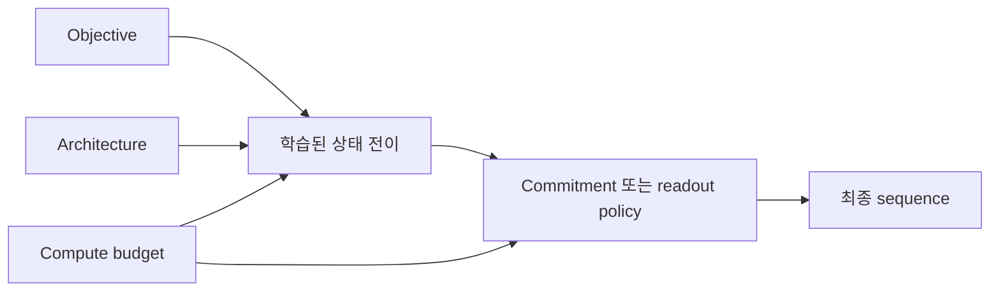
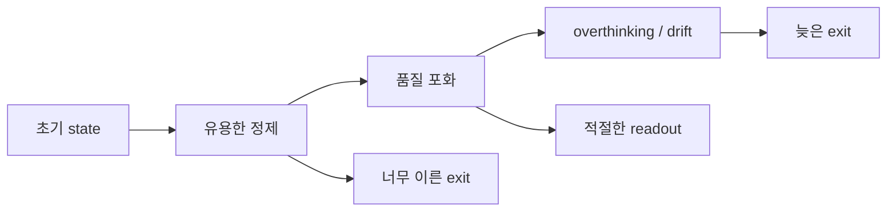

# 반복 생성 모델의 2026 Frontier

## 수업 개요
이 챕터는 2026년의 논문을 발표 순서대로 나열하지 않는다. Diffusion LLM과 recurrent-depth Transformer가 각각 어떤 모델 문제를 분리해 냈는지, 그리고 두 계보가 어디에서 실제로 합쳐지기 시작했는지를 살핀다. 여기서 다루는 범위는 학습 objective, 상태 표현, 반복 block, commitment와 halting처럼 **모델이 어떤 계산을 학습하는가**까지다. Cache, batching, online SLO는 서빙 시스템 과정에서 다룬다.

핵심 변화는 반복 횟수 자체보다 반복의 역할이 세분되었다는 데 있다. Diffusion 쪽에서는 corruption state와 길이 변화, 적은 step에서의 일관성, token 확정 순서가 별도 연구 문제가 됐다 [S1][S2][S3][S4][S5]. Looped model 쪽에서는 여러 깊이에서 쓸 수 있는 trajectory, latent reasoning supervision, halting readout, fixed-point 안정성이 분리됐다 [S6][S7][S8][S9][S10]. LoopMDM은 이 두 흐름을 하나의 architecture 안에 넣어 denoising step과 recurrent depth를 독립적인 계산축으로 만들었다 [S11].

## 학습 목표
- Diffusion frontier를 objective, state space, sampler policy 문제로 나눌 수 있다.
- Commitment order가 denoiser와 별개의 모델·추론 설계 문제인 이유를 설명할 수 있다.
- Looped model의 elastic depth, adaptive exit, fixed-point 안정성을 구분할 수 있다.
- 반복 횟수 증가가 항상 품질 향상으로 이어지지 않는 이유를 설명할 수 있다.
- LoopMDM에서 denoising step과 recurrent depth가 동일하지 않은 두 계산축임을 설명할 수 있다.
- 2026년 scale-up 결과가 무엇을 입증했고 무엇을 아직 입증하지 못했는지 말할 수 있다.

## 수업 전에 생각할 질문
- `[MASK]`를 없애면 diffusion language model의 본질도 사라지는가?
- 모든 위치를 자유로운 순서로 복원할 수 있다면 어떤 token부터 확정할지는 누가 결정해야 하는가?
- 같은 block을 더 많이 반복하면 항상 더 깊게 추론한 결과가 나오는가?
- denoising step을 줄이고 recurrent depth를 늘리면 같은 계산을 한 것인가?

## 강의 스크립트

### Part 1. 하나의 frontier가 아니라 네 개의 모델 문제다
**교수자:** 2026년의 반복 생성 연구를 읽을 때 먼저 논문이 바꾼 대상을 찾으세요.

| 모델 층 | Diffusion LLM의 질문 | Recurrent-depth LM의 질문 |
| --- | --- | --- |
| Objective | 어떤 corruption과 posterior를 학습할까? [S1][S2][S3] | 여러 depth의 state에 어떤 supervision을 줄까? [S6][S7] |
| State / architecture | mask canvas 밖의 상태 공간을 쓸 수 있는가? [S2] | 공유 block의 state drift를 어떻게 제어할까? [S9] |
| Commitment / readout | 어느 위치를 언제 확정할까? [S4][S5] | 어느 depth의 hidden state를 읽고 멈출까? [S8][S10] |
| Compute allocation | denoising step을 어디에 쓸까? | 입력과 token마다 몇 loop를 쓸까? [S6][S8] |

**학습자:** 모두 생성 속도를 바꿀 수 있지만 같은 개선은 아니군요.

**교수자:** 그렇습니다. Objective가 좋아졌다는 결과와 sampler가 적은 network evaluation을 쓴다는 결과는 서로 대체되지 않습니다. Architecture가 여러 depth를 지원한다는 사실도 좋은 halting policy가 있다는 뜻은 아닙니다.

### Part 2. Diffusion은 mask 방식 하나에 묶이지 않는다
**교수자:** Masked diffusion은 이해하기 쉬운 출발점입니다. 일부 token을 `[MASK]`로 바꾸고, reverse process에서 clean token을 복원합니다. 하지만 mask token은 diffusion의 정의가 아니라 가능한 corruption state 가운데 하나입니다.

`Scaling Beyond Masked Diffusion Language Models`는 masked, uniform-state, interpolating diffusion을 같은 scale에서 비교했습니다. 이 연구가 주는 중요한 경고는 validation perplexity가 family 내부의 학습 진척을 보여 주더라도 제한된 sampling budget에서의 실제 생성 품질 순서를 그대로 대표하지 않을 수 있다는 점입니다 [S1]. Objective의 likelihood와 sampler가 만든 sequence의 효용을 같은 숫자로 취급할 수 없습니다.

**학습자:** 그러면 mask를 다른 noise state로 바꾸는 정도가 다음 단계입니까?

**교수자:** 상태 공간 자체를 다시 정의하는 흐름도 있습니다. `Beyond Masks`는 고정 길이 mask canvas에서 token을 채우는 대신 삭제와 삽입을 transition으로 사용합니다. Variable-length generation을 diffusion process 안에서 직접 표현하려는 시도입니다 [S2]. Consistency 계열은 긴 denoising trajectory를 그대로 따라가기보다 서로 떨어진 noise level의 prediction이 일관되도록 학습해 few-step 생성을 노립니다 [S3].

이 세 방향은 경쟁하는 단일 해법이 아닙니다.

- scaling 연구는 objective와 sampler 평가가 어긋날 수 있음을 드러낸다.
- deletion-insertion은 생성 상태와 길이 표현을 바꾼다.
- consistency training은 적은 step에서도 유효한 trajectory를 학습하려 한다.

### Part 3. 자유로운 생성 순서는 commitment 문제를 만든다
**학습자:** 양방향 context로 모든 위치를 예측할 수 있다면 confidence가 높은 token부터 확정하면 되지 않습니까?

**교수자:** 위치별 confidence는 local signal입니다. Reasoning sequence는 앞선 근거와 최종 답 사이의 global dependency를 가집니다. `Answer First, Reason Later`는 답 위치가 reasoning보다 먼저 확정되는 현상을 분석했고, commitment order가 chain-of-thought의 효과와 결합된다는 점을 보였습니다 [S4].

`Where and When to Commit`은 두 결정을 분리합니다 [S5].

1. **Where:** 이번 step에서 어느 위치를 확정할 것인가?
2. **When:** sequence 전체의 반복을 언제 끝낼 것인가?

두 결정이 하나의 confidence threshold에 묶이면 쉬운 위치를 빨리 채우는 정책과 sequence가 충분히 완성되었다는 판단이 혼동됩니다. 따라서 commitment는 denoiser가 내놓은 posterior를 소비하는 부차적 후처리가 아니라, 학습된 분포를 실제 생성 순서로 바꾸는 알고리즘입니다.

### Part 4. Looped model은 여러 깊이에서 쓸 수 있는 state를 배워야 한다
**교수자:** Recurrent depth에서 같은 block을 반복할 수 있다는 사실만으로 elastic model이 되지는 않습니다. 중간 depth의 state가 읽을 만해야 하고, 더 반복했을 때 state가 무너지지 않아야 합니다.

LoopFormer는 서로 다른 길이의 recurrent trajectory를 shortcut consistency로 맞춰 inference budget이 달라도 의미 있는 state를 만들려 합니다 [S6]. LOTUS는 여러 latent block에 explicit reasoning step을 연결해 latent computation이 어느 reasoning stage를 담당하는지 더 직접적으로 감독합니다 [S7]. 둘 다 여러 depth를 활용하지만 전자는 trajectory consistency, 후자는 latent reasoning supervision에 중심이 있습니다.

**학습자:** 그렇다면 gate가 좋은 state를 골라 주면 adaptive depth가 해결됩니까?

**교수자:** Gate, trajectory, readout을 함께 학습하면 실패 원인을 분리하기 어렵습니다. `Adaptive Depth in Looped Transformers`는 frozen trajectory 위에서 post-hoc readout을 진단해, hidden state가 좋아도 exit head가 읽지 못하는 경우와 trajectory 자체가 부족한 경우를 구분합니다 [S8]. Adaptive depth는 하나의 halting score가 아니라 세 구성 요소의 결합입니다.

$$
h_{r+1}=F_\theta(h_r,x,r),\qquad
e_r=G_\phi(h_r),\qquad
\hat{y}_r=H_\psi(h_r)
$$

- $F_\theta$는 반복 trajectory를 만든다.
- $G_\phi$는 현재 depth에서 멈출지를 판단한다.
- $H_\psi$는 중간 state를 output으로 읽는다.

### Part 5. 더 오래 생각하기에는 포화와 drift가 있다
**교수자:** Loop 수를 test-time compute knob로 쓰려면 품질이 적어도 안정적으로 유지되어야 합니다. 그러나 `Loop, Think, & Generalize`는 recurrence가 compositional depth generalization을 늘리는 구간과, 반복을 더했을 때 성능이 다시 떨어지는 overthinking 구간을 함께 보고했습니다 [S10].

SCSE는 이 현상의 한 원인을 state evolution에서 찾습니다. 공유 transition이 기준점에 도달한 뒤에도 residual을 계속 더하면 hidden state가 fixed point 주변에 머물지 못하고 밀려날 수 있습니다. Source-centered update는 반복 state를 원래 source representation과 다시 연결해 drift를 줄이려는 설계입니다 [S9].

이 때문에 반복 횟수는 단조로운 품질 slider가 아닙니다. 모델은 여러 depth에서 안정된 trajectory를 만들어야 하고, readout은 그중 유효한 지점을 찾아야 합니다.

### Part 6. 두 계보의 결합: denoising 바깥 반복과 hidden-state 안쪽 반복
**교수자:** LoopMDM은 masked diffusion LM의 한 denoising step 안에서 Transformer의 일부 layer를 반복합니다 [S11]. 바깥 반복은 mask pattern과 token posterior를 바꾸고, 안쪽 반복은 같은 noisy sequence를 조건으로 hidden state를 더 계산합니다.

**학습자:** 둘 다 반복이니 denoising step 하나와 loop 하나를 교환해도 됩니까?

**교수자:** 아닙니다. Denoising step은 생성 상태의 transition이고, recurrent loop는 그 transition을 계산하는 effective depth입니다. 같은 FLOP을 쓰더라도 `여러 번 얕게 복원`과 `한 번 깊게 복원`은 같은 kernel이 아닙니다. LoopMDM의 실험은 loop placement와 denoising timestep에 따라 효과가 달라짐을 보여 줍니다 [S11].

이 결합이 중요한 이유는 두 계보가 동일하다는 증거여서가 아닙니다. **반복 계산 예산을 token state의 진전과 hidden-state의 정제 사이에 배분할 수 있는 설계 공간**을 실제 architecture로 열었기 때문입니다.

### Part 7. Scale-up은 가능성을 입증했지만 우열을 끝내지 않았다
**교수자:** 2026년에는 diffusion language model도 작은 proof-of-concept를 넘어서는 scale evidence가 나왔습니다. iLLaDA는 12T-token 학습을 보고했고 [S12], LLaDA MoE v2는 30B-A3B 규모의 sparse diffusion model을 제시했습니다 [S13].

**학습자:** 이제 AR보다 우수하다고 결론 내려도 됩니까?

**교수자:** 그 결론에는 동일 데이터, 활성 parameter, training compute, sampler budget을 맞춘 비교가 필요합니다. 현재 결과가 강하게 뒷받침하는 주장은 `diffusion objective와 sparse scaling을 큰 규모에서도 학습할 수 있다`는 것입니다. 생태계 전체의 우열이나 모든 workload의 비용 우위까지 입증한 것은 아닙니다.

## 자주 헷갈리는 포인트
- Masked diffusion은 diffusion LLM의 대표 구현이지 유일한 상태 공간이 아니다.
- Perplexity가 좋아졌다는 사실과 제한된 step의 sample quality가 좋아졌다는 사실은 다르다.
- Commitment policy는 denoiser architecture와 분리해서 분석해야 한다.
- Recurrent depth를 늘리는 것은 명시적 chain-of-thought token을 더 생성하는 것과 같지 않다.
- Hidden state가 안정됐다는 사실은 정답이라는 보장이 아니다.
- Diffusion과 loop는 반복 상태 전이라는 공통점이 있지만 objective와 상태 의미는 다르다.

## 핵심 정리
- Diffusion frontier는 corruption state, few-step consistency, commitment를 독립 문제로 확장했다.
- Looped frontier는 elastic trajectory, latent supervision, halting readout, fixed-point 안정성을 분리했다.
- 더 많은 반복이 항상 더 좋은 출력을 만들지는 않으므로 trajectory와 exit를 함께 설계해야 한다.
- LoopMDM은 denoising step과 recurrent depth를 한 모델의 서로 다른 계산축으로 결합했다.
- 2026년 scale-up 결과는 계보의 실현 가능성을 강화했지만 AR 대비 보편적 우위를 확정하지는 않았다.

## 복습 체크리스트
- Diffusion objective와 commitment policy를 구분할 수 있는가?
- Deletion-insertion과 consistency training이 각각 무엇을 바꾸는지 설명할 수 있는가?
- Adaptive depth의 trajectory, gate, readout 실패를 구분할 수 있는가?
- Overthinking과 state drift가 같은 말이 아닌 이유를 설명할 수 있는가?
- LoopMDM의 두 반복축이 교환 가능하지 않은 이유를 말할 수 있는가?

## 출처
| 번호 | 제목 | 발행 주체 | 날짜 | URL | 사용 이유 |
| --- | --- | --- | --- | --- | --- |
| [S1] | Scaling Beyond Masked Diffusion Language Models | Sahoo et al. | 2026-02-16 | [https://arxiv.org/abs/2602.15014](https://arxiv.org/abs/2602.15014) | diffusion family scaling과 perplexity 한계 |
| [S2] | Beyond Masks: Diffusion Language Models via Deletion-Insertion Processes | Ding et al. | 2026-03-04 | [https://arxiv.org/abs/2603.23507](https://arxiv.org/abs/2603.23507) | variable-length deletion-insertion diffusion |
| [S3] | Consistent Diffusion Language Models | Amin et al. | 2026-04-30, v2 2026-05-30 | [https://arxiv.org/abs/2605.00161](https://arxiv.org/abs/2605.00161) | few-step consistency training |
| [S4] | Answer First, Reason Later | Yeom et al. | 2026-08-06 | [https://arxiv.org/abs/2608.05687](https://arxiv.org/abs/2608.05687) | commitment order와 reasoning collapse |
| [S5] | Where and When to Commit | Lee et al. | 2026-07-30 | [https://arxiv.org/abs/2607.28166](https://arxiv.org/abs/2607.28166) | token commitment와 sequence early exit 분리 |
| [S6] | LoopFormer | Jeddi et al. | 2026-02-11 | [https://arxiv.org/abs/2602.11451](https://arxiv.org/abs/2602.11451) | elastic-depth trajectory |
| [S7] | Bridging the Gap Between Latent and Explicit Reasoning with Looped Transformers | Fan et al. | 2026-06-30 | [https://arxiv.org/abs/2606.31779](https://arxiv.org/abs/2606.31779) | LOTUS의 latent reasoning supervision |
| [S8] | Adaptive Depth in Looped Transformers | Popescu et al. | 2026-07-08 | [https://arxiv.org/abs/2607.20519](https://arxiv.org/abs/2607.20519) | trajectory, gate, readout 진단 |
| [S9] | Looped Transformers with Source-Centered State Evolution | Kim et al. | 2026-07-30 | [https://arxiv.org/abs/2607.27656](https://arxiv.org/abs/2607.27656) | recurrent drift와 fixed point |
| [S10] | Loop, Think, & Generalize | Kohli et al. | 2026-04-09, v2 2026-08-11 | [https://arxiv.org/abs/2604.07822](https://arxiv.org/abs/2604.07822) | depth generalization과 overthinking |
| [S11] | Looped Diffusion Language Models | Lee et al. | 2026-05-25 | [https://arxiv.org/abs/2605.26106](https://arxiv.org/abs/2605.26106) | denoising과 recurrent depth의 architecture 결합 |
| [S12] | Improved Large Language Diffusion Models | Nie et al. | 2026-06-24 | [https://arxiv.org/abs/2606.25331](https://arxiv.org/abs/2606.25331) | iLLaDA 12T-token scaling |
| [S13] | LLaDA MoE v2 | Zhu et al. | 2026-08-04 | [https://arxiv.org/abs/2608.03457](https://arxiv.org/abs/2608.03457) | 30B-A3B MoE diffusion scaling |
