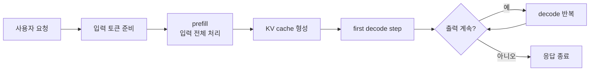
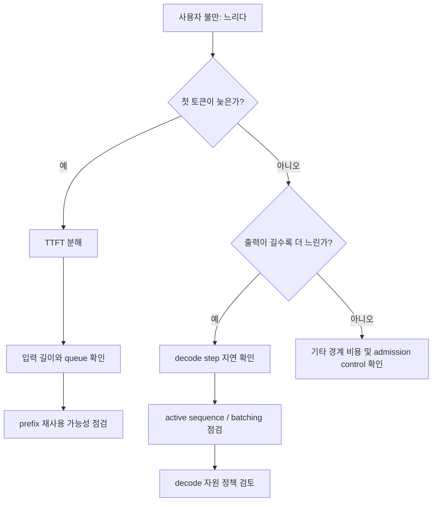
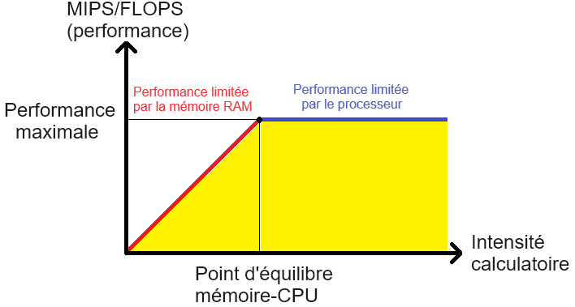

# Prefill vs Decode

## 수업 개요
이번 챕터는 "모델이 응답한다"를 두 조각으로 잘라 보는 수업이다. 사용자가 보낸 입력 전체를 읽어 상태를 만드는 구간이 `prefill`, 그 상태를 바탕으로 다음 토큰을 한 개씩 이어 붙이는 반복 구간이 `decode`다. 둘을 분리해서 보면 왜 어떤 서비스는 첫 글자가 늦고, 어떤 서비스는 시작은 빠른데 길게 생성할수록 답답해지는지 설명할 수 있다. vLLM 계열 자료는 serving 효율을 메모리 관리와 스케줄링 관점에서 다루고 [S1][S2], NVIDIA TensorRT-LLM 자료는 KV cache 재사용과 분리형 serving이 이 문제를 어떻게 운영 설계로 연결하는지 보여 준다 [S3][S4].

## 학습 목표
- 한 요청을 `prefill`과 `decode`라는 두 workload로 나눠 설명할 수 있다.
- 긴 입력 중심 서비스와 긴 출력 중심 서비스가 서로 다른 병목을 가진다는 점을 구분할 수 있다.
- `TTFT`, 토큰당 생성 지연, prefix 재사용 가능성을 같이 보며 진단 순서를 세울 수 있다.
- 단일 serving 풀과 분리형 serving 중 무엇이 더 자연스러운지 workload 기준으로 말할 수 있다.

## 수업 전에 생각할 질문
- 10,000토큰짜리 문서를 읽고 50토큰만 답하는 챗봇이 느리다면, 가장 먼저 줄여야 할 것은 무엇일까?
- 100토큰 지시문으로 800토큰 코드를 생성하는 서비스에서 사용자가 체감하는 병목은 어디에 가까울까?
- 같은 GPU 수를 써도 `prefill` 자원과 `decode` 자원을 나눠 두고 싶은 이유는 무엇일까?

## 강의 스크립트
### 장면 1. 요청 하나를 둘로 쪼개야 진단이 맞아진다
**학습자:** 모델 추론은 결국 한 번 실행되는 과정 아닌가요? 왜 `prefill`과 `decode`를 따로 배워야 하죠?

**교수자:** 운영에서는 그 차이가 바로 장애 분류 기준이 되기 때문입니다. `prefill`은 입력 전체를 읽는 구간이고, `decode`는 이미 만든 상태를 이용해 토큰을 하나씩 늘려 가는 구간입니다. 한쪽은 긴 프롬프트 길이에 민감하고, 다른 쪽은 출력 길이와 동시 생성 수에 민감합니다. 같은 "느리다"라도 병목 위치가 다르면 조치도 완전히 달라집니다 [S1][S2].

**학습자:** 예를 들어 보면 더 분명할 것 같습니다.

**교수자:** 사내 정책 검색 챗봇을 생각해 봅시다. 시스템 프롬프트, 검색 문서, 대화 기록을 합치면 입력이 8,000토큰인데 답은 60토큰이면 사용자는 "왜 첫 글자가 안 나오지?"를 먼저 느낍니다. 반대로 코드 수정 에이전트는 입력이 150토큰뿐이어도 패치 설명과 코드가 700토큰 넘게 이어질 수 있어서, 첫 글자 이후의 흐름이 더 중요합니다. 두 요청은 같은 모델을 써도 다른 workload입니다.

### 장면 2. 첫 글자가 늦다면 `prefill`부터 의심한다
**학습자:** 긴 문서를 읽는 서비스가 느릴 때는 그냥 모델이 무거워서 그런 것 아닌가요?

**교수자:** 그렇게 뭉뚱그리면 대시보드도 잘못 읽게 됩니다. 첫 토큰 지연은 보통 이렇게 나눠 보는 편이 낫습니다.

$$
TTFT \approx T_{\mathrm{queue}} + T_{\mathrm{prefill}} + T_{\mathrm{first\ decode}}
$$

**교수자:** 긴 입력 서비스에서는 `T_prefill`이 먼저 커지기 쉽고, 피크 시간에는 `T_queue`가 그 위에 덧붙습니다. 그래서 평균 latency만 보면 "모델이 전체적으로 느리다"는 식으로 오판하기 쉽습니다.

**학습자:** 그러면 정책 검색 챗봇처럼 입력이 길고 출력이 짧은 서비스는 `TTFT`를 따로 보는 게 핵심이군요.

**교수자:** 맞습니다. 또 같은 시스템 프롬프트나 같은 문서 머리말이 자주 반복된다면 KV cache 재사용을 같이 봐야 합니다. NVIDIA 문서가 prefix 수준의 KV cache reuse를 별도 기능으로 설명하는 이유가 그 때문입니다 [S3]. 중요한 질문은 "기능을 켰는가"가 아니라 "반복 prefix가 실제로 많은가"입니다.

### 장면 3. 출력이 길면 `decode`의 반복 비용이 앞에 나온다
**학습자:** 반대로 코드 생성처럼 출력이 길면 무엇을 먼저 봐야 하나요?

**교수자:** 이 경우 전체 응답 시간을 다음처럼 보면 판단이 빨라집니다.

$$
T_{\mathrm{response}} \approx T_{\mathrm{prefill}} + N_{\mathrm{out}} \cdot t_{\mathrm{decode\ step}}
$$

**교수자:** `N_out`이 큰 서비스에서는 `decode` step의 작은 지연도 길게 누적됩니다. 첫 토큰이 빨라졌는데도 사용자가 답답하다고 하면, 그 불만은 종종 `prefill`보다 `decode` 구간에 더 가깝습니다.

**학습자:** 그럼 이때는 토큰당 지연과 batching 상태를 봐야겠네요.

**교수자:** 그렇습니다. vLLM 문서가 continuous batching, scheduler, cache 관리 이야기를 serving 핵심으로 두는 것도 이 연속 생성 구간이 시스템 효율에 직접 연결되기 때문입니다 [S2]. vLLM 논문 역시 serving 효율을 메모리와 상태 관리 문제로 다룹니다 [S1]. 즉, 긴 출력 서비스는 FLOPs 숫자만 보지 말고 step 반복의 품질을 봐야 합니다.

### 장면 4. 진단 질문은 "어느 순간부터 느린가"로 시작한다
**교수자:** 실무에서 가장 흔한 실수는 GPU 사용률 하나만 보고 결론을 내리는 것입니다. `prefill`은 덩어리 연산처럼 보이지만 첫 토큰 지연을 키울 수 있고, `decode`는 step 하나가 작아 보여도 길게 누적되면서 체감을 망칩니다.

**학습자:** 그럼 디버깅은 어떤 순서로 해야 하나요?

**교수자:** 증상을 먼저 나누면 됩니다. "첫 글자가 늦다"면 `TTFT`, 입력 길이 분포, 공통 prefix 비율을 봅니다. "첫 글자는 빠른데 길게 생성할수록 늘어진다"면 active sequence 수, 토큰당 지연, decode batch 유지 상태를 봅니다. 두 증상이 동시에 나오면 긴 `prefill` 요청과 긴 `decode` 요청이 한 자원 풀에서 서로 밀어내는 구조를 의심해야 합니다 [S4].

### 장면 5. 분리형 serving은 왜 등장했는가
**학습자:** 그래서 `prefill`과 `decode`를 아예 다른 풀로 나누는 설계가 나오는 거군요.

**교수자:** 바로 그 지점이 최신 운영 선택입니다. 분리된 serving 설계는 `prefill`과 `decode`의 특성을 별도 자원으로 다루기 위해 등장했습니다 [S4]. 긴 입력이 몰리는 시간에는 넓은 `prefill` 처리량이 필요하고, 긴 생성이 몰리는 시간에는 안정적인 `decode` 반복이 중요하기 때문입니다.

**학습자:** 그러면 모든 서비스가 분리형으로 가야 하나요?

**교수자:** 아닙니다. 요청 패턴이 단순하고 트래픽이 크지 않으면 단일 풀이 더 관리하기 쉽습니다. 하지만 긴 문서 요약 요청과 긴 코드 생성 요청이 같은 시간대에 섞여 SLA를 흔들기 시작하면, 단순함보다 분리 운영의 통제력이 더 중요해질 수 있습니다 [S4].

### 장면 6. 같은 모델이어도 두 서비스는 다르게 읽어야 한다
**교수자:** 이제 두 사례를 다시 비교해 봅시다.

**교수자:** 사례 A는 사내 정책 Q&A다. 입력은 9,000토큰, 출력은 50토큰이다. 여기서는 첫 토큰 지연이 거의 전부다. `prefill` 시간을 줄이거나 반복 prefix를 재사용하는 쪽이 먼저다 [S3].

**교수자:** 사례 B는 코드 패치 생성이다. 입력은 200토큰, 출력은 900토큰이다. 여기서는 생성 도중 끊기는 느낌이 핵심 불만이 된다. `decode`의 토큰당 지연, active sequence 증가 시 품질 저하, 스케줄링 안정성을 먼저 봐야 한다 [S2].

**학습자:** 결국 "모델이 느리다"가 아니라 "어느 구간이 느리다"로 말해야 운영이 시작되는군요.

**교수자:** 그렇습니다. 오늘 챕터에서 가져가야 할 문장은 하나입니다. 한 요청은 하나의 추론이 아니라, 성격이 다른 두 workload의 연속이다.

## 자주 헷갈리는 포인트
- `prefill`이 끝나면 모든 latency 문제가 해결되는 것은 아니다. 긴 출력 서비스에서는 이후 `decode` 반복이 대부분의 체감 시간을 만든다.
- `decode`가 토큰을 하나씩 만든다고 해서 항상 가벼운 구간은 아니다. step당 비용이 작아 보여도 길게 누적되면 SLA를 크게 흔든다.
- KV cache 재사용은 "캐시가 있으니 무조건 빠르다"가 아니다. 공통 prefix가 반복되는 환경이어야 `prefill` 절감 효과가 크다 [S3].
- 분리형 serving은 만능 해법이 아니다. 한 풀에서 충돌이 실제로 발생하는지 지표로 본 뒤 도입해야 한다 [S4].
- 평균 latency 하나만 보면 `prefill` 병목과 `decode` 병목이 섞여 보인다. 최소한 `TTFT`와 생성 중 토큰당 지연은 따로 봐야 한다.

## 사례로 다시 보기
### 사례 1. 정책 검색 챗봇
**학습자:** 사용자가 PDF 여러 개를 근거로 질문하는 챗봇이 있습니다. 첫 글자까지 오래 걸리지만, 답이 나오기 시작하면 짧게 끝납니다.

**교수자:** 이 패턴은 `prefill` 중심으로 읽는 편이 맞습니다. 문서 조각과 시스템 프롬프트가 길수록 입력 전체를 읽는 비용이 커집니다. 같은 머리말과 같은 정책 문구가 반복되면 KV cache reuse가 효과를 낼 수 있습니다 [S3]. 이 상황에서 decode step만 미세 조정하면 체감 개선이 거의 없을 수 있습니다.

### 사례 2. 코드 패치 에이전트
**학습자:** 반대로 리포지토리 수정 제안을 길게 작성하는 에이전트는 첫 응답은 빠른데 중간부터 뚝뚝 끊깁니다.

**교수자:** 그 서비스는 `decode` 품질을 먼저 봐야 합니다. 긴 출력과 동시 생성이 겹치면 step 반복의 누적 비용이 금방 드러납니다. 여기서는 `prefill`보다 토큰당 지연, batch 유지, 동시 시퀀스 증가 시 흔들림이 더 직접적인 관측 대상입니다 [S2].

### 사례 3. 둘이 한 풀에 같이 들어오는 경우
**학습자:** 그 두 서비스가 같은 클러스터를 쓰면 어떤 일이 생기나요?

**교수자:** 긴 입력 요청은 `prefill` 자원을 오래 붙잡고, 긴 출력 요청은 `decode` 반복을 오래 유지합니다. 둘이 섞이면 한쪽은 `TTFT`가 나빠지고 다른 쪽은 스트리밍 속도가 흔들릴 수 있습니다. 이때 분리형 serving은 "모델을 바꾼다"가 아니라 "두 workload를 다른 운영 정책으로 다룬다"는 선택지입니다 [S4].

## 핵심 정리
- `prefill`은 입력 전체를 읽어 상태를 만드는 구간이고, `decode`는 그 상태를 이용해 토큰을 이어 붙이는 반복 구간이다.
- 긴 입력·짧은 출력 서비스는 `TTFT`와 `prefill` 비용이 핵심이고, 짧은 입력·긴 출력 서비스는 `decode` step 누적 비용이 핵심이다.
- 공통 prefix가 많은 환경에서는 KV cache 재사용이 `prefill` 부담을 낮추는 유력한 선택지다 [S3].
- 최신 분리형 serving은 `prefill`과 `decode`를 같은 문제로 보지 않고 별도 자원 정책으로 다루려는 설계다 [S4].

## 복습 체크리스트
- `TTFT`를 구성하는 항을 말하고, 긴 입력 서비스에서 무엇이 먼저 커질지 설명할 수 있는가?
- 긴 출력 서비스에서 첫 토큰 최적화만으로는 부족한 이유를 말할 수 있는가?
- 반복 prefix가 많은 서비스에서 KV cache 재사용이 왜 의미가 있는지 설명할 수 있는가?
- 단일 풀과 분리형 serving 중 어떤 선택이 더 자연스러운지 workload 패턴으로 설명할 수 있는가?
- "느리다"는 제보를 받았을 때 `prefill` 병목과 `decode` 병목을 다른 질문으로 나눌 수 있는가?

## 대안과 비교
| 선택지 | 잘 맞는 상황 | 장점 | 주의할 점 |
| --- | --- | --- | --- |
| 단일 serving 풀 | 요청 길이와 패턴이 비교적 균일할 때 | 운영 구조가 단순하다 | `prefill`과 `decode`가 같은 자원에서 충돌할 수 있다 |
| 단일 풀 + KV cache 재사용 | 공통 시스템 프롬프트나 반복 prefix가 많을 때 | 반복 `prefill`을 줄여 `TTFT` 개선에 유리하다 [S3] | hit율이 낮으면 효과가 작다 |
| 단일 풀 + decode 중심 튜닝 | 출력이 길고 스트리밍 체감이 중요한 서비스 | 토큰당 지연과 생성 흐름을 직접 다루기 쉽다 [S2] | 긴 입력 병목은 그대로 남을 수 있다 |
| 분리형 serving | 긴 입력 workload와 긴 출력 workload가 동시에 섞여 SLA가 충돌할 때 | `prefill`과 `decode`를 다른 자원 정책으로 운영할 수 있다 [S4] | 상태 전달과 운영 복잡도가 증가한다 |

## 참고 이미지

- [I1] 캡션: vLLM logo
- 출처 번호: [I1]
- 활용 맥락: serving 엔진 문맥에서 `prefill`, batching, cache 관리 논의를 연결하기 위한 참고 이미지

- [I2] 캡션: Roofline model
- 출처 번호: [I2]
- 활용 맥락: 큰 입력 처리와 step 반복 생성이 서로 다른 성격의 workload라는 점을 직관적으로 떠올리기 위한 참고 이미지

## 출처
| 번호 | 제목 | 발행 주체 | 날짜 | URL | 사용 이유 |
| --- | --- | --- | --- | --- | --- |
| [S1] | Efficient Memory Management for Large Language Model Serving with PagedAttention | vLLM authors / arXiv | 2023-09-11 | [https://arxiv.org/abs/2309.06180](https://arxiv.org/abs/2309.06180) | serving 효율을 메모리 관리와 KV cache 관점에서 설명하는 기본 자료 |
| [S2] | vLLM Documentation | vLLM project | 2026-01-07 | [https://docs.vllm.ai/en/latest/](https://docs.vllm.ai/en/latest/) | batching, scheduler, cache 관리가 실제 serving 엔진 기능으로 어떻게 연결되는지 확인하는 자료 |
| [S3] | KV Cache Reuse | NVIDIA TensorRT-LLM | 2026-03-08 (accessed) | [https://nvidia.github.io/TensorRT-LLM/advanced/kv-cache-reuse.html](https://nvidia.github.io/TensorRT-LLM/advanced/kv-cache-reuse.html) | 반복 prefix 재사용이 `prefill` 비용 절감과 연결되는 이유를 설명하는 자료 |
| [S4] | Disaggregated Serving | NVIDIA TensorRT-LLM | 2026-03-08 (accessed) | [https://nvidia.github.io/TensorRT-LLM/1.2.0rc6/features/disagg-serving.html](https://nvidia.github.io/TensorRT-LLM/1.2.0rc6/features/disagg-serving.html) | `prefill`과 `decode`를 별도 자원 정책으로 다루는 분리형 serving 배경을 설명하는 자료 |
