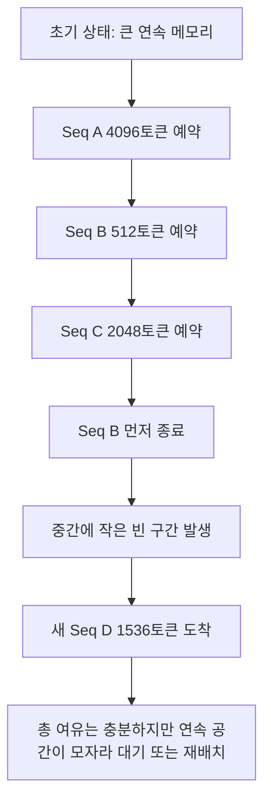
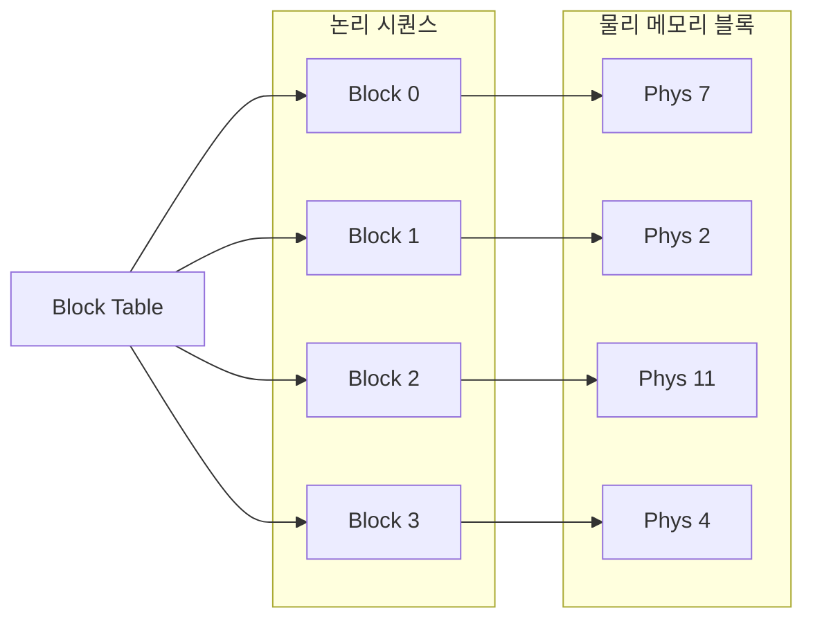

# KV Cache and PagedAttention

## 수업 개요
이번 챕터는 "왜 서빙 엔진이 KV cache를 붙잡고 사는가"를 메모리 관점에서 해부하는 수업이다. decode 단계에서 과거 토큰의 key/value를 다시 계산하지 않기 위해 KV cache가 필요하고, 그 cache가 커질수록 이번에는 메모리 낭비와 fragmentation이 새 병목으로 등장한다. vLLM의 PagedAttention은 이 문제를 운영체제의 paging과 비슷한 방식으로 풀어, 시퀀스의 논리적 연속성과 물리 메모리의 연속성을 분리한다 [S1][S2]. 2026년 기준 최신 serving 엔진이 cache reuse와 cache placement를 별도 최적화 대상으로 다루는 이유도 여기서 이어진다 [S3][S4].

## 학습 목표
- KV cache가 decode 계산량을 줄이는 핵심 상태라는 점을 설명할 수 있다.
- KV cache가 커질수록 왜 memory footprint가 곧 운영 제약이 되는지 설명할 수 있다.
- 연속 메모리 할당 방식이 가변 길이 요청에서 왜 fragmentation을 키우는지 말할 수 있다.
- PagedAttention이 block table로 무엇을 바꾸는지 설명할 수 있다.
- prefix reuse와 cache placement를 같은 문제로 보면 안 되는 이유를 구분할 수 있다.

## 수업 전에 생각할 질문
- 매 토큰 생성 때 이전 토큰의 K, V를 다시 계산한다면 긴 응답에서 어떤 일이 벌어질까?
- 요청마다 출력 길이가 크게 다르면, 빈 메모리가 남아 있어도 새 요청을 못 받는 상황이 왜 생길까?
- 같은 시스템 프롬프트가 반복되는 서비스와 prefill/decode가 분리된 서비스는 KV cache를 서로 다른 방식으로 신경 써야 하는가?

## 강의 스크립트
### 장면 1. KV cache는 사치가 아니라 decode의 기본 장치다
**학습자:** attention은 어차피 이전 토큰을 다 참고해야 하잖아요. 그러면 KV cache가 없어도 결국 계산만 많이 하면 되는 것 아닌가요?

**교수자:** "된다"와 "서비스로 굴러간다"는 다릅니다. decode는 토큰을 한 개씩 추가하는 반복인데, 과거 토큰의 K, V를 매번 다시 만들면 같은 계산을 계속 되풀이하게 됩니다. vLLM 논문이 KV cache를 메모리 관리 문제로 끌어올린 이유가 바로 이 반복 비용 때문입니다 [S1]. 실제 serving 문서도 cache 관리와 scheduler를 엔진 핵심 기능으로 둡니다 [S2].

**학습자:** 얼마나 차이가 커지는데요?

**교수자:** 아주 단순화해서 보면, 길이 `T`의 응답을 만들 때 과거를 매번 다시 훑는 비용은 누적으로 커집니다.

$$
\sum_{t=1}^{T} t = \frac{T(T+1)}{2}
$$

**교수자:** 이 식은 "attention이 원래 O(T^2)"라는 교과서 문장을 외우라는 뜻이 아닙니다. 운영 관점에서는 "이전 상태를 저장하지 않으면 긴 decode에서 같은 과거를 계속 다시 만든다"는 경고로 읽으면 됩니다. KV cache는 새 토큰의 K, V만 추가하고, 과거 토큰의 K, V는 재사용하게 해 decode를 서비스 가능한 수준으로 유지합니다 [S1][S2].

### 장면 2. 계산을 아끼는 순간, 이번에는 메모리가 문제로 나온다
**학습자:** 계산을 줄였으면 좋은 것 아닌가요? 왜 KV cache가 또 문제의 시작이 되죠?

**교수자:** cache는 공짜가 아니기 때문입니다. 레이어마다, 토큰마다, K와 V를 따로 저장해야 합니다. 그래서 동시 요청 수와 시퀀스 길이가 커질수록 KV cache가 빠르게 메모리를 먹습니다.

$$
M_{\mathrm{KV}} \approx 2 \times L \times H_{\mathrm{kv}} \times d_{\mathrm{head}} \times N_{\mathrm{tok}} \times b
$$

**교수자:** 여기서 `L`은 레이어 수, `H_kv`는 KV head 수, `d_head`는 head 차원, `N_tok`는 현재 살아 있는 총 토큰 수, `b`는 element당 바이트 수입니다. 핵심은 모델 파라미터만이 아니라 "현재 살아 있는 토큰 총량"이 메모리 예산을 결정한다는 점입니다. 그래서 cache reuse를 잘하면 prefill 부담을 덜 수 있지만, 반대로 live token이 길게 남아 있으면 memory footprint는 계속 커집니다 [S1][S3].

**학습자:** 결국 throughput을 올리려다 cache 때문에 동시성 한계에 먼저 닿을 수도 있겠네요.

**교수자:** 맞습니다. 긴 컨텍스트와 긴 출력이 섞인 서비스에서 흔한 문제입니다.

### 장면 3. 연속 할당 방식은 길이가 제각각인 요청에서 쉽게 망가진다
**학습자:** 그럼 KV cache용 메모리를 넉넉히 큰 배열로 잡아 두면 되는 것 아닌가요?

**교수자:** 길이가 모두 같다면 그 접근도 단순합니다. 하지만 실제 트래픽은 다릅니다. 어떤 요청은 200토큰에서 끝나고, 어떤 요청은 8,000토큰까지 갑니다. 연속 메모리 구간을 시퀀스마다 크게 예약하면, 빨리 끝난 요청이 중간에 구멍을 만들고 늦게 끝난 요청은 긴 구간을 오래 붙잡습니다. 총 빈 공간은 충분한데도 "필요한 크기의 연속 공간"이 없어 새 시퀀스를 받지 못하는 일이 생깁니다 [S1].

**학습자:** 메모리가 부족한 게 아니라 배치 방식이 엉킨 거군요.

**교수자:** 그렇습니다. 이 챕터에서는 그 차이를 정확히 봐야 합니다.

### 장면 4. PagedAttention은 "논리적으로는 길게, 물리적으로는 쪼개서" 저장한다
**학습자:** 그러면 PagedAttention은 그냥 메모리를 더 잘 압축하는 기술인가요?

**교수자:** 압축과는 다릅니다. 핵심은 시퀀스를 고정 크기 block들의 논리적 목록으로 보고, 각 block을 물리 메모리의 아무 위치에나 배치하는 것입니다. 운영체제의 page table 비유가 나오는 이유도 여기 있습니다 [S1]. 시퀀스가 길어져도 "다음 block 하나"만 잡으면 되고, 중간 block이 비어도 다른 시퀀스가 그 물리 block을 쓸 수 있습니다.

**학습자:** 그러면 시퀀스 입장에서는 연속처럼 보이는데 실제 메모리에서는 여기저기 흩어져 있는 거네요.

**교수자:** 바로 그 점이 중요합니다. PagedAttention은 시퀀스의 논리 주소와 물리 block 위치를 분리해 external fragmentation을 낮춥니다. vLLM 문서가 paged KV cache 계열 구조를 엔진의 중요한 특징으로 설명하는 이유도 이 덕분입니다 [S2].

### 장면 5. reuse와 placement는 비슷해 보여도 운영 질문이 다르다
**학습자:** 블록으로 쪼갰으면 이제 cache 문제는 다 해결된 것 아닌가요?

**교수자:** 아닙니다. 여기서부터 두 질문이 갈라집니다. 첫째는 "이 cache를 다시 쓸 수 있는가"입니다. 반복 시스템 프롬프트, 공통 prefix, 비슷한 대화 머리말이 많다면 prefix reuse가 prefill 비용을 줄여 줍니다 [S3]. 둘째는 "이 cache를 어디에 둘 것인가"입니다. prefill 노드와 decode 노드를 분리하거나, 서로 다른 가속기 풀을 운영하면 cache placement와 전달 비용이 새 설계 변수로 들어옵니다 [S4].

**학습자:** reuse는 hit율 문제이고, placement는 위치와 이동 문제라고 보면 되겠네요.

**교수자:** 정확합니다. 2026년 serving 엔진이 cache reuse와 placement를 따로 다루는 이유가 그 구분입니다 [S3][S4]. 같은 KV cache라도, 상담 봇에서는 prefix hit가 핵심일 수 있고, 분리형 serving에서는 decode가 cache를 어디서 받아 얼마나 빨리 이어받는지가 더 중요할 수 있습니다.

### 장면 6. 운영자는 어떤 순서로 문제를 좁히는가
**학습자:** 실무에서는 어떤 지표부터 보면 좋을까요? 메모리 사용률만 보면 됩니까?

**교수자:** 메모리 사용률 하나로는 부족합니다. 순서는 이렇게 잡는 편이 낫습니다.

**교수자:** 첫째, `live tokens`와 요청 길이 분포를 봅니다. 총 토큰이 늘어나는 것인지, 특정 소수의 장수 시퀀스가 오래 머무는 것인지 구분해야 합니다. 둘째, prefix 반복률과 reuse hit를 봅니다. 재사용할 앞부분이 거의 없는데 reuse 기능만 켜 두면 관리 복잡도만 늘 수 있습니다 [S3]. 셋째, 빈 메모리 총량과 block 사용률을 함께 봅니다. 빈 공간이 있어도 block 배치가 비효율적이면 admission이 막힐 수 있기 때문입니다 [S1]. 넷째, prefill/decode 분리 여부가 있다면 cache transfer 비용과 placement 정책을 봅니다 [S4].

**학습자:** 결국 "메모리가 부족하다"를 바로 믿지 말고, cache 구조와 요청 모양을 먼저 봐야겠네요.

**교수자:** 맞습니다. 이 챕터의 디버깅 질문은 하나입니다. "계산 재사용이 문제인가, 메모리 배치가 문제인가, 아니면 둘 다인가?"

## 자주 헷갈리는 포인트
- KV cache는 attention 자체를 없애는 장치가 아니다. 과거 토큰의 K, V 재계산을 피하게 해 decode를 감당 가능한 수준으로 만든다 [S1].
- KV cache hit가 높다고 해서 메모리 문제가 자동으로 사라지지는 않는다. reuse는 prefill 절감에 가깝고, live token 증가에 따른 footprint 문제는 별개다 [S3].
- fragmentation은 "총 메모리가 부족하다"와 다르다. 빈 공간의 합이 충분해도 연속 할당 전략이 나쁘면 admission이 막힐 수 있다 [S1].
- PagedAttention은 단순 캐시 압축이 아니다. block table 기반 주소 변환으로 논리 시퀀스와 물리 배치를 분리하는 접근이다 [S1][S2].
- prefill/decode 분리 환경에서는 cache reuse보다 cache placement와 전달 경로가 더 중요한 병목이 될 수 있다 [S4].

## 사례로 다시 보기
### 사례 1. 상담 봇의 공통 시스템 프롬프트
**학습자:** 사내 상담 봇은 모든 요청 앞에 1,500토큰짜리 정책 안내문이 붙습니다. 질문 본문은 짧고 응답도 100토큰 안쪽입니다.

**교수자:** 이 경우 운영자는 먼저 prefix reuse를 봐야 합니다. 공통 앞부분을 매번 prefill하면 같은 K, V를 계속 다시 만들게 되기 때문입니다 [S3]. 다만 reuse가 잘돼도 동시 세션 수가 많아 live token이 커지면 cache footprint 문제는 계속 남을 수 있습니다.

### 사례 2. 길이가 제각각인 코딩 요청 풀
**학습자:** 코드 설명 요청은 300토큰에서 끝나는데, 테스트 생성 요청은 6,000토큰까지 갑니다. 둘이 같은 GPU 풀에서 섞입니다.

**교수자:** 이런 풀에서는 fragmentation을 먼저 의심해야 합니다. 짧은 요청이 자주 종료되며 중간 구멍을 만들고, 긴 요청은 오래 살아 남아 block을 점유합니다. PagedAttention은 이 환경에서 연속 공간 확보 부담을 낮춰 admission 실패를 줄이는 방향으로 작동합니다 [S1][S2].

### 사례 3. prefill과 decode를 나눈 운영
**학습자:** 긴 문서 요약이 많아서 prefill은 별도 노드에서 처리하고, decode는 다른 노드가 맡는 구조를 검토 중입니다.

**교수자:** 그 순간 질문이 바뀝니다. "reuse hit가 높은가"만으로는 부족하고, prefill에서 만든 KV cache를 decode 쪽이 어디서 받고 얼마나 빨리 이어받는지, eviction과 placement를 어떻게 할지까지 봐야 합니다 [S4]. 최신 엔진이 cache placement를 별도 최적화 항목으로 다루는 이유가 바로 이 운영 형태 때문입니다.

## 핵심 정리
- KV cache는 decode에서 과거 토큰의 K, V를 재계산하지 않게 해 주는 핵심 상태다 [S1][S2].
- KV cache가 커질수록 모델 크기뿐 아니라 살아 있는 총 토큰 수가 메모리 한계를 결정한다.
- 가변 길이 요청을 연속 메모리로만 다루면 fragmentation 때문에 빈 공간이 남아도 새 요청이 막힐 수 있다 [S1].
- PagedAttention은 block table로 논리 시퀀스와 물리 배치를 분리해 fragmentation을 낮춘다 [S1][S2].
- prefix reuse는 같은 앞부분을 다시 계산하지 않게 하는 전략이고, cache placement는 cache를 어느 자원에 둘지 정하는 전략이다 [S3][S4].

## 복습 체크리스트
- KV cache가 없을 때 decode 비용이 왜 반복적으로 불어나는지 설명할 수 있는가?
- KV cache 메모리 식에서 어떤 항이 운영 중 실제로 가장 크게 흔들리는지 말할 수 있는가?
- fragmentation과 단순 용량 부족을 구분해서 설명할 수 있는가?
- PagedAttention의 block table이 무엇을 추상화하는지 말할 수 있는가?
- prefix reuse와 cache placement를 서로 다른 운영 질문으로 나눌 수 있는가?

## 대안과 비교
| 선택지 | 잘 맞는 상황 | 장점 | 주의할 점 |
| --- | --- | --- | --- |
| 연속 메모리 중심 KV cache | 요청 길이가 비교적 균일하고 구현 단순성이 중요할 때 | 관리가 단순하고 직관적이다 | 길이 편차가 커지면 fragmentation과 재배치 부담이 커진다 |
| PagedAttention 계열 block 관리 | 입력·출력 길이 편차가 크고 동시성이 높을 때 | 논리 시퀀스와 물리 배치를 분리해 메모리 활용도를 높이기 쉽다 [S1][S2] | block 관리와 주소 변환 오버헤드를 이해해야 한다 |
| prefix reuse 강화 | 공통 시스템 프롬프트나 반복 prefix가 많은 서비스 | prefill 비용과 TTFT를 줄이기 좋다 [S3] | hit율이 낮으면 효과가 작고 footprint 문제를 직접 해결하지는 못한다 |
| disaggregated serving + cache placement 최적화 | prefill과 decode를 다른 자원 풀에서 운영할 때 | 각 workload에 맞는 자원 배치가 가능하다 [S4] | cache 전달 경로, placement 정책, 운영 복잡도가 함께 증가한다 |

## 참고 이미지

- [I1] 캡션: vLLM logo
- 출처 번호: [I1]
- 활용 맥락: PagedAttention이 실제 serving 엔진 기능으로 연결된다는 점을 상기시키는 참고 이미지

- [I2] 캡션: Roofline model
- 출처 번호: [I2]
- 활용 맥락: compute 절감과 memory bottleneck이 동시에 등장하는 문제를 직관적으로 떠올리기 위한 참고 이미지

## 출처
| 번호 | 제목 | 발행 주체 | 날짜 | URL | 사용 이유 |
| --- | --- | --- | --- | --- | --- |
| [S1] | Efficient Memory Management for Large Language Model Serving with PagedAttention | vLLM authors / arXiv | 2023-09-11 | [https://arxiv.org/abs/2309.06180](https://arxiv.org/abs/2309.06180) | KV cache 메모리 관리와 PagedAttention의 block 기반 설계를 설명하는 핵심 자료 |
| [S2] | vLLM Documentation | vLLM project | 2026-01-07 | [https://docs.vllm.ai/en/latest/](https://docs.vllm.ai/en/latest/) | 실제 serving 엔진에서 paged KV cache, scheduler, cache 관리가 어떻게 묶여 있는지 확인하는 자료 |
| [S3] | KV Cache Reuse | NVIDIA TensorRT-LLM | 2026-03-08 (accessed) | [https://nvidia.github.io/TensorRT-LLM/advanced/kv-cache-reuse.html](https://nvidia.github.io/TensorRT-LLM/advanced/kv-cache-reuse.html) | prefix reuse와 cache hit 관점에서 KV cache 재사용 전략을 설명하는 자료 |
| [S4] | Disaggregated Serving | NVIDIA TensorRT-LLM | 2026-03-08 (accessed) | [https://nvidia.github.io/TensorRT-LLM/1.2.0rc6/features/disagg-serving.html](https://nvidia.github.io/TensorRT-LLM/1.2.0rc6/features/disagg-serving.html) | prefill/decode 분리 환경에서 cache placement와 전달 문제를 이해하기 위한 자료 |
