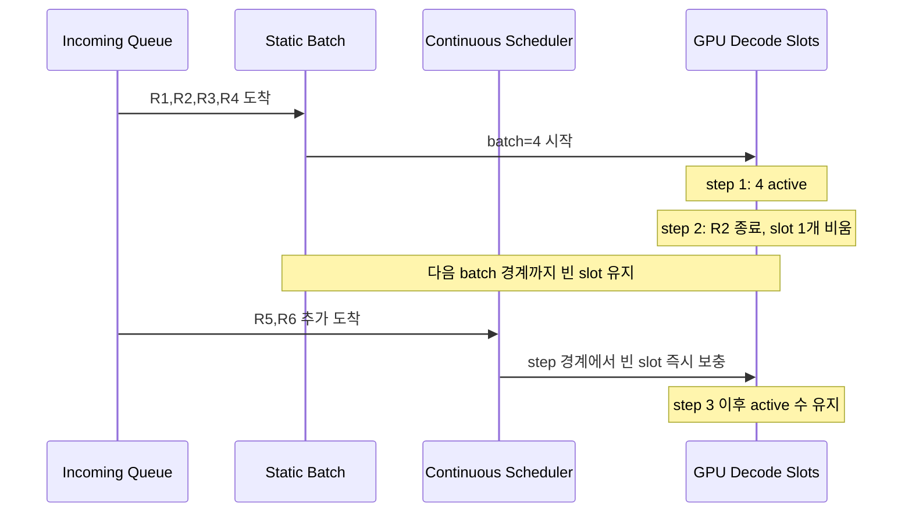
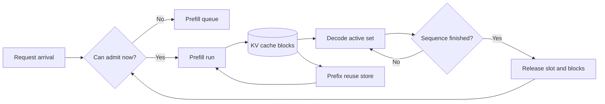

# Continuous Batching

## 수업 개요
이번 챕터는 "배치를 크게 잡으면 throughput이 오르고, 작게 잡으면 latency가 내려간다"는 단순한 상식을 깨는 데서 출발한다. LLM decode는 요청마다 한 토큰씩 전진하므로, 이미 끝난 요청의 빈자리를 다음 요청으로 바로 메우면 장비가 덜 논다. 그래서 현대 서빙 엔진은 정적인 request-level batch보다 token-level scheduler에 가까운 구조를 택한다 [S1][S2]. 다만 이 선택은 공짜가 아니다. scheduler는 prefill과 decode를 섞어 다뤄야 하고, KV cache와 prefix reuse, placement까지 함께 고려해야 한다 [S2][S3][S4].

## 학습 목표
- continuous batching이 static batching보다 throughput과 latency를 함께 개선할 수 있는 이유를 설명할 수 있다.
- decode step마다 비는 slot을 바로 채우는 것이 왜 장비 효율과 연결되는지 수식으로 해석할 수 있다.
- prefill-heavy 요청과 decode-heavy 요청이 섞일 때 scheduler가 무엇을 우선순위로 다뤄야 하는지 말할 수 있다.
- continuous batching, PagedAttention, prefix reuse, disaggregated serving의 관계를 운영 관점에서 구분할 수 있다.

## 수업 전에 생각할 질문
- 8개짜리 static batch에서 3개 요청이 먼저 끝났는데, 다음 입장 가능 시점이 배치 경계까지 밀리면 어떤 일이 생길까?
- 긴 시스템 프롬프트를 가진 상담 챗봇과 짧은 문서 요약 요청이 같은 GPU 풀에 몰리면, 누가 누구의 지연을 키울까?
- 코드 리뷰 에이전트가 4-way sampling을 돌릴 때, 공통 prefix를 재사용하는 것만으로 scheduler 문제가 끝날까?

## 강의 스크립트
### 1. 배치의 문제는 "크기"보다 "경계"에 있다
**학습자:** 배치 최적화라면 보통 batch size를 키우는 이야기 아닌가요?

**교수자:** CNN 추론처럼 요청 하나가 큰 행렬 연산으로 끝나는 워크로드라면 그 말이 꽤 맞습니다. 그런데 LLM decode는 다릅니다. 활성 요청이 `n_t`개면 한 decode step에서 보통 요청당 한 토큰씩 앞으로 갑니다. 누가 먼저 끝나는지가 제각각이어서, request-level batch를 한 번 묶어 놓으면 중간부터 빈칸이 생깁니다.

**교수자:** 이 빈칸을 정리하는 가장 단순한 지표는 idle slot의 누적입니다.

$$
S_{\mathrm{idle}} = \sum_{t=1}^{T}\left(B_{\max} - n_t\right)
$$

**교수자:** `B_max`는 장비가 한 step에서 처리할 수 있는 최대 활성 시퀀스 수이고, `n_t`는 실제로 살아 있는 시퀀스 수입니다. static batching에서는 먼저 끝난 요청이 만든 빈칸이 다음 batch boundary까지 남아서 `S_idle`이 커집니다. continuous batching은 step 경계마다 새 요청을 태워 이 값을 줄이려 합니다 [S1][S2].

**학습자:** 그러면 "큰 batch냐 작은 batch냐"보다 "빈칸을 언제 메우느냐"가 본질이군요.

**교수자:** 맞습니다. continuous batching의 핵심은 배치를 없애는 게 아니라, 배치 경계를 더 잘게 쪼개는 것입니다.

### 2. throughput과 latency가 같은 방향으로 움직이는 이유
**학습자:** 그래도 새 요청을 중간에 넣으면 기존 요청 처리에 방해가 되는 것 아닌가요?

**교수자:** 방해가 될 수도 있습니다. 하지만 decode가 메모리 대역폭과 cache residency에 민감한 구간이라면, 빈 slot을 오래 두는 편이 더 큰 손해가 됩니다. 아주 단순하게 쓰면 평균 토큰 처리량은 이렇게 볼 수 있습니다.

$$
\mathrm{TPS} \approx \frac{1}{\Delta t} \cdot \frac{1}{T}\sum_{t=1}^{T} n_t
$$

**교수자:** `\Delta t`를 step당 평균 시간이라고 하면, 평균 활성 시퀀스 수가 높을수록 토큰 처리량이 올라갑니다. static batching은 남은 멤버가 줄어든 뒤에도 같은 경계 안에 묶여 있어 `n_t`가 떨어지고, queue의 새 요청은 기다립니다. continuous batching은 기존 요청 입장에서는 빈 장비 시간을 줄이고, 새 요청 입장에서는 다음 큰 batch를 기다리지 않게 하므로 throughput과 queueing latency를 동시에 개선할 수 있습니다 [S1][S2].

**학습자:** 결국 TTFT도 queueing 구간이 줄어드는 쪽으로 이득을 보겠네요.

**교수자:** 그렇습니다. 다만 이 이득은 "scheduler가 슬롯을 빨리 채울 수 있다"는 전제 위에서만 나옵니다.

### 3. scheduler는 decode만 보는 사람이 아니다
**학습자:** slot만 채우면 되는 일이라면 구현이 그렇게 어렵지는 않을 것 같은데요.

**교수자:** 실제로는 prefill과 decode를 같이 봐야 해서 복잡합니다. 새 요청 하나를 decode active set에 넣으려면 먼저 prefill을 처리해 KV cache를 만들어야 합니다. 반대로 prefill을 너무 공격적으로 밀어 넣으면 이미 스트리밍 중인 decode가 흔들릴 수 있습니다 [S2][S4].

**교수자:** 그래서 continuous batching은 단순한 "dynamic batch"보다 scheduler에 가깝습니다. 어느 시점에 prefill을 넣을지, decode slot을 몇 개 남겨 둘지, prefix reuse block을 얼마나 오래 붙잡을지까지 판단해야 합니다 [S2][S3][S4].

### 4. 사례 1: 상담 챗봇은 짧은 답변이 많아서 static batch가 손해를 숨기지 못한다
**교수자:** 첫 번째 사례를 보죠. 긴 시스템 프롬프트를 가진 상담 챗봇 서비스가 있습니다. 어떤 사용자는 세 줄만 묻고 나가고, 어떤 사용자는 20턴까지 이어 갑니다.

**학습자:** 길이 편차가 큰 전형적인 서비스네요.

**교수자:** 맞습니다. static batching에서는 먼저 끝난 세션이 만든 빈칸이 다음 배치 경계까지 방치됩니다. 장비 관점에서는 decode slot이 놀고, 사용자 관점에서는 대기열의 새 요청이 "GPU는 비어 보이는데도" 늦게 들어옵니다. continuous batching은 짧게 끝난 세션 자리에 새 세션을 넣어 평균 활성 시퀀스 수를 유지합니다 [S1][S2].

**교수자:** 여기서 PagedAttention이 같이 언급되는 이유도 분명합니다. 길이가 서로 다른 세션을 계속 들이고 빼려면 KV cache를 block 단위로 관리해야 admission이 유연해집니다. scheduler가 똑똑해도 cache가 연속 버퍼 중심이면 빈 slot을 채우고 싶을 때 메모리 단편화가 발목을 잡습니다 [S1][S2].

### 5. 사례 2: 코드 리뷰 4-way sampling은 공정성과 효율을 같이 요구한다
**학습자:** sampling이 여러 갈래로 갈라지는 작업에서도 continuous batching이 유리한가요?

**교수자:** 더 예민합니다. 같은 diff와 같은 리뷰 지시문으로 4개 후보를 생성하는 코드 리뷰 에이전트를 생각해 봅시다. 공통 prefix block은 재사용할 수 있지만, 분기 이후 tail은 후보별로 따로 자랍니다 [S1][S3]. 어떤 후보는 25토큰에서 끝나고, 어떤 후보는 200토큰 이상 갑니다. static batching이면 빨리 끝난 후보의 slot이 묶인 채 남고, continuous batching이면 그 자리에 다른 요청을 넣을 수 있습니다.

**학습자:** 그러면 무조건 continuous batching이 정답인가요?

**교수자:** scheduler 관점에서는 아직 아닙니다. 긴 후보 둘이 decode slot을 오래 점유하는 동안, 새 문서 요약 요청이 prefill queue에 몰리면 누굴 먼저 태울지가 문제입니다. decode를 너무 우선하면 새 요청 TTFT가 밀리고, prefill을 과하게 밀면 이미 스트리밍 중인 응답이 끊깁니다. 이 균형 때문에 현대 엔진 문서가 prefix reuse, cache reuse, disaggregated serving을 별도 주제로 다루는 것입니다 [S2][S3][S4].

### 6. continuous batching이 실패하는 장면은 scheduler가 "비어 보이는 GPU"를 착각할 때다
**교수자:** 운영에서 자주 보는 오해가 하나 있습니다. GPU utilization이 아주 높지 않으면 batching 문제는 아니라는 판단입니다.

**학습자:** utilization이 낮으면 오히려 여유가 있다는 뜻 아닌가요?

**교수자:** decode 서비스에서는 그렇지 않을 때가 많습니다. slot refill이 늦어서 `n_t`가 낮고, KV cache block이 파편화되어 admission이 밀리고, prefill 폭주로 decode가 들쑥날쑥하면 utilization 숫자 하나로는 병목이 안 보입니다. 이때는 순서를 바꿔 봐야 합니다.

**교수자:** 디버깅은 보통 이렇게 갑니다.
- queueing time과 실제 prefill/decode 실행 시간을 분리한다.
- decode step별 활성 시퀀스 수와 slot refill 지연을 본다.
- 새 요청이 늦게 들어오는 이유가 compute 부족인지, KV cache admission 실패인지 구분한다.
- prefix reuse hit와 cache residency가 실제로 절약을 만드는지 확인한다 [S2][S3].
- prefill-heavy workload와 decode-heavy workload가 충돌하면 placement 분리나 disaggregated serving을 검토한다 [S4].

**학습자:** "batch size를 얼마로 둘까"보다 "slot이 왜 늦게 채워지나"를 보는 쪽이 빠르겠네요.

**교수자:** 바로 그 질문이 continuous batching다운 질문입니다.

### 7. 2026년의 엔진은 static batch보다 token-level scheduler에 더 가깝다
**학습자:** 그래서 최신 서빙 엔진이 token-level scheduler에 가깝다는 말이 나오는군요.

**교수자:** 그렇습니다. vLLM은 block 기반 KV 관리와 continuous batching을 함께 설명하는 대표 사례이고 [S1][S2], TensorRT-LLM은 prefix reuse와 disaggregated serving을 별도 기능으로 문서화합니다 [S3][S4]. 공통된 메시지는 하나입니다. 현대 엔진은 "한 번 batch를 짜서 끝내는 장치"가 아니라, 토큰 생성 중에도 admission과 cache lifecycle을 계속 조정하는 실행기라는 것입니다.

## 자주 헷갈리는 포인트
- continuous batching은 request-level dynamic batching의 다른 이름이 아니다. 핵심은 decode 도중 비는 slot을 step 경계에서 다시 채운다는 점이다 [S2].
- throughput 향상은 batch size 숫자 자체보다 평균 활성 시퀀스 수를 얼마나 높게 유지하느냐에서 나온다.
- latency 개선은 kernel이 빨라져서가 아니라, 새 요청이 다음 큰 batch를 기다리지 않아도 되기 때문에 생기는 경우가 많다.
- continuous batching만으로 충분하지 않다. KV cache 관리가 block 기반이 아니면 admission 유연성이 떨어질 수 있다 [S1].
- prefix reuse는 scheduler 부담을 줄일 수 있지만, hit가 낮으면 cache를 오래 잡아 두는 비용만 늘어난다 [S3].
- prefill과 decode가 같은 자원을 공유할 때는 batching 정책만이 아니라 placement 정책도 함께 봐야 한다 [S4].

## 사례로 다시 보기
| 사례 | 증상 | 먼저 볼 지표 | 해석 |
| --- | --- | --- | --- |
| 상담 챗봇, 짧은 세션과 긴 세션이 혼재 | GPU가 완전히 차지 않았는데도 대기열이 길다 | step별 활성 시퀀스 수, slot refill 지연 | 먼저 끝난 세션의 빈칸이 늦게 채워지고 있을 가능성이 크다 |
| 코드 리뷰 4-way sampling | 일부 후보가 빨리 끝난 뒤 throughput이 갑자기 떨어진다 | shared prefix 유지, tail 증가 속도, refill 속도 | 분기 이후 긴 후보가 slot을 오래 잡고, 끝난 후보 자리를 제때 재활용하지 못했을 수 있다 [S1][S3] |
| 문서 요약과 채팅 스트리밍이 같은 풀 사용 | TTFT와 streaming 안정성이 함께 악화 | prefill 비중, decode backlog, cache placement | prefill 폭주가 decode active set을 밀어내며 공정성 문제를 만든다 [S4] |

## 핵심 정리
- continuous batching의 핵심은 batch를 크게 만드는 것이 아니라, decode 중 비는 slot을 곧바로 채워 idle slot 누적을 줄이는 것이다 [S1][S2].
- 평균 활성 시퀀스 수를 높게 유지하면 토큰 처리량이 오르고, 새 요청은 다음 batch boundary를 기다리지 않아 queueing latency도 줄어든다.
- 이 전략이 작동하려면 prefill과 decode를 함께 다루는 scheduler가 필요하다 [S2][S4].
- PagedAttention 같은 block 기반 KV cache 관리는 continuous batching의 admission 유연성을 받쳐 주는 메모리 측 기반이다 [S1].
- prefix reuse와 disaggregated serving은 continuous batching을 둘러싼 보조 기능이 아니라, scheduler가 장비 효율과 공정성을 유지하기 위해 함께 쓰는 수단이다 [S3][S4].

## 복습 체크리스트
- static batching에서 빈 slot이 왜 누적되는지 설명할 수 있는가?
- `S_idle`과 평균 활성 시퀀스 수가 throughput과 어떤 관계인지 말할 수 있는가?
- continuous batching이 TTFT를 줄이는 경로를 queueing 관점에서 설명할 수 있는가?
- PagedAttention이 왜 continuous batching의 실무 동반자로 등장하는지 설명할 수 있는가?
- prefill-heavy workload와 decode-heavy workload가 섞일 때 어떤 순서로 디버깅할지 정리할 수 있는가?

## 대안과 비교
| 선택 | 잘 맞는 상황 | 장점 | 비용 또는 주의점 |
| --- | --- | --- | --- |
| static batching | 오프라인 배치 추론처럼 길이 편차가 작고 실시간성이 약할 때 | 구현과 추적이 단순하다 | 먼저 끝난 요청의 slot이 다음 batch 경계까지 놀 수 있다 |
| continuous batching | 실시간 채팅, 에이전트, 길이 편차가 큰 온라인 서비스 | idle slot을 줄여 throughput과 queueing latency를 함께 개선하기 쉽다 [S2] | scheduler 구현, 공정성, admission 정책이 복잡해진다 |
| continuous batching + prefix reuse | 시스템 프롬프트나 공통 prefix가 자주 반복될 때 | prefill 중복을 줄여 slot 회전이 더 좋아질 수 있다 [S3] | hit가 낮으면 cache 보존 비용이 커질 수 있다 |
| disaggregated serving | prefill-heavy와 decode-heavy 요청이 서로의 지연을 키울 때 | placement와 자원 풀을 분리해 각 단계에 다른 정책을 줄 수 있다 [S4] | 상태 이동과 운영 복잡도가 증가한다 |

## 참고 이미지

- 참고 이미지 1. vLLM 로고.
- 연결 포인트: vLLM은 PagedAttention과 continuous batching을 함께 실무화한 대표 엔진이어서, 이 챕터의 "scheduler + KV cache" 묶음을 상징적으로 보여 준다 [S1][S2].
- 원본 출처: `assets/sources.md`의 `img-01.png` 항목.

- 참고 이미지 2. Roofline model.
- 연결 포인트: decode 구간은 단순히 연산량만 보는 문제가 아니라 메모리와 데이터 이동 효율을 같이 봐야 한다. 그래서 continuous batching은 "큰 한 방의 연산"보다 "slot을 비우지 않는 운영"으로 설명하는 편이 맞다 [S2].
- 원본 출처: `assets/sources.md`의 `img-02.png` 항목.

## 출처
| ID | 출처 | 본문 연결 |
| --- | --- | --- |
| [S1] | Efficient Memory Management for Large Language Model Serving with PagedAttention vLLM authors / arXiv 2023-09-11 https://arxiv.org/abs/2309.06180 | PagedAttention, block 기반 KV 관리, continuous batching의 결합을 설명하는 근거 |
| [S2] | vLLM Documentation vLLM project 2026-01-07 https://docs.vllm.ai/en/latest/ | 현대 서빙 엔진이 continuous batching과 scheduler 중심 구조를 채택하는 맥락 |
| [S3] | KV Cache Reuse NVIDIA TensorRT-LLM 2026-03-08 (accessed) https://nvidia.github.io/TensorRT-LLM/advanced/kv-cache-reuse.html | prefix reuse와 cache hit 관점의 운영 tradeoff |
| [S4] | Disaggregated Serving NVIDIA TensorRT-LLM 2026-03-08 (accessed) https://nvidia.github.io/TensorRT-LLM/1.2.0rc6/features/disagg-serving.html | prefill/decode 분리와 placement 정책을 continuous batching과 연결하는 근거 |
