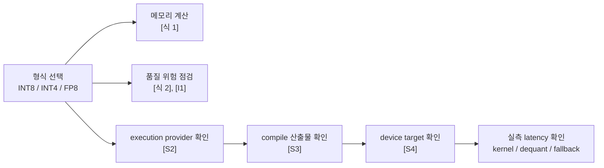
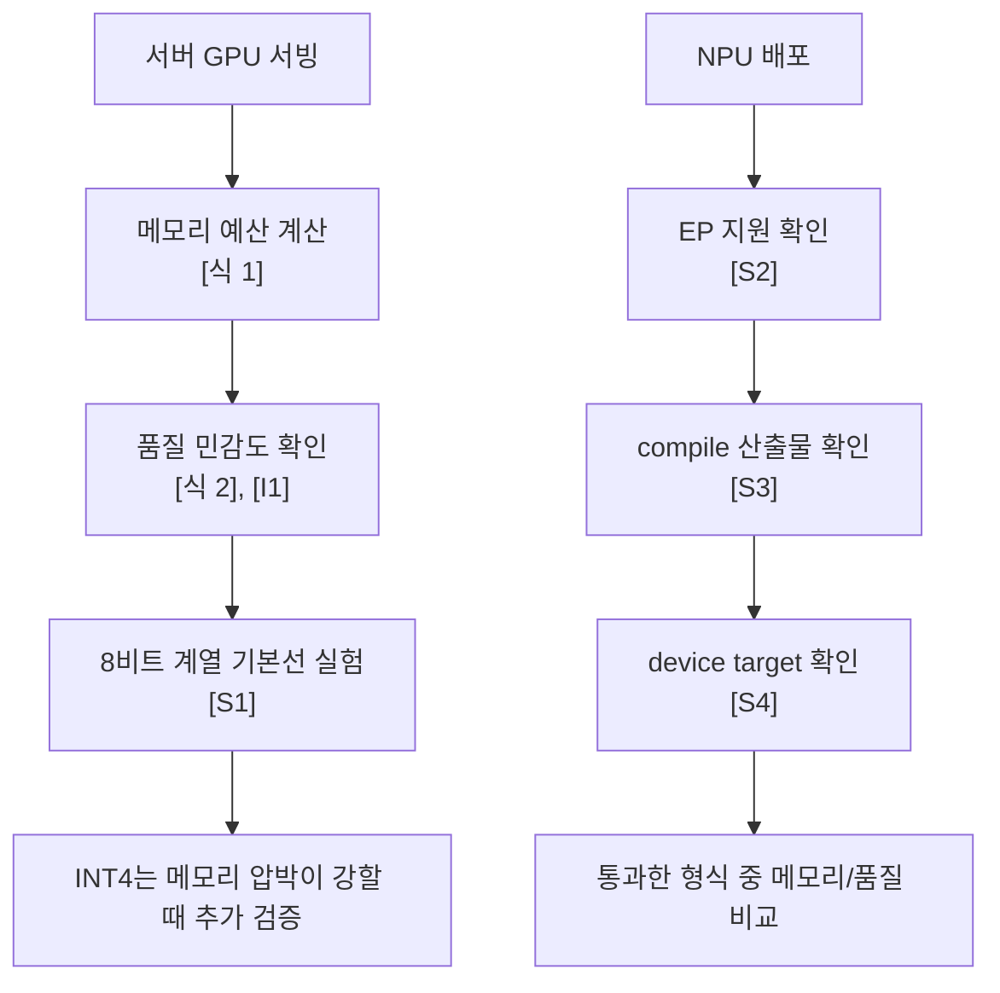
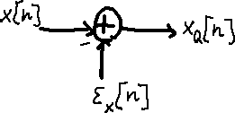

# Quantization Basics

## 수업 개요
이번 챕터는 "몇 비트가 더 작으냐"보다 "어떤 형식이 실제 서빙 경로를 끝까지 통과하느냐"를 먼저 묻는다. 근거도 둘로 나눠서 본다. 메모리 예산과 품질 위험은 [식 1], [식 2], 그리고 양자화 오차를 시각화한 [I1]로 설명하고, backend 호환성은 서버 엔진 문맥의 [S1], offload의 [S2], compile 산출물의 [S3], device target의 [S4]로 설명한다. 이 분리를 지키면 "INT4가 더 작으니 무조건 더 좋다" 같은 단정이 왜 위험한지 보인다.

## 학습 목표
- INT8, INT4, FP8의 weight 메모리 예산 차이를 직접 계산할 수 있다.
- INT4가 품질과 latency에서 왜 더 공격적인 선택인지 식과 실행 경로 관점으로 설명할 수 있다.
- 서버 GPU와 NPU 배포에서 양자화 형식을 고르는 우선순서가 왜 달라지는지 말할 수 있다.

## 수업 전에 생각할 질문
- 8B 모델을 10GB 남은 장치에 올려야 한다면, 어떤 형식이 수식상으로 먼저 후보가 되는가?
- INT4 모델을 만들었는데 속도가 그대로라면, bit-width 외에 어떤 항목을 먼저 의심해야 하는가?
- FP8을 "중간값"이 아니라 "별도 후보군"으로 봐야 하는 이유는 무엇인가?

## 강의 스크립트
### 장면 1. 먼저 예산표를 펼친다
**교수자:** 양자화를 설명할 때 제일 먼저 해야 할 일은 benchmark를 찾는 게 아니라 장치 예산을 계산하는 겁니다. weight 저장 공간은 비트폭에 거의 비례합니다.

#### [식 1] Weight Memory Budget
$$
M_{\mathrm{weights}} \approx N_{\mathrm{params}} \times \frac{b}{8}
$$

**교수자:** 8B 파라미터 모델을 예로 들면, FP16은 대략 16GB, INT8은 8GB, FP8도 8비트 계열이라 대략 8GB, INT4는 4GB 수준입니다. 이 계산만으로도 "한 장치에 들어가는가", "배치 여유가 생기는가"를 빠르게 걸러낼 수 있습니다.

**학습자:** 그러면 숫자만 보면 INT4가 제일 좋아 보이는데요.

**교수자:** 메모리 예산만 보면 맞습니다. 하지만 그건 아직 절반만 본 겁니다. 수식이 알려 주는 것은 저장 공간이고, 서비스가 궁금해하는 것은 품질과 end-to-end latency입니다.

### 장면 2. 품질 손실은 눈금 간격으로 읽는다
**교수자:** 품질 쪽에서는 "칸이 몇 개냐"를 보는 편이 더 정확합니다. 같은 범위를 더 적은 칸으로 나누면 한 칸의 폭이 커지고, 그만큼 오차 위험도 커집니다.

#### [식 2] Quantization Step Size
$$
\Delta = \frac{x_{\max} - x_{\min}}{2^b - 1}
$$

**교수자:** 여기서 바로 정량 비교가 나옵니다. 같은 범위를 가정하면 INT8의 분모는 255이고, INT4의 분모는 15입니다. 즉 INT4의 눈금은 INT8보다 대략 17배 거칩니다. [I1]의 양자화 오차 그림을 함께 보면, 비트폭이 줄수록 원래 연속값이 더 거친 계단으로 투영된다는 점을 직관적으로 확인할 수 있습니다. 그래서 이 챕터에서는 "INT4가 INT8보다 품질 리스크가 크다"는 문장을 외부 backend 문서가 아니라 [식 2]와 [I1]에 직접 연결해서 읽습니다.

**학습자:** 그럼 FP8은 어디에 놓아야 하나요?

**교수자:** 이 챕터에서는 FP8을 "8비트 예산을 유지하는 별도 후보군"으로 둡니다. [식 1]상 메모리 예산은 INT8과 같은 8비트 계열이고, INT4처럼 4비트까지 공격적으로 내려가지는 않습니다. 다만 실제 품질 우위나 속도 우위는 backend와 모델 분포에 따라 달라지므로, FP8을 무조건적인 승자로 말하지 않고 "지원될 때 테스트할 만한 8비트 후보"로만 정리하는 것이 안전합니다.

### 장면 3. 속도는 bit-width 하나로 닫히지 않는다
**학습자:** 그런데 현업에서는 "메모리가 줄면 당연히 빨라지는 것 아닌가"라는 말도 많이 하잖아요.

**교수자:** 그 말이 맞는 구간도 있지만, 서비스 latency는 weight 읽기 시간 하나로 끝나지 않습니다. 실측할 때는 최소한 `L_e2e = L_kernel + L_dequant + L_layout + L_fallback`처럼 나눠 봐야 합니다. 이 식은 교과서 공식이라기보다 디버깅 체크리스트입니다.

**교수자:** 여기서 중요한 건 출처 역할 분리입니다. `dequantize`와 `layout`은 양자화 경로에서 추가될 수 있는 변환 항목이고, `fallback`은 backend 문서가 직접 가리키는 위험입니다. ONNX Runtime QNN 문서는 execution provider가 graph를 특정 backend로 넘기는 구조를 설명하므로, 지원되지 않는 연산이나 형식이 남아 있으면 일부 경로가 fallback될 수 있다는 사실을 받쳐 줍니다 [S2]. Qualcomm AI Hub compile examples는 모델을 장치용 산출물로 바꾸는 compile 단계 자체가 따로 있다는 점을 보여 줍니다 [S3]. OpenVINO NPU 문서는 device target과 실행 모드가 배포 경로에 직접 영향을 준다는 사실을 보여 줍니다 [S4]. 따라서 "INT4인데 안 빨라졌다"는 현상은 bit-width보다 offload 범위, compile 결과, device target부터 확인해야 합니다.

#### 시각 자료 1. 양자화 형식이 실제 실행 경로로 내려가는 순서

**교수자:** 이 그림의 핵심은 순서입니다. 품질과 메모리는 형식 자체로 먼저 따지고, 실제 속도는 backend 경로를 통과한 뒤에야 판단합니다.

### 장면 4. 왜 서버에서는 8비트 계열부터, NPU에서는 backend부터 보나
**교수자:** 이제 운영 판단으로 넘어가 봅시다. 여기서는 사실과 추론을 분리해서 말해야 합니다.

**교수자:** 사실 1. [식 1]만 보면 FP16 8B 모델은 16GB, 8비트 계열은 8GB, INT4는 4GB입니다. 사실 2. [식 2]만 보면 INT4는 같은 범위에서 INT8보다 훨씬 거친 눈금을 씁니다. 이 두 사실을 합치면, 품질 민감한 서버 서비스에서는 8비트 계열이 첫 기준선이 되기 쉽다는 운영적 추론이 나옵니다. 특히 vLLM 문서처럼 서버 서빙 엔진이 양자화 경로를 기능으로 제공하는 환경에서는 [S1] 8비트 계열 실험이 운영 기본선이 되기 쉽습니다. 여기서 [S1]은 "서버 엔진 문맥"을 받치는 출처이지, INT8이 보편적으로 최고라는 품질 논문이 아닙니다.

**학습자:** 그럼 서버에서는 INT8을 먼저 보고, FP8은 그다음 후보로 둔다는 뜻인가요?

**교수자:** 품질 보수성이 중요하고 backend 제약이 없지 않다면 그렇게 정리하는 편이 안전합니다. INT8은 FP16 대비 weight 메모리를 절반으로 줄이면서도, [식 2] 기준으로 4비트만큼 공격적으로 눈금을 넓히지 않습니다. FP8은 8비트 예산을 유지하는 다른 후보이므로, backend가 지원되고 품질 테스트에서 이득이 보일 때 비교군으로 올립니다. 반대로 메모리 압박이 매우 강하면 INT4를 볼 수 있지만, 그때는 품질과 fallback 비용을 더 빡빡하게 검증해야 합니다.

**교수자:** NPU 쪽은 순서가 더 엄격합니다. QNN EP는 어떤 graph를 backend로 넘길지 [S2], AI Hub는 어떤 compile 산출물을 만들어야 하는지 [S3], OpenVINO는 어떤 device target과 모드로 실행해야 하는지 [S4]를 설명합니다. 따라서 NPU-friendly quantization의 첫 질문은 "가장 작은 형식이 무엇인가"가 아니라 "어떤 형식이 offload, compile, target을 통과하는가"입니다.

#### 시각 자료 2. 서버 판단과 NPU 판단의 출발점 차이

### 장면 5. 디버깅은 숫자보다 경로를 먼저 본다
**학습자:** 팀원이 "INT4로 바꿨는데 latency가 그대로예요"라고 말하면 어떻게 보시나요?

**교수자:** 저는 네 단계로 봅니다.

**교수자:** 첫째, execution provider가 실제로 얼마나 offload했는지 봅니다. 이건 [S2]의 역할입니다.

**교수자:** 둘째, compile 산출물이 기대한 형식과 타깃 장치용으로 생성됐는지 봅니다. 이건 [S3]의 역할입니다.

**교수자:** 셋째, device target과 실행 모드가 의도한 NPU 경로인지 봅니다. 이건 [S4]의 역할입니다.

**교수자:** 넷째, 그 다음에야 구간별 latency를 나눠 봅니다. `L_kernel`은 줄었는데 `L_dequant`나 `L_fallback`이 늘었으면, bit-width 이득이 서비스 전체로 번지지 못한 겁니다.

**학습자:** 결국 "INT4 모델 파일이 있다"와 "INT4 경로가 빠르다"는 다른 말이네요.

**교수자:** 정확합니다. 전자는 아티팩트 상태이고, 후자는 실행 경로 상태입니다.

## 자주 헷갈리는 포인트
- INT4가 INT8보다 메모리를 더 많이 줄인다는 사실은 [식 1]의 결론이고, 더 빠르다는 결론은 아니다.
- INT4의 품질 리스크가 더 높다는 말은 backend 문서가 아니라 [식 2]와 [I1]에서 직접 나온다.
- FP8을 절충안으로 부를 때도 "무조건 더 좋다"가 아니라 "8비트 예산을 유지하는 별도 후보군"이라고만 말해야 안전하다.
- [S2][S3][S4]는 품질 비교 출처가 아니다. 이 세 출처는 offload, compile, device target을 설명할 때만 쓰는 편이 정확하다.
- 서버에서의 기본선과 NPU에서의 기본선은 다르다. 서버는 메모리와 품질에서 출발하고, NPU는 backend 경로에서 출발한다.

## 사례로 다시 보기
### 사례 1. 8B 고객지원 모델을 10GB 남은 서버 GPU에 올려야 한다
**교수자:** 우선 [식 1]로 컷을 냅니다. FP16 16GB는 탈락, INT8과 FP8 계열 8GB는 후보, INT4 4GB도 후보입니다. 그다음 [식 2]를 적용하면, 같은 범위 기준 INT4는 INT8보다 훨씬 거친 눈금을 쓰므로 품질 위험이 더 큽니다. 그래서 "품질이 크게 흔들리면 안 되는 고객지원 챗봇"이라면 8비트 계열을 기본선으로 먼저 잡는 판단이 자연스럽습니다. vLLM 같은 서버 엔진 문맥의 [S1]은 이런 실험이 실제 서빙 설정 안에 들어온다는 점을 받쳐 줍니다.

**학습자:** 여기서 FP8 대신 INT8을 먼저 보는 이유는요?

**교수자:** 이 수업의 범위에서는 FP8을 별도 후보군으로 두되, backend와 품질 테스트로 닫으라고만 정리합니다. 그래서 운영 기준선으로는 단순하고 보수적인 INT8을 먼저 놓고, 필요하면 FP8을 비교군으로 추가하는 흐름이 설명상 깔끔합니다.

### 사례 2. 온디바이스 회의 요약 앱에서 INT4가 오히려 흔들린다
**교수자:** 이번에는 NPU 배포입니다. 팀이 INT4 아티팩트를 만들었는데, 실행 로그를 보니 일부 연산은 offload되지 않고, compile 산출물도 장치별로 다르게 나오며, target 지정이 틀린 장비에서는 fallback이 늘었습니다. 이 상황에서는 "INT4가 제일 작다"는 사실보다 [S2][S3][S4]가 가리키는 실행 경로 완성도가 더 중요합니다. 그래서 실제 선택은 INT8일 수도 있고, backend가 받쳐 주면 FP8일 수도 있습니다. 핵심은 가장 작은 형식이 아니라 가장 덜 새는 경로입니다.

## 핵심 정리
- [식 1]이 보여 주는 사실: weight 메모리는 비트폭에 비례해 줄어든다.
- [식 2]와 [I1]이 보여 주는 사실: 같은 범위에서 INT4는 INT8보다 훨씬 거친 눈금을 쓰므로 품질 리스크가 더 크다.
- 운영적 추론: 품질 민감한 서버 서비스는 8비트 계열을 기본선으로 놓고, 메모리 압박이 매우 강할 때 INT4를 추가 검토하는 편이 안전하다.
- backend 사실: [S2][S3][S4]는 offload, compile, device target을 확인하게 해 주며, NPU에서는 이 경로 검증이 bit-width 선택보다 앞선다.
- 실무 결론: NPU-friendly quantization은 단순한 bit-width 경쟁이 아니라, 통과 가능한 backend 경로를 먼저 찾는 일이다.

## 복습 체크리스트
- 8B 모델의 FP16, INT8, FP8, INT4 weight 예산을 [식 1]로 계산할 수 있는가?
- 왜 INT4의 품질 리스크가 더 크다고 말하는지 [식 2]의 분모 차이까지 포함해 설명할 수 있는가?
- "INT4인데 안 빨랐다"를 들었을 때 `execution provider`, `compile 산출물`, `device target`, `fallback` 순서로 점검할 수 있는가?
- 서버 GPU와 NPU 배포에서 형식 선택의 첫 질문이 왜 다른지 설명할 수 있는가?
- FP8을 "무조건 우월한 형식"이 아니라 "지원될 때 시험할 8비트 후보군"으로 말할 수 있는가?

## 대안과 비교
| 형식 | 8B 기준 weight 예산 | 품질 위험을 읽는 직접 근거 | backend가 약할 때 생길 수 있는 문제 | 먼저 던질 질문 |
| --- | --- | --- | --- | --- |
| INT8 | 약 8GB | [식 2] 기준 4비트보다 촘촘한 눈금 | 일부 연산 미지원 시 fallback | 품질을 크게 해치지 않고 메모리를 절반 수준으로 줄일 수 있는가? |
| INT4 | 약 4GB | [식 2] 기준 INT8보다 약 17배 거친 눈금 | dequantize, layout, fallback이 커져 end-to-end 이득이 줄 수 있음 | 메모리 압박이 정말 이 정도 공격성을 요구하는가? |
| FP8 | 약 8GB | [식 1]상 8비트 예산, INT4만큼 공격적이지 않은 후보군 | backend가 지원하지 않으면 실험 자체가 막힘 | 지원되는 경로 안에서 8비트 후보를 더 비교해야 하는가? |
| 양자화 미적용 | 약 16GB(FP16 가정) | 품질 손실 최소 | 메모리 부족으로 배치/탑재가 막힘 | 현재 병목이 정말 precision인가? |

## 참고 이미지
### 참고 이미지 1. Quantization error block diagram

- [I1] 캡션: Quantization error block diagram
- 출처 번호: [I1]
- 왜 필요한가: 연속값이 계단형 표현으로 투영될 때 어떤 종류의 오차가 생기는지 보여 준다. [식 2]의 "눈금 간격이 커질수록 오차 위험이 커진다"는 설명을 직관으로 연결하는 역할이다.

### 참고 이미지 2. 비트폭 선택 요약표
로고 이미지는 설명 기여도가 낮아서 제외하고, 실제 의사결정에 쓰는 표로 대체한다.

| 비교 축 | INT8 | INT4 | FP8 |
| --- | --- | --- | --- |
| 8B 기준 weight 예산 | 약 8GB | 약 4GB | 약 8GB |
| 품질 위험을 읽는 직접 근거 | 8비트 계열 눈금 | INT8보다 더 거친 눈금 | 8비트 예산의 별도 후보군 |
| latency에서 먼저 의심할 지점 | fallback 여부 | dequantize + fallback | backend 지원 경로 |
| backend 확인 순서 | [S1] 서버 엔진 경로 | [S2][S3][S4] offload/compile/target | [S1][S2][S3][S4] 지원 여부 |
| 수업용 한 줄 메모 | 서버 기본선 후보 | 메모리 압박이 강할 때 | 지원되면 비교할 8비트 후보 |

## 출처
| 번호 | 제목 | 발행 주체 | 날짜 | URL | 이 챕터에서 맡는 역할 |
| --- | --- | --- | --- | --- | --- |
| [S1] | vLLM Documentation | vLLM project | 2026-01-07 | [https://docs.vllm.ai/en/latest/](https://docs.vllm.ai/en/latest/) | 서버 서빙 엔진 문맥에서 양자화 경로를 설명할 때 사용 |
| [S2] | QNN Execution Provider | ONNX Runtime | 2026-03-08 (accessed) | [https://onnxruntime.ai/docs/execution-providers/QNN-ExecutionProvider.html](https://onnxruntime.ai/docs/execution-providers/QNN-ExecutionProvider.html) | execution provider와 offload/fallback 경로 설명 |
| [S3] | Compile examples | Qualcomm AI Hub | 2026-03-08 (accessed) | [https://app.aihub.qualcomm.com/docs/hub/compile_examples.html](https://app.aihub.qualcomm.com/docs/hub/compile_examples.html) | compile 산출물과 배포 단계 설명 |
| [S4] | NPU device | OpenVINO | 2026-03-08 (accessed) | [https://docs.openvino.ai/2025/openvino-workflow/running-inference/inference-devices-and-modes/npu-device.html](https://docs.openvino.ai/2025/openvino-workflow/running-inference/inference-devices-and-modes/npu-device.html) | device target과 NPU 실행 모드 설명 |
