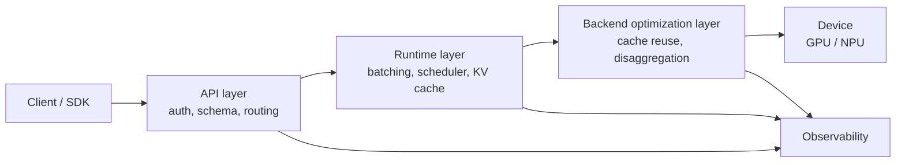
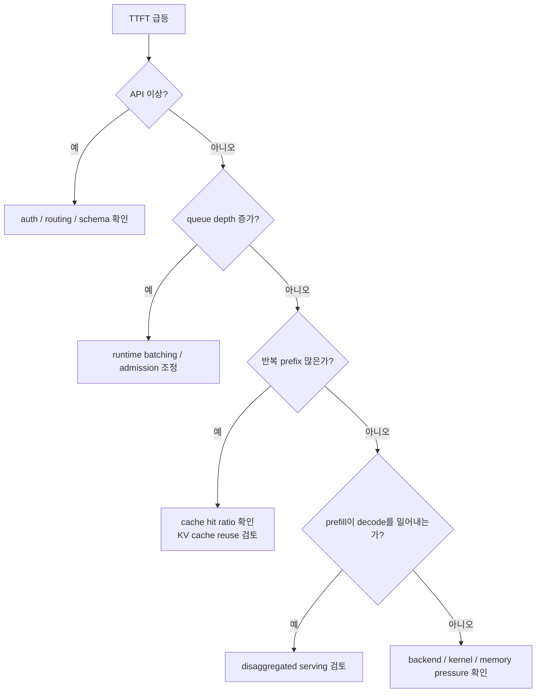

# Serving Stack Overview

## 수업 개요
이 챕터는 서빙 스택을 제품 이름 목록으로 외우지 않고, 장애 티켓이 어느 계층으로 흘러가야 하는지 보여 주는 운영 지도처럼 정리한다. 2026년 기준으로 많은 팀은 위로는 OpenAI-compatible API를 요구하고, 아래로는 PagedAttention, KV cache reuse, disaggregated serving 같은 backend-specific 최적화를 검토한다. 따라서 핵심 질문은 "무엇이 더 고성능인가" 하나가 아니라 "어느 계층까지 공통화하고, 어느 계층부터 직접 책임질 것인가"다. [S1] [S2] [S3] [S4]

## 학습 목표
- API layer, runtime, backend optimization, observability를 서로 다른 책임 계층으로 설명할 수 있다.
- 같은 `/v1/chat/completions` 엔드포인트라도 내부 스택 선택에 따라 운영 복잡도가 달라지는 이유를 말할 수 있다.
- TTFT 저하를 만났을 때 API, queue, prefill, backend 순서로 좁혀 가는 진단 흐름을 설명할 수 있다.
- vLLM 계열의 범용 runtime 선택과 TensorRT-LLM 계열의 backend-specific 선택이 각각 어떤 조직에 맞는지 비교할 수 있다.

## 수업 전에 생각할 질문
- 클라이언트 SDK는 같은데 어떤 서비스는 첫 토큰이 빠르고 어떤 서비스는 느린 이유가 정말 모델 하나 때문일까?
- 반복되는 시스템 프롬프트가 많은 서비스라면 API 호환성보다 더 먼저 챙겨야 할 계층은 무엇일까?
- GPU 사용률이 높게 나오는데 사용자는 계속 느리다고 말한다면, 어떤 숫자부터 확인해야 오진을 줄일 수 있을까?

## 강의 스크립트
### 장면 1. 스택은 기능표가 아니라 책임 분할표다
**교수자:** 서빙 스택을 고를 때 가장 흔한 실수는 엔드포인트 이름만 보고 같은 제품군이라고 생각하는 겁니다. `/v1/chat/completions`를 열 수 있다는 사실은 입구 규약만 맞췄다는 뜻이지, 내부 운영 방식까지 같다는 뜻은 아닙니다. [S2]

**학습자:** 그러면 오늘은 계층을 어디까지 나눠서 봐야 하나요?

**교수자:** 네 층으로 시작합시다.

- API layer: 인증, 요청 스키마, 모델 라우팅, OpenAI-compatible contract를 맡는다. [S2]
- runtime layer: batching, scheduler, KV cache 관리, 메모리 효율 같은 공통 운영을 맡는다. [S1] [S2]
- backend optimization layer: 장치 친화적인 cache reuse나 prefill/decode 분리 같은 더 깊은 최적화를 맡는다. [S3] [S4]
- observability layer: 위 세 층의 상태를 숫자로 연결해 어디서 병목이 생겼는지 보여 준다. [S2] [S3] [S4]

**학습자:** observability를 따로 떼는 이유가 있나요?

**교수자:** 있습니다. 앞의 세 층은 "무엇을 실행하나"를 정하고, observability는 "왜 느린가"를 분해합니다. 이 챕터는 구조도보다 진단 순서를 더 중요하게 봅니다.

### 장면 2. 같은 API도 다른 운영 계약을 만든다
**학습자:** 그러면 OpenAI-compatible API를 제공하는 순간 선택은 거의 끝난 것 아닌가요?

**교수자:** 아닙니다. 거기서부터 두 갈래가 갈립니다. 하나는 표준 API 위에 범용 runtime을 얹어 공통 운영을 최대화하는 길이고, 다른 하나는 backend-specific 기능을 더 드러내 장치 맞춤 최적화를 깊게 가져가는 길입니다. [S2] [S3] [S4]

**교수자:** vLLM 논문과 문서는 PagedAttention과 serving runtime을 같은 이야기 안에 둡니다. 메모리 관리와 스케줄링을 공통 엔진에서 해결해 더 안정적으로 많은 요청을 처리하려는 관점입니다. [S1] [S2]

**교수자:** 반면 TensorRT-LLM 문서는 `KV Cache Reuse`, `Disaggregated Serving`을 별도 기능으로 내세웁니다. 이쪽은 "공통 엔진 하나로 충분한가"보다 "반복 prefix, 긴 prefill, 큰 클러스터에서 더 세밀하게 제어해야 하는가"에 더 가깝습니다. [S3] [S4]

**학습자:** 결국 API는 같아도 운영 계약은 달라지는군요.

**교수자:** 맞습니다. 제품 팀은 SDK 호환을 계약으로 보고, 플랫폼 팀은 runtime 안정성을 계약으로 보고, 성능 엔지니어링 팀은 backend 제어권을 계약으로 봅니다.

### 장면 3. 첫 토큰이 늦을 때는 계층별로 시간을 쪼개 본다
**교수자:** 이제 진단 순서를 고정해 봅시다. 첫 토큰이 늦다는 현상은 하나의 숫자처럼 보여도 실제로는 여러 계층이 합쳐진 결과입니다.

#### 수식 1. First Token Latency 분해
$$
T_{\mathrm{TTFT}} = T_{\mathrm{api}} + T_{\mathrm{queue}} + T_{\mathrm{prefill}} + T_{\mathrm{dispatch}}
$$

**교수자:** 이 식은 논문 공식을 외우라는 뜻이 아니라, 티켓을 어디로 보내야 하는지 정하는 점검표입니다.

- `T_api`: 인증, 요청 정규화, 라우팅에서 생긴 시간
- `T_queue`: batching 대기와 admission control로 묶인 시간
- `T_prefill`: 입력을 읽고 KV cache를 채우는 시간
- `T_dispatch`: runtime에서 backend 실행으로 넘어가는 시간

**학습자:** 그럼 첫 토큰이 느릴 때 바로 kernel profiler를 켜는 건 순서가 뒤집힌 거네요.

**교수자:** 정확합니다. 저는 보통 네 단계로 좁힙니다.

1. API 에러율과 라우팅 이상이 있는지 본다.
2. queue depth가 올라갔는지 확인한다.
3. 긴 입력 때문에 prefill이 길어졌는지 본다.
4. 그다음에도 설명이 안 되면 backend 시간과 메모리 압박을 본다.

**교수자:** 이 흐름이 잡혀 있으면 "GPU는 바쁜데 사용자는 왜 느리다고 하지?" 같은 질문이 훨씬 빨리 정리됩니다. [S2] [S3] [S4]

### 장면 4. 범용 runtime은 공통 병목을 흡수하려고 만든다
**학습자:** 범용 runtime이 잘하는 일은 정확히 무엇인가요?

**교수자:** 공통 병목을 한 곳에 모아 다루는 일입니다. vLLM의 PagedAttention은 KV cache 메모리 관리를 더 효율적으로 하려는 접근으로 소개되고, vLLM 문서는 이를 serving 기능과 함께 설명합니다. 즉 범용 runtime은 "다양한 요청이 섞여도 공통 스케줄러와 공통 메모리 정책으로 운영할 수 있는가"를 중심에 둡니다. [S1] [S2]

**학습자:** 어떤 팀이 이 선택에 잘 맞나요?

**교수자:** 예를 들어 사내 챗봇처럼 짧은 질의응답과 다중 모델 라우팅이 섞인 경우를 생각해 봅시다. 이런 서비스는 매 요청마다 backend를 바꿔 가며 미세 조정하기보다, 표준 API와 공통 runtime으로 운영 단순성을 확보하는 편이 낫습니다. 문제도 주로 queue 정책, 메모리 여유, 라우팅 품질에서 드러납니다. [S1] [S2]

### 장면 5. backend-specific 최적화는 기능 추가가 아니라 책임 추가다
**학습자:** 그럼 backend-specific 기능은 언제 내려가야 하나요?

**교수자:** 반복 prefix와 긴 입력이 성능 문제의 중심일 때입니다. TensorRT-LLM 문서가 `KV Cache Reuse`와 `Disaggregated Serving`을 따로 설명하는 이유도 여기에 있습니다. [S3] [S4]

- `KV Cache Reuse`: 같은 prefix를 다시 계산하지 않도록 해 prefill 부담을 줄이려는 선택이다. [S3]
- `Disaggregated Serving`: prefill과 decode를 서로 다른 자원이나 역할로 분리해 간섭을 줄이려는 선택이다. [S4]

**교수자:** 예를 들어 계약서 검토 서비스처럼 긴 공통 시스템 프롬프트와 긴 첨부 문서가 반복된다면, "API는 이미 맞다"에서 멈추면 안 됩니다. cache hit ratio를 보지 못하면 reuse의 이점도 확인할 수 없고, prefill과 decode를 구분해 보지 못하면 분리 구조가 필요한지조차 판단하기 어렵습니다. [S3] [S4]

### 장면 6. kernel 최적화는 위 계층이 정리된 뒤에 의미가 커진다
**교수자:** 이제 roofline 관점을 가져와 봅시다. backend-specific 최적화가 항상 가장 큰 체감 개선을 주는 것은 아닙니다.

#### 수식 2. Roofline 관점의 상한
$$
P_{\mathrm{attainable}} \le \min \left(P_{\mathrm{peak}},\ I \cdot B_{\mathrm{mem}}\right)
$$

**교수자:** 달성 가능한 성능은 연산 상한과 메모리 대역폭 상한 중 더 낮은 쪽에 묶입니다. 만약 이미 memory-bound라면 kernel만 더 다듬어도 사용자 체감은 제한적일 수 있습니다. 이때는 오히려 queue 조정, cache reuse, prefill/decode 분리처럼 더 위 계층의 선택이 더 큰 변화를 만듭니다. [S1] [S3] [S4]

**학습자:** 그러면 kernel 최적화는 늦게 봐도 되나요?

**교수자:** 늦게 본다기보다, 원인 후보를 먼저 정리한 다음 봐야 합니다. observability 없이 backend-specific 기능만 늘리면, 복잡도는 올라가는데 설명 가능한 성능 향상은 남지 않는 경우가 많습니다.

## 자주 헷갈리는 포인트
- OpenAI-compatible API를 쓴다고 runtime과 backend 특성까지 표준화되는 것은 아니다.
- PagedAttention, KV cache reuse, disaggregated serving은 모두 "성능 기능"처럼 보이지만 겨냥하는 병목이 서로 다르다. [S1] [S3] [S4]
- queue 문제를 backend 문제로 착각하면 GPU 사용률이 높다는 숫자만 붙잡고 오래 헤매게 된다.
- backend-specific 기능은 토글 하나가 아니라 추가 책임이다. hit ratio, 분리 상태, fallback 신호를 읽지 못하면 운영 부담만 커진다. [S3] [S4]
- observability는 대시보드 장식이 아니라 API, runtime, backend를 순서대로 배제하는 플레이북이다.

## 사례로 다시 보기
### 사례 1. 사내 업무 챗봇
짧은 질의응답, 빠른 SDK 연동, 여러 모델 실험이 중요한 팀이라면 API layer와 범용 runtime의 결합이 먼저다. 여기서는 OpenAI-compatible endpoint와 공통 batching, 공통 KV cache 관리가 운영 효율을 좌우한다. PagedAttention 같은 runtime 설계가 메모리 낭비를 줄여 다중 요청을 안정적으로 받치는 방향과 잘 맞는다. [S1] [S2]

### 사례 2. 계약서 검토와 긴 문서 요약
공통 시스템 프롬프트가 길고, 반복 prefix가 많고, 긴 입력이 몰리는 서비스라면 질문이 달라진다. 같은 prefix를 반복 계산하고 있는지, prefill이 decode를 계속 밀어내는지 먼저 봐야 한다. 이런 서비스는 KV cache reuse와 disaggregated serving이 실질 후보가 되는 전형적인 형태다. [S3] [S4]

### 사례 3. 운영 팀의 흔한 오진
사용자가 "첫 토큰이 늦다"고 말하자 곧바로 backend profiler부터 켠 팀이 있다고 해 보자. 그런데 실제 원인은 특정 테넌트의 요청 폭주로 queue depth가 올라간 것이고, 긴 입력이 prefill 시간을 늘려 TTFT를 더 악화시키고 있었다. 이 경우 문제는 kernel 미세 조정이 아니라 runtime 관측 부재다. [S2] [S3]

## 핵심 정리
- 서빙 스택의 핵심 차이는 엔드포인트 이름이 아니라 책임을 어디까지 공통화할지에 있다.
- vLLM 계열은 PagedAttention과 범용 runtime을 묶어 공통 운영을 강화하는 쪽에 가깝고, TensorRT-LLM 계열은 KV cache reuse와 disaggregated serving처럼 backend-specific 제어를 더 깊게 드러낸다. [S1] [S2] [S3] [S4]
- TTFT를 볼 때는 API, queue, prefill, backend 순서로 시간을 쪼개야 오진이 줄어든다.
- observability가 준비되지 않은 상태에서 더 깊은 최적화로 내려가면 성능보다 운영 복잡도가 먼저 커질 수 있다.

## 복습 체크리스트
- API layer, runtime layer, backend optimization layer, observability layer를 한 문장씩 구분해 설명할 수 있는가?
- 같은 OpenAI-compatible API여도 운영 계약이 달라지는 이유를 사례와 함께 설명할 수 있는가?
- TTFT가 악화되었을 때 queue depth, cache hit ratio, prefill 압박, backend 시간을 어떤 순서로 볼지 말할 수 있는가?
- PagedAttention과 KV cache reuse, disaggregated serving이 각각 다른 층의 선택이라는 점을 설명할 수 있는가?
- memory-bound 상황에서 kernel만 보는 접근이 왜 한계가 있는지 roofline 수식과 함께 설명할 수 있는가?

## 대안과 비교
| 선택 축 | OpenAI-compatible API 중심 | 범용 runtime 중심 | backend-specific 최적화 중심 |
| --- | --- | --- | --- |
| 주된 관심사 | SDK 호환과 빠른 연동 | 공통 스케줄링과 메모리 운영 | 반복 prefix, 긴 prefill, 장치 맞춤 제어 |
| 대표적인 참조 문맥 | vLLM serving 문서 [S2] | PagedAttention 논문과 vLLM 문서 [S1] [S2] | TensorRT-LLM의 KV cache reuse, disaggregated serving [S3] [S4] |
| 잘 맞는 팀 | 제품 애플리케이션 팀 | 플랫폼 팀 | 성능 엔지니어링 팀, 인프라 팀 |
| 장점 | 도입이 빠르고 클라이언트 변경이 적다 | 운영 규칙을 공통화하기 쉽다 | 특정 병목을 더 깊게 줄일 수 있다 |
| 주의점 | 내부 병목이 가려질 수 있다 | observability 없이 운영하면 queue와 cache 문제를 놓치기 쉽다 | 기능을 켠 뒤 상태를 못 읽으면 복잡도만 늘어난다 |

## 참고 이미지

- [I1] 캡션: vLLM logo
- 출처 번호: [I1]
- 활용 이유: 범용 runtime과 OpenAI-compatible serving을 함께 설명할 때 대표 사례의 시각적 식별점으로 사용한다.

- [I2] 캡션: Roofline model
- 출처 번호: [I2]
- 활용 이유: backend 미세 최적화의 효과가 메모리 대역폭 상한에 묶일 수 있다는 설명을 보조한다.

## 출처
| 번호 | 제목 | 발행 주체 | 날짜 | URL | 사용 이유 |
| --- | --- | --- | --- | --- | --- |
| [S1] | Efficient Memory Management for Large Language Model Serving with PagedAttention | vLLM authors / arXiv | 2023-09-11 | [https://arxiv.org/abs/2309.06180](https://arxiv.org/abs/2309.06180) | PagedAttention과 범용 runtime의 메모리 관리 관점을 연결하기 위해 사용 |
| [S2] | vLLM Documentation | vLLM project | 2026-01-07 | [https://docs.vllm.ai/en/latest/](https://docs.vllm.ai/en/latest/) | OpenAI-compatible serving과 runtime 운영 문맥을 설명하기 위해 사용 |
| [S3] | KV Cache Reuse | NVIDIA TensorRT-LLM | 2026-03-08 (accessed) | [https://nvidia.github.io/TensorRT-LLM/advanced/kv-cache-reuse.html](https://nvidia.github.io/TensorRT-LLM/advanced/kv-cache-reuse.html) | 반복 prefix 재사용이 어떤 병목을 겨냥하는지 설명하기 위해 사용 |
| [S4] | Disaggregated Serving | NVIDIA TensorRT-LLM | 2026-03-08 (accessed) | [https://nvidia.github.io/TensorRT-LLM/1.2.0rc6/features/disagg-serving.html](https://nvidia.github.io/TensorRT-LLM/1.2.0rc6/features/disagg-serving.html) | prefill/decode 분리와 계층별 선택 기준을 설명하기 위해 사용 |
