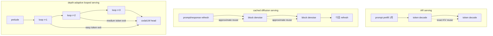
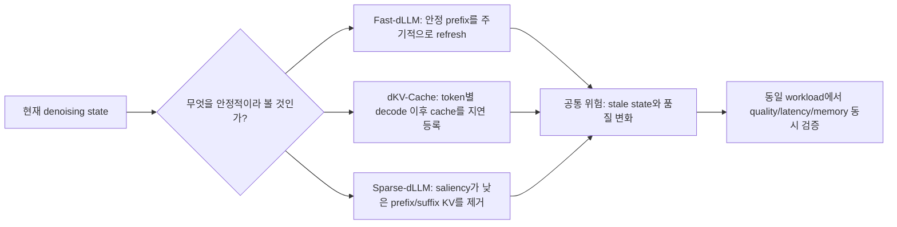
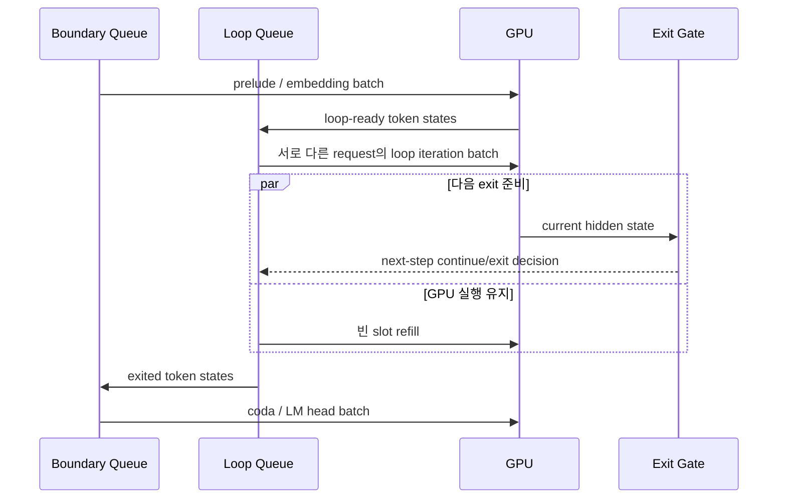

# 반복 생성 모델의 서빙과 런타임

## 수업 개요
2026년 8월 14일 현재 diffusion LLM과 looped language model은 더 이상 모델 코드 한 파일로만 실행되는 연구 대상은 아닙니다. DiffusionGemma는 vLLM의 Model Runner V2와 `ModelState`를 통해 native batched serving 경로에 들어왔고, vLLM 본체에는 fixed-length canvas와 denoising step을 표현하는 일반 `DiffusionConfig` 및 dLLM serving metric도 추가됐습니다. SGLang은 LLaDA2.0/2.1 block-diffusion 계열과 전용 scheduler, dynamic batching, CUDA graph, radix cache를 mainline에서 확장하고 있으며, LMDeploy는 SDAR를 지원 목록에 올리고 block length와 denoising 설정을 노출합니다. 반면 TensorRT-LLM의 공식 모델 표에서 text dLLM 지원은 확인되지 않습니다. 그 문서의 diffusion 지원은 image/video generation beta이므로 text generation과 구분해야 합니다. [S1][S2][S3][S18][S19][S20][S21][S22][S23]

이 챕터의 목표는 논문 속 tokens/s 순위를 만드는 것이 아닙니다. 먼저 `지금 설치해 API server로 쓸 수 있는 엔진 기능`, `저자 코드로 재현할 수 있는 연구 프로토타입`, `논문에서 검증됐지만 범용 엔진에 릴리스되지 않은 제안`을 분리합니다. 그다음 diffusion serving의 반복 prefill/decode, approximate cache, rollback과 looped model serving의 variable depth, boundary stage, depth batching을 같은 runtime 관점에서 비교합니다.

이 강의에서 성능 수치는 특별한 언급이 없어도 모두 해당 저자의 모델, GPU, batch, sequence length, decoding policy에서 측정한 결과입니다. 서로 다른 논문의 최고 수치를 같은 표에서 제품 성능처럼 직접 비교하지 않습니다.

## 학습 목표
- 2026-08-12 기준 DiffusionGemma의 vLLM native 지원과 Ouro의 제한된 vLLM 실행을 구분할 수 있다. [S1][S4][S5]
- Model Runner V2의 `ModelState`가 비표준 생성 상태를 엔진 안에 넣는 방식을 설명할 수 있다. [S2][S3]
- vLLM의 `DiffusionConfig`와 diffusion metric이 모델별 통합을 대신하는 것이 아니라 공통 runtime contract를 제공한다는 점을 설명할 수 있다. [S18][S19]
- vLLM, SGLang, LMDeploy, TensorRT-LLM의 text dLLM 지원 범위와 성숙도를 공식 자료에 근거해 구분할 수 있다. [S20][S21][S22][S23]
- Fast-dLLM, dKV-Cache, Sparse-dLLM이 각각 무엇을 재사용하고 무엇을 근사하는지 구분할 수 있다. [S7][S8][S9][S10]
- dInfer가 dLLM inference를 어떤 구성 요소로 나누는지 설명하고, vLLM native support와 동일시하지 않을 수 있다. [S11][S12]
- Sangam의 반복 prefill/decode와 deficit token-budget scheduling을 설명할 수 있다. [S13]
- Archer가 rollback을 보존하기 위해 prompt와 response의 cache 경계를 다르게 잡는 이유를 설명할 수 있다. [S14]
- Ouro/Huginn에서 token continuous batching과 continuous depth batching이 다른 이유를 설명할 수 있다. [S15][S16][S17]
- 공개 코드의 존재, release status, benchmark 조건, 운영 기능을 따로 확인해 도입 결정을 내릴 수 있다.

## 수업 전에 생각할 질문
- 공식 vLLM 문서에 모델 클래스가 있다는 사실만으로 기존 AR 모델의 모든 serving 기능을 그대로 쓸 수 있을까?
- bidirectional denoising에서 한 token이 바뀌면 왜 conventional KV cache가 exact하지 않은가?
- cache refresh 사이의 계산을 건너뛸 때 속도와 rollback 가능성을 동시에 지킬 수 있을까?
- 같은 batch 안의 token마다 필요한 loop 수가 다르면, batch의 단위는 request인가 token인가 loop iteration인가?

## 먼저 보는 지원 상태 지도

| 분류 | 2026-08-14 상태 | 포함 항목 | 이 강의에서 쓰는 의미 |
| --- | --- | --- | --- |
| 릴리스된 엔진 지원 | 공식 모델 목록과 mainline 실행 경로가 존재 | vLLM DiffusionGemma [S1][S4], SGLang LLaDA2.0/2.1 [S20][S21], LMDeploy SDAR [S22] | 엔진마다 지원 모델과 최적화 범위가 다르므로 `dLLM 지원` 한 칸으로 합치지 않음 |
| 제한된 엔진 실행 | 공개 모델 카드가 vLLM 실행법을 제공하지만 모델 고유 기능 일부가 빠짐 | Ouro fixed-depth vLLM inference, adaptive exit 미지원 [S5][S6] | 모델을 serve할 수는 있으나 연구 모델의 계산 적응성을 온전히 보존하지 못함 |
| 공개 연구 구현 | 저자 repository에서 설치·실험·benchmark 가능 | Fast-dLLM, dKV-Cache, Sparse-dLLM, dInfer, Sangam, Archer [S7][S8][S9][S10][S11][S13][S14] | 재현과 통합의 출발점이며 범용 production SLA를 보장하는 release는 아님 |
| 논문 구현/제안 | 논문에서 end-to-end 평가됐지만 일반 엔진 release로 확인되지 않음 | Ouro/Huginn continuous depth batching [S16] | 설계와 측정 결과는 있으나 운영 채택 전 자체 통합·검증이 필요 |
| text dLLM 공식 지원 미확인 | 공식 supported-model 표에 text diffusion LM이 없음 | TensorRT-LLM [S23] | image/video diffusion beta를 text dLLM 지원으로 읽지 않음 |

여기서 vLLM의 공통 diffusion 설정과 metric은 `지원 가능한 생성 형태`가 엔진 contract로 승격됐다는 증거다 [S18][S19]. 그러나 지원 모델 표에 없는 checkpoint까지 자동으로 실행된다는 뜻은 아니다. 모델별 backbone, attention mode, sampler와 state 구현은 여전히 별도로 확인해야 한다 [S1][S3].

**교수자:** 이 표에서 가장 중요한 열은 모델 이름이 아니라 상태입니다. GitHub repository가 있다고 해서 admission control, cancellation, streaming, observability, multi-tenant isolation까지 갖춘 serving engine이 되는 것은 아닙니다.

**학습자:** 그러면 `실행 가능`과 `서비스 가능` 사이에 별도의 검증 단계가 필요하겠네요.

**교수자:** 맞습니다. 앞으로 각 기술을 볼 때 `어떤 계산을 줄였는가`, `어떤 근사를 넣었는가`, `누가 batch를 관리하는가`, `실패와 취소를 어떻게 처리하는가`를 따로 묻겠습니다.

## 강의 스크립트

### 장면 1. AR serving loop를 기준선으로 놓는다
**교수자:** 기존 AR serving의 강점은 causal dependency가 runtime 계약과 잘 맞는다는 데 있습니다. prompt는 한 번 prefill하고, 이후에는 새 token의 Q와 과거 token의 cached K/V만 사용합니다. scheduler는 대체로 이번 iteration에 처리할 token 수와 KV block을 계산합니다.

$$
C_{AR} \approx C_{prefill}(P) + \sum_{i=1}^{G} C_{decode}(P+i, 1)
$$

`P`는 prompt 길이, `G`는 생성 길이입니다. 뒤의 decode가 한 token씩 진행되므로 token-level continuous batching이 자연스럽습니다.

**학습자:** diffusion은 한 step에 여러 token을 갱신하니 decode만 더 넓어지는 것으로 보면 안 됩니까?

**교수자:** 그 설명으로는 부족합니다. masked diffusion은 response canvas의 여러 위치가 서로 양방향으로 영향을 줍니다. 한 위치를 확정하거나 다시 mask로 돌리면 다른 위치의 representation도 달라질 수 있습니다. exact한 의미에서는 response 전체의 K/V가 다시 계산 대상입니다. cache 기반 가속은 이 전체 재계산 중 일부를 `충분히 안정적이다`라고 보고 재사용하는 근사입니다. [S7][S9]

**학습자:** looped model은 diffusion과 같은 문제가 생깁니까?

**교수자:** 다른 축의 문제가 생깁니다. 한 token을 생성하기 전에 같은 block을 여러 번 통과하며 hidden state를 정제합니다. token마다 exit depth가 달라지면 batch 내부에서 일부 token이 먼저 loop를 떠나야 합니다. AR scheduler가 보는 sequence iteration과 모델 내부의 depth iteration이 겹칩니다. [S6][S16]

### 장면 2. DiffusionGemma는 vLLM의 첫 native dLLM 지원이다
**교수자:** vLLM 팀과 Google DeepMind 팀은 DiffusionGemma를 vLLM이 native로 지원하는 첫 diffusion LLM이라고 명시합니다. 공식 recipe도 offline inference 예제를 제공합니다. 이것은 별도 연구 script가 vLLM을 일부 호출하는 것과 다릅니다. [S1][S4]

**학습자:** scheduler를 diffusion 전용으로 새로 만든 겁니까?

**교수자:** 핵심은 기존 speculative decoding data path를 재사용한 것입니다. 한 denoising step의 canvas를 여러 draft token처럼 보고, accept 또는 renoise 결과를 기존 경로에 연결합니다. vLLM 설명에 따르면 scheduler, model runner, Gemma4 backbone은 대부분 재사용하고 diffusion-specific `ModelState`와 sampler를 둡니다. sampling 결과가 0 token일 수 있도록 한 변경도 `ModelState`가 제어합니다. [S1]

**학습자:** 왜 Model Runner V2가 중요합니까?

**교수자:** MRV2는 persistent per-request state와 이번 step의 input tensor를 분리합니다. active request에는 수명 동안 고정 row를 배정하고, 실제 실행 순서에 맞춰 GPU에서 input을 gather합니다. `ModelState`는 모델이 custom input preparation과 request-specific state를 정의할 수 있게 합니다. AR token counter만으로 표현하기 어려운 canvas, denoising step, self-conditioning state를 core scheduler 전체에 흩뿌리지 않고 모델 경계에 둘 수 있습니다. [S1][S2][S3]

DiffusionGemma의 model state는 backbone을 두 모드로 운용합니다. encoder mode는 causal attention으로 prompt KV를 쓰고, decoder mode는 bidirectional attention으로 encoder KV를 읽되 쓰지 않습니다. sampler는 per-request GPU buffer를 미리 할당하고 hot path의 GPU-to-CPU sync 없이 batched accept/renoise를 수행하도록 구현돼 있습니다. [S3]

**학습자:** 그렇다면 8월의 `DiffusionConfig` 추가는 DiffusionGemma 전용 코드와 무엇이 다릅니까?

**교수자:** `DiffusionConfig`는 모델 이름이 아니라 canvas 길이와 최대 denoising iteration이라는 공통 scheduling 값을 표현합니다. vLLM은 이 canvas를 speculative-decoding data path의 draft token과 scheduled token 의미를 빌려 처리합니다 [S18]. 온라인 benchmark 쪽에도 diffusion decoding metric을 가져오는 경로가 생겼으므로 AR의 tokens/s만 보지 않고 denoising 동작을 별도로 관측할 수 있습니다 [S19]. 다만 이 두 기반 기능이 새로운 dLLM의 `ModelState`와 sampler 구현을 대신하지는 않습니다.

**학습자:** 그러면 AR과 성능 특성도 같다고 봐도 됩니까?

**교수자:** 아닙니다. native support는 execution path의 통합을 뜻하지, AR의 exact cache economics를 상속한다는 뜻이 아닙니다. DiffusionGemma는 fixed-length canvas를 여러 step 정제하며 entropy budget과 convergence rule을 사용합니다. output length, denoising step 상한, batch 크기가 함께 latency와 메모리를 결정합니다. [S1]

### 장면 3. 엔진 이름보다 모델과 실행 기능을 함께 확인한다
**학습자:** 이제 네 엔진 모두 diffusion을 지원한다고 요약해도 됩니까?

**교수자:** 그렇게 쓰면 가장 중요한 차이가 사라집니다. 2026년 8월 14일의 공식 자료를 기준으로 상태는 다음과 같습니다.

| 엔진 | 확인된 text dLLM 범위 | runtime 기능을 읽는 법 | 현재 판단 |
| --- | --- | --- | --- |
| vLLM | DiffusionGemma native path [S1][S4] | `DiffusionConfig`, `ModelState`, diffusion metric은 공통 계약이지만 모델별 구현은 별도 [S3][S18][S19] | 공식 native 지원 |
| SGLang | LLaDA2.0/2.1 계열 [S20][S21] | block diffusion, dynamic batching, CUDA graph, dLLM scheduler, radix cache 항목을 각각 확인 | mainline 구현과 최적화가 계속 확장되는 상태 |
| LMDeploy | SDAR [S22] | 지원 목록뿐 아니라 `dllm_block_length`, denoising step, unmasking strategy 설정을 함께 확인 | 공식 목록에 포함된 text dLLM 경로 |
| TensorRT-LLM | 공식 표에서 text dLLM 미확인 [S23] | visual generation의 diffusion beta는 image/video 모델 경로 | text dLLM 지원으로 분류하지 않음 |

**학습자:** SGLang에 roadmap이 있으면 아직 실행되지 않는다는 뜻 아닙니까?

**교수자:** roadmap 제목만 보고 판단하면 안 됩니다. architecture tracker에는 `LLaDA2MoeModelLM`과 LLaDA2.0/2.1 checkpoint가 올라와 있고, dLLM roadmap은 완료된 mainline 작업과 남은 작업을 함께 추적합니다. 따라서 `지원 모델이 있다`와 `모든 production 기능이 완성됐다`를 분리해야 합니다. dynamic batching이나 CUDA graph가 들어와도 overlap scheduling, broader model coverage, metric 같은 항목은 별도 성숙도를 가집니다. [S20][S21]

**학습자:** LMDeploy는 지원 목록에 SDAR 한 줄만 있으면 충분합니까?

**교수자:** 최소한 실제 설정 표면도 확인해야 합니다. LMDeploy는 block length, denoising step, confidence threshold와 unmasking strategy를 엔진 설정으로 노출합니다. 이는 text dLLM semantics를 runtime이 알고 있다는 근거입니다. 그렇다고 다른 diffusion checkpoint까지 자동 호환된다는 뜻은 아닙니다. [S22]

**교수자:** 마지막으로 부재의 증거는 조심해서 씁니다. TensorRT-LLM에 text dLLM이 `절대 없다`고 단정하지 않고, `2026-08-14 공식 supported-model 표에서 확인하지 못했다`고 기록합니다. 같은 표에 있는 diffusion beta는 FLUX, Wan, LTX 같은 image/video generation 모델을 가리킵니다. 지원표가 바뀌면 이 판정도 다시 확인해야 합니다. [S23]

### 장면 4. Ouro의 vLLM 지원은 모델을 돌리지만 adaptive exit를 보존하지 않는다
**교수자:** Ouro는 같은 block을 반복하며 token별 learned exit distribution으로 계산 깊이를 조절하는 LoopLM입니다. 저자들은 1.4B와 2.6B 모델을 공개했고, 7.7T token pretraining과 latent iterative computation을 보고했습니다. [S6]

**학습자:** 공개 model card에 vLLM server 명령이 있으니 production support로 분류하면 되지 않습니까?

**교수자:** model card의 주의 문구를 함께 읽어야 합니다. vLLM 실행법은 제공하지만, vLLM은 현재 inference optimization 특성상 adaptive exit를 지원하지 않는다고 명시합니다. 따라서 vLLM 경로는 고정된 loop depth로 모델을 실행하는 호환 경로입니다. Ouro의 핵심인 easy token의 조기 종료를 serving throughput으로 전환하지 못합니다. [S5]

**학습자:** 출력 품질이 틀린다는 뜻입니까?

**교수자:** 그 의미는 아닙니다. 정해진 full depth로 계산하면 모델은 실행됩니다. 제한은 `요청이나 token 난이도에 따라 compute를 줄이는 기능`입니다. 이 차이는 운영 비용에서 큽니다. 평균 loop 수가 최대 loop 수보다 작아도 batch가 늘 full depth를 돈다면 이론적인 adaptive compute 절감이 wall-clock 절감으로 이어지지 않습니다.

**학습자:** Huginn은 어떻습니까?

**교수자:** Huginn 공식 repository는 fast inference through vLLM 지원을 밝히고, 논문은 최소 vLLM 구현과 KV-cache sharing을 설명합니다. 그러나 일반 vLLM scheduler가 token을 forward pass 중간의 loop에서 빼고 다른 token으로 채우는 depth scheduler를 제공한다는 뜻은 아닙니다. [S15][S17]

### 장면 5. Fast-dLLM은 cache와 parallel decoding을 결합한다
**교수자:** Fast-dLLM v1은 기존 LLaDA와 Dream에 training-free로 적용하는 연구 구현입니다. confidence-aware parallel decoding으로 한 step에 여러 token을 확정하고, prefix KV cache를 사용해 반복 계산을 줄입니다. 공식 repository는 inference와 evaluation code를 공개했지만 `vLLM support`는 2026-08-12에도 TODO로 표시합니다. 따라서 vLLM native feature로 적으면 틀립니다. [S7][S8]

**학습자:** cache가 exact하지 않은데 왜 쓸 수 있습니까?

**교수자:** block 안의 현재 denoising 대상은 갱신하고, 상대적으로 안정된 prefix state를 일정 기간 재사용합니다. 핵심은 cache refresh interval입니다. 자주 refresh하면 품질은 기준 구현에 가까워지지만 계산 절감이 작고, 오래 재사용하면 stale state가 커질 수 있습니다.

$$
C_{cached\ dLLM} \approx \sum_{b=1}^{N_{block}}
\left(C_{refresh}(P+bB) + \sum_{j=1}^{R_b-1} C_{reuse}(B,j)\right)
$$

`B`는 diffusion block 폭, `R_b`는 해당 block의 denoising step 수입니다. Fast-dLLM의 speedup은 `C_refresh`를 얼마나 드물게 내면서 한 step에 얼마나 많은 token을 안전하게 확정하는지에 달려 있습니다.

**학습자:** 논문의 최고 speedup을 그대로 capacity planning에 쓰면 됩니까?

**교수자:** 안 됩니다. 논문과 repository의 결과는 특정 LLaDA/Dream, generation length, confidence threshold, GPU에서 저자가 측정한 값입니다. repository가 제공하는 interactive chat과 evaluation script는 재현의 출발점이지 multi-request online scheduler의 SLA 근거가 아닙니다. [S7][S8]

### 장면 6. dKV-Cache와 Sparse-dLLM은 같은 cache 문제를 다른 방향으로 푼다
**교수자:** dKV-Cache는 token representation의 시간적 안정성에 주목합니다. 아직 mask인 token의 K/V는 많이 변하지만, decode된 token은 이후 step에서 상대적으로 안정되는 경향을 관찰하고 cache 등록을 늦춥니다. `Decode` variant는 보수적인 가속, `Greedy` variant는 더 공격적인 cache와 품질 tradeoff를 지향합니다. [S9][S10]

**학습자:** 그러면 cache에 넣을 시점만 결정하면 충분합니까?

**교수자:** 긴 sequence에서는 cache 크기와 attention 계산도 남습니다. Sparse-dLLM은 dLLM attention에서 local pattern과 일부 pivotal token의 saliency가 step 사이에 유지된다는 관찰을 이용합니다. 현재 block 앞의 prefix뿐 아니라 뒤의 suffix에서도 중요도가 낮은 K/V를 동적으로 제거하고 sparse attention을 수행합니다. [S10]

**학습자:** 둘 다 품질 손실 없는 cache라고 불러도 됩니까?

**교수자:** 그렇게 일반화하면 안 됩니다. dKV-Cache 저자들은 설정에 따라 2-10배 가속을 보고하지만, 공식 repository는 batch size 1에서 가속이 작거나 더 느릴 수 있다고 명시합니다. LLaDA generation script 일부는 batch size 1만 지원합니다. Sparse-dLLM 저자들은 LLaDA와 Dream 실험에서 vanilla 대비 최대 10배 throughput과 comparable performance를 보고하지만, retention ratio와 sparse kernel size에 따라 정확도가 달라집니다. 모두 저자 benchmark이며 모델·길이·batch·quality tolerance를 고정해 다시 측정해야 합니다. [S9][S10]

### 장면 7. dInfer는 알고리즘 묶음이 아니라 조합 가능한 inference framework를 지향한다
**교수자:** dInfer는 model, diffusion iteration manager, decoder, KV-cache manager의 네 구성 요소로 inference pipeline을 나눕니다. 공개 v0.2 repository는 LLaDA, LLaDA-MoE, LLaDA2 계열과 batched inference를 지원합니다. LLaDA 계열은 pinned vLLM backend를, LLaDA2는 pinned SGLang backend를 사용합니다. [S11][S12]

**학습자:** 그럼 dInfer는 vLLM plugin입니까?

**교수자:** 더 정확히는 dLLM-specific framework가 vLLM 또는 SGLang의 일부 backend 기능을 활용하는 구조입니다. vLLM mainline에 LLaDA의 diffusion semantics가 native로 들어갔다고 해석하면 안 됩니다. repository가 특정 버전 `vllm==0.10.2`, `sglang==0.5.3.post1`을 요구하는 것도 integration surface가 고정돼 있음을 보여 줍니다. [S11]

**학습자:** dInfer의 1,100 TPS는 production 비교에 쓸 수 있습니까?

**교수자:** 저자 보고로만 인용해야 합니다. paper와 repository는 LLaDA-MoE에서 batch 1 HumanEval 1,100 TPS 이상, 여섯 benchmark 평균 800 TPS 이상을 8x H800 node에서 보고하고, Fast-dLLM 대비 10배, 비슷한 active parameter/quality의 Qwen2.5-3B vLLM 대비 2-3배를 주장합니다. 이 수치는 해당 모델 변환, decoding threshold, generation length, hardware와 저자 구현의 결과입니다. 특히 repository의 speed benchmark는 output을 저장하지만 자동 정확도 채점은 하지 않으며, quality 확인에는 별도 lm-eval 경로가 필요합니다. [S11][S12]

**학습자:** 운영 평가라면 무엇을 더 확인해야 합니까?

**교수자:** request cancellation, streaming granularity, fairness, memory fragmentation, model conversion, tensor parallel failure, version pinning을 봐야 합니다. 논문의 single-node TPS만으로 이 항목들은 증명되지 않습니다.

### 장면 8. cached dLLM은 prefill과 decode가 한 번씩이 아니라 반복된다
**교수자:** Fast-dLLM이나 dKV-Cache처럼 cache를 주기적으로 refresh하면 dLLM execution은 `prefill 한 번, decode 여러 번`이 아니라 `prefill, decode, decode, refresh prefill, decode...`가 됩니다. Sangam은 바로 이 반복 구조를 serving 문제로 다룹니다. [S13]

**학습자:** 기존 chunked prefill scheduler를 그대로 쓰면 되지 않습니까?

**교수자:** bidirectional attention 때문에 dLLM refresh prefill을 임의의 작은 chunk로 쪼개면서 같은 semantics를 유지하기 어렵습니다. Sangam은 dLLM decode가 token 하나가 아니라 block 크기의 작업이고, refresh prefill이 반복되며, prefill을 indivisible job으로 다뤄야 한다고 봅니다. 단순 decode 우선 정책은 큰 prefill을 계속 굶길 수 있고, 큰 prefill 즉시 입장은 진행 중인 decode를 오래 멈출 수 있습니다. [S13]

**학습자:** deficit token-budget은 이 충돌을 어떻게 풉니까?

**교수자:** 매 scheduling round의 token budget에서 진행 중 decode를 먼저 admission하고, 남은 budget이 indivisible prefill에 부족하면 쓰지 못한 몫을 다음 round로 이월합니다. deficit가 충분히 쌓이면 prefill 전체를 admission합니다. 장기 평균으로 prefill 자리를 보장하면서 각 round의 decode stall을 제한하는 방식입니다. [S13]

$$
D_{t+1} = D_t + B_{round} - C_{decode,t} - C_{prefill,t},
\qquad C_{prefill,t}\in\{0, P_j\}
$$

여기서 `D`는 이월 deficit, `P_j`는 쪼갤 수 없는 refresh prefill 크기입니다. 실제 Sangam 구현은 이 아이디어를 colocated와 hybrid execution에 적용합니다.

**학습자:** prefill/decode를 완전히 분리하면 더 단순하지 않습니까?

**교수자:** interference는 줄지만 resource partitioning 문제가 생깁니다. Sangam의 hybrid 전략은 prefill worker가 부족할 때 일부 prefill을 decode worker로 overflow하고, 같은 deficit scheduler로 decode를 보호합니다. 저자 실험에서 decode-heavy LLaDA-8B ShareGPT workload의 colocated execution은 hybrid보다 mean latency를 9-20% 줄였고, prefill-heavy Dream-7B arXiv workload의 hybrid execution은 colocated보다 8-20% 줄였습니다. 두 결과는 workload에 따라 답이 바뀐다는 증거이며, 모든 배포에서의 보편적 우열이 아닙니다. [S13]

### 장면 9. Archer는 rollback 가능한 부분을 cache 밖에 둔다
**교수자:** diffusion의 rollback은 먼저 확정한 token도 다시 바꿀 수 있다는 장점입니다. 그런데 response K/V를 오래 cache하면 이미 바뀐 hypothesis에서 만든 state를 재사용하게 됩니다. cache가 빠를수록 revision semantics를 약하게 만들 수 있습니다. [S14]

**학습자:** 그러면 rollback을 쓸 때는 cache를 포기해야 합니까?

**교수자:** Archer의 답은 비대칭 cache boundary입니다. token identity가 고정된 prompt의 K/V는 bounded neighborhood 동안 재사용하고, mutable response는 매 step 전부 다시 계산합니다. 현재 generation state가 cache를 만든 anchor에서 충분히 멀어지면 prompt cache도 refresh합니다. response를 cache 밖에 두므로 어느 token이 rollback될지 미리 알 필요가 없습니다. [S14]

**학습자:** prompt representation도 response를 양방향으로 보니 stale하지 않습니까?

**교수자:** 맞습니다. Archer는 exact cache라고 주장하지 않습니다. bounded staleness를 허용하고 state-aware refresh로 오차를 제한합니다. 흥미롭게도 저자들은 tentative response가 prompt state에 즉시 되먹임되는 것을 잠시 늦추면 초기 오류의 자기강화를 줄일 수 있다고 설명합니다. 다만 cache radius가 너무 크면 유용한 최신 context까지 늦게 반영돼 품질이 다시 떨어집니다. [S14]

**학습자:** benchmark는 어떻게 읽어야 합니까?

**교수자:** 저자 main suite에서 평균 성능 33.63%, 평균 2.57배 speedup, benchmark별 최대 2.95배 speedup, backbone을 가로질러 Pass@1 최대 3.05 point 개선을 보고했습니다. 이는 공개 저자 코드와 논문 조건의 결과입니다. 2026-08-12 시점의 최신 연구 프로토타입이지 vLLM이나 dInfer의 release option으로 확인된 기능은 아닙니다. [S14]

### 장면 10. Continuous depth batching은 loop iteration을 scheduling 단위로 바꾼다
**교수자:** 이제 Ouro와 Huginn으로 넘어갑시다. 일반 continuous batching은 한 decode step을 마친 sequence slot에 새 request를 넣습니다. depth-adaptive model은 같은 token generation 안에서도 easy token이 loop 1이나 2에서 나가고 hard token은 더 깊게 남습니다. fixed batch는 먼저 끝난 token의 slot을 full-depth token이 끝날 때까지 비워 둡니다. [S16]

**학습자:** exit한 token만 tensor에서 빼면 되지 않습니까?

**교수자:** 기존 vLLM 같은 token-level scheduler는 model forward 경계에서 batch를 바꿉니다. adaptive exit는 forward 내부 recurrent block 사이에서 token을 빼야 합니다. 게다가 Ouro/Huginn은 구조가 같지 않습니다. Ouro 1.4B는 fully looped `0-24-0`이라 boundary stage가 작지만, Huginn 3.5B는 prelude, recurrent block, coda가 나뉘어 boundary stage를 loop보다 낮은 빈도로 실행해야 합니다. [S16][S17]

Continuous depth batching은 boundary stage와 loop step을 별도 priority queue로 관리하고, exit 결정을 한 step 앞서 준비하며, CPU scheduling을 GPU compute와 겹칩니다. `no-refill`은 exit한 자리만 비워 batch를 줄이고, `refill`은 빈 slot에 다른 token의 loop iteration을 넣습니다. [S16]

**학습자:** 평균 loop 수가 절반이면 처리량도 두 배가 되는 것 아닙니까?

**교수자:** 그것은 모델이 줄인 이론적 계산량입니다. 실제 serving은 서로 다른 depth 때문에 생긴 빈 slot을 얼마나 다시 채웠는지, queue 관리 중에도 GPU를 얼마나 계속 실행했는지에 따라 달라집니다. 관계를 단순화하면 다음과 같습니다.

$$
\mathrm{RealizedGain}
=\mathrm{TheoreticalComputeGain}
\times\mathrm{BatchingEfficiency}
\times\mathrm{SchedulerUtilization}
$$

`TheoreticalComputeGain`은 exit depth 분포에서 계산하고, `BatchingEfficiency`는 실행된 slot 가운데 유효한 loop 작업의 비율로, `SchedulerUtilization`은 scheduling·boundary stage·동기화가 만든 idle time을 포함해 측정합니다. 따라서 평균 depth만 보고한 결과와 CDB가 회수한 wall-clock speedup은 같은 지표가 아닙니다. [S16]

**학습자:** 논문 구현은 그 간극을 얼마나 회수했습니까?

**교수자:** 저자들은 Ouro 1.4B와 Huginn 3.5B에서 이론적 최대 speedup의 최대 99%를 실현하고, full-depth continuous batching 기준보다 offline throughput 1.5-1.9배, dynamic serving load에서 normalized latency 45-90% 감소를 보고했습니다. Ouro offline sweep에서는 refill이 약 1.5-1.58배였습니다. 이 값은 저자가 replay한 exit decision, threshold, batch size, Alpaca/ShareGPT workload와 구현 조건에 한정됩니다. 논문은 end-to-end 구현을 평가했지만 2026-08-12 기준 범용 engine release나 공식 code link는 논문 페이지에서 확인되지 않습니다. [S16]

### 장면 11. Diffusion step과 loop depth는 결국 2차원 scheduling 문제를 만든다
**학습자:** diffusion과 looped model은 서로 다른 계보인데 runtime에서는 어디서 만납니까?

**교수자:** 둘 다 반복 횟수가 request마다, 때로 token마다 달라질 수 있다는 점에서 만납니다. diffusion은 denoising step과 refresh interval을, looped model은 recurrent depth와 exit threshold를 조절합니다. 두 구조가 결합되면 scheduler가 sequence position, denoising time, recurrent depth의 세 좌표를 봐야 합니다.

**학습자:** 기존 scheduler에 priority 하나만 더 넣으면 됩니까?

**교수자:** 그보다 복잡합니다. 작업 단위마다 state validity가 다릅니다. diffusion refresh는 cache를 새 anchor로 바꾸고, rollback은 response state를 폐기할 수 있습니다. loop exit는 coda로 보내야 하며, 아직 loop 중인 token과 같은 kernel batch에 둘 수 없습니다. preemption 뒤에 resume할 때 어느 canvas, 어느 cache generation, 어느 loop depth에서 재개할지도 정의해야 합니다.

**교수자:** 그래서 production runtime의 request state는 최소한 아래 항목을 명시적으로 가져야 합니다.

| 상태 축 | Diffusion serving | Looped serving | 잘못 생략했을 때 |
| --- | --- | --- | --- |
| 반복 위치 | denoising step, block index | recurrent depth | 중복 계산 또는 잘못된 종료 |
| mutable state | canvas, confidence, rollback set | hidden state, exit probability | 다른 request state와 혼합 |
| cache provenance | refresh step, anchor hypothesis | loop별/shared KV policy | stale cache를 exact cache로 오인 |
| scheduling class | refresh prefill, block decode | boundary, loop, coda | head-of-line blocking과 빈 slot |
| 완료 조건 | convergence, entropy/step limit | exit threshold, max depth, EOS | 무한 반복 또는 조기 종료 |

### 장면 12. 현재 도입 판단은 feature matrix보다 evidence ladder로 한다
**학습자:** 지금 서비스를 만든다면 무엇을 선택해야 합니까?

**교수자:** 먼저 모델 요구에서 출발합니다. DiffusionGemma를 OpenAI-compatible API와 일반 vLLM 운영 도구 안에서 serve하려면 native vLLM recipe가 가장 직접적입니다. 그래도 지원되는 sampling parameter, multimodal path, quantization, parallelism, cancellation을 실제 버전에서 확인해야 합니다. [S1][S3][S4]

LLaDA/LLaDA2 계열의 알고리즘 조합을 실험하고 batched inference를 원하면 dInfer가 구체적인 시작점입니다. 하지만 version pin과 model conversion이 배포 표면에 들어옵니다. [S11]

Fast-dLLM, dKV-Cache, Sparse-dLLM은 cache policy를 연구하거나 자체 runtime에 이식할 때 유용합니다. 각각의 standalone benchmark script를 production engine으로 부르지 말고, 동일 model/output quality에서 eager baseline과 비교해야 합니다. [S7][S8][S9][S10]

Sangam은 multi-request cached dLLM에서 refresh prefill과 decode 간섭이 실제 병목일 때 검토합니다. Archer는 rollback decoder를 유지하면서 prompt 계산을 줄여야 할 때 맞습니다. 둘 다 자기 workload의 request arrival와 output validation을 다시 측정해야 합니다. [S13][S14]

Ouro/Huginn은 fixed-depth vLLM path로 먼저 correctness baseline을 만들 수 있습니다. adaptive depth의 경제성이 배포 목표라면 CDB 같은 loop-level scheduler가 필요하며, 현재는 자체 통합 비용을 감수해야 합니다. [S5][S15][S16][S17]

### 장면 13. benchmark 표보다 먼저 실험 계약서를 쓴다
**교수자:** 마지막으로 benchmark를 설계해 봅시다. 평균 tokens/s 하나로는 부족합니다.

**학습자:** diffusion은 한 step에 여러 token을 내므로 tokens/s 정의부터 맞춰야겠네요.

**교수자:** 그렇습니다. committed token만 셀지, 최종 response token만 셀지, rollback된 token의 계산을 어떻게 비용에 넣을지 정해야 합니다. 최소 보고 항목은 다음과 같습니다.

| 항목 | 반드시 고정하거나 보고할 값 |
| --- | --- |
| 모델/정밀도 | exact checkpoint, quantization, tensor/pipeline parallel |
| 생성 정책 | block length, max denoising steps, confidence/entropy threshold, remasking/rollback |
| cache | cache type, refresh interval, retention ratio, prompt/response boundary |
| looped model | max depth, exit threshold, fixed/adaptive mode, KV sharing policy |
| traffic | prompt/output length distribution, arrival rate, concurrency, cancellation rate |
| 품질 | task score, format validity, Pass@1, eager baseline과 paired comparison |
| latency | TTFT 또는 첫 commit 시점, inter-commit gap, end-to-end p50/p95/p99 |
| 자원 | GPU model/count, memory peak, power 가능 시, scheduler CPU overhead |

**학습자:** 최종 판정 문장은 어떻게 쓰면 좋습니까?

**교수자:** `저자 보고 최고 10배`가 아니라 `우리 workload에서 같은 품질 허용 범위로 p95와 GPU-hour가 얼마 변했는가`라고 씁니다. 그리고 release support와 자체 patch를 배포 문서에서 분리합니다. 그래야 다음 버전 업그레이드 때 무엇이 upstream이고 무엇이 우리 책임인지 알 수 있습니다.

## 자주 헷갈리는 포인트
- DiffusionGemma의 vLLM native support는 모든 diffusion LLM의 native support를 뜻하지 않는다. 모델별 `ModelState`, sampler, attention semantics가 필요하다. [S1][S3]
- vLLM의 일반 `DiffusionConfig`는 canvas와 step의 공통 contract다. 임의의 dLLM checkpoint에 대한 자동 호환 계층은 아니다. [S18]
- SGLang은 LLaDA2.x 지원과 dLLM 최적화를 mainline에서 확장 중이지만, roadmap의 모든 항목이 완료됐다고 읽으면 안 된다. [S20][S21]
- LMDeploy의 SDAR 지원은 text dLLM 경로지만 다른 diffusion 모델의 자동 호환을 보장하지 않는다. [S22]
- TensorRT-LLM의 image/video diffusion beta를 text dLLM 지원으로 인용하면 안 된다. 2026-08-14 공식 모델 표에서는 text dLLM을 확인하지 못했다. [S23]
- Ouro를 vLLM으로 실행할 수 있다는 사실과 adaptive exit가 지원된다는 주장은 다르다. model card는 후자를 명시적으로 제한한다. [S5]
- Fast-dLLM repository는 vLLM support를 TODO로 둔다. 이름에 `LLM`과 `cache`가 있어도 vLLM feature가 아니다. [S8]
- dInfer가 vLLM backend를 사용한다는 사실은 dInfer의 기능이 vLLM upstream에 들어갔다는 뜻이 아니다. [S11]
- dKV-Cache와 Sparse-dLLM의 cache는 causal exact KV cache가 아니다. refresh, delay, sparsity에서 근사를 도입한다. [S9][S10]
- Sangam의 prefill은 요청당 한 번뿐인 prompt prefill이 아니라 cache refresh로 반복되는 prefill을 포함한다. [S13]
- Archer는 response cache를 재사용하는 방법이 아니라, mutable response는 갱신하고 prompt cache만 bounded reuse하는 방법이다. [S14]
- CDB의 1.5-1.9배는 논문 workload의 저자 보고다. 범용 vLLM release 성능으로 인용하면 안 된다. [S16]

## 사례로 다시 보기

### 사례 1. DiffusionGemma API 서비스
팀이 DiffusionGemma를 표준 request queue와 batched server에 올리려 한다. 첫 선택은 공식 vLLM recipe와 native `ModelState` 경로다. 별도 denoising loop를 API handler에서 Python으로 돌리는 것보다 request state와 sampler가 engine lifecycle 안에 들어간다. 다만 기존 AR dashboard의 `tokens per decode step` 해석은 수정해야 하고, canvas 길이와 convergence step 분포를 추가로 관찰해야 한다. [S1][S3][S4]

### 사례 2. LLaDA 연구 결과를 온라인 서비스로 옮기기
Fast-dLLM이나 dKV-Cache의 standalone generation에서 speedup을 재현했다고 바로 online capacity를 추정하지 않는다. 먼저 dInfer 또는 자체 engine에서 concurrent batch를 만들고, refresh interval별 품질과 p99 inter-commit gap을 측정한다. request cancellation 때 stale cache와 canvas를 모두 정리하는지도 확인한다. [S8][S9][S11]

### 사례 3. rollback code generator
코드 생성에서 token rollback을 허용한다면 response-side aggressive cache는 semantics를 제한할 수 있다. Archer처럼 prompt-only bounded reuse를 적용하되, cache radius에 따른 Pass@1과 latency를 paired evaluation한다. 저자 수치를 그대로 기대하지 않고 팀의 repository와 test suite에서 compile/test success까지 본다. [S14]

### 사례 4. Ouro/Huginn multi-tenant endpoint
fixed-depth vLLM baseline은 correctness와 최대 depth 비용을 재는 데 유용하다. 실제 traffic에서 exit depth 분산이 크다면 CDB의 boundary/loop queue가 잠재적 이득을 만든다. 그러나 scheduler patch를 운영할 팀이 없고 upstream release가 필요하다면 adaptive-depth 배포를 미루는 것도 합리적인 결정이다. [S5][S15][S16][S17]

## 핵심 정리
- 2026-08-14 기준 DiffusionGemma는 MRV2 `ModelState`와 diffusion sampler를 이용하는 vLLM native 지원 사례이며, vLLM은 canvas/step 설정과 diffusion benchmark metric도 공통 계층에 노출한다. [S1][S2][S3][S4][S18][S19]
- 같은 날짜 기준 SGLang은 LLaDA2.0/2.1 block diffusion 경로와 여러 최적화를 확장 중이고, LMDeploy는 SDAR를 지원한다. TensorRT-LLM의 공식 표에서는 text dLLM 지원을 확인하지 못했다. [S20][S21][S22][S23]
- Ouro는 vLLM으로 실행할 수 있지만 공식 model card상 adaptive exit가 지원되지 않아 fixed-depth 호환 경로로 봐야 한다. [S5]
- Fast-dLLM, dKV-Cache, Sparse-dLLM은 bidirectional denoising의 재계산을 줄이는 서로 다른 approximate cache 전략이며 standalone 저자 구현의 benchmark 조건을 보존해 읽어야 한다. [S7][S8][S9][S10]
- dInfer는 여러 dLLM과 algorithm component를 조합하는 공개 연구 inference framework이며 pinned vLLM/SGLang backend를 사용한다. [S11][S12]
- Sangam은 cache refresh가 만든 반복 prefill/decode를 deficit budget과 hybrid resource pool로 schedule한다. [S13]
- Archer는 rollback 가능한 response를 계속 갱신하고 fixed prompt만 bounded reuse한다. [S14]
- CDB는 Ouro/Huginn의 adaptive depth를 실제 throughput으로 바꾸기 위해 loop iteration과 boundary stage를 별도 schedule한다. 2026-08-12에는 논문 구현 결과이지 범용 엔진 release로 확인되지는 않는다. [S16]
- `코드가 있다`, `엔진에 통합됐다`, `production-ready다`는 서로 다른 주장이다.

## 복습 체크리스트
- DiffusionGemma가 vLLM speculative decoding path를 재사용하는 이유를 설명할 수 있는가? [S1]
- `ModelState`가 scheduler core의 변경을 줄이면서 어떤 per-request state를 맡는지 설명할 수 있는가? [S2][S3]
- Ouro vLLM 경로에서 잃는 핵심 기능을 말할 수 있는가? [S5]
- Fast-dLLM, dKV-Cache, Sparse-dLLM의 cache 단위를 각각 구분할 수 있는가? [S7][S9][S10]
- dInfer의 네 구성 요소와 backend version pin의 의미를 설명할 수 있는가? [S11]
- Sangam이 prefill budget을 이월하는 이유를 설명할 수 있는가? [S13]
- Archer가 response가 아니라 prompt를 cache boundary로 고른 이유를 설명할 수 있는가? [S14]
- token continuous batching과 continuous depth batching의 scheduling 경계를 구분할 수 있는가? [S16]
- 논문 speedup을 인용할 때 model, hardware, batch, quality qualifier를 함께 적을 수 있는가?

## 대안과 비교
| 선택지 | 현재 분류 | 적합한 목적 | 핵심 제약 |
| --- | --- | --- | --- |
| vLLM DiffusionGemma [S1][S4] | 릴리스된 native engine support | DiffusionGemma batched/API serving | 다른 dLLM으로 자동 일반화되지 않음 |
| SGLang LLaDA2.x [S20][S21] | mainline text dLLM support | LLaDA2 block-diffusion serving과 scheduler 최적화 | 기능별 완료 상태와 checkpoint 범위를 확인해야 함 |
| LMDeploy SDAR [S22] | supported-model 목록에 포함 | SDAR serving과 dLLM decoding 설정 실험 | SDAR 밖의 모델로 자동 일반화되지 않음 |
| TensorRT-LLM [S23] | text dLLM 공식 지원 미확인 | NVIDIA runtime의 다른 지원 모델 검토 | visual diffusion beta와 혼동 금지 |
| vLLM Ouro [S5] | 제한된 engine compatibility | fixed-depth Ouro serving | adaptive exit 미지원 |
| Fast-dLLM [S7][S8] | 공개 연구 구현 | LLaDA/Dream cache + parallel decoding 실험 | vLLM support가 TODO, online engine과 다름 |
| dKV-Cache [S9] | 공개 연구 구현 | delayed/conditional cache 연구 | 일부 경로 batch size 제한, batch 1 가속 약할 수 있음 |
| Sparse-dLLM [S10] | 공개 연구 구현 | 긴 dLLM sequence의 sparse cache | retention/kernel별 품질 검증 필요 |
| dInfer [S11][S12] | 공개 연구 inference framework | LLaDA/LLaDA2 계열 조합·batch inference | backend version pin과 model conversion |
| Sangam [S13] | 공개 research serving prototype | repeated prefill/decode multi-request scheduling | workload별 colocated/hybrid 답이 달라짐 |
| Archer [S14] | 최신 공개 연구 구현 | rollback-compatible prompt reuse | bounded staleness와 radius tuning |
| CDB [S16] | 논문 구현, 범용 release 미확인 | Ouro/Huginn adaptive-depth serving | custom loop-level scheduler 통합 필요 |

## 참고 이미지

- [I1] vLLM과 Google DeepMind가 공개한 native integration stack이다. 기존 scheduler와 model runner를 유지하면서 DiffusionGemma 전용 model state와 sampler를 연결하는 경계가 드러나므로 장면 2의 설명에 사용한다 [S1]. 성능 그래프가 아니라 실제 engine integration surface를 보여 주는 그림을 선택했다.

## 출처
| 번호 | 제목 | 발행 주체 | 날짜 | URL | 사용 이유 |
| --- | --- | --- | --- | --- | --- |
| [S1] | DiffusionGemma: The First Diffusion LLM Natively Supported in vLLM | vLLM Team and Google DeepMind Team | 2026-06-10 | [https://vllm.ai/blog/diffusion-gemma](https://vllm.ai/blog/diffusion-gemma) | native 지원 상태, speculative decode path, ModelState와 sampler 통합 |
| [S2] | Model Runner V2 Design Document | vLLM project | 2026-08-12 (accessed) | [https://docs.vllm.ai/en/stable/design/model_runner_v2/](https://docs.vllm.ai/en/stable/design/model_runner_v2/) | persistent state와 per-step input 분리, async execution 설계 |
| [S3] | vLLM DiffusionGemma API Reference | vLLM project | 2026-08-12 (accessed) | [https://docs.vllm.ai/en/latest/api/vllm/model_executor/models/diffusion_gemma/](https://docs.vllm.ai/en/latest/api/vllm/model_executor/models/diffusion_gemma/) | DiffusionGemmaModelState, request buffers, encoder/decoder mode, sampler 구현 |
| [S4] | DiffusionGemma vLLM Recipe | vLLM project | 2026-08-12 (accessed) | [https://github.com/vllm-project/recipes/blob/main/models/Google/diffusiongemma-26B-A4B-it.yaml](https://github.com/vllm-project/recipes/blob/main/models/Google/diffusiongemma-26B-A4B-it.yaml) | 실제 vLLM offline inference 설정과 배포 진입점 |
| [S5] | Ouro-2.6B Model Card | ByteDance | 2026-08-12 (accessed) | [https://huggingface.co/ByteDance/Ouro-2.6B](https://huggingface.co/ByteDance/Ouro-2.6B) | vLLM 사용법과 adaptive exit 미지원 제한 |
| [S6] | Scaling Latent Reasoning via Looped Language Models | Zhu et al. | 2025-10-29 | [https://arxiv.org/abs/2510.25741](https://arxiv.org/abs/2510.25741) | Ouro 구조, learned depth allocation, 모델 규모와 학습 설정 |
| [S7] | Fast-dLLM: Training-free Acceleration of Diffusion LLM by Enabling KV Cache and Parallel Decoding | Wu et al. | 2025-05-28 | [https://arxiv.org/abs/2505.22618](https://arxiv.org/abs/2505.22618) | prefix cache와 confidence-aware parallel decoding 원리 |
| [S8] | Fast-dLLM Official Repository | NVIDIA Research | 2026-08-12 (accessed) | [https://github.com/NVlabs/Fast-dLLM](https://github.com/NVlabs/Fast-dLLM) | 공개 구현 범위, 실행법, vLLM support TODO 확인 |
| [S9] | dKV-Cache: The Cache for Diffusion Language Models | Ma et al. | 2025-05-21 | [https://arxiv.org/abs/2505.15781](https://arxiv.org/abs/2505.15781) | delayed/conditional KV cache와 저자 보고 2-10배 범위 |
| [S10] | Sparse-dLLM: Accelerating Diffusion LLMs with Dynamic Cache Eviction | Song et al. | 2025-08-04 | [https://arxiv.org/abs/2508.02558](https://arxiv.org/abs/2508.02558) | bidirectional sparse cache eviction과 저자 benchmark 조건 |
| [S11] | dInfer Official Repository | inclusionAI | 2026-08-12 (accessed) | [https://github.com/inclusionAI/dInfer](https://github.com/inclusionAI/dInfer) | v0.2 지원 모델, backend version pin, 실행·평가 경로와 제한 |
| [S12] | dInfer: An Efficient Inference Framework for Diffusion Language Models | Ma et al. | 2025-10-09 | [https://arxiv.org/abs/2510.08666](https://arxiv.org/abs/2510.08666) | framework 구성 요소와 저자 보고 H800 benchmark |
| [S13] | Sangam: Efficiently Serving Diffusion LLMs with the AR Stack | Kedia et al. | 2026-07-05 | [https://arxiv.org/abs/2607.04206](https://arxiv.org/abs/2607.04206) | repeated prefill/decode, deficit scheduler, colocated/hybrid 결과 |
| [S14] | Archer: Adaptive Reuse of Cached Hidden States for Efficient Rollback in Diffusion Language Models | He et al. | 2026-08-08 | [https://arxiv.org/abs/2608.08086](https://arxiv.org/abs/2608.08086) | rollback-compatible prompt cache boundary와 저자 보고 성능 |
| [S15] | Recurrent Pretraining and Huginn Inference Code | SEAL Research Group | 2026-08-12 (accessed) | [https://github.com/seal-rg/recurrent-pretraining](https://github.com/seal-rg/recurrent-pretraining) | Huginn 공식 코드와 vLLM fast inference 지원 범위 |
| [S16] | Depth-adaptive Inference of Looped Language Models via Continuous Depth Batching | Schwethelm et al. | 2026-08-10 | [https://arxiv.org/abs/2608.09444](https://arxiv.org/abs/2608.09444) | Ouro/Huginn CDB 설계, 경계 queue, 저자 보고 throughput/latency |
| [S17] | Scaling up Test-Time Compute with Latent Reasoning: A Recurrent Depth Approach | Geiping et al. | 2025-02-07 | [https://arxiv.org/abs/2502.05171](https://arxiv.org/abs/2502.05171) | Huginn 구조, KV sharing과 최소 vLLM inference 구현 |
| [S18] | vLLM DiffusionConfig API | vLLM project | 2026-08-14 (accessed) | [https://docs.vllm.ai/en/latest/api/vllm/config/diffusion/](https://docs.vllm.ai/en/latest/api/vllm/config/diffusion/) | dLLM fixed-length canvas, denoising step과 speculative data path 재사용의 공통 runtime contract |
| [S19] | vLLM Online Serving Benchmark API | vLLM project | 2026-08-14 (accessed) | [https://docs.vllm.ai/en/latest/api/vllm/benchmarks/serve/](https://docs.vllm.ai/en/latest/api/vllm/benchmarks/serve/) | diffusion decoding metric 수집과 serving benchmark 관측 경로 |
| [S20] | Diffusion LLMs 2026 S1 Roadmap | SGLang project | 2026-08-14 (accessed) | [https://github.com/sgl-project/sglang/issues/14199](https://github.com/sgl-project/sglang/issues/14199) | block diffusion, dynamic batching, CUDA graph, scheduler, radix cache의 구현 상태 추적 |
| [S21] | Tracking SGLang Supported Architectures | SGLang project | 2026-08-14 (accessed) | [https://github.com/sgl-project/sglang/issues/18458](https://github.com/sgl-project/sglang/issues/18458) | LLaDA2.0/2.1 checkpoint와 `LLaDA2MoeModelLM` 지원 확인 |
| [S22] | LMDeploy Official Repository | InternLM project | 2026-08-14 (accessed) | [https://github.com/InternLM/lmdeploy](https://github.com/InternLM/lmdeploy) | SDAR 지원 목록과 dLLM block/denoising 설정 확인 |
| [S23] | TensorRT-LLM Supported Models | NVIDIA | 2026-08-14 (accessed) | [https://nvidia.github.io/TensorRT-LLM/models/supported-models.html](https://nvidia.github.io/TensorRT-LLM/models/supported-models.html) | text dLLM 공식 지원 미확인 및 image/video diffusion beta와의 구분 |
