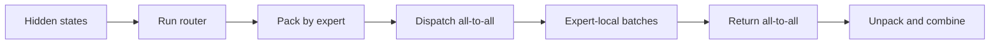
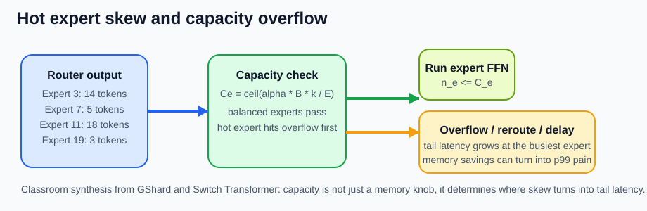
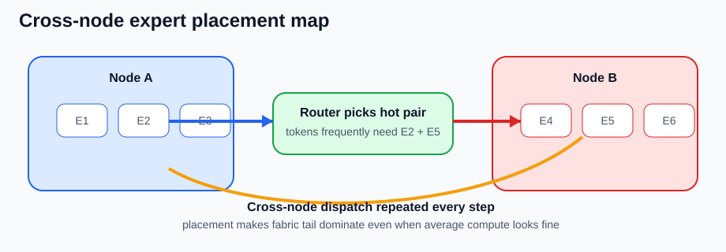

# MoE Serving and Expert Parallelism

## 수업 개요
이 장은 학습된 MoE 모델을 여러 accelerator에 배포할 때 생기는 실행 문제만 다룬다. 모델은 expert layout, top-k, gate weight, capacity와 overflow semantics를 contract로 넘긴다고 가정한다 [S1][S2][S3]. Runtime은 router가 선택한 token을 expert가 있는 rank로 dispatch하고, expert별 batch를 실행한 뒤 결과를 원래 token 순서로 combine한다.

병목은 expert FLOPs의 합으로 결정되지 않는다. Token routing이 매 step 달라지므로 hot expert queue, cross-node all-to-all, placement, 작은 batch에서 드러나는 통신 고정비가 p95와 p99를 만든다 [S2][S3]. vLLM도 Expert Parallel Load Balancer(EPLB)를 별도 운영 기능으로 제공하며 추론 중 expert 불균형을 placement 문제로 다룬다 [S4].

## 학습 목표
- Dispatch-all-to-all-expert-combine 실행 경로를 설명할 수 있다.
- Expert Parallelism(EP)과 dense Tensor Parallelism(TP)을 구분할 수 있다.
- Hot expert와 straggler가 step tail latency를 만드는 과정을 설명할 수 있다.
- Expert placement와 EPLB의 효과와 비용을 말할 수 있다.
- Low-batch workload에서 amortization이 깨지는 조건을 판단할 수 있다.
- Router, queue, fabric, placement 순서로 장애를 진단할 수 있다.

## 수업 전에 생각할 질문
- 평균 utilization이 비슷한데 일부 요청의 p99만 길어질 수 있는가?
- 자주 함께 선택되는 expert를 다른 node에 놓으면 어떤 tensor가 매 step 이동하는가?
- Expert를 재배치해서 얻는 균형 개선은 weight 이동 비용보다 항상 큰가?

## 강의 스크립트

### Part 1. 모델 contract를 물리적 경로로 바꾼다
**교수자:** Top-k와 overflow 의미는 모델이 이미 정했습니다. Runtime은 이를 임의로 바꾸지 않습니다. 각 token의 hidden state를 선택 expert의 rank로 보내고, 결과를 되돌려 원래 위치에 합칩니다.

**학습자:** Router 계산은 작으니 expert GEMM만 빠르면 되는 것 아닌가요?

**교수자:** Router FLOPs가 작아도 그 출력은 token의 물리적 이동을 결정합니다. Pack/unpack, rank 간 dispatch, expert별 batch 차이, combine 대기가 순차 경로에 들어갑니다. Top-2라면 두 목적지로 hidden state를 보내고 두 결과가 돌아와야 결합할 수 있습니다 [S2].

### Part 2. EP는 dense TP와 다르게 흔들린다
Dense TP에서는 모든 rank가 같은 layer의 shard를 처리하며 비교적 규칙적인 collective를 반복한다. EP에서는 각 rank가 서로 다른 expert weight를 소유하고, routing 결과에 따라 송수신량이 달라진다 [S2]. 같은 batch size라도 입력 분포가 바뀌면 rank별 token 수가 달라진다.

| 구분 | Dense Tensor Parallelism | Expert Parallelism |
| --- | --- | --- |
| 분할 대상 | 같은 dense tensor의 shard | 서로 다른 expert weight |
| rank별 작업 | 대체로 같은 shape | 선택 token 수에 따라 가변 |
| 통신 | all-reduce/all-gather 계열 | dispatch와 return all-to-all |
| tail 원인 | 느린 shard와 collective | hot expert, queue와 placement |

$$
T_{\mathrm{step}}^{\mathrm{EP}} \approx T_{\mathrm{router}}+T_{\mathrm{pack}}+T_{\mathrm{dispatch}}+\max_e(T_{\mathrm{queue},e}+T_{\mathrm{expert},e})+T_{\mathrm{return}}+T_{\mathrm{combine}}
$$

이 학습용 근사에서 평균 expert 시간이 아니라 가장 늦은 expert 경로가 combine을 붙잡는다 [합성] [S1][S2][S3].

### Part 3. Hot expert는 평균보다 tail에 먼저 보인다
**학습자:** 전체 token 수를 expert 수로 나누면 rank별 부하를 예측할 수 있지 않나요?

**교수자:** 균등 routing일 때의 기준선일 뿐입니다. Prompt가 특정 domain이나 언어에 집중되면 선택도 치우칠 수 있습니다. 한 expert의 local batch와 queue가 커지고, capacity가 있는 구현에서는 overflow도 늘어난다 [S1][S2][S3]. 다른 rank가 끝나도 combine은 hot expert를 기다립니다.

- 캡션: Router skew가 특정 expert의 capacity와 queue를 먼저 밀어 올리는 과정을 보여 준다 [합성] [S2][S3].
- 출처 번호: [I1], [S2], [S3]

운영에서는 평균 utilization 외에 다음 분포를 함께 본다.

- Layer별 expert token histogram과 balancedness
- Expert별 queue depth와 kernel time
- Capacity overflow, drop, reroute 또는 delay 수
- Rank별 dispatch/return bytes와 all-to-all 시간
- 요청 class별 p50, p95, p99와 expert 선택 분포

### Part 4. Placement는 통신 경로를 설계한다
Expert placement는 expert id를 어떤 rank와 node에 둘지 정한다. 자주 선택되는 expert가 느린 device에 몰리거나 top-2에서 함께 선택되는 expert 쌍이 서로 다른 node에 있으면 remote traffic과 tail이 커질 수 있다 [합성] [S2][S4].

- 캡션: 함께 선택되는 expert가 다른 node에 있을 때 cross-node dispatch와 return이 반복되는 장면이다 [합성] [S2].
- 출처 번호: [I2], [S2]

**학습자:** Hot expert를 감지할 때마다 즉시 옮기면 되나요?

**교수자:** 재배치는 공짜가 아닙니다. Weight 이동이나 replica 생성, routing table 갱신은 메모리와 fabric을 사용합니다. 짧은 spike를 따라가면 thrashing도 생깁니다. vLLM EPLB는 관측한 부하를 바탕으로 logical expert와 physical expert의 mapping을 조정한다 [S4]. 따라서 `균형 개선`과 함께 `관측 window`, `update interval`, `weight 이동`, `replica memory`를 기록해야 합니다.

### Part 5. Low-batch에서는 고정비가 숨지 않는다
큰 offline batch에서는 expert별 token이 모여 GEMM 효율이 올라가고 pack/all-to-all 비용을 나눌 수 있다. 반면 interactive decode는 살아 있는 token이 적고 요청 완료로 구성이 계속 바뀐다. Expert-local batch가 작아지면 kernel 효율이 낮고 hidden state 이동이 계산보다 크게 보일 수 있다 [합성] [S1][S2][S3].

$$
T_{\mathrm{token}} \approx T_{\mathrm{expert}} + \frac{B k H\,\mathrm{bytes(dtype)}}{BW_{\mathrm{effective}}} + T_{\mathrm{collective\ fixed}}
$$

정확한 성능식이 아니라 batch $B$가 작을수록 collective 고정 지연을 amortize하기 어렵다는 점을 보이는 근사다 [합성] [S2].

**학습자:** 그러면 MoE는 interactive serving에 쓰면 안 되나요?

**교수자:** 그렇지는 않습니다. 같은 node에 expert를 두고 충분한 동시성을 모으며 kernel과 collective를 최적화하면 이득을 얻을 수 있습니다. 판단 기준은 active parameter가 아니라 실제 workload의 goodput과 SLO입니다. 낮은 동시성에서 p99가 중요하고 routing의 품질 이득도 작다면 dense가 더 나은 운영 선택일 수 있습니다.

### Part 6. 장애는 경로 순서대로 진단한다
1. **Workload를 고정한다.** Prompt class, concurrency, 길이와 top-k가 바뀌지 않았는지 확인한다.
2. **Router 분포를 본다.** Layer별 histogram과 balancedness로 skew가 시작된 위치를 찾는다 [S1][S2][S4].
3. **Capacity 결과를 본다.** Model contract가 정한 drop/reroute/delay가 얼마나 발생했는지 확인한다 [S2][S3].
4. **Expert queue를 본다.** 가장 늦은 expert의 token 수, queue time과 kernel time을 분리한다.
5. **Fabric을 본다.** Rank/node별 bytes, all-to-all duration과 straggler를 확인한다 [S2].
6. **Placement와 EPLB를 검증한다.** Hot expert 위치, replica와 rebalancing 비용을 비교한다 [S4].
7. **적합성을 다시 판단한다.** Low-batch 고정비가 지배적이면 batching과 topology를 조정하고 dense 기준선과 비교한다.

### Part 7. 운영 장면으로 원인을 분리한다
**장면 A: 평균 throughput은 유지되지만 p99가 급등했다.** 특정 prompt class에서만 histogram이 치우치고 한 rank의 queue가 길다면 hot expert 문제다. 장비를 늘리기 전에 capacity 결과와 EPLB mapping을 확인한다 [S2][S3][S4].

**장면 B: Multi-node 확장 뒤 지연이 늘었다.** Expert compute가 아니라 remote dispatch bytes와 all-to-all이 증가했다면 placement 문제다. 함께 선택되는 expert pair와 node 경계를 대조한다 [합성] [S2].

**장면 C: 야간 batch는 빠르지만 실시간 챗봇은 느리다.** 같은 모델이어도 local expert batch와 collective amortization이 다르다. Workload별 SLO와 profile을 분리하고 interactive traffic에는 dense 기준선을 유지한다.

## 자주 헷갈리는 포인트
- EP는 expert weight를 나누는 배치 전략이지 top-k를 정하는 모델 architecture가 아니다.
- Capacity와 overflow semantics는 모델 contract이며 runtime이 임의로 바꾸면 안 된다.
- 평균 utilization이 정상이어도 한 expert queue가 길면 p99는 악화될 수 있다.
- EPLB는 router를 재학습하지 않고 physical placement를 조정한다 [S4].
- Node 수를 늘리면 memory 여유와 함께 cross-node all-to-all 경로도 늘 수 있다.

## 핵심 정리
- Critical path는 `router -> pack -> dispatch -> expert queue/compute -> return -> combine`이다.
- EP는 token 분포에 따라 rank별 작업량과 통신량이 변하므로 dense TP보다 동적이다 [S2].
- Hot expert, capacity 결과, fabric straggler와 placement를 함께 봐야 tail을 설명할 수 있다.
- EPLB는 관측 window, replica memory와 재배치 비용까지 포함해 평가해야 한다 [S4].
- Low-batch에서는 active parameter 절감보다 dispatch 고정비와 작은 expert GEMM이 더 크게 보일 수 있다.

## 복습 체크리스트
- Dispatch와 return all-to-all에서 이동하는 tensor를 설명할 수 있는가?
- EP와 dense TP의 rank별 작업량이 왜 다르게 흔들리는지 말할 수 있는가?
- Hot expert가 p99에 먼저 나타나는 이유를 설명할 수 있는가?
- Placement와 EPLB의 효과 및 비용을 함께 측정할 수 있는가?
- Router부터 workload 적합성까지 진단 순서를 재현할 수 있는가?

## 출처
| 번호 | 제목 | 발행 주체 | 날짜 | URL | 사용 이유 |
| --- | --- | --- | --- | --- | --- |
| [S1] | Outrageously Large Neural Networks: The Sparsely-Gated Mixture-of-Experts Layer | Google Research / arXiv | 2017-01-23 | https://arxiv.org/abs/1701.06538 | expert routing과 load imbalance가 실행 경로에 주는 조건 |
| [S2] | GShard: Scaling Giant Models with Conditional Computation and Automatic Sharding | Google Research / arXiv | 2020-06-29 | https://arxiv.org/abs/2006.16668 | top-2 dispatch, capacity, sharding과 분산 실행 경로 |
| [S3] | Switch Transformers: Scaling to Trillion Parameter Models with Simple and Efficient Sparsity | Google Research / JMLR | 2022-01-01 | https://arxiv.org/abs/2101.03961 | top-1과 capacity/overflow가 runtime에 넘기는 조건 |
| [S4] | Expert Parallel Deployment | vLLM project | 2026-03-08 (accessed) | https://docs.vllm.ai/en/v0.14.1/serving/expert_parallel_deployment/ | expert parallel 배포, EPLB와 balancedness 설정 |
