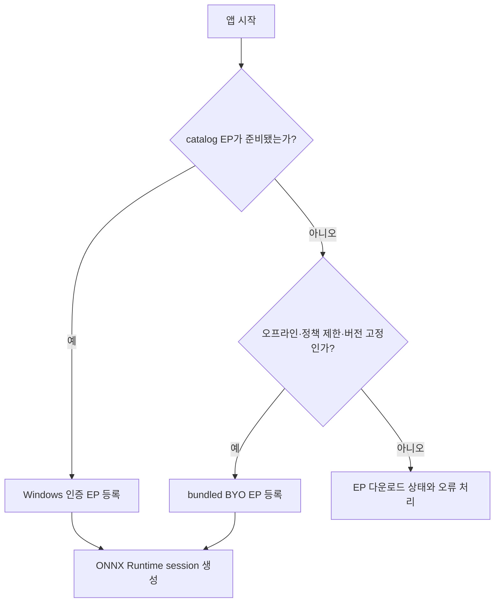
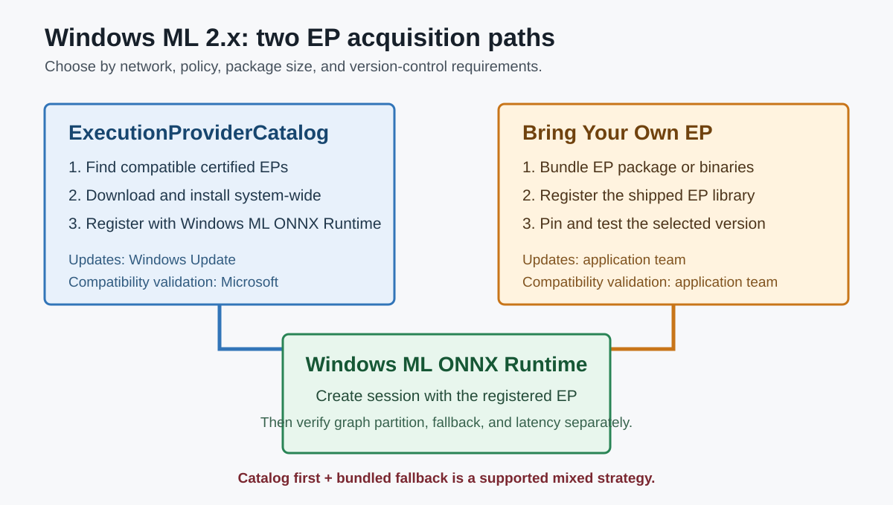

# Windows ML 2.x와 Execution Provider 배포

## 수업 개요

Windows ML 2.x의 핵심은 NPU를 자동으로 골라 주는 단일 API가 아니다. 앱이 ONNX Runtime을 사용하면서 장치별 Execution Provider(EP)를 어떻게 발견하고, 설치하고, 등록하고, 업데이트할지를 Windows 차원에서 관리하는 경로다. `ExecutionProviderCatalog`는 호환 EP를 동적으로 내려받아 시스템 전체에서 공유하고 Windows Update로 갱신할 수 있다. 앱이 EP 바이너리를 직접 포함하는 Bring Your Own EP(BYO EP)도 대안으로 남아 있다. [S1] [S2] [S4]

따라서 Windows ML과 직접 EP 사용은 양자택일이 아니다. 일반 소비자 장치에서는 catalog를 우선하고, 오프라인·관리형 장치·엄격한 버전 고정 환경에서는 BYO EP를 쓰거나 catalog 실패 시 bundled EP로 넘어가는 혼합 전략도 가능하다. [S2] [S4]

## 학습 목표

- Windows ML, ONNX Runtime, EP catalog, 장치의 관계를 설명할 수 있다.
- `ExecutionProviderCatalog`가 EP를 발견·설치·등록하는 흐름을 설명할 수 있다.
- catalog와 BYO EP의 배포·업데이트·호환성 책임을 비교할 수 있다.
- EP를 확보한 것과 모델 graph가 실제 장치에서 효율적으로 실행되는 것을 구분할 수 있다.

## 수업 전에 생각할 질문

- 첫 실행 시 네트워크를 사용할 수 없는 제품이라면 catalog만으로 충분한가?
- EP 버전을 엄격히 고정해야 한다면 자동 업데이트가 장점인가, 변경 위험인가?
- catalog에서 NPU EP를 찾았다는 사실만으로 실제 NPU 실행률을 알 수 있는가?

## 강의 스크립트

### Part 1. Windows ML 2.x가 관리하는 것은 EP의 생애 주기다

**교수자:** Windows ML을 "Windows의 NPU API"라고만 부르면 중요한 부분을 놓칩니다. Windows ML은 ONNX Runtime과 함께 동작하며, 장치별 가속은 EP가 담당합니다. 2.x에서 눈여겨볼 제어면은 `ExecutionProviderCatalog`입니다. [S1] [S2]

**학습자:** catalog가 장치를 직접 실행한다는 뜻인가요?

**교수자:** 아닙니다. catalog는 호환 EP를 찾고 준비하는 계층입니다. `FindAllProviders()`로 설치되지 않은 후보까지 볼 수 있고, `EnsureAndRegisterCertifiedAsync()`는 호환되는 Windows 인증 EP를 내려받아 설치한 뒤 ONNX Runtime에 등록합니다. 실제 session과 graph 실행은 등록된 EP를 통해 이뤄집니다. [S2]

**학습자:** 그러면 앱에 QNN이나 OpenVINO 바이너리를 모두 넣지 않아도 되겠네요.

**교수자:** catalog 경로에서는 그렇습니다. EP는 시스템에 설치되고 여러 앱이 공유하며 Windows Update로 갱신됩니다. Microsoft의 지원 목록에는 OpenVINO, QNN, VitisAI 등 장치별 EP와 버전 정보가 따로 공개됩니다. 지원 여부는 제품명만 보지 말고 Windows ML, ONNX Runtime, EP, 드라이버 버전의 조합으로 읽어야 합니다. [S2] [S3]

### Part 2. catalog와 BYO EP는 함께 쓸 수 있다

**학습자:** 그렇다면 직접 EP를 포함하는 방식은 이제 필요 없나요?

**교수자:** 여전히 필요합니다. catalog는 첫 준비에 네트워크와 Windows Update 정책의 영향을 받습니다. 관리형 기업 장치, 오프라인 환경, 정확한 EP 버전 고정이 필요한 제품에서는 EP DLL이나 패키지를 앱과 함께 배포하는 BYO EP가 더 예측 가능합니다. [S2] [S4]

| 항목 | Windows ML EP catalog | BYO EP |
| --- | --- | --- |
| EP 확보 | API로 발견·다운로드·등록 [S2] | 앱 패키지나 설치 프로그램에 포함 [S4] |
| 업데이트 | Windows Update를 통한 자동 갱신 [S2] | 앱 팀이 버전과 배포 시점 통제 [S4] |
| 앱 크기 | EP를 앱에 묶지 않아 작게 유지 가능 [S4] | EP마다 패키지 크기 증가 [S4] |
| 오프라인·관리형 장치 | 정책이나 네트워크에 막힐 수 있음 [S2] | 사전 포함하면 동작 경로를 고정 가능 [S4] |
| 호환성 검증 | Microsoft가 Windows ML·ORT·EP 조합을 검증 [S4] | 앱 팀이 ORT·EP 조합을 직접 검증 [S4] |

**학습자:** 한 제품에서 둘 중 하나만 골라야 하는 건 아니군요.

**교수자:** 맞습니다. 공식 비교 문서는 catalog를 우선 시도하고, 실패하면 같은 hardware target의 bundled EP로 넘어가는 혼합 경로도 설명합니다. inference 코드를 두 벌로 만드는 문제가 아니라 EP 획득과 등록 정책을 두 경로로 준비하는 문제입니다. [S4]

### Part 3. 자동 준비는 공짜가 아니다

**교수자:** `EnsureAndRegisterCertifiedAsync()`는 단순하지만 첫 실행에 다운로드가 필요하면 수 초에서 수 분이 걸릴 수 있습니다. 이 시간을 모델 추론 지연과 섞으면 원인을 잘못 진단합니다. [S2]

$$
T_{first\ use} = T_{EP\ acquire} + T_{EP\ register} + T_{model\ load} + T_{session} + T_{infer}
$$

**학습자:** 그러면 첫 화면에서 바로 호출하면 앱이 멈춘 것처럼 보일 수 있겠네요.

**교수자:** 그렇습니다. 설치 상태를 먼저 확인하고, 다운로드 진행과 실패를 UI 상태로 다루며, 다음 실행에서 이미 준비된 EP를 재사용해야 합니다. BYO EP라면 다운로드 비용은 줄지만 앱 크기와 업데이트 책임이 늘어납니다. [S2] [S4]

### Part 4. EP가 준비돼도 graph coverage는 별도 문제다

**학습자:** catalog가 호환 EP를 등록하면 NPU 성능도 자동으로 보장되나요?

**교수자:** 보장되지 않습니다. catalog가 답하는 질문은 "이 장치에서 사용할 수 있는 EP를 어떻게 준비할까"입니다. 모델의 operator, shape, precision이 그 EP에서 얼마나 실행되는지는 provider와 모델의 계약입니다. Windows ML 지원표도 EP마다 요구 장치와 버전을 별도로 제시합니다. [S3]

**교수자:** 운영 로그도 두 층으로 나누세요.

1. EP 준비 층: 발견 결과, ready state, 다운로드·등록 오류, 실제 EP 버전
2. 모델 실행 층: session 생성, graph partition, fallback, TTFT·latency·메모리

**학습자:** "Windows ML이 느리다"가 아니라 "EP 다운로드가 느리다" 또는 "OpenVINO EP에서 graph coverage가 낮다"처럼 말해야겠네요.

**교수자:** 정확합니다. 제어면과 실행면을 분리해야 해결 책임도 분명해집니다.

### Part 5. 배포 정책을 고르는 사례

**교수자:** 소비자용 회의 요약 앱은 앱 크기를 작게 유지하고 EP 개선을 자동으로 받는 편이 유리합니다. Windows 11 24H2 이상을 대상으로 하고 네트워크를 기대할 수 있다면 catalog 우선이 자연스럽습니다. [S4]

**학습자:** 폐쇄망 기업용 문서 분류 앱은요?

**교수자:** Windows Update가 막혀 있고 배포 승인을 받은 버전만 써야 한다면 BYO EP가 맞습니다. 다만 Windows ML이나 포함된 ORT를 올릴 때마다 EP 등록, session 생성, 대표 workload를 다시 검증해야 합니다. Microsoft도 BYO EP의 미래 호환성을 보장하지 않는다고 명시합니다. [S4]

**학습자:** 같은 제품이 두 환경을 모두 지원하면요?

**교수자:** catalog 우선, bundled EP fallback을 설계할 수 있습니다. 대신 실제로 선택된 경로와 버전을 telemetry에 남겨야 같은 오류를 재현할 수 있습니다. [S4]

## 자주 헷갈리는 포인트

- Windows ML과 직접 EP 사용은 완전한 양자택일이 아니다. catalog와 BYO EP를 혼합할 수 있다. [S4]
- `ExecutionProviderCatalog`는 EP의 발견·설치·등록을 관리한다. 모델 graph의 가속률까지 보장하지는 않는다. [S2] [S3]
- catalog의 자동 업데이트는 장점이지만 엄격한 재현성과 버전 고정 요구에는 맞지 않을 수 있다. [S4]
- BYO EP는 단순히 파일을 넣는 것으로 끝나지 않는다. Windows ML에 포함된 ORT와의 ABI·버전 호환성을 앱 팀이 검증해야 한다. [S4]
- 첫 실행의 EP 다운로드 시간과 모델 추론 시간을 같은 latency로 기록하면 병목을 잘못 찾는다. [S2]

## 핵심 정리

- Windows ML 2.x는 ONNX Runtime 위에서 EP의 획득과 등록을 Windows 방식으로 관리한다. [S1] [S2]
- catalog는 인증 EP를 시스템에 설치·공유·업데이트하고, BYO EP는 오프라인·관리형·버전 고정 환경의 대안이다. [S2] [S4]
- 두 경로는 병행할 수 있으며, 선택 기준은 네트워크·IT 정책·앱 크기·버전 통제다. [S4]
- EP 준비 성공과 모델의 장치 실행 성공은 서로 다른 검증 단계다. [S3]

## 복습 체크리스트

- `FindAllProviders()`와 `EnsureAndRegisterCertifiedAsync()`의 역할을 구분할 수 있는가?
- catalog와 BYO EP 중 누가 업데이트와 호환성 검증을 책임지는지 설명할 수 있는가?
- catalog 우선·bundled EP fallback이 필요한 제품 환경을 제시할 수 있는가?
- EP 획득 시간과 모델 inference 시간을 분리해 계측할 수 있는가?
- 실제 사용된 EP와 버전을 운영 로그에 남겨야 하는 이유를 설명할 수 있는가?

## 참고 이미지

- 캡션: catalog와 BYO EP가 같은 ONNX Runtime session으로 모이지만, 설치·업데이트·호환성 책임은 다르다는 점을 보여 주는 로컬 도식이다. [S2] [S4]
- 왜 이 그림이 필요한가: Windows ML과 직접 EP를 양자택일로 보는 오해를 바로잡고, 혼합 배포의 책임 경계를 한눈에 비교한다.

## 출처

| 번호 | 제목 | 발행 주체 | 접근 날짜 | URL | 사용 이유 |
| --- | --- | --- | --- | --- | --- |
| [S1] | What is Windows ML? | Microsoft Learn | 2026-08-14 | [https://learn.microsoft.com/en-us/windows/ai/new-windows-ml/overview](https://learn.microsoft.com/en-us/windows/ai/new-windows-ml/overview) | Windows ML과 ONNX Runtime의 공식 구조 |
| [S2] | Install Windows ML execution providers | Microsoft Learn | 2026-08-14 | [https://learn.microsoft.com/en-us/windows/ai/new-windows-ml/initialize-execution-providers](https://learn.microsoft.com/en-us/windows/ai/new-windows-ml/initialize-execution-providers) | `ExecutionProviderCatalog`, 동적 설치·등록·업데이트, 첫 실행 비용 |
| [S3] | Windows ML execution providers | Microsoft Learn | 2026-08-14 | [https://learn.microsoft.com/en-us/windows/ai/new-windows-ml/supported-execution-providers](https://learn.microsoft.com/en-us/windows/ai/new-windows-ml/supported-execution-providers) | OpenVINO·QNN·VitisAI 등 지원 EP와 버전 행렬 |
| [S4] | Windows ML EPs vs. bring-your-own | Microsoft Learn | 2026-08-14 | [https://learn.microsoft.com/en-us/windows/ai/new-windows-ml/windows-ml-eps-vs-bring-your-own](https://learn.microsoft.com/en-us/windows/ai/new-windows-ml/windows-ml-eps-vs-bring-your-own) | catalog, BYO EP, 혼합 전략의 공식 비교 |
