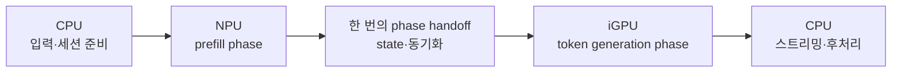
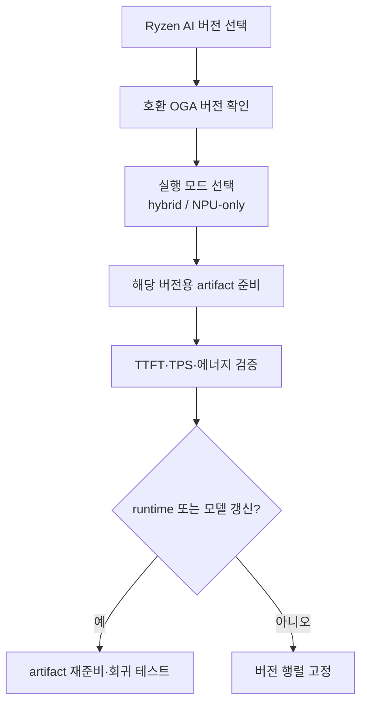
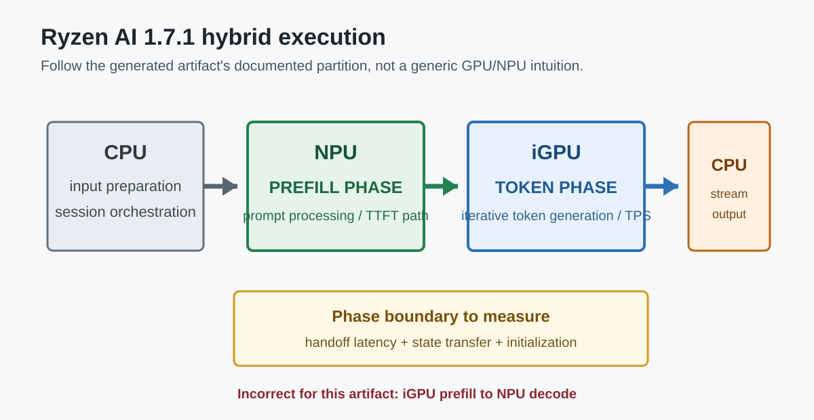
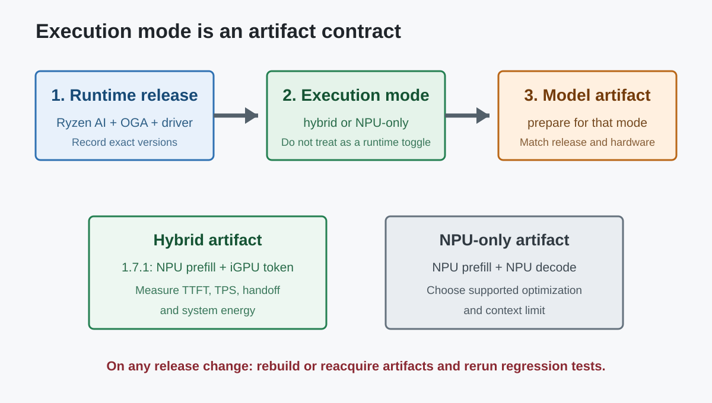

# Ryzen AI OGA: NPU-only와 Hybrid 실행

## 수업 개요

Ryzen AI의 ONNX Runtime GenAI(OGA) 경로는 NPU-only와 hybrid를 별도 실행 모드로 제공한다. 이 구분을 일반적인 "GPU는 prefill, NPU는 decode" 직관으로 채우면 안 된다. Ryzen AI 1.7.1의 공식 모델 준비 문서는 hybrid artifact를 **NPU prefill phase + GPU token phase**로 명시한다. NPU-only artifact는 prefill과 decode를 모두 NPU에서 수행한다. [S1]

현재 Ryzen AI 문서는 hybrid를 NPU와 iGPU의 동적 분할로, NPU-only를 NPU 전용 실행으로 설명한다. 또한 1.8은 OGA 버전과 모델 세트를 갱신했고 이전 릴리스 모델이 호환되지 않는다고 밝힌다. 따라서 장치 역할과 지원 범위는 추측이 아니라 선택한 Ryzen AI 버전, 실행 모드, 생성된 artifact를 기준으로 확인해야 한다. [S2] [S3]

## 학습 목표

- Ryzen AI 1.7.1 hybrid의 `NPU prefill + iGPU token generation` 배치를 정확히 설명할 수 있다.
- hybrid와 NPU-only가 서로 다른 artifact·실행 계약임을 설명할 수 있다.
- TTFT, TPS, 에너지, handoff 비용을 같은 실험에서 비교할 수 있다.
- Ryzen AI, OGA, 모델 artifact의 버전 조합을 배포 계약으로 관리할 수 있다.

## 수업 전에 생각할 질문

- hybrid 모델 폴더와 NPU-only 모델 폴더를 같은 옵션만 바꿔 실행할 수 있다고 생각하고 있지는 않은가?
- NPU prefill 뒤 iGPU token phase로 넘어갈 때 어떤 state와 초기화 비용이 경계를 건너는가?
- 새 Ryzen AI 릴리스로 올릴 때 runtime만 바꾸고 이전 artifact를 그대로 써도 되는가?

## 강의 스크립트

### Part 1. 실행 모드보다 먼저 artifact의 계약을 읽는다

**교수자:** Ryzen AI OGA에서 가장 위험한 문장은 "hybrid니까 적당히 GPU와 NPU가 나눠서 돈다"입니다. 1.7.1의 모델 준비 절차는 `model_generate --hybrid`가 만드는 artifact를 NPU prefill phase와 GPU token phase의 조합으로 설명합니다. [S1]

**학습자:** 기존에 흔히 듣던 GPU prefill, NPU decode와 반대네요.

**교수자:** 그렇습니다. 그래서 하드웨어에 대한 일반 직관으로 vendor runtime의 실제 partition을 추정하면 안 됩니다. 이 경로에서는 긴 prompt를 처리하는 prefill이 NPU에 있고, 이후 반복 token generation이 iGPU에 있습니다. [S1]

**학습자:** NPU-only는 같은 artifact에서 GPU만 끄는 방식인가요?

**교수자:** 그렇게 보면 안 됩니다. 1.7.1 준비 절차부터 `--hybrid`와 `--npu`가 갈리고, NPU-only에는 Full Fusion, Token Fusion 등 별도 최적화 형태가 있습니다. NPU-only는 prefill과 decode를 NPU에서 수행합니다. [S1] [S3]

| 실행 모드 | prefill | token generation/decode | 먼저 확인할 것 |
| --- | --- | --- | --- |
| Ryzen AI 1.7.1 hybrid | NPU [S1] | iGPU [S1] | `--hybrid`로 만든 artifact와 해당 runtime 버전 |
| NPU-only | NPU [S1] | NPU [S1] | 지원 모델, Token Fusion/Full Fusion, context 한도 [S3] |
| GPU-only | 해당 OGA hybrid artifact가 아니라 별도 GPU 경로 [S2] | GPU [S2] | runtime과 모델 형식을 혼동하지 않았는지 |

### Part 2. hybrid의 성능은 두 phase와 경계로 나눠 잰다

**학습자:** hybrid가 항상 NPU-only보다 빠른가요?

**교수자:** 공식 문서는 hybrid가 NPU와 iGPU를 이용해 prefill과 decode의 TTFT·TPS를 최적화한다고 설명하지만, 제품 선택은 실제 workload로 검증해야 합니다. [S2] [S3] 짧은 prompt와 긴 출력, 긴 prompt와 짧은 출력은 두 장치에 주는 압력이 다릅니다.

$$
T_{request} = T_{NPU\ prefill} + T_{handoff} + T_{iGPU\ token}(N) + T_{host}
$$

**교수자:** hybrid에서는 최소한 네 시간을 분리해야 합니다. NPU prefill, phase handoff, iGPU token generation, host orchestration입니다. 전체 latency만 보면 NPU prefill이 느린지, iGPU token phase가 느린지, 경계가 비싼지 알 수 없습니다.

**학습자:** NPU-only 비교는 어떻게 해야 하나요?

**교수자:** 같은 모델 계열과 품질 조건, 같은 input/output token 길이에서 TTFT와 TPS를 따로 재고 에너지와 메모리도 함께 기록합니다. 서로 다른 artifact가 수치 정밀도나 context 한도를 달리할 수 있으므로 artifact 이름과 생성 버전을 벤치마크 결과에 반드시 붙여야 합니다. [S1] [S3]

### Part 3. 전력 효율도 장치 이름으로 추정하지 않는다

**학습자:** NPU가 prefill만 맡는다면 hybrid는 배터리 목표와 상관없나요?

**교수자:** 그렇지 않습니다. prefill이 길면 NPU 구간의 비중이 커질 수 있고, token generation이 길면 iGPU 구간이 지배적일 수 있습니다. "NPU를 썼으니 전력 효율적"이 아니라 phase별 실행 시간과 시스템 전력을 곱해 봐야 합니다.

$$
E_{request} = P_{NPU}T_{prefill} + P_{iGPU}T_{token} + E_{handoff} + E_{host}
$$

**교수자:** 이 식은 특정 AMD 수치를 주장하는 공식이 아니라 측정 틀입니다. 긴 출력에서 iGPU token phase가 전체 에너지를 지배한다면, NPU prefill만 보고 배터리 이득을 말할 수 없습니다. 반대로 긴 문서 입력과 짧은 출력에서는 NPU prefill의 효과가 더 크게 보일 수 있습니다.

### Part 4. 버전은 설치 정보가 아니라 배포 계약이다

**학습자:** Ryzen AI를 업데이트하면 이전 모델 폴더를 그대로 쓸 수 있나요?

**교수자:** 확인 없이 쓰면 안 됩니다. 현재 1.8 문서는 OGA를 0.14.0으로 올렸고, 1.7.1은 0.11.2였으며, 새 hybrid/NPU 모델 세트가 이전 릴리스와 호환되지 않는다고 명시합니다. [S3]

**교수자:** 배포 표에는 `Ryzen AI release`, `OGA version`, `model artifact`, `execution mode`, `driver`, `hardware family`가 함께 있어야 합니다. "Ryzen AI에서 된다"는 문장만으로는 재현할 수 없습니다. [S2] [S3]

### Part 5. 사례로 판단하기

**교수자:** 긴 문서 요약 앱을 보겠습니다. 입력 8K, 출력 200 token이라면 hybrid의 NPU prefill 구간이 중요합니다. 먼저 NPU prefill TTFT와 handoff를 측정하고, 같은 조건의 NPU-only artifact와 비교합니다. [S1]

**학습자:** 짧은 prompt로 긴 코드를 생성하는 앱은요?

**교수자:** iGPU token phase가 지배적일 가능성이 큽니다. 이때 "NPU hybrid"라는 이름만 보고 전력 이득을 기대하지 말고 TPS와 장시간 시스템 전력을 봐야 합니다. 이것은 workload에서 도출하는 판단이며, device label에서 자동으로 따라오는 결론이 아닙니다.

**학습자:** 현장에서 실행 결과가 예상과 다르면 어디부터 보나요?

**교수자:** 순서는 명확합니다.

1. artifact가 hybrid인지 NPU-only인지 확인한다.
2. artifact를 만든 Ryzen AI/OGA 버전과 설치 runtime이 맞는지 확인한다.
3. phase별 로그에서 NPU prefill과 iGPU token generation이 실제로 성립하는지 본다.
4. TTFT, TPS, handoff, 전력, memory를 같은 prompt/output 조건으로 비교한다.

## 자주 헷갈리는 포인트

- Ryzen AI 1.7.1 hybrid는 `GPU prefill -> NPU decode`가 아니다. 공식 모델 준비 경로는 `NPU prefill -> GPU token phase`다. [S1]
- NPU-only는 hybrid에서 iGPU만 비활성화한 동일 artifact가 아니다. 생성 옵션과 최적화 형태가 다르다. [S1] [S3]
- hybrid라는 이름만으로 TTFT, TPS, 에너지 우위를 단정할 수 없다. input/output 길이와 phase별 시간을 같이 측정해야 한다.
- 최신 runtime이 이전 artifact를 자동으로 받아 줄 것이라 가정하면 안 된다. 1.8 문서는 이전 릴리스 모델과의 비호환을 명시한다. [S3]
- 공식 문서가 말하는 partition과 일반적인 GPU/NPU 직관이 다를 때는 artifact의 공식 계약이 우선이다.

## 핵심 정리

- Ryzen AI 1.7.1 hybrid의 장치 역할은 NPU prefill과 iGPU token generation이다. [S1]
- NPU-only는 prefill과 decode 모두 NPU에서 실행하는 별도 모드와 artifact다. [S1]
- hybrid 평가는 TTFT, TPS, handoff, 에너지, host 비용을 phase별로 분리해야 한다.
- Ryzen AI, OGA, artifact, driver, hardware 버전 행렬을 함께 고정해야 재현 가능한 배포가 된다. [S2] [S3]

## 복습 체크리스트

- 1.7.1 hybrid의 prefill과 token generation 장치를 정확히 말할 수 있는가?
- hybrid와 NPU-only artifact의 생성 경로가 다르다는 점을 설명할 수 있는가?
- 긴 입력과 긴 출력 중 어느 쪽이 각 phase를 지배하는지 판단할 수 있는가?
- runtime 업데이트 시 artifact 재준비와 회귀 테스트가 필요한 이유를 설명할 수 있는가?

## 참고 이미지

### 참고 이미지 1. Ryzen AI 1.7.1 hybrid phase map

- 캡션: 공식 모델 준비 문서의 NPU prefill과 iGPU token generation 배치를 그대로 반영한 로컬 도식이다. [S1]
- 왜 이 그림이 필요한가: 기존의 반대 방향 도식을 대체하고 phase 경계를 명확히 보여 준다.

### 참고 이미지 2. 실행 모드와 버전 검증 지도

- 캡션: hybrid와 NPU-only를 별도 artifact로 보고 Ryzen AI·OGA 버전까지 함께 검증하는 흐름이다. [S1] [S3]
- 왜 이 그림이 필요한가: 장치 선택보다 먼저 artifact와 버전 계약을 확인하게 만든다.

## 출처

| 번호 | 제목 | 발행 주체 | 접근 날짜 | URL | 사용 이유 |
| --- | --- | --- | --- | --- | --- |
| [S1] | Preparing OGA Models (Ryzen AI 1.7.1) | AMD Ryzen AI docs | 2026-08-14 | [https://ryzenai.docs.amd.com/en/1.7.1/oga_model_prepare.html](https://ryzenai.docs.amd.com/en/1.7.1/oga_model_prepare.html) | hybrid artifact가 NPU prefill phase + GPU token phase임을 명시하는 공식 근거 |
| [S2] | LLM Deployment Overview | AMD Ryzen AI docs | 2026-08-14 | [https://ryzenai.docs.amd.com/en/latest/llm/overview.html](https://ryzenai.docs.amd.com/en/latest/llm/overview.html) | 현재 NPU-only·hybrid·GPU 실행 모드의 공식 개요 |
| [S3] | OnnxRuntime GenAI (OGA) Flow | AMD Ryzen AI docs | 2026-08-14 | [https://ryzenai.docs.amd.com/en/latest/hybrid_oga.html](https://ryzenai.docs.amd.com/en/latest/hybrid_oga.html) | 현재 OGA 버전, NPU 모델 유형, 이전 artifact 비호환성 |
