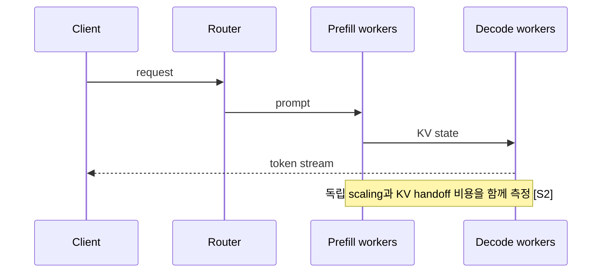
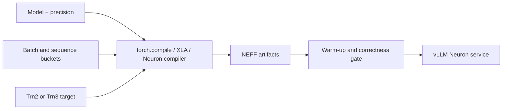

# vLLM, TensorRT-LLM, Neuron 비교

## 수업 개요
이 챕터는 세 이름을 단순한 속도 순위로 세우지 않는다. vLLM은 여러 backend와 모델을 빠르게 검증하는 범용 serving 기준선이고, TensorRT-LLM은 NVIDIA GPU에서 engine build와 stage별 최적화를 깊게 가져가는 선택이다. Neuron은 2026년 7월 공개된 Neuron 2.31의 `vllm-neuron` Beta plugin을 기준선으로 삼아 Trainium의 compiler, runtime, artifact와 vLLM V1을 하나의 배포 계약으로 관리하는 선택이다. [S1][S2][S3][S4]

Neuron 부분은 과거 NxD Inference 기반 vLLM 경로와 현재 plugin 경로를 구분한다. AWS는 Neuron 2.28부터 vLLM V0 지원을 종료했고, 2.31에서 독립된 vLLM Neuron plugin을 도입했다. 따라서 오래된 V0 container나 2.26 문서를 현재 운영 기준으로 사용하면 안 된다. [S4][S5][S6]

## 학습 목표
- 세 runtime을 모델 온보딩, 최적화 깊이, 하드웨어 종속성, 버전 계약으로 비교할 수 있다.
- TensorRT-LLM의 disaggregated serving이 만드는 이득과 handoff 비용을 함께 설명할 수 있다. [S2]
- Neuron 2.31의 vLLM V1 plugin과 이전 NxD Inference/V0 경로를 구분할 수 있다. [S3][S4][S5]
- Neuron에서 SDK, plugin, vLLM, hardware generation, compiled artifact를 함께 고정해야 하는 이유를 설명할 수 있다. [S4][S6]

## 수업 전에 생각할 질문
- 모델이 자주 바뀌는 팀과 하드웨어가 이미 표준화된 팀은 왜 같은 runtime을 선택하지 않을까?
- prefill과 decode를 분리했을 때 새로 생기는 네트워크 비용은 어느 지표에 나타날까?
- `vllm serve` 명령이 같아지면 GPU와 Trainium의 운영 방식도 같아지는가?

## 강의 스크립트

### 1. 비교표를 만들기 전에 실패 비용을 적는다
**교수자:** 최고 TPS부터 비교하면 팀의 실제 제약을 놓치기 쉽습니다. 새 모델을 올리는 데 일주일 걸리는 것이 가장 비싼지, GPU 활용률이 낮은 것이 비싼지, 특정 SDK 조합이 깨지는 것이 비싼지 먼저 정해야 합니다.

**학습자:** runtime 선택이 benchmark보다 조직의 변경 비용에 가깝다는 뜻입니까?

**교수자:** 그렇습니다. 같은 모델도 vLLM에서는 Python 환경과 모델 지원을 먼저 보고, TensorRT-LLM에서는 build와 지원 feature 조합을 먼저 보며, Neuron에서는 SDK와 plugin의 compatibility matrix부터 봅니다. [S1][S2][S4][S6]

$$
\mathrm{DecisionScore}(b)=w_o O_b+w_p P_b+w_s S_b-w_v V_b-w_m M_b
$$

여기서 $O$는 모델 온보딩 속도, $P$는 production feature 적합성, $S$는 성능 여지, $V$는 version-lock 비용, $M$은 migration 비용이다. 숫자를 정밀하게 계산하기보다 빠뜨린 비용을 드러내는 체크리스트로 사용한다.

### 2. vLLM은 운영 실험의 기준선을 빠르게 만든다
**학습자:** vLLM을 기준선으로 삼는다는 말은 항상 최종 선택이라는 뜻입니까?

**교수자:** 아닙니다. OpenAI-compatible API, scheduling, cache, parallelism과 model registry를 이용해 실제 workload를 빨리 재현한다는 뜻입니다. 모델 교체가 잦거나 여러 accelerator plugin을 비교할 때 공통 control plane이 되는 장점이 있습니다. [S1]

**학습자:** 그러면 benchmark도 vLLM 하나로 끝내면 됩니까?

**교수자:** 기준선을 만든 뒤 target backend의 feature parity를 확인해야 합니다. quantization, structured output, speculative decoding, prefix caching, cancellation, observability가 같은 이름으로 존재해도 지원 모델과 조합 제한은 다를 수 있습니다. API 표면이 같다는 이유로 실행 semantics까지 같다고 가정하지 않습니다.

### 3. TensorRT-LLM은 병목을 stage와 engine으로 더 깊게 나눈다
**교수자:** TensorRT-LLM의 disaggregated serving은 prefill과 decode를 별도 자원으로 배치합니다. 긴 prompt가 많은 서비스와 긴 generation이 많은 서비스는 두 stage의 요구가 다르기 때문에 독립 scaling의 가치가 생깁니다. [S2]

$$
\mathrm{TTFT}_{split}=T_{queue}+T_{prefill}+T_{KV\ transfer}+T_{first\ decode}
$$

**학습자:** 분리하면 각 stage를 최적화할 수 있으니 항상 더 빠르겠네요.

**교수자:** `T_KV transfer`와 router, 장애 경계가 새로 생깁니다. prefill GPU가 만든 KV를 decode GPU로 넘기는 시간이 절감분보다 크면 결과가 나빠집니다. 분리 여부는 평균 TPS가 아니라 prompt/output 분포, KV 크기, interconnect와 p99를 함께 측정해 결정합니다. [S2]

### 4. Neuron의 현재 기준선은 2.31 vLLM V1 plugin이다
**학습자:** Neuron도 `vllm serve`를 쓰니 vLLM의 AWS device option 정도로 보면 됩니까?

**교수자:** control plane은 익숙하지만 backend 계약은 다릅니다. Neuron 2.31에서 소개된 `vllm-neuron` plugin은 Trn2와 Trn3를 대상으로 vLLM serving stack을 연결합니다. 공식 문서는 continuous batching, prefix caching, EAGLE3 speculative decoding, structured output, disaggregated inference를 설명합니다. [S3][S4]

**학습자:** 이전 NxD Inference 기반 예제도 계속 같은 경로입니까?

**교수자:** 아닙니다. AWS는 새 plugin이 NxD Inference에 의존하지 않는다고 설명하고 migration guide를 따로 둡니다. 2.31 setup은 Neuron SDK 2.31 이상과 plugin 환경을 요구합니다. production 문서에는 `Neuron SDK + vllm-neuron + vLLM + instance generation`을 한 세트로 기록해야 합니다. [S3][S4][S6]

### 5. V0 종료는 단순한 이름 변경이 아니다
**학습자:** 기존 V0 container가 잘 돌면 그대로 유지해도 되지 않습니까?

**교수자:** AWS는 2026년 2월 26일 공지에서 Neuron 2.28부터 vLLM V0와 V0 기반 Neuron container를 지원하지 않는다고 명시했습니다. 현재 문서를 따라가려면 V1 plugin으로 migration 계획을 세워야 합니다. [S5]

**학습자:** migration에서 API만 같으면 되는 것 아닌가요?

**교수자:** scheduler와 cache, speculative decoding 방식, topology 설정이 바뀔 수 있습니다. 예를 들어 vLLM Neuron 문서는 continuous batching과 prefix caching을 기본 활성화하고, speculative decoding은 EAGLE3 범위를 명시합니다. disaggregated inference는 NIXL/LIBFABRIC과 EFA를 통한 KV transfer를 사용합니다. 기존 flag를 복사하는 대신 feature별 migration table로 검증해야 합니다. [S3][S4]

### 6. Neuron에서는 compile artifact도 배포 버전이다
**교수자:** GPU eager 실행에 익숙하면 Python package만 고정하고 끝내기 쉽습니다. Neuron plugin은 `torch.compile`을 통해 FX graph를 XLA/HLO와 Neuron compiler로 내리고, sequence length와 batch bucket별 NEFF artifact를 만듭니다. [S3]

**학습자:** package 버전이 같으면 artifact를 그대로 재사용해도 됩니까?

**교수자:** compiler, model, precision, bucket, target hardware가 artifact identity에 포함돼야 합니다. 잘못된 cache hit는 시작 실패나 성능 회귀를 만듭니다. artifact manifest에 입력 shape bucket과 생성 도구 버전을 기록하고, 배포 전에 representative request로 warm-up과 correctness를 검증합니다.

### 7. 세 backend의 장애 분석 순서가 다르다
**교수자:** `응답이 느리다`는 같은 증상도 첫 질문이 다릅니다.

| backend | 먼저 확인할 것 | 뒤이어 볼 것 |
| --- | --- | --- |
| vLLM | 요청 길이, scheduler/cache 설정, 모델 지원 변화 [S1] | kernel, parallelism, memory pressure |
| TensorRT-LLM | prefill/decode 중 어느 stage가 느린지 [S2] | KV transfer, engine build, topology |
| vLLM Neuron | SDK/plugin/vLLM/hardware matrix와 artifact [S4][S6] | bucket padding, compile cache, collective, EFA handoff |

**학습자:** 공통 API가 디버깅 절차까지 통일하지는 않는군요.

**교수자:** 맞습니다. API는 client contract를 줄여 주지만, backend의 compiler와 communication failure를 없애 주지는 않습니다.

### 8. 최종 선택은 재현 가능한 배포 계약으로 남긴다
**교수자:** 의사결정 문서에는 `vLLM이 편하다`처럼 쓰지 않습니다. exact model revision, precision, runtime versions, hardware topology, feature flags, traffic trace, quality gate와 p95/p99를 적습니다.

**학습자:** Neuron은 무엇을 더 적어야 합니까?

**교수자:** Neuron SDK, `vllm-neuron`, upstream vLLM, instance generation, compiler artifact manifest를 함께 고정합니다. V0 예제는 migration 대상임을 표시하고, V1 plugin feature compatibility를 모델별로 확인합니다. [S3][S4][S5][S6]

## 자주 헷갈리는 포인트
- vLLM이 기준선이라는 말은 모든 workload의 최종 승자라는 뜻이 아니다.
- TensorRT-LLM의 disaggregation은 KV transfer와 장애 경계를 추가한다. [S2]
- Neuron 2.31의 기준선은 NxD Inference wrapper가 아니라 별도 `vllm-neuron` V1 plugin이다. [S3][S4]
- Neuron 2.28부터 V0는 지원 종료다. 오래된 V0 container를 current path로 기록하면 안 된다. [S5]
- 동일한 `vllm serve` 명령은 backend별 compiler, bucket, collective 차이를 지우지 않는다.
- feature 이름이 같아도 지원 model과 조합은 공식 compatibility 문서에서 다시 확인해야 한다.

## 사례로 다시 보기
### 사례 1. 모델 후보가 자주 바뀌는 제품 팀
이 팀은 vLLM으로 실제 traffic replay를 빠르게 만들고 correctness와 latency 기준선을 잡는다. 이후 NVIDIA GPU 고정과 충분한 운영 규모가 확인되면 TensorRT-LLM engine과 disaggregation을 비교한다. [S1][S2]

### 사례 2. 긴 prompt가 많은 NVIDIA GPU 서비스
prefill queue가 p99를 지배한다면 TensorRT-LLM의 disaggregated serving을 검토한다. prefill/decode worker 비율을 바꾸면서 KV transfer와 TTFT를 함께 측정하고, 분리하지 않은 baseline보다 유효한지 판정한다. [S2]

### 사례 3. Trainium 표준화를 시작하는 팀
Neuron 2.31과 `vllm-neuron` V1 plugin을 기준으로 새 environment를 만들고, 과거 V0/NxD Inference 설정은 migration inventory에 둔다. 모델별 feature compatibility, bucket, NEFF artifact와 EFA dependency까지 배포 manifest에 포함한다. [S3][S4][S5][S6]

## 핵심 정리
- vLLM은 빠른 운영 기준선, TensorRT-LLM은 NVIDIA GPU의 stage/engine 최적화, Neuron은 Trainium과 compiler artifact를 포함한 버전 고정형 stack으로 비교한다.
- Neuron의 현재 기준은 2.31 `vllm-neuron` V1 plugin이며, V0는 2.28부터 지원 종료다. [S4][S5][S6]
- 공통 API보다 model-feature compatibility와 배포 artifact의 재현 가능성이 production 판단에 더 중요하다.

## 복습 체크리스트
- 세 runtime을 성능 숫자 없이도 온보딩, 최적화, 종속성, migration 비용으로 비교할 수 있는가?
- disaggregated serving의 `T_KV transfer`를 설명할 수 있는가?
- Neuron V0, NxD Inference, 2.31 vLLM Neuron plugin을 구분할 수 있는가?
- Neuron 배포 manifest에 포함할 버전과 artifact 항목을 말할 수 있는가?

## 대안과 비교
| 비교 축 | vLLM | TensorRT-LLM | vLLM Neuron 2.31 |
| --- | --- | --- | --- |
| 기본 역할 | 범용 serving 기준선 [S1] | NVIDIA GPU 최적화 runtime [S2] | Trainium용 vLLM V1 plugin [S3][S4] |
| 주요 이점 | 빠른 모델·기능 실험 | engine/stage별 최적화 | vLLM control plane과 Neuron backend 결합 |
| 주요 비용 | 모델·backend별 feature 차이 | build와 topology 복잡도 | version matrix, compile bucket, artifact 관리 |
| 분리형 추론 | backend와 기능별 확인 | 공식 disaggregated serving [S2] | NIXL/LIBFABRIC/EFA 기반 지원 [S3] |
| migration 주의 | upstream 변화 | engine 재빌드 | V0 종료와 NxDI-to-plugin 전환 [S5] |

## 출처
| 번호 | 제목 | 발행 주체 | 날짜 | URL | 사용 이유 |
| --- | --- | --- | --- | --- | --- |
| [S1] | vLLM Documentation | vLLM project | 2026-08-14 (accessed) | [https://docs.vllm.ai/en/latest/](https://docs.vllm.ai/en/latest/) | 범용 serving 기준선과 공식 기능 문서 |
| [S2] | Disaggregated Serving | NVIDIA TensorRT-LLM | 2026-08-14 (accessed) | [https://nvidia.github.io/TensorRT-LLM/features/disagg-serving.html](https://nvidia.github.io/TensorRT-LLM/features/disagg-serving.html) | prefill/decode 분리와 KV handoff 경계 |
| [S3] | vLLM Neuron Plugin Features Guide | AWS Neuron | 2026-08-14 (accessed) | [https://awsdocs-neuron.readthedocs-hosted.com/en/latest/vllm-neuron/docs/guides/features-guide.html](https://awsdocs-neuron.readthedocs-hosted.com/en/latest/vllm-neuron/docs/guides/features-guide.html) | compilation, batching, prefix cache, DI와 feature 범위 |
| [S4] | vLLM Neuron Plugin Documentation | AWS Neuron | 2026-08-14 (accessed) | [https://awsdocs-neuron.readthedocs-hosted.com/en/latest/vllm-neuron/docs/index.html](https://awsdocs-neuron.readthedocs-hosted.com/en/latest/vllm-neuron/docs/index.html) | 2.31 plugin의 역할, 대상 hardware와 migration 경로 |
| [S5] | Neuron no longer supports vLLM V0 starting with Neuron 2.28 | AWS Neuron | 2026-02-26 | [https://awsdocs-neuron.readthedocs-hosted.com/en/latest/about-neuron/announcements/index/tag/announce-no-support-vllm.html](https://awsdocs-neuron.readthedocs-hosted.com/en/latest/about-neuron/announcements/index/tag/announce-no-support-vllm.html) | V0 지원 종료 시점과 V1 migration 근거 |
| [S6] | Neuron 2.31 Component Release Notes | AWS Neuron | 2026-07-07 | [https://awsdocs-neuron.readthedocs-hosted.com/en/v2.31.0/release-notes/components/index.html](https://awsdocs-neuron.readthedocs-hosted.com/en/v2.31.0/release-notes/components/index.html) | SDK, vLLM plugin, upstream vLLM 버전 조합 확인 |
