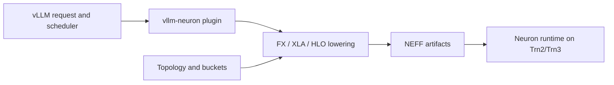
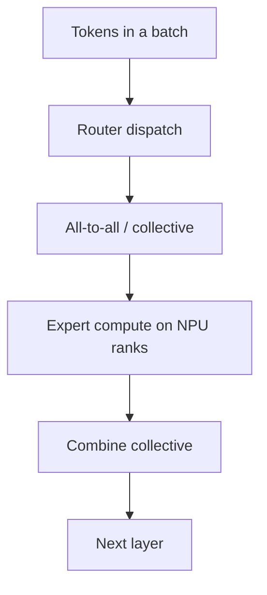
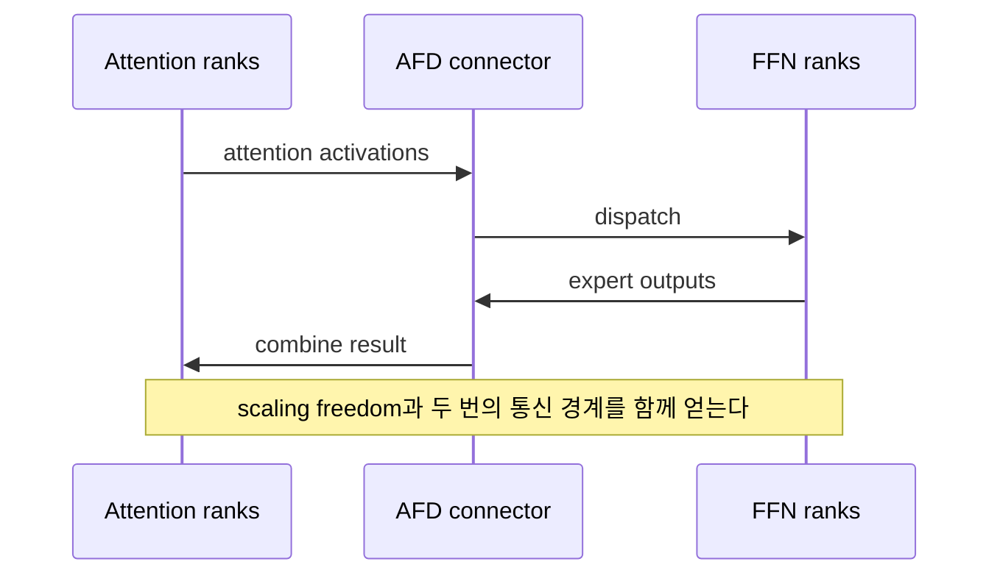

# 서버급 NPU 서빙: Neuron과 Ascend

## 수업 개요
NPU를 노트북의 저전력 offload 장치로만 이해하면 서버급 NPU의 핵심을 놓친다. AWS Trainium/Inferentia와 Huawei Ascend 계열에서는 한 모델을 여러 device와 node에 배치하고, tensor/expert parallel collective를 실행하며, graph capture와 compiled artifact를 운영해야 한다. 이때 질문은 `CPU에서 몇 개 op를 NPU로 넘겼는가`가 아니라 `어떤 rank topology에서 어떤 collective와 graph가 안정적으로 재현되는가`가 된다. [S1][S2][S3][S4]

2026년 8월 14일 기준 두 대표 경로도 같은 성숙도로 묶으면 안 된다. Neuron 2.31의 `vllm-neuron`은 Trn2/Trn3용 Beta plugin으로 공식 feature와 migration 문서를 제공한다. vLLM Ascend는 자체 compatibility matrix와 model-feature 표를 운영한다. 별도로 vLLM AFD plugin은 NVIDIA GPU와 Ascend NPU에서 Attention과 FFN을 분리하지만, 공식 발표와 repository 모두 experimental임을 명시한다. [S1][S2][S4][S5][S6]

## 학습 목표
- on-device NPU offload와 server NPU serving의 운영 경계를 구분할 수 있다.
- Neuron과 Ascend에서 collective가 TP/EP와 tail latency에 미치는 영향을 설명할 수 있다. [S3][S4]
- compiled graph의 이득과 shape/topology/version 제약을 함께 설명할 수 있다. [S1][S2][S7]
- vLLM AFD의 Attention-FFN 분리, CAMP2P/HCCL connector, ACL graph 범위와 experimental 상태를 설명할 수 있다. [S5][S6]
- runtime stack 전체를 하나의 version matrix로 고정하는 배포 계약을 만들 수 있다.

## 수업 전에 생각할 질문
- 노트북 NPU에서 CPU fallback을 찾는 절차를 64-rank MoE cluster에도 그대로 적용할 수 있을까?
- graph capture가 kernel launch overhead를 줄여도 왜 batch shape와 software version을 더 엄격하게 만들까?
- EP의 all-to-all이 느릴 때 device compute utilization만 높이면 해결될까?

## 강의 스크립트

### 1. 서버급 NPU는 offload 대상이 아니라 cluster 자원이다
**교수자:** on-device NPU chapter에서는 제한된 전력과 memory 안에서 어느 graph가 device에 올라가는지 묻습니다. 서버급 NPU에서는 모델이 단일 device에 들어가지 않거나, 들어가더라도 throughput 때문에 여러 rank로 나눕니다.

**학습자:** 결국 NPU가 큰 것뿐이고 partition 문제는 같지 않습니까?

**교수자:** graph partition이라는 공통점은 있지만 운영 단위가 다릅니다. 서버에서는 rank failure, collective timeout, inter-node fabric, model shard, replica routing이 SLA에 들어옵니다. single-device fallback은 성능 저하로 끝날 수 있지만 distributed collective의 한 rank가 멈추면 요청 batch 전체가 멈출 수 있습니다.

| 구분 | On-device NPU | Server NPU |
| --- | --- | --- |
| 주된 목표 | 전력, local latency, privacy | aggregate throughput, model capacity, cluster efficiency |
| 배치 단위 | app/process와 단일 device 중심 | replica, rank, node, pod |
| 주요 실패 | unsupported op, CPU fallback | collective hang, topology mismatch, shard/graph incompatibility |
| 운영 artifact | model package와 EP 설정 | model shard, compiler artifact, topology, runtime matrix |

### 2. Neuron은 vLLM control plane과 compiler backend를 묶는다
**교수자:** Neuron 2.31의 vLLM plugin은 standard `vllm serve`와 OpenAI-compatible API를 제공하면서 Trainium backend를 연결합니다. continuous batching, prefix caching, EAGLE3 speculative decoding, structured output, disaggregated inference가 공식 문서에 정리돼 있습니다. [S1]

**학습자:** 그렇다면 GPU vLLM과 동일한 배포 image를 써도 됩니까?

**교수자:** 아닙니다. setup guide는 Neuron SDK와 plugin environment를 요구하고, compilation은 XLA/HLO를 거쳐 NEFF를 만듭니다. bucket과 target hardware가 달라지면 artifact도 달라질 수 있습니다. API compatibility와 binary compatibility를 분리해야 합니다. [S1]



### 3. Ascend는 compatibility row 하나를 통째로 고른다
**교수자:** vLLM Ascend 설치 문서는 `vllm-ascend`, vLLM, PyTorch, `torch-npu`, CANN을 하나의 compatibility set으로 취급하라고 명시합니다. main branch를 쓸 때도 임의 vLLM tag가 아니라 검증된 commit을 따르라고 안내합니다. [S2]

**학습자:** package resolver가 설치에 성공하면 호환되는 것 아닌가요?

**교수자:** Python dependency가 맞는 것과 custom op, driver, firmware, graph capture가 실제 hardware에서 맞는 것은 다릅니다. model support 표도 feature를 TP, EP, PD disaggregation, piecewise/full ACL graph처럼 분리합니다. 모델 이름 옆에 체크 하나가 있다고 모든 조합이 된다고 읽으면 안 됩니다. [S2][S4]

**교수자:** production manifest에는 최소한 다음을 함께 기록합니다.

```text
hardware + firmware/driver + CANN + torch/torch-npu
+ vLLM + vllm-ascend + model revision + precision
+ TP/EP/DP topology + graph mode + collective settings
```

### 4. collective는 병렬화의 부수 비용이 아니라 critical path다
**학습자:** TP나 EP를 늘리면 device당 계산이 줄어드니 latency도 줄지 않습니까?

**교수자:** 계산량은 줄지만 collective가 늘어납니다. TP는 layer마다 all-reduce 또는 all-gather/reduce-scatter를 요구할 수 있고, MoE EP는 token dispatch와 combine에서 all-to-all 성격의 통신을 만듭니다. Neuron 문서는 intra-node에서 NeuronLink 계층을, inter-node에서 EFA를 사용하는 collective를 구분합니다. [S3]

$$
T_{step}=T_{compute}+T_{collective}+T_{sync}+T_{scheduler}
$$

**교수자:** rank 수를 늘려 $T_{compute}$를 줄여도 $T_{collective}+T_{sync}$가 커지면 scale-out 효율은 떨어집니다. 평균 bandwidth만 보지 말고 message size, topology, rank skew와 p99 collective time을 봐야 합니다.



### 5. graph capture는 빠른 대신 실행 계약을 좁힌다
**교수자:** graph mode는 반복되는 실행과 launch overhead를 줄이는 중요한 수단입니다. Ascend에는 ACL graph 경로가 있고, AFD의 synchronous Ascend connector도 `FULL_DECODE_ONLY` ACL graph를 지원합니다. [S5][S6][S7]

**학습자:** 그러면 production에서는 항상 full graph를 켜면 되겠네요.

**교수자:** graph는 capture한 shape, control flow, memory address와 runtime 조건에 민감합니다. dynamic batch, speculative step, model feature 조합에 따라 piecewise graph나 eager fallback이 필요할 수 있습니다. graph hit rate를 높이려고 bucket을 너무 많이 만들면 compile 시간과 artifact 수, device memory가 늘어납니다.

$$
\mathrm{GraphValue}=T_{launch\ saved}-T_{padding}-T_{capture/amortized}-T_{fallback}
$$

**교수자:** benchmark에는 graph on/off만 쓰지 말고 capture mode, bucket set, hit rate, fallback count와 warm-up 시간을 기록합니다.

### 6. AFD는 Attention과 FFN을 별도 서비스로 만든다
**학습자:** AFD는 prefill/decode disaggregation과 같은 겁니까?

**교수자:** 분리 축이 다릅니다. prefill/decode 분리는 sequence phase를 나누고, Attention-FFN Disaggregation은 같은 Transformer layer의 stateful attention 경로와 routed expert compute를 나눕니다. vLLM AFD plugin은 vLLM request lifecycle을 유지하면서 두 역할을 독립 rank group으로 배치합니다. [S5][S6]



**교수자:** Ascend synchronous decode 경로는 `CAMP2pAFDConnector`가 CAMP2P/HCCL custom op를 쓰고 `FULL_DECODE_ONLY` ACL graph를 지원합니다. asynchronous `CAMAsyncAFDConnector`는 Attention과 FFN을 겹치지만 graph 지원과 feature 조합이 다릅니다. connector 이름 하나가 모든 stage와 graph mode를 지원한다고 보면 안 됩니다. [S5][S6]

### 7. AFD의 benchmark를 production claim으로 확대하지 않는다
**학습자:** 공식 blog에 throughput과 TTFT 개선 수치가 있으니 바로 capacity planning에 써도 됩니까?

**교수자:** 아닙니다. 발표는 plugin을 experimental로 분류하고, 일부 실험은 forced expert balancing, 축소 layer, 제한된 hardware 조건을 사용했다고 명시합니다. repository도 exact vLLM version, model runner, graph, ubatch와 hardware-gated test의 제한을 기록합니다. [S5][S6]

**교수자:** 도입 단계는 다음처럼 나눕니다.

1. 지원 model, connector, stage와 graph mode를 공식 matrix에서 확인한다.
2. exact version set으로 correctness baseline을 만든다.
3. natural routing을 사용하는 production trace로 EP baseline과 AFD를 비교한다.
4. p50/p99, collective time, graph hit, quality와 failure recovery를 측정한다.
5. plugin upgrade를 독립된 rollout으로 취급한다.

### 8. version matrix는 표가 아니라 배포 계약이다
**학습자:** 버전을 많이 고정하면 최신 최적화를 받기 어렵지 않습니까?

**교수자:** 고정은 업데이트를 멈추는 것이 아니라 업데이트 단위를 명확히 하는 일입니다. server NPU stack에서는 runtime package 하나를 올려도 compiler artifact, custom op ABI, graph capture와 collective가 영향을 받습니다. matrix row를 통째로 올리고 재검증해야 합니다.

| 계약 층 | Neuron 예시 | Ascend 예시 | 검증 gate |
| --- | --- | --- | --- |
| hardware | Trn2/Trn3 topology [S1] | Atlas A2/A3 등 지원 device [S2][S4] | device inventory, link health |
| system software | Neuron driver/SDK/runtime | driver/firmware/CANN | health check, collective test |
| framework | vLLM + `vllm-neuron` | vLLM + `vllm-ascend` + torch-npu | exact import/version report |
| model | revision, precision, bucket | revision, precision, TP/EP | correctness and memory |
| execution | NEFF, DI transport | ACL graph, HCCL, connector | graph hit, p99, recovery |

### 9. 장애는 compute, graph, collective 순서로 분리한다
**교수자:** NPU utilization이 낮다고 kernel부터 고치지 않습니다. request queue와 scheduler stall, graph fallback, collective wait, compute gap을 trace에서 분리합니다.

**학습자:** collective hang이면 timeout만 늘리면 됩니까?

**교수자:** timeout은 진단 시간을 늦출 수 있습니다. rank별 마지막 collective, peer error, fabric 상태, version mismatch를 확인합니다. AWS 문서도 한 rank의 device error가 다른 rank에서 collective hang처럼 보일 수 있음을 경고합니다. [S3]

**교수자:** 최소 관측 항목은 다음과 같습니다.

- request: queue, TTFT, inter-token latency, p95/p99
- graph: capture mode, hit/miss, fallback, warm-up, artifact identity
- collective: operation별 p50/p99, rank skew, retry/timeout, bytes
- device: compute active, HBM, power, error와 link 상태
- version: runtime 시작 시 전체 matrix와 model revision 출력

### 10. production 판정은 `NPU에서 돈다`보다 엄격하다
**학습자:** 최종 승인 문장은 어떻게 써야 합니까?

**교수자:** `Ascend에서 DeepSeek가 실행된다`가 아니라 다음처럼 씁니다.

> 고정한 hardware/software matrix에서 production trace의 correctness gate를 통과했고, graph hit rate와 collective p99가 목표 범위이며, 한 rank 실패와 rollback 절차를 검증했다.

Neuron도 동일합니다. plugin의 feature 목록만으로 승인하지 않고 model compatibility, compiled artifact, EFA/collective와 장애 복구를 함께 확인합니다. AFD는 현재 experimental이므로 일반 runtime upgrade보다 좁은 canary와 명시적인 rollback이 필요합니다. [S1][S5][S6]

## 자주 헷갈리는 포인트
- server NPU는 on-device offload의 규모만 키운 것이 아니다. distributed rank와 collective가 운영 계약에 들어간다.
- `vllm serve` 호환은 compiler artifact와 custom op ABI 호환을 보장하지 않는다.
- model support와 feature 조합 support는 다른 표다. [S4]
- graph capture는 무조건적인 가속이 아니라 bucket, hit rate, fallback을 포함한 trade-off다. [S7]
- AFD와 prefill/decode disaggregation은 서로 다른 축의 분리다. [S5]
- vLLM AFD는 2026-08-14 현재 experimental이다. controlled benchmark를 production SLA로 확대하면 안 된다. [S5][S6]

## 사례로 다시 보기
### 사례 1. Trainium multi-node 서비스
팀은 vLLM Neuron의 DI를 사용해 prefill과 decode를 분리하려 한다. SDK/plugin/vLLM과 Trn2/Trn3 범위를 고정하고, NEFF bucket을 traffic percentile에 맞춘다. EFA를 통한 KV transfer와 inter-node collective를 별도 지표로 측정한다. [S1][S3]

### 사례 2. Ascend MoE의 EP 확장
EP rank를 늘렸더니 device compute는 줄었지만 p99가 나빠졌다. router imbalance, dispatch/combine collective와 HCCL rank skew를 먼저 본다. ACL graph hit가 낮다면 batch shape와 graph mode도 함께 확인한다. package 설치 성공은 원인 배제 근거가 아니다. [S2][S4][S7]

### 사례 3. Ascend AFD canary
baseline EP deployment와 AFD canary를 동일한 natural-routing trace로 비교한다. connector/stage/graph 제한을 exact plugin version에 맞추고, quality, p99 collective, graph fallback과 worker failure recovery를 측정한다. experimental plugin이므로 일반 model rollout과 분리한 rollback 단위를 둔다. [S5][S6]

## 핵심 정리
- server NPU serving의 핵심은 distributed topology, collective, graph와 version matrix다.
- Neuron 2.31 plugin과 vLLM Ascend는 모두 vLLM surface를 제공하지만 compiler/runtime 계약은 서로 다르다. [S1][S2]
- AFD는 Attention과 FFN을 독립 scaling하지만 communication 경계를 늘리며, 현재 experimental이다. [S5][S6]
- production 승인은 실행 성공이 아니라 correctness, graph hit, collective p99와 recovery를 포함해야 한다.

## 복습 체크리스트
- on-device NPU와 server NPU의 실패 단위를 구분할 수 있는가?
- TP와 EP에서 collective가 critical path가 되는 이유를 설명할 수 있는가?
- graph mode의 bucket/hit/fallback trade-off를 설명할 수 있는가?
- AFD connector의 stage, sync/async, ACL graph 범위를 구분할 수 있는가?
- Neuron과 Ascend 각각의 version matrix 항목을 작성할 수 있는가?

## 출처
| 번호 | 제목 | 발행 주체 | 날짜 | URL | 사용 이유 |
| --- | --- | --- | --- | --- | --- |
| [S1] | vLLM Neuron Plugin Documentation | AWS Neuron | 2026-08-14 (accessed) | [https://awsdocs-neuron.readthedocs-hosted.com/en/latest/vllm-neuron/docs/index.html](https://awsdocs-neuron.readthedocs-hosted.com/en/latest/vllm-neuron/docs/index.html) | Neuron 2.31 plugin 범위, hardware, feature와 migration 경로 |
| [S2] | vLLM Ascend Installation | vLLM Ascend project | 2026-08-14 (accessed) | [https://docs.vllm.ai/projects/ascend/en/latest/installation.html](https://docs.vllm.ai/projects/ascend/en/latest/installation.html) | vLLM/CANN/torch-npu compatibility set과 hardware 요구 사항 |
| [S3] | Neuron Runtime Collective Communication | AWS Neuron | 2026-08-14 (accessed) | [https://awsdocs-neuron.readthedocs-hosted.com/en/latest/neuron-runtime/about/collectives.html](https://awsdocs-neuron.readthedocs-hosted.com/en/latest/neuron-runtime/about/collectives.html) | intra/inter-node collective, NeuronLink와 EFA 구분 |
| [S4] | vLLM Ascend Supported Models | vLLM Ascend project | 2026-08-14 (accessed) | [https://docs.vllm.ai/projects/ascend/en/latest/user_guide/support_matrix/supported_models.html](https://docs.vllm.ai/projects/ascend/en/latest/user_guide/support_matrix/supported_models.html) | model별 TP/EP/PD/ACL graph feature matrix |
| [S5] | Announcing vLLM AFD Plugin | vLLM project | 2026-07-23 | [https://vllm.ai/blog/2026-07-23-vllm-afd-plugin](https://vllm.ai/blog/2026-07-23-vllm-afd-plugin) | AFD 구조, CAMP2P/HCCL, ACL graph와 experimental 범위 |
| [S6] | vLLM AFD Plugin Official Repository | vLLM project | 2026-08-14 (accessed) | [https://github.com/vllm-project/afd-plugin](https://github.com/vllm-project/afd-plugin) | 현재 connector/version/model 제한과 hardware-gated 검증 상태 |
| [S7] | Graph Mode Guide | vLLM Ascend project | 2026-08-14 (accessed) | [https://docs.vllm.ai/projects/ascend/en/latest/user_guide/feature_guide/graph_mode.html](https://docs.vllm.ai/projects/ascend/en/latest/user_guide/feature_guide/graph_mode.html) | Ascend graph capture 실행과 제약 설명 |
