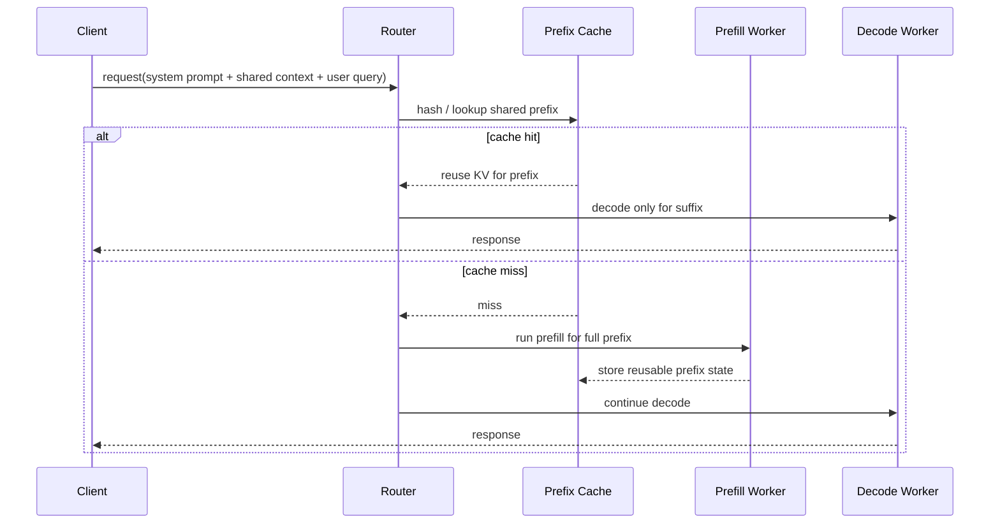
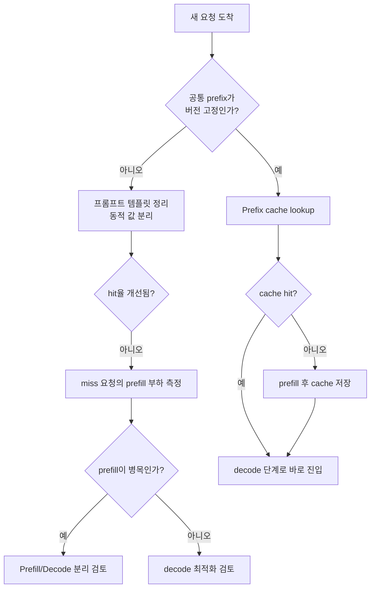

## 수업 개요
이 챕터의 질문은 단순합니다. "매 요청마다 똑같이 읽는 앞부분을 왜 계속 다시 prefill하나?" Prefix caching은 같은 system prompt, 공통 정책 문서, 고정된 RAG 상단 문맥처럼 변하지 않는 입력 앞부분을 재사용해서 prefill 비용을 줄이려는 전략입니다. 이때 핵심 tradeoff는 캐시 hit율과 invalidation 비용입니다. hit율이 높으면 prefill이 거의 사라지지만, 프롬프트 안에 날짜, 사용자별 정책, 자주 바뀌는 tool 목록을 섞어 두면 캐시가 쉽게 깨집니다. [S1][S2][S3][S5][S6]

## 학습 목표
- prefix caching이 어떤 종류의 요청에서 효과가 큰지 설명할 수 있다.
- prefix caching과 KV cache reuse를 운영 관점에서 구분할 수 있다.
- hit율, invalidation 비용, prefill/decode 분리 여부를 함께 보고 진단 순서를 세울 수 있다.

## 수업 전에 생각할 질문
- 같은 고객지원 봇이라도 어떤 팀은 prefix cache hit율이 높고, 어떤 팀은 낮을까?
- 캐시 miss를 줄이는 것과 prefill 자원을 분리하는 것은 어떤 관계일까?
- structured output이나 tool calling이 들어오면 왜 "공통 prefix" 설계가 더 까다로워질까?

## 강의 스크립트
### 1. 어떤 요청이 prefix caching에 잘 맞는가
**교수자:** prefix caching은 "긴 입력" 일반을 노리는 기능이 아닙니다. "긴데 앞부분이 반복되는 입력"을 노립니다. 예를 들어 고객지원 assistant가 매번 같은 system prompt, 같은 보안 정책, 같은 브랜드 톤 가이드를 붙이고 마지막에 사용자 질문만 바뀐다면, 그 공통 앞부분이 캐시 대상이 됩니다.

**학습자:** 그러면 긴 문서 요약처럼 매번 원문 전체가 달라지는 작업은 잘 안 맞겠네요?

**교수자:** 맞습니다. 길이보다 반복성이 중요합니다. 길어도 반복이 없으면 miss가 계속 납니다. 반대로 2천 토큰짜리 system prompt가 거의 고정이면 충분히 가치가 있습니다. 이 챕터에서 봐야 할 첫 기준은 "공통 prefix를 설계할 수 있는가"입니다.

**학습자:** 공통 prefix 사례를 두 개만 바로 꼽아 주세요.

**교수자:** 첫째, 사내 정책 Q&A입니다. 회사 규정집 상단 30페이지와 답변 정책은 거의 그대로 붙고 질문만 바뀝니다. 둘째, agent형 고객지원입니다. tool 설명과 응답 형식은 고정인데 사용자의 주문번호나 문의 내용만 뒤에 붙습니다. 여기서 prefix를 안정적으로 고정하면 prefill 비용을 크게 줄일 수 있습니다. [S3][S5][S6]

캐시가 잘 맞는 요청의 기대 latency는 아래처럼 단순하게 볼 수 있습니다.

\[
E[T] = T_{\text{decode}} + (1-h)\,T_{\text{prefill}}
\]

- \(h\): prefix cache hit율
- \(T_{\text{prefill}}\): 공통 prefix를 새로 읽을 때 드는 시간
- \(T_{\text{decode}}\): 토큰 생성 단계 시간

이 식이 말하는 바는 분명합니다. decode는 그대로 남고, prefix caching은 prefill만 줄입니다. 그래서 decode가 병목인 워크로드에는 체감이 약하고, 긴 공통 prompt 때문에 prefill이 큰 워크로드에서는 체감이 큽니다.

이 시퀀스를 보면 왜 [S1], [S2]의 disaggregated prefill/serving 문서가 prefix caching 챕터와 연결되는지 드러납니다. miss가 나는 순간 비싼 일은 prefill 쪽에서 벌어지고, hit가 나면 decode만 남기 때문입니다. [S1][S2]

### 2. prefix caching과 KV cache reuse는 같은 말이 아니다
**학습자:** 그런데 source 목록에 KV Cache Reuse가 따로 있네요. prefix caching과 그냥 같은 개념 아닌가요?

**교수자:** 현장에서는 섞어 쓰지만, 운영 판단을 할 때는 분리해서 봐야 합니다. prefix caching은 "여러 요청이 공유하는 앞부분"을 다시 쓰는 관점입니다. KV cache reuse는 이미 계산된 KV 상태를 재활용하는 더 넓은 관점으로 볼 수 있습니다. 그래서 질문도 달라집니다. prefix caching은 "어떤 prefix를 표준화할 것인가"를 묻고, KV reuse는 "어떤 KV 상태를 얼마나 오래 보존하고 어디서 다시 꺼낼 것인가"를 묻습니다. [S3]

**학습자:** 그러면 장애 대응도 다르겠네요?

**교수자:** 그렇습니다. prefix caching 문제는 보통 프롬프트 템플릿, 해시 기준, 버전 관리, invalidation 정책에서 시작합니다. 반면 KV reuse 문제는 메모리 용량, 블록 관리, 보존 정책 같은 시스템 쪽 이슈가 더 큽니다. 둘을 같은 단어로 뭉개면 원인을 잘못 찾기 쉽습니다.

### 3. invalidation은 왜 작은 변화에도 치명적인가
**교수자:** prefix caching을 망치는 가장 흔한 실수는 공통 prefix에 자주 바뀌는 값을 넣는 겁니다. 예를 들어 system prompt 맨 위에 `현재 시각: ...`을 넣으면 매 요청마다 해시가 달라질 수 있습니다. 고객별 AB 테스트 문구, 회차별 정책 버전, 자주 바뀌는 tool 설명도 같은 문제를 만듭니다.

**학습자:** 구조화 출력이나 tool calling도 여기에 영향을 주나요?

**교수자:** 크게 줍니다. structured outputs는 응답 형식을 강하게 고정하고, tool calling은 호출 가능한 함수 목록과 설명을 함께 다루게 만듭니다. 이 정보가 prefix 안에 들어가면, 스키마나 tool set이 바뀔 때 캐시가 깨집니다. 즉 "출력 안정성"을 얻으려다 "입력 prefix 안정성"을 잃을 수 있습니다. [S5][S6]

실무에서는 savings만 보면 안 되고, 캐시를 깨뜨리는 비용까지 같이 봐야 합니다.

\[
\text{NetBenefit} = N \cdot h \cdot C_{\text{prefill-saved}} - N \cdot p_{\text{inv}} \cdot C_{\text{rebuild}}
\]

- \(N\): 관측 기간 동안의 요청 수
- \(h\): prefix cache hit율
- \(p_{\text{inv}}\): 요청당 invalidation이 발생할 확률
- \(C_{\text{rebuild}}\): 캐시 재구축으로 추가되는 비용

이 식은 "캐시가 있느냐"보다 "안정적으로 유지되느냐"가 중요하다는 점을 보여 줍니다. hit율이 90%여도 정책 버전이 자주 바뀌어 재구축 비용이 크면 순이익이 작아질 수 있습니다.

### 4. prefix miss가 많아도 prefill/decode 분리를 보는 이유
**학습자:** hit율이 아직 낮으면 prefix caching은 미뤄도 되지 않나요?

**교수자:** 그렇게 단순하지 않습니다. hit율이 낮더라도 miss가 몰리는 구간이 prefill 병목이라면, prefill/decode 분리 설계는 여전히 유효합니다. [S1], [S2]가 중요한 이유가 여기 있습니다. 캐시 최적화와 자원 분리는 경쟁 관계가 아니라 보완 관계입니다.

**학습자:** 어떤 순서로 보완하죠?

**교수자:** 먼저 prefix를 표준화해 hit율을 올릴 수 있는지 봅니다. 그다음 miss가 남는다면 그 miss가 prefill 자원을 얼마나 오래 점유하는지 봅니다. 긴 공통 문맥을 가진 multi-tenant 서비스라면 두 전략을 같이 써야 할 때가 많습니다.

이 플로우에서 [S4]는 비교 기준으로 쓰면 좋습니다. speculative decoding은 decode를 빠르게 만드는 축이고, prefix caching은 prefill을 줄이는 축입니다. 둘 다 latency 최적화지만 겨냥하는 병목이 다릅니다. [S4]

### 5. 디버깅 순서는 보통 이렇게 잡는다
**학습자:** 운영 중인데 응답 시간이 갑자기 늘었습니다. prefix cache 문제부터 어떻게 확인하죠?

**교수자:** 순서를 고정해 두면 흔들리지 않습니다.

1. 같은 제품 경로에서 system prompt와 공통 context가 정말 byte 수준으로 같은지 확인합니다.
2. prefix 해시에 영향을 주는 동적 필드가 어디에 들어갔는지 찾습니다. 날짜, locale, 사용자 ID, 실험군 플래그가 대표적입니다.
3. tool calling 또는 structured output 스키마가 최근 배포에서 바뀌었는지 확인합니다. [S5][S6]
4. hit율이 떨어진 뒤 prefill queue 길이와 prefill worker 점유 시간이 같이 늘었는지 봅니다. 이 단계에서 [S1][S2]의 분리 설계 필요성이 드러납니다.
5. 그래도 지연이 decode에 남아 있으면 prefix caching이 아니라 다른 최적화 축을 봅니다. 예를 들어 speculative decoding 같은 decode 최적화가 더 직접적일 수 있습니다. [S4]

## 자주 헷갈리는 포인트
| 헷갈리는 주장 | 실제로는 | 왜 중요한가 |
| --- | --- | --- |
| 긴 요청이면 무조건 prefix caching에 유리하다 | 긴 것보다 반복되는 앞부분이 중요하다 | 길기만 하고 매번 달라지면 miss가 계속 난다 |
| prefix caching과 KV cache reuse는 완전히 같은 말이다 | 겹치지만 운영 질문이 다르다 | 전자는 prefix 표준화, 후자는 KV 보존/재활용 정책이 핵심이다 [S3] |
| tool calling을 붙이면 기능만 늘고 캐시에는 영향이 없다 | tool 목록과 설명이 prefix 일부면 invalidation 원인이 된다 | agent 워크로드에서 hit율 저하가 쉽게 발생한다 [S6] |
| structured output은 출력 단계 문제라 입력 캐시와 무관하다 | 스키마를 prompt에 포함하면 prefix 안정성에 직접 영향이 간다 | 형식 보장과 cache hit율을 같이 설계해야 한다 [S5] |
| hit율만 높으면 끝이다 | invalidation 비용과 miss 시 prefill 병목도 같이 봐야 한다 | hit율이 높아도 운영 순이익이 낮을 수 있다 |

## 사례로 다시 보기
### 사례 1. 사내 정책 Q&A 봇
보안팀이 만든 assistant는 매 요청마다 다음 세 덩어리를 붙입니다.

1. 회사 정책 system prompt
2. 고정된 규정집 상단 요약
3. 사용자의 질문

처음엔 규정집 요약 맨 위에 `배포 날짜`를 넣어 두었습니다. 이 값이 배포 때마다 바뀌면서 prefix cache가 자주 무효화됐습니다. 해결은 단순했습니다. 날짜는 suffix의 메타데이터로 빼고, 실제 의미를 바꾸지 않는 고정 정책 문구만 prefix에 남겼습니다. 여기서 배운 점은 "정확한 최신성 표시" 자체가 문제가 아니라, 그것을 공통 prefix 안에 넣는 설계가 문제였다는 것입니다.

### 사례 2. 주문 조회형 agent
주문 조회 assistant는 tool calling을 사용합니다. 주문 조회, 환불 접수, 배송 추적 세 도구의 설명이 길고, 응답은 JSON 형태로 고정됩니다. 어느 날 팀이 실험용 tool 두 개를 잠깐 추가했더니 hit율이 떨어졌습니다. 이유는 간단했습니다. tool 목록이 공통 prefix 일부였기 때문입니다. 이 문제의 올바른 질문은 "tool을 더 넣을까 말까"가 아니라 "모든 요청이 공유하는 tool 집합을 안정적으로 분리할 수 있는가"입니다. [S5][S6]

## 핵심 정리
- prefix caching의 본질은 긴 입력 처리 자체가 아니라 반복되는 앞부분의 재사용이다.
- 기대 효과는 주로 prefill 절감에서 나오며, decode 병목은 그대로 남는다.
- prefix caching과 KV cache reuse는 겹치지만, 디버깅 질문과 운영 책임이 다르다. [S3]
- structured output, tool calling, 정책 버전 관리 같은 기능은 모두 prefix invalidation을 악화시킬 수 있다. [S5][S6]
- hit율 최적화와 prefill/decode 분리 설계는 대체재가 아니라 함께 검토할 수 있는 보완재다. [S1][S2]

## 복습 체크리스트
- 공통 prefix를 byte 수준으로 고정할 수 있는지 설명할 수 있는가?
- `E[T] = T_decode + (1-h)T_prefill` 식으로 hit율 변화의 의미를 말할 수 있는가?
- prefix caching과 KV cache reuse의 차이를 운영 질문 기준으로 구분할 수 있는가?
- tool calling 또는 structured output이 prefix invalidation을 어떻게 키우는지 설명할 수 있는가?
- miss가 많을 때도 prefill/decode 분리를 같이 검토해야 하는 이유를 말할 수 있는가?

## 대안과 비교
| 기법 | 주로 줄이는 병목 | 잘 맞는 상황 | 주의할 점 | 관련 출처 |
| --- | --- | --- | --- | --- |
| Prefix Caching | 반복 prefix의 prefill 비용 | 같은 system prompt, 공통 context가 많은 서비스 | 동적 필드와 버전 변경이 hit율을 무너뜨린다 | [S1][S2][S3] |
| KV Cache Reuse | 계산된 KV 상태의 재활용 비용 | 재사용 가능한 KV 블록을 오래 보존할 가치가 있을 때 | 메모리 관리와 보존 정책이 중요하다 | [S3] |
| Disaggregated Prefill/Decode | prefill과 decode 자원 경합 | 긴 입력과 multi-tenant miss가 자주 겹칠 때 | 네트워크 이동과 운영 복잡도가 생긴다 | [S1][S2] |
| Speculative Decoding | decode latency | decode가 병목이고 승인율이 충분할 때 | 추가 모델 비용과 승인 실패를 봐야 한다 | [S4] |
| Structured Outputs / Tool Calling | 형식 안정성과 actionability | agent 워크로드, JSON 출력 보장 | 스키마/tool 정의가 prefix 안정성을 해칠 수 있다 | [S5][S6] |

## 참고 이미지
### [I1] vLLM logo

vLLM은 이 모듈에서 disaggregated prefill, structured outputs, tool calling 같은 기능 축을 제공하는 대표 구현으로 반복해서 등장합니다. 이 챕터에서는 "공통 prefix를 어떻게 안정적으로 만들 것인가"를 생각할 때 해당 기능들이 서로 충돌하거나 보완하는 지점을 읽는 표지로 쓰면 됩니다. [S1][S5][S6]

### [I2] Roofline model

Roofline 이미지는 prefix caching을 단순 캐시 기법으로만 보지 않게 도와줍니다. 공통 prefix를 다시 읽지 않는다는 것은 소프트웨어 해시 최적화가 아니라, 결국 prefill 단계에서 반복되던 연산과 메모리 접근을 줄이는 선택이기 때문입니다. 그래서 hit율 저하는 곧 prefill 자원 압박으로 되돌아옵니다. [S1][S2]

## 출처
| ID | 제목 | 발행처 | 날짜 | URL | 본문 연결 |
| --- | --- | --- | --- | --- | --- |
| [S1] | Disaggregated Prefill V1 | vLLM project | 2026-03-08 (accessed) | https://docs.vllm.ai/en/latest/features/disagg_prefill.html | prefix miss가 prefill 부하로 드러나는 구조를 설명할 때 사용 |
| [S2] | Disaggregated Serving | NVIDIA TensorRT-LLM | 2026-03-08 (accessed) | https://nvidia.github.io/TensorRT-LLM/1.2.0rc6/features/disagg-serving.html | prefill/decode 분리와 prefix caching의 보완 관계를 설명할 때 사용 |
| [S3] | KV Cache Reuse | NVIDIA TensorRT-LLM | 2026-03-08 (accessed) | https://nvidia.github.io/TensorRT-LLM/advanced/kv-cache-reuse.html | prefix caching과 KV cache reuse의 차이를 비교할 때 사용 |
| [S4] | Speculative Decoding | NVIDIA TensorRT-LLM | 2026-03-08 (accessed) | https://nvidia.github.io/TensorRT-LLM/1.2.0rc3/features/speculative-decoding.html | decode 최적화와 prefix 최적화의 비교 축을 제시할 때 사용 |
| [S5] | Structured Outputs | vLLM project | 2026-03-08 (accessed) | https://docs.vllm.ai/en/latest/features/structured_outputs.html | 스키마 고정이 prefix invalidation에 주는 영향을 설명할 때 사용 |
| [S6] | Tool Calling | vLLM project | 2026-03-08 (accessed) | https://docs.vllm.ai/en/latest/features/tool_calling.html | tool 정의 변화가 prefix hit율에 미치는 영향을 설명할 때 사용 |
