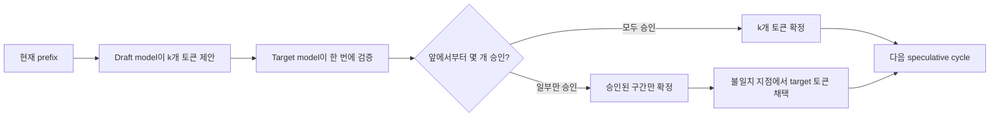
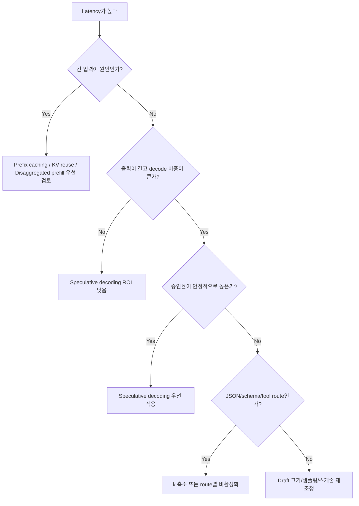

# Speculative Decoding

## 수업 개요
이 챕터는 "더 작은 모델이 먼저 몇 토큰을 써 보고, 큰 모델이 그 묶음을 한 번에 검사한다"는 speculative decoding의 운영 관점을 다룬다. 핵심 질문은 알고리즘 자체보다 단순하다. `draft model을 한 번 더 돌리는 비용`보다 `target model 호출 횟수를 줄여 얻는 이익`이 더 큰가, 그리고 그 차이를 좌우하는 승인율이 workload마다 어떻게 달라지는가다 [S4]. 2026년 기준 serving 엔진은 speculative decoding을 별도 backend 기능으로 드러내는 흐름이며, 동시에 structured outputs와 tool calling 같은 제약된 decoding 경로와 함께 운영해야 한다 [S4][S5][S6]. 그래서 이 주제는 "속도 꼼수"가 아니라 route별 정책 설계 문제다.

## 학습 목표
- speculative decoding이 `draft 제안 -> target 검증 -> 승인/rollback` 흐름으로 decode latency를 줄이는 원리를 설명할 수 있다.
- 승인율, draft 비용, rollback 길이가 속도 이득을 어떻게 바꾸는지 수식으로 설명할 수 있다.
- free-form 생성, structured output, tool calling처럼 출력 제약이 다른 경로에서 speculative decoding의 우선순위를 구분할 수 있다.
- 속도 향상이 안 나올 때 `decode 병목 여부 -> 승인율 -> draft 비용 -> 스케줄링` 순서로 점검할 수 있다.

## 수업 전에 생각할 질문
- 출력이 40토큰밖에 안 되는 JSON 응답에도 speculative decoding을 켜는 것이 항상 이득일까?
- 승인율이 90%인 route와 35%인 route가 있다면, 둘 다 같은 `k=4`를 쓰는 것이 합리적일까?
- 긴 입력 때문에 느린 서비스와 긴 출력 때문에 느린 서비스는 왜 다른 최적화를 먼저 써야 할까?

## 강의 스크립트
### Part 1. Speculative Decoding이 실제로 줄이는 것은 무엇인가
**교수자:** speculative decoding은 "작은 모델이 대신 답한다"가 아닙니다. 최종 정답은 여전히 target model이 책임집니다. 다만 draft model이 다음 토큰 몇 개를 먼저 제안하고, target model이 그 묶음을 한 번에 검증해서 맞는 부분만 통과시키는 방식이죠 [S4].

**학습자:** 그러면 품질을 버리고 속도를 얻는 기법은 아닌 건가요?

**교수자:** target이 검증한다는 점에서 품질을 포기하는 방식과는 다릅니다. 대신 승인율이 낮으면 rollback이 많아지고, draft를 돌린 비용까지 얹히니 오히려 손해가 날 수 있습니다. 이 챕터의 tradeoff가 바로 그 지점입니다. 추가 모델 비용과 토큰 승인율을 같이 봐야 합니다.

**교수자:** decode가 느린 이유는 target model이 토큰을 하나씩 확인하며 앞으로 가야 하기 때문입니다. speculative decoding은 `target의 순차 단계 수`를 줄이려는 시도입니다. target이 한 번 움직일 때 토큰 한 개만 확정하지 말고, draft가 내민 여러 토큰을 한 묶음으로 승인하게 만들겠다는 뜻이죠 [S4].

#### 핵심 수식 1. speculative decoding의 토큰당 기대 비용
$$
T_{\mathrm{token}}^{\mathrm{spec}} \approx \frac{k \cdot T_{\mathrm{draft}} + T_{\mathrm{verify}}}{\alpha k + 1}
$$

여기서 $k$는 draft가 한 번에 제안하는 토큰 수, $T_{\mathrm{draft}}$는 draft가 토큰 하나를 제안하는 평균 비용, $T_{\mathrm{verify}}$는 target이 검증 패스를 수행하는 비용, $\alpha$는 토큰 승인율이다. 분모가 커질수록 target 한 번당 확정되는 토큰 수가 늘어나므로 유리하다. 반대로 $\alpha$가 낮으면 분모가 줄어들어 speculative decoding의 장점이 빠르게 사라진다.

#### 시각 자료 1. draft-target 검증 사이클

**학습자:** 이 흐름이면 draft가 틀리더라도 target이 막아 주는 대신, 자꾸 틀리면 검증할 가치가 없어지는 구조네요.

**교수자:** 맞습니다. 그래서 speculative decoding은 "작은 모델을 하나 더 붙이면 무조건 빨라진다"가 아니라 "draft가 target의 다음 토큰 분포를 얼마나 잘 따라가느냐"가 전부입니다.

### Part 2. 승인율이 높은 route와 낮은 route는 왜 이렇게 다르게 보이나
**교수자:** 같은 엔진에서도 route별로 승인율은 크게 다릅니다. 긴 자유 서술 보고서를 쓰는 assistant는 다음 토큰 패턴이 비교적 연속적이라 draft가 꽤 잘 맞출 수 있습니다. 반면 엄격한 JSON schema나 tool calling 경로는 쉼표, 중괄호, 필드 순서, enum 값 하나가 어긋나도 즉시 rollback이 발생합니다 [S5][S6].

**학습자:** structured output이나 tool calling에서는 speculative decoding이 불리할 수 있다는 뜻인가요?

**교수자:** 항상 불리한 건 아닙니다. 다만 승인율이 떨어질 가능성이 크니 `k`를 줄이거나, route별로 speculative decoding을 끄는 판단이 더 자주 필요합니다. vLLM 문서가 structured outputs와 tool calling을 별도 기능으로 다루는 이유도, backend 최적화가 이런 제약과 충돌 없이 같이 돌아가야 하기 때문입니다 [S5][S6].

**교수자:** 현업에서 자주 보는 실수는 세 가지입니다.
- output이 짧은 경로에도 동일한 speculative 설정을 강제로 적용한다.
- JSON/tool route에서 rollback이 잦은데 승인율 대신 평균 latency만 보고 원인을 놓친다.
- target이 아니라 draft utilization만 보고 "GPU가 바쁘니 최적화가 잘 된다"고 착각한다.

#### 핵심 수식 2. 전체 이득 조건
$$
\mathrm{NetGain} \approx N \cdot T_{\mathrm{target}} - \frac{N}{\alpha k + 1}\cdot \left(k \cdot T_{\mathrm{draft}} + T_{\mathrm{verify}}\right)
$$

$N$개의 출력 토큰을 만들 때 baseline decode 비용보다 speculative decode 비용이 더 작아야 실제 이득이 난다. 즉 승인율이 높더라도 draft 비용이 과도하면 실패하고, draft 비용이 작더라도 승인율이 낮으면 실패한다. 결국 속도 개선은 $\alpha$, $k$, draft 크기 세 개를 따로 보지 않고 함께 봐야 한다.

**학습자:** 승인율 하나만 높이면 되는 줄 알았는데, draft가 너무 크면 그 역시 병목이 되겠군요.

**교수자:** 그래서 작은 draft를 붙였는데도 빠르지 않으면 `이 route가 정말 decode-bound인가`부터 다시 물어봐야 합니다. 긴 입력이 지배하는 workload라면 speculative decoding보다 prefix caching이나 disaggregated prefill/decode가 먼저일 수 있습니다 [S1][S2][S3].

### Part 3. 어떤 workload에서 먼저 적용해야 하나
**교수자:** 세 가지 상황을 비교해 봅시다.

**교수자:** 첫째는 사내 보고서 assistant입니다. 입력은 평범하지만 600토큰 이상 서술형 답변을 길게 생성합니다. 이런 route는 decode 구간이 길고 패턴도 비교적 부드러워 speculative decoding이 잘 맞습니다. 예를 들어 `k=4`, 승인율 $\alpha=0.8$ 수준만 나와도 target 호출 수를 눈에 띄게 줄일 수 있습니다 [S4].

**학습자:** 둘째는 어떤 경우가 다르죠?

**교수자:** 환불 처리 agent를 생각해 보세요. 이 route는 JSON 출력과 주문 조회 tool calling이 강하게 묶여 있습니다. 출력 길이도 짧고 형식 제약이 빡빡하니 draft가 맞춰야 할 여지가 좁습니다. 여기서 speculative decoding을 공격적으로 켜면 rollback 비율만 높아지고, structured output 검증 지점에서 target 검증이 계속 끊깁니다 [S5][S6].

**학습자:** 셋째는 긴 입력 요약인가요?

**교수자:** 맞습니다. 이사회 회의록 30k 토큰을 넣고 120토큰짜리 요약을 받는 서비스라면 병목은 decode보다 prefill일 가능성이 큽니다. 이 경우 speculative decoding은 "틀린 최적화"가 아니라 "우선순위가 뒤인 최적화"입니다. prefix caching, KV cache reuse, disaggregated prefill/decode를 먼저 검토해야 합니다 [S1][S2][S3].

#### 시각 자료 2. 적용 우선순위 판단 흐름

**교수자:** 이 그림에서 핵심은 speculative decoding을 만능 가속기처럼 다루지 않는 겁니다. 먼저 병목 구간이 prefill인지 decode인지 나누고, decode라면 그다음에 승인율과 draft 비용을 봅니다.

### Part 4. 디버깅은 어떤 순서로 해야 하나
**학습자:** 실제로 성능 향상이 안 나오면 어디부터 봐야 합니까?

**교수자:** 저는 보통 이 순서로 봅니다.

1. baseline이 정말 decode-bound인지 본다. TTFT가 문제인지, token-per-output latency가 문제인지 분리한다.
2. 승인율과 평균 rollback 길이를 본다. 승인율이 낮으면 speculative decoding을 켰다는 사실 자체가 손해일 수 있다.
3. draft cost를 본다. draft가 너무 크거나 `k`가 너무 크면 target 호출을 줄여도 총비용이 늘어난다.
4. route 특성을 본다. structured outputs, tool calling, enum-heavy JSON은 승인율이 자주 낮아진다 [S5][S6].
5. 엔진 배치를 본다. prefill/decode를 분리한 시스템에서는 speculative decoding이 decode 자원에서 어떻게 스케줄되는지까지 확인해야 한다 [S1][S2].

**학습자:** rollback이 많으면 바로 draft를 더 큰 모델로 바꾸면 되나요?

**교수자:** 꼭 그렇지는 않습니다. draft를 키우면 승인율은 오를 수 있지만 비용도 같이 오릅니다. 그래서 현업에서는 종종 `draft 교체`보다 `k 축소`, `특정 route 비활성화`, `temperature 조정`, `structured route 분리`가 먼저 나옵니다.

### Part 5. 다른 serving 패턴과의 관계
**교수자:** speculative decoding을 다른 최적화와 비교할 때 가장 중요한 기준은 "어느 구간을 줄이느냐"입니다.

- prefix caching은 같은 앞문맥을 다시 계산하지 않도록 해 prefill을 줄인다 [S3].
- KV cache reuse는 이미 계산한 KV를 재연결하거나 재사용하는 더 넓은 범주다 [S3].
- disaggregated prefill/decode는 prefill과 decode를 다른 자원에 배치해 병목을 분리한다 [S1][S2].
- speculative decoding은 decode 단계에서 target의 순차 검증 횟수를 줄인다 [S4].

**학습자:** 그러면 긴 prompt 서비스에서 speculative decoding만 열심히 만지는 건 본질을 피할 수 있겠네요.

**교수자:** 정확합니다. 긴 입력에 짧은 답이면 speculative decoding보다 prefill 최적화가 먼저고, 짧은 입력에 긴 자유 서술이면 speculative decoding 우선순위가 올라갑니다. tool calling과 structured outputs는 그 사이에서 route별 예외 규칙을 만들게 합니다 [S5][S6].

### Part 6. 참고 이미지와 성능 감각 연결
**교수자:** 첫 번째 이미지는 vLLM 로고지만, 여기서 중요한 것은 로고 자체가 아니라 modern serving stack이 structured outputs, tool calling 같은 상위 기능과 backend 최적화를 같은 엔진 표면에서 다룬다는 점입니다. speculative decoding도 이제는 연구 논문 구경거리가 아니라 운영 옵션이라는 맥락으로 읽어야 합니다 [S4][S5][S6].

**교수자:** 두 번째 이미지는 Roofline model입니다. speculative decoding이 잘 먹히는 이유를 "FLOPs 몇 퍼센트 절감"보다 "비싼 target step을 덜 자주 밟는다"는 감각으로 이해하는 데 도움이 됩니다. decode가 메모리 대역과 순차 의존에 갇힐수록, target 한 번당 여러 토큰을 승인하는 이득이 분명해집니다 [S2][S4].

**학습자:** 정리하면 speculative decoding의 핵심 문장은 이렇게 말할 수 있겠네요. "draft를 붙일지 말지는 모델 크기가 아니라 승인율과 출력 제약이 결정한다."

**교수자:** 그 문장이 이 챕터의 결론입니다.

## 자주 헷갈리는 포인트
- speculative decoding은 draft가 최종 답을 대신하는 기법이 아니다. 최종 승인자는 target model이다.
- 승인율이 높아도 항상 빠른 것은 아니다. draft 비용과 검증 비용을 같이 빼고 남는 이익이 있어야 한다.
- 긴 입력 서비스가 느리다고 해서 speculative decoding이 1순위는 아니다. prefill 병목이면 다른 최적화가 먼저다 [S1][S2].
- structured output과 tool calling은 정확한 형식을 강제하므로 rollback을 늘릴 수 있다 [S5][S6].
- rollback이 많다고 곧바로 모델 품질 문제라고 단정하면 안 된다. `k`가 과도하거나 route가 제약적일 수도 있다.

## 사례로 다시 보기
### 사례 1. 장문 보고서 assistant
- 특징: 입력 1k 미만, 출력 500~900토큰의 자유 서술
- 관찰: 승인율이 높고 decode 비중이 커서 speculative decoding 효과가 큼
- 선택: 작은 draft model + `k=4` 정도의 보수적 설정부터 시작
- 이유: target의 순차 단계 수를 줄이는 것이 직접적인 latency 절감으로 연결됨 [S4]

### 사례 2. 주문 처리 agent의 JSON 응답
- 특징: 출력 길이는 80토큰 안팎이지만 schema와 tool 호출 제약이 강함
- 관찰: 중괄호, key 순서, enum 값에서 rollback이 자주 발생
- 선택: route별로 `k`를 줄이거나 speculative decoding 비활성화 검토
- 이유: constrained decoding 경로에서는 승인율 하락이 draft 비용보다 더 크게 작용할 수 있음 [S5][S6]

### 사례 3. 긴 회의록 요약 서비스
- 특징: 입력 30k, 출력 120토큰
- 관찰: latency 대부분이 prefill에 몰려 있어 speculative decoding 영향이 제한적
- 선택: prefix caching, KV cache reuse, disaggregated prefill/decode 우선 [S1][S2][S3]
- 이유: 병목 구간이 decode가 아니라 prefill이기 때문

## 핵심 정리
- speculative decoding은 draft model이 여러 토큰을 먼저 제안하고, target model이 묶음 검증으로 decode 단계를 압축하는 방식이다.
- 속도 개선은 승인율 하나로 결정되지 않는다. 승인율, draft 비용, 검증 비용, 출력 제약을 같이 봐야 한다.
- free-form 장문 생성에는 잘 맞을 수 있지만, structured outputs와 tool calling route에서는 rollback이 많아질 수 있다 [S5][S6].
- 긴 입력이 병목이면 speculative decoding보다 prefix caching, KV cache reuse, disaggregated prefill/decode가 먼저다 [S1][S2][S3].
- 2026년 serving 엔진에서는 speculative decoding이 backend 기능으로 자리 잡고 있으며, route별 정책으로 운영하는 시각이 중요하다 [S4].

## 복습 체크리스트
- speculative decoding의 한 사이클을 `draft 제안 -> target 검증 -> 승인/rollback`으로 설명할 수 있는가?
- 승인율이 낮을 때 왜 draft model이 추가 비용으로만 남을 수 있는지 수식으로 설명할 수 있는가?
- JSON schema나 tool calling route에서 rollback이 잦아지는 이유를 말할 수 있는가?
- 긴 입력/짧은 출력 workload에서 왜 speculative decoding이 우선순위가 아닐 수 있는지 설명할 수 있는가?
- 속도 향상이 안 날 때 `decode 병목 여부 -> 승인율 -> draft 비용 -> route 제약 -> 엔진 배치` 순으로 점검할 수 있는가?

## 대안과 비교
| 기법 | 주로 줄이는 비용 | 먼저 적용할 workload | 운영상 주의점 |
| --- | --- | --- | --- |
| Speculative decoding | decode 단계의 target 순차 검증 횟수 | 장문 자유 서술, decode-heavy route | 승인율과 draft 비용을 함께 봐야 함 [S4] |
| Prefix caching | 반복되는 공통 prefix의 prefill | 같은 system/context/schema가 길게 반복되는 서비스 | hit율과 invalidation 정책 관리 필요 [S3] |
| KV cache reuse | 이미 계산한 KV의 재연결/재사용 | 엔진 차원에서 재사용 기회를 넓히고 싶을 때 | prefix caching과 개념 범위를 섞지 않도록 주의 [S3] |
| Disaggregated prefill/decode | prefill과 decode 자원 분리 | 긴 context와 multi-tenant 환경 | 네트워크 이동과 스케줄 복잡도 증가 [S1][S2] |
| Structured output / tool calling 최적화 | 형식 제약으로 생기는 rollback, retry 비용 | JSON, schema, agent route | speculative decoding과 함께 route별 정책 조정 필요 [S5][S6] |

## 참고 이미지

- [I1] vLLM 로고는 speculative decoding을 단독 연구 기법이 아니라, structured outputs와 tool calling 같은 실서비스 기능과 함께 운영되는 backend 옵션으로 읽기 위한 연결점이다. 본문 Part 2와 Part 6의 route별 정책 설명에 대응한다.

- [I2] Roofline model은 speculative decoding을 "더 많은 연산"이 아니라 "비싼 target step을 덜 자주 밟는 전략"으로 이해하게 돕는다. 본문 Part 1의 기대 비용 수식과 Part 6의 decode 병목 설명에 대응한다.

## 출처
| 번호 | 제목 | 발행 주체 | 날짜 | URL | 사용 이유 |
| --- | --- | --- | --- | --- | --- |
| [S1] | Disaggregated Prefill V1 | vLLM project | 2026-03-08 (accessed) | https://docs.vllm.ai/en/latest/features/disagg_prefill.html | speculative decoding과 prefill/decode 자원 분리의 우선순위 비교 |
| [S2] | Disaggregated Serving | NVIDIA TensorRT-LLM | 2026-03-08 (accessed) | https://nvidia.github.io/TensorRT-LLM/1.2.0rc6/features/disagg-serving.html | decode 병목과 자원 배치 전략을 함께 설명하기 위한 비교 축 |
| [S3] | KV Cache Reuse | NVIDIA TensorRT-LLM | 2026-03-08 (accessed) | https://nvidia.github.io/TensorRT-LLM/advanced/kv-cache-reuse.html | prefix caching, KV cache reuse, speculative decoding의 역할 구분 |
| [S4] | Speculative Decoding | NVIDIA TensorRT-LLM | 2026-03-08 (accessed) | https://nvidia.github.io/TensorRT-LLM/1.2.0rc3/features/speculative-decoding.html | draft-target 검증 구조와 승인율 tradeoff의 핵심 근거 |
| [S5] | Structured Outputs | vLLM project | 2026-03-08 (accessed) | https://docs.vllm.ai/en/latest/features/structured_outputs.html | 형식 제약이 speculative decoding 승인율에 주는 영향 설명 |
| [S6] | Tool Calling | vLLM project | 2026-03-08 (accessed) | https://docs.vllm.ai/en/latest/features/tool_calling.html | tool route에서 rollback과 route별 정책 분기가 필요한 이유 설명 |
