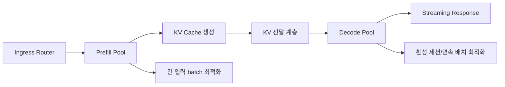
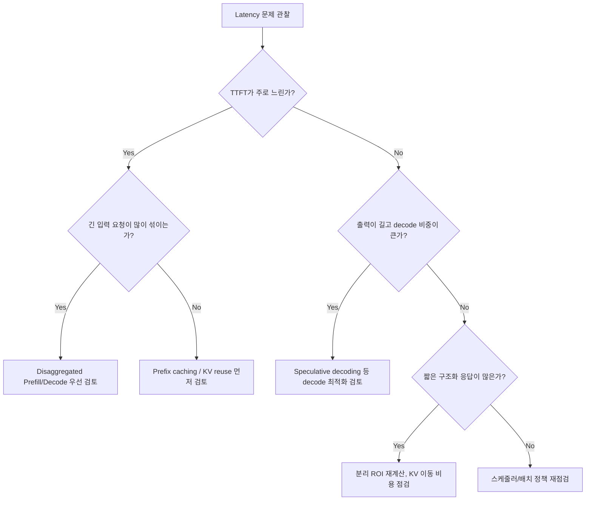

# Disaggregated Prefill/Decode

## 수업 개요
이 챕터는 LLM 추론을 한 덩어리로 보지 않고, `입력을 한 번에 읽어 KV를 만드는 prefill`과 `토큰을 순차적으로 내보내는 decode`를 서로 다른 자원으로 떼어내는 설계를 다룬다. 핵심 질문은 단순하다. 긴 입력이 몰릴 때 같은 GPU 풀에 prefill과 decode를 같이 태우는 편이 나은가, 아니면 prefill 전용 자원과 decode 전용 자원으로 나눠서 큐를 분리하는 편이 나은가 [S1][S2].

2026년 기준 이 설계가 더 자주 언급되는 이유는 긴 context와 multi-tenant workload가 동시에 늘고 있기 때문이다. 장문 문서 요약, RAG, 에이전트 워크플로처럼 입력은 길고 출력은 짧은 요청이 많아질수록, prefill이 shared GPU를 오래 붙잡는 문제가 두드러진다. 반대로 채팅형 요청은 decode 세션이 길게 살아남는다. disaggregation은 이 둘의 병목을 같은 줄에 세워 보지 말고 분리해서 다루자는 제안이다 [S1][S2].

## 학습 목표
- prefill과 decode가 왜 서로 다른 병목을 만드는지 설명할 수 있다.
- disaggregated prefill/decode의 이득 조건을 `대기열 절감`과 `KV 이동 비용`의 균형으로 설명할 수 있다.
- 긴 입력 요약, 멀티테넌트 챗봇, 구조화된 짧은 응답 같은 workload에서 분리 설계의 우선순위를 구분할 수 있다.
- 성능 문제가 생겼을 때 `TTFT`, `토큰당 지연`, `KV 전송`, `스케줄링` 순서로 진단할 수 있다.

## 수업 전에 생각할 질문
- 입력 40k 토큰, 출력 80토큰인 요청이 자주 섞이면 가장 먼저 손봐야 할 것은 decode 속도일까, prefill 대기열일까?
- 같은 모델이라도 `문서 요약`과 `짧은 JSON tool 응답`이 disaggregation에서 서로 다른 ROI를 보이는 이유는 무엇일까?
- prefix caching이나 KV cache reuse가 있으면 disaggregated prefill/decode는 필요 없어지는가?

## 강의 스크립트
### Part 1. 같은 GPU 풀에 다 넣으면 왜 문제가 생기나
**교수자:** 먼저 prefill과 decode를 구분해서 봅시다. prefill은 긴 입력 전체를 한 번 통과시키며 KV cache를 만드는 단계입니다. 입력 길이에 민감하고, 배치로 묶었을 때 계산량이 크게 늘죠. decode는 이미 만들어 둔 KV를 참조하면서 한 토큰씩 앞으로 나아가는 단계입니다. 상대적으로 순차적이고, 활성 세션 수와 메모리 압력의 영향을 크게 받습니다.

**학습자:** 둘 다 결국 같은 모델을 돌리는 건데, 굳이 자원을 나눠야 할 만큼 성격이 다른가요?

**교수자:** 현장에서 차이가 꽤 큽니다. 긴 입력을 먹는 prefill 요청 몇 개가 들어오면 shared GPU의 front queue를 오래 점유합니다. 그동안 이미 응답을 스트리밍 중이던 decode 세션도 scheduler 경쟁을 겪게 됩니다. 반대로 decode 세션이 많은 시간대에는 짧은 요청조차 prefill 시작이 늦어질 수 있습니다. vLLM과 TensorRT-LLM이 disaggregated serving을 별도 기능으로 설명하는 이유가 바로 이 분리된 병목을 다루기 위해서입니다 [S1][S2].

**학습자:** 그러면 이 설계의 목적은 "prefill이 빠른 GPU"와 "decode가 빠른 GPU"를 따로 고르는 것만은 아니겠네요.

**교수자:** 맞습니다. 더 본질적인 목적은 `서로 다른 대기열을 만들고 간섭을 줄이는 것`입니다. 하드웨어가 같더라도 풀을 나누면 tail latency가 달라질 수 있습니다. 특히 긴 context 요청과 짧은 채팅 요청이 섞인 multi-tenant 환경에서 그 차이가 크게 보입니다 [S1][S2].

#### 핵심 수식 1. 분리 전후 지연 모델
$$
\begin{aligned}
T_{\mathrm{mono}} &\approx Q_{\mathrm{shared}} + C_{\mathrm{prefill}}(L_{\mathrm{in}}) + N_{\mathrm{out}} \cdot C_{\mathrm{decode}} + O_{\mathrm{sched}} \\
T_{\mathrm{disagg}} &\approx Q_{\mathrm{prefill}} + C_{\mathrm{prefill}}(L_{\mathrm{in}}) + T_{\mathrm{KV\ move}} + Q_{\mathrm{decode}} + N_{\mathrm{out}} \cdot C_{\mathrm{decode}}
\end{aligned}
$$

여기서 $L_{\mathrm{in}}$은 입력 길이, $N_{\mathrm{out}}$은 출력 토큰 수다. shared 구조에서는 하나의 큐가 모든 요청을 함께 막고, 분리 구조에서는 `prefill 큐`와 `decode 큐`가 따로 존재한다. 대신 분리 구조에는 `KV 이동 시간`이 새로 생긴다. 이 챕터의 tradeoff를 한 줄로 쓰면 `대기열 절감` 대 `KV 이동 비용`이다 [S1][S2].

#### 시각 자료 1. Disaggregated Prefill/Decode 데이터 흐름

### Part 2. 어디서 이득이 커지고, 어디서 바로 손해가 나나
**학습자:** 분리하면 보기에는 깔끔해 보이는데, 결국 KV를 옮겨야 하잖아요. 그 비용이 크면 다 무너지는 것 아닌가요?

**교수자:** 정확한 질문입니다. disaggregation은 "공짜 분리"가 아닙니다. prefill 결과로 생긴 KV 상태를 decode 자원으로 넘겨야 하고, 그 경로가 네트워크든 shared memory든 추가 비용을 만듭니다. 그래서 입력이 짧고 출력도 짧은 요청에는 이득이 거의 없을 수 있습니다. 반대로 긴 입력이 자주 들어와 shared queue를 오래 막는 환경이라면, 이동 비용을 내고도 큐 분리에서 더 큰 이득을 얻습니다 [S1][S2].

**교수자:** 이때 가장 자주 보는 오해는 두 가지입니다.
- `prefill이 무거우니 무조건 분리하면 좋다`라고 생각한다.
- `KV를 옮기면 손해가 있으니 분리 설계는 실험실용`이라고 생각한다.

둘 다 절반만 맞습니다. 요청 분포를 보지 않고는 결론을 내릴 수 없습니다.

#### 핵심 수식 2. 손익분기 조건
$$
\Delta_{\mathrm{benefit}} \approx \left(Q_{\mathrm{shared}} - Q_{\mathrm{prefill}} - Q_{\mathrm{decode}}\right) - T_{\mathrm{KV\ move}}
$$

$\Delta_{\mathrm{benefit}} > 0$이면 분리 구조가 유리하다. 즉 shared 큐에서 줄어든 대기 시간이 KV 이동 시간보다 커야 한다. 이 식이 중요한 이유는, 분리 설계의 성공 여부가 모델 FLOPs가 아니라 `실제 운영 큐 길이`와 `KV 전달 경로`에 달려 있다는 점을 보여 주기 때문이다.

**학습자:** 결국 모델 자체보다 traffic mix가 더 중요하군요.

**교수자:** 맞습니다. 같은 모델이라도 `입력 32k, 출력 100` 서비스와 `입력 1k, 출력 700` 서비스는 전혀 다른 결론을 냅니다.

### Part 3. 어떤 workload에서 먼저 고려해야 하나
**교수자:** 세 가지 장면을 비교해 봅시다.

**교수자:** 첫 번째는 계약서 검토 서비스입니다. 법무팀이 50k 토큰짜리 계약서를 넣고, 모델은 조항별 위험 요약 120토큰 정도를 돌려줍니다. 이런 요청은 prefill 비중이 압도적입니다. shared 구조에서는 장문 입력이 큐를 길게 막으니, decode 세션까지 덩달아 늦어집니다. 여기서는 prefill 전용 풀을 두고 decode 풀을 따로 운영하는 쪽이 자연스럽습니다 [S1][S2].

**학습자:** 그럼 두 번째는 멀티테넌트 챗봇인가요?

**교수자:** 그렇습니다. 사내 검색 도우미, 고객 상담, 내부 문서 QA가 한 클러스터를 공유한다고 해 봅시다. 어떤 tenant는 RAG 때문에 입력이 길고, 어떤 tenant는 짧은 잡담을 오래 이어 갑니다. 이 환경에서 shared GPU 풀은 긴 prefill과 오래 사는 decode 세션이 서로 tail latency를 밀어 올립니다. disaggregation은 이 간섭을 끊는 데 의미가 큽니다 [S1][S2].

**학습자:** 세 번째는 짧은 JSON 응답 route를 생각할 수 있겠네요.

**교수자:** 맞습니다. 주문 상태 확인 agent처럼 structured output과 tool calling을 사용하면서 출력이 아주 짧은 route는 다릅니다. vLLM 문서가 structured outputs와 tool calling을 별도 기능으로 설명하는 이유는, 이런 경로가 decode 길이와 제약 조건을 바꾸기 때문입니다 [S5][S6]. 입력도 짧고 출력도 짧다면 disaggregation의 주인공은 아닙니다. 이 route만 보면 KV 이동 비용이 큐 절감보다 더 크게 보일 수 있습니다.

### Part 4. Prefix caching, KV reuse, speculative decoding과는 무엇이 다른가
**학습자:** 지난 챕터에서 보던 기법들과 겹쳐 보입니다. prefix caching이나 speculative decoding으로도 어느 정도 해결되지 않나요?

**교수자:** 겹치지만 해결하는 병목이 다릅니다.

- prefix caching과 KV cache reuse는 `다시 계산하지 않기`에 가깝습니다. 이미 본 prefix나 KV를 재사용해 prefill 비용 자체를 줄입니다 [S3].
- disaggregated prefill/decode는 `같이 기다리지 않기`에 가깝습니다. prefill과 decode를 다른 자원으로 분리해 큐 간섭을 줄입니다 [S1][S2].
- speculative decoding은 decode 단계에서 target의 순차 진행 횟수를 줄이는 기법입니다. 즉 decode 자체를 더 빨리 끝내려는 방향입니다 [S4].

**학습자:** 그러면 긴 입력 때문에 느린 서비스에서는 speculative decoding보다 disaggregation이 먼저일 수 있겠네요.

**교수자:** 정확합니다. 입력 40k, 출력 80이라면 decode를 조금 줄이는 것보다 prefill 병목을 떼어내는 쪽이 더 큰 변화를 만들 가능성이 큽니다. 반대로 입력 1k, 출력 800이라면 speculative decoding의 우선순위가 올라갑니다 [S2][S4].

**교수자:** prefix caching이 있다고 disaggregation이 필요 없어지는 것도 아닙니다. 캐시 hit가 높은 요청은 prefill 자체가 줄어들지만, miss가 큰 장문 요청은 여전히 남습니다. 그래서 실무에서는 `cache hit가 잘 나는 공통 prefix`는 reuse로 처리하고, `hit가 낮은 장문 요청`은 분리 설계로 흡수하는 식으로 함께 갑니다 [S1][S3].

#### 시각 자료 2. 도입 판단 흐름

### Part 5. 실제 디버깅은 어떤 순서로 해야 하나
**학습자:** 운영 중인 서비스에서 "분리했는데도 별로 안 빨라졌다"는 상황이 나오면 어디부터 봐야 합니까?

**교수자:** 저는 다섯 단계로 봅니다.

1. `문제가 TTFT인지, 토큰당 지연인지`부터 분리합니다. disaggregation은 주로 prefill 대기열 문제에 반응합니다.
2. `긴 입력 비중`을 봅니다. 장문 요청이 적으면 shared 큐 절감 자체가 작아서 이득이 약합니다.
3. `KV 이동 경로`를 봅니다. 네트워크 hop, serialization, connector 오버헤드가 예상보다 크면 손익분기선을 넘지 못합니다 [S1][S2].
4. `decode 풀 포화도`를 봅니다. prefill만 분리하고 decode 풀을 너무 작게 잡으면 병목 위치만 옮겨 놓게 됩니다.
5. `cache 재사용과의 상호작용`을 봅니다. prefix caching이나 KV reuse가 이미 큰 효과를 내는 요청이라면, 분리 대상은 cache miss가 큰 요청 위주로 다시 나눠야 합니다 [S3].

**학습자:** 결국 "분리했는데 안 빨랐다"는 말은 설계 자체가 틀렸다기보다, 어떤 큐를 줄였고 어떤 비용을 새로 만들었는지 계산이 빠졌다는 뜻이군요.

**교수자:** 그렇습니다. 이 챕터에서 중요한 디버깅 습관은 `GPU utilization` 하나로 판단하지 않는 것입니다. utilization이 높아도 prefill queue와 decode queue가 분리되어 tail latency가 좋아질 수 있고, utilization이 비슷해도 KV 이동 때문에 손해가 날 수 있습니다.

### Part 6. 구조화 출력과 에이전트 워크플로에서의 해석
**교수자:** structured outputs와 tool calling은 이 챕터와 무관해 보이지만 실제로는 꽤 중요합니다. 이런 route는 출력이 짧고 제약이 강한 경우가 많습니다 [S5][S6]. 그래서 decode 시간이 아주 길지 않을 수 있고, 분리 이득이 `긴 입력` 쪽에서만 나오는지, 아니면 거의 없는지 따져 봐야 합니다.

**학습자:** 그러면 agent 시스템에서 disaggregation은 주로 어떤 부분에 붙나요?

**교수자:** tool을 부르기 전에 긴 문서와 state를 읽는 쪽입니다. 예를 들어 에이전트가 여러 문서를 모아 판단한 뒤, 마지막에 짧은 함수 호출 JSON을 내보낸다면 무거운 부분은 prefill에 몰려 있습니다. 반면 대화형 planning을 길게 생성하는 에이전트라면 decode 풀 설계도 중요해집니다. 같은 agentic workload라도 `문서를 많이 읽는가`와 `토큰을 길게 생성하는가`를 분리해서 봐야 합니다 [S1][S5][S6].

### Part 7. 참고 이미지와 연결해서 기억하기
**교수자:** 첫 번째 이미지는 vLLM 로고입니다. 이 이미지는 단순 장식이 아니라, disaggregated prefill이 이제 특정 논문 속 아이디어가 아니라 실제 serving 엔진의 기능 표면에 올라와 있다는 점을 상기시키는 역할을 합니다 [S1].

**교수자:** 두 번째 이미지는 Roofline model입니다. 이 그림은 어떤 단계가 계산 집약적인지, 어떤 단계가 메모리와 이동 비용에 더 민감한지 생각할 때 유용합니다. prefill과 decode를 같은 그래프 위에 한 색으로 칠하지 말고, 서로 다른 자원 패턴으로 보는 습관을 들이라는 신호로 읽으면 좋습니다 [S2].

**학습자:** 정리하면 이 챕터의 결론은 "prefill과 decode를 같은 모델 호출이라고 묶지 말고, 서로 다른 대기열과 이동 경로를 가진 두 작업으로 보라"는 말이네요.

**교수자:** 바로 그 문장이 핵심입니다.

## 자주 헷갈리는 포인트
- disaggregation은 모델을 둘로 쪼개는 기법이 아니다. 같은 모델 추론 흐름에서 prefill과 decode를 다른 자원으로 배치하는 운영 설계다 [S1][S2].
- prefill이 무겁다고 해서 항상 분리 이득이 나는 것은 아니다. shared queue 절감이 KV 이동 비용보다 커야 한다.
- prefix caching과 disaggregation은 대체재가 아니라 보완재일 수 있다. 하나는 계산을 줄이고, 다른 하나는 대기열 간섭을 줄인다 [S3].
- speculative decoding은 decode 최적화이고, disaggregated prefill/decode는 자원 분리 최적화다. 둘을 같은 질문으로 비교하면 우선순위를 잘못 잡기 쉽다 [S4].
- structured output이나 tool calling route는 출력이 짧고 제약적일 수 있어, disaggregation ROI가 기대보다 작을 수 있다 [S5][S6].

## 사례로 다시 보기
### 사례 1. 50k 계약서 검토 서비스
- 입력은 매우 길고 출력은 위험 조항 요약 몇 문단으로 짧다.
- 병목은 decode보다 prefill과 shared queue 점유에 가깝다.
- 선택 기준은 `KV 이동 비용`보다 `긴 입력이 다른 요청을 얼마나 오래 막는가`다.
- 이 경우 prefill 풀과 decode 풀을 나누는 것이 자연스럽다 [S1][S2].

### 사례 2. 멀티테넌트 사내 챗봇
- 어떤 tenant는 RAG로 긴 문서를 붙이고, 어떤 tenant는 짧은 질의를 오래 이어 간다.
- shared GPU 풀에서는 긴 prefill과 오래 사는 decode 세션이 서로 꼬여 tail latency가 커진다.
- 분리 설계의 장점은 평균 속도보다 `서로 다른 tenant의 간섭 완화`에서 더 잘 드러난다 [S1][S2].

### 사례 3. 주문 상태 확인용 JSON agent
- 출력은 매우 짧고 structured output, tool calling 제약이 강하다.
- 입력도 짧다면 disaggregation 이득은 작고, KV 이동 비용이 더 눈에 띌 수 있다.
- 이 route는 분리 구조의 대표 사례가 아니라 예외 케이스 점검용 사례다 [S5][S6].

## 핵심 정리
- prefill은 긴 입력 처리와 KV 생성에 민감하고, decode는 활성 세션 유지와 순차 토큰 생성에 민감하다.
- disaggregated prefill/decode의 핵심 tradeoff는 `네트워크 또는 전달 비용`과 `자원 효율 및 큐 분리 효과`다 [S1][S2].
- 긴 입력과 multi-tenant workload가 많을수록 분리 설계의 매력이 커진다.
- prefix caching과 KV reuse는 계산 재사용, speculative decoding은 decode 가속, disaggregation은 자원 분리라는 서로 다른 축의 해법이다 [S3][S4].
- 짧은 구조화 응답 route까지 같은 정책으로 밀어 넣으면 ROI 판단이 틀어질 수 있다. route별로 분리 우선순위를 따져야 한다 [S5][S6].

## 복습 체크리스트
- prefill과 decode의 병목 차이를 `입력 길이`, `출력 길이`, `활성 세션` 관점에서 설명할 수 있는가?
- 분리 구조의 손익분기 조건을 `shared queue 절감 > KV 이동 비용`으로 설명할 수 있는가?
- 긴 입력 요약 서비스에서 왜 speculative decoding보다 disaggregation이 먼저일 수 있는지 말할 수 있는가?
- prefix caching, KV reuse, disaggregated prefill/decode의 차이를 한 문장씩 구분할 수 있는가?
- structured output과 tool calling route가 항상 분리 구조의 좋은 후보가 아닌 이유를 설명할 수 있는가?

## 대안과 비교
| 접근 | 주로 겨냥하는 병목 | 잘 맞는 상황 | 주의할 점 |
| --- | --- | --- | --- |
| Disaggregated Prefill/Decode | shared queue 간섭, 긴 입력이 만드는 prefill 병목 | 긴 context, multi-tenant 혼합 트래픽 | KV 이동 경로와 decode 풀 크기를 같이 설계해야 함 [S1][S2] |
| Prefix Caching | 반복되는 prefix의 재계산 | system prompt, 공통 schema, 반복 문맥이 많은 서비스 | hit율과 invalidation 정책이 성능을 좌우함 [S3] |
| KV Cache Reuse | 계산된 KV의 재연결 및 재사용 | 유사한 context 재사용 기회가 많은 엔진 | disaggregation과 결합할 때 이동/재사용 경계를 분리해서 봐야 함 [S3] |
| Speculative Decoding | decode 단계의 순차 진행 비용 | 출력이 길고 decode 비중이 큰 route | 입력이 긴 서비스에는 우선순위가 낮을 수 있음 [S4] |
| Structured Outputs / Tool Calling 최적화 | 형식 제약, 짧은 응답, agent workflow 제약 | JSON 응답, 함수 호출, 제약된 출력 경로 | decode 길이가 짧으면 disaggregation ROI가 작아질 수 있음 [S5][S6] |

## 참고 이미지

- [I1] vLLM 로고는 disaggregated prefill이 실제 serving 엔진 기능 표면에 올라와 있다는 점을 상기시키는 참고 이미지다. 본문 Part 1과 Part 7의 "운영 기능으로서의 분리 설계" 설명과 연결된다.

- [I2] Roofline model은 prefill과 decode를 같은 부하로 뭉뚱그리지 말고, 계산 패턴과 이동 비용이 다른 두 단계로 봐야 한다는 감각을 보조한다. 본문 Part 2와 Part 7의 tradeoff 설명과 연결된다.

## 출처
| 번호 | 제목 | 발행 주체 | 날짜 | URL | 사용 이유 |
| --- | --- | --- | --- | --- | --- |
| [S1] | Disaggregated Prefill V1 | vLLM project | 2026-03-08 (accessed) | https://docs.vllm.ai/en/latest/features/disagg_prefill.html | prefill/decode 분리 구조와 최신 구현 맥락 설명 |
| [S2] | Disaggregated Serving | NVIDIA TensorRT-LLM | 2026-03-08 (accessed) | https://nvidia.github.io/TensorRT-LLM/1.2.0rc6/features/disagg-serving.html | 자원 분리와 KV 전달 tradeoff 비교 |
| [S3] | KV Cache Reuse | NVIDIA TensorRT-LLM | 2026-03-08 (accessed) | https://nvidia.github.io/TensorRT-LLM/advanced/kv-cache-reuse.html | prefix caching 및 KV 재사용과의 차이 설명 |
| [S4] | Speculative Decoding | NVIDIA TensorRT-LLM | 2026-03-08 (accessed) | https://nvidia.github.io/TensorRT-LLM/1.2.0rc3/features/speculative-decoding.html | decode 가속 기법과의 비교 축 제공 |
| [S5] | Structured Outputs | vLLM project | 2026-03-08 (accessed) | https://docs.vllm.ai/en/latest/features/structured_outputs.html | 짧고 제약된 출력 route의 특성 설명 |
| [S6] | Tool Calling | vLLM project | 2026-03-08 (accessed) | https://docs.vllm.ai/en/latest/features/tool_calling.html | agent workflow와 짧은 함수 호출 응답 맥락 설명 |
