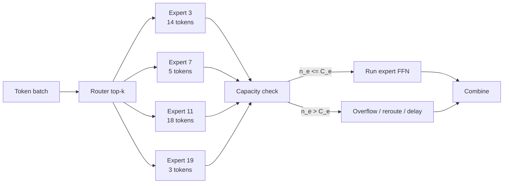
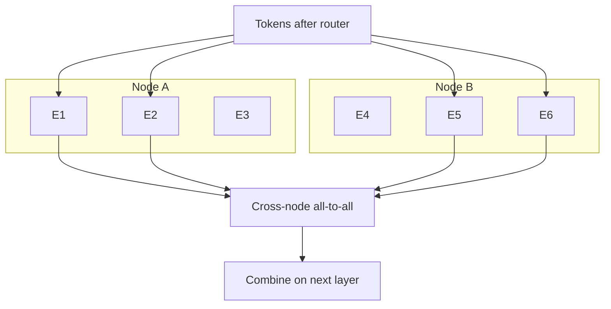
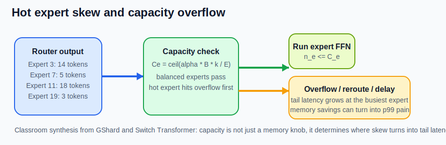
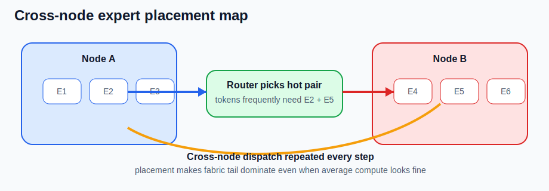

# MoE and Expert Parallelism

## 수업 개요
이번 장은 MoE를 `큰 모델을 싸게 돌리는 요령`이 아니라 `토큰을 expert로 라우팅하는 분산 시스템`으로 읽는다. Sparsely-Gated MoE는 토큰별로 일부 expert만 활성화하는 conditional computation 구조를 제시했고 [S1], GShard는 top-2 gating과 expert capacity, 자동 sharding을 대규모 분산 관점에서 구체화했다 [S2]. Switch Transformer는 top-1 routing과 capacity/overflow 처리의 단순화를 통해 라우팅 정책이 시스템 비용까지 바꾼다는 점을 더 분명히 보여 준다 [S3]. 따라서 serving 관점의 핵심 질문은 `활성 파라미터가 얼마나 적은가`보다 `어느 expert가 병목이 되는가`, `overflow를 어떻게 흡수하는가`, `expert를 어디에 두면 all-to-all tail을 줄일 수 있는가`다 [S1][S2][S3].

## 학습 목표
- 총 파라미터와 토큰당 활성 파라미터를 구분하고, 왜 latency가 그 차이만으로 설명되지 않는지 말할 수 있다.
- `top-k`, `capacity factor`, `overflow`, `expert placement`가 tail latency를 어떻게 바꾸는지 설명할 수 있다.
- expert parallelism의 병목이 dense tensor parallelism의 병목과 왜 다른지 설명할 수 있다.
- 어떤 workload에서 MoE가 throughput 이점을 살리고, 어떤 workload에서 low-batch interactive tail 때문에 dense가 더 단순한 선택인지 판단할 수 있다.

## 수업 전에 생각할 질문
- `top-2 MoE`라는 말만 듣고 실제 dispatch/combine 비용을 과소평가하기 쉬운 이유는 무엇일까?
- capacity factor를 낮추면 메모리는 아낄 수 있는데, 왜 p99는 오히려 나빠질 수 있을까?
- expert를 여러 노드에 나눠 두었을 때 왜 평균 FLOPs보다 `가장 늦은 expert`가 더 중요해질까?

## 강의 스크립트
### Part 1. active parameter는 출발점일 뿐 끝이 아니다
**학습자:** MoE 소개를 들으면 항상 `총 파라미터는 크지만 토큰당 활성 파라미터는 작다`는 문장이 먼저 나옵니다. serving에서도 거의 그 문장으로 이해하면 되나요?

**교수자:** 출발점으로는 맞지만 충분하지는 않습니다. Sparsely-Gated MoE와 GShard는 모두 토큰이 일부 expert로만 라우팅된다는 점을 전제로 설명하지만, 동시에 gating과 expert capacity가 따로 필요하다는 점도 분명히 적습니다 [S1][S2]. Switch Transformer도 top-1 routing을 제안하면서 오히려 `routing을 단순하게 만들어야 시스템이 버틴다`는 메시지를 줍니다 [S3].

#### 핵심 수식 1. 활성 파라미터와 expert capacity를 같이 본다
$$
\begin{aligned}
P_{\mathrm{active/token}} &= P_{\mathrm{shared}} + k \cdot P_{\mathrm{expert}} \\
C_e &= \left\lceil \alpha \cdot \frac{B \cdot k}{E} \right\rceil
\end{aligned}
$$

첫 식은 토큰당 실제로 깨우는 파라미터 양을 보여 주고, 둘째 식은 GShard와 Switch Transformer가 설명하는 expert capacity 개념을 수업용으로 정리한 식이다 [합성] [S2][S3]. 여기서 `k`는 top-k, `E`는 expert 수, `B`는 함께 처리하는 토큰 수, `\alpha`는 capacity factor다.

**학습자:** 그러면 active parameter만 보고 `dense보다 싸다`라고 말하면 반쪽짜리군요.

**교수자:** 맞습니다. active parameter가 줄어도 router, dispatch, combine, overflow 처리가 새로 생깁니다 [S1][S2][S3]. MoE의 실전 병목은 평균 expert가 아니라 `가장 바쁜 expert`가 만드는 경우가 많습니다 [합성] [S1][S2][S3].

### Part 2. top-k와 capacity factor는 품질 값이자 tail-latency 값이다
**학습자:** top-k를 1에서 2로 올리는 건 보통 품질을 위한 선택 아닌가요?

**교수자:** 품질만의 문제는 아닙니다. GShard의 top-2 gating은 한 토큰이 두 expert 경로를 타게 만들고 [S2], Switch Transformer가 top-1 routing을 택한 이유 중 하나도 이 dispatch 복잡도를 줄이기 위해서입니다 [S3]. top-k가 커지면 토큰 복제와 combine 대기 경로도 함께 늘어납니다 [S2][S3].

**교수자:** capacity factor도 비슷합니다. capacity를 낮추면 expert당 예약 슬롯은 줄지만 overflow 가능성은 높아집니다 [S2][S3]. overflow를 reroute하든, drop하든, delay하든 tail latency에는 비용이 남습니다 [합성] [S2][S3].

**학습자:** 결국 `capacity factor를 낮추면 메모리가 준다`만 보면 안 되겠네요.

**교수자:** 그렇죠. serving에서는 `overflow 비율`, `expert별 queue depth`, `dispatch bytes`, balancedness 같은 운영 지표를 같이 봐야 합니다 [합성] [S2][S3][S4].

### Part 3. expert parallelism의 병목은 dense tensor parallel과 다르다
**학습자:** 그래도 여러 GPU를 함께 쓰는 건 같으니 dense tensor parallel 감각을 어느 정도 가져와도 되지 않나요?

**교수자:** 그대로 가져오면 자주 틀립니다. GShard는 expert 집합을 sharding된 분산 자원으로 두고 토큰을 all-to-all에 가깝게 재배치하는 구조를 설명합니다 [S2]. Sparsely-Gated MoE도 애초에 expert별 불균형이 생길 수 있음을 전제로 auxiliary load balancing을 둡니다 [S1]. 최신 serving 구현인 vLLM expert parallel deployment도 EP deployment와 expert parallel load balancer(EPLB)를 따로 두어, 추론 단계에서도 skew와 rebalancing을 운영 문제로 다룹니다 [S4]. dense tensor parallel이 `모든 shard가 비슷한 연산을 같이 한다`에 가깝다면, expert parallel은 `토큰 분포가 매 step 달라지고 가장 늦은 expert가 completion을 잡는다`에 가깝습니다 [합성] [S1][S2][S4].

#### 핵심 수식 2. MoE step latency는 가장 늦은 expert와 dispatch가 정한다
$$
\begin{aligned}
T_{\mathrm{step}}^{\mathrm{MoE}} &\approx T_{\mathrm{router}} + T_{\mathrm{dispatch}} + \max_e\left(T_{\mathrm{queue},e} + T_{\mathrm{ffn},e}\right) + T_{\mathrm{combine}} \\
T_{\mathrm{dispatch}} &\propto \frac{B \cdot k \cdot H}{BW_{\mathrm{fabric}}}
\end{aligned}
$$

이 식은 S1-S3의 routing, capacity, sharding 설명을 serving step 지연으로 묶은 학습용 식이다 [합성] [S1][S2][S3]. `H`는 hidden state 크기다. 평균 expert 시간이 아니라 `가장 늦은 expert`와 `fabric 대역폭`이 tail을 만든다는 점이 핵심이다.

**학습자:** 그러면 hot expert 쌍이 서로 다른 노드에 놓여 있으면 fabric이 먼저 울겠네요.

**교수자:** 맞습니다. expert placement가 잘못되면 `연산이 느린 모델`이 아니라 `경로가 나쁜 모델`이 됩니다 [합성] [S2][S3].

### Part 4. low-batch interactive serving에서는 amortization이 깨진다
**학습자:** 그럼 batch만 크게 만들면 MoE가 항상 유리한가요?

**교수자:** 큰 batch가 유리한 건 맞지만 만능은 아닙니다. S1-S3는 모두 충분한 토큰 집합을 expert에 분산시키는 전제를 두고 routing을 설명합니다 [S1][S2][S3]. 반대로 인터랙티브 서비스처럼 동시에 살아 있는 토큰 수가 적으면, top-k 복제와 dispatch의 고정 비용이 숨지 못합니다 [합성] [S1][S2][S3].

**교수자:** 그래서 `MoE는 active parameter가 적으니 인터랙티브에도 더 좋다`는 단순화는 위험합니다. batch가 작으면 우연한 skew가 바로 `가장 늦은 expert`로 드러나고, top-k 증가분이 거의 그대로 TTFT와 p99에 찍힐 수 있습니다. 최신 EP deployment 문서가 balancedness와 EPLB를 따로 두는 이유도 이런 tail 관리가 운영 문제이기 때문입니다 [합성] [S1][S2][S3][S4].

### Part 5. 실제 실패 장면은 세 가지로 압축된다
**교수자:** 세 가지 운영 사고를 보겠습니다.

**교수자:** 첫째는 `capacity overflow`입니다. 특정 표현이 같은 expert로 몰리면 capacity factor를 낮게 잡아 둔 expert가 먼저 터집니다. 이 장면은 GShard와 Switch Transformer가 왜 capacity 개념과 load balancing을 강조하는지와 직접 연결됩니다 [S2][S3].

**교수자:** 둘째는 `cross-node placement 실패`입니다. 자주 같이 선택되는 expert 쌍이 서로 다른 노드에 놓이면 매 step마다 remote dispatch bytes가 커집니다. GShard의 sharding 설명은 바로 이런 expert 분산 경로가 공짜가 아님을 보여 줍니다 [S2].

**교수자:** 셋째는 `low-batch amortization failure`입니다. 인터랙티브 상담 봇처럼 동시성이 낮은 서비스에서는 top-k 증가로 생긴 dispatch와 combine 비용이 숨지 못하고, dense보다 active parameter는 적어도 체감 latency가 더 나빠질 수 있습니다 [합성] [S1][S2][S3].

### Part 6. 디버깅 순서는 router에서 workload 적합성까지 간다
**학습자:** 장애가 나면 무엇부터 확인해야 하나요?

**교수자:** MoE에서는 순서가 다릅니다.

1. `router histogram`이나 balancedness 지표를 봅니다. 어떤 토큰군이 어느 expert로 쏠리는지 모르면 원인을 못 잡습니다 [합성] [S1][S2][S3][S4].
2. `capacity overflow, reroute, delay 비율`을 봅니다. capacity factor가 traffic mix에 맞는지 확인해야 합니다 [S2][S3][S4].
3. `expert placement와 remote dispatch bytes`를 봅니다. 자주 같이 선택되는 expert 쌍이 원격 경로를 강제하는지 확인해야 합니다 [S2][S4].
4. `batch size와 top-k`를 함께 봅니다. 작은 batch에서는 top-k 증분이 곧 latency 증분일 수 있습니다 [합성] [S1][S2][S3][S4].
5. 마지막으로 `이 workload가 원래 MoE에 맞는지`를 다시 판단합니다. low-batch interactive라면 dense가 더 단순한 선택일 수 있습니다 [합성] [S1][S2][S3].

**학습자:** 결국 MoE 운영의 핵심은 `active parameter가 적다`를 증명하는 게 아니라 `어떤 경로가 tail을 만들었는지`를 증명하는 거군요.

**교수자:** 바로 그 점입니다. dense tensor parallel에서는 계산과 메모리 분해가 중심이었다면, expert parallel에서는 `경로`, `편중`, `배치`, `배치 위치`가 중심입니다 [합성] [S1][S2][S3].

## 자주 헷갈리는 포인트
- `총 파라미터가 크다`와 `토큰당 활성 파라미터가 작다`는 함께 참일 수 있다. 하지만 serving latency는 router, dispatch, combine, overflow 처리까지 더해져 결정된다 [S1][S2][S3].
- top-k는 품질만 바꾸는 값이 아니다. top-k가 커질수록 expert 복제 수와 combine 대기 경로도 같이 커진다 [S2][S3].
- capacity factor를 낮추면 항상 빠른 것이 아니다. overflow를 흡수하지 못하면 p99가 먼저 망가진다 [S2][S3].
- expert parallelism의 병목은 dense tensor parallel의 all-reduce 감각으로 설명되지 않는다. `가장 바쁜 expert`와 `가장 먼 expert 쌍`이 더 중요하다 [합성] [S1][S2].
- low-batch interactive workload에서는 routing 오버헤드를 amortize하지 못해 dense보다 체감 지연이 나빠질 수 있다 [합성] [S1][S2][S3].

## 사례로 다시 보기
### 사례 1. 세일 이벤트 상품 추천
- 특정 카테고리 표현이 몰리면서 하나의 hot expert가 capacity를 자주 초과했다 [수업용 추론] [S2][S3].
- 증상은 평균 utilization보다 p99 급등, overflow 증가, expert queue depth 편차, balancedness 악화로 먼저 나타난다 [합성] [S2][S3][S4].
- 우선 조치는 GPU 추가가 아니라 `capacity factor 재조정`, `router skew 확인`, `overflow 처리 정책 점검`, `EPLB/배치 정책 확인`이다 [합성] [S2][S3][S4].

### 사례 2. code assistant의 cross-node expert 배치 실패
- 자주 같이 선택되는 expert 두 개가 서로 다른 노드에 있어 remote dispatch bytes가 커졌다 [수업용 추론] [S2][S4].
- 사용자는 중간중간 멈칫하는 tail latency를 체감하지만 평균 throughput은 크게 나쁘지 않을 수 있다 [합성] [S2][S4].
- 우선 조치는 `expert co-placement`, `hot pair 분석`, `remote dispatch bytes 감소`다 [합성] [S2][S4].

### 사례 3. 낮은 동시성의 고객 상담 봇
- GPU당 동시에 살아 있는 요청 수가 적어 router와 dispatch 고정 비용이 숨지 못했다 [수업용 추론] [S1][S2][S3][S4].
- dense보다 활성 파라미터는 적었지만 top-k 증가와 작은 batch가 겹쳐 TTFT와 p99가 악화될 수 있다 [합성] [S1][S2][S3][S4].
- 우선 조치는 `top-k 재검토`, `microbatching 정책 조정`, `dense 대안 재평가`다 [합성] [S1][S2][S3][S4].

### 사례 4. 야간 대량 문서 분류 파이프라인
- 큰 batch와 비교적 고른 expert 사용이 유지되면 routing overhead가 평균화되기 쉽다 [합성] [S1][S2][S3].
- 이 경우 active parameter 절감이 실제 throughput 개선으로 이어질 가능성이 커진다 [합성] [S1][S2][S3].
- 이런 workload가 MoE가 제값을 하는 전형적인 장면이다.

## 핵심 정리
- MoE serving의 핵심은 `몇 개 expert를 켜는가`보다 `그 expert까지 어떤 경로로 보내고, 어디서 기다리게 되는가`다 [S1][S2][S3].
- top-k, capacity factor, expert placement는 서로 독립 변수가 아니라 하나의 tail-latency 세트다 [S2][S3].
- p95/p99를 악화시키는 주범은 평균 FLOPs 부족보다 hot expert, overflow, cross-node all-to-all, low-batch amortization failure인 경우가 많다 [합성] [S1][S2][S3].
- dense tensor parallel 감각으로 접근하면 평균만 보고 놓치기 쉽다. MoE는 `가장 늦은 expert`가 step completion을 결정한다 [합성] [S1][S2].
- batch가 충분하고 expert 사용이 고르게 퍼지는 throughput 지향 workload에서는 MoE가 강하지만, low-batch interactive 서비스에서는 dense가 더 단순하고 빠를 수 있다 [합성] [S1][S2][S3].

## 복습 체크리스트
- 활성 파라미터와 expert capacity를 각각 무엇을 설명하는 식으로 읽어야 하는지 설명할 수 있는가?
- top-k를 1에서 2로 올렸을 때 품질 외에 어떤 latency 비용이 붙는지 말할 수 있는가?
- capacity factor가 너무 낮을 때 생기는 overflow, reroute, delay 문제를 구분할 수 있는가?
- expert placement가 tail latency를 어떻게 키우는지 cross-node all-to-all 관점에서 설명할 수 있는가?
- low-batch interactive workload에서 MoE의 amortization이 깨지는 조건을 말할 수 있는가?

## 대안과 비교
아래 비교표는 `MoE 고유 병목`과 `다른 serving 병목`을 구분하기 위한 보조 표다. 이 표의 S4-S6은 MoE 자체의 근거가 아니라 인접 병목의 기준선으로만 쓴다.

| 접근 | 먼저 보는 병목 | 잘 맞는 상황 | MoE와의 관계 | 참고 |
| --- | --- | --- | --- | --- |
| MoE + Expert Parallel | router skew, capacity overflow, all-to-all, placement, EPLB | 큰 batch, 고른 expert 사용, throughput 지향 작업 | 활성 파라미터 절감이 실제 처리량으로 이어질 수 있다 | 본문 [S1][S2][S3][S4] |
| Disaggregated Prefill/Decode | 긴 입력이 만드는 prefill 대기열 | 긴 입력과 짧은 출력이 섞인 서비스 | expert routing과 다른 단계 분리 병목이다 | [S5] |
| Structured Outputs | constrained decoding, schema repair | 짧지만 제약된 생성 API | expert routing과 다른 decode 제약 병목이다 | [S6] |

## 참고 이미지

- 캡션: hot expert가 capacity를 넘을 때 overflow와 queue delay가 어떻게 생기는지 보여 주는 도식이다 [합성] [S2][S3].
- 출처 번호: [I1], [S2], [S3]
- 왜 이 그림이 필요한지: `capacity factor를 낮추면 메모리는 줄어도 tail은 나빠질 수 있다`는 문장을 시각적으로 붙잡게 한다.

- 캡션: 자주 같이 선택되는 expert 쌍이 다른 노드에 있을 때 cross-node dispatch와 combine이 매 step 반복되는 장면을 그린 도식이다 [합성] [S2].
- 출처 번호: [I2], [S2]
- 왜 이 그림이 필요한지: expert parallel의 병목이 dense tensor parallel의 평균 대역폭 설명과 다른 이유를 placement 관점에서 직접 보여 준다.

## 출처
| 번호 | 제목 | 발행 주체 | 날짜 | URL | 사용 이유 |
| --- | --- | --- | --- | --- | --- |
| [S1] | Outrageously Large Neural Networks: The Sparsely-Gated Mixture-of-Experts Layer | Google Research / arXiv | 2017-01-23 | https://arxiv.org/abs/1701.06538 | sparse gating, load balancing, expert routing의 기본 개념 |
| [S2] | GShard: Scaling Giant Models with Conditional Computation and Automatic Sharding | Google Research / arXiv | 2020-06-29 | https://arxiv.org/abs/2006.16668 | top-2 gating, expert capacity, sharding, distributed MoE 경로 설명 |
| [S3] | Switch Transformers: Scaling to Trillion Parameter Models with Simple and Efficient Sparsity | Google Research / JMLR | 2022-01-01 | https://arxiv.org/abs/2101.03961 | top-1 routing, capacity/overflow 단순화, routing 비용과 안정성 설명 |
| [S4] | Expert Parallel Deployment | vLLM project | 2026-03-08 (accessed) | https://docs.vllm.ai/en/v0.14.1/serving/expert_parallel_deployment/ | 최신 expert parallel serving, EP deployment, EPLB와 balancedness 지표 설명 |
| [S5] | Disaggregated Prefill V1 | vLLM project | 2026-03-08 (accessed) | https://docs.vllm.ai/en/latest/features/disagg_prefill.html | MoE가 아닌 단계 분리 병목과 비교하기 위한 보조 출처 |
| [S6] | Structured Outputs | vLLM project | 2026-03-08 (accessed) | https://docs.vllm.ai/en/latest/features/structured_outputs.html | expert routing과 다른 constrained decoding 병목을 비교하기 위한 보조 출처 |
