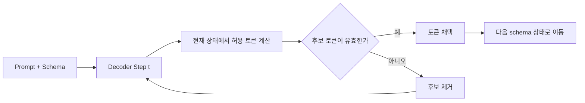
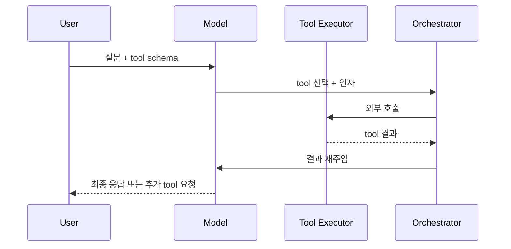

# Structured Outputs and Tool Calling

## 수업 개요
이 챕터는 structured output과 tool calling을 "출력 포맷 옵션"이 아니라 decode 경로와 세션 구조를 바꾸는 serving 기능으로 다룬다. vLLM은 `Structured Outputs`와 `Tool Calling`을 독립 기능으로 문서화하고 있고 [S5][S6], 같은 시기 serving 엔진 문서들은 prefill/decode 분리, KV cache 재사용, speculative decoding을 별도 최적화 축으로 설명한다 [S1][S2][S3][S4]. 이 둘을 같이 보면 질문이 달라진다. "JSON이 잘 나오나?"가 아니라 "형식 보장을 위해 decode 자유도를 얼마나 줄일 것인가, 그리고 tool round가 늘어날 때 세션 latency를 어디서 줄일 것인가?"가 핵심이다.

2026년 agentic workflow에서 structured output과 tool calling은 optional 기능이 아니라 기본 요구사항에 가깝다. 문제는 기능 지원 여부보다 운영 방식이다. strict schema는 downstream 안정성을 올리지만 decode step마다 제약 계산을 넣고, tool calling은 답변 한 번으로 끝나지 않고 재프롬프트와 외부 실행을 세션에 추가한다 [S5][S6].

## 학습 목표
- structured output을 후처리 파싱이 아니라 constrained decoding으로 설명할 수 있다.
- tool calling latency를 단일 decode 시간이 아니라 세션 오케스트레이션 비용으로 분해할 수 있다.
- KV cache reuse, disaggregated prefill/decode, speculative decoding이 structured output과 tool calling workload에 어떤 식으로 엮이는지 비교할 수 있다.
- strict schema, 느슨한 schema, post-hoc validation, tool calling 분할 설계 중 무엇을 선택할지 기준을 세울 수 있다.

## 수업 전에 생각할 질문
- 모델이 JSON을 대체로 잘 쓰는 것과 schema-valid rate가 높은 것은 왜 다른가?
- tool calling이 느릴 때 가장 먼저 볼 지표는 GPU utilization인가, 첫 tool 선택 정확도인가?
- 긴 정책 문서를 매 요청마다 붙이는 agent에서 structured output이 들어오면 KV cache reuse와 prefill/decode 분리가 왜 같이 떠오르는가?

## 강의 스크립트
### 1. 형식 보장은 출력 장식이 아니라 decode 제약이다
**학습자:** 모델이 JSON으로 답하게 프롬프트만 잘 쓰면 되는 것 아닌가요?

**교수자:** 데모에서는 그렇게 보여도 운영에서는 다르다. structured output을 후처리 JSON 파서 문제로 보면 실패 지점을 늦게 발견한다. 실제로는 decode 도중 허용 가능한 토큰 집합을 관리하는 constrained decoding으로 보는 편이 맞다 [S5].

**학습자:** 그러면 모델이 "잘 배워서 맞춘다"기보다 엔진이 "지금은 이 토큰만 허용한다"를 강제하는 건가요?

**교수자:** 정확하다. 예를 들어 `decision`, `risk_level`, `refund_amount`를 가진 JSON을 강제하면, 어떤 시점에는 중괄호나 따옴표, 특정 키 이름, enum 값만 허용된다. 자유 생성에서는 열려 있던 후보 집합이 갑자기 매우 좁아진다. 그 순간 tradeoff는 "문장이 자연스러운가"보다 "형식 보장 때문에 decode 자유도를 얼마나 포기할 것인가"가 된다 [S5].

#### 수식 1. 시점별 유효 토큰 비율
$$
\rho_t = \frac{|V_{\mathrm{valid}}(t)|}{|V|}
$$

여기서 $\rho_t$는 시점 $t$에서 실제로 선택 가능한 토큰 비율이다. $\rho_t$가 작아질수록 형식은 단단해지지만 모델의 표현 자유도는 줄어든다. strict schema가 항상 공짜인 이유가 없는 것도 이 때문이다.

**교수자:** 운영에서 자주 보는 첫 번째 실수는 모든 필드를 같은 강도로 묶는 것이다. downstream이 바로 읽는 필드와 사람이 검토하는 필드를 구분하지 않으면 decode는 불필요하게 경직된다.

**학습자:** 예를 들면 어떤 경우죠?

**교수자:** 정산 분류 파이프라인을 보자. `category`, `tax_type`, `needs_review`는 기계가 바로 읽으니 strict schema가 맞다. 반면 `explanation`은 사람이 보는 필드라면 길이 상한이나 금칙어 정도만 두고 조금 느슨하게 두는 편이 낫다. 설명 필드까지 enum처럼 다 묶으면 형식은 예쁘지만 운영 이득이 거의 없는 비용을 낸다.

### 2. Tool calling은 답변 생성이 아니라 세션 설계다
**학습자:** tool calling도 결국 함수 이름과 인자를 JSON으로 뽑는 일이니 structured output의 확장판 아닌가요?

**교수자:** 절반만 맞다. 형식 제약 면에서는 맞지만, 시스템 면에서는 더 크다. tool calling이 들어오면 응답 한 번으로 끝나지 않는다. 도구 선택, 인자 생성, 외부 실행, 결과 수신, 재프롬프트, 최종 응답이 이어지는 세션이 된다 [S6].

**학습자:** 그러면 p95 latency도 한 번의 decode로는 설명이 안 되겠네요.

**교수자:** 맞다. 그래서 tool calling workload는 세션 latency로 봐야 한다.

#### 수식 2. Tool calling 세션 지연 시간
$$
T_{\mathrm{session}} = T_{\mathrm{prefill}}^{(0)} + \sum_{k=1}^{K}\left(T_{\mathrm{decode},k}^{\mathrm{constr}} + T_{\mathrm{tool},k} + T_{\mathrm{reprompt},k} + T_{\mathrm{validate},k}\right)
$$

여기서 $K$는 tool round 수다. 잘못된 첫 선택으로 $K$가 한 번만 늘어나도 사용자는 "모델이 느리다"라고 느낀다. 실제 원인은 decode가 아니라 도구 공간 설계나 재시도 정책일 수 있다 [S6].

**교수자:** 구매 승인 agent를 예로 들자. `lookup_stock`, `check_policy`, `create_order` 세 개의 도구가 있는데, 설명이 겹치면 첫 선택 정확도가 떨어진다. 그러면 재호출이 늘고, 최종 응답은 맞더라도 세션 p95가 튄다. 이때 GPU utilization만 보고 있으면 진단 순서가 어긋난다.

### 3. structured output과 tool calling은 다른 최적화와 충돌도 하고 협력도 한다
**학습자:** 앞 챕터의 speculative decoding이나 disaggregated prefill/decode는 여기서도 그대로 이득을 주나요?

**교수자:** 그대로라고 말하면 위험하다. structured output은 허용 토큰 집합이 좁고, tool calling은 중간중간 세션이 끊긴다. 그래서 다른 최적화와의 결합 방식을 따로 봐야 한다.

**교수자:** 먼저 KV cache reuse부터 보자. 같은 system prompt나 긴 정책 문서를 여러 요청과 round에서 반복한다면 KV cache 재사용은 바로 효과가 있다 [S3]. 특히 tool 결과만 바뀌고 앞부분 지시문은 같은 agent에서는 공통 prefix가 크다.

**학습자:** 그럼 긴 프롬프트 agent일수록 structured output과 KV reuse를 같이 봐야겠네요.

**교수자:** 그렇다. 다음은 disaggregated prefill/decode다. structured output 자체가 prefill을 줄여 주지는 않지만, tool calling agent는 공통 prefix가 길고 round가 여러 번 생기기 쉽다. 이럴 때 prefill과 decode를 분리해 자원을 따로 다루면 긴 컨텍스트 부담을 완화할 수 있다 [S1][S2].

**학습자:** speculative decoding은요?

**교수자:** 자유 생성이 긴 마지막 답변 구간에서는 여전히 도움을 줄 수 있다 [S4]. 다만 엄격한 schema 구간이나 함수 인자 생성 구간처럼 decode 자유도가 강하게 줄어든 부분에서는 기대 이득이 그대로 유지된다고 가정하면 안 된다. 이 부분은 [S4]의 speculative decoding 원리와 [S5]의 constrained decoding 특성을 함께 놓고 도출하는 운영적 해석이다.

### 4. 디버깅은 parser가 아니라 지표 순서부터 잡아야 한다
**학습자:** 실제 장애가 나면 어디부터 보나요?

**교수자:** 순서를 고정해 두면 덜 흔들린다.

1. `schema-valid rate`를 본다. 값이 낮으면 후처리 문제가 아니라 schema 정의나 constrained decode 상태 관리 문제일 가능성이 높다 [S5].
2. `first tool selection accuracy`를 본다. 첫 선택이 틀리면 이후 latency 악화는 거의 설명된다 [S6].
3. `argument validity`를 본다. 도구 이름은 맞는데 인자 구조가 틀리면 schema를 세분화할지, 도구를 쪼갤지 결정해야 한다.
4. `shared prefix length`와 `prefill time`을 본다. 길다면 KV cache reuse와 disaggregated prefill/decode를 검토한다 [S1][S2][S3].
5. 마지막 답변이 길다면 그 구간에만 speculative decoding을 붙일 가치가 있는지 본다 [S4].

**학습자:** 보통은 validator나 parser 로그부터 보게 되는데, 그보다 먼저 세션 구조를 봐야겠네요.

**교수자:** 맞다. parser는 마지막에 터진 증상일 뿐이고, 원인은 앞단의 schema 설계나 tool 분할인 경우가 많다.

## 자주 헷갈리는 포인트
- "JSON으로 보이면 structured output이다"는 오해. 보기 좋은 JSON과 schema-valid 결과는 다르다. 엄격한 필드 제약은 decode 중에 보장해야 한다 [S5].
- "tool calling은 함수 몇 개 붙이는 UI 기능"이라는 오해. 실제로는 세션 round 수와 외부 실행 시간이 함께 들어가는 orchestration 문제다 [S6].
- "strict schema일수록 항상 좋다"는 오해. 기계가 읽는 필드와 사람이 읽는 필드를 구분하지 않으면 자유도를 불필요하게 잃는다.
- "speculative decoding은 어디에나 같은 비율로 이득을 준다"는 오해. 엄격한 제약이 있는 구간과 자유 서술 구간은 분리해서 봐야 한다 [S4][S5].
- "tool calling이 느리면 GPU부터 증설해야 한다"는 오해. 첫 tool 선택 실패나 중복 도구 설명이 더 큰 병목일 수 있다 [S6].

## 사례로 다시 보기
### 사례 1. 환불 심사 JSON 생성
고객 지원 시스템이 `decision`, `risk_level`, `refund_amount`, `explanation`을 만든다고 하자. 앞의 세 필드는 워크플로 엔진이 그대로 읽고, `explanation`은 상담사가 본다. 이 경우 strict schema는 앞의 세 필드에 우선 적용하고, `explanation`은 길이 제한과 금칙어 정도만 둔 느슨한 필드로 남기는 편이 낫다. 결과적으로 `schema-valid rate`와 운영 안정성은 유지하면서도 설명 문장의 decode 자유도는 일부 남길 수 있다 [S5].

실패 사례는 설명 필드까지 과도하게 enum처럼 강제하는 것이다. 이렇게 하면 "보기 좋은 구조"는 얻지만 사용자 상황을 설명하는 자연어 여지가 줄고, 재시도와 후편집이 늘어난다.

### 사례 2. 구매 승인 agent
긴 정책 문서를 공통 system prompt로 붙인 뒤 `lookup_stock`, `check_policy`, `create_order`를 호출하는 agent를 생각해 보자. 첫 tool 선택 정확도가 낮고 세션 p95가 높다면, 우선 도구 이름과 설명이 겹치는지 확인한다. 그다음 공통 prefix가 길면 KV cache reuse를 점검하고 [S3], prefill 부담이 크면 prefill/decode 분리 아키텍처를 고려한다 [S1][S2]. 최종 응답 문장이 길다면 그 마지막 구간에만 speculative decoding을 검토할 수 있다 [S4].

실패 사례는 이 문제를 전부 "모델이 멍청하다"로 묶는 것이다. 실제로는 tool taxonomy와 orchestration 설계가 더 직접적인 원인인 경우가 많다.

## 핵심 정리
- structured output의 본질은 post-processing이 아니라 constrained decoding이다 [S5].
- tool calling의 본질은 함수 포맷이 아니라 multi-round session orchestration이다 [S6].
- strict schema는 기계가 바로 읽는 필드에 집중하고, 사람이 읽는 필드는 필요한 만큼만 제약하는 편이 실무적이다.
- 긴 공통 prefix가 있는 agent에서는 KV cache reuse와 disaggregated prefill/decode가 structured output/tool calling 성능에 직접 연결된다 [S1][S2][S3].
- speculative decoding은 자유 서술 구간에서 더 매력적일 수 있으며, 엄격한 제약 구간에서는 기대 효과를 따로 검증해야 한다 [S4][S5].

## 복습 체크리스트
- `schema-valid rate`와 "JSON처럼 보이는 출력 비율"을 구분해서 설명할 수 있다.
- tool calling latency를 `decode + tool + reprompt + validation` 합으로 나눌 수 있다.
- strict schema를 어디까지 적용할지 필드 성격에 따라 결정할 수 있다.
- 첫 tool 선택 정확도와 argument validity를 별도 지표로 봐야 하는 이유를 말할 수 있다.
- KV cache reuse, disaggregated prefill/decode, speculative decoding을 이 챕터의 workload에 맞게 연결할 수 있다.

## 대안과 비교
| 접근 | 장점 | 단점 | 적합한 상황 |
| --- | --- | --- | --- |
| 프롬프트로만 JSON 유도 | 구현이 가장 단순하다 | 형식 실패가 운영 단계에서 뒤늦게 터진다 | 데모, 비핵심 내부 도구 |
| post-hoc parser + retry | 기존 모델을 쉽게 재사용한다 | 재시도 round가 숨어서 세션 latency를 키운다 | strict schema 도입 전 과도기 |
| constrained structured output | downstream 안정성이 높다 | decode 자유도와 일부 latency를 희생한다 | 기계가 바로 읽는 필드가 많은 업무 [S5] |
| direct answer without tools | 시스템 단순성이 높다 | 최신 정보 조회나 외부 실행을 못 한다 | 폐쇄형 QA, 계산 없는 응답 |
| tool calling agent | 실제 액션과 조회를 연결할 수 있다 | 세션 설계와 tool taxonomy가 복잡해진다 | 구매, 지원, 운영 자동화 [S6] |
| tool calling + KV reuse/disagg | 긴 공통 prefix workload에서 효율이 좋다 | 캐시, 라우팅, 분리 아키텍처 운영 복잡도가 늘어난다 | policy-heavy agent [S1][S2][S3] |

## 참고 이미지
### 이미지 1. vLLM logo

이 챕터에서 다루는 structured outputs와 tool calling이 실제 serving 엔진 기능으로 문서화되어 있음을 상기시키는 참고 이미지다 [S5][S6].

### 이미지 2. Roofline model

Roofline 이미지는 "병목이 무엇인가"를 계속 묻게 만든다. 이 챕터에서도 latency를 단순 토큰 생성량으로만 보지 말고, 제약 계산, prefill 부담, 도구 실행, 재프롬프트를 분리해 봐야 한다는 점을 떠올리게 한다 [S1][S2][S4].

## 출처
| Ref | 제목 | 발행처 | 링크 | 이 챕터에서의 사용 맥락 |
| --- | --- | --- | --- | --- |
| [S1] | Disaggregated Prefill V1 | vLLM project | https://docs.vllm.ai/en/latest/features/disagg_prefill.html | 긴 공통 prefix가 있는 tool calling workload에서 prefill/decode 분리 논의를 연결할 때 사용 |
| [S2] | Disaggregated Serving | NVIDIA TensorRT-LLM | https://nvidia.github.io/TensorRT-LLM/1.2.0rc6/features/disagg-serving.html | 분리 아키텍처를 vendor 관점에서 비교하고 prefill 부담을 설명할 때 사용 |
| [S3] | KV Cache Reuse | NVIDIA TensorRT-LLM | https://nvidia.github.io/TensorRT-LLM/advanced/kv-cache-reuse.html | agent round 간 공통 prefix 재사용과 긴 정책 문서 workload를 설명할 때 사용 |
| [S4] | Speculative Decoding | NVIDIA TensorRT-LLM | https://nvidia.github.io/TensorRT-LLM/1.2.0rc3/features/speculative-decoding.html | 자유 서술 구간과 엄격한 제약 구간에서 기대 효과를 분리해서 볼 필요를 설명할 때 사용 |
| [S5] | Structured Outputs | vLLM project | https://docs.vllm.ai/en/latest/features/structured_outputs.html | constrained decoding, schema-valid rate, strict schema tradeoff를 설명할 때 사용 |
| [S6] | Tool Calling | vLLM project | https://docs.vllm.ai/en/latest/features/tool_calling.html | tool selection, argument generation, multi-round session latency를 설명할 때 사용 |
