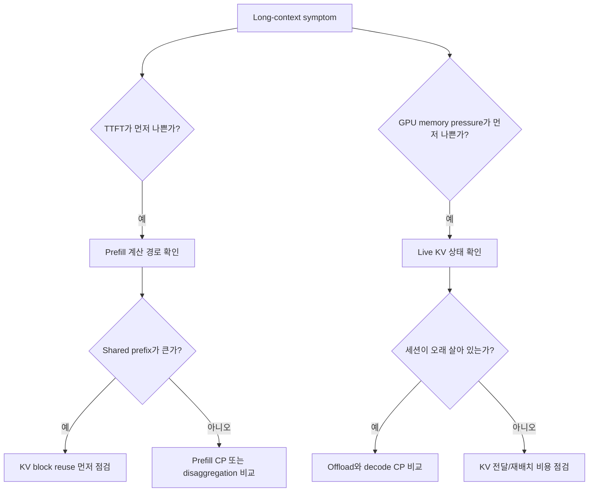
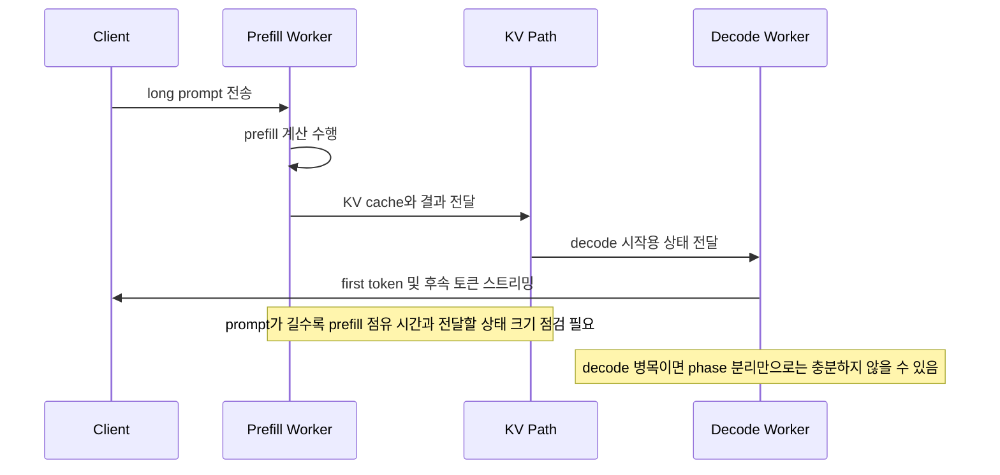

# Long Context and Memory Pressure

## 수업 개요
이 챕터는 긴 입력을 하나의 막연한 "메모리 문제"로 다루지 않습니다. 긴 context가 먼저 `prefill` 계산 자원을 오래 붙잡는지, 아니면 계산이 끝난 뒤 `KV cache`를 재사용하거나 다른 위치로 옮기는 경로에서 비용이 커지는지 분리해서 읽습니다. [S1][S2][S4][S5]

vLLM의 disaggregated prefill과 context parallel 문서는 긴 prompt를 처리할 때 prefill 자원 분리와 분산 계산을 어떻게 쓰는지 보여 줍니다. TensorRT-LLM의 disaggregated serving, KV cache reuse, KV cache system 문서는 긴 입력 뒤에 남는 KV 상태를 재사용하거나 host로 offload할 때 어떤 tradeoff가 생기는지 설명합니다. vLLM의 KV Cache Manager 문서는 block allocation과 common prefix block 관점이 왜 중요한지 드러냅니다. [S1][S2][S3][S4][S5][S6]

수업의 중심 질문은 하나입니다. "긴 입력이라서 느린가?"가 아니라 "지금 병목이 prefill 계산인지, KV block 재사용인지, KV 전달 경로인지"를 어떻게 구별할 것인가입니다. [S1][S2][S3][S4][S5][S6]

## 학습 목표
- 긴 context 문제를 `prefill 병목`과 `KV 이동/상주 병목`으로 나눠 설명할 수 있다. [S1][S2][S4][S5]
- block 단위 KV 재사용과 common prefix block 개념이 왜 긴 입력에서 특히 가치가 커지는지 설명할 수 있다. [S3][S4][S6]
- host offload, context parallel, disaggregated serving이 각각 어떤 병목에 먼저 대응하는지 구분할 수 있다. [S1][S2][S4][S5]
- 긴 문서 QA, 긴 대화 세션, prefix가 거의 겹치지 않는 요약 서비스의 디버깅 순서를 다르게 잡을 수 있다. [S1][S2][S3][S4][S5][S6]

## 수업 전에 생각할 질문
- 64K 입력을 받는 두 서비스가 있어도, 하나는 TTFT가 문제이고 다른 하나는 GPU memory pressure가 문제일 수 있는 이유는 무엇일까? [S1][S2][S4][S5]
- shared prefix가 긴 서비스라면 더 큰 GPU를 사기 전에 무엇부터 확인해야 할까? [S3][S4][S6]
- prefill을 분리하는 설계와 KV를 host로 내리는 설계는 둘 다 "메모리를 줄인다"처럼 들리는데, 실제로는 무엇이 다른가? [S1][S2][S4]
- decode context parallel은 언제 유력하고, 언제 본질을 비껴갈 수 있을까? [S5]

## 강의 스크립트
### 장면 1. 긴 context를 보면 먼저 문제를 둘로 가른다
**교수자:** 긴 context를 다루는 팀이 가장 자주 하는 실수는 증상을 한 줄로 줄여 적는 겁니다. "긴 prompt에서 느림"이라고만 써 두면 다음 액션이 늘 흔들립니다. [S1][S2][S4][S5]

**학습자:** 그럼 첫 질문은 "토큰이 몇 개인가"가 아니라 다른 것이어야 하나요?

**교수자:** 맞습니다. 먼저 `prefill이 오래 걸리는가`, 그리고 `prefill이 끝난 뒤 KV 상태를 보관하거나 옮기는 비용이 큰가`를 분리합니다. vLLM은 prefill/decode 분리와 context parallel을 서로 다른 문서에서 설명하고, TensorRT-LLM은 disaggregated serving과 KV cache system을 따로 설명합니다. 이 분리 자체가 진단의 출발점입니다. [S1][S2][S4][S5]

**학습자:** 결국 긴 입력 하나에도 계산 구간과 상태 이동 구간이 따로 있다는 뜻이군요.

**교수자:** 그렇습니다. 예를 들어 짧게 답하고 끝나는 문서 QA는 긴 prompt가 prefill 자원을 오래 점유하는 문제가 먼저 보이기 쉽습니다. 반대로 multi-turn 상담처럼 세션이 오래 살아 있으면 decode 동안 유지되는 KV 상태가 GPU를 잠그는 문제가 먼저 보일 수 있습니다. [S1][S2][S4][S5]

### 장면 2. prefill이 길어지면 TTFT 식의 앞부분이 커진다
**교수자:** 긴 prompt에서 첫 번째로 커지는 항은 대개 prefill 계산입니다. vLLM의 context parallel 문서가 긴 prompt의 prefill 분산을 따로 다루는 것도 그 이유입니다. [S5]

**학습자:** 그럼 TTFT를 볼 때 decode 이전 단계와 이후 단계를 나눠 적는 편이 좋겠네요.

**교수자:** 네. 강의용으로 아주 단순하게 적으면 TTFT는 이렇게 볼 수 있습니다. disaggregated serving을 넣더라도 prefill이 사라지는 게 아니라, 그 뒤에 handoff 구간이 추가됩니다. [S1][S2][S5]

$$
\mathrm{TTFT} \approx t_{\mathrm{queue}} + t_{\mathrm{prefill}}(T_{\mathrm{prompt}}) + t_{\mathrm{handoff/start}}
$$

- `t_queue`: 스케줄러 대기 시간
- `t_prefill(T_prompt)`: prompt 길이에 따라 커지는 prefill 계산 시간
- `t_handoff/start`: decode 시작 전 KV 전달 또는 준비 시간

**교수자:** 여기서 핵심은 `긴 context = 곧바로 disaggregation`이 아니라는 점입니다. prompt 계산 자체가 길어졌다면 prefill context parallel이 더 직접적일 수 있고, prefill과 decode가 같은 pool에서 간섭한다면 disaggregated serving이 후보가 됩니다. [S1][S2][S5]

**학습자:** 둘 다 TTFT 개선처럼 보이지만, 줄이는 항이 다르군요.

**교수자:** 정확합니다. 이 구분 없이 설계를 고르면, 병목은 prefill compute인데 handoff 경로만 늘리는 상황이 생깁니다. [S1][S2][S5]

### 장면 3. prefix가 길게 겹치면 KV block 재사용이 먼저 나온다
**교수자:** 이제 shared prefix가 큰 서비스로 가 봅시다. TensorRT-LLM은 shared prompt prefix에서 KV cache reuse를 설명하고, KV cache system 문서는 이를 fixed-size block 기반으로 설명합니다. vLLM의 KV Cache Manager도 computed blocks와 common prefix blocks를 노출합니다. [S3][S4][S6]

**학습자:** 그러면 질문이 "문장이 완전히 같은가"보다 "같은 block 경계까지 prefix가 남는가"에 가까워지겠네요.

**교수자:** 그렇습니다. 긴 정책 문서를 머리말로 붙이는 사내 QA를 떠올려 보세요. 사용자가 바꾸는 건 마지막 질문 몇 줄뿐인데, 머리말과 규정 본문이 매번 길게 반복됩니다. 이런 서비스는 긴 context라는 사실보다 `반복되는 앞부분을 block 단위로 다시 쓸 수 있는가`가 더 중요한 문제입니다. [S3][S4][S6]

**학습자:** 그럼 prefix hit가 높은데도 비용이 크면, 재사용률과 block 관리가 제대로 되는지부터 봐야겠군요.

**교수자:** 맞습니다. TensorRT-LLM 문서도 reuse 가능한 시점을 설명하므로, "prefix가 같으니 곧바로 이득"이라고 단정하면 안 됩니다. 긴 입력에서는 이 재사용 여부가 prefill 부담을 크게 바꿉니다. [S3]

### 장면 4. 메모리 압박은 live KV가 어디에 머무는지로 본다
**학습자:** 그런데 prefix가 잘 재사용돼도 GPU 메모리가 모자라면 결국 막히지 않나요?

**교수자:** 그래서 KV의 "존재"와 "위치"를 따로 봐야 합니다. TensorRT-LLM의 KV cache system은 block을 host memory로 offload하고 필요할 때 다시 가져오는 흐름을 설명합니다. 이때 핵심은 삭제보다 residence 변경입니다. [S4]

**교수자:** 강의용으로 쓰면 GPU에 실제로 눌러앉아 있는 live KV는 아래처럼 생각할 수 있습니다. [S4][S5]

$$
M_{\mathrm{GPU,live}} \approx \sum_i T_i \cdot b_{\mathrm{KV/token},i} \cdot r_i^{(\mathrm{GPU})}
$$

- `T_i`: 요청 `i`가 현재 유지 중인 context 길이
- `b_KV/token,i`: 토큰 1개당 필요한 KV 바이트의 강의용 묶음 표현
- `r_i^(GPU)`: 그 요청의 KV 중 GPU에 상주하는 비율

**교수자:** `r_i^(GPU)`를 줄이면 GPU pressure는 낮아지지만, host에서 다시 가져오는 복사 비용이나 shard 간 통신 비용이 생깁니다. 그래서 offload와 context parallel은 둘 다 메모리 압박을 다루지만 같은 해법이 아닙니다. [S4][S5]

**학습자:** offload는 위치를 바꾸고, context parallel은 들고 있는 방식 자체를 바꾸는 느낌이네요.

**교수자:** 그렇게 이해하면 좋습니다. 특히 decode context parallel은 vLLM 문서가 말하듯 context dimension을 나눠 KV duplication을 줄이는 쪽에 가깝습니다. 긴 세션이 많은 서비스에서 이 차이가 크게 드러납니다. [S5]

### 장면 5. disaggregated serving은 "언제" 꺼내는 카드인지가 중요하다
**교수자:** 이제 disaggregated serving을 보죠. TensorRT-LLM은 context phase와 generation phase를 다른 자원으로 분리할 수 있다고 설명하고, vLLM은 prefill instance와 decode instance 사이에 KV cache를 전달하는 구조를 설명합니다. [S1][S2]

**학습자:** 분리하면 깔끔해 보이는데, 왜 항상 정답은 아닌가요?

**교수자:** 분리의 대가가 있기 때문입니다. 긴 prompt를 prefill에서 계산한 뒤, decode 쪽으로 KV를 넘기는 경로가 생깁니다. 문서들이 공통으로 보여 주는 tradeoff는 `자원 분리` 대 `KV 전달 비용`입니다. [S1][S2]

**교수자:** 따라서 장문 요약 서비스처럼 prefix hit가 약하고 prompt 계산이 무거운 경우에는 prefill context parallel이 더 직접적일 수 있습니다. 반대로 prefill/decode 혼재 때문에 자원 간섭이 심하면 disaggregation이 더 설득력 있습니다. [S1][S2][S5]

### 장면 6. 디버깅 순서는 서비스 성격에 따라 달라진다
**학습자:** 결국 운영에서는 무엇부터 확인해야 하나요?

**교수자:** 순서를 고정하지 말고 서비스 성격에 따라 묻는 질문을 바꿉니다.

**교수자:** 첫째, `반복 prefix가 큰 내부 문서 QA`라면 block reuse부터 봅니다. 이 경우 긴 context 문제의 절반은 같은 앞부분을 매번 다시 읽는 데서 오기 때문입니다. [S3][S4][S6]

**교수자:** 둘째, `긴 상담 세션이 오래 이어지는 고객지원 챗봇`이라면 decode 동안 살아 있는 KV가 먼저 보입니다. 이때는 offload와 decode context parallel이 우선 비교 대상입니다. [S4][S5]

**교수자:** 셋째, `prefix 재사용이 거의 없는 장문 요약 배치`라면 prompt 계산과 prefill 자원 간섭을 먼저 봅니다. 여기서 disaggregation을 바로 넣기보다, prefill compute가 실제 병목인지 확인해야 합니다. [S1][S2][S5]

**학습자:** 같은 64K 서비스라도 질문 순서가 달라지는 이유가 이제 보입니다.

## 자주 헷갈리는 포인트
- long context 문제를 무조건 "GPU 메모리가 부족하다"로 요약하면 prefill 병목과 KV 전달 병목이 섞여 버린다. [S1][S2][S4][S5]
- shared prefix hit가 높을 때 핵심은 전체 문자열 동일성보다 block 단위 공통 prefix를 얼마나 잡아내는가이다. [S3][S4][S6]
- host offload는 reuse를 포기하는 기능이 아니라, reusable KV의 상주 위치를 바꾸는 기능이다. [S4]
- decode context parallel은 prefill 가속 기술의 다른 이름이 아니다. 긴 decode 세션의 KV duplication과 수용량 문제를 다루는 쪽에 가깝다. [S5]
- disaggregated serving은 구조 분리라는 장점이 있지만 KV handoff 비용을 함께 만든다. 긴 prompt라고 해서 자동으로 유리해지는 것은 아니다. [S1][S2]

## 사례로 다시 보기
### 사례 1. 사내 규정 QA
규정 머리말과 부서 공통 지침이 매 요청마다 길게 반복된다면, 병목 후보는 먼저 shared prefix와 KV block reuse다. prefix가 길게 겹치는데도 TTFT가 높다면 common prefix block 추적과 reuse 가능 시점을 먼저 확인해야 한다. GPU pool이 자주 차면 그다음이 host offload다. [S3][S4][S6]

### 사례 2. 고객지원 장기 세션
한 세션이 길고 답변도 길게 이어지면 decode 동안 유지되는 live KV가 메모리를 압박할 수 있다. 이 경우 "prefill을 다른 서버로 빼자"보다 "GPU에 계속 둬야 하는 KV 비율이 얼마인가"를 먼저 묻는다. offload는 residence를 낮추고, decode context parallel은 duplication을 낮춘다. [S4][S5]

### 사례 3. 장문 요약 배치
매 요청의 원문이 다르고 공통 prefix가 거의 없다면 reuse 이득이 작다. TTFT가 높을 때는 prompt 계산량과 prefill/decode pool 간섭을 따로 봐야 한다. prompt 계산 자체가 문제면 prefill context parallel이 직접적이고, 동일 pool 혼잡이 문제면 disaggregation이 후보가 된다. [S1][S2][S5]

## 핵심 정리
- 긴 context 진단의 첫 분기는 `prefill 계산` 대 `KV 상태 경로`다. [S1][S2][S4][S5]
- 반복 prefix가 길면 block 기반 KV reuse가 먼저 의미를 가진다. [S3][S4][S6]
- 메모리 압박은 "KV가 있는가"보다 "KV가 어디에 머무는가"를 물어야 풀린다. [S4]
- decode context parallel은 긴 decode 세션의 KV duplication 문제에, disaggregated serving은 prefill/decode 자원 분리 문제에 더 직접적이다. [S1][S2][S5]
- 같은 long-context 서비스라도 문서 QA, 상담 세션, 장문 요약은 서로 다른 디버깅 순서를 가져야 한다. [S1][S2][S3][S4][S5][S6]

## 복습 체크리스트
- TTFT가 나쁘다는 사실만으로 disaggregated serving을 곧바로 선택하지 않는 이유를 설명할 수 있는가? [S1][S2][S5]
- shared prefix가 긴 서비스에서 왜 block reuse를 먼저 확인해야 하는지 설명할 수 있는가? [S3][S4][S6]
- host offload와 decode context parallel이 각각 무엇을 줄이는지 구분할 수 있는가? [S4][S5]
- 긴 대화 세션과 장문 문서 QA의 병목 질문이 왜 다른지 말할 수 있는가? [S3][S4][S5]
- `prefill compute`, `live KV residence`, `KV handoff path` 세 항목으로 현재 서비스를 점검할 수 있는가? [S1][S2][S4][S5]

## 대안과 비교
| 선택지 | 먼저 확인할 조건 | 주로 줄이는 것 | 새로 생기는 비용/제약 |
| --- | --- | --- | --- |
| KV block reuse | shared prefix가 길고 block 단위 공통 prefix가 잘 잡히는가? [S3][S4][S6] | 같은 앞부분의 prefill 재계산 [S3][S4] | reuse 가능 시점과 block 관리 품질에 성능이 좌우됨 [S3][S6] |
| Host offload | GPU에 live KV를 계속 둘 수 없는가? [S4] | GPU resident KV 비율 [S4] | host-GPU 복사 비용, 재접근 시 지연 [S4] |
| Prefill context parallel | prompt 계산 자체가 길어지는가? [S5] | 긴 입력 prefill 시간 [S5] | worker 간 조율과 분산 실행 복잡도 [S5] |
| Disaggregated serving | prefill과 decode가 같은 자원 풀에서 간섭하는가? [S1][S2] | phase 간 자원 충돌 [S1][S2] | KV handoff 경로와 전달 오버헤드 [S1][S2] |
| Decode context parallel | 긴 세션의 decode KV duplication이 문제인가? [S5] | decode 수용량 압박과 duplication [S5] | 통신/조율 비용, 배포 복잡도 [S5] |

## 참고 이미지

- [I1] 제목: Transformer model architecture
- 출처: Wikimedia Commons, `img-01.png`
- 이 챕터에서 보는 포인트: 긴 prompt가 attention 경로 전체를 통과하며 prefill 자원을 오래 점유한다는 감각을 잡는 데 쓴다. 본문에서 prefill 계산이 먼저 병목이 되는 사례를 설명할 때 연결된다.

- [I2] 제목: Roofline model
- 출처: Wikimedia Commons, `img-02.png`
- 이 챕터에서 보는 포인트: 계산량만이 아니라 메모리 이동과 대역폭 경계가 성능을 제한한다는 시각을 제공한다. 본문에서 KV handoff, host offload, decode-side KV movement를 비교할 때 연결된다.

## 출처
| 번호 | 제목 | 발행 주체 | 날짜 | URL | 사용 이유 |
| --- | --- | --- | --- | --- | --- |
| [S1] | Disaggregated Prefill V1 | vLLM project | 2026-03-08 (accessed) | https://docs.vllm.ai/en/latest/features/disagg_prefill.html | prefill instance와 decode instance 분리, KV 전달 경로 설명 |
| [S2] | Disaggregated Serving | NVIDIA TensorRT-LLM | 2026-03-08 (accessed) | https://nvidia.github.io/TensorRT-LLM/1.2.0rc6/features/disagg-serving.html | phase 분리와 KV transfer overhead 비교 |
| [S3] | KV Cache Reuse | NVIDIA TensorRT-LLM | 2026-03-08 (accessed) | https://nvidia.github.io/TensorRT-LLM/advanced/kv-cache-reuse.html | shared prompt prefix 기반 KV 재사용 설명 |
| [S4] | KV Cache System | NVIDIA TensorRT-LLM | 2026-03-08 (accessed) | https://nvidia.github.io/TensorRT-LLM/features/kvcache.html | block 기반 KV 관리, host offload, memory 경계 설명 |
| [S5] | Context Parallel Deployment | vLLM project | 2026-03-08 (accessed) | https://docs.vllm.ai/en/latest/serving/context_parallel_deployment.html | prefill context parallel과 decode context parallel 비교 |
| [S6] | KV Cache Manager | vLLM project | 2026-03-08 (accessed) | https://docs.vllm.ai/en/latest/api/vllm/v1/core/kv_cache_manager.html | computed/common prefix blocks와 allocation semantics 설명 |
