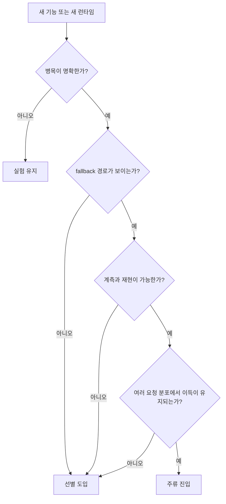
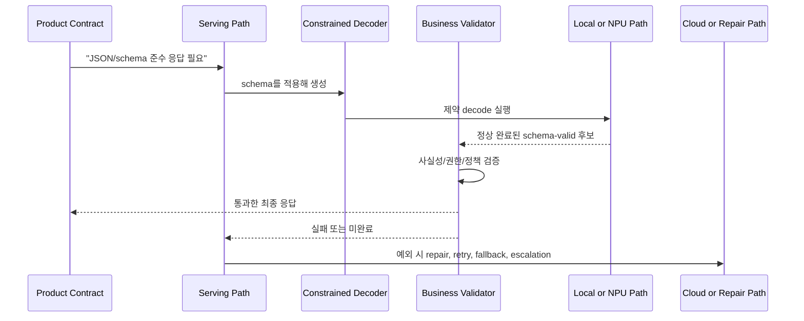

# 2026 Trend Watch

## 수업 개요
이 챕터는 2026년 7월 14일 기준 공식 문서, 벤더 기술 블로그, 공개 프로젝트 자료를 바탕으로, 무엇이 반복 가능한 운영 패턴이 되었고 무엇이 아직 실험 신호에 머무는지 가르는 수업이다. 3월 버전의 중심축은 cloud 쪽의 `prefill/decode 분리` [S1], decode 가속 카드인 `speculative decoding` [S2], 그리고 on-device 쪽의 `provider 기반 NPU offload`와 `hybrid execution` [S3][S4][S5][S6]이었다. 2026년 상반기 보강 이후에는 여기에 `KV transfer/NIXL`, `rack-scale topology`, `wide expert parallel`, `topology-aware scheduling`, `facility-aware throughput`을 추가한다 [S7][S8][S9][S10][S11][S12]. `structured outputs`는 여전히 별도 하드웨어 기술로 분류하지 않는다. 다만 vLLM은 JSON Schema·grammar 기반 structured outputs와 schema-constrained tool calling을 serving 기능으로 제공한다 [S13][S14]. 따라서 이것은 제품 계약이면서도 decode 제약, 스키마 컴파일, 업무 규칙 검증의 비용을 수반하는 serving 요구다.

## 학습 목표
- 2026년 기술을 `채택 신호`, `실험 신호`, `비분류 요구 신호`로 구분할 수 있다.
- disaggregated serving, speculative decoding, provider 기반 NPU offload, hybrid execution을 같은 판단 축으로 설명할 수 있다.
- 2026년 상반기에 새로 강해진 `KV transfer`, `NIXL/RDMA`, `rack-scale topology`, `wide expert parallel`, `power/cooling headroom` 키워드를 serving 관점으로 설명할 수 있다.
- `structured outputs`를 인프라 기술이 아니라 제품 요구 신호로 봐야 하는 이유와, 현재 소스 범위에서는 왜 `비분류`로 두는지 설명할 수 있다.
- Dynamo 같은 control plane에서 backend별 feature matrix를 확인하고, routing·planning 기능을 지원 여부와 운영 성숙도로 구분할 수 있다.
- cloud 서비스와 AI PC 앱 사례에서 latency budget, validation path, fallback 정책을 연결해 의사결정을 정리할 수 있다.

## 수업 전에 생각할 질문
- "새 기능이 문서에 있다"와 "내 팀이 운영할 수 있다" 사이에는 어떤 간격이 있는가?
- JSON이나 schema를 반드시 맞춰야 하는 제품이라면, 응답 생성 외에 어떤 시간이 더 든다고 봐야 하는가?
- on-device 데모가 성공했더라도, 어떤 신호가 보여야 그것을 2026년의 `주류 채택 후보`로 인정할 수 있을까?

## 강의 스크립트
### Part 1. 2026년 트렌드는 이름보다 채택 신호로 읽어야 한다
**교수자:** 이 챕터는 기술 유행 정리를 하는 시간이 아닙니다. 더 정확히 말하면, `유행어를 채택 신호로 번역하는 시간`입니다. 2026년에 중요한 건 "새 기능이 나왔다"가 아니라 "반복 가능한 운영 절차가 생겼는가"예요.

**학습자:** 기능 이름만 보면 다 좋아 보입니다. 어떤 신호가 있어야 `주류`, 어떤 신호가 부족하면 `실험`으로 남겨야 합니까?

**교수자:** 수업에서는 네 가지를 봅니다. `반복 가능성`, `관측 가능성`, `workload 적합성`, `fallback 비용`입니다. 이름이 화려해도 이 네 줄이 비면 아직 과감히 `실험`이라고 적는 편이 낫습니다.

#### 핵심 수식 1. 채택 신뢰도
$$
C_{\mathrm{adopt}}=
\frac{R_{\mathrm{repeat}} \times O_{\mathrm{observe}} \times W_{\mathrm{fit}}}
{F_{\mathrm{fallback}} + I_{\mathrm{integration}}}
$$

- $R_{\mathrm{repeat}}$: 여러 요청과 여러 배포 환경에서 같은 이득이 재현되는가
- $O_{\mathrm{observe}}$: 병목, fallback, routing 결과를 실제로 계측할 수 있는가
- $W_{\mathrm{fit}}$: 기능이 내 workload의 병목과 직접 맞닿아 있는가
- $F_{\mathrm{fallback}}$: 미지원 연산, 검증 실패, device miss 때문에 우회 경로가 생길 위험
- $I_{\mathrm{integration}}$: 배포, 검증, 운영 복잡도를 새로 떠안아야 하는 정도

**교수자:** 예를 들어 vLLM의 disaggregated prefill은 긴 prompt workload에서 어떤 병목을 겨냥하는지 분명합니다 [S1]. TensorRT-LLM의 speculative decoding도 decode 병목을 줄인다는 목적이 명확하죠 [S2]. on-device 쪽 문서 묶음은 provider, runtime, workflow, NPU target을 따로 노출하면서 fallback과 실행 경계를 관리해야 한다는 사실을 드러냅니다 [S3][S4][S5][S6]. 문서 존재 자체보다, `어디를 재고 어디서 실패할지`가 보인다는 점이 중요합니다.

#### 시각 자료 1. 2026 채택 신호 판별기

**학습자:** 그러면 이 장에서 볼 것은 기술 목록이 아니라, 운영팀이 실제로 재현하고 관측할 수 있는 조건이겠네요.

**교수자:** 맞습니다. 이 챕터는 기술 이름 암기가 아니라, 채택 신호와 실험 신호를 읽는 훈련입니다.

### Part 2. Structured Outputs는 인프라 기술이 아니라 제품 요구 신호다
**학습자:** 그런데 chapter-context에는 `structured outputs`도 주요 흐름으로 들어가 있습니다. 왜 여기서는 주류나 선별 도입으로 바로 분류하지 않나요?

**교수자:** 이유는 두 층이 다르기 때문입니다. structured outputs의 출발점은 자유 텍스트보다 JSON, schema, tool argument처럼 `검증 가능한 결과`를 요구하는 제품 계약입니다. 이를 충족하는 serving 엔진은 schema를 제약 디코딩에 적용한다 [S13][S14]. 하지만 이것은 GPU·NPU·네트워크처럼 독립된 하드웨어 maturity 항목은 아닙니다. 그래서 이 챕터에서는 `제품 요구 신호`로 다루고, 별도 인프라 기술의 maturity 판정은 `비분류`로 둡니다.

**학습자:** 비분류라고 해도 중요하지 않다는 뜻은 아니겠죠?

**교수자:** 오히려 반대입니다. 이 요구가 들어오면 serving 경로가 바뀝니다. schema-constrained decoding은 JSON·스키마 형식 오류 경로를 생성 중 차단하지만, 그 대가로 schema 컴파일·허용 토큰 계산이 들어갑니다. 또 정상 완료 여부와 사실성, DB 존재 여부, 필드 간 정책 같은 업무 규칙은 여전히 별도 검증해야 합니다. 형식 복구, 재시도, route 변경은 제약 디코딩이 실패·중단했거나 업무 규칙을 통과하지 못했을 때의 **예외 경로**입니다 [S13][S14].

#### 핵심 수식 2. 구조화 응답 시간
$$
T_{\mathrm{structured\_resp}} =
T_{\mathrm{prefill}} +
T_{\mathrm{compile/cache}} +
T_{\mathrm{decode}}^{\mathrm{constrained}} +
T_{\mathrm{completion\_check}} +
T_{\mathrm{business\_validate}} +
T_{\mathrm{exception}}
$$

- $T_{\mathrm{compile/cache}}$: schema/FSM 준비 비용. 캐시 적중 시 작아지고, 최초 요청에서는 눈에 띌 수 있다 [S14].
- $T_{\mathrm{decode}}^{\mathrm{constrained}}$: 허용 토큰 집합을 적용하는 decode 시간이다.
- $T_{\mathrm{completion\_check}}$: `finish_reason` 등 정상 완료 여부를 확인하는 시간이다.
- $T_{\mathrm{business\_validate}}$: 사실성, DB 존재 여부, 권한, 필드 간 정책을 검사하는 시간이다.
- $T_{\mathrm{exception}}$: max token 도달·취소·업무 규칙 실패 때만 드는 repair, retry, fallback, cloud escalation 비용이다.

**교수자:** structured outputs와 tool calling 문서는 schema-constrained decoding 및 모드별 제약 적용을 직접 설명한다 [S13][S14]. prefill/decode 분리 [S1], decode 가속 [S2], fallback과 offload 경계 [S3][S4][S5][S6]는 이 요구가 배치되는 시스템 환경을 설명한다. 따라서 더 정확한 수업용 결론은 이렇습니다. `structured outputs는 인프라 유행어가 아니라, 제약 decode와 업무 검증 경로를 설계하게 만드는 제품 요구다.`

#### 시각 자료 2. Structured Outputs가 경로를 늘리는 방식

**학습자:** 그러면 structured outputs가 들어오면 단순히 "JSON 잘 나오나?"만 볼 게 아니라, decode 제약 비용과 업무 검증, 예외 시 복구 경로까지 설계해야겠네요.

**교수자:** 정확합니다. 그래서 이것을 인프라 기술 목록에 넣기보다, 인프라 선택을 밀어붙이는 제품 요구 신호로 읽는 겁니다.

### Part 3. Cloud에서 2026년 주류에 가까운 것은 병목 분리가 보이는 기술이다
**교수자:** cloud 쪽에서 2026년 주류에 가장 가까운 신호는 `prefill과 decode를 다른 문제로 본다`는 점입니다. vLLM이 disaggregated prefill을 별도 기능으로 다루는 것은, 긴 문맥 서비스에서 prefill이 독립 병목으로 취급된다는 뜻입니다 [S1].

**학습자:** 어떤 상황에서 그게 진짜 채택 신호가 되나요?

**교수자:** 이런 체크가 가능할 때입니다.

| cloud 체크포인트 | 채택 신호 | 실험 신호 |
| --- | --- | --- |
| 요청 분포 | 긴 prompt, 짧은 응답이 반복적으로 관측된다 [S1] | 짧은 요청이 대부분인데 긴 문맥 서비스라고 막연히 가정한다 |
| 병목 위치 | TTFT와 prefill 비중이 실제로 크다 [S1] | decode 문제인지도 모른 채 구조만 복잡하게 만든다 |
| 운영 경계 | prefill/decode 분리 후 모니터링 포인트를 팀이 이해한다 | 구조만 분리하고 tail latency 원인을 추적하지 못한다 |

**교수자:** 반대로 speculative decoding은 강력하지만 `선별 도입`입니다. decode 병목이 크고, draft/verify 경로를 운영할 준비가 된 팀에선 분명 매력적입니다 [S2]. 하지만 acceptance가 낮거나 응답이 짧으면 기대 이득이 흐려집니다.

**학습자:** structured outputs가 붙은 서비스에서 prefill, decode, validation 중 무엇을 먼저 계측해야 합니까?

**교수자:** 먼저 응답 계약을 적습니다. 그다음에 `어떤 schema 제약을 decode 중 적용할지`, `업무 규칙 검증이 무엇인지`, `미완료·업무 규칙 실패 때만 repair를 로컬/ cloud 어디서 할지`를 봅니다. 긴 prompt와 짧은 구조화 응답 서비스라면, structured outputs가 있어도 먼저 prefill 병목을 해결해야 할 가능성이 큽니다 [S1]. 반대로 응답이 길거나 제약 decode 비용이 크면 decode 최적화와 예외 경로 설계가 같이 올라옵니다 [S2][S13].

**교수자:** 실패 사례 하나를 보죠. 계약서 심사 API가 모든 응답을 JSON Schema로 강제한다고 합시다. 팀이 speculative decoding을 먼저 붙였는데, 실제론 prompt가 길고 업무 규칙 검증에서 자주 재시도가 일어나 p95가 더 나빠졌습니다. 이건 기능이 틀린 게 아니라, 병목과 예외 경로를 반대로 읽은 겁니다.

### Part 4. On-Device는 "NPU 지원"보다 채택 신호 체크리스트가 중요하다
**학습자:** on-device 쪽은 01, 02 챕터에서도 비슷한 문서들이 나왔습니다. 이번 챕터는 무엇이 달라야 하나요?

**교수자:** 이번 챕터는 벤더 이름을 더 적는 대신, `2026년에 어떤 신호가 보여야 도입을 밀어도 되는가`를 봅니다. 제공된 공식 자료를 묶어 읽으면 최소한 세 가지는 분명합니다. provider나 runtime surface가 공식화돼 있고 [S3][S4], hybrid workflow가 문서 언어로 올라왔으며 [S5], NPU target이 독립 실행 대상으로 다뤄집니다 [S6]. 여기까지는 채택 신호예요. 하지만 그 다음 줄을 채워야 실제 제품이 됩니다.

| on-device 체크포인트 | 2026 채택 신호 | 아직 실험으로 남는 신호 |
| --- | --- | --- |
| 실행 surface | provider/runtime 경로가 공식 문서로 정리돼 있다 [S3][S4][S6] | 데모 스크립트만 있고 운영 surface가 불분명하다 |
| fallback 가시성 | 어떤 연산이 NPU에 남고 어디서 되돌아오는지 계측 가능하다 [S3][S6] | "NPU 사용"만 보이고 CPU/GPU fallback 비율을 모른다 |
| hybrid 정책 | local 처리와 cloud 보강의 경계가 workflow로 설명된다 [S5] | 실패 시 무조건 cloud로 던져 버려 privacy 경계가 흔들린다 |
| 제품 계약 | 제약 decode, 업무 검증, 예외 복구가 장치 경로와 충돌하지 않게 설계돼 있다 | structured outputs를 붙인 뒤 업무 검증과 예외 복구가 전부 CPU나 cloud로 새어 나간다 |
| 배포 현실성 | 지원 장치군과 운영체제 범위가 분명하다 [S4][S6] | 한 SKU 데모 성공을 범용 호환성으로 착각한다 |

**학습자:** 마지막 두 줄이 특히 03 챕터답네요. 이전 챕터보다 훨씬 제품 냄새가 납니다.

**교수자:** 바로 그 차이가 중요합니다. 2026년에 on-device가 성숙했다는 말은 `모든 것을 NPU에 올릴 수 있다`가 아닙니다. `실패를 어디서, 어떻게 흡수할지 설계 언어가 생겼다`는 뜻에 더 가깝습니다.

**교수자:** 실패 사례도 보겠습니다. 회의 요약 앱이 on-device 데모에서는 잘 돌아갔는데, 실제 배포 뒤에는 특정 모델에서 schema가 지원되지 않거나 응답이 max token에서 중단되고, 업무 규칙 검증도 자주 실패했다고 합시다. 앱은 예외 복구를 위해 cloud를 부르기 시작했고, 그 순간 privacy 약속과 latency 예산이 동시에 흔들렸습니다. 이건 NPU가 느려서가 아닙니다. structured outputs 요구를 제품 계약으로 설계하지 않고, 추론 경로 뒤에 덧붙였기 때문입니다.

### Part 5. 2026년 분류표를 명확히 적어 보자
**학습자:** 이제 표로 딱 정리해 주세요. 무엇이 주류 진입이고, 무엇이 선별 도입이고, 무엇이 비분류입니까?

**교수자:** 아래 표는 이번 수업의 최종 판정입니다. 구조화 출력 row는 의도적으로 `비분류`로 둡니다.

| 항목 | 상태 | 왜 그렇게 보나 | 먼저 확인할 운영 질문 |
| --- | --- | --- | --- |
| Disaggregated serving | 주류 진입 | prefill/decode 분리가 공식 기능 수준으로 다뤄지고, 긴 문맥 workload의 병목이 명확하다 [S1] | 우리 서비스의 TTFT와 prefill 비중이 정말 큰가? |
| Speculative decoding | 선별 도입 | decode 병목에서 강력하지만, draft/verify 경로와 acceptance 편차를 함께 감당해야 한다 [S2] | 응답 길이와 acceptance가 이 기능의 비용을 상쇄하는가? |
| Provider 기반 NPU offload | 주류 진입 | provider/runtime/NPU target이 공식 surface로 정리돼 있어 반복 가능한 진입 경로가 보인다 [S3][S4][S6] | 실제 operator coverage와 fallback 비율은 얼마인가? |
| Hybrid execution | 주류 진입 | workflow 차원에서 local 처리와 cloud 보강 경계가 문서 언어로 올라왔다 [S4][S5][S6] | cloud escalation 조건이 privacy 정책과 충돌하지 않는가? |
| Structured outputs | 비분류인 제품 요구 신호 | JSON Schema·grammar 제약은 serving 기능으로 직접 문서화되어 있다 [S13]. 다만 하드웨어 maturity는 별도 판정하지 않는다. 형식 오류는 constrained decoding으로 줄이고, 업무 규칙 검증과 미완료 시 예외 경로가 cloud/hybrid 선택 압력을 높인다고 본다. | schema 제약 비용·업무 규칙 검증·미완료 복구를 각각 어떻게 계측하는가? |
| 단일 경로의 범용 NPU 이식성 | 아직 실험 | 제공된 자료가 모두 runtime, provider, workflow, target별 경계를 전제로 한다 [S3][S4][S5][S6] | 장치군이 넓어졌을 때 검증 비용이 감당 가능한가? |

### Part 5-1. 2026년 상반기 보강: serving 키워드는 더 시스템 쪽으로 이동했다
**학습자:** 3월 기준 표에서 최신 자료를 더 보면 무엇이 바뀌나요?

**교수자:** 방향이 더 또렷해졌습니다. 2026년 상반기 키워드는 `더 빠른 서버 엔진`보다 `더 큰 시스템에서 상태를 어떻게 옮기고 배치할 것인가`에 가깝습니다. vLLM의 disaggregated prefilling 문서는 prefill/decode 사이 KV cache transfer를 connector 문제로 드러내고 [S7], NIXL은 point-to-point data transfer와 RDMA/GPU-Direct 계열 backend를 독립 레이어로 설명합니다 [S8]. NVIDIA Dynamo 1.0 자료는 disaggregated serving과 wide expert parallel을 GB200 NVL72 같은 rack-scale 환경에서 함께 언급합니다 [S9]. NVL72 하드웨어 문서는 72 GPU L1 domain과 NVLink switch tray를 구체적으로 드러내며 [S10], GB300 NVL72 페이지는 liquid cooling, attention 성능, per-MW throughput을 reasoning inference 맥락에 둡니다 [S11]. 마지막으로 topology-aware scheduling 자료는 rack-scale fabric을 flat GPU pool로 보면 안 된다는 운영 메시지를 줍니다 [S12].

| 2026 H1 키워드 | 상태 | 왜 중요한가 | 먼저 볼 운영 질문 |
| --- | --- | --- | --- |
| KV transfer / NIXL | 주류 진입 후보 | disaggregated serving이 KV cache 이동을 핵심 경로로 만들었다 [S7][S8] | prefill과 decode 사이 전송 p95를 계측하는가? |
| Rack-scale topology | 주류 진입 후보 | NVLink domain, rack partition, scheduler abstraction이 SLO와 직접 연결된다 [S10][S12] | GPU count가 아니라 fabric locality를 보고 배치하는가? |
| Wide expert parallel / MoE serving | 선별 도입 | MoE는 compute 절감과 all-to-all 통신 비용을 동시에 만든다 [S9] | expert routing이 rack boundary를 넘는가? |
| Facility-aware throughput | 주류 운영 지표 후보 | liquid cooling, per-MW throughput, power/cooling headroom이 serving capacity로 올라왔다 [S11] | TPS뿐 아니라 TPS/MW와 throttling 신호를 보는가? |
| Structured outputs / tool calling surface | 제품 요구 신호 | serving API 표면에서 JSON Schema·grammar 제약과 모드별 schema-constrained tool calling을 제공한다 [S13][S14]. 병목은 제약 decode, 업무 검증, 예외 복구로 나누어 관측해야 한다. | 제약 decode·업무 검증·미완료 복구 비용을 어떻게 재는가? |

**학습자:** 결론은 2026년 상반기에는 "LLM serving을 잘한다"가 점점 "상태 이동과 배치를 잘한다"로 바뀌는군요.

**교수자:** 바로 그겁니다. kernel, scheduler, network, rack, power가 한 문장 안에서 같이 움직이기 시작했습니다.

### Part 5-2. 2026년 7월 업데이트: serving control plane을 별도 층으로 보자
**학습자:** KV transfer와 topology-aware scheduling을 각각 도입하면 되는 것 아닌가요? 왜 control plane을 따로 봐야 하나요?

**교수자:** 엔진 하나만 운영할 때는 그럴 수 있다. 하지만 prefill worker, decode worker, KV cache, 여러 backend가 함께 움직이면 "어느 요청을 어느 worker에 보낼지"가 독립된 시스템 문제가 된다. NVIDIA Dynamo의 현재 feature matrix는 SGLang, TensorRT-LLM, vLLM을 대상으로 disaggregated serving, KV-aware routing, SLA-based planner, request migration 등의 지원 여부를 한 표에서 드러낸다 [S15].

| control-plane 기능 | 학습할 핵심 질문 | 주의할 점 |
| --- | --- | --- |
| KV-aware routing | 이미 계산한 prefix/KV가 있는 worker로 보낼 수 있는가? | cache hit만 보고 queueing·전송 p95를 놓치면 안 된다 |
| SLA-based planner | latency 목표와 부하를 함께 보고 배치하는가? | 평균 TPS가 좋아도 tail latency가 나빠질 수 있다 |
| request migration | 요청을 다른 worker로 옮길 수 있는가? | backend별 지원 상태와 KV 이동 비용이 다르다 |
| backend feature matrix | 같은 API가 모든 backend에서 같은 보장을 하는가? | 지원 표시를 성능·운영 성숙도의 동의어로 보면 안 된다 |

**교수자:** 여기서 중요한 것은 Dynamo를 무조건 채택하라는 뜻이 아니다. control plane이라는 학습 단위를 별도로 두자는 뜻이다. serving 엔진의 kernel 최적화와 routing 정책을 분리하면, "왜 cache hit인데도 p95가 높지?", "왜 같은 OpenAI 호환 API가 backend마다 다른가?" 같은 운영 질문을 더 정확히 다룰 수 있다 [S15].

### Part 6. 두 가지 사례로 최종 점검하자
**교수자:** 첫 번째 사례는 `규정 점검 API`입니다. 입력은 길고, 출력은 짧은 JSON Schema 객체입니다. 여기서 채택 신호는 prefill 병목, 제약 decode 비용, 업무 규칙 검증 실패를 분리해 계측하는지입니다. 실험 신호는 "JSON이 필요하니 decode 최적화부터"라고 단정하는 태도예요. 이런 서비스는 구조화 출력 요구가 강해도, 실제 시스템 병목은 여전히 prefill일 수 있습니다 [S1][S13].

**학습자:** 두 번째는요?

**교수자:** `AI PC 현장 점검 도우미`입니다. 기본 동작은 로컬 요약과 체크리스트 생성이고, 복잡한 복구 조언만 cloud에 올립니다. 여기서 채택 신호는 provider coverage 계측, fallback 로그, cloud escalation 규칙이 문서로 남아 있는지입니다 [S3][S4][S5][S6]. 실험 신호는 데모에서 한 기기만 성공했는데 범용 배포를 약속하는 겁니다. structured outputs 요구가 강할수록, local 제약 decode·업무 검증과 cloud 예외 복구의 경계를 먼저 그려야 합니다.

**학습자:** trend watch를 기능 목록으로 읽으면 놓치는 게 있겠네요. 제품 계약이 새로 만든 운영 비용을 같이 적어야 합니까?

**교수자:** 그 문장이 이 챕터의 결론입니다.

## 자주 헷갈리는 포인트
- `structured outputs`는 이번 챕터에서 인프라 기술로 분류하지 않는다. 현재 소스 범위에서는 제품 요구 신호로 읽는 것이 더 정확하다.
- `주류 진입`은 모두가 즉시 기본값으로 써야 한다는 뜻이 아니라, 실패 지점과 계측 포인트가 비교적 또렷하다는 뜻이다.
- speculative decoding은 최신 기술이지만, 최신이라는 이유만으로 도입 우선순위가 올라가지는 않는다. decode 병목과 acceptance가 맞아야 한다 [S2].
- on-device 문서가 많아졌다고 해서 범용 이식성이 확보됐다는 뜻은 아니다. 오히려 fallback과 coverage를 직접 보라는 신호에 가깝다 [S3][S4][S6].
- hybrid execution은 임시 우회로가 아니라, local/privacy 요구와 capability 요구를 동시에 맞추기 위한 제품 설계 패턴이다 [S5].

## 사례로 다시 보기
| 사례 | 채택 신호 | 실험 신호 | structured outputs가 미는 압력 |
| --- | --- | --- | --- |
| 규정 점검 API | prefill 병목, TTFT, 제약 decode 비용, 업무 규칙 실패율 추적 [S1][S13] | JSON 요구만 보고 decode 최적화부터 도입 | 업무 검증·미완료 복구까지 포함하면 latency budget이 더 빡빡해진다 |
| AI PC 현장 점검 도우미 | provider coverage, fallback 로그, cloud escalation 규칙 [S3][S4][S5][S6] | 한 기기 성공을 범용 배포로 확대 해석 | local 제약 decode·업무 검증과 cloud 예외 복구 경계를 먼저 정해야 한다 |
| 긴 답변형 코딩 보조 | decode 비중이 높고 acceptance 관리가 된다 [S2] | draft/verify 운영 비용을 무시 | schema 제약 구간과 자유 서술 구간의 이득을 분리해 검증해야 한다 [S13] |

## 핵심 정리
- 2026년 트렌드는 기술 이름보다 `채택 신호`와 `실험 신호`로 읽는 편이 안전하다.
- cloud에서는 disaggregated serving이 `주류 진입`, speculative decoding이 `선별 도입`에 가깝다 [S1][S2].
- on-device에서는 provider 기반 NPU offload와 hybrid execution이 `주류 진입`에 가깝지만, 여전히 coverage와 fallback 계측이 핵심이다 [S3][S4][S5][S6].
- 2026년 상반기 추가 신호는 serving이 rack-scale topology, KV transfer, NIXL/RDMA, expert parallel placement, power/cooling headroom을 함께 다루는 방향으로 이동했다는 점이다 [S7][S8][S9][S10][S11][S12].
- 2026년 7월에는 KV-aware routing, SLA-based planning, request migration처럼 여러 engine/backend 위에서 요청과 KV 상태를 조율하는 `control plane`을 별도 판단 층으로 보는 것이 유용하다 [S15].
- structured outputs는 이번 챕터에서 `비분류인 제품 요구 신호`다. serving 기능으로는 직접 문서화되어 있지만 [S13][S14], 하드웨어 maturity 판정은 유보한다. 대신 제약 decode, 업무 검증, 예외 복구 경로를 설계하게 만드는 압력으로 해석한다.
- 03 챕터의 실전 포인트는 벤더 목록이 아니라 `체크리스트`: 병목 계측, fallback 가시성, validator 경계, cloud escalation 조건이다.

## 복습 체크리스트
- 채택 신뢰도 식의 분자와 분모가 각각 무엇을 뜻하는지 설명할 수 있는가?
- structured outputs를 왜 인프라 기술이 아니라 제품 요구 신호로 두었는지 말할 수 있는가?
- 긴 prompt와 짧은 구조화 응답 서비스에서 왜 disaggregated serving이 먼저 검토될 수 있는지 설명할 수 있는가?
- on-device 데모가 성공했더라도 coverage와 fallback 로그가 없으면 왜 아직 실험이라고 보는지 설명할 수 있는가?
- hybrid execution에서 local validator와 cloud repair의 경계를 어떻게 정할지 말할 수 있는가?

## 대안과 비교
| 선택지 | 2026년에 밀어도 되는 신호 | 아직 보류해야 하는 신호 | 적합한 질문 |
| --- | --- | --- | --- |
| Disaggregated serving [S1] | 긴 prompt가 반복되고 TTFT 병목이 뚜렷하다 | 분리 후 관측 포인트를 팀이 설명하지 못한다 | "prefill이 진짜 문제인가?" |
| Speculative decoding [S2] | 긴 응답과 높은 decode 비중, acceptance 관리가 가능하다 | draft/verify가 tail latency를 악화시킨다 | "decode가 주 병목인가?" |
| Provider 기반 NPU offload [S3][S4][S6] | operator coverage와 fallback 비율을 계측한다 | NPU 사용 여부만 보고 성능을 추정한다 | "무엇이 NPU에 남고 무엇이 되돌아오는가?" |
| Hybrid execution [S4][S5][S6] | local/cloud 경계와 escalation 규칙이 문서화돼 있다 | 실패 시 무조건 cloud로 넘겨 privacy 약속이 흔들린다 | "어떤 단계만 cloud를 써야 하는가?" |
| Structured outputs 대응 | 제약 decode, 업무 검증, 미완료 예외 경로를 latency budget 안에 분리해 설계한다 | 제약 decode를 쓰면서도 형식 복구를 정상 경로로 둔다 | "schema 제약·업무 규칙·미완료를 각각 어떻게 처리할 것인가?" |
| Rack-scale serving 대응 [S7][S8][S10][S12] | KV transfer, topology locality, power/cooling headroom을 SLO 옆에 둔다 | GPU 수와 평균 utilization만 보고 배치한다 | "이 요청은 어떤 fabric 안에서 끝나는가?" |

## 출처
| 번호 | 제목 | 발행 주체 | 날짜 | URL | 사용 이유 |
| --- | --- | --- | --- | --- | --- |
| [S1] | Disaggregated Prefill V1 | vLLM project | 2026-03-08 (accessed) | [https://docs.vllm.ai/en/latest/features/disagg_prefill.html](https://docs.vllm.ai/en/latest/features/disagg_prefill.html) | prefill/decode 분리를 2026년 cloud 채택 신호로 설명하기 위해 사용 |
| [S2] | Speculative Decoding | NVIDIA TensorRT-LLM | 2026-03-08 (accessed) | [https://nvidia.github.io/TensorRT-LLM/1.2.0rc3/features/speculative-decoding.html](https://nvidia.github.io/TensorRT-LLM/1.2.0rc3/features/speculative-decoding.html) | speculative decoding을 선별 도입 카드로 분류하기 위해 사용 |
| [S3] | QNN Execution Provider | ONNX Runtime | 2026-03-08 (accessed) | [https://onnxruntime.ai/docs/execution-providers/QNN-ExecutionProvider.html](https://onnxruntime.ai/docs/execution-providers/QNN-ExecutionProvider.html) | provider 기반 NPU offload와 fallback 가시성 논의를 뒷받침하기 위해 사용 |
| [S4] | Windows ML overview | Microsoft Learn | 2026-03-08 (accessed) | [https://learn.microsoft.com/en-us/windows/ai/new-windows-ml/overview](https://learn.microsoft.com/en-us/windows/ai/new-windows-ml/overview) | on-device runtime surface와 배포 범위 논의를 설명하기 위해 사용 |
| [S5] | Hybrid On-Device GenAI workflow | AMD Ryzen AI docs | 2026-03-08 (accessed) | [https://ryzenai.docs.amd.com/en/1.6/hybrid_oga.html](https://ryzenai.docs.amd.com/en/1.6/hybrid_oga.html) | hybrid execution을 제품 설계 패턴으로 분류하기 위해 사용 |
| [S6] | NPU device | OpenVINO | 2026-03-08 (accessed) | [https://docs.openvino.ai/2025/openvino-workflow/running-inference/inference-devices-and-modes/npu-device.html](https://docs.openvino.ai/2025/openvino-workflow/running-inference/inference-devices-and-modes/npu-device.html) | NPU target과 fallback/coverage 판단 축을 설명하기 위해 사용 |
| [S7] | Disaggregated Prefilling (experimental) | vLLM project | 2026-06-16 (accessed) | [https://docs.vllm.ai/en/latest/features/disagg_prefill/](https://docs.vllm.ai/en/latest/features/disagg_prefill/) | prefill/decode 인스턴스와 KV cache transfer 구조를 최신 vLLM 문서 기준으로 보강 |
| [S8] | Enhancing Distributed Inference Performance with the NVIDIA Inference Transfer Library | NVIDIA Developer Blog | 2026-03-17 | [https://developer.nvidia.com/blog/enhancing-distributed-inference-performance-with-the-nvidia-inference-transfer-library/](https://developer.nvidia.com/blog/enhancing-distributed-inference-performance-with-the-nvidia-inference-transfer-library/) | NIXL, RDMA, point-to-point transfer를 2026 H1 키워드로 추가 |
| [S9] | How NVIDIA Dynamo 1.0 Powers Multi-Node Inference at Production Scale | NVIDIA Developer Blog | 2026-03-10 | [https://developer.nvidia.com/blog/nvidia-dynamo-1-production-ready/](https://developer.nvidia.com/blog/nvidia-dynamo-1-production-ready/) | disaggregated serving과 wide expert parallel의 production-scale 신호 |
| [S10] | System Hardware & Components: NVIDIA NVL72 AI Factory | NVIDIA Enterprise Reference Architecture | 2026-06-16 (accessed) | [https://docs.nvidia.com/enterprise-reference-architectures/nvl72-ai-factory/latest/components.html](https://docs.nvidia.com/enterprise-reference-architectures/nvl72-ai-factory/latest/components.html) | NVLink switch tray와 72 GPU L1 domain으로 rack-scale topology 보강 |
| [S11] | NVIDIA GB300 NVL72 | NVIDIA | 2026-06-16 (accessed) | [https://www.nvidia.com/en-us/data-center/gb300-nvl72/](https://www.nvidia.com/en-us/data-center/gb300-nvl72/) | liquid-cooled rack-scale architecture, reasoning inference, per-MW 성능 맥락 |
| [S12] | Running AI Workloads on Rack-Scale Supercomputers | NVIDIA Developer Blog | 2026-04-07 | [https://developer.nvidia.com/blog/running-ai-workloads-on-rack-scale-supercomputers-from-hardware-to-topology-aware-scheduling/](https://developer.nvidia.com/blog/running-ai-workloads-on-rack-scale-supercomputers-from-hardware-to-topology-aware-scheduling/) | topology-aware scheduling과 scheduler abstraction 보강 |
| [S13] | Structured Outputs | vLLM project | 2026-07-14 (accessed) | [https://docs.vllm.ai/en/stable/features/structured_outputs/](https://docs.vllm.ai/en/stable/features/structured_outputs/) | JSON Schema·grammar 기반 제약 디코딩과 structured-output backend를 설명 |
| [S14] | Tool Calling | vLLM project | 2026-07-14 (accessed) | [https://docs.vllm.ai/en/stable/features/tool_calling/](https://docs.vllm.ai/en/stable/features/tool_calling/) | named/required/strict 모드별 schema-constrained tool calling과 schema compile cache를 설명 |
| [S15] | Feature Matrix | NVIDIA Dynamo Documentation | 2026-07-14 (accessed) | [https://docs.dynamo.nvidia.com/dynamo/dev/resources/feature-matrix](https://docs.dynamo.nvidia.com/dynamo/dev/resources/feature-matrix) | SGLang, TensorRT-LLM, vLLM의 control-plane 기능 지원 차이와 backend별 운영 경계를 설명 |
