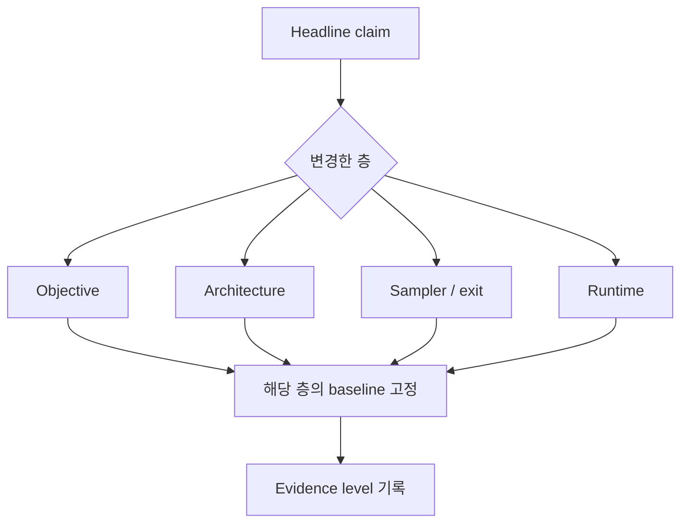
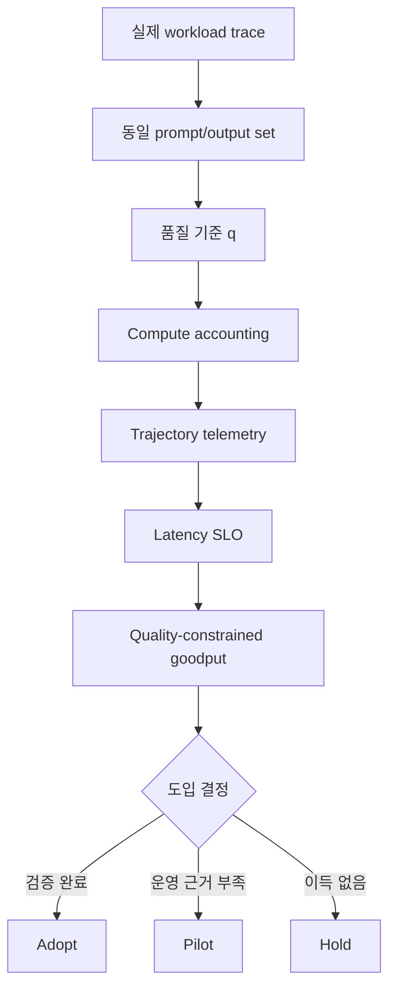

# 반복 생성 모델의 평가와 도입 판단

## 수업 개요
이 챕터는 Diffusion LLM과 recurrent-depth Transformer의 원리를 다시 설명하지 않는다. 모델 논문과 runtime 논문이 내놓은 서로 다른 주장을 같은 의사결정표에 올리는 방법을 다룬다. 핵심은 headline speedup이 아니라 **같은 품질 조건에서 실제 workload의 SLO를 얼마나 많이 만족시키는가**다.

반복 생성 모델은 최종 문자열만 비교해서는 실패 원인을 찾기 어렵다. Diffusion sampler는 token을 확정하거나 되돌리는 trajectory를 가지며 [S2][S3][S4], adaptive-depth model은 입력과 token마다 다른 loop trajectory를 가진다 [S5][S6]. 따라서 모델 품질, 계산량, trajectory, runtime utilization을 함께 기록해야 한다. 이 계측을 갖춘 뒤에야 연구 checkpoint, custom runtime, production engine 가운데 어느 수준까지 채택할지 판단할 수 있다.

## 학습 목표
- 논문의 주장을 objective, architecture, sampler/exit, runtime으로 분류할 수 있다.
- AR, diffusion, recurrent-depth 모델을 비교하는 공정한 benchmark matrix를 설계할 수 있다.
- Commitment, rollback, halting을 재현할 trajectory log schema를 정의할 수 있다.
- 품질, 계산량, latency SLO를 하나의 채택 기준으로 결합할 수 있다.
- 이론적 compute 절감과 실제 serving speedup을 구분할 수 있다.
- 연구 결과의 evidence level에 맞춰 도입·파일럿·보류 결정을 내릴 수 있다.

## 수업 전에 생각할 질문
- 8배 높은 tokens/s와 2점 낮은 정확도를 하나의 speedup으로 보고해도 되는가?
- Diffusion output이 한 번 노출된 뒤 rollback됐다면 TTFT는 어느 시점을 재야 하는가?
- 평균 loop 수가 절반으로 줄었지만 p99 latency가 늘었다면 adaptive depth는 성공인가?
- 공개 checkpoint와 논문 속 custom kernel 중 어느 쪽을 production 후보라고 불러야 하는가?

## 강의 스크립트

### Part 1. 비교하기 전에 주장 단위를 고정한다
**교수자:** 최신 논문 두 편이 모두 `효율 향상`을 말해도 같은 층을 개선했다고 볼 수 없습니다. 첫 단계는 결과를 다음 네 칸 중 하나에 놓는 일입니다.

| 주장 층 | 바뀐 것 | 공정한 비교 기준 | 단독으로 말할 수 없는 것 |
| --- | --- | --- | --- |
| Objective | corruption, likelihood, training target | 같은 scale과 training budget | online latency |
| Architecture | parameter sharing, state transition, depth | active parameter와 FLOPs | 좋은 exit policy |
| Sampler / exit | step, commitment, halting | 같은 checkpoint와 quality tolerance | 모델 자체의 우월성 |
| Runtime | cache, batching, scheduling | 같은 sampler, hardware, arrival trace | objective의 품질 |

Diffusion family의 likelihood와 제한된 sampling budget의 품질 순서가 다를 수 있다는 결과 [S1], commitment order에 따라 reasoning 결과가 달라진다는 결과 [S2][S3]는 이 분류가 필요한 이유를 보여 줍니다.

**학습자:** Architecture 논문에 end-to-end latency 표가 있으면 runtime 주장도 검증된 것 아닙니까?

**교수자:** 측정 조건에 runtime 근거가 생긴 것은 맞지만, 범용 serving 지원이 입증된 것은 아닙니다. Offline batch, 단일 GPU, 고정 output length에서 나온 수치를 online arrival와 p99 SLO로 옮기려면 별도 검증이 필요합니다.

### Part 2. 최종 output과 trajectory를 함께 저장한다
**교수자:** AR decoding은 확정된 prefix가 보통 바뀌지 않습니다. 반면 iterative generation에서는 중간 상태와 최종 상태가 다를 수 있습니다. 최종 문자열만 저장하면 commitment collapse, 불필요한 반복, rollback 폭증을 구분할 수 없습니다.

Diffusion request에는 최소한 다음 event가 필요합니다.

- step 번호와 남은 mutable position 수
- 새로 commit한 위치와 그 confidence
- rollback 또는 remask된 위치
- reasoning region과 answer region의 확정 순서
- quality target에 최초 도달한 step과 실제 종료 step
- 최초 노출 시각과 최종 안정화 시각

`Answer First, Reason Later`는 답이 근거보다 먼저 확정되는 trajectory가 최종 정확도만으로는 보이지 않음을 보여 줍니다 [S2]. `Where and When to Commit`은 위치 선택과 sequence 종료를 분리하므로 두 event를 별도 필드로 남겨야 합니다 [S3]. Archer처럼 rollback을 허용하는 runtime은 최초 token 노출과 stable final answer를 구분해야 합니다 [S4].

Recurrent-depth request에는 다음 항목을 더합니다.

- token 또는 request별 loop histogram
- 각 loop의 exit score와 실제 exit depth
- 중간 readout의 예측 변화
- 최대 depth 도달 비율
- 추가 loop 뒤 품질이 나빠진 overthinking 사례

Adaptive-depth 연구는 trajectory, gate, readout의 실패를 분리해야 한다고 지적하며 [S5], recurrence를 늘렸을 때 품질이 다시 떨어지는 구간도 보고돼 있습니다 [S6]. 평균 loop 수 하나만으로는 조기 종료 오류와 불필요한 반복을 동시에 볼 수 없습니다.

### Part 3. Compute accounting의 단위를 통일한다
**학습자:** 세 계열을 모두 tokens/s로 비교하면 충분하지 않습니까?

**교수자:** 같은 token이 서로 다른 수의 model evaluation을 거칩니다. Diffusion은 한 step에서 여러 위치를 갱신하고, recurrent-depth는 한 token을 위해 같은 block을 여러 번 실행합니다. 적어도 다음 수치를 함께 기록해야 합니다.

- 전체 network evaluation 수
- active token-pass 또는 실제 처리한 position 수
- denoising step histogram
- recurrent loop histogram
- cache refresh와 rollback으로 다시 수행한 계산
- measured device time과 utilization

Quality-constrained compute는 다음처럼 정의할 수 있습니다.

$$
C_q = \min_{\pi:\,Q(\pi)\ge q} C(\pi)
$$

$\pi$는 sampler, exit threshold, step/depth budget을 포함하는 정책입니다. 품질 $q$를 만족하는 정책끼리만 계산량을 비교해야 aggressive sampler가 품질을 버리고 얻은 속도를 이득으로 세지 않습니다.

### Part 4. 공정한 benchmark matrix를 만든다
**교수자:** 비교 목적마다 고정할 항목이 다릅니다. 하나의 거대한 TPS 표보다 다음 matrix가 낫습니다.

| 비교 목적 | 반드시 고정 | 함께 보고 | 금지할 해석 |
| --- | --- | --- | --- |
| 모델 품질 | 데이터 범위, training token, active parameter, compute budget | task score, likelihood, contamination 조건 | 서로 다른 데이터의 checkpoint 순위 |
| Sampler 효율 | checkpoint, prompt/output set, quality tolerance | evaluation 수, active token-pass, stable-final latency | 품질이 다른 tokens/s 순위 |
| Adaptive depth | exit quality target, 최대 depth | depth histogram, early-exit error, overthinking rate | 평균 loop 감소를 latency 감소로 간주 |
| Online serving | hardware, arrival trace, concurrency, SLO | TTFT, inter-event gap, p50/p95/p99, goodput | offline TPS를 production capacity로 간주 |
| Cache / rollback | output policy, refresh policy, memory limit | hit·refresh·rollback, approximation error | approximate cache를 exact cache로 표현 |

Diffusion streaming에는 일반 TPOT만으로 충분하지 않습니다. `time to first committed token`, `commit event 사이 간격`, `time to stable final answer`를 분리합니다. Recurrent-depth streaming은 token latency와 그 token에 쓴 depth를 함께 남겨야 tail이 모델 난이도 때문인지 scheduler 때문인지 분석할 수 있습니다.

### Part 5. 평균 compute 절감과 SLO 이득을 분리한다
**교수자:** Adaptive policy가 평균 반복을 줄여도 서로 다른 depth가 batch를 조각내면 장치 활용률이 떨어질 수 있습니다. Continuous Depth Batching은 loop 경계에서 slot을 다시 채워 이 간극을 줄이며, 저자들은 Ouro와 Huginn에서 이론적 speedup의 높은 비율을 회수했다고 보고했습니다 [S7]. 그러나 그 비율은 해당 exit trace와 scheduler 구현의 결과입니다.

$$
\mathrm{RealizedGain}
=\mathrm{TheoreticalComputeGain}
\times\mathrm{BatchingEfficiency}
\times\mathrm{SchedulerUtilization}
$$

**학습자:** 그러면 채택 지표는 평균 latency입니까?

**교수자:** 운영 결정에는 SLO를 만족한 요청의 처리량이 더 직접적입니다.

$$
G_q=\frac{\#\{r:Q_r\ge q,\ L_r\le L_{\mathrm{SLO}}\}}{\Delta t}
$$

$G_q$는 품질 기준과 latency SLO를 모두 만족한 goodput입니다. 평균 FLOPs가 줄어도 early-exit error나 p99가 늘면 $G_q$는 낮아질 수 있습니다. dLLM에서도 repeated prefill과 decode가 간섭하므로 offline sampler speed와 online goodput은 다를 수 있습니다 [S8].

### Part 6. 채택은 기능표가 아니라 evidence ladder로 결정한다
**교수자:** 모델과 runtime을 다음 단계로 나눠 기록하세요.

| Evidence level | 확인한 것 | 허용할 결정 |
| --- | --- | --- |
| 논문 주장 | 저자 조건의 표와 ablation | 조사 후보 등록 |
| 공개 checkpoint | 모델 loading과 output 재현 | 품질 baseline 구축 |
| 공개 연구 구현 | 지정 hardware에서 speed·quality 재현 | 제한된 파일럿 |
| 엔진 통합 | batching, cancellation, memory cleanup | staging traffic |
| 운영 검증 | 실제 trace에서 quality-constrained p99/goodput | production 채택 |

2026년의 scale 결과는 diffusion pretraining이 큰 규모에서도 가능하다는 근거를 강화했습니다 [S10][S11]. LoopMDM은 diffusion과 recurrent depth를 결합한 architecture가 가능함을 보여 줍니다 [S9]. 하지만 이 근거들은 각각 scale과 architecture에 관한 것입니다. Production 채택에는 cancellation, batching, memory pressure, tail latency를 포함한 별도의 evidence가 필요합니다.

**학습자:** 그래서 최종 판정은 어떻게 씁니까?

**교수자:** `지원/미지원` 대신 조건부 문장으로 씁니다.

- **도입:** 목표 품질과 p99를 만족하며 기존 baseline보다 $G_q$가 높고 운영 경로가 검증됐다.
- **파일럿:** 공개 구현에서 이득은 재현했지만 실제 arrival trace나 장애 경로 검증이 남았다.
- **연구 추적:** 모델 가능성은 확인됐지만 runtime 또는 checkpoint가 없다.
- **보류:** 같은 품질에서 비용 이득이 없거나 integration cost가 예상 절감보다 크다.

### Part 7. 실험 계약서를 먼저 쓴다
**교수자:** Benchmark 실행 전에 한 페이지짜리 계약서를 만드세요.

계약서에는 모델 revision, tokenizer, sampler와 exit 설정, hardware와 software version, arrival trace, warm-up, batch policy, 최대 memory, 품질 평가기, failure 처리까지 적습니다. 반복 생성 모델은 작은 정책 차이가 trajectory 전체를 바꾸므로 설정을 기록하지 않은 benchmark는 재현하기 어렵습니다.

## 자주 헷갈리는 포인트
- 최신 논문이라는 사실은 production evidence가 많다는 뜻이 아니다.
- 모델 scale-up, sampler speedup, runtime speedup은 서로 다른 주장이다.
- 최초 노출 latency와 최종 안정화 latency를 섞으면 rollback 비용이 사라진다.
- 평균 loop 수 감소는 batching efficiency가 유지될 때만 wall-clock 이득이 된다.
- 공개 engine에서 실행된다는 사실과 adaptive semantics가 보존된다는 사실은 다르다.

## 핵심 정리
- 먼저 주장을 objective, architecture, sampler/exit, runtime으로 분류한다.
- 최종 output과 함께 commit, rollback, loop, exit trajectory를 저장한다.
- 품질을 고정한 compute와 quality-constrained goodput으로 비교한다.
- Offline TPS가 아니라 실제 arrival trace의 p95/p99와 SLO를 사용한다.
- Evidence level에 따라 연구 추적, 파일럿, production 채택을 구분한다.

## 복습 체크리스트
- 논문의 headline을 네 주장 층 중 하나로 분류할 수 있는가?
- Diffusion과 recurrent-depth에 필요한 trajectory log를 각각 설계할 수 있는가?
- Quality-constrained compute와 goodput의 차이를 설명할 수 있는가?
- 공정한 online benchmark에서 고정해야 할 조건을 여섯 가지 이상 적을 수 있는가?
- Evidence level에 맞는 채택 결정을 조건부 문장으로 쓸 수 있는가?

## 출처
| 번호 | 제목 | 발행 주체 | 날짜 | URL | 사용 이유 |
| --- | --- | --- | --- | --- | --- |
| [S1] | Scaling Beyond Masked Diffusion Language Models | Sahoo et al. | 2026-02-16 | [https://arxiv.org/abs/2602.15014](https://arxiv.org/abs/2602.15014) | likelihood와 sampling Pareto의 차이 |
| [S2] | Answer First, Reason Later | Yeom et al. | 2026-08-06 | [https://arxiv.org/abs/2608.05687](https://arxiv.org/abs/2608.05687) | commitment trajectory와 reasoning collapse |
| [S3] | Where and When to Commit | Lee et al. | 2026-07-30 | [https://arxiv.org/abs/2607.28166](https://arxiv.org/abs/2607.28166) | 위치 commitment와 sequence 종료 분리 |
| [S4] | Archer: Adaptive Reuse of Cached Hidden States | He et al. | 2026-08-08, v2 2026-08-11 | [https://arxiv.org/abs/2608.08086](https://arxiv.org/abs/2608.08086) | rollback과 stable-final latency 평가 |
| [S5] | Adaptive Depth in Looped Transformers | Popescu et al. | 2026-07-08 | [https://arxiv.org/abs/2607.20519](https://arxiv.org/abs/2607.20519) | trajectory, gate, readout 실패 분리 |
| [S6] | Loop, Think, & Generalize | Kohli et al. | 2026-04-09, v2 2026-08-11 | [https://arxiv.org/abs/2604.07822](https://arxiv.org/abs/2604.07822) | depth generalization과 overthinking 평가 |
| [S7] | Depth-adaptive Inference of Looped Language Models via Continuous Depth Batching | Schwethelm et al. | 2026-08-10 | [https://arxiv.org/abs/2608.09444](https://arxiv.org/abs/2608.09444) | theoretical speedup과 realized serving gain 구분 |
| [S8] | Sangam: Efficiently Serving Diffusion LLMs with the AR Stack | Kedia et al. | 2026-07-05 | [https://arxiv.org/abs/2607.04206](https://arxiv.org/abs/2607.04206) | repeated prefill/decode의 online interference |
| [S9] | Looped Diffusion Language Models | Lee et al. | 2026-05-25 | [https://arxiv.org/abs/2605.26106](https://arxiv.org/abs/2605.26106) | 결합 architecture의 evidence level 판정 |
| [S10] | Improved Large Language Diffusion Models | Nie et al. | 2026-06-24 | [https://arxiv.org/abs/2606.25331](https://arxiv.org/abs/2606.25331) | iLLaDA scale evidence 판정 |
| [S11] | LLaDA MoE v2 | Zhu et al. | 2026-08-04 | [https://arxiv.org/abs/2608.03457](https://arxiv.org/abs/2608.03457) | sparse diffusion scale evidence 판정 |
