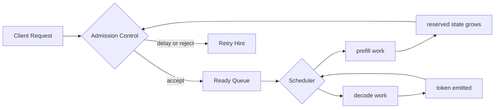
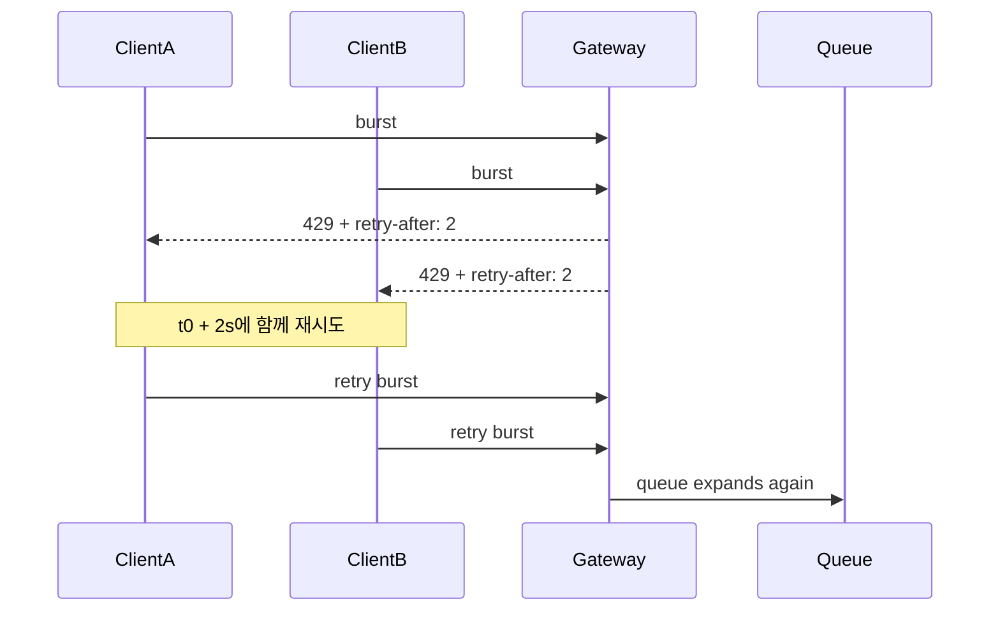

# Scheduling and Admission Control

## 수업 개요
이 챕터는 "모델이 얼마나 빠른가"보다 "지금 누구를 먼저 통과시킬 것인가"를 다룬다. LLM serving에서는 request scheduler가 순서를 정하고, admission control이 새 요청의 진입을 막거나 늦춘다. 둘은 분리된 기능처럼 보이지만, 실제 운영에서는 같은 queue와 같은 자원 예산을 공유하는 식으로 다뤄야 하는 경우가 많다. `실무적 추론` vLLM 문서는 현대 serving의 기준선을 continuous batching과 request scheduling 중심으로 둔다. [S1] TensorRT-LLM의 disaggregated serving 문서는 prefill과 decode를 분리해서 비교할 수 있는 구조를 보여 준다. [S2]

이 수업에서는 출처가 직접 주는 기준선과 운영 판단을 구분해서 읽는다. continuous batching과 scheduling의 기준선은 [S1], prefill/decode 분리 비교는 [S2]로 묶고, 공정성 큐, tenant deficit, aging, `retry-after` jitter 같은 구체 정책은 `실무적 추론` 또는 `운영 휴리스틱`으로 명시한다. 이렇게 분리해야 "문서가 직접 말한 사실"과 "운영자가 그 위에서 채택하는 정책"이 섞이지 않는다.

## 학습 목표
- scheduler와 admission control이 각각 무엇을 결정하는지 설명할 수 있다.
- request count보다 token backlog와 active decode 상태가 왜 더 중요한 진단 단위가 되는지 설명할 수 있다. `실무적 추론`
- 짧은 요청 위주 정책이 왜 tenant starvation을 만들 수 있는지 사례로 설명할 수 있다. `실무적 추론`
- 동일한 `retry-after` 값이 왜 synchronized retry를 부를 수 있는지 설명할 수 있다. `실무적 추론`
- prefill/decode 분리가 scheduler 논의를 다른 비교 축으로 옮긴다는 점을 설명할 수 있다. [S2]

## 수업 전에 생각할 질문
- 긴 문서 요약 요청 1개와 짧은 채팅 요청 20개가 동시에 들어오면, 평균 latency만 좋아지면 정책이 좋은 것일까?
- queue 길이가 길어졌을 때 먼저 의심해야 할 것은 scheduler일까, admission일까?
- 서버가 거절 응답에 `retry-after: 2`를 일괄로 넣으면 왜 다음 파형이 더 거세질 수 있을까?

## 강의 스크립트
### 장면 1. scheduler는 순번표가 아니라 제어면의 일부다
**학습자:** 스케줄링은 결국 큐에서 누구를 먼저 꺼낼지 정하는 문제 아닌가요?

**교수자:** LLM serving에서는 그 설명이 반만 맞습니다. vLLM 문서가 보여 주는 기준선은 "요청을 한 건씩 끝낼 때까지 붙잡는 방식"이 아니라 continuous batching과 request scheduling을 중심으로 GPU를 계속 채우는 방식입니다. [S1] 이 기준선 위에서 "누구를 먼저 꺼낼까"와 "지금 새 요청을 더 받을까"를 같은 루프로 읽는 해석은 `실무적 추론`입니다.

**학습자:** 왜 같은 루프가 되죠?

**교수자:** 새 요청을 하나 더 받는 순간, 앞으로 처리해야 할 prompt 토큰과 decode 토큰이 늘어나기 때문입니다. 그래서 scheduler는 단순 실행 순서기가 아니라 admission 판단에 필요한 미래 부담도 같이 보는 제어면이 됩니다. 이 연결 자체는 [S1]의 scheduling 기준선 위에서 읽을 수 있고, 토큰 예산 형태로 계산해 운영하는 방식은 `실무적 추론`입니다.

**교수자:** 그림에서 admission과 scheduler를 따로 그렸지만, 실제 판단은 서로 물고 돈다고 보는 편이 맞습니다. `실무적 추론`

### 장면 2. request count보다 backlog 단위를 먼저 바꿔야 한다
**학습자:** 그럼 혼잡이 보이면 queue length만 보면 되겠네요?

**교수자:** 그 수치만 보면 종종 오판합니다. LLM serving의 혼잡은 "몇 건이 쌓였나"보다 "몇 토큰 분량이 앞으로 남았나"와 "이미 active decode가 무엇을 붙잡고 있나"로 읽는 편이 더 실용적입니다. 이건 특정 문서의 단일 공식이 아니라, 운영자가 queue를 비용 단위로 환산해 보는 `실무적 추론`입니다.

#### 핵심 수식 1. backlog를 토큰 단위로 본다
$$
B_{\text{backlog}} =
\sum_{i \in \text{prefill queue}} t_i^{\text{prompt}}
+
\sum_{j \in \text{active decode}} t_j^{\text{reserved}}
$$

이 식은 "보이는 대기열"과 "이미 서비스 중이라도 남은 비용을 들고 있는 세션"을 한 숫자로 묶어 보려는 운영 모델이다. `실무적 추론`

**학습자:** 결국 요청 수가 같아도 비용은 다를 수 있다는 말이군요.

**교수자:** 맞습니다. prompt가 긴 요청 몇 개가 짧은 요청 수십 개보다 더 큰 부담일 수 있습니다. 그래서 admission을 request count로만 자르면 늦게 막고, scheduler만 손보면 해결될 문제처럼 착각하기 쉽습니다.

### 장면 3. 공정성은 이상론이 아니라 starvation 방지 장치다
**학습자:** 짧은 요청을 먼저 빼면 평균 latency는 좋아지잖아요. 그럼 그 정책이 합리적인 것 아닌가요?

**교수자:** 평균만 보면 그렇습니다. 하지만 어떤 tenant가 계속 뒤로 밀려 실제 진행률이 0에 가까워지면, 그건 공정성 문제가 아니라 운영 장애입니다. 여기서부터는 문서가 직접 정책 이름을 정해 주기보다, 운영자가 어떤 queue discipline을 둘지 선택하는 영역입니다. tenant deficit, aging, 공정성 큐는 `운영 휴리스틱`으로 보는 편이 정확합니다.

**교수자:** 예를 들어 짧은 채팅 요청과 긴 리포트 요청이 같은 클러스터에 들어온다고 합시다. 비용 우선 정책만 두면 채팅은 계속 처리되고 긴 리포트는 계속 밀립니다. 이 현상 자체는 `실무적 추론`이고, 이를 막기 위해 대기 시간이 긴 요청에 age boost를 주거나 tenant별 deficit을 관리하는 선택은 `운영 휴리스틱`입니다.

#### 핵심 수식 2. admission은 남은 예산 안에서만 연다
$$
\mathbf{Accept}(n) =
\mathbf{1}\left[
B_{\text{backlog}} + t_n^{\text{new}} + m_{\text{safety}}
\le B_{\text{cap}}
\right]
$$

여기서 $t_n^{\text{new}}$는 새 요청의 추정 비용, $m_{\text{safety}}$는 decode 보호 여유분이다. 이 식은 "몇 건 더 받을까"보다 "지금 무엇을 더 감당할 수 있나"를 묻는 admission의 운영 모델이다. `실무적 추론`

**학습자:** 그러면 공정성 큐는 scheduler 이야기고, 예산은 admission 이야기라고 딱 나눌 수는 없겠네요.

**교수자:** 그렇죠. 오래 기다린 요청을 앞으로 당기면 평균 효율은 조금 희생될 수 있고, 새 요청을 덜 받으면 queue는 짧아지지만 순간 처리량은 낮아질 수 있습니다. 이 tradeoff가 바로 이 챕터의 본체입니다.

### 장면 4. `retry-after`는 응답 헤더가 아니라 부하 파형이다
**학습자:** admission에서 거절만 잘해도 괜찮지 않나요?

**교수자:** 거절 시점만 보고 끝내면 안 됩니다. 같은 시각에 거절된 요청에 동일한 `retry-after`를 주면, 같은 시각에 다시 몰려옵니다. 이건 "거절은 했는데 왜 queue가 계속 흔들리지?"라는 전형적 실패 모양입니다. 동일한 값이 synchronized retry를 만들 수 있다는 해석은 `실무적 추론`입니다.

**교수자:** 그래서 jittered backoff를 쓰거나, tenant별로 다른 backoff를 주거나, 이미 오래 기다린 요청의 재입장 우선권을 일부 보존하는 정책이 자주 논의됩니다. 하지만 이 구체 정책들은 직접 출처가 규정한 사실이 아니라 `운영 휴리스틱`입니다.

### 장면 5. prefill/decode 분리는 만능 해법이 아니라 비교 축의 변경이다
**학습자:** 그럼 prefill과 decode를 다른 worker로 나누면 이 문제가 거의 사라지나요?

**교수자:** TensorRT-LLM의 disaggregated serving이 보여 주는 것은 "phase를 분리할 수 있다"는 비교 기준입니다. [S2] prefill과 decode를 나누면 긴 입력 준비 작업과 짧은 토큰 생성 작업을 같은 풀에서 섞어 보지 않아도 됩니다. [S2] 그다음에 "어느 phase의 budget을 먼저 닫을 것인가"를 정하는 것은 `실무적 추론`으로 넘어갑니다.

**학습자:** 그러면 scheduler가 단순해지는 건 아니군요.

**교수자:** 오히려 더 선명해집니다. shared pool에서는 한 queue 안에서 엉켜 보이던 문제가, 분리 후에는 prefill overload인지 decode 보호 실패인지 더 분명히 보입니다. tenant별 우선순위나 phase별 최소 보장량을 둘지는 다시 `운영 휴리스틱`의 영역입니다.

### 장면 6. 디버깅은 정책 이름보다 실패 모양부터 본다
**학습자:** 운영 중 장애가 나면 어떤 순서로 봐야 하나요?

**교수자:** 이 순서가 실전적입니다.

1. queue length를 request count와 token backlog로 나눠 본다. `실무적 추론`
2. active decode가 이미 많은지, 신규 prefill이 밀리는지 분리한다. `실무적 추론`
3. 특정 tenant만 거의 전진하지 못하는지 본다. 이때 starvation이면 공정성 정책을 의심한다. `실무적 추론`
4. 거절 비율보다 retry 파형이 더 주기적인지 본다. 주기성이 강하면 `retry-after` 정책을 의심한다. `실무적 추론`
5. prefill/decode를 분리한 구조라면, 어느 phase에서 먼저 혼잡이 드러나는지 분리해서 본다. [S2]

**교수자:** 핵심은 "느리다"는 현상을 하나의 원인으로 뭉개지 않는 것입니다. 이 챕터는 바로 그 분해 규칙을 배우는 장입니다.

## 자주 헷갈리는 포인트
- scheduler만 똑똑하면 admission control은 단순 최대 동시 요청 수 제한이면 된다고 생각하기 쉽다. 하지만 실제 진단에서는 backlog 단위를 바꾸지 않으면 원인을 잘못 찍는다. `실무적 추론`
- 짧은 요청 우선 정책은 효율을 개선할 수 있지만, 긴 요청의 진행률을 0에 가깝게 만들 수 있다. 이를 막는 공정성 큐, aging, tenant deficit은 사실이 아니라 운영 선택지다. `운영 휴리스틱`
- `retry-after`는 친절한 안내문이 아니라 다음 부하 파형을 만들 수 있는 제어 신호다. jitter/backoff는 운영 선택지다. `운영 휴리스틱`
- prefill/decode 분리는 scheduler를 제거하지 않는다. phase를 따로 관찰할 수 있게 해 주므로 비교 축이 더 분명해진다. [S2]
- 이 챕터의 핵심 질문은 "어떤 병렬화가 맞나"가 아니라 "누가 먼저 전진하고 누가 입장조차 못 하는가"다. 그래서 바로 다음 병렬화 챕터와 관심사가 다르다.

## 사례로 다시 보기
### 사례 1. cost-first 정책이 긴 tenant를 굶기는 경우
- 상황: 짧은 챗 요청과 긴 문서 요약 요청이 같은 모델 풀을 공유한다.
- 실패 모양: 평균 latency는 좋아 보이지만, 긴 prompt tenant의 완료율이 급락하고 timeout 후 재시도가 늘어난다. `실무적 추론`
- 대응 생각: 오래 기다린 요청에 age boost를 주거나 tenant deficit을 두는 공정성 큐를 검토한다. 이것은 직접 출처가 아니라 `운영 휴리스틱`이다.
- 이 사례가 왜 이 챕터 고유의 실패 모양인지: 모델이 느린 것이 아니라 "누가 먼저 전진할 권리를 받는가"라는 정책 자체가 장애를 만든다는 점이 이 챕터의 핵심이다.

### 사례 2. 고정 `retry-after`가 queue oscillation을 만드는 경우
- 상황: gateway가 혼잡 시 모든 거절 응답에 `retry-after: 2`를 넣는다.
- 실패 모양: 2초 간격으로 재시도 burst가 반복되어 queue가 비었다가 다시 부풀어 오른다. `실무적 추론`
- 대응 생각: backoff에 jitter를 넣거나, tenant별로 다른 재시도 규칙을 두는 방식을 검토한다. 이미 오래 기다린 요청의 재입장 우선권을 일부 보존할지도 정책 선택이다. `운영 휴리스틱`
- 이 사례가 왜 이 챕터 고유의 실패 모양인지: admission이 "지금 거절했는가"에서 끝나지 않고 "언제 다시 몰리게 만들었는가"까지 책임진다는 점이 바로 scheduling/admission 제어 문제다.

### 사례 3. request count 기준 admission이 실제 overload를 늦게 감지하는 경우
- 상황: 동시 요청 수 제한은 충분히 낮게 잡았는데도 응답이 갑자기 길어진다.
- 실패 모양: 요청 수는 안정적이지만 긴 prompt 몇 개가 들어온 뒤 token backlog와 active decode 체류가 함께 늘어난다. `실무적 추론`
- 대응 생각: request count 대신 token budget과 decode 보호 여유분을 admission 판단에 반영한다. 이것은 운영 모델 수준의 `실무적 추론`이다.
- 이 사례가 왜 이 챕터 고유의 실패 모양인지: 같은 요청 수라도 어느 작업을 먼저 받고 어느 작업을 늦출지에 따라 과부하가 달라지므로, 단순 capacity 챕터가 아니라 "입장 규칙"의 챕터가 된다.

## 핵심 정리
- [S1]이 주는 기준선은 modern LLM serving이 continuous batching과 scheduling 중심으로 돌아간다는 점이다.
- [S2]가 주는 비교선은 prefill/decode를 분리해서 관찰할 수 있다는 점이다.
- token backlog, tenant starvation, synchronized retry는 모두 "무엇을 먼저 처리하고 무엇을 늦출 것인가"에서 생기는 실패 모양이다. `실무적 추론`
- 공정성 큐, aging, tenant deficit, jittered backoff는 자주 쓰이는 선택지이지만 직접 출처로 확정된 규칙이 아니라 `운영 휴리스틱`이다.

## 복습 체크리스트
- continuous batching과 request scheduling이 serving 기준선이라는 점을 설명할 수 있는가? [S1]
- 그 기준선 위에서 scheduler와 admission control을 한 제어 루프로 읽는 이유를 말할 수 있는가? `실무적 추론`
- request count와 token backlog를 구분해서 왜 봐야 하는지 설명할 수 있는가? `실무적 추론`
- cost-first 정책이 어떻게 starvation으로 이어지는지 사례로 말할 수 있는가? `실무적 추론`
- synchronized retry가 어떤 admission 실패 모양인지 설명할 수 있는가? `실무적 추론`
- prefill/decode 분리가 무엇을 비교 가능하게 만드는지 설명할 수 있는가? [S2]

## 대안과 비교
| 선택지 | 잘 맞는 상황 | 장점 | 먼저 감수할 비용 |
| --- | --- | --- | --- |
| 단순 FIFO + request count admission | 내부 실험처럼 요청 길이 편차가 작을 때 | 구현이 가장 단순하다 | 긴 prompt와 active decode의 실제 부담을 가리기 쉽다. `실무적 추론` |
| 비용 우선 scheduler | 짧은 응답 체감이 매우 중요한 실시간 서비스 | 평균 latency가 빠르게 좋아질 수 있다 | 긴 tenant가 굶을 수 있다. `실무적 추론` |
| 공정성 큐 + aging/deficit | tenant별 진행률 보장이 중요한 멀티테넌트 환경 | starvation 위험을 줄이는 데 유용하다 | 평균 효율을 일부 희생할 수 있고, 구체 규칙은 운영 휴리스틱에 가깝다. `운영 휴리스틱` |
| token budget admission | prompt 길이 편차와 decode 잔여 상태가 큰 환경 | overload를 request count보다 일찍 감지할 수 있다 | 비용 추정이 틀리면 보수적으로 운영될 수 있다. `실무적 추론` |
| prefill/decode 분리 | phase 간 간섭이 커서 prefill과 decode를 따로 관찰하고 싶을 때 | prefill/decode를 분리해 비교할 수 있다. [S2] | 단계별 budget과 handoff를 따로 설계하는 일은 운영 판단으로 남는다. `실무적 추론` |

## 참고 이미지
아래 이미지는 chapter-context에 정의된 외부 참고 이미지다. 이 챕터의 주된 시각 설명은 위의 Mermaid 다이어그램이 담당하고, 여기서는 배경 개념을 보조한다.

- `img-01.png` | 제목: `Roofline model` | 원본 URL: `https://commons.wikimedia.org/wiki/File:Roofline_model.png` | 사용 이유: 같은 요청 수라도 계산/메모리 부담이 다른 작업을 같은 비용으로 보면 안 된다는 배경 감각을 보조한다.

- `img-02.png` | 제목: `Transformer model architecture` | 원본 URL: `https://commons.wikimedia.org/wiki/File:The_Transformer_model_architecture.png` | 사용 이유: 입력 처리와 토큰 생성이 한 번의 고정 비용이 아니라 반복 경로를 가진다는 점을 직관적으로 떠올리게 해 준다.

## 출처
| Ref | 제목 | 발행처 | 날짜 | URL | 본문 연결 |
| --- | --- | --- | --- | --- | --- |
| [S1] | vLLM Documentation | vLLM project | 2026-01-07 | https://docs.vllm.ai/en/latest/ | continuous batching과 request scheduling이 serving 기준선이라는 설명 |
| [S2] | Disaggregated Serving | NVIDIA TensorRT-LLM | 2026-03-08 (accessed) | https://nvidia.github.io/TensorRT-LLM/1.2.0rc6/features/disagg-serving.html | prefill/decode를 분리해 비교하는 serving 구조 설명 |
