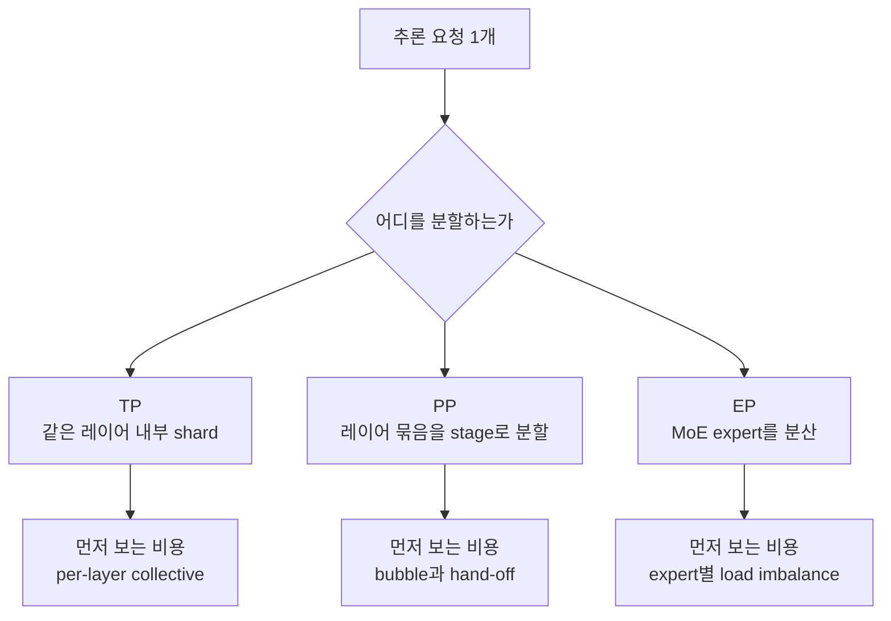
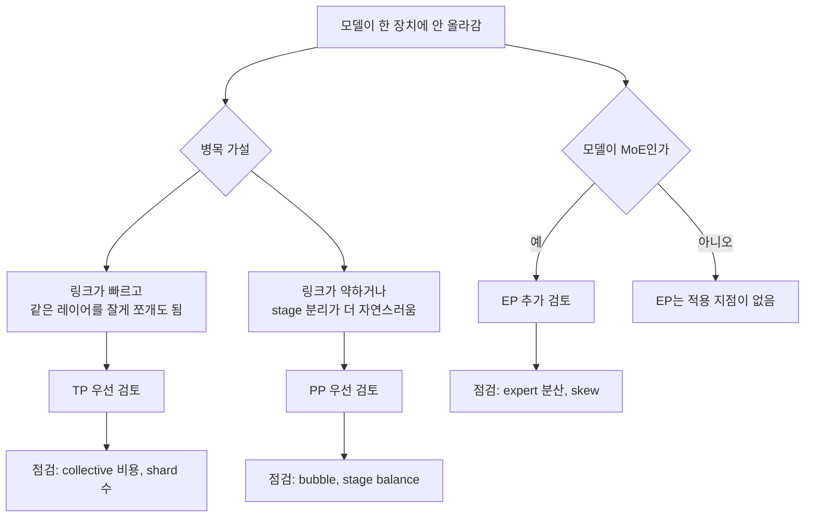
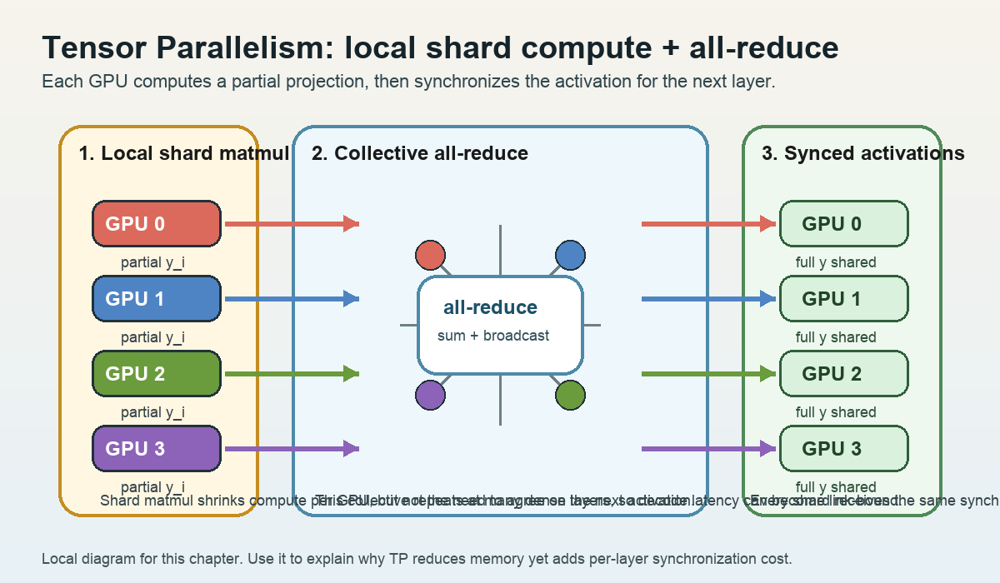
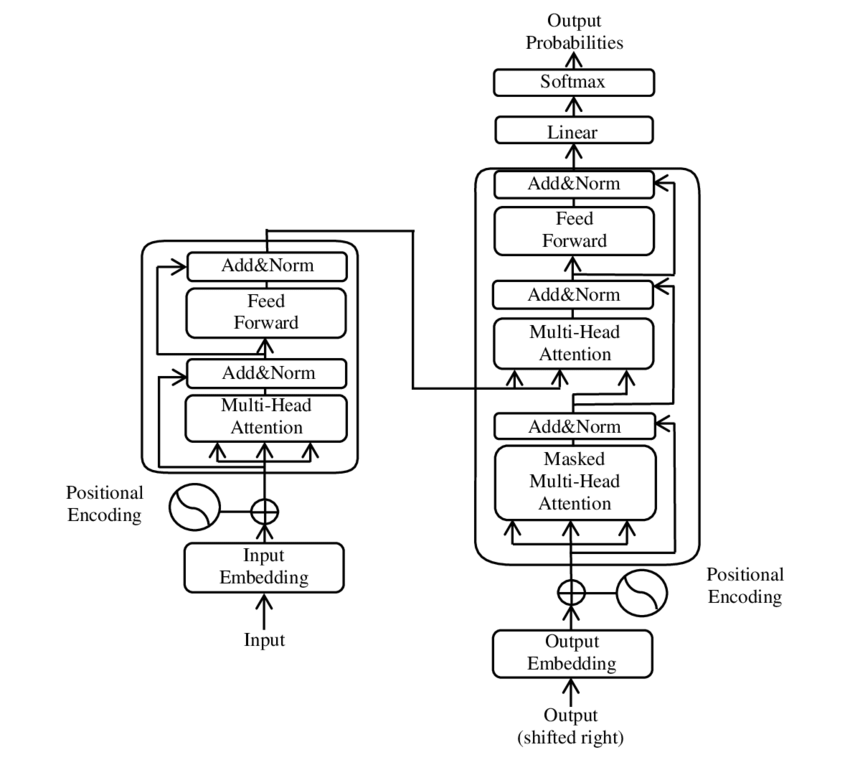

# Model Parallelism: TP, PP, EP

## 수업 개요

이번 챕터는 "모델을 여러 장비에 찢어 놓는다"는 한 문장을 세 갈래로 분해한다. vLLM 문서는 tensor parallelism, pipeline parallelism, expert parallelism을 서로 다른 분산 추론 축으로 다룬다 [S1]. 이 수업에서는 그 사실을 기준선으로 삼아, TP는 레이어 안쪽 collective, PP는 stage 사이 bubble, EP는 expert 쏠림과 분산 불균형이 먼저 병목이 되는 방식이라고 정리한다.

또 하나 분명히 해 둘 점이 있다. TensorRT-LLM의 disaggregated serving은 prefill과 decode를 다른 worker pool로 나누는 구조이며, 레이어를 stage로 자르는 PP와는 질문 자체가 다르다 [S2]. 그래서 이 챕터의 비교 축은 "속도 향상 기법 세 개"가 아니라 "통신량과 메모리 분할이 어디서 비용으로 돌아오는가"다.

## 학습 목표

- TP, PP, EP가 각각 무엇을 나누고 무엇을 서로 기다리게 만드는지 설명할 수 있다.
- 메모리 부족 문제와 통신 병목 문제를 같은 질문으로 취급하지 않고 분리할 수 있다.
- dense 모델과 MoE 모델에서 병렬화 후보가 왜 달라지는지 말할 수 있다.
- 저대역폭 인터커넥트나 작은 장치 메모리 같은 하드웨어 제약이 병렬화 선택에 어떻게 개입하는지 설명할 수 있다.
- disaggregated serving을 PP의 별칭으로 오해하지 않고 구분할 수 있다 [S2].

## 수업 전에 생각할 질문

- "한 장비 메모리에 안 올라간다"는 사실만으로 TP, PP, EP 중 하나를 바로 고를 수 있을까?
- 장치 간 링크가 약한 환경에서 TP shard 수를 늘리면 왜 계산보다 통신이 먼저 튈 수 있을까?
- MoE 서비스에서 평균 utilization은 괜찮은데 p99만 나빠질 때, stage balance와 expert skew 중 무엇을 먼저 의심해야 할까?

## 강의 스크립트

### 장면 1. 병렬화 이름보다 먼저 병목 위치를 본다

**교수자:** vLLM 문서가 TP, PP, EP를 각각 별도 병렬화 축으로 다룬다는 점부터 출발하자 [S1]. 이건 세 방법이 같은 문제를 푸는 세 가지 메뉴가 아니라, 모델 내부에서 다른 지점을 분할한다는 뜻이다.

**학습자:** 그래서 같은 "병렬화"여도 운영자가 보는 지표가 달라진다는 건가요?

**교수자:** 맞다. TP는 같은 레이어 안에서 쪼갠 결과를 다시 합쳐야 한다. PP는 레이어 묶음을 순서대로 넘겨야 한다. EP는 expert 선택이 고르게 되지 않으면 일부 expert만 바빠진다. 이름보다 먼저 "무엇이 서로를 기다리게 만드는가"를 잡아야 한다.

### 장면 2. TP는 메모리를 나누는 대신 레이어마다 통신을 반복한다

**교수자:** dense 모델이 한 장비 메모리에 안 들어갈 때 TP가 먼저 떠오르는 이유는 단순하다. 같은 레이어의 weight를 여러 shard로 나누기 때문이다 [S1]. 메모리 관점에서는 직관적이다. 하지만 추론 경로에서는 레이어를 지날 때마다 다시 합치는 순간이 생긴다.

$$
T_{\text{decode, TP}} \approx L \left(\frac{C_{\text{layer}}}{p} + T_{\text{collective}}\right)
$$

이 식은 강의용 근사식이다. 레이어 수를 $L$, shard 수를 $p$라고 보면 계산량은 줄어들 수 있지만, decode처럼 작은 계산을 자주 반복하는 구간에서는 $T_{\text{collective}}$가 쉽게 눈에 띈다.

**학습자:** 그러면 TP는 메모리 문제에는 강하지만, 링크가 약하면 손해를 볼 수 있겠네요?

**교수자:** 바로 그 점이다. 예를 들어 장치당 메모리는 작아서 70B dense 모델이 한 장에 안 들어가는데, 칩 간 링크가 NVLink급이 아니라 PCIe급이라면 공격적인 TP는 매 레이어 동기화 비용을 키운다. 이런 환경에서는 "TP를 많이 쓰는가"보다 "TP는 빠른 로컬 그룹 안에만 제한하고, 그 밖의 메모리 분할은 PP로 넘길 것인가"가 실제 설계 질문이 된다. 이 판단은 본문 tradeoff인 통신량과 메모리 분할을 그대로 적용한 수업용 사례다.

**학습자:** 디버깅은 어디서 시작하나요?

**교수자:** TP에서 먼저 보는 순서는 간단하다. shard 수를 줄였을 때 latency가 내려가는가, batch를 늘려도 개선이 거의 없는가, 링크 대기 시간이 compute보다 먼저 커지는가를 본다. 이 순서는 TP를 "메모리 분할은 쉽지만 per-layer collective가 아픈 방식"으로 이해할 때 자연스럽게 나온다 [S1].

### 장면 3. PP는 메모리를 stage로 나누지만 빈칸도 함께 만든다

**교수자:** PP는 레이어 묶음을 stage로 나눠 싣는다 [S1]. 그래서 "모델이 한 장치에 안 들어간다"는 문제에 역시 쓸 수 있다. 다만 TP가 레이어 안쪽에서 자주 동기화한다면, PP는 stage를 따라 흐르는 시간축에서 손실을 낸다.

$$
\text{Bubble ratio} \approx \frac{p-1}{m+p-1}
$$

여기서 $p$는 stage 수, $m$은 microbatch 수다. 이것도 강의용 근사식이다. stage 수가 많은데 microbatch가 적으면 파이프라인을 채우고 비우는 빈칸이 커진다.

**학습자:** stage만 잘게 나누면 메모리는 풀리지만, 전체 지연은 그대로일 수도 있겠군요.

**교수자:** 그렇다. PP의 실패는 "장비는 다 켜져 있는데 놀고 있는 stage가 계속 보이는" 형태로 나온다. 그래서 PP는 FLOPs 숫자만 보지 않고 stage balance와 bubble을 함께 봐야 한다.

**학습자:** PP와 disaggregated serving이 비슷해 보이는 건 왜 자꾸 헷갈리죠?

**교수자:** 둘 다 무언가를 나누기 때문이다. 하지만 S2가 설명하는 disaggregated serving은 prefill과 decode를 다른 worker pool로 분리하는 구조다 [S2]. PP는 한 요청이 stage를 순차 통과하는 레이어 분할이고, disaggregation은 phase를 분리해 서로 다른 자원 특성에 맞춘다. 겉모양이 아니라 무엇을 분할하는지로 구분해야 한다.

### 장면 4. EP는 MoE에서 강하지만, 평균값이 아니라 쏠림을 의심하게 만든다

**교수자:** vLLM 문서가 expert parallel을 따로 잡아 두었다는 사실은, MoE 계열에서는 expert 분산이 독립적인 설계 축이라는 뜻으로 읽을 수 있다 [S1]. 여기서부터는 수업용 해석을 조금 보태겠다. EP의 실무 질문은 "expert가 모두 고르게 바쁜가"이지 "전체 평균 GPU 사용률이 높은가"가 아니다.

**학습자:** dense 모델에는 왜 같은 논리가 안 통하죠?

**교수자:** dense 모델에는 router와 expert 집합이 없기 때문이다. EP는 MoE의 sparse 경로가 있을 때만 성립하는 분할이다. 그래서 dense 모델에 EP를 만능 해법처럼 붙이면 출발점부터 틀린다.

**학습자:** 그럼 EP 장애는 어떻게 찾나요?

**교수자:** 여기서부터는 문서 직접 진술이라기보다 수업용 운영 점검 순서다. expert parallel을 병렬화 축으로 보는 이상, 운영자는 expert별 토큰 분포 편차, 특정 expert에 몰린 queue, tail latency의 국소 상승 같은 관찰 포인트를 먼저 의심해 볼 수 있다. 다만 이것은 S1을 바탕으로 한 해석이지, 이번 소스가 세부 지표 목록까지 직접 제공한다는 뜻은 아니다.

### 장면 5. 병렬화 선택은 "몇 장 쓰나"가 아니라 "어디서 통신을 낼 건가"다

**학습자:** 결국 장비 수가 같아도 하드웨어 특성 때문에 답이 달라진다는 말이군요.

**교수자:** 그렇다. 예를 들어 NPU 한 칩의 메모리가 작아 모델을 반드시 분할해야 하는데 칩 간 링크는 제한적이라고 해 보자. 이때 TP를 과하게 쓰면 레이어마다 통신이 누적된다. 반대로 PP는 메모리를 stage 단위로 나누기 쉬우나, stage 균형을 못 맞추면 idle bubble을 감수해야 한다. MoE라면 EP가 메모리와 계산을 동시에 줄여 줄 수 있지만, 그 대가로 expert 쏠림을 따로 관리해야 한다. 이처럼 통신이 어디에 모이고 메모리 절감이 어디에서 나오는지를 함께 보는 것이 선택 기준이다.

**학습자:** 그러면 최종 답은 하나가 아니라 조합이겠네요?

**교수자:** 맞다. TP, PP, EP는 배타적 이름표가 아니라 서로 다른 병목을 가진 축이다 [S1]. 그리고 S2가 보여 주듯, 때로는 모델 내부 병렬화보다 prefill/decode 분리 같은 phase-level 구조가 더 큰 효과를 낼 수도 있다 [S2]. 설계는 항상 병목 위치를 기준으로 한다.

## 자주 헷갈리는 포인트

- TP는 "메모리를 잘게 나눈다"에서 끝나지 않는다. 레이어마다 결과를 다시 맞추는 통신 비용까지 함께 따라온다.
- PP는 장비 수를 늘린다고 자동으로 좋아지지 않는다. stage 불균형과 bubble이 남으면 놀고 있는 시간이 커진다.
- EP는 MoE가 있을 때의 분산 축이다. dense transformer에 바로 붙는 일반 해법이 아니다.
- disaggregated serving은 PP의 다른 이름이 아니다. S2의 핵심은 layer partition이 아니라 prefill/decode phase 분리다 [S2].
- EP에서 평균 throughput이 멀쩡해 보여도 일부 expert 쏠림이 tail latency를 악화시킬 수 있다는 진단 순서는 본문의 수업용 해석이다.

## 사례로 다시 보기

### 사례 1. 메모리는 부족하고 링크는 약한 8칩 NPU 보드

**교수자:** 70B dense 모델을 8칩 보드에 올려야 한다. 장치당 메모리는 부족하고 칩 간 링크는 빠르지 않다. 이때 첫 판단은 "메모리만 보면 TP"가 아니라 "TP를 크게 늘렸을 때 레이어별 collective가 감당 가능한가"다. 링크가 약하면 TP를 로컬 소규모 그룹에만 두고, 메모리 추가 분할은 PP로 넘기는 하이브리드가 더 현실적일 수 있다. 이 사례는 출처의 직접 문장이라기보다, [S1]의 병렬화 축을 하드웨어 선택 기준으로 풀어 쓴 수업용 적용 예시다.

### 사례 2. MoE 챗봇에서 평균 TPS는 정상인데 불만은 p99에 몰린다

**교수자:** 이런 경우 TP라면 전반적인 collective 대기가 보일 것이고, PP라면 특정 stage의 idle 혹은 hand-off 패턴이 드러날 것이다. 그런데 일부 expert 관련 장비만 길게 밀린다면 EP 가설이 더 설득력 있다. expert별 토큰 분포와 queue 편차를 먼저 확인하라는 권고는 본문과 같은 이유로 수업용 해석이다. 핵심은 평균값이 아니라 가장 바쁜 expert 한 곳의 국소 병목이다.

## 핵심 정리

- TP는 같은 레이어를 여러 장치에 나눠 메모리를 줄이지만, per-layer collective를 자주 낸다.
- PP는 레이어 묶음을 stage로 나눠 메모리를 분산하지만, bubble과 stage balance를 관리해야 한다.
- EP는 MoE expert를 분산해 sparse 계산의 이점을 살리지만, expert별 쏠림을 별도 문제로 만든다.
- disaggregated serving은 모델 내부 병렬화가 아니라 prefill/decode phase 분리이며, PP와 비교할 때 질문이 다르다 [S2].
- 하드웨어 선택 기준은 장치 수보다 통신 위치와 메모리 절감 위치를 함께 보는 데서 나온다.

## 복습 체크리스트

- TP, PP, EP 각각에서 "무엇을 나누는가"와 "무엇을 기다리는가"를 한 문장씩 말할 수 있는가?
- 저대역폭 인터커넥트 환경에서 TP를 무작정 늘리면 왜 손해가 날 수 있는지 설명할 수 있는가?
- PP의 bubble ratio가 microbatch 수에 따라 어떻게 달라지는지 설명할 수 있는가?
- dense 모델과 MoE 모델에서 EP의 적용 가능성이 왜 다른지 설명할 수 있는가?
- disaggregated serving을 PP와 구별해 설명할 수 있는가 [S2]?

## 대안과 비교

| 방식 | 주로 나누는 대상 | 메모리 측면 장점 | 먼저 보는 비용 | 잘 맞는 상황 | 본문에서의 출처 연결 |
| --- | --- | --- | --- | --- | --- |
| TP | 같은 레이어 내부 weight와 연산 | 한 레이어의 파라미터를 여러 장치에 분할 | collective, interconnect 대기 | dense 모델이 한 장치에 안 들어가고 링크가 충분히 빠를 때 | vLLM이 TP를 분산 추론 축으로 다룬다는 점 [S1] |
| PP | 레이어 묶음(stage) | stage별로 메모리 예산을 나눌 수 있음 | bubble, hand-off, stage imbalance | 깊은 모델을 stage로 자연스럽게 분할할 수 있을 때 | vLLM이 PP를 분산 추론 축으로 다룬다는 점 [S1] |
| EP | MoE expert | sparse 경로를 따라 expert 메모리를 분산 | expert skew, load imbalance | MoE 추론에서 expert 분산이 필요할 때 | vLLM의 expert parallel 축 [S1], 세부 진단은 수업용 해석 |
| Disaggregated serving | 요청 phase(prefill/decode) | phase별 자원군을 분리 가능 | phase 간 상태 전달과 운영 복잡도 | prefill-heavy와 decode-heavy가 섞여 간섭이 클 때 | prefill/decode worker 분리 구조 [S2] |

## 참고 이미지

- `img-01.png` | 원본 제목: `Roofline model` | 원본 URL: `https://commons.wikimedia.org/wiki/File:Roofline_model.png` | 출처 유형: `Wikimedia Commons` | 접근 날짜: `2026-03-08` | 사용 이유: TP를 크게 잡을수록 연산량보다 interconnect와 collective 대기가 먼저 상한에 닿을 수 있다는 점을 roofline 관점으로 설명하기 위해 사용한다.

- `img-02.png` | 원본 제목: `Transformer model architecture` | 원본 URL: `https://commons.wikimedia.org/wiki/File:The_Transformer_model_architecture.png` | 출처 유형: `Wikimedia Commons` | 접근 날짜: `2026-03-08` | 사용 이유: PP가 layer/stage 경계에 bubble과 hand-off를 만들고, TP/EP가 다른 위치에 비용을 만든다는 점을 transformer layer stack 위에서 비교하기 위해 사용한다.

## 출처

| Ref | 제목 | 발행처 | 날짜 | URL | 본문 연결 |
| --- | --- | --- | --- | --- | --- |
| [S1] | vLLM Documentation | vLLM project | 2026-01-07 | https://docs.vllm.ai/en/latest/ | `수업 개요`: TP, PP, EP를 분산 추론 병렬화 축으로 두는 기준선. `장면 1`: 세 방식이 같은 병렬화가 아니라 다른 분할 위치라는 설명의 출발점. `장면 2`: TP를 레이어 내부 shard와 동기화 문제로 설명한 부분의 기준선. `장면 3`: PP를 stage 분할로 설명한 부분의 기준선. `장면 4`: expert parallel이 독립 축이라는 설명의 기준선. expert skew, queue 편차, tail 진단 순서는 이 기준선 위의 수업용 해석. `대안과 비교`: TP/PP/EP 행의 근거. |
| [S2] | Disaggregated Serving | NVIDIA TensorRT-LLM | 2026-03-08 (accessed) | https://nvidia.github.io/TensorRT-LLM/1.2.0rc6/features/disagg-serving.html | `수업 개요`: PP와 다른 비교 축을 잡는 근거. `학습 목표`: disaggregated serving을 PP와 구분한다는 목표의 근거. `장면 3`: prefill/decode worker pool 분리 설명의 직접 근거. `장면 5`: 모델 내부 병렬화와 phase-level 구조를 구분하는 비교 근거. `대안과 비교`: Disaggregated serving 행의 근거. |
