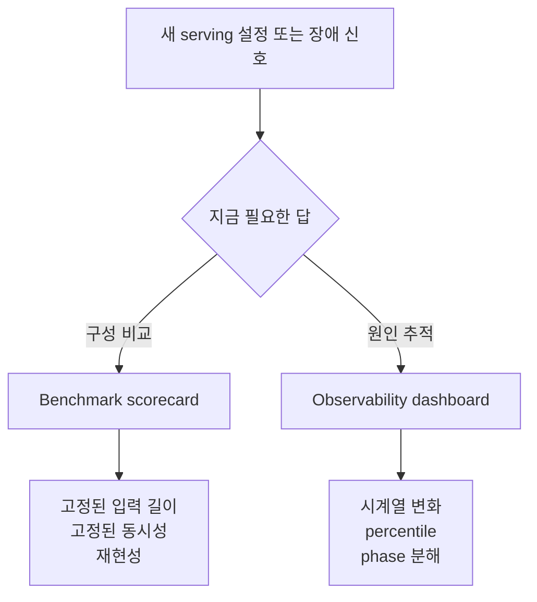
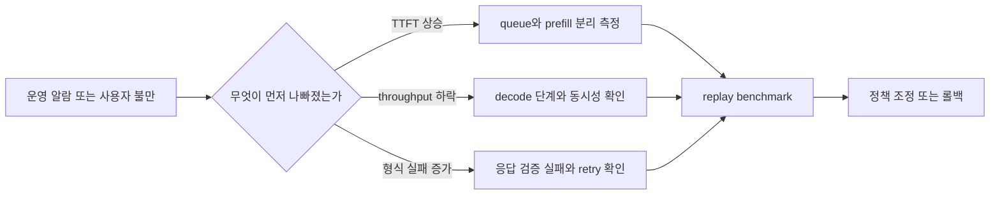

# Benchmarking and Observability

## 수업 개요

이 챕터의 출발점은 단순하다. 좋은 benchmark는 현실을 일부러 깎아 내리고, 좋은 observability는 현실의 흔들림을 일부러 남긴다. 그래서 둘 다 숫자를 다루지만 같은 표로 합치면 곧바로 오판이 생긴다. 하나는 "같은 조건에서 무엇이 더 낫나"를 묻고, 다른 하나는 "지금 어디가 무너지는가"를 묻는다. 이 챕터가 다루는 tradeoff는 바로 그 사이, 즉 측정 단순성과 운영 현실 반영의 긴장이다.

이번 장에서는 출처의 역할도 좁게 잡는다. [S2]는 prefill과 decode를 분리해서 봐야 한다는 직접 근거로 사용하고, [S1]은 최신 serving 문서 용어를 맞추는 기준선으로만 사용한다. 반대로 `schema-valid rate`나 usable goodput 같은 structured output 운영 규칙은 이 챕터에서 교수자 운영 휴리스틱으로 다루며, 공식 출처가 직접 뒷받침하는 사실처럼 서술하지 않는다.

## 학습 목표

- benchmark scorecard와 observability dashboard가 서로 다른 질문에 답한다는 점을 설명할 수 있다.
- 단일 평균 latency가 workload mix 변화를 가릴 수 있다는 점을 설명할 수 있다.
- `TTFT`를 queue, prefill, first-token 단계로 분해해 병목 가설을 세울 수 있다.
- TensorRT-LLM의 disaggregated serving 관점을 prefill/decode 분리 계측의 직접 근거와 연결할 수 있다 [S2].
- structured output 서비스에서 `schema-valid rate` 같은 보조 지표를 별도로 두는 이유를 교수자 운영 휴리스틱 수준에서 설명할 수 있다.

## 수업 전에 생각할 질문

- 평균 throughput이 좋아졌는데도 사용자는 더 느려졌다고 느낄 수 있을까?
- 긴 문서 요약과 짧은 채팅 요청을 하나의 synthetic benchmark로 대표하면 무엇이 사라질까?
- JSON 형식이 중요한 서비스에서 속도 그래프만 보고 배포 성공이라고 말해도 될까?

## 강의 스크립트

### 세션 1. 점수판과 대시보드는 같은 벽에 붙지 않는다

**교수자:** 운영 회의에서 자주 생기는 실수가 하나 있습니다. benchmark 표를 들고 들어와서 장애를 설명하려는 겁니다.

**학습자:** 둘 다 latency, throughput을 보니까 헷갈리기 쉬운 것 같습니다.

**교수자:** 이름은 같아도 질문이 다릅니다. benchmark는 조건을 고정하고 구성을 비교합니다. observability는 조건이 흔들리는 상태에서 원인을 좁힙니다. 그래서 같은 `TTFT`라도 benchmark에서는 "어느 설정이 더 빠른가"를 묻고, observability에서는 "왜 오늘 p95가 튀었는가"를 묻습니다.

| 지금 답하려는 질문 | benchmark에서 먼저 보는 값 | observability에서 같이 보는 값 | 섞어 쓰면 생기는 오해 |
| --- | --- | --- | --- |
| 어떤 설정이 더 빠른가 | 고정 prompt/output 길이의 `TTFT`, throughput | 실트래픽 비중, 시간대, 배포 버전 | benchmark 승자가 운영 승자라고 단정 |
| 오늘 왜 느려졌는가 | 재현용 replay benchmark | `TTFT p95`, queue wait, phase별 latency | 평균 한 줄이면 충분하다고 착각 |
| 어디가 병목인가 | bucket별 synthetic run | queue, prefill, first-token, retry | 총 latency 하나로 원인을 찾으려 함 |

### 세션 2. benchmark는 현실을 버리는 대신 비교력을 산다

**학습자:** 그러면 benchmark는 현실을 덜 닮을수록 오히려 좋은 건가요?

**교수자:** 비교가 목적이라면 그렇습니다. 입력 길이, 출력 길이, 동시성, warm-up 상태를 묶어 두어야 A와 B를 선명하게 비교할 수 있습니다. 이 장에서는 최신 serving 문서 용어 기준선으로 vLLM Documentation을 함께 보지만 [S1], 그 문서가 곧바로 운영 대시보드 설계를 대신해 주는 것은 아닙니다. 문맥을 맞추는 기준선과 운영 판단은 분리해야 합니다.

**학습자:** 그런데 운영 트래픽은 길이도 섞이고 시간대도 흔들립니다.

**교수자:** 그래서 benchmark를 버리는 것이 아니라, bucket을 나눕니다. 평균 하나로 덮지 않고 workload mix를 밝히는 식입니다.

$$
\bar{L}_{\text{mix}} = \sum_{i=1}^{n} w_i L_i \qquad \left(\sum_{i=1}^{n} w_i = 1\right)
$$

**교수자:** 같은 엔진이라도 `짧은 채팅`, `긴 문서 요약`, `structured output`의 비중 $w_i$가 달라지면 평균 latency는 얼마든지 달라집니다. 그래서 benchmark의 단순성은 버릴 것이 아니라, 어떤 단순화를 했는지 적어 두어야 쓸모가 생깁니다.

### 세션 3. observability는 한 숫자보다 분해가 먼저다

**교수자:** 운영에서는 사용자가 가장 먼저 불평하는 지점부터 쪼개 봅니다. 대개는 첫 응답입니다.

$$
TTFT = T_{\text{queue}} + T_{\text{prefill}} + T_{\text{first-token}}
$$

**교수자:** 이 분해식은 강의용 모델입니다. `queue`가 길면 admission이나 batching을 의심하고, `prefill`이 길면 긴 입력과 컨텍스트 비용을 의심하고, `first-token` 직전이 길면 실행 경로 전환이나 phase handoff를 의심합니다.

**학습자:** benchmark 표의 평균 `TTFT`만 보면 여기까지는 안 보이겠네요.

**교수자:** 맞습니다. 참고 이미지 `I1`을 같이 보십시오. roofline은 계산 집약도와 메모리 대역폭이 만드는 상한을 설명하는 데는 유용합니다. 하지만 그 그림에는 queue wait도 없고, 배포 직후 특정 bucket만 밀리는 운영 현실도 없습니다. benchmark는 이런 상한선 설명에 강하고, observability는 상한선 밖에서 실제로 어디가 늦어지는지 밝히는 데 강합니다.

### 세션 4. prefill과 decode를 합치면 phase별 tradeoff가 사라진다

**교수자:** 이 장에서 공식 출처가 가장 직접적으로 들어오는 부분이 여기입니다. TensorRT-LLM의 disaggregated serving은 prefill과 decode를 다른 worker pool과 다른 운영 단위로 볼 수 있다는 점을 분명히 보여 줍니다 [S2].

**학습자:** 그러면 benchmark도 phase를 따로 설계해야 합니까?

**교수자:** 그렇습니다. 긴 문서 요약은 prefill 부담이 먼저 튀고, 짧은 채팅은 decode 반복과 queue 체감이 먼저 튑니다. 둘을 한 평균 total latency로 합치면 어떤 최적화가 누구에게 이익이었는지 흐려집니다.

**교수자:** 참고 이미지 `I2`도 여기서 보조적으로 쓸 수 있습니다. transformer 구조도는 serving phase를 직접 설명하는 그림은 아니지만, 입력을 넓게 읽는 attention 경로와 출력 토큰을 이어 가는 경로의 성격 차이를 직관적으로 상기시키는 데는 도움이 됩니다. 이 이미지는 phase 분리의 직접 근거가 아니라 설명 보조물입니다.

### 세션 5. structured output은 속도 외의 운영선이 하나 더 필요하다

**학습자:** throughput은 올랐는데 팀이 배포를 싫어하는 경우도 있습니까?

**교수자:** 있습니다. 다만 여기부터는 공식 문서의 직접 인용이 아니라 교수자 운영 휴리스틱으로 들어야 합니다. tool calling이나 JSON 응답이 중요한 서비스에서는, 토큰을 빨리 내보내는 것만으로는 충분하지 않습니다. 응답 형식이 자주 깨지면 retry나 fallback이 늘고, 체감 성공률은 오히려 떨어집니다.

**학습자:** 그래서 `schema-valid rate` 같은 지표를 같이 본다는 말이군요.

**교수자:** 그렇습니다. 이 챕터에서는 `schema-valid rate`, retry rate, fallback 비율을 structured output 운영에서 자주 쓰는 실무적 추론으로 소개합니다. 공식 출처 [S1], [S2]가 이 값을 표준 지표로 정의한다고 주장하는 것은 아닙니다. 핵심은 "빠른 토큰 생성"과 "실제로 후속 단계에 쓸 수 있는 응답"을 같은 것으로 착각하지 말라는 것입니다.

### 세션 6. benchmark와 observability는 왕복해야 한다

**교수자:** 실무 순서는 보통 이렇게 갑니다.

1. 사용자 불만이 첫 응답 지연인지, 생성 속도 저하인지, 형식 실패인지부터 구분한다.
2. 운영 대시보드에서 그 증상에 맞는 값을 본다. `TTFT p95`, queue wait, prefill latency, retry 증가 같은 값이 여기에 들어간다.
3. 실제 workload mix를 기준으로 replay benchmark를 다시 만든다.
4. 그 benchmark에서 batching, phase 분리, rollout 설정을 비교한다.

**학습자:** observability가 문제를 발견하고, benchmark가 수정안을 검증하는 구조군요.

**교수자:** 그 순서가 흔들리면 숫자는 많아지는데 결론은 약해집니다. 대시보드는 범인을 지목하는 곳이고, benchmark는 용의자를 동일 조건에 세워 보는 곳입니다.

## 자주 헷갈리는 포인트

- benchmark와 observability는 같은 숫자 이름을 써도 같은 질문에 답하지 않는다.
- 평균 throughput 개선은 자동으로 사용자 체감 개선을 뜻하지 않는다.
- `TTFT`는 queue, prefill, first-token으로 분해할 때 비로소 운영 지표가 된다.
- prefill/decode 분리는 이 챕터에서 [S2]의 직접 근거를 갖는 부분이고, structured output 운영 지표는 별도 공식 출처가 없는 교수자 운영 휴리스틱이다.
- 이미지 `I1`, `I2`는 설명 보조물이지 공식 서빙 표준 문서를 대체하지 않는다.

## 사례로 다시 보기

### 사례 1. 평균은 좋아졌는데 짧은 채팅이 더 미끄러진 배포

팀은 2K prompt 중심의 synthetic benchmark에서 이긴 설정을 배포했다. 그런데 실제 서비스는 한두 줄짜리 질문이 대부분이었다. 결과적으로 전체 throughput은 올랐지만, 짧은 요청의 queue 대기가 길어지면서 `TTFT p95` 불만이 늘었다. 이 사례가 보여 주는 포인트는 간단하다. benchmark가 틀린 것이 아니라, 그 benchmark가 대표한다고 가정한 workload mix가 틀렸다.

### 사례 2. JSON은 빨리 오는데 쓸 수가 없는 agent 서비스

이 사례는 교수자 운영 휴리스틱이다. 어떤 agent 서비스는 JSON 응답 형식이 틀리면 후속 tool 호출이 바로 깨진다. 이때 팀이 throughput 그래프만 보고 배포를 유지하면, retry와 fallback 비용을 너무 늦게 본다. 그래서 structured output 서비스에서는 `schema-valid rate`와 retry 비율을 속도 그래프 옆에 따로 두는 편이 실무적으로 안전하다. 이 판단은 [S1], [S2]의 직접 진술이 아니라, 이 챕터의 운영 현실 반영 쪽으로 기울인 실무적 추론이다.

## 핵심 정리

- benchmark는 현실을 줄여서 비교력을 얻고, observability는 현실의 흔들림을 남겨서 원인 추적력을 얻는다.
- workload mix를 드러내지 않는 평균값은 배포 판단을 쉽게 흐린다.
- `TTFT` 분해는 운영 진단의 출발점이다.
- prefill/decode를 다른 운영 단위로 볼 수 있다는 점은 [S2]의 직접 근거에 기대는 핵심 포인트다.
- structured output 품질 지표는 이 챕터에서 교수자 운영 휴리스틱으로 취급하며, 공식 출처가 직접 정의한 표준이라고 주장하지 않는다.

## 복습 체크리스트

- benchmark scorecard와 observability dashboard가 각각 무슨 질문에 답하는지 말할 수 있는가?
- 평균 latency를 workload bucket 평균으로 다시 읽어야 하는 이유를 설명할 수 있는가?
- `TTFT` 분해식에서 어느 항이 어떤 운영 병목과 연결되는지 말할 수 있는가?
- [S2]를 근거로 prefill/decode 분리의 의미를 설명할 수 있는가?
- structured output 운영 규칙 중 무엇이 공식 출처가 아니라 교수자 휴리스틱인지 구분할 수 있는가?

## 대안과 비교

| 접근 | 장점 | 약점 | 적합한 상황 |
| --- | --- | --- | --- |
| 단일 synthetic benchmark | 반복성과 비교력이 높다 | 실 workload mix와 tail을 잘 숨긴다 | 엔진이나 설정의 1차 비교 |
| bucket별 benchmark | 짧은 요청과 긴 요청을 분리해서 본다 | 설계와 유지 비용이 든다 | 배포 전 현실성 있는 검증 |
| observability 중심 운영 | 회귀와 장애를 빨리 잡는다 | 통제 조건이 약해 원인 분리가 늦을 수 있다 | 배포 후 감시와 알람 |
| replay benchmark 연동 | 운영 증상과 실험 검증을 왕복시킨다 | 태깅 규율과 로그 품질이 필요하다 | 장기 운영 팀의 안정화 단계 |

## 참고 이미지

- `img-01.png` | 원본 제목: `Roofline model` | 원본 URL: `https://commons.wikimedia.org/wiki/File:Roofline_model.png` | 출처 유형: `Wikimedia Commons` | 접근 날짜: `2026-03-08` | 사용 이유: 세션 3에서 benchmark가 계산/메모리 상한을 설명하는 데는 강하지만 queue wait와 phase별 운영 지연은 담지 못한다는 대비를 직접 설명할 때 사용했다.

- `img-02.png` | 원본 제목: `Transformer model architecture` | 원본 URL: `https://commons.wikimedia.org/wiki/File:The_Transformer_model_architecture.png` | 출처 유형: `Wikimedia Commons` | 접근 날짜: `2026-03-08` | 사용 이유: 세션 4에서 입력을 넓게 읽는 구간과 토큰을 이어 가는 구간의 직관 차이를 보조적으로 설명하는 시각자료로 사용했다. serving phase를 직접 증명하는 출처는 아니다.

## 출처

| Ref | 제목 | 발행처 | 날짜 | URL | 직접 근거로 사용한 문장 | 경계와 파생 해석 |
| --- | --- | --- | --- | --- | --- | --- |
| [S1] | vLLM Documentation | vLLM project | 2026-01-07 | https://docs.vllm.ai/en/latest/ | `수업 개요` 2문단의 "최신 serving 문서 용어를 맞추는 기준선"과 `세션 2`의 "최신 serving 문서 용어 기준선으로 함께 본다"는 설명에만 사용했다. | `schema-valid rate`, retry, usable response 운영 규칙의 직접 근거로 쓰지 않았다. 그 부분은 교수자 운영 휴리스틱이다. |
| [S2] | Disaggregated Serving | NVIDIA TensorRT-LLM | 2026-03-08 (accessed) | https://nvidia.github.io/TensorRT-LLM/1.2.0rc6/features/disagg-serving.html | `수업 개요` 2문단의 "prefill과 decode를 분리해서 봐야 한다"는 설명, `세션 4`의 phase 분리 설명, `핵심 정리`의 prefill/decode를 다른 운영 단위로 본다는 문장에 사용했다. | `세션 4`의 bucket 설계와 `세션 6`의 디버깅 순서는 [S2]를 바탕으로 한 수업용 운영 정리이며, 문서의 문장 자체를 재현한 것은 아니다. |
