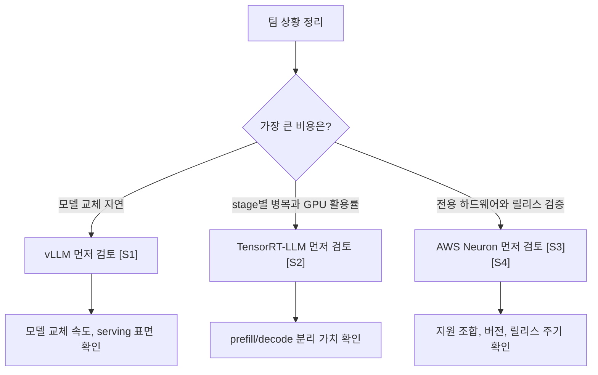
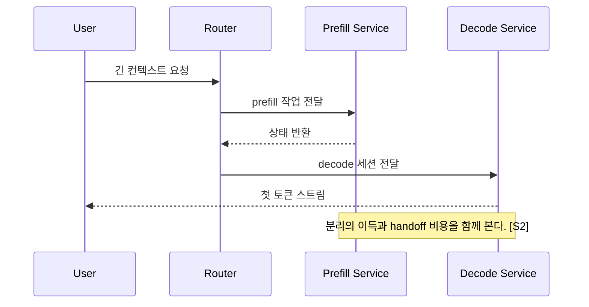

# vLLM, TensorRT-LLM, Neuron Comparison

## 수업 개요
이 챕터는 세 프레임워크를 제품 소개처럼 나열하지 않는다. 대신 "모델은 같아도 왜 팀마다 backend 답이 달라지는가"를 추적한다. vLLM 문서는 범용 serving의 기준선을 제공하고, TensorRT-LLM의 disaggregated serving 문서는 prefill/decode를 분리해서 병목을 다시 배치하는 발상을 보여 주며, AWS Neuron 자료는 2025년 8월 6일 announcement와 2026년 3월 8일 기준 2.26.0 release notes를 통해 전용 하드웨어와 릴리스 주기를 함께 관리해야 한다는 점을 드러낸다. [S1] [S2] [S3] [S4]

## 학습 목표
- vLLM, TensorRT-LLM, Neuron을 생산성, 성능 상한, 장비 종속성, 운영 검증 방식으로 비교할 수 있다.
- "같은 모델이 뜬다"와 "같은 운영 난이도다"가 왜 다른 말인지 설명할 수 있다.
- prefill/decode 분리와 release-note 기반 검증이 backend 선택 순서를 어떻게 바꾸는지 말할 수 있다.
- 팀의 장비와 배포 문화에 맞춰 어떤 backend를 1순위로 볼지 제안할 수 있다.

## 수업 전에 생각할 질문
- 한 달에 여러 번 모델을 갈아끼우는 팀과, 특정 하드웨어 표준을 이미 굳힌 팀이 같은 backend를 고를 이유가 있을까?
- 벤치마크 숫자가 좋아도 운영 절차가 길어지면 그 backend는 실제로 더 빠른 선택일까?
- AWS 전용 장비에서의 적합성과 NVIDIA GPU에서의 적합성을 같은 점수표로 평가해도 될까?

## 강의 스크립트
### 1. 비교는 성능표가 아니라 실패 비용표에서 시작한다
**교수자:** 세 프레임워크를 비교할 때 먼저 적어야 하는 것은 최고 TPS가 아닙니다. 어떤 실패가 가장 비싼지부터 적어야 합니다. 모델 교체가 느린 게 비싼가요, GPU 활용률이 낮은 게 비싼가요, 아니면 특정 하드웨어 제약을 팀이 감당 못 하는 게 비싼가요?

**학습자:** 그러면 backend는 속도 선택지라기보다 운영 리스크 선택지에 가깝겠네요?

**교수자:** 맞습니다. vLLM은 범용 serving 문서를 중심으로 읽게 되고, TensorRT-LLM은 disaggregated serving처럼 병목 분해 전략을 중심으로 읽게 되며, AWS Neuron은 announcement와 release notes를 함께 보면서 지원 범위와 릴리스 리듬을 먼저 확인하게 됩니다. 읽기 시작하는 문서가 다르다는 것은 운영 질문이 다르다는 뜻입니다. [S1] [S2] [S3] [S4]

$$
\mathrm{DecisionScore}(b) = w_p P_b + w_s S_b + w_o O_b - w_l L_b
$$

여기서 $P$는 배포 생산성, $S$는 성능 상한, $O$는 운영 적합성, $L$은 장비 종속성이다. 이 수식은 실제 점수 계산기보다 "우리 팀이 어떤 항목을 빼먹었는가"를 드러내는 틀로 쓰면 된다.

### 2. vLLM은 '바로 시작해야 하는 팀'의 기준선이 된다
**학습자:** 그럼 vLLM은 어떤 팀에서 가장 설득력이 큰가요?

**교수자:** 모델 후보가 자주 바뀌고, serving 기능을 넓게 시도해야 하고, 우선 서비스를 띄워서 피드백을 받아야 하는 팀입니다. 이 챕터에서 vLLM은 "가장 빠르다"보다 "가장 빨리 운영 실험을 시작하게 해 주는 기준선"으로 두는 편이 정확합니다. [S1]

**학습자:** 실무에서 자주 나오는 오해는 뭔가요?

**교수자:** 두 가지입니다. 첫째, 시작이 쉬우면 장기 운영에서도 항상 최선이라고 착각하는 것. 둘째, 반대로 범용성이 높으니 전문 최적화 여지는 없다고 성급하게 단정하는 것입니다. vLLM은 출발선을 낮춰 주는 장점이 크지만, 트래픽 규모와 하드웨어 고정성이 커지면 다른 backend가 더 맞을 수 있다는 질문도 동시에 열어 둬야 합니다. [S1]

### 3. TensorRT-LLM은 병목을 쪼개서 다루려는 팀에 맞는다
**교수자:** TensorRT-LLM의 disaggregated serving 문서가 중요한 이유는 단순합니다. 이 backend를 볼 때는 "GPU 위에서 추론이 된다"가 아니라 "prefill과 decode를 같은 방식으로 운영하지 않아도 된다"는 선택지가 열린다는 점을 먼저 봐야 하기 때문입니다. [S2]

**학습자:** 분리하면 무조건 이득인가요?

**교수자:** 아닙니다. 분리하면 보이는 병목이 늘어납니다. prefill 쪽이 막히는지, decode 쪽이 막히는지, 둘 사이 handoff가 흔들리는지 따로 봐야 합니다. 성능 상한이 커지는 대신 시스템 경계도 늘어납니다. [S2]

$$
\mathrm{TTFT}_{\mathrm{split}} = T_{\mathrm{queue}} + T_{\mathrm{prefill}} + T_{\mathrm{handoff}} + T_{\mathrm{first\ decode}}
$$

분리형 서빙에서는 $T_{\mathrm{handoff}}$가 새로 드러난다. 대신 $T_{\mathrm{prefill}}$과 $T_{\mathrm{first\ decode}}$를 서로 다른 자원 정책으로 다룰 수 있다.

### 4. AWS Neuron은 성능 수치보다 지원 조합 검증이 먼저다
**학습자:** Neuron은 왜 자꾸 release notes 이야기가 따라오나요?

**교수자:** 이 챕터에서 Neuron은 범용 라이브러리라기보다 전용 운영 스택으로 보는 편이 맞기 때문입니다. 2025년 8월 6일 AWS Neuron 2.25 announcement와 2026년 3월 8일 기준 2.26.0 release notes가 함께 필요한 이유도 여기에 있습니다. "무엇이 추가됐는가"와 "지금 무엇이 지원되는가"를 같이 봐야 실제 배포 판단이 되기 때문입니다. [S3] [S4]

**학습자:** 그러면 Neuron에서 첫 질문은 benchmark가 아니겠네요.

**교수자:** 그렇습니다. 현재 모델, SDK, 하드웨어 조합이 지원 범위 안에 있는가가 첫 질문입니다. Inferentia나 Trainium 환경이 이미 조직 표준이면 이 과정이 체계로 흡수되지만, 그렇지 않으면 장비 종속성과 릴리스 확인 비용이 바로 운영 부담으로 보입니다. [S3] [S4]

### 5. 디버깅 순서도 backend마다 다르게 잡아야 한다
**교수자:** 같은 "응답이 늦다"라는 증상도 backend에 따라 보는 순서가 달라집니다.

**학습자:** 순서를 예로 들어 주세요.

**교수자:** vLLM은 먼저 모델 교체 직후 설정 변화, serving 옵션, 요청 분포 변화를 묻는 편이 자연스럽습니다. TensorRT-LLM은 prefill/decode 어느 쪽 stage에서 지연이 튀는지부터 나눠 봐야 합니다. Neuron은 성능처럼 보이는 문제가 사실은 릴리스 조합이나 지원 범위 확인에서 시작되는 경우가 있어, announcement와 release notes를 먼저 다시 보는 절차가 중요합니다. [S1] [S2] [S3] [S4]

**학습자:** 결국 backend 선택은 성능 숫자를 바꾸는 것만이 아니라, 장애를 읽는 문법을 바꾸는 일이군요.

**교수자:** 바로 그 점이 핵심입니다. 누구나 benchmark는 읽을 수 있어도, 아무나 운영 문제를 같은 속도로 해석하지는 못합니다.

## 자주 헷갈리는 포인트
- vLLM이 기준선이라는 말은 모든 상황에서 최종 선택지라는 뜻이 아니다. [S1]
- TensorRT-LLM의 장점은 "빠른 추론" 한 단어보다 "stage를 쪼개 운영할 수 있음"에 더 가깝다. [S2]
- Neuron은 AWS에서도 그냥 돌릴 수 있는 옵션이 아니라, 전용 하드웨어와 릴리스 관리가 묶인 선택이다. [S3] [S4]
- 같은 모델이 실행된다는 사실만으로 운영 절차, 검증 비용, 디버깅 난이도가 같아지지는 않는다.
- backend를 비교할 때는 평균 처리량뿐 아니라 새 모델 온보딩 속도와 검증 절차 길이도 함께 봐야 한다.

## 사례로 다시 보기
### 사례 1. 모델 교체가 많은 제품 팀
한 제품 팀은 분기 안에 여러 모델 후보를 시험해야 했다. 이 팀에게 가장 비싼 실패는 최고 처리량 부족이 아니라, 모델 교체와 serving 검증이 늦어지는 일이었다. 이 경우 vLLM을 기준선으로 잡고 실험 속도와 운영 피드백 루프를 먼저 확보하는 선택이 합리적이다. [S1]

### 사례 2. 긴 입력 비중이 큰 NVIDIA GPU 팀
다른 팀은 긴 입력 요청이 많고, 한 단계 안에서 prefill과 decode가 서로 다른 성격의 병목을 만든다는 점이 문제였다. 이때는 TensorRT-LLM의 disaggregated serving을 검토해 stage별 병목을 따로 다룰 가치가 생긴다. 다만 handoff와 추가 운영 복잡도를 함께 계산해야 한다. [S2]

### 사례 3. Inferentia/Trainium 표준화를 추진하는 팀
세 번째 팀은 AWS 안에서 하드웨어와 배포 절차를 표준화하려 했다. 이 팀은 Neuron을 단순 성능 후보가 아니라 release-note 중심 운영 체계로 받아들여야 한다. 즉 새 기능 announcement를 보고 기대치를 세운 뒤, 실제 배포 직전에는 release notes로 지원 조합과 버전 범위를 검증하는 식이다. [S3] [S4]

## 핵심 정리
- vLLM은 빠른 실험과 범용 serving의 기준선, TensorRT-LLM은 stage 분리를 통한 성능 재배치, Neuron은 전용 하드웨어와 릴리스 관리가 결합된 선택으로 보면 비교가 명확해진다. [S1] [S2] [S3] [S4]
- backend 선택은 모델 이름보다 조직의 하드웨어 고정성, 모델 교체 빈도, 운영 검증 습관에 더 크게 좌우된다.
- TensorRT-LLM은 prefill/decode 분리를 통해 성능 여지를 만들지만 handoff와 운영 경계를 늘린다. [S2]
- AWS Neuron은 announcement와 release notes를 함께 읽는 검증 흐름이 핵심이며, 이 점이 장비 종속성과 직접 연결된다. [S3] [S4]

## 복습 체크리스트
- 세 backend를 생산성, 성능 상한, 장비 종속성, 검증 방식 네 축으로 설명할 수 있는가?
- vLLM을 "기준선"으로 부르는 이유를 성능 만능론과 구분해 말할 수 있는가?
- TensorRT-LLM에서 `T_handoff`가 왜 새 운영 항목이 되는지 설명할 수 있는가?
- AWS Neuron에서 announcement와 release notes를 함께 보는 이유를 말할 수 있는가?
- 같은 모델을 쓰더라도 팀마다 backend 답이 달라지는 이유를 사례로 설명할 수 있는가?

## 대안과 비교
| 비교 축 | vLLM | TensorRT-LLM | AWS Neuron |
| --- | --- | --- | --- |
| 출발 질문 | 얼마나 빨리 실험과 serving을 시작할 수 있는가 [S1] | prefill/decode를 분리해 병목을 다시 배치할 가치가 있는가 [S2] | 현재 조합이 지원 범위 안에 있는가 [S3] [S4] |
| 강점 | 범용 serving 기준선, 빠른 모델 실험 [S1] | stage별 최적화와 병목 분리 [S2] | Inferentia/Trainium 기반 운영 표준화 [S3] [S4] |
| 주된 비용 | 장기적으로 더 전문화된 최적화가 필요할 수 있음 | handoff와 운영 경계 증가 | 장비 종속성과 릴리스 검증 절차 |
| 잘 맞는 팀 | 모델 교체가 잦은 팀 | 병목을 세밀하게 쪼개려는 GPU 팀 | AWS 전용 운영 체계를 이미 갖춘 팀 |
| 먼저 볼 문서 | 범용 serving 문서 [S1] | disaggregated serving 문서 [S2] | announcement + release notes [S3] [S4] |
| 흔한 오해 | "쉽게 시작되니 항상 최종 답이다" | "분리하면 성능만 좋아지고 복잡도는 그대로다" | "AWS 환경이면 자동으로 바로 맞는다" |

## 참고 이미지

- [I1] 캡션: vLLM logo
- 출처 번호: [I1]
- 왜 이 그림이 필요한지: 이 챕터에서 vLLM을 범용 서빙의 출발점으로 놓고 비교한다는 점을 시각적으로 고정하기 위해 사용한다.

- [I2] 캡션: Open Neural Network Exchange logo
- 출처 번호: [I2]
- 왜 이 그림이 필요한지: 모델 포맷의 이식 가능성과 serving backend의 운영 적합성이 같은 문제가 아니라는 점을 상기시키기 위해 넣었다.

## 출처
| 번호 | 제목 | 발행 주체 | 날짜 | URL | 사용 이유 |
| --- | --- | --- | --- | --- | --- |
| [S1] | vLLM Documentation | vLLM project | 2026-01-07 | [https://docs.vllm.ai/en/latest/](https://docs.vllm.ai/en/latest/) | 범용 serving 기준선과 비교의 출발점 |
| [S2] | Disaggregated Serving | NVIDIA TensorRT-LLM | 2026-03-08 (accessed) | [https://nvidia.github.io/TensorRT-LLM/1.2.0rc6/features/disagg-serving.html](https://nvidia.github.io/TensorRT-LLM/1.2.0rc6/features/disagg-serving.html) | prefill/decode 분리와 stage 기반 운영 비교 |
| [S3] | AWS Neuron 2.25 announcement | AWS | 2025-08-06 | [https://aws.amazon.com/about-aws/whats-new/2025/08/aws-neuron-2-25-announce/](https://aws.amazon.com/about-aws/whats-new/2025/08/aws-neuron-2-25-announce/) | AWS Neuron 최신 기능 변화와 기대치 설정 |
| [S4] | AWS Neuron release notes 2.26.0 | AWS Neuron | 2026-03-08 (accessed) | [https://awsdocs-neuron.readthedocs-hosted.com/en/v2.26.1/release-notes/2.26.0/](https://awsdocs-neuron.readthedocs-hosted.com/en/v2.26.1/release-notes/2.26.0/) | 지원 조합과 배포 검증 포인트 확인 |
