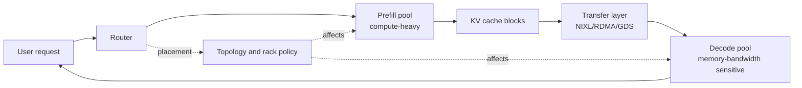
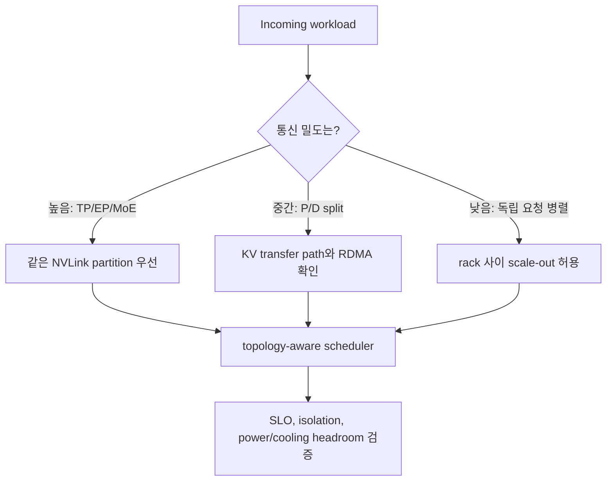

# Rack-Scale Hardware and Networking

## 수업 개요
이 챕터는 LLM serving을 `한 서버에서 돌아가는 엔진`이 아니라 `rack, GPU fabric, network, memory hierarchy, power/cooling`이 함께 만드는 시스템으로 다시 본다. 2026년 상반기의 중요한 신호는 분명하다. vLLM의 disaggregated prefilling은 prefill 인스턴스와 decode 인스턴스 사이에서 KV cache를 옮기는 구조를 공식 기능으로 다루고 [S1], NVIDIA NIXL은 분산 inference에서 point-to-point data transfer를 별도 라이브러리 문제로 끌어올렸다 [S2]. 동시에 GB300 NVL72 같은 rack-scale 시스템은 72개 GPU, NVLink switch, liquid cooling, rack 단위 scheduling을 전면에 둔다 [S3][S4][S5][S6]. 따라서 LLM serving을 제대로 이해하려면 `어떤 커널이 빠른가` 옆에 `어떤 fabric 안에 배치됐는가`를 함께 물어야 한다.

## 학습 목표
- scale-up fabric, scale-out network, KV transfer가 LLM serving SLO에 어떻게 연결되는지 설명할 수 있다.
- prefill/decode disaggregation이 왜 네트워크와 memory ownership 문제를 만든다는 점을 말할 수 있다.
- rack-scale 시스템에서 GPU 개수보다 topology-aware placement가 중요한 이유를 설명할 수 있다.
- power, cooling, HBM capacity, RDMA 같은 하드웨어 조건을 `운영 지표`로 바꿔 읽을 수 있다.

## 수업 전에 생각할 질문
- 같은 16 GPU 요청이라도 한 NVLink domain 안에 놓였는지, 서로 다른 rack에 흩어졌는지에 따라 왜 결과가 달라질까?
- KV cache transfer가 빠르지 않으면 disaggregated prefill/decode는 어떤 방식으로 tail latency를 악화시킬까?
- "GPU가 남아 있다"는 말과 "그 요청을 넣어도 SLO가 유지된다"는 말은 왜 다른가?

## 강의 스크립트
### Part 1. Serving의 최소 단위가 서버에서 rack으로 올라간다
**교수자:** 예전에는 LLM serving을 한 서버 안의 GPU 몇 장 문제로 설명해도 꽤 많은 것을 말할 수 있었습니다. 그런데 긴 문맥, reasoning, MoE, disaggregated serving이 겹치면 최소 단위가 커집니다. 이제 질문은 "몇 GPU인가"가 아니라 "이 GPU들이 어떤 fabric 안에서 서로 이야기하는가"입니다.

**학습자:** rack을 물리 장비 묶음이 아니라 scheduling 단위로 봐야 하는 이유가 있나요?

**교수자:** 맞습니다. NVIDIA의 rack-scale 자료는 GB300 NVL72를 liquid-cooled rack-scale architecture로 설명하고, 72개 Blackwell Ultra GPU와 36개 Grace CPU를 한 platform으로 묶습니다 [S4]. NVL72 AI Factory 문서는 각 rack에 9개 NVLink fifth-generation switch tray가 있고, 72 GPU가 fully connected L1 domain을 이룰 수 있다고 설명합니다 [S3]. 이 정도면 rack은 배선 상자가 아니라 scheduling과 isolation의 단위입니다.

#### 핵심 수식 1. Rack-aware request cost
$$
C_{\mathrm{serve}} =
C_{\mathrm{compute}} +
C_{\mathrm{kv\_move}} +
C_{\mathrm{fabric\_hop}} +
C_{\mathrm{power\_cooling}} +
C_{\mathrm{isolation}}
$$

**교수자:** 단일 서버 관점에서는 $C_{\mathrm{compute}}$가 크게 보입니다. 하지만 disaggregated serving과 rack-scale 배치에서는 KV 이동, fabric hop, 전력/냉각 여유, isolation 비용이 같이 올라옵니다. 이 항목들을 보지 않으면 "GPU utilization은 높은데 p95가 왜 나쁘지?"라는 질문에 답하기 어렵습니다.

### Part 2. Disaggregated serving은 KV cache transfer 설계다
**학습자:** prefill/decode 분리는 앞 챕터에서도 봤습니다. rack 관점에서는 뭐가 달라지나요?

**교수자:** 달라지는 핵심은 ownership입니다. vLLM 문서는 disaggregated prefilling을 prefill instance와 decode instance 두 개로 구현하고, connector를 사용해 prefill KV cache와 결과를 decode instance로 옮긴다고 설명합니다 [S1]. 이 순간 KV cache는 단순한 GPU 메모리 객체가 아니라, 네트워크를 건너야 하는 운영 자산이 됩니다.

**학습자:** 그래서 NIXL 같은 라이브러리가 중요해지는 거군요.

**교수자:** 그렇습니다. NIXL은 distributed AI inference에서 point-to-point data transfer를 통합하고 가속하기 위한 open source data movement library로 소개됩니다 [S2]. RDMA, GPU-initiated networking, GPU-Direct storage 같은 backend 기술을 다룬다는 점도 중요합니다 [S2]. 즉 2026년 상반기 LLM serving 키워드 중 하나는 `KV transfer가 scheduler의 하위 구현이 아니라 독립 병목`이 됐다는 것입니다.

### Part 3. Scale-up과 scale-out을 같은 네트워크로 착각하면 안 된다
**교수자:** GPU가 많다는 말은 두 가지로 나뉩니다. 첫째, 한 rack 안에서 고대역폭/저지연으로 묶인 scale-up fabric입니다. 둘째, rack 사이를 잇는 scale-out network입니다. 둘 다 중요하지만 성격이 다릅니다.

**학습자:** 어떤 요청은 scale-up 안에 묶어야 하고, 어떤 요청은 scale-out으로 넓혀도 된다는 뜻인가요?

**교수자:** 정확합니다. NVL72 문서는 rack 안에서 NVLink switch를 통해 72 GPU L1 domain을 만들 수 있다고 설명합니다 [S3]. 반면 GB300 NVL72 페이지는 Quantum-X800 InfiniBand 또는 Spectrum-X Ethernet, ConnectX-8 SuperNIC, RDMA를 AI workload 효율의 요소로 둡니다 [S4]. 한 문장으로 줄이면 이렇습니다. `TP/EP처럼 촘촘히 통신하는 일은 fabric 안에 가깝게, 독립 요청 병렬성은 network 밖으로 넓게`가 기본 감각입니다.

| 배치 질문 | 먼저 보는 하드웨어 축 | serving에서 보이는 증상 |
| --- | --- | --- |
| TP/EP shard를 어디에 둘까 | NVLink domain, rack partition | all-reduce, all-to-all, expert routing 지연 |
| prefill과 decode를 분리할까 | KV transfer path, RDMA, NUMA | TTFT와 ITL 사이 tradeoff |
| prefix cache를 공유할까 | cache ownership, CPU/disk tier, network hop | cache hit는 높지만 tail latency가 나빠질 수 있음 |
| workload를 어느 rack에 넣을까 | power/cooling headroom, isolation | throttling, noisy neighbor, SLO 회귀 |

### Part 4. Topology-aware scheduling은 선택 기능이 아니라 안전장치다
**학습자:** Kubernetes나 Slurm 같은 scheduler는 GPU 개수만 보면 되는 것 아닌가요?

**교수자:** 2026년 rack-scale 환경에서는 부족합니다. NVIDIA의 rack-scale scheduling 글은 flat GPU pool로 보면 계층적이고 topology-sensitive한 설계를 놓친다고 설명합니다 [S6]. 또 cluster UUID와 clique ID 같은 식별자가 NVLink domain과 partition을 scheduler가 이해할 수 있는 정보로 올려 준다고 설명합니다 [S6].

**학습자:** scheduler가 GPU 수뿐 아니라 GPU 사이 거리까지 알아야 하는 이유가 tail latency 때문인가요?

**교수자:** 맞습니다. 같은 16 GPU도 한 NVLink partition 안에 있으면 고대역폭 block처럼 움직이지만, rack 경계를 잘못 넘으면 통신 비용과 예측 불가능성이 커집니다. serving팀 입장에서는 topology-aware placement를 "인프라팀의 고급 기능"이 아니라 SLO 관리 기능으로 봐야 합니다.

### Part 5. Power와 cooling도 serving 지표다
**교수자:** 마지막으로 전력과 냉각을 빼면 rack-scale serving을 반만 이해한 겁니다. GB300 NVL72는 liquid-cooled rack-scale architecture로 소개되고, performance per megawatt 같은 표현이 함께 등장합니다 [S4]. 이것은 전력/냉각이 시설팀 메모가 아니라 inference capacity의 일부라는 뜻입니다.

**학습자:** serving 엔지니어가 냉각까지 알아야 하나요?

**교수자:** 모든 배관 도면을 외울 필요는 없습니다. 다만 SLO 회귀를 볼 때 `thermal throttling`, rack power cap, cooling redundancy, per-MW throughput을 질문할 수 있어야 합니다. 특히 reasoning workload처럼 test-time compute가 늘어나는 서비스에서는 순간 GPU 여유보다 전력/냉각 headroom이 먼저 한계가 될 수 있습니다.

#### 핵심 수식 2. Useful tokens per facility budget
$$
\mathrm{UsefulTPS}_{\mathrm{facility}} =
\frac{\mathrm{accepted\ tokens/sec} \times \mathrm{SLO\ pass\ rate}}
{\mathrm{rack\ power} + \mathrm{cooling\ overhead} + \mathrm{network\ overhead}}
$$

**교수자:** 이 식은 표준 지표가 아니라 수업용 모델입니다. 하지만 사고방식은 중요합니다. 2026년의 serving 최적화는 GPU 한 장의 kernel speed만이 아니라, facility budget 안에서 쓸 수 있는 token을 얼마나 안정적으로 만드는가로 이동하고 있습니다.

## 자주 헷갈리는 포인트
- disaggregated prefill/decode는 단순히 worker를 둘로 나누는 기능이 아니라 KV cache ownership과 transfer path를 새로 설계하는 일이다 [S1][S2].
- rack-scale GPU는 flat pool이 아니다. NVLink domain, partition, rack boundary를 모르면 같은 GPU 수라도 SLO가 달라질 수 있다 [S3][S6].
- RDMA나 NIXL은 "네트워크가 빠르다"는 일반론이 아니라 KV cache 이동이 tail latency를 좌우한다는 구체적인 문제에서 중요해진다 [S2].
- power/cooling은 운영비 항목이면서 동시에 throughput과 p95 latency를 제한하는 capacity 항목이다 [S4].
- topology-aware scheduling은 training 전용 주제가 아니다. MoE serving, disaggregated serving, long-context serving에서도 placement 품질이 직접 영향을 준다 [S5][S6].

## 사례로 다시 보기
### 사례 1. GPU는 남는데 첫 토큰이 늦다
긴 문서 요약 서비스가 prefill과 decode를 분리했다. 평균 GPU utilization은 좋아졌지만, prefill worker가 만든 KV cache가 decode worker로 늦게 넘어가 p95 TTFT가 나빠졌다. 이때 볼 것은 단순 GPU 잔여량이 아니라 KV transfer path, RDMA 설정, prefill/decode placement, 같은 rack 안의 network hop이다 [S1][S2].

### 사례 2. MoE serving에서 expert parallel이 흔들린다
MoE 모델을 여러 node에 펼쳤는데 all-to-all 통신이 rack 경계를 자주 넘었다. 평균 처리량은 벤치마크와 비슷해도 tail latency가 불안정했다. 이 경우 expert parallel 배치를 NVLink partition 안으로 묶거나, topology-aware scheduler가 rack boundary를 명시적으로 이해하게 해야 한다 [S5][S6].

### 사례 3. Reasoning workload가 갑자기 facility 문제로 보인다
test-time compute가 늘어나는 reasoning 서비스는 단순 batch 크기 조정으로 해결되지 않을 수 있다. GB300 NVL72 같은 시스템이 AI reasoning과 per-MW throughput을 함께 강조하는 이유는, 연산 수요가 커질수록 전력/냉각 headroom이 serving capacity의 일부가 되기 때문이다 [S4].

## 핵심 정리
- 2026년 상반기 LLM serving의 중요한 키워드는 `disaggregated serving`, `KV transfer`, `NIXL/RDMA`, `topology-aware scheduling`, `rack-scale liquid cooling`, `scale-up vs scale-out fabric`, `MoE/expert parallel placement`다.
- prefill/decode를 분리하면 scheduler 문제와 network 문제를 동시에 얻는다. 이득은 workload가 맞고 KV 이동이 충분히 빠를 때 살아난다 [S1][S2].
- NVL72 같은 rack-scale 시스템에서는 rack이 단순 물리 단위가 아니라 GPU fabric, memory sharing, isolation, scheduling의 단위다 [S3][S6].
- serving SLO는 GPU kernel, KV cache, network hop, power/cooling headroom을 함께 봐야 한다.

## 복습 체크리스트
- scale-up fabric과 scale-out network의 차이를 LLM serving 예시로 설명할 수 있는가?
- disaggregated serving에서 KV cache transfer가 왜 독립 병목이 되는지 말할 수 있는가?
- topology-aware placement가 없는 scheduler가 어떤 식으로 tail latency를 만들 수 있는지 설명할 수 있는가?
- power/cooling headroom을 serving capacity의 일부로 설명할 수 있는가?
- MoE/expert parallel serving에서 rack boundary가 왜 중요한지 말할 수 있는가?

## 출처
| 번호 | 제목 | 발행 주체 | 날짜 | URL | 사용 이유 |
| --- | --- | --- | --- | --- | --- |
| [S1] | Disaggregated Prefilling (experimental) | vLLM project | 2026-06-16 (accessed) | [https://docs.vllm.ai/en/latest/features/disagg_prefill/](https://docs.vllm.ai/en/latest/features/disagg_prefill/) | prefill/decode 인스턴스와 KV cache transfer 구조의 직접 근거 |
| [S2] | Enhancing Distributed Inference Performance with the NVIDIA Inference Transfer Library | NVIDIA Developer Blog | 2026-03-17 | [https://developer.nvidia.com/blog/enhancing-distributed-inference-performance-with-the-nvidia-inference-transfer-library/](https://developer.nvidia.com/blog/enhancing-distributed-inference-performance-with-the-nvidia-inference-transfer-library/) | NIXL, RDMA, point-to-point transfer를 KV 이동 병목과 연결 |
| [S3] | System Hardware & Components: NVIDIA NVL72 AI Factory | NVIDIA Enterprise Reference Architecture | 2026-06-16 (accessed) | [https://docs.nvidia.com/enterprise-reference-architectures/nvl72-ai-factory/latest/components.html](https://docs.nvidia.com/enterprise-reference-architectures/nvl72-ai-factory/latest/components.html) | GB300 NVL72 rack의 NVLink switch tray와 72 GPU L1 domain 설명 |
| [S4] | NVIDIA GB300 NVL72 | NVIDIA | 2026-06-16 (accessed) | [https://www.nvidia.com/en-us/data-center/gb300-nvl72/](https://www.nvidia.com/en-us/data-center/gb300-nvl72/) | liquid-cooled rack-scale architecture, reasoning inference, per-MW 성능 맥락 |
| [S5] | How NVIDIA Dynamo 1.0 Powers Multi-Node Inference at Production Scale | NVIDIA Developer Blog | 2026-03-10 | [https://developer.nvidia.com/blog/nvidia-dynamo-1-production-ready/](https://developer.nvidia.com/blog/nvidia-dynamo-1-production-ready/) | disaggregated serving과 wide expert parallel 조합이 production-scale inference 이슈로 올라온 근거 |
| [S6] | Running AI Workloads on Rack-Scale Supercomputers | NVIDIA Developer Blog | 2026-04-07 | [https://developer.nvidia.com/blog/running-ai-workloads-on-rack-scale-supercomputers-from-hardware-to-topology-aware-scheduling/](https://developer.nvidia.com/blog/running-ai-workloads-on-rack-scale-supercomputers-from-hardware-to-topology-aware-scheduling/) | topology-aware scheduling, NVLink domain/partition, scheduler abstraction 보강 |
