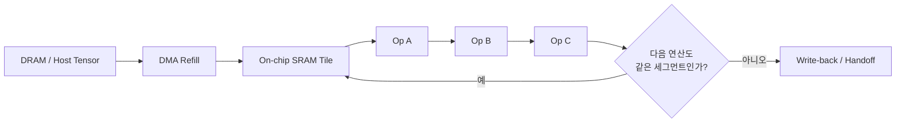
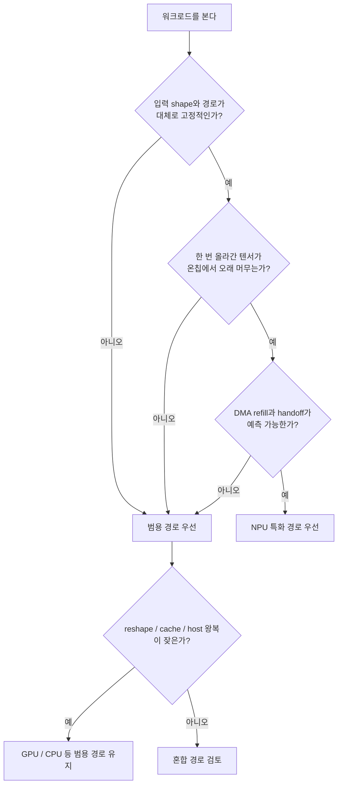
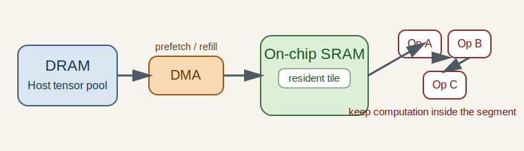
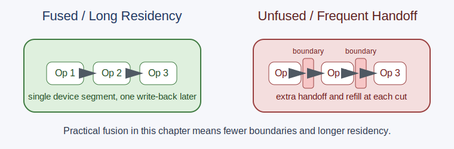

# NPU Architecture Basics

## 수업 개요
이번 장은 NPU를 스펙표로 외우기보다, runtime 문서가 직접 말하는 offload/target/cache 사실과 그 위에 얹는 수업용 해석을 분리해서 읽는 연습에 가깝다. [S2]와 [S4]는 NPU offload, device target, compile/cache 경로를 설명하는 runtime 문서이고, [S3]는 같은 모델도 target runtime과 device에 맞춰 별도 artifact로 굳어질 수 있음을 보여 준다. 그 사실 위에서 이 장은 `온칩에 얼마나 오래 머무는가`, `데이터를 다시 채우는 리듬이 얼마나 일정한가`, `여러 연산을 한 세그먼트로 오래 붙들 수 있는가`를 수업용 해석 프레임으로 쓴다 [합성] [S2] [S3] [S4].

## 학습 목표
- SRAM, DMA, fusion을 따로 외우지 않고 `on-chip residency`라는 한 장면으로 묶어 설명한다.
- [S2], [S3], [S4]를 근거로 `특화 효율과 범용성`의 선택 기준을 말할 수 있다.
- GPU와 NPU를 단순 속도 비교가 아니라 execution model 차이로 구분한다.
- 고정 shape와 긴 resident path가 있는 워크로드, 반대로 reshape·cache·host 왕복이 많은 워크로드를 가려낸다.

## 수업 전에 생각할 질문
- NPU 문서에서 제일 먼저 봐야 하는 것은 TOPS일까, 아니면 한 번 들어간 세그먼트가 얼마나 오래 유지되는지일까?
- 같은 모델이라도 어떤 경로는 NPU에 잘 맞고 어떤 경로는 host 왕복 때문에 범용 경로가 더 자연스러운 이유는 무엇일까?
- on-device GenAI 시대에 NPU가 `LLM 전체`보다 `일부 반복 블록`의 보조 장치로 먼저 읽히는 이유는 무엇일까?

## 강의 스크립트
### Part 1. 이 장에서 SRAM과 DMA를 읽는 방식
**학습자:** NPU 아키텍처라고 하면 보통 코어 수나 TOPS를 먼저 떠올리는데, 이 장은 왜 SRAM과 DMA부터 보나요?

**교수자:** 이번 source pack은 벤더별 SRAM 용량표나 DMA 채널 수를 주지 않습니다. 대신 [S2]는 execution provider가 일부 graph를 QNN backend로 맡기는 구조를, [S4]는 NPU device target과 compile/cache 경로를, [S3]는 target runtime별 compile artifact를 보여 줍니다. 여기까지가 source가 직접 주는 사실입니다. 그 사실을 바탕으로 이 장은 NPU의 가치를 `한 번 NPU 경로에 들어간 계산이 얼마나 길게 유지되는가`로 읽는 수업용 해석을 씁니다 [합성] [S2] [S3] [S4].

**학습자:** 그러면 SRAM과 DMA는 벤더 스펙이 아니라 해석 도구라는 뜻이군요?

**교수자:** 맞아요. 이 장에서는 이렇게 제한해서 씁니다. SRAM은 `중간 텐서를 가능한 오래 붙잡아 두는 온칩 작업 공간`, DMA는 `그 작업 공간을 다시 채우는 리듬`, fusion은 `그 공간에서 다음 연산까지 이어 붙이는 방법`입니다. 이 표현은 벤더가 직접 정의한 용어집이 아니라, [S2]와 [S4]의 offload/compile 설명을 문서 해석용으로 단순화한 수업용 프레임입니다 [합성] [S2] [S4].

#### 핵심 수식 1. resident 구간이 길수록 NPU 경로가 안정적이라고 보는 학습용 식
$$
R_{\mathrm{resident}} =
\frac{T_{\mathrm{onchip}}}
{T_{\mathrm{onchip}} + T_{\mathrm{refill}} + T_{\mathrm{handoff}}}
$$

여기서 `T_onchip`은 한 세그먼트가 온칩에서 이어지는 시간, `T_refill`은 다시 채우는 시간, `T_handoff`는 host나 다른 경로로 넘기는 시간이다. 이 식은 [S2], [S3], [S4]의 offload/target/artifact 설명을 한 장면으로 묶기 위한 학습용 식이며, source가 직접 제시한 공식은 아니다 [합성] [S2] [S3] [S4]. 이 장에서는 `R_resident`가 클수록 NPU 친화적인 구조라고 읽는다.

**교수자:** 이 그림에서 좋은 경로는 `C -> D -> E -> F -> C`가 길게 반복되는 경우입니다. NPU는 대개 이 반복을 길게 만들 때 특화 효율이 살아나고, `H`가 자주 등장할수록 범용 경로의 장점이 다시 커집니다.

### Part 2. fusion은 연산 합치기가 아니라 머무는 시간 늘리기다
**학습자:** operator fusion을 compiler 편의 기능으로만 보면 부족하다는 말이 이 뜻이었군요.

**교수자:** 그렇습니다. [S1]이 ONNX graph를 공통 연산 그래프로 제공하고, [S2]와 [S4]가 그 그래프의 일부를 NPU 경로로 맡기거나 compile하는 문서라는 점이 source가 직접 주는 사실입니다. 그 사실을 합쳐 이 장은 fusion의 실무적 의미를 `중간 텐서를 밖으로 내보내지 않고 다음 연산으로 이어 붙일 수 있는가`로 해석합니다 [합성] [S1] [S2] [S4]. 이 source pack만으로 특정 벤더가 어떤 fusion rule을 갖는지 단정할 수는 없지만, 긴 offload 세그먼트가 이득이라는 방향성은 충분히 읽을 수 있습니다.

**학습자:** 결국 같은 `MatMul -> Add -> Activation`이라도 어떤 경로는 한 덩어리처럼 읽고, 어떤 경로는 중간에 자를 수 있겠네요.

**교수자:** 바로 그 차이가 NPU 사고방식입니다. GPU에서는 커널을 여러 번 호출해도 꽤 자연스러운 경우가 많지만, NPU에서는 중간 결과를 반복해서 밖으로 내보낼수록 `특화 효율`이 희미해집니다. 이 역시 특정 벤더의 보편 공식이 아니라 [S2], [S4]의 offload 경계를 읽기 위해 도입한 수업용 판단 기준입니다 [합성] [S2] [S4]. 그래서 이 장에서 fusion은 연산 개수 절감보다 `resident 구간 연장`으로 설명하는 편이 더 정확합니다.

### Part 3. DMA 리듬이 깨지면 범용 경로가 다시 유리해진다
**학습자:** 그러면 DMA는 단순 복사 엔진이 아니라 resident 구간을 유지하게 만드는 장치라고 봐야 하나요?

**교수자:** 이 장에서는 그렇게 이해하면 됩니다. 고정 shape, 반복 패턴, 예측 가능한 tensor 크기에서는 refill 리듬이 단순해집니다. 반대로 reshape가 자주 끼고, cache 관리나 host 제어가 잦고, 다음 연산이 어떤 shape로 이어질지 자주 바뀌면 refill 리듬이 흔들립니다. [S3]가 target runtime/device별 compile artifact를 보여 준다는 사실 위에서, 이 장은 `안정적 경로일수록 artifact 재사용 이점이 커진다`고 해석합니다 [합성] [S3].

**학습자:** 그럼 `NPU에 넣을 수 있느냐`보다 `NPU에 넣었을 때 리듬이 유지되느냐`가 더 앞선 질문이겠네요.

**교수자:** 그렇죠. 이 챕터의 tradeoff가 `특화 효율과 범용성`인 이유가 바로 여기에 있습니다. 특화 경로는 리듬이 고정될수록 강해지고, 범용 경로는 흐름이 흔들려도 버티는 쪽에 강합니다.

#### 핵심 수식 2. NPU 선택에서 경계 비용까지 같이 보는 학습용 식
$$
\Delta_{\mathrm{specialize}} =
T_{\mathrm{generic}}
- \left(
T_{\mathrm{npu}}
+ N_{\mathrm{refill}} \cdot T_{\mathrm{dma}}
+ N_{\mathrm{handoff}} \cdot T_{\mathrm{boundary}}
\right)
$$

`Δ_specialize > 0`이면 특화된 NPU 경로가 이득이고, `Δ_specialize <= 0`이면 범용 경로의 유연성이 더 낫다. 이 식은 [S2], [S3], [S4]가 설명하는 offload/compile/cache 경계를 비용 항으로 단순화한 학습용 식이며, 문서의 직접 공식은 아니다 [합성] [S2] [S3] [S4]. 이 식의 핵심은 `N_refill`과 `N_handoff`다. 이번 장에서는 unsupported op 개수보다 이 두 항을 더 앞에 둔다.

### Part 4. 특화 효율과 범용성의 선택 규칙
**학습자:** 실무에서는 어떤 신호가 보이면 `이건 NPU 쪽`, `이건 범용 경로 쪽`이라고 판단하나요?

**교수자:** 아래 네 줄은 source 원문을 그대로 옮긴 체크리스트가 아니라, [S2], [S3], [S4]를 읽을 때 쓰는 이 장의 수업용 선택 규칙입니다. 직접 source가 말하는 것은 offload 경계, target/runtime, compile artifact 경로이고, `무엇을 먼저 고른다`는 우선순위는 그 사실 위에 얹는 합성 판단입니다 [합성] [S2] [S3] [S4].

- 입력 shape가 거의 고정되고, 한 번 올라간 텐서가 온칩에서 여러 연산을 연달아 거치며, host handoff가 적으면 NPU 쪽으로 기운다.
- DMA refill이 예측 가능하고, 같은 패턴이 프레임마다 반복되며, compile artifact를 오래 재사용할 수 있으면 NPU 쪽으로 기운다. [S3]
- 반대로 불규칙 제어 흐름, 잦은 reshape, cache 갱신, host 왕복, 세그먼트 사이 상태 의존성이 많으면 범용 경로가 더 자연스럽다.
- [S2]와 [S4]처럼 runtime/provider가 `어디까지 device에 맡길지`를 설명하는 문서가 나올 때는, 지원 여부보다 `맡긴 뒤 오래 유지되는가`를 먼저 본다.

**교수자:** 02장은 graph와 lowering 경계를 더 깊게 보겠지만, 이 장의 첫 질문은 다릅니다. `지원하지 않는 op가 몇 개인가`보다 `resident 구간이 얼마나 길고 refill 리듬이 얼마나 단순한가`를 먼저 봅니다.

### Part 5. 사례 1. 스마트폰 카메라 보정 파이프라인
**교수자:** 첫 사례는 스마트폰 카메라 보정입니다. 해상도가 비교적 고정되고, conv 계열 블록이 반복되며, 프레임마다 비슷한 흐름이 재현됩니다. 이런 구조는 `온칩에 올린 뒤 몇 단계 더 처리하고 내보내는` 그림을 만들기 쉽습니다. ONNX Runtime QNN EP와 OpenVINO NPU 문서가 공통으로 강조하는 것은 바로 이런 device offload/target이 성립하는 안정적 세그먼트의 존재입니다 [S2][S4].

**학습자:** 그러면 이 경우의 핵심 질문은 `지원 op가 충분한가`보다 `얼마나 오래 resident 상태를 유지하느냐`겠네요.

**교수자:** 맞습니다. 고정 shape, 반복 블록, 적은 handoff, 단순한 refill 리듬은 NPU 특화 효율을 밀어 줍니다.

### Part 6. 사례 2. AI PC 회의 요약 보조 기능
**교수자:** 두 번째는 on-device GenAI가 붙은 회의 요약 보조 기능입니다. 음성 인코더, 텍스트 전처리, 토큰 생성, cache 관리, 후처리가 섞이면 resident path가 자주 끊깁니다. Qualcomm AI Hub의 compile artifact 흐름과 OpenVINO의 device target 문서를 같이 읽으면, 이런 경우 NPU는 `전체 생성 루프`보다 일부 반복 블록의 보조 장치로 읽는 편이 자연스럽습니다 [S3][S4][합성].

**학습자:** 최신성 문장에서 말한 `vision 전용 장치에서 LLM 보조 장치로 이동 중`이라는 문장이 바로 이런 뜻이군요.

**교수자:** 그렇죠. [S3]가 장치별 compile artifact를 보여 주고, [S2]/[S4]가 device offload와 target을 설명한다고 해서 모든 생성 경로가 그대로 NPU에 잘 맞는다는 뜻은 아닙니다. 고정 shape가 길게 유지되는 encoder/projection 계열은 후보가 될 수 있지만, 잦은 cache handoff와 host 개입이 필요한 루프는 범용 경로가 더 안정적일 수 있습니다.

### Part 7. 문서를 읽는 순서
**학습자:** 실제 문서를 펴면 어디부터 읽어야 하나요?

**교수자:** 순서를 고정해 두면 좋습니다.

1. [S1]에서 ONNX graph와 operator 구성을 본다. 어디가 길게 이어질 만한 블록인지 먼저 찾는다.
2. [S2]와 [S4]에서 execution provider나 NPU target이 그 블록을 얼마나 오래 device 경로로 묶을 수 있는지 본다.
3. [S3]에서 compile artifact가 target runtime/device와 얼마나 강하게 묶이는지 확인한다.

**교수자:** 이 순서를 지키면 NPU를 `스펙 좋은 칩`이 아니라 `특정 그래프를 오래 resident 상태로 유지시키는 경로`로 읽게 됩니다.

## 자주 헷갈리는 포인트
- 이 source pack은 벤더별 SRAM 용량표를 주지 않는다. 그래서 SRAM은 여기서 `온칩 작업 공간`이라는 해석 틀로만 쓴다.
- DMA는 복사 속도 자랑 포인트가 아니라 `refill 리듬이 예측 가능한가`를 보는 질문이다.
- fusion은 연산 이름을 줄이는 기교보다 `중간 텐서를 밖으로 덜 내보내는가`로 이해해야 한다.
- unsupported op 개수는 보조 신호다. 이번 장에서 더 먼저 보는 것은 `resident 구간 길이`와 `handoff 빈도`다.
- NPU의 장점은 항상 더 빠르다는 뜻이 아니라, 고정되고 반복되는 경로에서 `특화 효율`을 크게 만든다는 뜻이다.

## 사례로 다시 보기
카메라 보정은 고정 shape와 반복 블록 덕분에 resident 구간을 길게 만들기 쉽다. 그래서 DMA refill도 규칙적으로 해석할 수 있고, 특화된 compile/offload 경로가 의미를 갖는다. 여기서 `resident 구간이 길면 유리하다`는 결론은 source의 직접 문장이라기보다 QNN EP의 offload 설명, AI Hub의 target-specific compile artifact, OpenVINO의 NPU target 문서를 함께 읽어 얻는 수업용 해석이다 [합성] [S2] [S3] [S4].

회의 요약 보조 기능은 일부 블록만 보면 NPU 후보가 될 수 있지만, 전체 루프는 reshape, cache, host 제어가 섞여 resident 구간이 쉽게 끊긴다. 그래서 이번 장의 선택 기준은 `NPU를 쓸 수 있나`가 아니라 `어디까지를 NPU에 맡기는 것이 범용성 손실보다 큰 이득을 주나`다. 이 문장은 QNN EP의 partition 현실, AI Hub의 artifact 분화, OpenVINO의 target 제약을 제품 질문으로 묶은 수업용 해석이다 [합성] [S2] [S3] [S4].

반대로 resident 구간이 짧아져 범용 경로가 더 낫게 되는 실패 장면도 있다. 예를 들어 회의 요약 보조 기능에서 encoder 뒤에 irregular reshape와 cache handoff가 잦아지면, [S2]의 provider partition은 잘게 쪼개지고 [S3]의 compile artifact 재사용 이점도 약해진다. 여기에 [S4]가 설명하는 device target 전환까지 잦아지면 `한 번 올려 오래 머문다`는 가정이 무너져 범용 경로가 더 안정적인 선택이 된다 [합성] [S2] [S3] [S4].

## 핵심 정리
- [S2]와 [S4]는 NPU microarchitecture 수치를 주는 문서가 아니라 offload, target, cache 경로를 설명하는 문서다. `긴 resident 세그먼트가 왜 중요한가`는 이 장이 그 사실 위에 올린 해석이다 [합성] [S2] [S4].
- [S1]은 어떤 연산 사슬이 존재하는지 보여 주고, [S2]/[S4]는 그 사슬을 device 경로로 얼마나 유지할 수 있는지 보여 준다.
- [S3]는 같은 모델도 target runtime/device에 맞춰 artifact가 달라질 수 있음을 보여 준다. `고정 shape와 안정적 실행 경로가 특화 효율을 키운다`는 문장은 그 사실을 묶은 수업용 해석이다 [합성] [S3].
- NPU 선택 기준은 `고정 shape`, `긴 on-chip residency`, `예측 가능한 DMA refill`, `적은 handoff` 쪽이면 특화 경로, `불규칙 제어`, `잦은 reshape/cache`, `빈번한 host 왕복`이면 범용 경로다. 이 기준표 자체도 [S2], [S3], [S4]를 요약한 수업용 프레임이다 [합성] [S2] [S3] [S4].
- on-device GenAI 시대의 NPU는 전체 모델의 대체재가 아니라, resident 구간이 긴 반복 블록을 맡는 보조 장치로 먼저 읽는 편이 안전하다.

## 복습 체크리스트
- SRAM, DMA, fusion을 `resident 구간`이라는 한 문장으로 묶어 설명할 수 있는가?
- [S2]와 [S4]를 마이크로아키텍처 문서가 아니라 offload/target 문서로 읽고 있다는 점을 이해했는가?
- 고정 shape와 규칙적 refill 리듬이 왜 NPU 쪽 신호인지 말할 수 있는가?
- reshape, cache, host 왕복이 왜 범용 경로 쪽 신호인지 사례로 설명할 수 있는가?
- 카메라 보정과 회의 요약 보조 기능을 `특화 효율과 범용성`의 tradeoff로 비교할 수 있는가?

## 대안과 비교
| 판단 질문 | NPU 특화 경로 쪽 신호 | 범용 경로 쪽 신호 | 대표 예시 |
| --- | --- | --- | --- |
| 입력 shape가 얼마나 고정적인가 | 프레임/배치 구조가 거의 고정 | 요청마다 길이와 shape가 크게 변함 | 카메라 보정 vs 대화형 생성 |
| on-chip residency를 길게 만들 수 있는가 | 한 번 올린 텐서가 여러 op를 연속 통과 | 중간 결과를 자주 내보내야 함 | fused conv 블록 vs 잦은 reshape 블록 |
| DMA refill 리듬이 예측 가능한가 | 같은 타일 패턴이 반복됨 | cache 상태와 분기 때문에 refill 타이밍이 흔들림 | 영상 파이프라인 vs token loop |
| host handoff가 얼마나 잦은가 | 세그먼트 경계가 적음 | 제어 로직과 상태 관리가 자주 개입 | 단일 vision block vs interactive assistant |
| compile artifact를 오래 재사용할 수 있는가 | target/device가 안정적이고 반복 배포 | 런타임 변수가 많아 경로가 자주 바뀜 | 고정 기능 앱 vs 다목적 워크로드 |
| tradeoff 해석 | 특화 효율이 범용성 손실보다 큼 | 범용성이 특화 효율보다 더 중요함 | 모바일 ISP 보조 vs 복합형 AI 앱 |

## 참고 이미지

- 참고 이미지 1 캡션: Part 1-3의 `좋은 NPU 경로는 DRAM에서 한 번 가져온 타일이 SRAM 안에서 여러 op를 거친 뒤에야 밖으로 나간다`는 주장과 연결된다. 즉 resident 구간과 DMA refill 리듬을 한 장면으로 보여 주는 로컬 도식이다.
- 출처 번호: [I1], [S2], [S3], [S4]

- 참고 이미지 2 캡션: Part 2와 Part 4의 `fusion은 연산 수를 줄이는 기교보다 boundary를 줄여 resident 구간을 길게 만드는 방식`이라는 주장과 연결된다. 오른쪽처럼 partition boundary가 잦아지면 특화 효율보다 범용성의 장점이 다시 커진다.
- 출처 번호: [I2], [S2], [S4]

## 출처
| 번호 | 제목 | 발행 주체 | 날짜 | URL | 사용 이유 |
| --- | --- | --- | --- | --- | --- |
| [S1] | Open Neural Network Exchange | ONNX | 2026-03-08 (accessed) | [https://onnx.ai/](https://onnx.ai/) | ONNX graph와 operator ecosystem의 기본 맥락 |
| [S2] | QNN Execution Provider | ONNX Runtime | 2026-03-08 (accessed) | [https://onnxruntime.ai/docs/execution-providers/QNN-ExecutionProvider.html](https://onnxruntime.ai/docs/execution-providers/QNN-ExecutionProvider.html) | QNN 기반 NPU offload와 실행 provider 구조 |
| [S3] | Compile examples | Qualcomm AI Hub | 2026-03-08 (accessed) | [https://app.aihub.qualcomm.com/docs/hub/compile_examples.html](https://app.aihub.qualcomm.com/docs/hub/compile_examples.html) | on-device compile/deploy 파이프라인의 대표 예시 |
| [S4] | NPU device | OpenVINO | 2026-03-08 (accessed) | [https://docs.openvino.ai/2025/openvino-workflow/running-inference/inference-devices-and-modes/npu-device.html](https://docs.openvino.ai/2025/openvino-workflow/running-inference/inference-devices-and-modes/npu-device.html) | Intel NPU target과 runtime mode 설명 |
