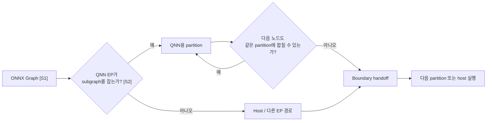
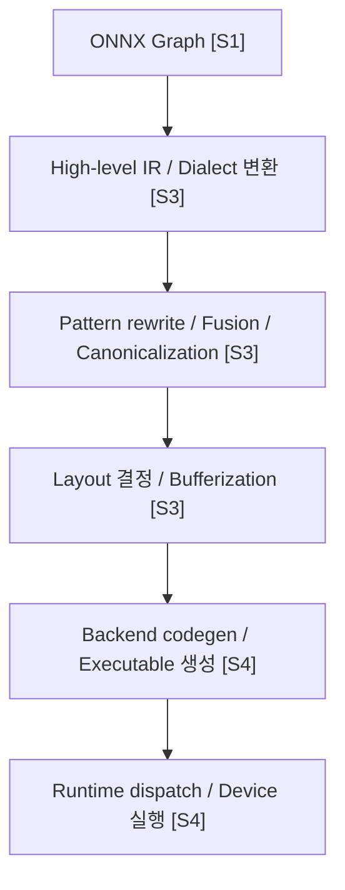
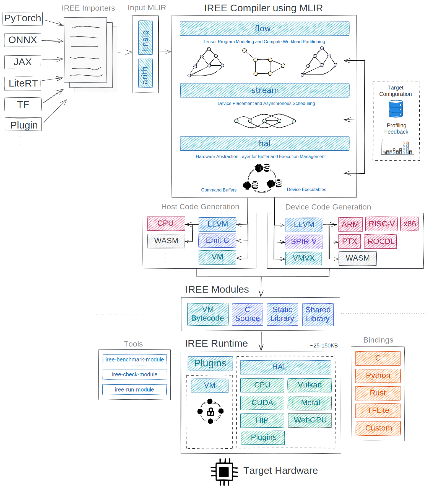

# ONNX Graph and Lowering

## 수업 개요
이 챕터는 `모델을 ONNX로 내보냈다`와 `실제 NPU backend에 잘 내려갔다` 사이에 있는 긴 구간을 해부한다. ONNX는 연산과 그래프를 교환하기 위한 표준 인터페이스이지만 [S1], 실전 배포에서는 execution provider가 graph를 분할하고 [S2], compiler가 더 낮은 IR로 legalize하며 [S3], 최종적으로는 backend 전용 executable이나 runtime artifact로 굳힌다 [S4]. 2026년의 실무 감각으로 보면, 생산성을 가르는 것은 ONNX export 성공 여부가 아니라 `표준 graph에서 vendor compiler로 넘어가는 경계`를 얼마나 잘 읽는가이다.

## 학습 목표
- ONNX를 배포 완료 지점이 아니라 `중간 표현`으로 설명할 수 있다.
- graph partition, layout 변환, lowering, unsupported op fallback이 하나의 실행 흐름에서 어떻게 이어지는지 말할 수 있다.
- ONNX Runtime QNN Execution Provider 경로와 MLIR/IREE 경로가 각각 어디에 초점을 두는지 비교할 수 있다.
- 표준 인터페이스를 유지할 때 얻는 이점과 backend 특화 최적화를 밀어 넣을 때 생기는 비용을 선택 기준으로 정리할 수 있다.

## 수업 전에 생각할 질문
- ONNX graph가 같아도 backend마다 실제 실행 경로가 달라지는 이유는 무엇인가?
- 어떤 segment를 NPU에 내리는 것이 계산량 때문이 아니라 `경계 비용` 때문에 손해가 될 수 있는가?
- layout 변환은 왜 compiler 내부 세부 구현이 아니라 end-to-end latency 문제인가?

## 강의 스크립트
### Part 1. ONNX는 종착역이 아니라 교차로다
**교수자:** ONNX를 처음 접하면 "이제 프레임워크 종속성에서 벗어났다"는 해방감이 듭니다. 그건 맞는 말이에요. ONNX는 모델 graph와 operator ecosystem을 공유하기 위한 강한 공통분모입니다 [S1]. 그런데 그 순간에 배포가 끝났다고 생각하면 바로 다음 단계에서 막힙니다. NPU는 ONNX graph를 그대로 삼키지 않고, 자기 backend가 먹기 좋은 조각으로 다시 나눕니다.

**학습자:** ONNX가 표준 포맷인데도 다시 나눈다는 건, 표준화가 충분하지 않다는 뜻인가요?

**교수자:** 표준화의 역할이 다르기 때문입니다. ONNX는 `서로 다른 도구가 모델 의미를 공유하게 만드는 계층`이고, lowering은 `그 의미를 특정 hardware가 실제 실행 가능한 형태로 재구성하는 계층`입니다. 전자는 이식성을 주고, 후자는 성능을 만듭니다. 둘은 경쟁 관계가 아니라 연속된 단계예요.

**교수자:** 그래서 이 챕터의 첫 문장은 이렇게 잡으면 좋습니다. `ONNX는 끝점이 아니라 vendor path로 진입하는 교차로다.` QNN Execution Provider 문서를 읽을 때는 어떤 노드가 QNN 쪽으로 오프로딩되는지를 보고 [S2], MLIR 문서를 읽을 때는 high-level op가 어떻게 더 낮은 표현으로 바뀌는지를 본다 [S3]. IREE는 그 lowering 체인이 runtime과 어떻게 만나는지 보여 주는 사례다 [S4].

### Part 2. 첫 번째 현실은 graph partition이다
**학습자:** 그러면 실제 실행에서 가장 먼저 벌어지는 일은 lowering이 아니라 partition인가요?

**교수자:** ONNX Runtime 같은 계층을 쓰면 그렇다고 보는 편이 좋습니다. execution provider는 `이 그래프 전체를 한 번에 넘길 수 있는가`가 아니라 `어떤 subgraph를 내 backend로 맡길 수 있는가`를 판단합니다 [S2]. 여기서 실무자가 많이 놓치는 게 있습니다. 지원되는 op 개수만 세면 안 되고, `분할 결과가 몇 개의 segment를 만드는가`를 봐야 해요.

#### 핵심 수식 1. 오프로딩이 이득인지 판단하는 식
$$
\mathrm{Benefit}_{\mathrm{offload}} =
T_{\mathrm{host\_only}}
- \left(
T_{\mathrm{npu\_segment}}
+ N_{\mathrm{boundary}} \cdot T_{\mathrm{handoff}}
+ T_{\mathrm{layout}}
\right)
$$

이 값이 양수면 NPU segment로 내리는 것이 이득이고, 음수면 계산 자체는 빨라도 boundary handoff와 layout 변환이 이득을 지워 버린다는 뜻이다.

**교수자:** 예를 들어 transformer block 일부가 `MatMul -> Add -> Activation`처럼 backend가 좋아하는 패턴이면 한 덩어리로 내려갈 수 있습니다. 반대로 중간에 custom op나 backend가 다루지 못하는 변형된 연산이 끼어 있으면 graph가 잘립니다. 문제는 잘린 조각 수가 늘어날수록 handoff가 늘고, 그때 tensor 복사와 동기화, 때로는 layout 재배치까지 함께 붙는다는 점이에요.

**학습자:** 그러면 unsupported op 하나가 있다고 해서 바로 실패는 아니지만, 잘못하면 segment 전체 수익을 없앨 수 있겠네요?

**교수자:** 정확합니다. `지원 여부`만 보면 낙관적으로 보이고, `경계 수`까지 보면 현실이 보입니다. QNN 계열에서는 특히 execution provider와 backend artifact의 연결을 같이 생각해야 합니다. 그래프가 깔끔하게 묶여야 context binary나 유사한 backend 전용 결과물을 재사용하기도 편해지거든요 [S2].

### Part 3. Lowering은 연산 이름을 바꾸는 작업이 아니다
**교수자:** partition 다음에는 본격적인 lowering 사고방식이 필요합니다. MLIR 문서가 중요한 이유는 lowering을 "하나의 거대한 점프"가 아니라 `여러 수준의 IR를 거치며 점진적으로 의미를 구체화하는 과정`으로 설명하기 때문입니다 [S3]. 여기서 legalize, canonicalize, dialect conversion, bufferization 같은 단어가 나옵니다.

**학습자:** ONNX op를 backend op로 치환하는 정도로 생각했는데, 그보다 훨씬 길군요.

**교수자:** 길고, 각 단계가 다른 질문에 답합니다. 어떤 단계는 `이 연산을 더 단순한 조합으로 풀 수 있는가`를 보고, 어떤 단계는 `텐서를 버퍼로 물질화해야 하는 시점이 언제인가`를 보고, 어떤 단계는 `하드웨어가 선호하는 메모리 배치가 무엇인가`를 봅니다. IREE 문서를 함께 보면 이 다단계 변환이 compiler 층과 runtime 층으로 나뉘어 만난다는 감각을 잡기 좋습니다 [S4].

#### 핵심 수식 2. Lowering 체인을 함수 합성으로 보기
$$
K_{\mathrm{backend}}
=
\left(f_{n-1} \circ \cdots \circ f_1 \circ f_0\right)
\left(G_{\mathrm{ONNX}}\right)
$$

여기서 각 \(f_i\)는 op legalization, shape 고정, layout 재작성, bufferization, code generation 같은 변환을 뜻한다. 중요한 점은 `ONNX graph 하나가 곧바로 kernel이 되지 않는다`는 사실이다.

**교수자:** 이 파이프라인을 볼 줄 알면 "왜 같은 ONNX인데 backend마다 결과가 다르지?"라는 질문에 답할 수 있습니다. 답은 간단합니다. `합성되는 함수열이 다르기 때문`입니다. 표준 입력은 같아도, 어디서 fusion을 하고 어떤 layout을 선호하며 어느 시점에 버퍼를 고정하는지가 다르면 결과 executable도 달라집니다.

### Part 4. Layout 변환은 숨은 비용이 아니라 노출된 비용이다
**학습자:** layout 변환은 compiler가 알아서 처리하는 뒷단 일이라고 생각했는데, 왜 이 챕터에서 그렇게 크게 다루나요?

**교수자:** NPU에서는 layout이 성능의 일부이기 때문입니다. backend는 channel-last를 좋아할 수도 있고, 타일 단위로 쪼갠 내부 배치를 좋아할 수도 있어요. 그런데 ONNX graph에는 그 backend의 취향이 그대로 드러나지 않습니다. 그래서 lowering 중간에 transpose, reshape 정규화, buffer 재배치가 끼어듭니다. 이때 변환이 segment 경계와 맞물리면 문제는 compiler 내부가 아니라 end-to-end latency가 됩니다.

**교수자:** 실무에서 흔한 실수는 `NPU compute 시간`만 보고 성공이라고 판단하는 겁니다. 하지만 layout 변환이 호스트 쪽에 남거나, partition 사이마다 다시 일어나면 compute 절감보다 이동 비용이 더 커질 수 있습니다. MLIR이 여러 dialect와 변환 패스를 명시적으로 보여 주는 이유도 이런 비용을 숨기지 않기 위해서라고 읽을 수 있습니다 [S3].

**학습자:** 그러면 layout 문제는 profiling 챕터에서만 다루는 게 아니라, 지금 lowering 단계에서 먼저 예측해야겠네요?

**교수자:** 맞아요. profiling은 증상을 확인하는 단계이고, lowering 이해는 원인을 예측하는 단계입니다. ONNX graph를 봤을 때 transpose나 shape manipulation이 자주 끼어드는 구조라면, backend가 좋아하는 data layout으로 안정적으로 접힐지 먼저 의심해야 합니다.

### Part 5. Unsupported op는 실패 지점이 아니라 디버깅 출발점이다
**교수자:** 이제 fallback 이야기를 해 봅시다. unsupported op를 보면 많은 사람이 "그러면 이 backend는 못 쓰겠네"라고 결론 내립니다. 그런데 실무에서는 그보다 먼저 두 가지를 묻습니다. 첫째, `정말 unsupported op 하나 때문에 큰 partition이 깨졌는가?` 둘째, `그 op를 더 이른 단계에서 rewrite하거나 분해할 수 있는가?`

**학습자:** unsupported op를 만나면 로그만 보고 끝내지 말고, graph 구조를 다시 봐야 한다는 말이군요.

**교수자:** 그렇습니다. 제가 보통 쓰는 순서는 이렇습니다.

1. execution provider가 잡은 partition 경계를 먼저 본다 [S2].
2. 깨진 지점 앞뒤에서 layout 변환이나 shape 조정이 늘어나는지 본다.
3. unsupported op를 ONNX 수준에서 더 일반적인 조합으로 바꿀 수 있는지 검토한다 [S1].
4. 그래도 안 되면 backend compiler 경로가 요구하는 더 낮은 IR 제약을 확인한다 [S3] [S4].

**교수자:** 이 순서를 거꾸로 하면, backend 내부를 의심하느라 시간을 쓰고도 실제 원인이 `graph가 너무 잘게 끊긴 것`이었다는 사실을 뒤늦게 발견하게 됩니다.

### Part 6. source별로 다른 lowering 감각을 잡자
**학습자:** 지금까지는 큰 흐름이었고, source마다 초점이 다른 부분을 한 번 정리해 보고 싶습니다.

**교수자:** 좋습니다. 이 챕터는 source별 역할을 명확히 나눠 읽어야 합니다.

- [S1] ONNX는 공통 graph와 operator 의미를 제공한다. 여기서는 `어떤 계산을 하고 싶은가`를 읽는다.
- [S2] QNN Execution Provider는 그 graph를 실제 NPU subgraph와 host 경계로 분할하는 현실을 보여 준다. 여기서는 `어디까지 내려가는가`를 읽는다.
- [S3] MLIR은 lowering이 다단계 IR 변환이라는 사실을 구조적으로 보여 준다. 여기서는 `어떻게 더 구체적인 표현으로 바꾸는가`를 읽는다.
- [S4] IREE는 compiler와 runtime이 만나는 아키텍처를 보여 준다. 여기서는 `그 결과물이 어떻게 실행 단위가 되는가`를 읽는다.

**교수자:** 같은 "NPU에 내린다"는 문장도 source마다 관찰 지점이 다릅니다. QNN EP 쪽은 partition과 provider 구성이 먼저 보이고 [S2], MLIR/IREE 쪽은 dialect와 lowering stage가 먼저 보입니다 [S3] [S4]. 둘을 섞어서 보면 ONNX가 왜 휴게소인지 감이 옵니다. 휴게소에서 모두가 같은 차로 출발하지만, 이후 차선과 톨게이트는 backend마다 다르다는 뜻이에요.

### Part 7. 두 가지 실전 사례
**교수자:** 사례를 두 개로 나눠 보겠습니다.

**사례 A. ONNX Runtime + QNN EP 경로**
스마트폰용 요약 모델을 ONNX로 export한 뒤 QNN EP로 실행한다고 합시다. projection과 activation이 잘 묶이는 구간은 QNN partition으로 내려갈 수 있습니다 [S2]. 그런데 중간에 backend가 직접 다루지 못하는 custom 연산이나 호환성이 낮은 변형 op가 끼면 host 경로가 생깁니다. 이때 봐야 할 것은 "오프로딩이 되었는가"가 아니라 "한 번 내려간 뒤 오래 머무르는가"입니다.

**사례 B. MLIR/IREE 중심 경로**
다른 팀은 ONNX를 출발점으로 삼되, 이후 compiler stack을 더 직접적으로 다루고 싶어 합니다. 이 경우 핵심 질문은 `어떤 dialect 변환에서 graph가 안정적으로 legalize되는가`, `bufferization과 layout 결정이 어느 단계에서 폭발하는가`입니다 [S3]. IREE 아키텍처를 보면 compiler 결과가 runtime dispatch 구조와 바로 연결되므로 [S4], lowering 설계가 곧 배포 설계가 됩니다.

**학습자:** 첫 번째 사례는 partition 감각이 중요하고, 두 번째 사례는 compiler pipeline 감각이 더 중요하네요.

**교수자:** 맞습니다. 같은 ONNX라도 어떤 스택 위에 서 있느냐에 따라 실무자의 질문 순서가 달라집니다.

### Part 8. 표준 인터페이스와 backend 최적화의 균형
**학습자:** 결국 tradeoff는 "표준을 유지할수록 편하지만 느릴 수 있고, backend 최적화를 넣을수록 빠르지만 종속성이 커진다" 정도로 정리하면 될까요?

**교수자:** 절반만 맞습니다. 더 정확히 말하면 이 tradeoff는 속도 대 이식성의 이분법이 아니라, `문제를 어느 계층에서 해결할 것인가`의 선택입니다. ONNX 수준에 오래 머물면 도구 호환성과 팀 간 전달은 쉬워집니다 [S1]. 하지만 partition 품질이나 layout 적합성이 나쁘면 execution provider 단계에서 비용이 드러납니다 [S2]. 반대로 compiler와 backend 제약을 일찍 받아들이면 더 깊은 최적화 여지가 생기지만, graph를 범용적으로 유지하기는 어려워집니다 [S3] [S4].

**교수자:** 그래서 2026년 실무자는 보통 이렇게 묻습니다. `이 모델을 표준 graph로 오래 들고 갈수록 이득인가, 아니면 특정 backend에 맞춰 더 일찍 구체화해야 하나?` 이 질문이 챕터 제목보다 더 중요합니다.

## 자주 헷갈리는 포인트
- ONNX 변환 성공은 배포 성공이 아니다. 실제 병목은 그 뒤의 partition과 lowering에서 생긴다.
- unsupported op 개수보다 `그 op가 만들어 내는 graph 경계 수`가 더 중요할 수 있다.
- layout 변환은 compiler 내부 구현 세부가 아니라 handoff 비용을 바꾸는 성능 변수다.
- execution provider는 단순 플러그인이 아니라 graph를 잘라 실제 실행 경계를 만드는 계층이다 [S2].
- MLIR/IREE를 읽을 때는 "새 프레임워크"로 보기보다 `lowering 단계를 드러내는 렌즈`로 보는 편이 이해에 도움이 된다 [S3] [S4].

## 사례로 다시 보기
첫 번째 장면은 모바일 NPU 경로다. ONNX graph가 QNN EP에 들어가면 support 여부에 따라 subgraph가 생기고, 그 결과가 깔끔하면 vendor backend 전용 artifact 재사용 가능성도 높아진다 [S2]. 여기서 실패 원인은 대개 unsupported op 자체보다 잦은 boundary handoff다.

두 번째 장면은 compiler 주도 경로다. ONNX graph를 MLIR 기반 pipeline으로 옮기면 high-level op를 더 낮은 dialect로 바꾸고, layout과 bufferization을 고정하며, 마지막에 runtime이 이해할 실행 단위로 만든다 [S3] [S4]. 여기서 실패 원인은 "ONNX가 안 된다"가 아니라 `lowering 단계 중 어디에서 의미 보존과 backend 제약이 충돌하는가`이다.

## 핵심 정리
- ONNX는 공통 입력 계층이고, 실제 성능과 배포 가능성은 그 이후 lowering 품질에서 갈린다 [S1].
- QNN Execution Provider 같은 계층은 graph partition과 fallback 경계를 통해 실제 NPU offload 범위를 만든다 [S2].
- MLIR은 lowering을 다단계 IR 변환으로 설명하며, layout과 bufferization을 명시적인 문제로 드러낸다 [S3].
- IREE는 compiler 결과물이 runtime dispatch와 어떻게 이어지는지 보여 주므로, lowering과 실행이 분리된 문제가 아님을 보여 준다 [S4].
- 표준 인터페이스와 backend 최적화의 tradeoff는 이식성 대 성능의 단순 대립이 아니라 `어느 계층에서 구체화를 시작할 것인가`의 선택이다.

## 복습 체크리스트
- ONNX를 왜 교차로라고 부르는지 한 문장으로 설명할 수 있는가?
- execution provider가 만드는 partition과 fallback 경계를 그림으로 그릴 수 있는가?
- layout 변환이 latency에 직접 영향을 주는 이유를 말할 수 있는가?
- MLIR의 lowering 단계를 함수 합성처럼 이해할 수 있는가?
- QNN EP 경로와 MLIR/IREE 경로에서 실무자가 먼저 보는 포인트가 어떻게 다른지 비교할 수 있는가?

## 대안과 비교
| 비교 관점 | ONNX 중심 유지 | ONNX + EP 중심 배포 | MLIR/IREE 중심 lowering |
| --- | --- | --- | --- |
| 주된 관심사 | 모델 의미 보존과 이식성 | 어떤 subgraph가 실제로 NPU에 내려가는가 | 어떤 IR 단계에서 backend 전용 executable이 만들어지는가 |
| 장점 | 도구 간 전달이 쉽다 | 기존 런타임 위에서 빠르게 실험 가능 | compiler 제약과 최적화 지점을 세밀하게 통제 가능 |
| 약점 | backend 제약이 늦게 드러난다 | boundary와 fallback이 숨은 비용이 되기 쉽다 | 특정 backend 사고방식에 더 빨리 묶인다 |
| 디버깅 출발점 | op set과 graph 구조 [S1] | partition, provider assignment, handoff [S2] | dialect conversion, layout, bufferization [S3][S4] |
| 어울리는 상황 | 팀 간 모델 교환이 우선일 때 | 상용 runtime 위에서 장치별 offload 품질을 볼 때 | compiler 파이프라인 자체를 최적화해야 할 때 |

## 참고 이미지

- [I1] 캡션: Transformer model architecture
- 출처 번호: [I1]
- 왜 이 그림이 필요한지: transformer의 attention, residual, projection 경로를 눈으로 보면 어떤 구간이 긴 subgraph로 묶이기 쉽고 어떤 구간에서 layout 변환이나 경계 비용이 튀기 쉬운지 설명하기 좋다.

- [I2] 캡션: IREE architecture
- 출처 번호: [I2]
- 왜 이 그림이 필요한지: ONNX 이후 lowering이 compiler와 runtime으로 어떻게 이어지는지 한 장으로 보여 주는 구조 참고 자료이기 때문이다.

## 출처
| 번호 | 제목 | 발행 주체 | 날짜 | URL | 사용 이유 |
| --- | --- | --- | --- | --- | --- |
| [S1] | Open Neural Network Exchange | ONNX | 2026-03-08 (accessed) | [https://onnx.ai/](https://onnx.ai/) | ONNX graph와 operator ecosystem의 기본 맥락 |
| [S2] | QNN Execution Provider | ONNX Runtime | 2026-03-08 (accessed) | [https://onnxruntime.ai/docs/execution-providers/QNN-ExecutionProvider.html](https://onnxruntime.ai/docs/execution-providers/QNN-ExecutionProvider.html) | QNN 기반 NPU offload와 실행 provider 구조 |
| [S3] | MLIR Documentation | LLVM Project | 2026-03-08 (accessed) | [https://mlir.llvm.org/](https://mlir.llvm.org/) | dialect, lowering, bufferization 등 컴파일러 기본 구조 |
| [S4] | IREE Documentation | IREE project | 2026-03-08 (accessed) | [https://iree.dev/](https://iree.dev/) | MLIR 기반 런타임/컴파일러 예시 |
