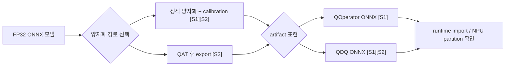
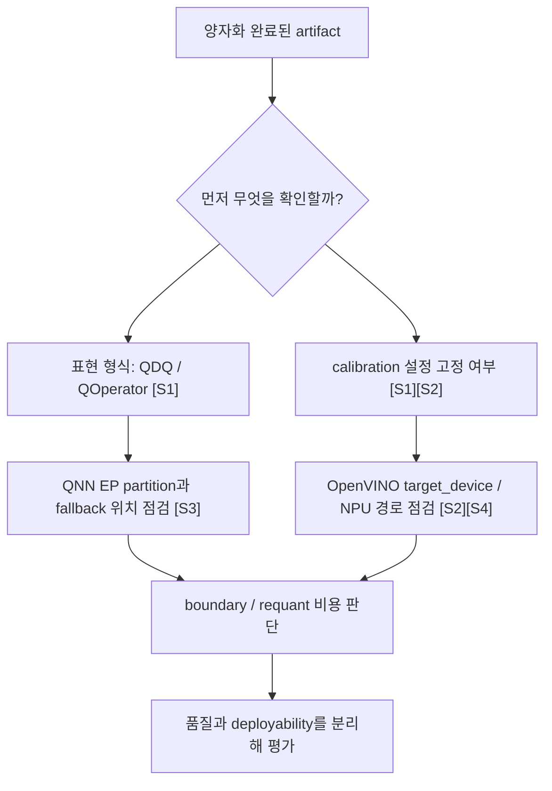

# NPU-Friendly Quantization

## 수업 개요
이 챕터는 양자화를 `몇 비트까지 줄였는가`보다 `runtime이 그대로 읽을 수 있는 quantized artifact를 만들었는가`라는 질문으로 다시 본다. ONNX Runtime 문서는 양자화된 ONNX 표현을 `QOperator`와 `QDQ`로 나눠 설명하고 정적/동적 양자화를 구분한다 [S1]. OpenVINO NNCF 문서는 PTQ, QAT, calibration dataset, `target_device`를 함께 다룬다 [S2]. 여기에 QNN Execution Provider와 OpenVINO NPU 문서를 겹쳐 보면, 정확도가 괜찮은 양자화와 실제 NPU 경로에 얹히는 양자화가 다를 수 있다는 점이 더 선명해진다 [S3][S4].

## 학습 목표
- `QOperator`와 `QDQ`를 단순 표기 차이가 아니라 배포 artifact 형식의 차이로 설명할 수 있다.
- calibration이 정확도 보정 절차이면서 동시에 재현 가능한 scale/zero-point를 고정하는 과정이라는 점을 말할 수 있다.
- per-tensor/per-channel, symmetric/asymmetric를 품질과 import 복잡도 관점에서 비교할 수 있다.
- `양자화 품질`과 `backend deployability`가 서로 다른 평가 축이라는 점을 사례로 설명할 수 있다.
- QNN EP 경로와 OpenVINO NPU 경로에서 무엇을 먼저 확인해야 하는지 디버깅 순서를 정리할 수 있다.

## 수업 전에 생각할 질문
- 동일한 Int8 모델이라도 어떤 artifact는 NPU 경로에서 잘 읽히고 어떤 artifact는 계속 fallback이 나는 이유는 무엇인가?
- calibration dataset을 대충 만들면 정확도만 흔들리는가, 아니면 artifact 재현성도 흔들리는가?
- `QDQ로 내보낼지`, `QOperator로 내보낼지`를 선택할 때 bit-width 외에 어떤 질문을 더 해야 하는가?

## 강의 스크립트
### Part 1. NPU-friendly라는 말의 기준부터 바꾸자
**교수자:** 이 챕터에서는 `좋은 양자화`를 먼저 정확도로 정의하지 않겠습니다. 먼저 `배포 경로가 읽을 수 있는 artifact인가`를 묻겠습니다. ONNX Runtime 문서는 양자화된 ONNX 모델을 `QOperator` 또는 `QDQ` 형식으로 표현한다고 정리합니다 [S1]. 이 말은 양자화가 단지 숫자를 줄이는 작업이 아니라, graph에 어떤 형태로 고정할지를 결정하는 작업이라는 뜻입니다.

**학습자:** 정확도가 높으면 좋은 양자화 아닌가요? 왜 artifact 형식을 먼저 보죠?

**교수자:** NPU 배포에서는 정확도와 deployability가 분리되기 때문입니다. calibration이나 QAT 결과가 좋아도 runtime이 기대하는 import 경로와 어긋나면, 일부 구간은 host로 빠지거나 다시 변환돼야 합니다 [S3][S4]. 그래서 이 챕터의 첫 판단 기준은 `bit-width`가 아니라 `import 가능한 형식으로 굳었는가`입니다.

### Part 2. QOperator와 QDQ는 그래프를 보는 시선을 바꾼다
**교수자:** `QOperator`는 quantized operator 자체를 graph에 직접 두는 표현입니다. `QLinearConv`, `MatMulInteger`처럼 연산 이름이 이미 양자화된 상태죠 [S1]. 반면 `QDQ`는 원래 연산 주변에 `QuantizeLinear`와 `DeQuantizeLinear`를 배치해, 어느 텐서가 어떤 scale과 zero-point로 양자화되는지 graph 경계에서 드러내는 방식입니다 [S1]. NNCF도 QDQ 형식을 export 맥락에서 설명합니다 [S2].

**학습자:** 그러면 둘 중 하나가 항상 더 낫다고 말할 수는 없겠네요?

**교수자:** 그렇습니다. `QOperator`는 graph가 더 직접적으로 양자화 연산을 드러내고, `QDQ`는 원래 floating-point graph에 가까운 형태를 유지하면서 quantization boundary를 명시합니다. 실무에서는 `runtime이 어느 표현을 더 안정적으로 읽는가`, `디버깅할 때 scale 경계를 눈으로 따라가기 쉬운가`를 같이 봐야 합니다.

#### 핵심 수식 1. scale과 zero-point가 artifact에 고정되는 방식
$$
q = \operatorname{clip}\left(\operatorname{round}\left(\frac{x}{s}\right) + z,\ q_{\min},\ q_{\max}\right)
$$

여기서 \(x\)는 원래 값, \(s\)는 scale, \(z\)는 zero-point다. 양자화 artifact를 저장한다는 말은 결국 이 파라미터들이 tensor 또는 channel 단위로 고정된다는 뜻이다 [S1][S2].

**교수자:** 여기서 많이 하는 실수가 있습니다. 모델 카드에는 `Int8 완료`라고 써 두고, 실제 파일이 `QDQ`인지 `QOperator`인지 확인하지 않는 겁니다. 그 상태에서는 import 실패 원인이 calibration인지, 표현 형식인지, runtime partition인지 분리되지 않습니다.

### Part 3. Calibration은 정확도 보정이면서 재현성 고정이다
**학습자:** calibration은 대표 샘플 몇 개 돌려서 범위를 잡는 과정이라고만 알고 있었어요.

**교수자:** 그 설명은 맞지만 충분하지 않습니다. ONNX Runtime은 정적 양자화에서 calibration으로 activation range를 수집하는 흐름을 설명하고 [S1], NNCF는 calibration dataset과 PTQ/QAT 흐름을 명시적으로 다룹니다 [S2]. 즉 calibration은 `이번 실험의 성능을 올리는 트릭`이 아니라 `이 artifact가 어떤 scale/zero-point를 갖는지 고정하는 절차`입니다.

**교수자:** 그래서 calibration dataset을 바꾸면 정확도만 달라지는 게 아닙니다. scale이 달라지고, 결과적으로 export된 quantized artifact도 달라집니다. 이 챕터에서 재현성을 강조하는 이유가 여기 있습니다. NPU import 경로를 디버깅하려면 baseline artifact가 매번 흔들리면 안 됩니다.

**학습자:** 그러면 `calibration dataset이 곧 배포 설정 일부`라고 봐야겠네요?

**교수자:** 그렇습니다. 특히 PTQ를 쓸 때는 더 그렇습니다. 같은 원본 모델이라도 calibration data가 달라지면 quantized artifact도 달라집니다 [S1][S2].

### Part 4. Granularity와 zero-point 방식은 품질 문제이면서 import 문제다
**교수자:** 이제 scale granularity를 보죠. 가장 자주 비교하는 것은 per-tensor와 per-channel입니다. per-tensor는 텐서 전체가 하나의 scale을 공유하고, per-channel은 채널별로 따로 scale을 둡니다. 대체로 granularity가 세밀할수록 품질을 보존할 여지가 커지지만, artifact에 포함되는 메타데이터와 경계 관리가 복잡해집니다. 이 문서 묶음은 세부 지원표를 주지 않으므로, 여기서는 `세밀한 표현일수록 import 조건도 같이 확인해야 한다`는 수준까지만 정리하겠습니다 [S1][S2].

**학습자:** symmetric와 asymmetric는 zero-point를 어떻게 잡느냐의 차이죠?

**교수자:** 맞습니다. symmetric는 zero-point를 단순하게 두는 쪽으로, asymmetric는 offset을 포함해 표현 범위를 더 유연하게 쓰는 쪽으로 이해하면 됩니다 [S1]. 중요한 것은 이것도 수학 교과서 문제가 아니라는 점입니다. 어떤 방식을 택하느냐에 따라 artifact 안에 들어가는 파라미터 구조와 runtime이 해석해야 하는 경계가 달라집니다.

#### 핵심 수식 2. 배포 관점에서 보는 양자화 총비용
$$
T_{\mathrm{total}} =
T_{\mathrm{int8\_compute}}
+ N_{\mathrm{boundary}} \cdot T_{\mathrm{handoff}}
+ N_{\mathrm{requant}} \cdot T_{\mathrm{requant}}
$$

이 식은 문서에 있는 공식이 아니라, 실무 판단을 위해 단순화한 모델이다. Int8 계산 자체가 빨라도 boundary handoff나 requantization이 많으면 전체 이득이 줄어든다. 그래서 `좋은 양자화`와 `배포되는 양자화`가 갈릴 수 있다 [S3][S4].

### Part 5. 품질이 좋은데도 NPU 경로가 답답한 두 장면
**교수자:** 첫 번째 장면은 `ONNX Runtime + QNN EP`입니다. ORT에서 모델을 양자화해 ONNX artifact를 만들고 [S1], 그 모델을 QNN Execution Provider로 실행합니다 [S3]. 이때 봐야 할 첫 질문은 `정확도가 몇 점 올랐는가`가 아니라 `quantized graph가 QNN 쪽 partition에 오래 머무는가`입니다. QDQ 경계가 잦거나 unsupported segment가 중간에 끼면, 품질이 좋아도 배포 이득은 약해집니다.

**학습자:** 즉, QNN EP에서는 quantized artifact가 실제 offload graph를 얼마나 길게 유지하느냐가 중요하군요.

**교수자:** 정확합니다.

**교수자:** 두 번째 장면은 `NNCF + OpenVINO NPU`입니다. NNCF는 PTQ, QAT, calibration dataset, preset, `target_device` 같은 최적화 문맥을 제공합니다 [S2]. OpenVINO NPU 문서는 NPU를 명시적 device target과 runtime mode로 다룹니다 [S4]. 그래서 이 경로에서는 `어떤 quantization artifact를 만들었는가`뿐 아니라 `어느 device 문맥을 상정하고 최적화했는가`가 더 드러납니다.

**학습자:** 그러면 두 사례 다 Int8일 수 있어도 질문 순서는 다르겠네요.

**교수자:** 그렇습니다. QNN EP 쪽은 `partition과 import`가 먼저 보이고 [S3], OpenVINO 쪽은 `optimization 설정과 target device`가 먼저 보입니다 [S2][S4].

### Part 6. 이 챕터에서 권하는 디버깅 순서
**학습자:** 실제로 문제가 생기면 어디부터 보시나요?

**교수자:** 저는 거의 항상 같은 순서로 봅니다.

1. export 결과가 `QDQ`인지 `QOperator`인지부터 적어 둡니다 [S1].
2. 정적 양자화라면 calibration dataset과 설정이 무엇이었는지 고정합니다 [S1][S2].
3. runtime 단계에서 QNN EP partition이나 OpenVINO NPU target이 어떻게 잡히는지 확인합니다 [S3][S4].
4. 품질 저하와 latency 악화를 분리해서 봅니다. 전자는 scale 설정 문제일 수 있고, 후자는 boundary나 requant 문제일 수 있습니다.

**교수자:** 이 순서를 지키면 `정확도 문제`와 `import 문제`를 섞어 해석하는 실수를 줄일 수 있습니다.

## 자주 헷갈리는 포인트
- `Int8`이라는 라벨만 같다고 같은 배포 artifact가 아니다. `QDQ`와 `QOperator`는 graph 구조 자체를 다르게 만든다 [S1].
- calibration은 측정 보조 절차가 아니라 scale과 zero-point를 고정하는 재현성 절차다 [S1][S2].
- per-channel이 항상 더 좋다고 단정할 수는 없다. 품질 보존 여지는 커질 수 있지만, import와 경계 해석도 함께 점검해야 한다.
- symmetric/asymmetric는 수학 선택지이면서 runtime이 읽어야 할 파라미터 구조 선택지다 [S1].
- QNN EP와 OpenVINO NPU를 비교할 때 `누가 더 많이 지원하나`부터 묻기보다, `각 경로가 quantized artifact를 어떤 방식으로 받아들이는가`를 먼저 봐야 한다 [S3][S4].

## 사례로 다시 보기
사례 A는 모바일 NPU 실험이다. 팀이 ORT로 정적 양자화를 수행해 ONNX artifact를 만들었다 [S1]. accuracy drop은 작았지만 QNN EP 실행 시 기대한 만큼 offload되지 않았다 [S3]. 원인은 bit-width가 아니라 QDQ 경계와 partition 단절이었다고 해석하는 편이 맞다. 이 장면은 `양자화 품질`과 `backend deployability`가 분리될 수 있음을 보여 준다.

사례 B는 Intel NPU 배포 준비다. 팀은 NNCF로 calibration dataset을 정리하고 `target_device`를 포함한 최적화 흐름을 잡는다 [S2]. 그 다음 OpenVINO NPU device 문맥에서 실행 경로를 맞춘다 [S4]. 여기서 핵심은 `정확도 손실 최소화`만이 아니라 `같은 설정으로 같은 artifact를 다시 만들 수 있는가`이다. 재현성이 흔들리면 device target 검증도 흔들린다.

## 핵심 정리
- 이 챕터에서 NPU-friendly quantization은 `낮은 비트수`가 아니라 `runtime/import 경로와 맞는 quantized artifact`를 뜻한다.
- ORT 문맥에서는 `QOperator`와 `QDQ`가 양자화 graph를 표현하는 공식 형식이며, 정적/동적 양자화 구분이 중요하다 [S1].
- NNCF 문맥에서는 PTQ, QAT, calibration dataset, `target_device`가 함께 움직이며 artifact 재현성에 직접 관여한다 [S2].
- QNN EP와 OpenVINO NPU는 quantized artifact를 읽는 경로와 확인 지점이 다르므로, 동일한 Int8 결과라도 배포 감각이 달라진다 [S3][S4].
- 따라서 배포 전 질문은 `몇 비트인가`보다 `어떤 형식으로 export됐고, 어떤 calibration으로 고정됐고, 어떤 runtime 경로가 그것을 읽는가`여야 한다.

## 복습 체크리스트
- `QOperator`와 `QDQ`를 각각 한 문장으로 설명할 수 있는가?
- calibration dataset이 바뀌면 왜 artifact 재현성도 흔들리는지 설명할 수 있는가?
- per-tensor/per-channel, symmetric/asymmetric를 `품질`과 `import` 두 축으로 비교할 수 있는가?
- QNN EP 경로에서 먼저 볼 항목과 OpenVINO NPU 경로에서 먼저 볼 항목을 구분할 수 있는가?
- accuracy가 괜찮은데 latency가 나빠질 때 `boundary`와 `requant`를 의심해야 하는 이유를 말할 수 있는가?

## 대안과 비교
| 비교 관점 | ORT 중심 양자화 해석 | NNCF 중심 양자화 해석 | 공통 실무 질문 |
| --- | --- | --- | --- |
| 대표 형식 | `QOperator`, `QDQ` [S1] | QDQ export, PTQ/QAT 흐름 [S2] | export 결과가 runtime이 읽을 형식인가 |
| calibration 의미 | 정적 양자화에서 activation range 고정 [S1] | calibration dataset 기반 압축/최적화 [S2] | scale과 zero-point가 재현 가능하게 고정됐는가 |
| 배포 연결점 | QNN EP 같은 runtime import와 partition [S3] | `target_device`와 NPU device 문맥 [S2][S4] | artifact가 실제 device 경로에 맞는가 |
| 실패 징후 | quantized graph인데 offload가 짧다 | 설정은 맞는데 artifact 재생성이 흔들린다 | 품질과 deployability를 섞어서 보고 있지 않은가 |
| 적합한 질문 | `QDQ와 QOperator 중 무엇을 내보냈나` | `어떤 calibration과 target_device로 만들었나` | `이 artifact를 다시 만들고 다시 읽힐 수 있나` |

## 참고 이미지

- [I1] 캡션: Quantization error block diagram
- 출처 번호: [I1]
- 왜 이 그림이 필요한지: scale과 zero-point가 이상적인 실수 값을 정수 격자에 맞추는 과정에서 왜 오차를 만들 수밖에 없는지 시각적으로 설명해 준다. calibration과 granularity 이야기를 할 때 이 그림이 가장 직접적이다.

- [I2] 캡션: Roofline model
- 출처 번호: [I2]
- 왜 이 그림이 필요한지: 양자화가 계산 밀도와 메모리 트래픽을 개선할 수 있다는 기대를 설명할 때 유용하다. 동시에 이 챕터에서는 boundary handoff와 requant 비용이 그 이득을 깎을 수 있다는 반례를 붙여 읽어야 한다.

## 출처
| 번호 | 제목 | 발행 주체 | 날짜 | URL | 사용 이유 |
| --- | --- | --- | --- | --- | --- |
| [S1] | Quantize ONNX Models | ONNX Runtime | 2026-03-08 (accessed) | [https://onnxruntime.ai/docs/performance/model-optimizations/quantization.html](https://onnxruntime.ai/docs/performance/model-optimizations/quantization.html) | `QOperator`, `QDQ`, 정적/동적 양자화, scale/zero-point 설명 |
| [S2] | Model Optimization - NNCF | OpenVINO | 2026-03-08 (accessed) | [https://docs.openvino.ai/nncf](https://docs.openvino.ai/nncf) | PTQ/QAT, calibration dataset, QDQ export, `target_device` 맥락 설명 |
| [S3] | QNN Execution Provider | ONNX Runtime | 2026-03-08 (accessed) | [https://onnxruntime.ai/docs/execution-providers/QNN-ExecutionProvider.html](https://onnxruntime.ai/docs/execution-providers/QNN-ExecutionProvider.html) | quantized ONNX artifact가 runtime partition과 offload 경로에서 어떻게 읽히는지 설명 |
| [S4] | NPU device | OpenVINO | 2026-03-08 (accessed) | [https://docs.openvino.ai/2025/openvino-workflow/running-inference/inference-devices-and-modes/npu-device.html](https://docs.openvino.ai/2025/openvino-workflow/running-inference/inference-devices-and-modes/npu-device.html) | Intel NPU target device와 runtime mode 문맥 설명 |
