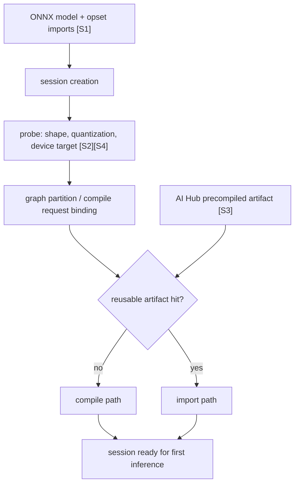
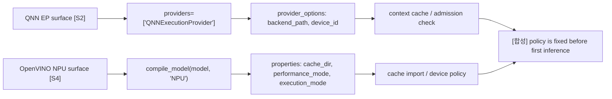
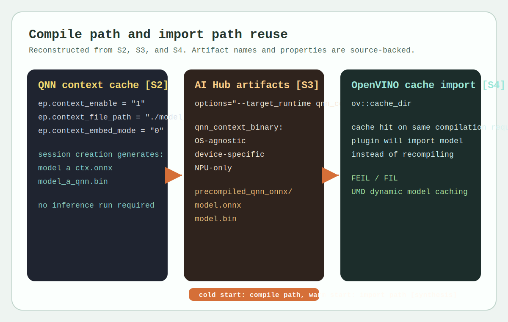
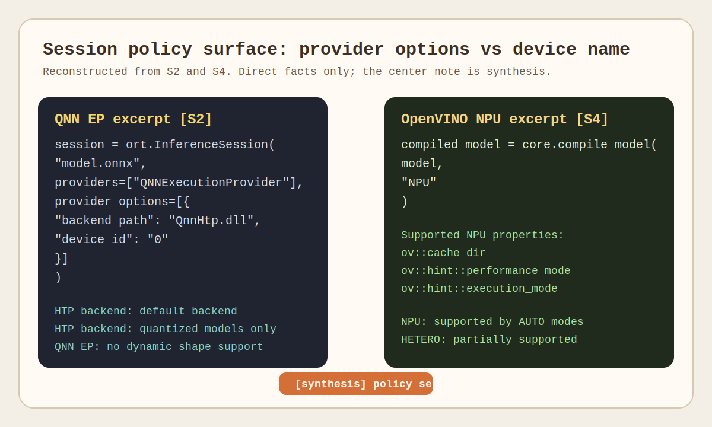

# Runtime and Execution Provider

## 수업 개요
이 챕터의 첫 질문은 `세션 생성 시 runtime이 무엇을 확인하고, 이미 있는 artifact를 import할지 새로 compile할지를 어떻게 가르는가`이다. ONNX는 runtime이 읽기 시작하는 공통 입력으로 graph, operator, opset import를 제공하고 [S1], QNN Execution Provider 문서는 provider options, quantized model 제약, dynamic shape 미지원, context binary cache를 세션 표면으로 드러낸다 [S2]. Qualcomm AI Hub compile examples는 같은 ONNX라도 배포 전에 `qnn_context_binary`나 `precompiled_qnn_onnx`를 만들어 둘 수 있음을 보여 주고 [S3], OpenVINO NPU 문서는 `compile_model(..., "NPU")`, `ov::cache_dir`, device properties, AUTO/HETERO 지원 문맥으로 같은 문제를 다룬다 [S4].

[합성] 그래서 이 챕터에서 execution provider는 일반론으로서의 "플러그인"보다, `session creation 동안 graph partition 권한을 행사하고 artifact reuse 경로를 선택하게 만드는 계층`으로 읽는 편이 맞다. runtime 차이는 steady-state kernel보다 compile path와 import path가 갈리는 지점에서 먼저 드러난다.

## 학습 목표
- 세션 생성 시 runtime이 확인하는 항목을 `model graph`, `shape/quantization 조건`, `device target`, `artifact hit 여부`로 정리할 수 있다.
- QNN EP에서 provider/session option이 왜 admission 조건과 artifact reuse 경로를 함께 드러내는지 설명할 수 있다. [S2]
- AI Hub의 `qnn_context_binary`와 `precompiled_qnn_onnx`를 앱 내 compile 경로와 배포 전 precompile 경로의 차이로 비교할 수 있다. [S3]
- OpenVINO NPU에서 device/property surface와 `ov::cache_dir`가 compile/import 분기를 어떻게 드러내는지 설명할 수 있다. [S4]
- 첫 실행만 느린 앱이나 장치별 warm start 차이를 보면 먼저 어떤 runtime surface를 확인해야 하는지 판단할 수 있다.

## 수업 전에 생각할 질문
- 같은 ONNX인데 Snapdragon 앱은 첫 실행만 오래 걸리고, 다른 앱은 설치 직후에도 바로 시작된다. 두 앱은 세션 생성에서 무엇이 다를까?
- `_ctx.onnx`와 `.bin`이 보인다면 이것을 연산 결과 파일이 아니라 세션 준비 artifact로 읽어야 하는 이유는 무엇일까?
- OpenVINO NPU에서 두 번째 실행만 빨라졌다면, 먼저 의심해야 할 것은 kernel 속도일까 `ov::cache_dir`에 따른 import path일까?
- runtime을 비교할 때 왜 API 이름보다 `정책 표면이 provider 쪽에 노출되는가, device/property 쪽에 노출되는가`를 먼저 봐야 할까?

## 강의 스크립트
### 1. 세션 생성은 무엇을 확인하고 어디서 갈라지는가
**교수자:** 오늘은 "execution provider가 플러그인인가 아닌가" 같은 일반론부터 길게 시작하지 않겠습니다. 먼저 세션 생성 시 runtime이 실제로 뭘 확인하는지부터 보죠. 공통 입력은 ONNX graph와 opset 정보입니다 [S1]. 그다음 QNN EP라면 quantized model인지, dynamic shape가 아닌지, 어떤 provider option으로 세션을 열었는지를 보고 [S2], OpenVINO라면 어떤 device 이름과 property로 `compile_model`을 호출했는지를 봅니다 [S4]. AI Hub를 쓰면 그보다 앞단에서 어떤 device와 target runtime으로 artifact를 미리 만들었는지도 질문에 들어갑니다 [S3].

**학습자:** 그러면 "첫 실행이 느리다"는 증상도 사실은 세션 생성 질문이네요.

**교수자:** 맞습니다. 실무에서 첫 문장은 보통 이렇게 정리됩니다. `이번 세션은 compile path를 탔는가, import path를 탔는가.` 그다음에야 NPU kernel이나 steady-state latency를 봅니다. 이 순서를 바꾸면 cold start 문제를 커널 문제로 오진하기 쉽습니다.

다음 식은 문서의 공식이 아니라, 이 챕터에서 세션 준비 시간을 읽는 최소 모델이다.

$$
T_{\mathrm{ready}} =
T_{\mathrm{probe}} +
T_{\mathrm{partition}} +
(1-H)\,T_{\mathrm{compile}} +
H\,T_{\mathrm{import}}
$$

여기서 \(H\)는 재사용 가능한 artifact hit 여부다. `T_probe`에는 ONNX graph/opset 확인 [S1], device/provider surface 확인 [S2][S4]이 들어가고, 마지막 항은 QNN context cache [S2], AI Hub 사전 compile artifact [S3], OpenVINO cache import [S4]에 의해 달라진다.

### 2. QNN EP에서는 provider/session option이 admission 조건을 드러낸다
**학습자:** QNN EP 쪽은 무엇을 가장 먼저 읽어야 하나요?

**교수자:** `InferenceSession`을 만들 때 붙는 provider와 option부터 읽어야 합니다. [문서 사실] QNN EP 문서는 `QNNExecutionProvider`, `backend_path`, `device_id` 같은 provider option을 보여 주고, HTP backend를 기본 backend로 설명합니다 [S2]. 또 HTP backend는 quantized models만 지원하고, QNN EP는 dynamic shape를 지원하지 않으며, ONNX operator 지원도 subset입니다 [S2].

**학습자:** 지원 op 목록보다 앞에 확인할 것이 많네요.

**교수자:** 그렇습니다. 세션 생성 관점에서는 네 가지 질문을 거의 고정으로 던집니다. `이 모델은 quantized인가`, `shape는 고정돼 있는가`, `provider option이 어느 backend/device를 가리키는가`, `이번 세션이 기존 context binary를 재사용했는가`. 이 네 개가 맞지 않으면 NPU 경로는 시작도 하기 전에 짧아집니다.

**교수자:** [문서 사실] QNN EP는 `ep.context_enable`, `ep.context_file_path`, `ep.context_embed_mode`를 포함한 context binary cache를 제공하고, converted/compiled/finalized graph를 serialize해 model loading cost를 줄일 수 있다고 설명합니다 [S2]. 문서 예시에는 inference를 실제로 돌리지 않아도 `_ctx.onnx`와 `.bin`이 생성되는 흐름이 나온다 [S2].

**학습자:** 그러면 `_ctx.onnx`와 `.bin`이 생겼다는 사실 자체가 compile path를 탔다는 강한 신호군요.

**교수자:** 그렇습니다. [합성] QNN EP에서 cold start 문제를 볼 때 가장 먼저 확인할 runtime surface는 kernel profiler가 아니라 provider option과 context artifact 존재 여부다.

### 3. AI Hub는 compile을 앱 밖으로 옮기는 선택지를 준다
**교수자:** 이제 같은 QNN 계열이라도 운영 감각이 어떻게 바뀌는지 보죠. [문서 사실] Qualcomm AI Hub compile examples는 compile job에 device와 target runtime을 명시하고, `qnn_context_binary`, `precompiled_qnn_onnx`를 산출물 예시로 듭니다 [S3]. `qnn_context_binary`는 OS-agnostic이지만 device-specific이고 NPU-only이며, `precompiled_qnn_onnx`는 ONNX file과 binary file을 함께 담는 디렉터리 형태다 [S3].

**학습자:** 같은 ONNX라도 앱이 직접 compile할 수도 있고, 배포 전에 compile을 끝낼 수도 있다는 뜻이네요.

**교수자:** 바로 그 차이가 이 챕터의 핵심 비교축입니다. ONNX Runtime + QNN EP를 앱 안에서 열면 세션 생성이 context를 만들고 재사용할 수 있습니다 [S2]. 반면 AI Hub를 쓰면 compile을 배포 파이프라인 쪽으로 앞당겨, 앱에는 이미 target runtime용 artifact를 들고 들어올 수 있습니다 [S3].

다음 식도 문서 원문이 아니라 운영 판단을 위한 합성식이다.

$$
\Delta T_{\mathrm{cold\ start}} =
T_{\mathrm{compile\ in\ app}} -
T_{\mathrm{artifact\ import}}
$$

같은 ONNX 입력이어도 `compile을 어디에서 끝냈는가`가 다르면 첫 실행 체감은 크게 달라진다. QNN context cache [S2]와 AI Hub precompile artifact [S3], OpenVINO cache hit [S4]를 함께 읽으면 이 차이를 한 프레임으로 설명할 수 있다.

### 4. OpenVINO NPU는 device/property surface에서 같은 질문을 푼다
**학습자:** OpenVINO는 QNN처럼 provider option을 붙이지 않는데, 그러면 무엇을 봐야 하나요?

**교수자:** 여기서는 표면이 바뀝니다. [문서 사실] OpenVINO NPU 문서는 `compile_model(model, "NPU")`를 기본 예시로 보여 주고, `ov::cache_dir`, `ov::hint::performance_mode`, `ov::hint::execution_mode` 같은 NPU properties를 설명합니다 [S4]. 즉 QNN이 provider/session option으로 경계를 드러낸다면, OpenVINO는 device name과 property로 같은 경계를 드러냅니다.

**학습자:** warm start가 빨라지는 것도 이 surface에서 읽어야겠네요.

**교수자:** 맞습니다. [문서 사실] `ov::cache_dir`가 켜져 있으면 compile 결과를 저장하고, 같은 compilation request가 다시 들어오면 plugin이 model을 import한다고 문서가 설명합니다 [S4]. 그래서 같은 앱이 두 번째 실행만 빨라졌다면 "kernel이 두 번째부터 빨라진다"보다 "첫 실행은 cache miss, 두 번째는 cache hit"를 먼저 가정하는 편이 맞습니다.

**교수자:** [문서 사실] OpenVINO NPU는 AUTO inference modes에서 supported이고, HETERO는 certain models에 대해 partially supported다 [S4]. 이 문장은 운영자가 fallback이나 device 선택을 상상으로 채우지 말고, 문서가 직접 드러낸 지원 문맥까지만 읽어야 한다는 뜻이기도 합니다.

### 5. 운영자는 증상보다 먼저 표면을 좁혀야 한다
**교수자:** 이제 비교를 한 줄로 줄여 봅시다. QNN EP는 provider/session option이 먼저 보이고 [S2], OpenVINO NPU는 device/property surface가 먼저 보입니다 [S4]. AI Hub는 compile job의 device와 target runtime이 더 앞단에 등장합니다 [S3].

**학습자:** 결국 "누가 더 빠른가"보다 "문제가 어느 표면에서 드러나는가"를 먼저 고르는 일이군요.

**교수자:** 그렇습니다. 세션 생성에서 물어볼 질문도 거의 고정입니다.

1. 첫 실행만 느린가, 반복 실행도 느린가?
2. 이번 경로는 앱 내 compile인가, 미리 준비한 artifact import인가?
3. 표면은 provider/session option인가, device/property인가?
4. admission을 막는 조건은 quantization인가, shape인가, device target인가?

**학습자:** 이 네 개가 정리되면 profiling 챕터에서 trace를 볼 때도 훨씬 빨리 좁혀지겠네요.

**교수자:** 맞습니다. 이 챕터는 profiler 이전 단계에서 `session creation과 artifact reuse를 먼저 의심하는 습관`을 만드는 챕터입니다.

## 자주 헷갈리는 포인트
- execution provider를 "backend 플러그인"으로만 부르면 세션 생성에서의 graph partition 권한과 artifact 결정 지점을 놓치기 쉽다. 이 챕터에서는 그 점을 [합성]으로 분리해 설명했다.
- QNN EP의 quantized model 제약, dynamic shape 미지원, supported operator subset은 서로 독립된 팁이 아니라 admission 조건 묶음이다. [S2]
- `_ctx.onnx`와 `.bin`은 inference 결과 저장물이 아니라 compile path를 거친 세션 준비 artifact다. [S2]
- AI Hub의 `qnn_context_binary`와 `precompiled_qnn_onnx`는 파일 포맷 암기 대상이 아니라 `compile을 앱 안에서 할지, 배포 전에 끝낼지`에 대한 운영 선택지다. [S3]
- OpenVINO의 `ov::cache_dir`는 첫 compile을 없애는 옵션이 아니라, 같은 compilation request에 대해 import path를 열어 주는 옵션이다. [S4]
- AUTO 지원과 HETERO partial support는 문서 사실이지만, 실제 fallback 품질이나 boundary 비용은 다음 챕터의 profiling으로 별도 검증해야 한다. [S4]

## 사례로 다시 보기
### 사례 1. AI Hub precompile을 안 쓴 앱과 쓴 앱의 첫 실행 차이
- 증상: 같은 ONNX 모델을 배포했는데 앱 A는 설치 직후 첫 화면 진입이 유난히 느리고, 앱 B는 즉시 시작된다.
- 원인: 앱 A는 ONNX Runtime + QNN EP 세션 생성 중 context를 새로 만들고 있고 [S2], 앱 B는 AI Hub에서 device와 target runtime을 지정해 미리 만든 `qnn_context_binary` 또는 `precompiled_qnn_onnx`를 들고 들어온다 [S3]. [합성] 첫 실행 차이는 kernel 속도보다 compile 위치 차이에서 생긴다.
- 먼저 확인할 runtime surface: 앱 A에서는 `QNNExecutionProvider`의 provider option과 context artifact 생성 여부 [S2], 앱 B에서는 배포 artifact의 target runtime과 device 지정 정보 [S3].

### 사례 2. OpenVINO NPU에서 cache miss와 cache hit가 섞인 앱
- 증상: 동일 ONNX를 쓰는 데도 특정 장비에서는 첫 실행만 느리고, 같은 앱을 다시 띄우면 눈에 띄게 빨라진다.
- 원인: [문서 사실] OpenVINO NPU는 `ov::cache_dir`를 켜 두면 같은 compilation request에 대해 plugin이 model을 import한다 [S4]. [합성] 첫 실행은 compile path, 이후 실행은 import path였을 가능성이 높다.
- 먼저 확인할 runtime surface: `compile_model(..., "NPU")` 호출 유무, `ov::cache_dir` 설정, 같은 compilation request가 유지됐는지 [S4].

### 사례 3. QNN HTP로 내려갈 줄 알았는데 세션 생성부터 짧게 끊긴 경우
- 증상: 모델은 ONNX로 잘 열리지만 QNN 쪽 offload가 기대보다 작고 warm start 이득도 거의 없다.
- 원인: [문서 사실] HTP backend는 quantized models만 지원하고, QNN EP는 dynamic shape를 지원하지 않으며 operator 지원도 subset이다 [S2]. [합성] 세션 생성 admission 조건이 맞지 않으면 재사용할 artifact 자체가 충분히 만들어지지 않는다.
- 먼저 확인할 runtime surface: 모델이 quantized인지, shape가 고정인지, QNN provider option이 어떤 backend/device를 가리키는지, context cache가 실제로 생성됐는지 [S2].

## 핵심 정리
- 이 챕터의 중심 질문은 `세션 생성 시 무엇을 확인하고 어떤 artifact를 재사용하는가`다.
- ONNX는 공통 입력을 제공하고 [S1], QNN EP와 OpenVINO NPU는 각기 다른 정책 표면에서 compile/import 분기를 드러낸다 [S2][S4].
- QNN EP는 provider/session option과 context binary cache로 세션 생성 경계를 보여 준다. [S2]
- Qualcomm AI Hub는 compile을 배포 파이프라인으로 앞당겨 device-targeted artifact를 만든다는 점에서 앱 내 compile과 대비된다. [S3]
- OpenVINO NPU는 device/property surface와 `ov::cache_dir`로 cache miss와 cache hit를 읽게 만든다. [S4]

## 복습 체크리스트
- 세션 준비 시간을 `probe`, `partition`, `compile/import`로 나눠 설명할 수 있는가?
- QNN EP에서 quantization과 fixed shape를 `성능 팁`이 아니라 admission 조건으로 설명할 수 있는가? [S2]
- `_ctx.onnx`와 `.bin`이 나타났을 때 compile path를 먼저 의심해야 하는 이유를 설명할 수 있는가? [S2]
- AI Hub의 `qnn_context_binary`와 `precompiled_qnn_onnx`가 어떤 운영 선택을 의미하는지 말할 수 있는가? [S3]
- OpenVINO NPU에서 warm start 개선을 보면 `ov::cache_dir`와 import path를 먼저 확인해야 한다는 점을 설명할 수 있는가? [S4]
- provider/session option surface와 device/property surface의 차이를 비교해 설명할 수 있는가? [S2][S4]

## 대안과 비교
| 경로 | 정책이 먼저 드러나는 표면 | artifact reuse 방식 | 운영자가 먼저 던질 질문 |
| --- | --- | --- | --- |
| ONNX Runtime + QNN EP | `providers`, `provider_options`, session config [S2] | context binary cache, `_ctx.onnx`, `.bin` [S2] | 이번 세션은 quantized model과 fixed shape 조건을 만족하는가? |
| Qualcomm AI Hub precompile | compile job의 `device`, `target_runtime` [S3] | `qnn_context_binary`, `precompiled_qnn_onnx` [S3] | compile을 앱 안에서 할 것인가, 배포 전에 끝낼 것인가? |
| OpenVINO NPU | `compile_model(model, "NPU")`, NPU properties [S4] | `ov::cache_dir`, same compilation request import [S4] | 첫 실행과 재실행의 차이가 cache miss/hit에서 생겼는가? |
| Windows ML | 이번 source pack에 직접 근거가 없다 | 이번 source pack에 직접 근거가 없다 | 소스 없이 provider/device 세부 표면을 추측하고 있지는 않은가? |

## 참고 이미지

- 로컬 재구성 이미지 1
- 설명: session creation에서 compile path와 import path가 어디서 갈리는지, QNN context cache [S2], AI Hub precompile artifact [S3], OpenVINO cache import [S4]를 한 화면에 묶어 보여 준다.
- 읽는 포인트: 첫 실행 지연이 보이면 가장 먼저 artifact hit 여부를 보고, 그다음에 kernel 시간을 본다.

- 로컬 재구성 이미지 2
- 설명: QNN은 provider/session option surface [S2], OpenVINO는 device/property surface [S4]에서 정책이 드러난다는 차이를 직접 비교한다.
- 읽는 포인트: 같은 ONNX라도 runtime surface가 다르면 디버깅 순서도 달라진다.

## 출처
| 번호 | 제목 | 발행 주체 | 날짜 | URL | 사용 이유 |
| --- | --- | --- | --- | --- | --- |
| [S1] | Open Neural Network Exchange | ONNX | 2026-03-08 (accessed) | [https://onnx.ai/](https://onnx.ai/) | ONNX graph, operator, opset import가 세션 생성의 공통 입력이라는 점을 설명하기 위해 사용 |
| [S2] | QNN Execution Provider | ONNX Runtime | 2026-03-08 (accessed) | [https://onnxruntime.ai/docs/execution-providers/QNN-ExecutionProvider.html](https://onnxruntime.ai/docs/execution-providers/QNN-ExecutionProvider.html) | provider/session option, HTP backend 제약, context binary cache, 세션 준비 artifact를 설명하기 위해 사용 |
| [S3] | Compile examples | Qualcomm AI Hub | 2026-03-08 (accessed) | [https://app.aihub.qualcomm.com/docs/hub/compile_examples.html](https://app.aihub.qualcomm.com/docs/hub/compile_examples.html) | `qnn_context_binary`, `precompiled_qnn_onnx`, device-targeted precompile 경로를 설명하기 위해 사용 |
| [S4] | NPU device | OpenVINO | 2026-03-08 (accessed) | [https://docs.openvino.ai/2025/openvino-workflow/running-inference/inference-devices-and-modes/npu-device.html](https://docs.openvino.ai/2025/openvino-workflow/running-inference/inference-devices-and-modes/npu-device.html) | `compile_model(..., "NPU")`, `ov::cache_dir`, NPU properties, AUTO/HETERO 지원 문맥을 설명하기 위해 사용 |
