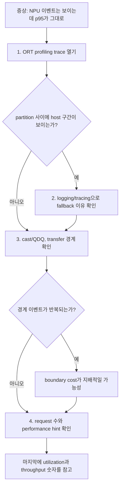
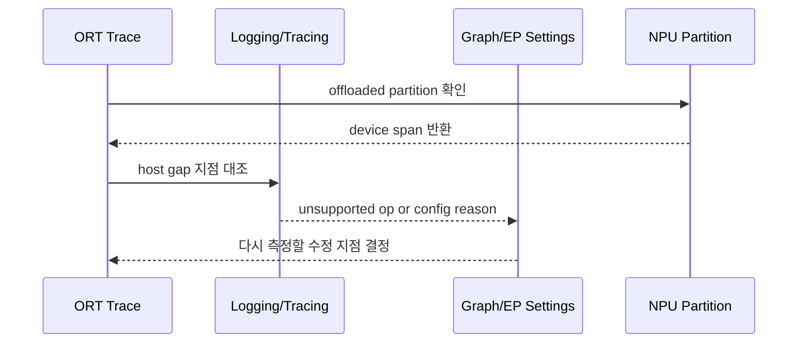
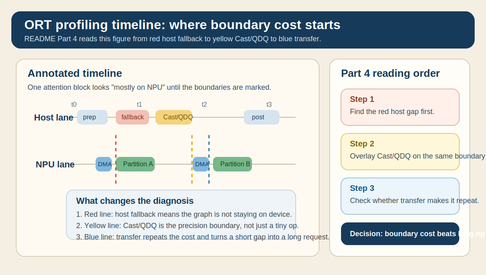
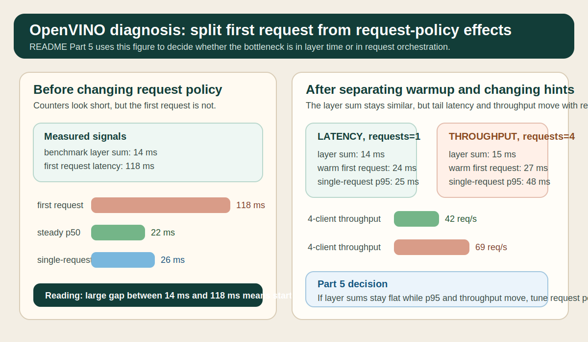

# Profiling, Debugging, and Bottlenecks

## 수업 개요
대시보드에는 NPU activity가 분명히 찍히는데 p95 latency는 그대로인 장면이 있다. 이 장은 그런 상황에서 utilization 수치보다 먼저 trace의 partition, host fallback, cast/QDQ, transfer 경계를 읽는 법을 다룬다 [S1][S2][S3]. 런타임이 추상화를 많이 제공할수록 사용은 쉬워지지만, 병목을 잡을 때는 어떤 구간이 host에 남았는지와 request 설정이 어떤 지연을 추가했는지를 더 직접적으로 확인해야 한다 [S4][S5].

## 학습 목표
- ORT profiling trace에서 `NPU 사용 중`과 `실제 핵심 경로 offload`를 구분할 수 있다 [S1][S3].
- logging/tracing을 써서 fallback 이유와 세션 성립 조건을 trace 위에 덧붙여 읽을 수 있다 [S2][S3].
- cast, QDQ, transfer가 각각 작은 이벤트여도 boundary cost로 합쳐질 수 있음을 설명할 수 있다 [S1][S3].
- OpenVINO benchmark 결과와 request/performance hint 해석을 분리해 layer 병목과 orchestration 병목을 따로 진단할 수 있다 [S4][S5].
- 첫 요청 지연과 steady-state 지연을 섞지 않고 해석할 수 있다 [S4][S5].

## 수업 전에 생각할 질문
- trace에 NPU partition이 보이는데도 p95가 안 내려가면, 가장 먼저 어느 경계를 의심해야 할까?
- `session.disable_cpu_ep_fallback`를 켰더니 세션이 성립하지 않는다면, profiling을 더 볼 문제일까 아니면 graph 조건을 먼저 고칠 문제일까?
- cast/QDQ가 짧게 보인다는 이유만으로 무시하면 어떤 오진이 생길까?
- benchmark는 좋은데 multi-request에서만 흔들리면, 어떤 도구를 먼저 보고 어떤 설정을 나중에 건드려야 할까?

## 강의 스크립트
### Part 1. 먼저 보는 것은 device busy가 아니라 실행 경계다
**학습자:** NPU로 내려갔다고 들었는데 응답 시간이 별로 안 줄었습니다. 처음에 뭘 봐야 하나요?

**교수자:** 저는 utilization 그래프보다 trace를 먼저 엽니다. ORT profiling은 어떤 노드가 어느 순서로 실행됐는지 보여 주고, QNN EP 관점에서는 그중 무엇이 실제로 장치 경계 밖에 남았는지를 확인하게 해 줍니다 [S1][S3].

**학습자:** 그래도 긴 막대 하나를 찾는 게 먼저 아닌가요?

**교수자:** NPU workload에서는 꼭 그렇지 않습니다. 짧은 host 구간이 여러 번 끼면 device 계산 시간보다 경계 비용이 커질 수 있어서, 먼저 partition이 어떻게 쪼개졌는지 봐야 합니다 [S1].

$$
T_{total} = T_{device} + T_{host\_fallback} + T_{cast/qdq} + T_{transfer/sync} + T_{request\_setup}
$$

**교수자:** 이 식의 포인트는 `T_device`가 줄어도 전체가 안 줄 수 있다는 점입니다. host fallback, precision 경계, request setup을 분리해서 보지 않으면 개선 효과를 잘못 읽게 됩니다 [S1][S4].

### Part 2. trace에서는 "느린 op"보다 "쪼개진 흐름"을 먼저 찾는다
**학습자:** profiling JSON을 열면 어떤 순서로 읽는 게 좋을까요?

**교수자:** 먼저 NPU partition이 길게 이어지는지, 아니면 host 이벤트가 중간에 끼는지를 봅니다. 그다음 cast나 QDQ가 partition 앞뒤에 붙어 있는지를 확인합니다. 여기까지가 trace로 할 일입니다 [S1][S3].

**학습자:** 왜 cast/QDQ를 trace 단계에서 벌써 보나요?

**교수자:** QNN 경로에서는 precision 변환이 단독 연산이라기보다 경계 신호에 가깝기 때문입니다. 앞뒤에 transfer나 host 연산이 붙으면 operator 시간이 짧아도 end-to-end latency는 줄지 않습니다 [S3].

### Part 3. logging/tracing은 fallback 이유를 붙여 준다
**학습자:** trace만으로 충분하지 않은 이유가 fallback의 이유를 모르기 때문인가요?

**교수자:** 맞습니다. ORT logging/tracing은 unsupported op, provider 선택, 세션 구성 같은 맥락을 붙여 줍니다 [S2]. QNN EP 문맥에서는 CPU fallback을 막았을 때 세션이 깨지는지 여부도 중요한 진단 신호입니다 [S3].

**학습자:** 세션이 깨지면 그건 성능 문제가 아니라 성립 조건 문제군요.

**교수자:** 정확합니다. 그 경우는 per-node latency를 더 보는 것보다 unsupported op, shape 조건, export artifact를 먼저 고쳐야 합니다 [S3].

### Part 4. cast와 QDQ는 작은 막대가 아니라 경계 비용의 출발점이다
**학습자:** cast나 QDQ는 trace에서 짧게 보이던데, 정말 우선순위를 높게 둬야 하나요?

**교수자:** 길이만 보면 짧을 수 있습니다. 하지만 그 짧은 막대가 host fallback과 transfer 경계를 만드는 순간 의미가 달라집니다. 아래 `참고 이미지 1`을 보면 노란 `Cast/QDQ` 구간 앞뒤에 빨간 `Host fallback`과 파란 `Transfer`가 붙어 있습니다. 이 그림에서 병목 판단을 바꾸는 지점은 연산 시간 자체가 아니라, 그 세 경계가 한 번의 attention block 안에서 두 번 반복된다는 사실입니다.

$$
R_{boundary} = \frac{T_{host\_fallback} + T_{cast/qdq} + T_{transfer/sync}}{T_{total}}
$$

**교수자:** `R_boundary`가 높으면 "NPU를 쓰는데 왜 안 빨라지지?"라는 질문이 자연스럽게 나옵니다. `참고 이미지 1`의 해석 순서도 정확히 이 식과 같습니다. 먼저 host fallback을 표시하고, 그다음 cast/QDQ를 겹쳐 보고, 마지막에 transfer 경계가 실제로 왕복을 만들었는지 판단합니다 [S1][S2][S3].

**학습자:** 그러면 cast가 많다는 사실보다 cast가 host gap과 같이 움직이는지가 더 중요하겠네요.

**교수자:** 그렇습니다. Part 4의 핵심 판단 단계는 `짧은 이벤트가 어디를 끊었는가`입니다.

### Part 5. OpenVINO에서는 layer 시간과 request 설정을 따로 읽어야 한다
**학습자:** OpenVINO benchmark는 나쁘지 않은데 서비스에서만 latency가 흔들리는 경우는 어떻게 보나요?

**교수자:** benchmark_app은 출발점입니다. per-layer counter와 exec graph는 layer 관찰에 유용하지만, request 수와 performance hint는 workload의 목표를 바꾸는 설정이어서 같은 표에서 바로 합치면 해석이 흐려집니다 [S4][S5]. 아래 `참고 이미지 2`는 바로 그 분리 절차를 보여 줍니다. 왼쪽은 benchmark counter가 짧아도 first-request latency가 큰 경우고, 오른쪽은 request 수와 hint를 바꾼 뒤 steady-state latency와 throughput이 어떻게 달라지는지를 비교합니다.

**학습자:** 구체적으로 어떤 순서로 관찰해야 하나요?

**교수자:** 아래 표는 [S4][S5]의 benchmark/profiling/performance hint 해석법을 따라 만든 가상의 진단 예시입니다. 숫자 자체보다 어떤 질문을 분리하는지가 중요합니다.

| 설정 | benchmark layer 합계 | 첫 요청 latency | steady-state p50 | 단건 p95 | 4개 동시 요청 throughput | 해석 |
| --- | --- | --- | --- | --- | --- | --- |
| `LATENCY`, `num_requests=1` | 14 ms | 118 ms | 22 ms | 26 ms | 41 req/s | first-request 비용이 커도 steady-state는 안정적 |
| `THROUGHPUT`, `num_requests=4` | 15 ms | 126 ms | 31 ms | 48 ms | 69 req/s | layer 시간은 비슷하지만 queueing으로 단건 tail 악화 |
| `LATENCY`, warm session 후 재측정 | 14 ms | 24 ms | 21 ms | 25 ms | 42 req/s | 초기화 비용을 걷어내면 layer 병목 여부가 더 선명 |

**교수자:** 여기서 보는 포인트는 세 가지입니다.
- benchmark layer 합계가 14~15 ms로 비슷한데 p95와 throughput이 크게 달라지면, layer hotspot보다 request orchestration을 먼저 의심한다.
- 첫 요청 118 ms가 warm session 뒤 24 ms로 내려가면, 그 차이는 steady-state 최적화보다 초기화 비용 분리 항목이다.
- `THROUGHPUT`와 `num_requests=4`가 다중 요청에서는 이득을 주더라도, 단건 응답 목표에서는 오히려 p95를 망칠 수 있다.

**학습자:** 그러면 `참고 이미지 2`의 before/after는 request 정책을 바꿨을 때 어떤 숫자가 움직여야 하는지를 보여 주는 셈이군요.

**교수자:** 맞습니다. 이 그림에서 판단 단계를 바꾸는 경계는 layer 막대가 아니라 `first request`와 `steady-state`, 그리고 `single-request`와 `multi-request` 사이의 분리입니다 [S4][S5].

### Part 6. 실전에서 자주 틀리는 두 장면
**교수자:** 마지막으로 자주 틀리는 장면을 두 개 묶어 보겠습니다.

**학습자:** 첫 번째는 trace 쪽인가요?

**교수자:** 그렇습니다. NPU partition은 보이는데 p95가 그대로이고 로그에 unsupported op 단서가 남는 경우입니다. 이때는 device 성능이 부족하다고 단정하지 말고, trace에서 host gap을 찾은 뒤 logging/tracing으로 fallback 이유를 붙여야 합니다 [S1][S2][S3].

**학습자:** 두 번째는 request 쪽이겠군요.

**교수자:** benchmark는 좋은데 multi-request에서만 흔들리는 경우입니다. 이때는 layer counter를 더 파기보다 first-request 비용 분리, request 수, performance hint를 먼저 조정해야 합니다 [S4][S5].

## 자주 헷갈리는 포인트
- `NPU 이벤트가 보인다`와 `핵심 경로가 거의 전부 offload됐다`는 다른 말이다 [S1][S3].
- fallback은 단순한 패배 신호가 아니라 unsupported op, shape, provider 설정 문제를 알려 주는 진단 단서다 [S2][S3].
- cast/QDQ는 작은 연산처럼 보여도 host fallback과 transfer를 동반하면 boundary cost의 시작점이 된다 [S1][S3].
- benchmark counter는 layer 시간을 설명하지만 queueing, first-request cost, request 정책까지 자동으로 설명해 주지는 않는다 [S4].
- OpenVINO의 request 수와 performance hint는 layer latency 해석이 끝난 뒤가 아니라, 그것과 분리해서 동시에 확인해야 하는 축이다 [S5].

## 사례로 다시 보기
### 사례 1. trace에는 NPU partition이 많은데 p95는 그대로다
세션은 정상적으로 뜨고 trace에도 NPU 구간이 많이 보였다. 그런데 attention block 앞뒤에 host gap, cast/QDQ, transfer가 반복되었다. 이 경우 `참고 이미지 1`처럼 경계를 먼저 칠해 보면 "긴 NPU block"보다 "반복되는 경계 묶음"이 더 큰 문제라는 사실이 드러난다. 다음 액션은 utilization 튜닝이 아니라 fallback 이유 확인과 precision 경계 축소다 [S1][S2][S3].

### 사례 2. CPU fallback을 막자 세션이 바로 실패했다
`session.disable_cpu_ep_fallback=1`을 넣는 순간 세션이 성립하지 않았다. 이는 더 깊은 profiling으로 갈 장면이 아니라 graph 조건과 supported op 범위를 다시 맞춰야 하는 장면이다. unsupported op, dynamic shape, export artifact를 먼저 확인해야 한다 [S3].

### 사례 3. benchmark 숫자는 좋은데 실제 서비스는 multi-request에서 흔들린다
benchmark layer 합계는 거의 같았지만, first-request latency와 `num_requests` 변경에 따라 p95와 throughput이 크게 달랐다. 이때는 `참고 이미지 2`처럼 first-request와 steady-state를 분리하고, 단건 목표와 다중 요청 목표를 분리해야 한다. layer 시간보다 request 정책이 결과를 더 많이 흔드는 장면이다 [S4][S5].

## 핵심 정리
- trace에서 먼저 읽어야 할 것은 `얼마나 오래 돌았는가`보다 `어디서 끊겼는가`다 [S1].
- logging/tracing은 fallback 이유와 세션 성립 조건을 붙여 주므로 trace의 빈칸을 메워 준다 [S2][S3].
- Part 4와 `참고 이미지 1`이 보여 주듯, cast/QDQ는 host fallback과 transfer를 불러오는 경계 신호일 수 있다 [S1][S3].
- Part 5와 `참고 이미지 2`가 보여 주듯, OpenVINO에서는 benchmark layer 시간과 request/hint 효과를 분리해야 한다 [S4][S5].
- 첫 요청 비용을 steady-state와 섞으면 request-level 병목을 layer 병목으로 오진하기 쉽다 [S4][S5].

## 복습 체크리스트
- ORT trace에서 긴 NPU 구간보다 host gap과 cast/QDQ 반복을 먼저 찾는 이유를 설명할 수 있는가?
- logging/tracing으로 fallback 이유를 붙여야 하는 이유를 unsupported op 관점에서 설명할 수 있는가?
- `참고 이미지 1`에서 어떤 경계가 boundary cost를 키우는지 짚어 설명할 수 있는가?
- OpenVINO 예시 표에서 first-request latency와 steady-state p95를 분리해서 읽을 수 있는가?
- `LATENCY`와 `THROUGHPUT` 힌트가 단건 응답과 다중 요청 처리량에 어떤 tradeoff를 만드는지 설명할 수 있는가?

## 대안과 비교
| 관찰 도구/관점 | 먼저 확인하는 질문 | 잘 설명하는 것 | 잘 설명하지 못하는 것 | 권장 순서 |
| --- | --- | --- | --- | --- |
| ORT profiling [S1] | partition이 어디서 끊겼는가 | host/device 실행 순서, 경계 반복, trace 타임라인 | fallback 이유 | 1 |
| ORT logging/tracing [S2] | 왜 host fallback이 생겼는가 | unsupported op, 세션 구성, provider 관련 단서 | 경계 비용의 총합 | 2 |
| QNN EP 관점 [S3] | 세션이 NPU 경로로 성립하는가 | CPU fallback 차단 실험, precision 경계 민감도 | request 정책 차이 | 2 |
| OpenVINO benchmark [S4] | layer 시간이 실제로 긴가 | per-layer counter, exec graph, benchmark 기준선 | queueing과 first-request 비용 | 3 |
| OpenVINO NPU device 관점 [S5] | request 정책이 tail latency를 흔드는가 | request 수, performance hint, latency/throughput 목표 | layer별 fallback 원인 | 3 |

## 참고 이미지

- 출처 번호: [I1], [S1], [S2], [S3]
- 원본 성격: 챕터 로컬 SVG 도식. [S1]의 ORT profiling, [S2]의 logging/tracing, [S3]의 QNN EP 진단 순서를 바탕으로 재구성했다.
- 본문 연결: Part 4에서 직접 호출한 그림이다. 노란 `Cast/QDQ`, 빨간 `Host fallback`, 파란 `Transfer`가 한 attention block 안에서 어떻게 반복되어 `R_boundary` 판단을 바꾸는지 보여 준다.

- 출처 번호: [I2], [S4], [S5]
- 원본 성격: 챕터 로컬 SVG 도식. [S4]의 benchmark_app 해석 포인트와 [S5]의 request/performance hint 축을 한 장으로 묶었다.
- 본문 연결: Part 5와 사례 3에서 직접 호출한 그림이다. 왼쪽은 first-request와 steady-state를 분리하는 단계, 오른쪽은 `LATENCY` 대 `THROUGHPUT`와 request 수 변경이 어떤 숫자를 움직이는지 보여 준다.

## 출처
| 번호 | 제목 | 발행 주체 | 날짜 | URL | 사용 이유 |
| --- | --- | --- | --- | --- | --- |
| [S1] | Profiling tools | ONNX Runtime | 2026-03-08 (accessed) | https://onnxruntime.ai/docs/performance/tune-performance/profiling-tools.html | ORT profiling trace에서 partition, host/device 구간, 실행 순서를 읽는 방법을 설명하기 위해 사용 |
| [S2] | Logging & Tracing | ONNX Runtime | 2026-03-08 (accessed) | https://onnxruntime.ai/docs/performance/tune-performance/logging_tracing.html | fallback 이유와 세션/런타임 맥락을 logging/tracing으로 보강하는 흐름을 설명하기 위해 사용 |
| [S3] | QNN Execution Provider | ONNX Runtime | 2026-03-08 (accessed) | https://onnxruntime.ai/docs/execution-providers/QNN-ExecutionProvider.html | QNN EP에서 CPU fallback 차단, 세션 성립 조건, precision 경계 민감도를 설명하기 위해 사용 |
| [S4] | Benchmark Tool | OpenVINO | 2026-03-08 (accessed) | https://docs.openvino.ai/nightly/get-started/learn-openvino/openvino-samples/benchmark-tool.html | benchmark_app의 layer counter, exec graph, first-request와 steady-state 분리 필요성을 설명하기 위해 사용 |
| [S5] | NPU device | OpenVINO | 2026-03-08 (accessed) | https://docs.openvino.ai/2025/openvino-workflow/running-inference/inference-devices-and-modes/npu-device.html | request 수와 performance hint가 latency/throughput tradeoff를 만드는 축임을 설명하기 위해 사용 |
