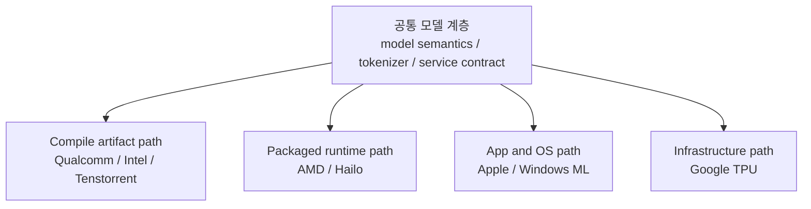
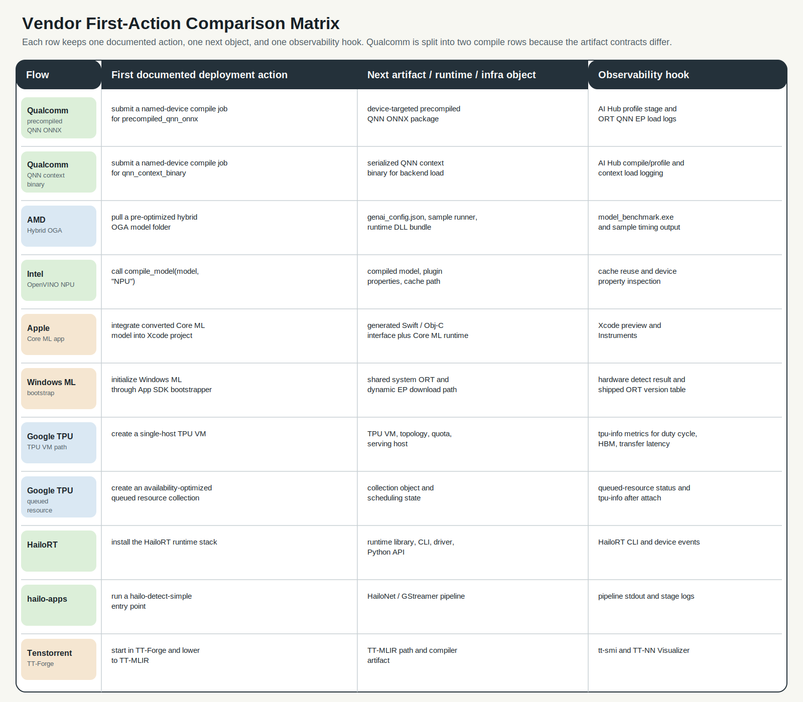
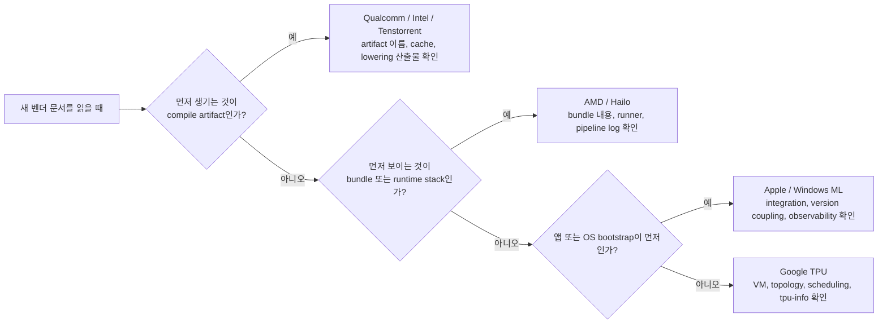
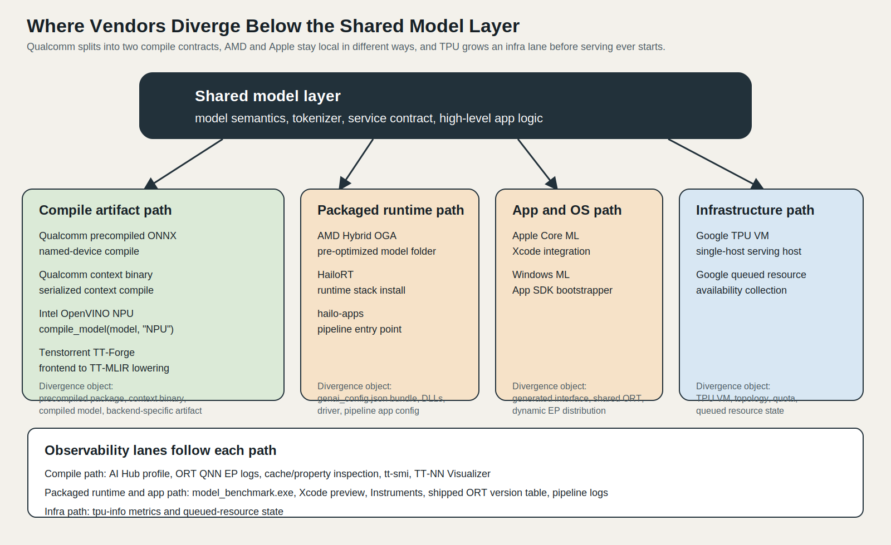

# Vendor Case Studies and Comparison

## 수업 개요
이 챕터의 비교 대상은 칩 이름이 아니라 배포 경로다. 2026년의 NPU 문서는 대체로 `공통 모델 계층`을 유지한 채, 그 아래에서 벤더별 compile artifact, runtime bundle, OS abstraction, infra object가 갈라지는 구조를 보여 준다. 그래서 비교도 성능표보다 `첫 action`, `그 다음에 생기는 object`, `운영 중 확인할 hook`를 같은 축에 놓고 해야 한다. [S1] [S3] [S4] [S5] [S8] [S10] [S18]

이번 장에서는 Qualcomm, AMD, Intel, Apple, Windows ML, Google TPU, Hailo, Tenstorrent를 한 줄 소개로 끝내지 않는다. 각 벤더를 `공통 계층 / 벤더 특화 계층 / 실제 배포 사례 / 실패하기 쉬운 지점`으로 나눠 읽으면서, 왜 어떤 팀은 compile log부터 보고 어떤 팀은 version table이나 topology부터 확인하는지 연결해서 정리한다. [S2] [S5] [S7] [S9] [S11] [S12] [S14] [S17]

## 학습 목표
- Qualcomm, AMD, Intel, Apple, Windows ML, Google TPU, Hailo, Tenstorrent를 같은 비교축으로 다시 정리할 수 있다.
- 공통 모델 계층이 끝나는 지점과 vendor-specific compile/runtime artifact가 시작되는 지점을 설명할 수 있다.
- Windows ML의 ORT 버전 결합, TPU topology 가정, 벤더 간 artifact 재사용 오해 같은 실패 모드를 비교 관점에서 설명할 수 있다.
- 새 벤더 문서를 읽을 때도 `first action -> next object -> observability hook` 순서로 해석할 수 있다.

## 수업 전에 생각할 질문
- 같은 모델을 내보냈는데도 Qualcomm의 precompiled package, Intel의 compiled model, Tenstorrent의 TT-MLIR artifact는 왜 서로 교환되지 않을까?
- AMD Hybrid OGA와 HailoRT는 둘 다 "빠르게 시작되는 경로"처럼 보이는데, 실제 운영 책임은 어디서 갈라질까?
- Apple Core ML과 Windows ML은 둘 다 높은 수준의 추론 계층을 제공하는데, 디버깅 시작점은 왜 같지 않을까?
- Google TPU를 읽을 때는 왜 모델 변환보다 TPU VM, topology, scheduling 같은 단어가 먼저 눈에 들어와야 할까?

## 강의 스크립트
### Part 1. 공통 계층이 끝나는 지점을 먼저 고정한다
**교수자:** 벤더 비교를 잘못 시작하면 곧장 브랜드 암기표가 됩니다. 이 장에서는 벤더 이름보다 먼저 `공통 모델 계층이 어디까지 살아남는가`를 봅니다. tokenizer, 서비스 입출력 계약, 상위 애플리케이션 로직까지는 비교적 공유되지만, compile job, runtime bundle, OS bootstrapper, TPU VM 같은 object가 등장하는 순간부터는 벤더 문맥이 우선합니다. [S2] [S4] [S8] [S10] [S18]

**학습자:** 그러면 ONNX 같은 공통 표현은 출발점일 뿐이고, 실전 차이는 그 아래에서 생긴다는 말이군요. [S3] [S8] [S18]

**교수자:** 맞습니다. Qualcomm은 named-device compile 뒤에 precompiled package나 QNN context binary가 생기고, Intel은 `compile_model(model, "NPU")` 이후 compiled model과 cache/property가 중요해집니다. Apple은 앱 프로젝트 안의 Core ML runtime으로 들어가고, Windows ML은 App SDK bootstrapper와 shared ORT/version 관계가 앞에 나옵니다. Google TPU는 serving 전에 TPU VM과 topology, queued resource 같은 infra object가 먼저 생깁니다. [S2] [S3] [S5] [S7] [S8] [S9] [S10] [S11] [S12]

$$
R_{\mathrm{shared}} = \frac{N_{\mathrm{shared\ interfaces}}}{N_{\mathrm{shared\ interfaces}} + N_{\mathrm{vendor\ objects}}}
$$

이 식은 성능 공식이 아니라 읽기 도구다. `N_shared_interfaces`가 크면 모델과 앱 계약을 넓게 재사용하기 쉽고, `N_vendor_objects`가 커질수록 특정 플랫폼에 밀착한 최적화와 운영 절차가 늘어난다. Qualcomm의 precompiled package, Intel의 compiled model, Windows ML의 shipped ORT coupling, Google TPU의 queued resource는 모두 `N_vendor_objects`를 키우는 사례다. [S2] [S5] [S9] [S12]

이 그림은 벤더를 성능이 아니라 `문서가 먼저 시키는 action`, `그 다음 object`, `관측 hook`으로 정렬한다. Qualcomm이 두 줄로 분리된 이유도 중요하다. 같은 Qualcomm 문맥 안에서도 `precompiled_qnn_onnx`와 `qnn_context_binary`는 artifact 계약이 다르기 때문에, "Qualcomm compile"이라고 한 덩어리로 적으면 실제 배포 차이를 놓치게 된다. Intel row의 `compile_model(..., "NPU")`, Windows ML row의 shared ORT/version table, Google TPU row의 VM/topology/queued resource도 같은 비교축에서 읽어야 한다. [I1] [S2] [S3] [S5] [S9] [S11] [S12]

### Part 2. 벤더별로 무엇이 공통이고 무엇이 vendor-specific인가
**학습자:** 그럼 비교표도 "누가 더 범용적인가"보다 "어떤 object를 만들고 무엇을 먼저 점검하는가" 중심이어야겠네요. [S2] [S5] [S8] [S12]

**교수자:** 그렇습니다. 아래 표를 볼 때는 벤더 이름보다 세 번째 열과 네 번째 열을 먼저 읽으세요. 그 열이 실제 bring-up과 장애 대응 순서를 거의 결정합니다.

| 벤더 | 공통 계층 | 벤더 특화 계층 | 실제 배포 사례 |
| --- | --- | --- | --- |
| Qualcomm | 상위 모델 계약과 ORT 연동 감각은 공유할 수 있다. [S3] | AI Hub compile job, precompiled package, QNN context binary, QNN EP load 경로가 핵심이다. [S1] [S2] [S3] | named-device compile 후 device-targeted artifact를 만들어 on-device inference로 연결한다. [S1] [S2] |
| AMD | 모델 의미와 앱 입출력 계약은 공통으로 남는다. [S4] | pre-optimized hybrid OGA folder, `genai_config.json`, sample runner, runtime DLL bundle이 AMD 문맥을 만든다. [S4] | Ryzen AI 환경에서 Hybrid OGA bundle을 내려받아 benchmark와 sample 실행으로 bring-up한다. [S4] |
| Intel | 상위 모델과 서비스 계약은 공유 가능하다. [S5] | `compile_model(model, "NPU")`, plugin properties, cache path, NPU device mode가 핵심 제어점이다. [S5] | OpenVINO NPU target으로 compiled model을 만들고 NPU Acceleration Library 맥락에서 활용한다. [S5] [S6] |
| Apple | 모델 기능과 앱 로직은 공통 계층에 가깝다. [S7] | Core ML model package, generated interface, Xcode integration, Instruments가 Apple 특화 계층이다. [S7] | 앱 프로젝트에 Core ML 모델을 넣고 device-side runtime으로 통합한다. [S7] |
| Windows ML | ONNX와 앱 추론 API 감각은 일부 공유된다. [S8] | App SDK bootstrapper, shared system ORT, dynamic EP download path, shipped ORT version table이 중요하다. [S8] [S9] | Windows 앱에서 OS 측 추론 계층을 사용하면서 ORT 결합과 hardware detect를 함께 관리한다. [S8] [S9] |
| Google TPU | 상위 서비스 계약은 공유되더라도 infra 준비가 먼저다. [S10] | TPU VM, topology, quota, queued resource collection, scheduling state, `tpu-info`가 핵심 object다. [S10] [S11] [S12] [S13] | single-host TPU VM이나 availability-oriented queued resource collection을 준비한 뒤 inference를 운영한다. [S10] [S12] |
| Hailo | 모델 입출력 계약은 공통 관점으로 이해할 수 있다. [S14] [S15] | HailoRT runtime library, CLI, driver, Python API, hailo-apps pipeline이 핵심이다. [S14] [S15] | runtime stack을 설치하고 `hailo-detect-simple` 같은 entry point로 edge pipeline을 붙인다. [S14] [S15] |
| Tenstorrent | 상위 모델 의미와 프레임워크 쪽 정의는 공통으로 남는다. [S16] | TT-Forge, TT-MLIR lowering, `tt-smi`, TT-NN Visualizer가 vendor-specific toolchain을 이룬다. [S17] [S18] | TT-Forge로 lowering을 시작하고 도구 체인으로 artifact와 실행 상태를 확인한다. [S17] [S18] |

### Part 3. 같은 "쉬운 시작"도 종류가 다르다
**교수자:** AMD와 Hailo를 보면 둘 다 시작이 쉬워 보여요. 하지만 쉬운 이유가 다릅니다. AMD는 pre-optimized hybrid OGA folder와 benchmark executable이 먼저 보이는 `번들 중심` 경로이고, Hailo는 runtime stack과 pipeline entry point가 먼저 보이는 `edge runtime stack 중심` 경로입니다. 같은 "빠른 bring-up"으로 묶어도 준비물과 운영 책임은 다릅니다. [S4] [S14] [S15]

**학습자:** Apple과 Windows ML도 둘 다 높은 수준의 추상화 같지만, Apple은 앱 통합이 먼저이고 Windows ML은 OS/runtime distribution과 version table이 먼저라는 차이가 있겠군요. [S7] [S8] [S9]

**교수자:** 정확합니다. Apple은 Xcode integration과 Instruments가 자연스러운 관측 도구인데, Windows ML은 shipped ORT version과 dynamic EP distribution까지 같이 봐야 합니다. 추상화가 높다는 공통점만 적으면, 왜 Windows 팀이 버전 표를 먼저 보고 Apple 팀은 프로젝트 통합과 기기 측 동작을 먼저 보는지 설명이 안 됩니다. [S7] [S8] [S9]

$$
C_{\mathrm{ops}} = N_{\mathrm{artifacts}} + N_{\mathrm{runtime\ knobs}} + N_{\mathrm{infra\ prerequisites}}
$$

이 식은 운영 표면적을 읽기 위한 근사식이다. Qualcomm과 Intel은 `N_artifacts`와 `N_runtime_knobs`가 상대적으로 크게 드러나고, Windows ML은 version coupling 때문에 `N_runtime_knobs`가 늘어난다. Google TPU는 topology, quota, scheduling 때문에 `N_infra_prerequisites`가 급격히 커진다. Apple은 앱 팀 관점에서 진입은 단순하지만 내부 제어점을 세세하게 노출하는 스타일은 아니다. [S3] [S5] [S7] [S9] [S10] [S11] [S12]

이 그림은 공통 모델 계층 아래에서 네 개의 분기 차선을 보여 준다. Qualcomm·Intel·Tenstorrent는 compile artifact 차선으로, AMD·Hailo는 packaged runtime 차선으로, Apple·Windows ML은 app/OS 차선으로, Google TPU는 infra 차선으로 내려간다. 맨 아래 observability lane까지 함께 그려 둔 이유는, 비교의 끝이 artifact 생성이 아니라 `무엇을 보고 상태를 판단하는가`에 있기 때문이다. Intel/OpenVINO를 볼 때도 단순 브랜드 이미지보다 `compiled model, plugin properties, cache path`가 실제 control point라는 점을 이 그림으로 확인해야 한다. [I2] [S4] [S5] [S7] [S8] [S9] [S10] [S12] [S13] [S17] [S18]

### Part 4. 실패 모드로 읽어야 비교가 선명해진다
**교수자:** 비교가 진짜 살아나는 순간은 실패 사례를 붙일 때입니다. 예를 들어 팀이 개발용 노트북에서 최신 standalone ONNX Runtime으로 모델을 검증하고, 배포 단계에서 Windows ML의 shared ORT 경로로 그대로 옮겼다고 합시다. 이때 "같은 ONNX니까 그대로 된다"라고 가정하면 안 됩니다. Windows ML은 shipped ORT version table과 결합되어 있으므로, 먼저 버전 대응을 다시 확인해야 합니다. 이 실패는 모델 품질 문제가 아니라 runtime coupling 문제입니다. [S8] [S9]

**학습자:** Qualcomm이나 Intel에서도 비슷한 오해가 생길 수 있나요?

**교수자:** 생깁니다. Qualcomm의 precompiled package나 QNN context binary를 만들어 놓고, 그것을 Intel OpenVINO compiled model처럼 다른 vendor stack에서 재사용할 수 있다고 생각하면 바로 막힙니다. 교차 재사용이 가능한 것은 대체로 공통 모델 계층이지, vendor-specific artifact가 아닙니다. Qualcomm artifact는 Qualcomm runtime/QNN 문맥에서, Intel compiled model은 OpenVINO NPU 문맥에서 다시 만들어야 합니다. [S2] [S3] [S5]

**학습자:** Google TPU는 실패 양상이 더 운영 쪽에 가깝겠네요. single-host 기준으로 잡은 serving 계획을 topology나 queued resource 제약이 다른 환경에 그대로 가져가면, 모델이 아니라 자원 준비 단계에서 막힐 수 있으니까요. [S10] [S11] [S12]

**교수자:** 바로 그 차이입니다. TPU는 모델 graph가 맞더라도 topology, quota, scheduling state가 맞지 않으면 시작선에 서지 못합니다. 그래서 TPU 문서는 accelerator 사양표보다 VM, topology, collection scheduling, `tpu-info`를 먼저 읽어야 합니다. [S10] [S11] [S12] [S13]

### Part 5. 벤더 선택 기준은 "무엇을 포기할 준비가 돼 있는가"다
**교수자:** 이제 선택 기준을 정리해 봅시다. Qualcomm, Intel, Tenstorrent는 compile/toolchain을 더 깊게 받아들이는 대신 하드웨어 밀착 제어를 얻는 쪽입니다. AMD와 Hailo는 준비된 bundle/runtime stack으로 빠르게 시작하는 대신 제어점이 패키지에 묶이는 편이고, Apple과 Windows ML은 앱/OS 추상화의 편의성을 얻는 대신 내부 runtime 차이를 직접 들여다보는 표면이 상대적으로 줄어듭니다. Google TPU는 애초에 infra 운영 책임을 받아들이는 대신 데이터센터 수준의 serving 경로를 얻습니다. [S4] [S5] [S7] [S8] [S10] [S14] [S18]

**학습자:** 결국 "이식성 대 최적화"라는 말도 추상적인 구호가 아니라, 어느 시점부터 vendor object를 받아들이고 어느 정도의 운영 표면적을 감수할지 결정하는 문제군요. [S2] [S5] [S9] [S12] [S18]

**교수자:** 맞습니다. 공통 모델 계층을 오래 유지하면 실험 비교와 재사용이 쉬워지고, vendor object를 일찍 수용하면 특정 플랫폼 최적화와 관측 도구를 깊게 쓸 수 있습니다. 어느 쪽이 옳다는 게 아니라, 팀이 디버깅과 운영을 어디까지 책임질지 먼저 정해야 합니다. [S3] [S5] [S8] [S13] [S17]

## 자주 헷갈리는 포인트
- `ONNX를 쓴다 = 이식성이 높다`는 절반만 맞는 말이다. 공통 모델 계층은 공유되더라도, compile artifact와 runtime object는 벤더마다 다시 만들어야 한다. [S2] [S3] [S5] [S18]
- Qualcomm과 Intel을 둘 다 "compile-first"로만 적으면 부족하다. Qualcomm은 AI Hub compile contract와 QNN artifact, Intel은 OpenVINO compiled model과 cache/property가 핵심이다. [S2] [S3] [S5]
- AMD Hybrid OGA와 HailoRT를 둘 다 "쉬운 runtime"으로 묶으면 운영 책임을 놓친다. AMD는 bundle/runner, Hailo는 runtime stack/pipeline이 중심이다. [S4] [S14] [S15]
- Apple과 Windows ML을 둘 다 "앱 개발자 친화적"으로만 묶으면 안 된다. Apple은 Core ML 통합과 Instruments가 앞에 오고, Windows ML은 shared ORT와 shipped version table이 앞에 온다. [S7] [S8] [S9]
- Google TPU는 accelerator 문서라기보다 infra 문서처럼 읽어야 한다. topology, quota, collection scheduling, `tpu-info`가 배포 성공 여부를 가른다. [S10] [S11] [S12] [S13]

## 사례로 다시 보기
### 사례 1. 스마트폰 앱과 Windows 앱을 함께 내는 팀
한 팀이 Snapdragon 스마트폰 앱과 Windows 노트북 앱을 동시에 준비한다고 하자. 둘 다 "on-device inference"라고 묶으면 의사결정이 흐려진다. Qualcomm 쪽은 named-device compile과 QNN artifact를 관리할 사람, Windows ML 쪽은 App SDK bootstrapper와 shipped ORT version table을 확인할 사람이 필요하다. 같은 모델을 써도 첫 장애 대응 문서는 서로 다르다. [S2] [S3] [S8] [S9]

### 사례 2. 공장 edge 장비와 클라우드 TPU 서비스를 함께 운영하는 팀
이 팀이 Hailo와 Google TPU를 둘 다 "추론 가속기"라고만 쓰면 체크리스트가 무너진다. Hailo는 runtime stack, driver, pipeline entry point를 올바르게 붙였는지가 먼저이고, Google TPU는 VM, topology, queued resource, `tpu-info`로 자원 상태를 먼저 확인해야 한다. 전자는 device bring-up, 후자는 infra readiness가 중심이다. [S12] [S13] [S14] [S15]

### 사례 3. 벤더 종속성을 늦게 받아들이려는 팀
한 연구팀이 공통 모델 계층을 최대한 오래 유지하고 싶다면, Qualcomm·Intel·Tenstorrent에서는 vendor artifact를 마지막 단계에 도입하는 설계를 고를 수 있다. 반대로 특정 하드웨어를 빠르게 제품화해야 한다면 AMD/Hailo의 bundle/runtime path나 Apple/Windows ML의 app/OS path가 더 자연스러울 수 있다. Google TPU는 이 논의와 별도로, 인프라 준비를 감수할 의사가 있는지부터 판단해야 한다. [S4] [S5] [S7] [S8] [S10] [S18]

## 핵심 정리
- 2026년의 NPU 벤더 비교는 칩 성능표보다 `공통 모델 계층이 끝나고 vendor-specific object가 시작되는 지점`을 읽는 작업에 가깝다. [S1] [S5] [S8] [S18]
- Qualcomm·Intel·Tenstorrent는 compile/toolchain 중심, AMD·Hailo는 bundle/runtime 중심, Apple·Windows ML은 app/OS abstraction 중심, Google TPU는 infra 중심으로 읽어야 한다. [S4] [S7] [S10] [S14] [S17]
- 실패 모드는 벤더마다 다르다. Windows ML은 ORT version coupling, Google TPU는 topology/scheduling, Qualcomm·Intel은 artifact 재생성과 cache/runtime control이 주요 분기점이다. [S3] [S5] [S9] [S11] [S12]

## 복습 체크리스트
- 벤더 문서를 읽을 때 `first action -> next object -> observability hook` 세 칸으로 다시 적어 보았는가?
- Qualcomm의 두 compile contract를 하나로 뭉개지 않았는가?
- Windows ML에서 shipped ORT version table을 모델 정확도 문제와 분리해 해석할 수 있는가?
- Google TPU에서 topology와 queued resource를 모델 그래프 문제와 구분해 설명할 수 있는가?
- AMD/Hailo, Apple/Windows ML처럼 비슷해 보이는 추상화를 실제 운영 책임 기준으로 다시 나눌 수 있는가?

## 대안과 비교
| 접근 | 장점 | 단점 | 잘 맞는 벤더/경로 |
| --- | --- | --- | --- |
| 공통 모델 계층을 오래 유지 | 비교 실험과 재사용이 쉽다 | vendor-specific artifact 최적화 진입이 늦다 | 초기 ONNX 중심 비교, Windows ML 초기 검토, Qualcomm/Intel 사전 탐색 [S3] [S8] |
| compile artifact를 빨리 수용 | 하드웨어 밀착 최적화와 cache/control point를 빨리 잡는다 | 벤더 종속성이 빠르게 커진다 | Qualcomm AI Hub, Intel OpenVINO NPU, Tenstorrent TT-Forge [S2] [S5] [S18] |
| bundle/runtime path를 우선 사용 | bring-up 속도가 빠르다 | 내부 제어점이 패키지 문맥에 묶인다 | AMD Hybrid OGA, HailoRT + hailo-apps [S4] [S14] [S15] |
| app/OS 또는 infra 추상화를 적극 활용 | 제품 통합과 운영 절차가 단순해질 수 있다 | 하위 계층 제어와 디버깅 경로가 멀어진다 | Apple Core ML, Windows ML, Google TPU [S7] [S8] [S10] [S12] |

## 참고 이미지
- [I1] 파일: `./assets/img-01.svg`
- [I1] 제목: Split Qualcomm rows를 포함한 vendor first-action comparison matrix
- [I1] 본문 연결: Part 1에서 벤더별 `first action -> next object -> observability hook`를 한 화면에 비교할 때 사용했다.
- [I2] 파일: `./assets/img-02.svg`
- [I2] 제목: Shared model layer divergence paths and observability lanes diagram
- [I2] 본문 연결: Part 3에서 공통 모델 계층 아래에서 compile/runtime/app/infra 차선으로 갈라지는 구조와 Intel/OpenVINO의 control point를 설명할 때 사용했다.

## 출처
| 번호 | 제목 | 발행 주체 | 날짜 | URL | 사용 이유 |
| --- | --- | --- | --- | --- | --- |
| [S1] | Qualcomm AI Hub overview | Qualcomm AI Hub | 2026-03-08 (accessed) | https://app.aihub.qualcomm.com/docs/index.html | Qualcomm의 optimize/profile/deploy 흐름과 observability 연결을 설명할 때 사용 |
| [S2] | Compile examples | Qualcomm AI Hub | 2026-03-08 (accessed) | https://app.aihub.qualcomm.com/docs/hub/compile_examples.html | named-device compile, precompiled package, QNN context binary 계약을 설명할 때 사용 |
| [S3] | QNN Execution Provider | ONNX Runtime | 2026-03-08 (accessed) | https://onnxruntime.ai/docs/execution-providers/QNN-ExecutionProvider.html | QNN EP, load logs, Qualcomm runtime 연결을 설명할 때 사용 |
| [S4] | Hybrid On-Device GenAI workflow | AMD Ryzen AI docs | 2026-03-08 (accessed) | https://ryzenai.docs.amd.com/en/1.6/hybrid_oga.html | Hybrid OGA folder, bundle, benchmark 흐름을 AMD 사례로 설명할 때 사용 |
| [S5] | NPU device | OpenVINO | 2026-03-08 (accessed) | https://docs.openvino.ai/2025/openvino-workflow/running-inference/inference-devices-and-modes/npu-device.html | Intel OpenVINO NPU의 compiled model, cache, plugin properties를 설명할 때 사용 |
| [S6] | Intel NPU Acceleration Library | Intel | 2026-03-08 (accessed) | https://intel.github.io/intel-npu-acceleration-library/ | Intel NPU 활용 맥락을 보강할 때 사용 |
| [S7] | Core ML Overview | Apple Developer | 2026-03-08 (accessed) | https://developer.apple.com/machine-learning/core-ml/ | Apple Core ML의 app integration과 observability 맥락을 설명할 때 사용 |
| [S8] | Windows ML overview | Microsoft Learn | 2026-03-08 (accessed) | https://learn.microsoft.com/en-us/windows/ai/new-windows-ml/overview | Windows ML의 bootstrapper, shared runtime, hardware detect 문맥을 설명할 때 사용 |
| [S9] | ONNX Runtime versions shipped in Windows ML | Microsoft Learn | 2026-02-14 | https://learn.microsoft.com/en-us/windows/ai/new-windows-ml/onnx-versions | Windows ML의 shipped ORT version coupling 실패 모드를 설명할 때 사용 |
| [S10] | Cloud TPU inference | Google Cloud | 2025-09-04 | https://cloud.google.com/tpu/docs/v5e-inference | TPU inference serving 경로와 TPU VM 문맥을 설명할 때 사용 |
| [S11] | TPU v5e | Google Cloud | 2025-12-30 | https://cloud.google.com/tpu/docs/v5e | TPU topology와 single-host serving 조건을 설명할 때 사용 |
| [S12] | TPU collection scheduling for inference workloads | Google Cloud | 2025-11-01 (accessed) | https://cloud.google.com/tpu/docs/collection-scheduling | queued resource collection과 scheduling state를 설명할 때 사용 |
| [S13] | Monitor with tpu-info CLI | Google Cloud | 2026-02-01 (accessed) | https://docs.cloud.google.com/tpu/docs/tpu-info-cli | TPU observability와 `tpu-info` hook를 설명할 때 사용 |
| [S14] | HailoRT | Hailo GitHub | 2026-03-08 (accessed) | https://github.com/hailo-ai/hailort | Hailo runtime library, CLI, driver, Python API를 설명할 때 사용 |
| [S15] | hailo-apps | Hailo GitHub | 2026-03-08 (accessed) | https://github.com/hailo-ai/hailo-apps | Hailo pipeline entry point와 app path를 설명할 때 사용 |
| [S16] | Tenstorrent documentation | Tenstorrent | 2026-03-08 (accessed) | https://docs.tenstorrent.com/index.html | Tenstorrent 스택의 공통 문맥과 공개 문서 관점을 설명할 때 사용 |
| [S17] | Tenstorrent tools | Tenstorrent | 2026-02-20 (accessed) | https://docs.tenstorrent.com/tools/index.html | `tt-smi`, TT-NN Visualizer 등 observability 도구를 설명할 때 사용 |
| [S18] | TT-Forge | Tenstorrent | 2026-02-15 (accessed) | https://docs.tenstorrent.com/forge/index.html | TT-Forge와 TT-MLIR lowering을 vendor-specific compile path 사례로 설명할 때 사용 |
