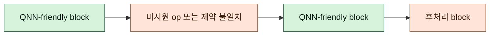
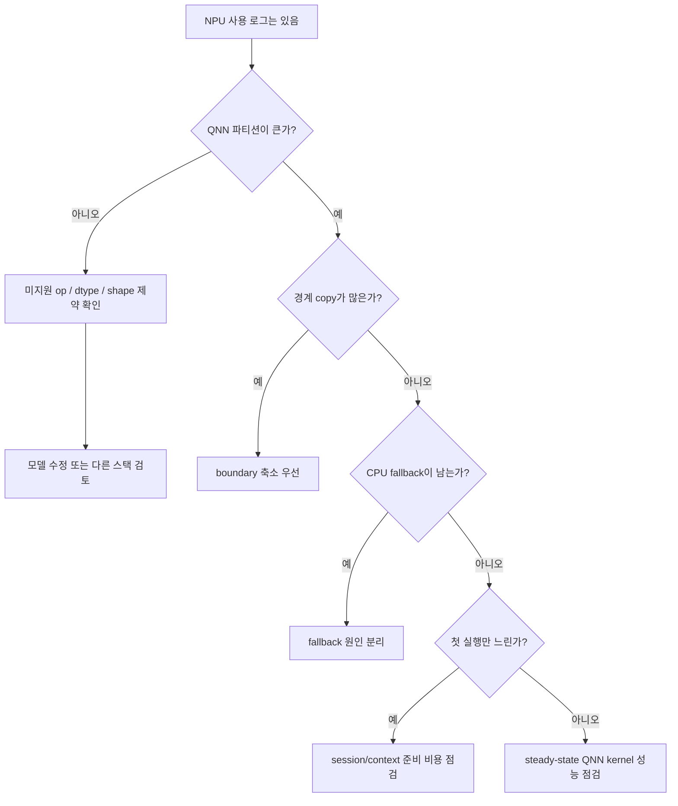

# ONNX Runtime QNN

## 수업 개요
Snapdragon PC에서 `QNNExecutionProvider` 로그는 분명 보이는데, 첫 실행은 무겁고 반복 실행도 기대만큼 줄지 않는 경우가 있다. 이 챕터는 바로 그 장면을 읽는 법을 다룬다. QNN EP는 ONNX Runtime 안에서 ONNX graph의 일부를 Qualcomm QNN backend로 넘기는 execution provider다. 그래서 관심사는 "NPU를 썼다"가 아니라 "어떤 subgraph가 QNN으로 갔고, 어떤 경계에서 CPU fallback과 복사가 남았는가"가 된다. [S1]

또 하나의 실무 질문은 portability다. QNN 친화적으로 모델을 손보면 Qualcomm 경로는 좋아질 수 있지만, 같은 ONNX 모델을 Windows ML, Ryzen AI, OpenVINO 같은 다른 창구에서도 유지해야 하는 팀에는 비용이 된다. 이 챕터의 tradeoff가 `표준 API와 vendor 최적화`인 이유가 여기에 있다. [S1] [S2] [S3] [S4]

## 학습 목표
- QNN EP가 ONNX Runtime session 안에서 graph를 QNN subgraph와 비QNN 구간으로 나누는 구조를 설명한다.
- Snapdragon PC에서 subgraph fragmentation이 왜 latency를 망칠 수 있는지 진단 순서로 설명한다.
- init/context 준비 비용과 steady-state 실행 시간을 분리해 읽는다.
- QNN-friendly 모델 수정이 portability와 충돌하는 지점을 비교 스택과 함께 설명한다.

## 수업 전에 생각할 질문
- 로그에 NPU 사용이 찍혔는데 latency가 줄지 않았다면, 가장 먼저 볼 숫자는 무엇인가?
- 첫 실행만 느린가, 반복 호출도 느린가? 이 둘을 분리하지 않으면 어떤 오판이 생길까?
- Qualcomm NPU를 직접 겨냥하려는 것인지, Windows 배포 창구를 우선하려는 것인지 지금 팀의 목표가 분명한가?

## 강의 스크립트
### Part 1. QNN EP를 보는 출발점
**교수자:** 오늘은 "Qualcomm NPU를 ONNX Runtime 안에서 어떻게 쓰는가"를 봅니다. QNN EP는 새 모델 포맷이 아니라 execution provider입니다. 앱은 ONNX Runtime API를 유지한 채 session을 만들고, provider 설정에 따라 graph 일부를 Qualcomm backend로 넘깁니다. [S1]

**학습자:** 그러면 모델 전체가 자동으로 QNN으로 가는 게 아니라, 가능한 부분만 넘겨지는 건가요?

**교수자:** 맞습니다. S1이 설명하는 핵심이 바로 capability 기반 위임입니다. QNN EP가 지원하는 연산, 데이터 타입, 제약을 만족하는 subgraph만 QNN backend로 가고, 나머지는 다른 provider에 남습니다. 그래서 이 챕터에서는 평균 latency보다 먼저 partition 구조를 봅니다. [S1]

**학습자:** Windows ML과는 어떤 차이로 봐야 하나요?

**교수자:** Windows ML은 Windows 쪽 배포와 on-device AI 경험을 묶는 상위 창구이고, QNN EP는 ONNX Runtime 내부에서 Qualcomm backend를 직접 붙이는 더 아래 선택지입니다. 같은 Windows 기기에서도 질문이 다릅니다. Windows ML은 "OS 통합을 우선할까", QNN EP는 "Qualcomm NPU를 직접 겨냥할까"를 먼저 묻습니다. [S1] [S2]

### Part 2. Snapdragon PC에서 graph가 왜 잘게 찢어지는가
**교수자:** QNN EP를 설명할 때 가장 QNN다운 실패 사례는 이겁니다. Snapdragon PC에서 모델을 올렸더니 중간의 특정 op나 데이터 변환 패턴이 QNN 조건을 만족하지 못해서 subgraph가 여러 조각으로 갈립니다. QNN 파티션 사이사이에 CPU fallback이 끼고, 경계마다 tensor copy가 생깁니다. [S1]

**학습자:** "QNN을 사용했다"는 로그가 있어도 partition이 잘게 나뉘면 손해가 클 수 있겠네요.

**교수자:** 그렇습니다. S1이 말하는 것은 "QNN이 지원하는 subgraph를 고른다"는 사실이고, 실무에서는 그 사실을 아래처럼 계량해서 봅니다. 이 식은 문서의 직접 공식이 아니라, S1의 partition/fallback 구조를 운영 판단식으로 바꾼 것이다. [합성] [S1]

#### 핵심 수식 1. 가중 QNN 오프로드 비율
$$
\eta_{\mathrm{qnn}} =
\frac{\sum_{v \in V_{\mathrm{QNN}}} c(v)}
{\sum_{v \in V_{\mathrm{all}}} c(v)}
$$

여기서 \(c(v)\)는 단순 노드 수가 아니라 해당 연산이 차지하는 실행 비용의 가중치다. 같은 70퍼센트 offload라도, 값비싼 블록이 CPU에 남아 있으면 체감은 낮다. 반대로 비싼 블록이 한 덩어리로 QNN에 들어가면 일부 후처리가 CPU에 남아도 괜찮다. 이 해석도 S1의 capability 기반 partition 설명을 운영 지표로 합성한 것이다. [합성] [S1]

**교수자:** 이 그림은 QNN EP의 교과서적인 함정입니다. block 자체는 QNN에 잘 맞는데, 중간의 한 조각이 전체를 여러 파티션으로 끊어 버립니다. 그래서 "모델을 QNN에서 돌린다"보다 "QNN 파티션 사이에 무엇이 끼었는가"를 묻는 습관이 필요합니다. [S1]

### Part 3. cold-start와 steady-state를 따로 본다
**학습자:** 그런데 어떤 팀은 첫 실행만 무겁고, 반복 실행은 괜찮다고 하더군요. 이것도 QNN EP 특성인가요?

**교수자:** QNN EP에서는 특히 중요합니다. S1에는 backend 준비와 context binary 관련 선택지가 함께 나온다. 즉 session을 만들고 QNN 쪽 실행 문맥을 준비하는 비용과, 이미 준비된 뒤 반복 호출하는 비용을 한 줄로 합치면 오해가 생긴다. 아래 식은 그 문서 사실을 바탕으로 cold-start를 읽기 위한 판단식이다. [합성] [S1]

#### 핵심 수식 2. 첫 실행 시간 분해
$$
T_{\mathrm{first}}
=
T_{\mathrm{session}}
+ T_{\mathrm{context}}
+ T_{\mathrm{qnn}}
+ N_{\mathrm{boundary}} \cdot T_{\mathrm{copy}}
+ T_{\mathrm{cpu\_fallback}}
$$

이 식에서 반복 실행의 steady-state는 보통 \(T_{\mathrm{session}}\)과 \(T_{\mathrm{context}}\)의 상당 부분을 이미 치른 뒤 남는 시간으로 읽는다. 그래서 첫 실행이 느린지, 반복 실행도 느린지 먼저 갈라야 한다. 첫 실행만 나쁘면 context 준비나 캐시 전략을 의심하고, 반복 실행도 나쁘면 boundary copy와 CPU fallback을 먼저 본다. 이것 역시 S1의 context 준비와 fallback 구조를 합성한 운영 식이다. [합성] [S1]

**학습자:** 그러면 steady-state가 빠른데 cold-start만 큰 서비스도 있을 수 있겠네요.

**교수자:** 있습니다. 예를 들어 상주 프로세스가 한번 session과 context를 올린 뒤 같은 모델을 오래 재사용하는 음성 명령 앱은 첫 실행만 크고 이후는 괜찮을 수 있습니다. 반대로 프로세스를 자주 다시 띄우는 짧은 유틸리티는 QNN 계산 성능이 좋아도 사용자는 "느리다"고 느낄 수 있습니다. 판단 기준이 다릅니다. [S1]

### Part 4. QNN-friendly 수정이 portability와 부딪힐 때
**학습자:** 그러면 fragmentation이 심한 모델은 그냥 QNN-friendly하게 다시 고치면 되지 않나요?

**교수자:** 여기서 tradeoff가 나온다. QNN EP 문서의 supported-op, 데이터 타입, 양자화 제약에 맞춰 모델을 손보면 Qualcomm 경로는 좋아질 수 있다. 하지만 같은 ONNX 모델을 Windows ML, AMD hybrid workflow, OpenVINO NPU target 같은 다른 창구에서도 유지해야 한다면, 그 수정이 전체 portability를 해칠 수 있다. [S1] [S2] [S3] [S4]

**학습자:** 예를 들면 어떤 선택인가요?

**교수자:** 팀이 특정 pattern을 QNN에서 잘 먹히는 형태로 바꾸거나, QNN 경로에 맞춘 양자화 전처리를 강하게 적용하는 선택입니다. 그 결과 Qualcomm에서는 큰 파티션을 얻지만, 다른 vendor stack에서는 추가 검증과 분기 관리가 필요할 수 있습니다. 그래서 이 챕터에서는 "성능을 위해 모델을 손볼 것인가"를 기술 문제가 아니라 제품 범위 문제로 다룹니다. [S1] [S3] [S4]

### Part 5. QNN EP 디버깅은 순서가 전부다
**교수자:** 실무에서 가장 자주 보는 장면을 하나 정리해 봅시다. 로그에는 NPU 사용이 찍혔다. 그런데 latency는 그대로다. 이때 저는 순서를 고정합니다.

1. QNN으로 간 subgraph 수와 크기를 본다.
2. 파티션 경계마다 copy나 layout 변환이 있는지 본다.
3. CPU fallback 구간이 어디인지 본다.
4. 첫 실행 시간과 반복 실행 시간을 분리해 기록한다.
5. 마지막에야 모델 수정이나 다른 스택 전환을 검토한다.

**학습자:** 왜 init/steady-state 분리가 세 번째나 네 번째가 아니라 네 번째인가요?

**교수자:** partition이 이미 잘게 갈려 있다면 cold-start를 줄여도 steady-state가 계속 나쁘기 때문입니다. 반대로 partition이 크고 fallback이 적은데 첫 실행만 크다면, 그때는 context 준비 비용이 주범일 가능성이 큽니다. 순서를 바꾸면 손봐야 할 층을 잘못 잡습니다. [S1]

**교수자:** 이 흐름도는 QNN-specific 진단 순서다. "로그에 NPU가 떴다"는 사실을 출발점으로 삼되, partition, boundary, fallback, init/steady-state를 차례대로 자른다. 이 순서를 기억해 두면 README 전체가 하나의 진단 매뉴얼처럼 읽힐 겁니다. [S1]

### Part 6. 다른 선택지와 구분하는 법
**학습자:** 결국 언제 QNN EP를 고르고, 언제 다른 경로를 봐야 하나요?

**교수자:** 질문을 바꾸면 쉽습니다. Qualcomm NPU를 직접 겨냥하고 싶은가? 그렇다면 QNN EP가 가장 직선적인 선택지입니다. Windows 앱 배포 창구와 OS 통합이 더 중요한가? 그렇다면 Windows ML이 먼저입니다. AMD의 CPU/GPU/NPU hybrid 흐름이 제품의 기본 전제인가? Ryzen AI OGA 쪽 질문입니다. Intel NPU target을 중심에 놓는가? OpenVINO 문맥입니다. compiler IR과 lowering 재설계가 필요한가? 그때는 MLIR, IREE, XLA 쪽으로 내려가야 합니다. [S1] [S2] [S3] [S4] [S5] [S6] [S7]

## 자주 헷갈리는 포인트
- QNN EP는 ONNX Runtime 바깥의 독립 런타임이 아니라, ONNX Runtime 안에서 Qualcomm backend를 붙이는 execution provider다. [S1]
- QNN 로그가 보였다고 해서 주요 계산이 QNN에 실렸다는 뜻은 아니다. 파티션이 잘게 갈리면 체감 latency는 그대로일 수 있다. [S1]
- 첫 실행 지연과 반복 실행 지연은 원인이 다르다. 앞쪽은 session/context 준비 비용, 뒤쪽은 boundary copy와 CPU fallback이 더 의심스럽다. [S1]
- 모델을 QNN-friendly하게 손보는 일은 성능 최적화이면서 동시에 portability 비용 결정이다. [S1] [S2] [S3] [S4]
- Windows ML, Ryzen AI OGA, OpenVINO NPU, MLIR/IREE/XLA는 QNN EP와 같은 층이 아니다. 비교는 "누구를 직접 겨냥하나"라는 질문으로 해야 한다. [S2] [S3] [S4] [S5] [S6] [S7]

## 사례로 다시 보기
### 사례 1. Snapdragon PC에서 subgraph가 여섯 조각으로 갈린 경우
**교수자:** 이 챕터를 대표하는 사례는 이겁니다. 모델 주요 블록은 Qualcomm NPU에 잘 맞는데, 중간의 몇 개 op 때문에 subgraph가 여섯 조각으로 갈렸습니다. 로그에는 QNN 사용이 찍히지만, 경계 copy와 CPU fallback이 반복돼 latency가 거의 줄지 않습니다. 여기서 먼저 볼 것은 kernel 미세 튜닝이 아니라 `조각 수`, `각 조각의 크기`, `조각 사이 복사`입니다. [S1]

**학습자:** 그러면 해결도 "더 빠른 NPU"가 아니라 "더 큰 파티션"을 만드는 쪽이군요.

**교수자:** 그렇습니다. 이 사례는 QNN EP를 "가속기 이름"이 아니라 "partition 품질"로 봐야 한다는 점을 가장 잘 보여 줍니다.

### 사례 2. 첫 실행 900ms, 반복 실행 120ms인 상주형 앱
**교수자:** 두 번째 사례는 음성 비서처럼 앱이 계속 살아 있는 경우입니다. 첫 실행은 session/context 준비 때문에 크지만, 한번 올라간 뒤에는 반복 호출이 빠릅니다. 이런 제품에서 cold-start만 보고 QNN EP를 버리면 잘못된 판단이 됩니다. 사용 패턴이 상주형이라면 steady-state가 더 중요할 수 있기 때문입니다. [S1]

**학습자:** 반대로 단발성 실행이 많은 앱이라면요?

**교수자:** 그때는 같은 숫자라도 해석이 달라집니다. QNN 계산 성능보다 cold-start 비용이 제품의 실제 UX를 지배할 수 있습니다.

### 사례 3. QNN-friendly rewrite를 넣을지 말지 고민하는 팀
**교수자:** 세 번째 사례는 조직 차원의 선택입니다. Qualcomm 경로에서 큰 파티션을 얻기 위해 모델 표현을 다듬고 싶다. 하지만 같은 ONNX 자산을 Windows ML이나 OpenVINO, AMD 경로에도 써야 한다. 이때 질문은 "기술적으로 가능한가"가 아니라 "Qualcomm 최적화 분기를 유지할 팀 역량이 있는가"입니다. [S1] [S2] [S3] [S4]

## 핵심 정리
- QNN EP는 ONNX Runtime graph를 Qualcomm backend가 처리 가능한 subgraph와 그 밖의 구간으로 나누는 execution provider다. [S1]
- QNN EP에서 성능을 읽는 핵심 단위는 "NPU 사용 여부"가 아니라 `가중 오프로드 비율`, `파티션 경계 수`, `CPU fallback 위치`다. [합성] [S1]
- 첫 실행과 반복 실행은 분리해서 봐야 한다. 전자는 session/context 준비 비용, 후자는 boundary copy와 fallback 구조가 더 크게 작용한다. [합성] [S1]
- QNN-friendly 모델 수정은 vendor 최적화를 얻는 대신 portability와 운영 복잡도를 키울 수 있다. [S1] [S2] [S3] [S4]
- 다른 스택과의 비교는 "층이 다르다"에서 끝내지 말고, 어떤 질문을 먼저 던져야 하는가로 정리해야 한다. [S2] [S3] [S4] [S5] [S6] [S7]

## 복습 체크리스트
- QNN EP를 "ONNX Runtime 안쪽에서 Qualcomm backend를 붙이는 방식"으로 설명할 수 있는가?
- 로그에 NPU 사용이 찍혔는데 latency가 줄지 않을 때, partition부터 init/steady-state까지 어떤 순서로 볼지 말할 수 있는가?
- \(\eta_{\mathrm{qnn}}\) 식이 단순 노드 수보다 실행 비용 가중치를 강조하는 이유를 설명할 수 있는가?
- \(T_{\mathrm{first}}\) 식에서 cold-start와 steady-state를 어떻게 분리해 읽는지 설명할 수 있는가?
- QNN-friendly rewrite가 portability와 왜 충돌할 수 있는지, 제품 범위 관점에서 설명할 수 있는가?
- Windows ML, Ryzen AI OGA, OpenVINO NPU, MLIR/IREE/XLA 중 어느 질문이 현재 팀의 질문과 맞는지 고를 수 있는가?

## 대안과 비교
| 선택지 | 결정적 선택 질문 | 이 선택이 맞는 경우 | 얻는 것 | 감수할 것 |
| --- | --- | --- | --- | --- |
| QNN EP | Qualcomm NPU를 직접 겨냥하는가? | ONNX Runtime API를 유지하면서 Qualcomm backend 제어가 중요할 때 [S1] | vendor 경로를 가장 직접적으로 다룸 [S1] | supported-op 제약, fragmentation, portability 비용 [S1] |
| Windows ML | Windows 배포 창구와 OS 통합이 더 중요한가? | Windows 앱 통합과 on-device AI 경험이 우선일 때 [S2] | OS 차원의 배포 일관성 [S2] | QNN EP만큼 직접적인 Qualcomm 제어는 아님 [S1] [S2] |
| Ryzen AI OGA | AMD의 hybrid CPU/GPU/NPU 흐름이 전제인가? | AMD 플랫폼에서 hybrid 실행 흐름 자체가 중요할 때 [S3] | hybrid orchestration 관점이 선명함 [S3] | Qualcomm 중심 최적화와는 질문이 다름 [S1] [S3] |
| OpenVINO NPU | Intel NPU target을 직접 관리해야 하는가? | Intel NPU device 선택과 최적화가 중심일 때 [S4] | Intel stack 기준 device 제어 [S4] | Qualcomm QNN 경로와는 운영 기준이 다름 [S1] [S4] |
| MLIR / IREE / XLA | compiler IR과 lowering을 다시 설계해야 하는가? | provider 교체가 아니라 compiler pipeline 재설계가 필요할 때 [S5] [S6] [S7] | 더 낮은 층의 표현과 코드 생성 제어 [S5] [S6] [S7] | 도입 복잡도와 재설계 비용 [S5] [S6] [S7] |

## 참고 이미지

- [I1] 캡션: Open Neural Network Exchange logo
- 출처 번호: [I1]
- 왜 이 그림이 필요한지: QNN EP가 독자 포맷이 아니라 ONNX graph를 출발점으로 삼는다는 사실을 상기시킨다.

- [I2] 캡션: IREE architecture
- 출처 번호: [I2]
- 왜 이 그림이 필요한지: 이 챕터가 execution provider 수준의 선택을 다루고, compiler IR 재설계는 더 아래 층의 문제라는 점을 대안 비교에서 선명하게 대비시킨다.

## 출처
| 번호 | 제목 | 발행 주체 | 날짜 | URL | 사용 이유 |
| --- | --- | --- | --- | --- | --- |
| [S1] | QNN Execution Provider | ONNX Runtime | 2026-03-08 (accessed) | [https://onnxruntime.ai/docs/execution-providers/QNN-ExecutionProvider.html](https://onnxruntime.ai/docs/execution-providers/QNN-ExecutionProvider.html) | QNN 기반 NPU offload, execution provider 구조, partition과 context 관련 판단의 기준 |
| [S2] | Windows ML overview | Microsoft Learn | 2026-03-08 (accessed) | [https://learn.microsoft.com/en-us/windows/ai/new-windows-ml/overview](https://learn.microsoft.com/en-us/windows/ai/new-windows-ml/overview) | Windows on-device inference와 OS 통합 관점 비교 |
| [S3] | Hybrid On-Device GenAI workflow | AMD Ryzen AI docs | 2026-03-08 (accessed) | [https://ryzenai.docs.amd.com/en/1.6/hybrid_oga.html](https://ryzenai.docs.amd.com/en/1.6/hybrid_oga.html) | AMD hybrid workflow와의 선택 질문 비교 |
| [S4] | NPU device | OpenVINO | 2026-03-08 (accessed) | [https://docs.openvino.ai/2025/openvino-workflow/running-inference/inference-devices-and-modes/npu-device.html](https://docs.openvino.ai/2025/openvino-workflow/running-inference/inference-devices-and-modes/npu-device.html) | Intel NPU target 경로와의 선택 질문 비교 |
| [S5] | MLIR Documentation | LLVM Project | 2026-03-08 (accessed) | [https://mlir.llvm.org/](https://mlir.llvm.org/) | IR와 lowering 계층의 기준점 |
| [S6] | IREE Documentation | IREE project | 2026-03-08 (accessed) | [https://iree.dev/](https://iree.dev/) | compiler/runtime 통합 계층과의 대비 |
| [S7] | XLA Architecture | OpenXLA | 2026-03-08 (accessed) | [https://openxla.org/xla/architecture](https://openxla.org/xla/architecture) | compiler pipeline 재설계 질문의 비교 축 |
