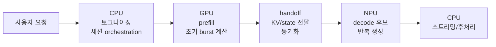
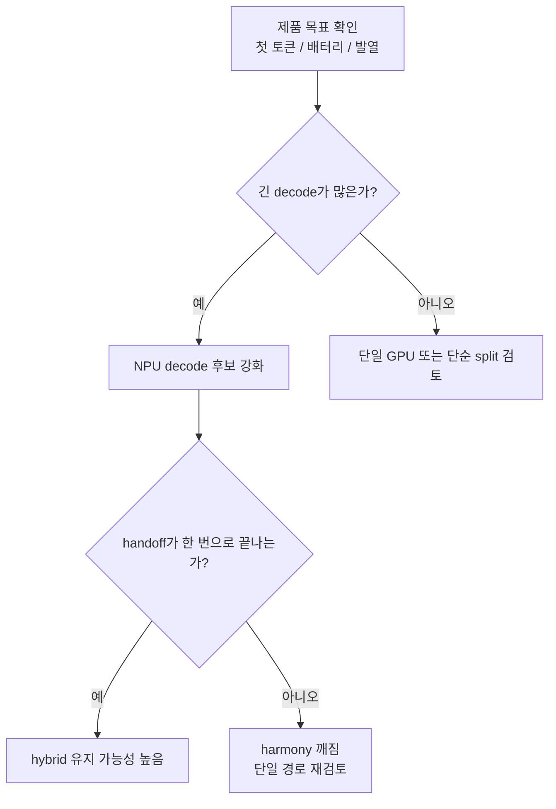
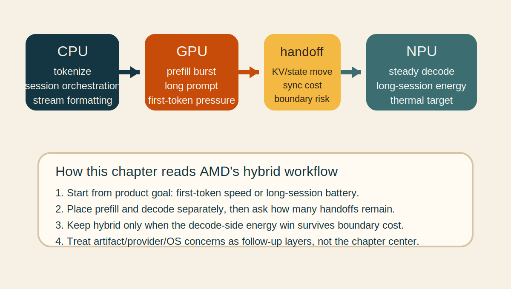
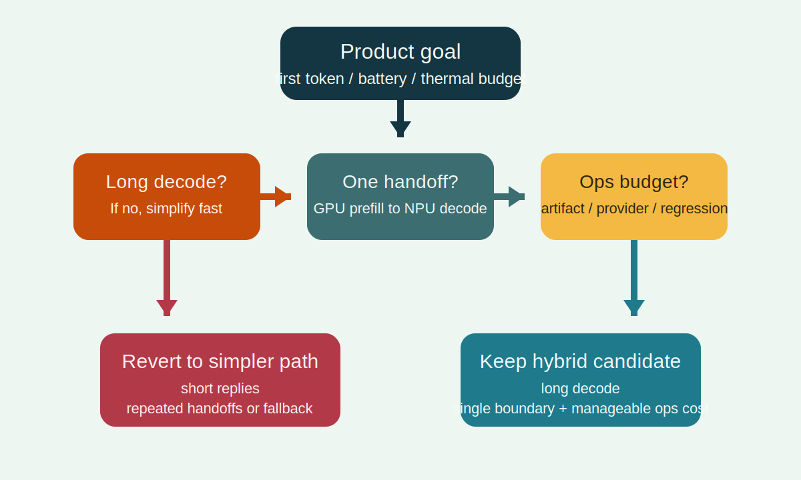

# Ryzen AI OGA

## 수업 개요
AMD Ryzen AI 문서는 이 주제를 아예 `Hybrid On-Device GenAI workflow`라고 부른다 [S1]. 이 챕터의 중심 질문도 같다. "CPU, GPU, NPU를 모두 쓸 수 있을 때 어느 단계를 어디에 두는가?"다. 여기서 Ryzen AI OGA는 단일 장치 최대 활용법이 아니라, 단계별 역할 분담과 handoff 지점을 설계하는 제품 문제로 읽는 편이 정확하다 [S1].

[합성] 따라서 이 장의 tradeoff는 단순 속도가 아니라 `전력 효율을 얻기 위해 얼마만큼의 handoff와 운영 복잡도를 감수할 것인가`다. Qualcomm AI Hub [S2], ONNX Runtime QNN EP [S3], Windows ML [S4]은 이 AMD 중심 설명을 보조하는 인접 비교 축으로만 사용한다.

## 학습 목표
- AMD가 왜 `hybrid workflow`를 전면에 두는지 설명할 수 있다.
- CPU orchestration, GPU prefill, NPU decode 같은 split 후보를 제품 목표와 연결해 설명할 수 있다.
- handoff 횟수, first-token 목표, 긴 세션 전력 목표를 함께 보고 split 유지 여부를 판단할 수 있다.
- Qualcomm AI Hub, QNN EP, Windows ML을 AMD hybrid 설계 뒤의 비교 축으로 정리할 수 있다.

## 수업 전에 생각할 질문
- 첫 토큰이 중요한 앱과 장시간 배터리가 중요한 앱은 같은 장치 분할을 써야 할까?
- NPU 사용 비율이 높아졌는데도 제품 체감이 나빠질 수 있는 이유는 무엇일까?
- CPU, GPU, NPU를 모두 쓰는 설계에서 가장 먼저 계측해야 할 비용은 연산량일까, handoff일까?

## 강의 스크립트
### 1. AMD 문서가 먼저 묻는 것은 "누가 얼마나 오래 일하는가"다
**교수자:** Ryzen AI OGA를 읽을 때 첫 문장은 "NPU를 얼마나 많이 쓰는가"가 아닙니다. AMD 문서 제목 자체가 `Hybrid On-Device GenAI workflow`입니다 [S1].

**학습자:** 그러면 장치 이름보다 workflow가 먼저라는 뜻인가요?

**교수자:** 맞습니다. AMD는 CPU, GPU, NPU가 함께 일하는 on-device GenAI 흐름을 먼저 놓고 이야기합니다 [S1]. [합성] 그래서 수업도 "모델 전체를 한 장치에 고정할까?"보다 "prefill, decode, orchestration을 어디에 둘까?"를 먼저 묻습니다.

**학습자:** Ryzen AI OGA에서 각 장치는 보통 어떤 역할 후보로 보나요?

**교수자:** AMD 문서가 hybrid 구성을 전면에 둔다는 사실을 출발점으로 삼으면, CPU는 토크나이징과 세션 orchestration, GPU는 긴 prompt를 빨리 밀어 넣는 prefill, NPU는 반복 decode처럼 전력 효율을 노리고 싶은 구간의 후보로 읽는 것이 자연스럽습니다 [S1]. [합성] 이 역할 배치는 문서의 구현 세부를 그대로 옮긴 공식이 아니라, AMD의 hybrid framing을 제품 회의용으로 단순화한 학습용 역할 지도입니다 [합성] [S1].

#### 식 1. split 유지 여부를 보는 학습용 식
AMD 문서가 hybrid workflow를 강조한다는 사실을 바탕으로, 이 장은 split 유지 여부를 handoff까지 포함해 읽는 학습용 식을 쓴다 [합성] [S1].

$$
G_{\mathrm{split}} = \left(T_{\mathrm{single}} - T_{\mathrm{split\_compute}}\right) - T_{\mathrm{handoff}}
$$

[합성] `G_split > 0`이면 장치 분할이 남기는 계산상 이득이 handoff 비용보다 크고, `G_split <= 0`이면 hybrid가 오히려 제품 체감을 망친다 [합성] [S1].

**학습자:** 결국 hybrid의 핵심은 `어디서 넘기느냐`군요.

**교수자:** 그렇습니다. AMD 문서가 hybrid를 먼저 말한다는 것은, 장치를 섞는 순간 handoff를 피할 수 없다는 뜻이기도 합니다 [S1]. [합성] 그래서 Ryzen AI OGA 회의에서는 `NPU 사용률`보다 `GPU -> NPU` handoff가 한 번인지, decode 중 반복되는지를 먼저 적는 편이 더 실용적입니다.

### 2. 전력 효율은 긴 decode에서만 공짜처럼 보인다
**학습자:** 배터리 목표가 강하면 decode를 NPU에 두는 쪽이 자연스럽지 않나요?

**교수자:** 그 가설은 AMD 문서의 hybrid framing과 잘 맞습니다 [S1]. [합성] 긴 세션에서 반복 decode가 계속 이어지면 NPU 쪽 전력 이점을 노릴 여지가 커집니다. 반대로 답변이 짧고 handoff가 자주 생기면 NPU로 넘기는 순간의 동기화와 상태 이동이 체감 이득을 지워 버릴 수 있습니다 [합성] [S1].

**학습자:** 그러면 첫 토큰이 중요한 앱은 다르게 봐야겠네요.

**교수자:** 맞습니다. [합성] 첫 토큰이 더 중요하면 `GPU prefill`이 우선 후보가 되고, 장시간 세션 에너지와 발열이 더 중요하면 `NPU decode`가 우선 후보가 됩니다. 같은 Ryzen AI OGA라도 제품 목표가 다르면 split의 정답도 달라집니다 [합성] [S1].

### 3. 왜 전력 이득이 운영 복잡도로 되돌아오는가
**학습자:** 배터리 이득이 보이면 그대로 hybrid로 가면 되는 것 아닌가요?

**교수자:** 그렇지 않습니다. AMD가 hybrid workflow를 말할 때 제품 팀은 장치 분할뿐 아니라 준비와 검증도 함께 늘어난다고 이해해야 합니다 [S1]. Qualcomm AI Hub는 compile/deploy 준비 흐름을 별도 문서로 설명하고 [S2], QNN EP는 provider와 backend 경계를 별도 문서로 설명하며 [S3], Windows ML은 OS 통합 표면을 따로 설명합니다 [S4]. 즉 hybrid를 실제 제품으로 가져가면 artifact 준비, provider 해석, fallback 시험, OS 수준 배포 차이를 함께 떠안게 됩니다.

#### 식 2. 운영 복잡도를 같이 보는 학습용 비용식
아래 식 역시 AMD hybrid framing에 인접 문서의 준비/실행/배포 계층을 겹쳐 읽기 위한 학습용 비용식이다 [합성] [S1][S2][S3][S4].

$$
C_{\mathrm{ops}} = C_{\mathrm{artifact}} + C_{\mathrm{provider\ debug}} + C_{\mathrm{fallback\ test}} + C_{\mathrm{regression}}
$$

[합성] `C_artifact`는 장치별 준비 산출물과 배포 경로 관리, `C_provider debug`는 runtime 경계 해석, `C_fallback test`는 미지원 구간과 탈출 경로 확인, `C_regression`은 릴리스 이후 재검증 비용을 뜻한다 [합성] [S1][S2][S3][S4].

**학습자:** 그럼 좋은 split은 `E_token`만 낮은 split이 아니라 `C_ops`까지 감당 가능한 split이겠네요.

**교수자:** 정확합니다. [합성] Ryzen AI OGA에서 장시간 배터리 이득이 조금 보이더라도 handoff 디버깅과 회귀 비용이 폭증하면 첫 릴리스는 단일 GPU가 더 현실적일 수 있습니다. 반대로 같은 모델을 오래 유지하고 긴 세션 비중이 높은 제품은 hybrid가 더 설득력 있어질 수 있습니다.

### 4. handoff가 이득이 되는 경우와 손해가 되는 경우
**교수자:** 이제 split 후보를 상황별로 적어 봅시다.

- `split이 유리한 경우`: prompt가 길고, decode가 충분히 길며, 배터리/발열 목표가 분명하고, GPU -> NPU handoff가 한 번으로 끝나는 경우 [합성] [S1]
- `split이 애매한 경우`: 첫 토큰이 매우 중요하지만 세션 길이는 짧은 경우. prefill 가속은 필요하지만 NPU decode 구간이 짧아 이득이 희미해진다 [합성] [S1]
- `split이 불리한 경우`: 짧은 Q&A가 반복되고, 장치 전환이 여러 번 생기며, fallback이 자주 발생하는 경우 [합성] [S1][S3]

**학습자:** 결국 CPU/GPU/NPU를 모두 쓴다고 해서 항상 현대적인 설계가 되는 건 아니군요.

**교수자:** 맞습니다. AMD 문서가 hybrid를 말하는 이유는 "반드시 섞어라"가 아니라 "실제 제품은 섞을 가능성이 높으니 설계 기준을 먼저 세워라"에 가깝습니다 [S1].

## 자주 헷갈리는 포인트
- `hybrid = NPU 사용 시간을 최대화하는 것`은 오해다. AMD가 먼저 강조하는 것은 hybrid workflow 자체이며, split 지점 설계가 핵심이다 [S1].
- `GPU prefill -> NPU decode`는 AMD 문서의 고정 공식이 아니라, hybrid framing을 제품 목표와 연결하기 위한 학습용 split 후보다 [합성] [S1].
- battery 목표가 있으면 항상 hybrid가 이긴다고 생각하기 쉽다. 짧은 세션과 잦은 handoff에서는 단일 GPU가 더 나은 체감을 만들 수 있다 [합성] [S1].
- artifact 준비 [S2], provider 경계 [S3], OS 통합 [S4]은 AMD 설명을 대체하는 주제들이 아니라, AMD hybrid 설계를 실무로 옮길 때 붙는 인접 계층이다.

## 사례로 다시 보기
### 사례 A. 오프라인 영상 자막 초안 생성기
- 제품 목표: 긴 영상 구간을 넣었을 때 첫 초안이 빠르게 떠야 한다.
- 첫 후보: `GPU prefill -> NPU decode` [합성] [S1]
- 이유: 긴 입력 구간의 초기 계산은 GPU가 유리할 수 있고, 이후 긴 decode 구간은 NPU 전력 이점을 노릴 수 있다 [합성] [S1]
- 실패 신호: 결과가 짧게 끝나거나 구간 전환마다 handoff가 반복되면 `T_handoff`가 이득을 잠식한다 [합성] [S1]

### 사례 B. 배터리 우선 개인 코파일럿
- 제품 목표: 장시간 세션에서 발열과 배터리 소모를 낮추는 것.
- 첫 후보: CPU orchestration + NPU 중심 decode [합성] [S1]
- 이유: 긴 세션에서는 반복 decode의 누적 에너지 비용이 커지므로 NPU 구간을 길게 가져가는 설계가 의미를 가질 수 있다 [합성] [S1]
- 실패 신호: artifact 관리 [S2], provider 해석 [S3], 회귀 검증 [S4]이 감당되지 않으면 첫 릴리스는 단일 GPU 경로가 더 현실적일 수 있다 [합성]

## 핵심 정리
- Ryzen AI OGA의 출발점은 `어느 칩이 제일 빠른가`가 아니라 `Hybrid On-Device GenAI workflow`라는 설계 질문이다 [S1].
- CPU orchestration, GPU prefill, NPU decode는 AMD hybrid framing을 제품 회의용으로 단순화한 학습용 역할 지도다 [합성] [S1].
- hybrid의 성패는 전력 효율만이 아니라 handoff 비용과 운영 복잡도를 함께 봐야 결정된다 [합성] [S1][S2][S3][S4].
- Qualcomm AI Hub, QNN EP, Windows ML은 AMD 설명의 대체재가 아니라 artifact 준비, provider 경계, OS 통합을 보조로 비교하는 축이다 [S2][S3][S4].

## 복습 체크리스트
- AMD 문서가 왜 `hybrid workflow`라는 표현을 먼저 쓰는지 설명할 수 있는가? [S1]
- 첫 토큰 목표와 장시간 배터리 목표가 split 후보를 어떻게 바꾸는지 말할 수 있는가? [합성] [S1]
- `G_split` 관점에서 handoff가 hybrid 이득을 지우는 조건을 설명할 수 있는가? [합성] [S1]
- `C_ops` 관점에서 artifact 준비, provider debug, fallback test, regression을 구분할 수 있는가? [합성] [S1][S2][S3][S4]
- Ryzen AI OGA 설명과 Qualcomm/QNN/Windows ML 비교를 주종 관계로 정리할 수 있는가? [S2][S3][S4]

## 대안과 비교
| 관점 | 먼저 보는 것 | 이 챕터에서의 위치 |
| --- | --- | --- |
| Ryzen AI OGA [S1] | hybrid on-device workflow와 장치 역할 분담 | 본문 중심 |
| Qualcomm AI Hub [S2] | compile/deploy 준비 경로 | artifact 준비 계층 비교 |
| ONNX Runtime QNN EP [S3] | provider와 backend 경계 | fallback/debug 계층 비교 |
| Windows ML [S4] | OS 차원의 on-device runtime 표면 | 제품 배포 계층 비교 |

**교수자:** 여기서 비교의 목적은 "누가 더 우월한가"가 아닙니다. AMD hybrid 설계를 실제 제품화할 때 어떤 종류의 준비와 디버깅이 추가되는지 층위를 나눠 보는 것입니다.

## 참고 이미지
### 참고 이미지 1. AMD hybrid OGA 단계 배치 요약

- 캡션: AMD가 hybrid workflow를 전면에 두는 이유를 제품 단계 배치로 다시 그린 요약도다. CPU orchestration, GPU prefill, NPU decode 후보와 handoff 지점을 한 화면에 모았다 [합성] [S1].
- 출처 번호: [S1]
- 왜 이 그림이 필요한가: 이 챕터의 핵심이 `장치 이름`이 아니라 `단계 배치`라는 점을 바로 보여 준다.

### 참고 이미지 2. split 유지/철회 판단 지도

- 캡션: 첫 토큰 목표, 긴 decode 길이, handoff 횟수, 운영 복잡도를 순서대로 점검해 split 유지 여부를 판단하는 학습용 지도다 [합성] [S1][S2][S3][S4].
- 출처 번호: [S1][S2][S3][S4]
- 왜 이 그림이 필요한가: 전력 효율과 운영 복잡도를 같은 판단 흐름에서 보게 만든다.

## 출처
| 번호 | 제목 | 발행 주체 | 날짜 | URL | 사용 이유 |
| --- | --- | --- | --- | --- | --- |
| [S1] | Hybrid On-Device GenAI workflow | AMD Ryzen AI docs | 2026-03-08 (accessed) | [https://ryzenai.docs.amd.com/en/1.6/hybrid_oga.html](https://ryzenai.docs.amd.com/en/1.6/hybrid_oga.html) | Ryzen AI의 hybrid execution과 OGA 흐름 |
| [S2] | Compile examples | Qualcomm AI Hub | 2026-03-08 (accessed) | [https://app.aihub.qualcomm.com/docs/hub/compile_examples.html](https://app.aihub.qualcomm.com/docs/hub/compile_examples.html) | hybrid 설계에 붙는 compile/deploy 준비 계층 비교 |
| [S3] | QNN Execution Provider | ONNX Runtime | 2026-03-08 (accessed) | [https://onnxruntime.ai/docs/execution-providers/QNN-ExecutionProvider.html](https://onnxruntime.ai/docs/execution-providers/QNN-ExecutionProvider.html) | provider/backend 경계와 fallback 해석 비교 |
| [S4] | Windows ML overview | Microsoft Learn | 2026-03-08 (accessed) | [https://learn.microsoft.com/en-us/windows/ai/new-windows-ml/overview](https://learn.microsoft.com/en-us/windows/ai/new-windows-ml/overview) | Windows on-device AI 배포 계층 비교 |
