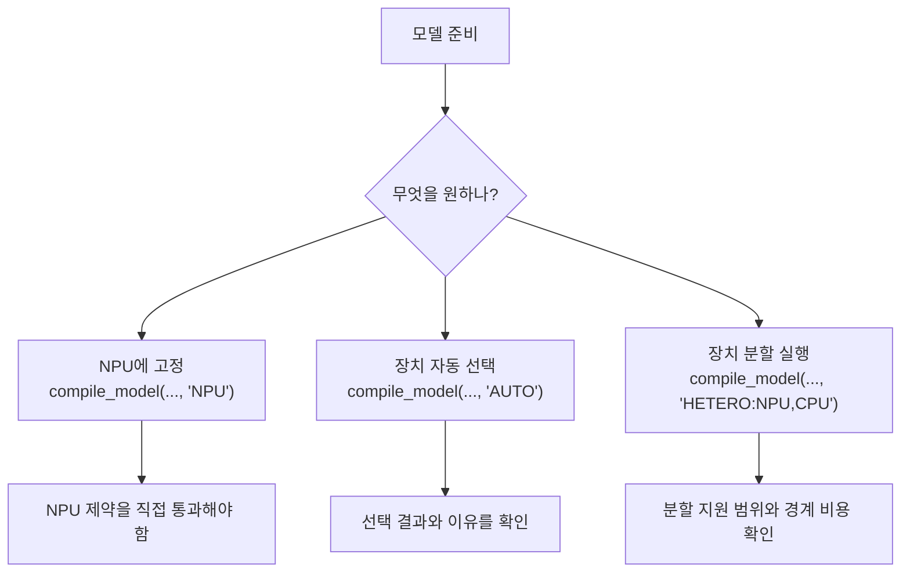
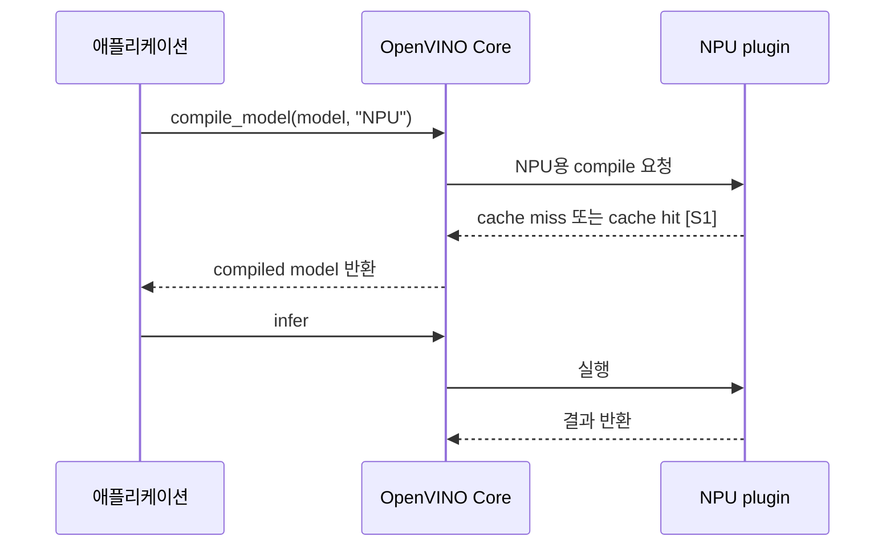
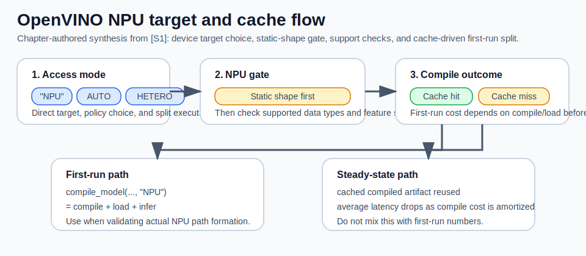
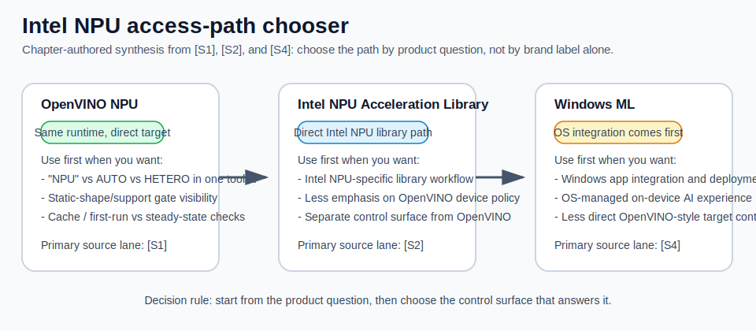

## 수업 개요

이 챕터의 중심 질문은 단순하다. OpenVINO에서 NPU를 쓰려면 실제로 무엇을 호출하고, 어떤 제약 때문에 바로 막히며, 왜 첫 실행과 재실행 체감이 달라지는가다. OpenVINO 문서는 `compile_model(..., "NPU")` 같은 명시적 타깃 지정, `AUTO`와 `HETERO` 같은 장치 선택 모드, model caching, FEIL/FIL, static-shape-only 제한, supported data types와 feature support 제약을 함께 설명한다 [S1].

그래서 이 챕터의 tradeoff인 `기기 접근성과 backend 제약`은 추상 명사가 아니다. OpenVINO가 맞는 장면은 Intel PC에서 NPU를 실제 target으로 지정하고, 같은 toolkit 안에서 `NPU` 고정과 `AUTO`/`HETERO`를 비교하며, static shape, supported data types, feature support, caching까지 한 흐름으로 검증하고 싶을 때다 [S1][합성]. 반대로 Intel NPU Acceleration Library는 Intel NPU 활용을 직접 다루는 별도 라이브러리 경로이고 [S2], Windows ML은 Windows의 on-device AI 경험을 묶는 OS 통합 런타임 경로다 [S4]. 즉, 이 장의 비교 질문은 "Intel NPU를 쓸 수 있느냐"가 아니라 "어느 제어면(control plane)에서 Intel NPU에 접근할 것이냐"다 [S1][S2][S4][합성].

## 학습 목표

- `compile_model(..., "NPU")`, `AUTO`, `HETERO`의 차이를 설명할 수 있다 [S1].
- OpenVINO NPU에서 왜 static shape가 먼저 확인 대상인지 설명할 수 있다 [S1].
- 첫 실행 지연을 steady-state 성능과 분리해 FEIL/FIL, model caching 관점으로 해석할 수 있다 [S1].
- supported data types와 feature support 제한이 왜 CPU/GPU 대안을 다시 열어 두게 만드는지 설명할 수 있다 [S1].
- OpenVINO NPU, Intel NPU Acceleration Library, Windows ML이 서로 다른 제어면이라는 점을 구분할 수 있다 [S1][S2][S4].

## 수업 전에 생각할 질문

- `device="NPU"`를 줬는데도 실행이 안 되면, 가장 먼저 shape를 볼 것인가 아니면 평균 latency를 볼 것인가?
- 첫 요청만 유독 느리고 두 번째부터 빨라지면, operator 최적화 문제라고 바로 결론내려도 될까?
- `AUTO`가 있으니 굳이 `"NPU"`를 직접 지정할 필요가 없다고 말해도 될까?

## 강의 스크립트

### 장면 1. NPU를 지정한다는 말의 정확한 뜻

**교수자:** OpenVINO에서 NPU를 쓴다는 말은 먼저 호출 수준에서 분명해야 합니다. 가장 직접적인 형태는 `compile_model(model, "NPU")`입니다. 이건 "가능하면 NPU를 써 줘"가 아니라, 이 모델을 NPU 타깃으로 컴파일하겠다는 명시적 요청입니다 [S1].

**학습자:** 그러면 `AUTO`도 결국 NPU를 골라 줄 수 있으니 같은 뜻 아닌가요?

**교수자:** 아닙니다. `AUTO`는 장치 선택 정책이고, `"NPU"`는 장치 고정입니다. `HETERO`는 더 다릅니다. 여러 장치에 graph를 나눠 싣는 방식입니다. 그래서 `"NPU"`로 성공한 경로와 `AUTO` 또는 `HETERO`로 성공한 경로를 같은 실험으로 취급하면 안 됩니다 [S1].

```python
import openvino as ov

core = ov.Core()
compiled_npu = core.compile_model(model, "NPU")
compiled_auto = core.compile_model(model, "AUTO")
compiled_hetero = core.compile_model(model, "HETERO:NPU,CPU")
```

| 지정 방식 | 뜻 | 바로 떠올릴 질문 | 흔한 오해 |
| --- | --- | --- | --- |
| `compile_model(..., "NPU")` | NPU에 명시적으로 고정한다 [S1] | 이 모델이 NPU 제약을 통과하는가? | `AUTO`와 사실상 같다고 본다 |
| `compile_model(..., "AUTO")` | OpenVINO가 장치를 선택한다 [S1] | 실제로 어느 장치가 선택됐는가? | 항상 NPU 우선이라고 믿는다 |
| `compile_model(..., "HETERO:NPU,CPU")` | 장치 간 분할 실행을 시도한다 [S1] | 분할 지원 범위가 충분한가? | unsupported feature도 자동으로 깔끔하게 해결된다고 본다 |



### 장면 2. OpenVINO NPU의 제약은 무엇으로 드러나는가

**학습자:** 그러면 `backend 제약`이라는 말은 정확히 뭘 뜻하나요?

**교수자:** OpenVINO NPU에서는 꽤 구체적입니다. S1이 강조하는 건 static-shape-only 제한, supported data types 확인, 제한된 feature support, 그리고 `AUTO`나 `HETERO`에 대해 기대한 범위와 실제 지원 범위를 구분해야 한다는 점입니다 [S1].

| 증상 | OpenVINO NPU에서 먼저 의심할 것 | 선택 기준 |
| --- | --- | --- |
| `NPU`를 지정했는데 compile이 막힌다 | 모델이 dynamic shape인지 확인한다. NPU 경로는 static shape가 먼저 맞아야 한다 [S1]. | shape를 고정해 다시 export하거나 CPU/GPU 경로를 검토한다 |
| compile은 되지만 일부 모델에서만 실패한다 | 해당 모델의 dtype과 feature가 NPU supported data types, feature support 범위를 벗어나는지 본다 [S1]. | dtype 변환, 모델 단순화, 다른 장치 경로 중 무엇이 더 싸게 해결되는지 고른다 |
| `AUTO`를 썼는데 기대와 다른 장치가 잡힌다 | `AUTO`는 정책이지 NPU 강제가 아니다 [S1]. | 실험 목적이 NPU 검증이면 `"NPU"`로 다시 고정한다 |
| `HETERO`를 기대했는데 분할 이득이 약하다 | 분할 지원 범위와 경계 관리가 생각보다 좁을 수 있다 [S1]. | 장치 분할보다 순수 CPU/GPU 또는 순수 NPU가 더 단순한지 비교한다 |

**학습자:** 결국 `"NPU"`를 줬다는 사실이 성공 조건의 절반도 안 되는군요.

**교수자:** 맞습니다. 이 챕터에서의 NPU 성공은 `문자열을 넣었다`가 아니라 `shape, dtype, feature support, 실행 모드`를 같이 통과했다는 뜻입니다 [S1].

### 식 1. 첫 실행이 느린 이유를 분해하는 식

OpenVINO NPU 문서가 FEIL/FIL과 model caching을 따로 설명한다는 사실을 바탕으로, 이 장은 첫 요청 비용을 steady-state와 분리해 읽는 운영 판단식을 쓴다 [합성] [S1].

$$
T_{first} = T_{compile} + T_{load} + T_{infer}
$$

**교수자:** 첫 실행은 추론만 하는 시간이 아닙니다. NPU용 compile과 load가 앞에 붙습니다. 그래서 첫 요청이 느릴 때는 연산량보다 compile 경로를 먼저 의심해야 합니다 [S1].

**학습자:** 그러면 FEIL/FIL은 이 첫 구간을 따로 보는 실무용 단서라고 이해하면 되나요?

**교수자:** 이 챕터에서는 그 정도로 이해하면 충분합니다. FEIL/FIL은 first-execution init latency, first-inference latency처럼 첫 실행 계열 지표를 가리키는 실무 단서로 읽으면 됩니다. S1이 그 지표와 caching을 같이 설명하고, 우리는 그 관계를 학습용 판단식으로 정리한 것입니다 [합성] [S1].

### 장면 3. cache가 체감을 바꾸는 방식

**교수자:** model caching은 이 챕터에서 반드시 기억해야 할 OpenVINO 고유 포인트입니다. 동일한 compilation request가 반복되면 첫 실행에서 만든 결과를 재사용해, 다시 compile하는 비용을 줄일 수 있습니다 [S1].

**학습자:** 그러면 벤치마크를 한 번만 재고 결론내리면 안 되겠네요.

**교수자:** 그렇습니다. 첫 실행의 FEIL/FIL 성격과 재실행의 steady-state를 섞으면 모델 선택도, 장치 선택도 잘못됩니다 [S1].



### 식 2. 반복 요청에서 평균 체감이 바뀌는 학습용 식

$$
\bar{T}(N) = \frac{T_{first} + (N-1)\cdot T_{steady}}{N}
$$

**교수자:** 반복 요청 수 `N`이 커질수록 첫 compile 비용은 평균에서 희석됩니다. 이 식 자체는 S1의 직접 공식이 아니라, S1이 설명하는 caching과 first-run 분리를 운영 관점에서 묶어 쓴 학습용 평균식입니다 [합성] [S1]. 그래서 임베딩처럼 같은 shape의 요청이 계속 들어오는 워크로드는 cache 효과를 체감하기 쉽고, 반대로 실행 패턴이 불안정하면 첫 요청 비용이 계속 눈에 띌 수 있습니다.

### 장면 4. 사례 1, NPU를 지정했지만 dynamic shape라서 막힌다

**학습자:** 실수 장면을 하나 들어 주세요.

**교수자:** 팀이 로컬 챗 UI에서 입력 길이가 계속 달라지는 요청을 그대로 넣었다고 합시다. 코드에는 `compile_model(model, "NPU")`가 들어 있지만, 모델이 dynamic shape를 유지하고 있으면 OpenVINO NPU의 static-shape-only 제약에 걸립니다 [S1].

**학습자:** 그럼 여기서 "NPU가 느리다"가 아니라 "NPU 경로가 성립하지 않는다"가 먼저네요.

**교수자:** 정확합니다. 이 장면의 디버깅 순서는 `1) shape 고정 가능 여부`, `2) 필요한 dtype이 NPU supported data types 범위에 있는지`, `3) unsupported feature가 있는지`, `4) 그래도 안 맞으면 CPU/GPU 경로가 더 현실적인지`입니다 [S1].

### 장면 5. 사례 2, cache 때문에 첫 실행과 재실행 체감이 다르다

**교수자:** 이번에는 성공 장면을 보겠습니다. 같은 IR을 주기적으로 올리는 문서 임베딩 서비스가 있다고 합시다. 첫 배포 직후에는 요청 하나가 유난히 느립니다. 그런데 같은 shape의 요청이 반복되면 다음부터는 훨씬 안정적으로 보입니다. 이때는 연산이 갑자기 빨라진 게 아니라, initial compile 성격과 cache 재사용 효과를 분리해서 봐야 합니다 [S1].

**학습자:** 그러면 "첫 요청만 느리다"는 건 실패가 아니라 측정 설계 문제일 수도 있겠네요.

**교수자:** 그렇습니다. S1이 FEIL/FIL과 model caching을 함께 두는 이유가 바로 그겁니다. 첫 요청 지연을 steady-state 숫자와 분리하지 않으면, NPU 자체를 과소평가하거나 과대평가하게 됩니다 [S1].

### 장면 6. OpenVINO 고유 판단과 제품 해석을 연결하기

**학습자:** 여기까지는 OpenVINO 문서 관점이고, 제품 팀은 어떤 결론을 가져가야 하나요?

**교수자:** 다음처럼 바로 옮기면 됩니다.

| 제품 질문 | OpenVINO 문서에서 먼저 볼 것 | 해석 |
| --- | --- | --- |
| "NPU를 강제로 쓰고 싶은가?" | `"NPU"` 직접 지정 [S1] | 실험 목적이 장치 검증이면 `AUTO`보다 직접 지정이 명확하다 |
| "왜 어떤 요청은 되고 어떤 요청은 안 되는가?" | static shape, supported data types, feature support [S1] | 모델 표현을 고치지 않으면 장치 변경만으로 해결되지 않는다 |
| "왜 재시작 직후만 느린가?" | FEIL/FIL, model caching [S1] | steady-state 최적화와 first-run 최적화를 분리한다 |
| "NPU 하나로 안 끝나면?" | `AUTO`, `HETERO`의 실제 지원 범위 [S1] | CPU/GPU 혼합 경로를 열어 두되, 기대와 실제 지원 범위를 분리해서 본다 |

**교수자:** 제품 판단으로 옮기면 더 구체적으로 말할 수 있습니다.

| 접근 경로 | 이 경로가 먼저 맞는 질문 | 이 챕터 기준의 강점 | 먼저 받아들일 제약 |
| --- | --- | --- | --- |
| OpenVINO NPU [S1] | "Intel PC에서 NPU target을 직접 지정하고, `AUTO`/`HETERO`까지 같은 runtime에서 비교하고 싶은가?" | `compile_model(..., "NPU")`, `AUTO`, `HETERO`, static shape 제약, caching을 한 toolkit 안에서 읽을 수 있다 [S1] | 모델이 OpenVINO NPU 제약을 직접 통과해야 한다 |
| Intel NPU Acceleration Library [S2] | "OpenVINO device abstraction보다 Intel NPU 활용용 별도 라이브러리 경로를 바로 쓰고 싶은가?" | Intel NPU 활용을 직접 다루는 별도 경로라는 점이 분명하다 [S2] | OpenVINO의 device-target 실험과는 다른 제어면이므로 결과를 같은 축에 놓기 어렵다 [합성] |
| Windows ML [S4] | "Windows 앱에서 OS 통합 on-device AI 경로를 우선하고 싶은가?" | Windows 차원의 통합 경로로 설명하기 쉽다 [S4] | OpenVINO식 장치 고정과 caching/shape 제약 검증을 그대로 가져오기는 어렵다 [합성] |

**교수자:** 여기서 핵심은 누가 더 좋으냐가 아닙니다. OpenVINO는 Intel PC에서 NPU target을 검증하고 CPU/GPU/NPU 모드를 같은 toolkit 안에서 비교할 때 가장 자연스럽습니다 [S1][합성]. Intel NPU Acceleration Library는 Intel NPU 활용을 직접 다루는 별도 라이브러리 경로이고 [S2], Windows ML은 OS 레벨 통합 경로입니다 [S4]. 따라서 `정말 NPU에 고정해 되는지부터 보고 싶은 팀`은 OpenVINO 쪽으로, `Windows 앱 통합이 더 앞선 팀`은 Windows ML 쪽으로 질문이 갈라집니다 [S1][S4][합성]. ONNX는 여전히 모델 교환 형식 계층일 뿐이라, 이 선택의 주인공이 아닙니다 [S3].

## 자주 헷갈리는 포인트

- `"NPU"` 직접 지정과 `AUTO`는 같은 뜻이 아니다. 전자는 장치 고정이고, 후자는 장치 선택 정책이다 [S1].
- `NPU` 지정 실패를 곧바로 성능 문제로 해석하면 안 된다. static shape나 feature support 미충족이면 성능 이전에 경로 성립 문제가 먼저다 [S1].
- 첫 요청 지연과 steady-state는 다른 문제다. FEIL/FIL, model caching을 따로 보지 않으면 벤치마크 해석이 틀어진다 [S1].
- supported data types가 제한적이라는 사실은 "형식을 바꾸면 해결된다"가 아니라 "CPU/GPU 대안도 계속 열어 둬야 한다"는 뜻에 가깝다 [S1].
- OpenVINO, Intel NPU Acceleration Library, Windows ML은 모두 Intel/Windows 문맥에서 NPU를 만질 수 있어 보여도 같은 층위가 아니다. 어떤 runtime에서 장치 제어를 하려는지 먼저 정해야 비교가 맞는다 [S1][S2][S4][합성].

## 사례로 다시 보기

### 사례 A. 로컬 챗 UI에서 NPU 지정이 바로 실패한 경우

- 현상: `compile_model(..., "NPU")`를 넣었는데 특정 프롬프트 길이에서만 막힌다.
- 1차 판단: dynamic shape 여부를 먼저 본다. OpenVINO NPU는 static shape가 핵심 제약이다 [S1].
- 2차 판단: shape를 고정해도 안 되면 supported data types와 feature support 범위를 다시 본다 [S1].
- 결론: 이 장면은 "NPU가 느리다"가 아니라 "NPU 경로가 성립하지 않는다"가 맞다.

### 사례 B. 임베딩 서비스에서 첫 배포 직후만 느린 경우

- 현상: 재시작 직후 첫 요청만 느리고, 이후 같은 요청은 안정적이다.
- 1차 판단: FEIL/FIL과 model caching 성격의 비용을 의심한다 [S1].
- 2차 판단: steady-state가 안정적이면 operator 튜닝보다 compile 재사용 구조가 더 직접적인 개선 포인트일 수 있다 [S1].
- 결론: 첫 요청 지연과 반복 요청 latency를 한 그래프에 섞으면 잘못된 결론이 나온다.

### 사례 C. 어떤 Intel NPU 접근 경로를 먼저 고를지 헷갈리는 경우

- 현상: 팀이 Intel PC용 앱을 만들고 있는데 OpenVINO, Intel NPU Acceleration Library, Windows ML 중 어디서 시작할지 정하지 못한다.
- 1차 판단: NPU target 고정, `AUTO`/`HETERO`, static shape, cache까지 같은 toolkit에서 검증하고 싶다면 OpenVINO 질문이 먼저다 [S1][합성].
- 2차 판단: Intel NPU 활용을 직접 다루는 별도 라이브러리 경로 자체를 실험하고 싶다면 Intel NPU Acceleration Library 문서를 본다 [S2].
- 3차 판단: 앱 관점에서 Windows OS 통합 on-device AI 경로가 더 중요하면 Windows ML 문맥으로 옮긴다 [S4][합성].
- 결론: 세 경로는 "같은 Intel NPU"를 보는 것처럼 보여도 제어면이 다르므로, 하나의 benchmark 표로 바로 섞어 비교하면 안 된다.

## 핵심 정리

- OpenVINO NPU의 출발점은 `compile_model(..., "NPU")`다. 이 한 줄이 실제 장치 타깃 지정이다 [S1].
- 하지만 성공 조건은 문자열이 아니라 제약 통과다. static shape, supported data types, feature support, 실행 모드를 같이 봐야 한다 [S1].
- `AUTO`는 선택 정책이고 `HETERO`는 분할 실행이다. 둘 다 순수 `"NPU"` 지정과 같은 실험이 아니다 [S1].
- 첫 실행 지연은 FEIL/FIL과 model caching으로 분리해서 봐야 한다. 재실행 체감은 compile 재사용에 크게 좌우될 수 있다 [S1].
- OpenVINO는 Intel PC에서 NPU target 지정, `AUTO`/`HETERO` 비교, static shape와 cache 검증을 한 toolkit에서 묶어 볼 때 자연스럽다 [S1][합성].
- Intel NPU Acceleration Library [S2], ONNX [S3], Windows ML [S4]은 각각 다른 층위다. 이 챕터의 중심은 OpenVINO NPU device 경로다.

## 복습 체크리스트

- `compile_model(..., "NPU")`, `AUTO`, `HETERO` 차이를 한 문장씩 설명할 수 있는가? [S1]
- `dynamic shape라서 NPU 불가`라는 진단을 바로 떠올릴 수 있는가? [S1]
- 첫 요청만 느릴 때 FEIL/FIL과 model caching을 먼저 떠올리는가? [S1]
- supported data types와 feature support 제한이 CPU/GPU 검토로 이어지는 이유를 설명할 수 있는가? [S1]
- OpenVINO NPU와 Intel NPU Acceleration Library, Windows ML 중 어느 경로를 먼저 볼지 제품 질문으로 구분해 설명할 수 있는가? [S1][S2][S4]

## 대안과 비교

| 항목 | 무엇을 다루나 | 언제 먼저 자연스러운가 | 이 챕터에서의 위치 |
| --- | --- | --- | --- |
| OpenVINO NPU [S1] | Intel 장치 문맥에서 NPU device target과 실행 모드 | NPU target 고정, `AUTO`/`HETERO`, static shape, caching을 같은 toolkit에서 검증하고 싶을 때 [합성] | 본문 중심 |
| Intel NPU Acceleration Library [S2] | Intel NPU 활용을 직접 다루는 라이브러리 | OpenVINO device abstraction이 아니라 Intel NPU용 별도 라이브러리 경로를 바로 보고 싶을 때 [합성] | OpenVINO와 구분해야 할 인접 경로 |
| ONNX [S3] | 모델 교환 형식과 operator ecosystem | runtime 선택 전, 모델 형식 계층을 정리할 때 | 런타임이 아니라 형식 계층 |
| Windows ML [S4] | Windows의 on-device AI OS 통합 경로 | Windows 앱 통합과 OS 레벨 배포 일관성이 더 중요한 출발점일 때 [합성] | OpenVINO NPU와 다른 제품 층위 |

## 참고 이미지

### 참고 이미지 1. OpenVINO NPU target and cache flow



- 본문 연결: 장면 1, 장면 2, 장면 3
- 왜 필요한가: `"NPU"` 직접 지정, `AUTO`/`HETERO`, static shape gate, supported dtype/feature 확인, cache miss/hit 이후 first-run과 steady-state가 갈라지는 흐름을 한 장으로 묶는다. 홍보 이미지 대신 실제 디버깅 순서를 보조하는 그림이다.

### 참고 이미지 2. Intel NPU access-path chooser



- 본문 연결: 장면 6, 사례 C
- 왜 필요한가: OpenVINO NPU, Intel NPU Acceleration Library, Windows ML이 모두 "Intel NPU 접근"처럼 보일 때 어떤 제품 질문이 각 경로를 먼저 열게 만드는지 비교한다. 로고가 아니라 제어면 차이를 설명하는 선택 도해야 한다.

## 출처

| ID | 출처 | 발행처 | 접근 날짜 | URL | 이 챕터에서 사용한 역할 |
| --- | --- | --- | --- | --- | --- |
| [S1] | NPU device | OpenVINO | 2026-03-08 (accessed) | https://docs.openvino.ai/2025/openvino-workflow/running-inference/inference-devices-and-modes/npu-device.html | `compile_model(..., "NPU")`, `AUTO`/`HETERO`, static shape, supported data types, feature support, model caching, FEIL/FIL 설명 |
| [S2] | Intel NPU Acceleration Library | Intel | 2026-03-08 (accessed) | https://intel.github.io/intel-npu-acceleration-library/ | OpenVINO와 구분되는 Intel NPU 활용 라이브러리 경로 설명 |
| [S3] | Open Neural Network Exchange | ONNX | 2026-03-08 (accessed) | https://onnx.ai/ | ONNX를 모델 교환 형식 계층으로 설명 |
| [S4] | Windows ML overview | Microsoft Learn | 2026-03-08 (accessed) | https://learn.microsoft.com/en-us/windows/ai/new-windows-ml/overview | Windows ML을 OS 통합 런타임 계층으로 설명 |
