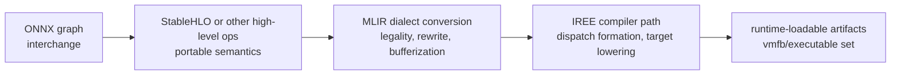
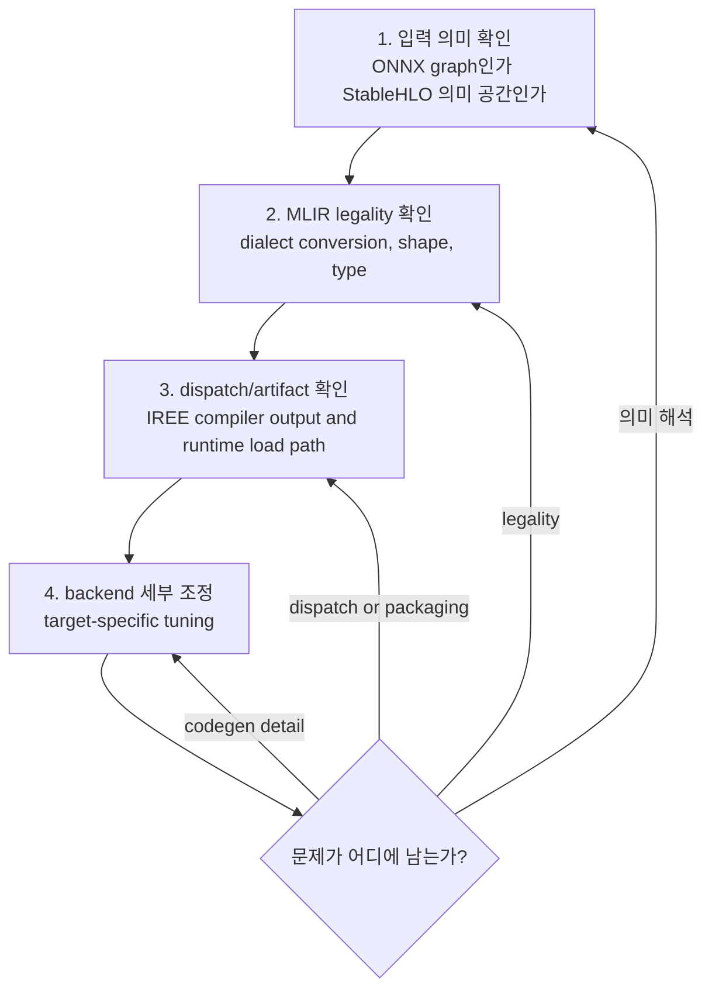

# MLIR, StableHLO, IREE

## 수업 개요

같은 `matmul + elementwise tail` 블록도 어디까지를 StableHLO 같은 높은 수준의 의미 공간에 남기고, 어디서 MLIR lower dialect와 target-specific 단계로 내릴지에 따라 IREE runtime이 보게 되는 dispatch 경계와 최종 artifact 구성이 달라질 수 있다 [합성: S1,S2,S3]. 이 챕터는 그 판단 기준을 먼저 세운다.

ONNX는 모델 교환 형식과 operator ecosystem의 기준점이고 [S4], StableHLO/XLA 계층은 비교적 높은 수준의 연산 의미를 보존하는 쪽에 가깝다 [S3]. MLIR은 dialect, dialect conversion, progressive lowering, bufferization 같은 다단계 변환 프레임워크를 제공하고 [S1], IREE는 그 위에서 compiler와 runtime artifact path를 연결하는 예시다 [S2]. 오늘의 핵심은 "무슨 이름의 프로젝트가 멋진가"가 아니라 "어느 계층에서 무슨 문제를 풀고 있는가"를 헷갈리지 않는 것이다 [합성: S1,S2,S3,S4].

## 학습 목표

- ONNX, StableHLO, MLIR, IREE가 서로 다른 층위의 답을 준다는 점을 설명할 수 있다 [S1][S2][S3][S4].
- `ONNX import 성공`과 `lowering 준비 완료`가 다른 상태라는 점을 `R_lowering`으로 설명할 수 있다 [합성: S1,S2,S4].
- 더 이른 decomposition이 왜 dispatch 수 증가로 이어질 수 있는지 `G_net` 관점으로 말할 수 있다 [합성: S1,S2,S3].
- IREE를 볼 때 compiler만이 아니라 runtime artifact path까지 같이 봐야 하는 이유를 설명할 수 있다 [S2].
- 디버깅 순서를 `입력 의미 -> dialect legality -> dispatch/artifact -> backend 세부 조정`으로 정리할 수 있다 [합성: S1,S2,S3,S4].

## 수업 전에 생각할 질문

- ONNX 파일을 읽는 데 성공했다는 사실이, 왜 target backend 배포 성공을 보장하지 않을까?
- StableHLO 같은 높은 수준 IR을 쓴다고 해서 왜 자동으로 최적 codegen이 보장되지는 않을까?
- 성능 문제처럼 보이는 현상이 사실은 dispatch 경계나 artifact packaging 문제일 가능성은 언제 커질까?

## 강의 스크립트

### 1. 먼저 "지금 어디서 막혔는가"를 구분한다

**교수자:** 오늘은 이름부터 분리하겠습니다. `ONNX`는 교환 형식입니다 [S4]. `StableHLO`는 OpenXLA/XLA 문맥에서 높은 수준 연산 의미를 유지하는 계층입니다 [S3]. `MLIR`은 이런 표현들을 dialect와 lowering pipeline으로 다루는 프레임워크입니다 [S1]. `IREE`는 MLIR 기반 compiler와 runtime을 실제 artifact 경로로 연결한 사례입니다 [S2].

**학습자:** 그러면 네 개가 경쟁 관계라기보다, 서로 다른 질문에 답하는 축이군요.

**교수자:** 맞습니다. ONNX는 "모델을 어떤 공용 형식으로 들고 오나"에 가깝고 [S4], StableHLO는 "높은 수준 의미를 어느 정도까지 보존하나"에 가깝고 [S3], MLIR은 "그 의미를 어떤 단계로 쪼개고 legalize하나"에 가깝고 [S1], IREE는 "그 결과를 어떤 runtime artifact로 묶어 실행하나"에 가깝습니다 [S2].

| 층위 | 먼저 답하는 질문 | 이 챕터에서 놓치면 안 되는 점 |
| --- | --- | --- |
| ONNX [S4] | 모델을 어떤 교환 형식으로 표현할 것인가 | import 성공은 parser 또는 importer 단계 성공일 뿐이다 [합성: S1,S2,S4] |
| StableHLO/XLA [S3] | 높은 수준 연산 의미를 얼마나 유지할 것인가 | 의미 보존과 최종 codegen 품질은 같은 문제가 아니다 [합성: S1,S2,S3] |
| MLIR [S1] | 어떤 dialect를 거쳐 legalize, rewrite, bufferize할 것인가 | lowering은 한 번에 끝나는 사건이 아니라 연속된 단계다 [S1] |
| IREE [S2] | compiler 결과를 runtime이 어떤 artifact로 읽을 것인가 | dispatch 형성과 artifact packaging까지 봐야 한다 [S2] |

이 그림은 ONNX, StableHLO, MLIR, IREE를 "대체재"가 아니라 "질문이 다른 연속 계층"으로 읽게 하려는 요약이다 [합성: S1,S2,S3,S4].

### 식 1. lowering 준비도를 보는 간단한 비율

다음 식은 MLIR의 dialect conversion/legality 관점 [S1], ONNX의 interchange 관점 [S4], IREE의 compile-to-runtime 관점 [S2]를 묶어 만든 학습용 지표다 [합성: S1,S2,S4].

$$
R_{lowering} = \frac{N_{legalized}}{N_{required}}
$$

여기서 `N_required`는 다음 단계가 요구하는 연산, shape, type, layout 조건의 수이고, `N_legalized`는 그 조건을 실제로 충족한 수라고 읽으면 된다 [합성: S1,S2,S4]. ONNX import가 성공했다는 사실은 보통 "입력이 읽혔다"는 뜻이지, 바로 `R_lowering = 1`이라는 뜻은 아니다 [합성: S1,S2,S4].

**학습자:** 결국 `import OK`와 `deploy OK` 사이에 dialect legality와 target lowering이 남아 있다는 말이군요.

**교수자:** 그렇습니다. 그래서 이 챕터에서는 `파일을 읽었다`보다 `다음 단계가 이 표현을 받아들일 수 있는가`를 더 중요한 질문으로 둡니다 [합성: S1,S2,S4].

### 2. StableHLO를 쓰는 이유와 과신하면 안 되는 이유

**학습자:** 그럼 StableHLO를 쓰면 높은 수준 의미를 보존하니 항상 유리한가요?

**교수자:** `항상`은 아닙니다. XLA Architecture는 높은 수준 연산 의미와 backend-specific lowering 사이의 층을 보여 주지만 [S3], 그 자체가 어떤 특정 target에서 자동으로 최적 코드를 보장한다는 뜻은 아닙니다 [합성: S1,S2,S3]. MLIR 문서는 progressive lowering과 dialect conversion을 강조하고 [S1], IREE 문서는 compiler와 runtime artifact path를 함께 다룹니다 [S2]. 이 둘을 합치면 "높은 수준 의미를 얼마나 오래 유지할지"는 최적화 기회와 하위 단계 부담을 함께 바꾸는 선택이라는 점이 보입니다 [합성: S1,S2,S3].

**학습자:** 그러면 StableHLO는 portability와 의미 보존에 유리할 수 있지만, 최종 codegen 품질은 또 다른 문제라는 거네요.

**교수자:** 정확합니다. StableHLO를 쓰는 이유와, 최종 backend codegen이 잘 나오느냐는 질문을 분리해야 합니다 [합성: S1,S2,S3].

### 식 2. decomposition의 순이득을 보는 식

다음 식은 "더 잘게 내리는 선택"의 순이득을 설명하기 위한 학습용 식이다 [합성: S1,S2,S3].

$$
G_{net} = B_{backend} - \left(C_{dispatch} + C_{boundary} + C_{materialize}\right)
$$

`B_backend`는 더 낮은 수준으로 가면서 얻는 backend-specific 최적화 이익을, `C_dispatch`는 더 많은 dispatch 형성 비용을, `C_boundary`는 경계 간 전달과 동기화 비용을, `C_materialize`는 중간 결과 구체화 비용을 뜻한다 [합성: S1,S2,S3]. MLIR이 progressive lowering을 허용한다는 사실 [S1]과 IREE가 dispatch와 artifact 관점까지 드러낸다는 사실 [S2], 그리고 XLA 계층이 높은 수준 의미를 유지하는 이유 [S3]를 묶으면, 더 이른 decomposition이 항상 이득이 아니라는 결론이 나온다 [합성: S1,S2,S3].

**학습자:** 그러면 decomposition으로 생기는 dispatch 증가는 문서에 딱 한 줄로 적혀 있다기보다, 여러 계층 설명을 합쳐야 보이는 결론이군요.

**교수자:** 맞습니다. 그래서 이 문장은 문서 직역이 아니라 `[합성]`으로 써야 정확합니다. `하나의 큰 의미 덩어리`를 너무 일찍 잘게 나누면 IREE가 더 많은 dispatch 경계를 만들 가능성이 있고, 그때는 `C_dispatch`와 `C_boundary`가 올라갈 수 있습니다 [합성: S1,S2,S3].

### 3. IREE를 볼 때는 compiler와 runtime을 같이 본다

**교수자:** IREE가 여기서 중요한 이유는 "MLIR을 쓴다"에서 멈추지 않기 때문입니다. IREE 문서는 compiler와 runtime을 분리하면서도, compiler 결과가 runtime-loadable artifact로 이어지는 경로를 함께 설명합니다 [S2].

**학습자:** 그러면 성능이나 실패 원인을 볼 때, 코드 생성만이 아니라 artifact 구성도 봐야겠네요.

**교수자:** 그렇습니다. `dispatch가 몇 개로 나뉘었는가`, `runtime이 무엇을 실제로 로드하는가`, `어느 단계에서 target-specific executable이 만들어졌는가`가 모두 같은 문제 체인의 일부입니다 [합성: S1,S2]. 그래서 IREE를 쓰는 순간, compiler debugging과 runtime artifact inspection이 연결됩니다 [S2].

이 순서는 MLIR의 legality 관점 [S1], IREE의 compiler-runtime 관점 [S2], StableHLO/XLA 계층 구분 [S3], ONNX interchange 관점 [S4]을 묶어 정리한 디버깅용 순서다 [합성: S1,S2,S3,S4].

### 4. 사례 A. ONNX import는 됐는데 배포는 아직 멀다

**학습자:** 실무에서 가장 흔한 오해를 하나 들어 주세요.

**교수자:** `ONNX import가 성공했으니 deployment도 거의 끝났다`는 오해가 대표적입니다. ONNX는 교환 형식 기준점일 뿐이고 [S4], 그 뒤에는 MLIR dialect legality와 lowering 문제 [S1], IREE artifact path 문제가 남습니다 [S2].

**학습자:** 그러면 이 장면에서 첫 질문은 "왜 importer가 실패했나"가 아니라 "다음 단계가 이 IR을 legal하게 받는가"네요.

**교수자:** 맞습니다. import 성공은 보통 출발점 확인입니다. shape, type, layout, target-specific lowering, runtime artifact 구성까지 넘어가야 비로소 배포 가능성이 생깁니다 [합성: S1,S2,S4].

### 5. 사례 B. 더 잘게 쪼갰더니 오히려 dispatch가 늘었다

**교수자:** 두 번째 사례는 이 챕터 전용입니다. `matmul -> bias -> activation`처럼 아직 높은 수준의 연산 묶음으로 볼 수 있는 블록을 너무 이르게 쪼개면, 뒤 단계에서 볼 때는 작은 조각들의 나열처럼 보일 수 있습니다 [합성: S1,S2,S3].

**학습자:** 그럼 작은 조각이 많아지면 항상 나쁜가요?

**교수자:** 그것도 아닙니다. 어떤 target에서는 더 낮은 수준 정보가 backend 최적화에 유리할 수 있습니다 [합성: S1,S2,S3]. 그래서 `G_net`으로 봐야 합니다. 더 잘게 쪼갠 결과 `B_backend`가 `C_dispatch + C_boundary + C_materialize`보다 충분히 크면 이득이고, 아니면 dispatch만 늘어난 셈이 됩니다 [합성: S1,S2,S3].

### 6. 실제로는 어떤 순서로 디버깅하나

**학습자:** 현장에서 바로 쓸 순서를 짧게 말해 주시면요.

**교수자:** 다음 순서가 안전합니다 [합성: S1,S2,S3,S4].

1. 입력 IR의 의미 공간을 고정한다. ONNX graph 문제인지, StableHLO/XLA 수준 의미 문제인지 먼저 구분한다 [S3][S4].
2. MLIR dialect conversion과 legality를 본다. shape, type, rewrite, bufferization 중 어디에서 다음 단계 요구를 못 맞추는지 확인한다 [S1].
3. IREE compiler output과 runtime artifact path를 본다. dispatch 형성과 packaging을 확인한다 [S2].
4. 마지막에 backend-specific tuning이나 codegen 세부를 본다. 앞 단계가 흔들리면 여기서 시간을 써도 큰 진전이 없다 [합성: S1,S2,S3,S4].

**학습자:** 즉 backend tuning은 맨 앞이 아니라 맨 뒤군요.

**교수자:** 그렇습니다. 이 챕터에서는 그 순서가 가장 중요합니다. 많은 문제는 kernel detail 전에 IR 계층 구분이나 legality 단계에서 이미 방향이 정해집니다 [합성: S1,S2,S3,S4].

## 자주 헷갈리는 포인트

- ONNX는 `중간 표현 최적화 프레임워크`가 아니라 모델 교환 형식의 기준점이다 [S4].
- StableHLO를 쓴다고 자동으로 최적 codegen이 보장되지는 않는다. 높은 수준 의미 보존과 backend 최적화 품질은 분리된 질문이다 [합성: S1,S2,S3].
- MLIR은 단일 IR 하나가 아니라 여러 dialect와 progressive lowering을 포함한 프레임워크다 [S1].
- IREE는 compiler로만 끝나지 않는다. runtime이 실제로 읽는 artifact path까지 같이 봐야 한다 [S2].
- decomposition으로 dispatch가 늘 수 있다는 문장은 일반 법칙이 아니라, MLIR lowering과 IREE dispatch 형성을 함께 읽었을 때의 실무적 판단 기준이다 [합성: S1,S2,S3].

## 사례로 다시 보기

### 사례 A. `import 성공`을 `deployment 준비 완료`로 오해한 팀

- 현상: ONNX importer는 통과했는데 target-specific compile 또는 runtime 준비가 막힌다.
- 1차 해석: ONNX는 graph interchange의 성공일 뿐이다 [S4].
- 2차 해석: 다음 단계에서 dialect legality와 shape/type/layout 조건을 못 맞출 수 있다 [S1][합성: S2,S4].
- 결론: `R_lowering`이 아직 1이 아니다. import 성공과 lowering 준비 완료를 분리해서 봐야 한다 [합성: S1,S2,S4].

### 사례 B. `더 낮게 내리면 무조건 좋다`고 가정한 팀

- 현상: 높은 수준 블록을 일찍 decomposition했더니 runtime에서 dispatch 경계가 많아진다.
- 1차 해석: 더 낮은 수준 정보가 backend 이익 `B_backend`를 줄 수도 있지만, dispatch와 경계 비용도 같이 바뀐다 [합성: S1,S2,S3].
- 2차 해석: IREE의 artifact/dispatch 관점에서 보면 조각이 많아진 상태가 항상 좋은 것은 아니다 [S2][합성: S1,S3].
- 결론: `G_net > 0`인지 확인해야지, decomposition 자체를 목표로 삼으면 안 된다 [합성: S1,S2,S3].

## 핵심 정리

- ONNX [S4], StableHLO/XLA [S3], MLIR [S1], IREE [S2]는 같은 계층의 경쟁자가 아니라 서로 다른 질문에 답하는 층이다.
- `R_lowering`은 import 성공과 다음 단계 준비 완료를 분리해 생각하게 만드는 학습용 비율이다 [합성: S1,S2,S4].
- `G_net`은 decomposition이 backend 최적화 이익보다 dispatch/경계 비용을 더 키우는지 확인하게 만드는 학습용 식이다 [합성: S1,S2,S3].
- IREE를 사용할 때는 compiler pass만이 아니라 runtime artifact path와 dispatch 형성을 함께 봐야 한다 [S2].
- 디버깅 순서는 `입력 의미 -> legality -> dispatch/artifact -> backend 세부`가 안전하다 [합성: S1,S2,S3,S4].

## 복습 체크리스트

- ONNX와 StableHLO가 둘 다 "모델 표현"처럼 보일 때, 각각 무엇을 보존하려는지 구분해서 설명할 수 있는가? [S3][S4]
- MLIR의 dialect conversion과 progressive lowering을 한 문장으로 설명할 수 있는가? [S1]
- IREE를 단순 compiler가 아니라 compiler-runtime artifact path로 설명할 수 있는가? [S2]
- `ONNX import 성공이 곧 deployment 성공`이 왜 아닌지 `R_lowering`으로 설명할 수 있는가? [합성: S1,S2,S4]
- decomposition으로 인한 dispatch 증가 가능성을 `G_net`과 함께 설명할 수 있는가? [합성: S1,S2,S3]

## 대안과 비교

| 관점 | 잘 답하는 질문 | 잘 못 답하는 질문 | 이 챕터에서의 위치 |
| --- | --- | --- | --- |
| ONNX [S4] | 모델을 어떤 공용 graph 형식으로 교환할까 | target lowering과 runtime artifact 품질은 직접 답하지 못한다 | 입력 표현의 출발점 |
| StableHLO/XLA [S3] | 높은 수준 연산 의미를 어느 정도 유지할까 | 특정 target에서 자동 최적 codegen을 보장하지는 않는다 | 의미 보존 계층 |
| MLIR [S1] | 어떤 dialect와 legality 규칙을 거쳐 점진적으로 내릴까 | 단독으로 runtime artifact packaging을 설명하지는 않는다 | lowering 프레임워크 |
| IREE [S2] | compiler 결과를 runtime이 어떤 artifact로 읽고 실행할까 | 교환 형식 자체의 범용성 문제는 직접 답하지 않는다 | compiler-runtime 연결 예시 |

## 참고 이미지

### 참고 이미지 1. IREE architecture

- 원본 제목: `IREE architecture`
- 원본 URL: `https://iree.dev/assets/images/iree_architecture.svg`
- 출처 유형: `Official Docs`
- 연결 단락: `3. IREE를 볼 때는 compiler와 runtime을 같이 본다`
- 왜 필요한가: IREE를 compiler 단일 프로젝트가 아니라 compiler, runtime, plugins, artifacts가 이어진 구조로 읽게 해 준다 [S2].

### 참고 이미지 2. [합성] StableHLO-MLIR-IREE artifact path

![Synthetic StableHLO-MLIR-IREE artifact path](data:image/svg+xml;base64,PHN2ZyB4bWxucz0iaHR0cDovL3d3dy53My5vcmcvMjAwMC9zdmciIHdpZHRoPSI5NjAiIGhlaWdodD0iMjgwIiB2aWV3Qm94PSIwIDAgOTYwIDI4MCI+CiAgPHJlY3Qgd2lkdGg9Ijk2MCIgaGVpZ2h0PSIyODAiIGZpbGw9IiNmOGZhZmMiLz4KICA8cmVjdCB4PSIyNCIgeT0iOTIiIHdpZHRoPSIxNjAiIGhlaWdodD0iODgiIHJ4PSIxNCIgZmlsbD0iI2ZmZjdlZCIgc3Ryb2tlPSIjZWE1ODBjIiBzdHJva2Utd2lkdGg9IjIiLz4KICA8dGV4dCB4PSIxMDQiIHk9IjEyNiIgZm9udC1mYW1pbHk9IkFyaWFsIiBmb250LXNpemU9IjI2IiB0ZXh0LWFuY2hvcj0ibWlkZGxlIiBmaWxsPSIjOWEzNDEyIj5Tb3VyY2UgSVI8L3RleHQ+CiAgPHRleHQgeD0iMTA0IiB5PSIxNTYiIGZvbnQtZmFtaWx5PSJBcmlhbCIgZm9udC1zaXplPSIxOCIgdGV4dC1hbmNob3I9Im1pZGRsZSIgZmlsbD0iIzlhMzQxMiI+T05OWCAvIFN0YWJsZUhMTzwvdGV4dD4KCiAgPHJlY3QgeD0iMjI0IiB5PSI1MiIgd2lkdGg9IjIyMCIgaGVpZ2h0PSIxNzYiIHJ4PSIxNCIgZmlsbD0iI2VmZjZmZiIgc3Ryb2tlPSIjMjU2M2ViIiBzdHJva2Utd2lkdGg9IjIiLz4KICA8dGV4dCB4PSIzMzQiIHk9Ijg4IiBmb250LWZhbWlseT0iQXJpYWwiIGZvbnQtc2l6ZT0iMjYiIHRleHQtYW5jaG9yPSJtaWRkbGUiIGZpbGw9IiMxZDRlZDgiPk1MSVIgU3BhY2U8L3RleHQ+CiAgPHRleHQgeD0iMzM0IiB5PSIxMjIiIGZvbnQtZmFtaWx5PSJBcmlhbCIgZm9udC1zaXplPSIxOCIgdGV4dC1hbmNob3I9Im1pZGRsZSIgZmlsbD0iIzFlM2E4YSI+ZGlhbGVjdCBjb252ZXJzaW9uPC90ZXh0PgogIDx0ZXh0IHg9IjMzNCIgeT0iMTQ4IiBmb250LWZhbWlseT0iQXJpYWwiIGZvbnQtc2l6ZT0iMTgiIHRleHQtYW5jaG9yPSJtaWRkbGUiIGZpbGw9IiMxZTNhOGEiPnNoYXBlICsgdHlwZSBsZWdhbGl0eTwvdGV4dD4KICA8dGV4dCB4PSIzMzQiIHk9IjE3NCIgZm9udC1mYW1pbHk9IkFyaWFsIiBmb250LXNpemU9IjE4IiB0ZXh0LWFuY2hvcj0ibWlkZGxlIiBmaWxsPSIjMWUzYThhIj5idWZmZXJpemF0aW9uIC8gbG93ZXJpbmdzPC90ZXh0PgoKICA8cmVjdCB4PSI0ODQiIHk9IjUyIiB3aWR0aD0iMjIwIiBoZWlnaHQ9IjE3NiIgcng9IjE0IiBmaWxsPSIjZWNmZWZmIiBzdHJva2U9IiMwODkxYjIiIHN0cm9rZS13aWR0aD0iMiIvPgogIDx0ZXh0IHg9IjU5NCIgeT0iODgiIGZvbnQtZmFtaWx5PSJBcmlhbCIgZm9udC1zaXplPSIyNiIgdGV4dC1hbmNob3I9Im1pZGRsZSIgZmlsbD0iIzBmNzY2ZSI+SVJFRSBDb21waWxlcjwvdGV4dD4KICA8dGV4dCB4PSI1OTQiIHk9IjEyMiIgZm9udC1mYW1pbHk9IkFyaWFsIiBmb250LXNpemU9IjE4IiB0ZXh0LWFuY2hvcj0ibWlkZGxlIiBmaWxsPSIjMTE1ZTU5Ij5kaXNwYXRjaCBmb3JtYXRpb248L3RleHQ+CiAgPHRleHQgeD0iNTk0IiB5PSIxNDgiIGZvbnQtZmFtaWx5PSJBcmlhbCIgZm9udC1zaXplPSIxOCIgdGV4dC1hbmNob3I9Im1pZGRsZSIgZmlsbD0iIzExNWU1OSI+SEFMIC8gdGFyZ2V0IGxvd2VyaW5nPC90ZXh0PgogIDx0ZXh0IHg9IjU5NCIgeT0iMTc0IiBmb250LWZhbWlseT0iQXJpYWwiIGZvbnQtc2l6ZT0iMTgiIHRleHQtYW5jaG9yPSJtaWRkbGUiIGZpbGw9IiMxMTVlNTkiPmFydGlmYWN0IHBhY2thZ2luZzwvdGV4dD4KCiAgPHJlY3QgeD0iNzQ0IiB5PSI5MiIgd2lkdGg9IjE5MiIgaGVpZ2h0PSI4OCIgcng9IjE0IiBmaWxsPSIjZjBmZGY0IiBzdHJva2U9IiMxNmEzNGEiIHN0cm9rZS13aWR0aD0iMiIvPgogIDx0ZXh0IHg9Ijg0MCIgeT0iMTI2IiBmb250LWZhbWlseT0iQXJpYWwiIGZvbnQtc2l6ZT0iMjUiIHRleHQtYW5jaG9yPSJtaWRkbGUiIGZpbGw9IiMxNjY1MzQiPlJ1bnRpbWUgQXJ0aWZhY3RzPC90ZXh0PgogIDx0ZXh0IHg9Ijg0MCIgeT0iMTU2IiBmb250LWZhbWlseT0iQXJpYWwiIGZvbnQtc2l6ZT0iMTgiIHRleHQtYW5jaG9yPSJtaWRkbGUiIGZpbGw9IiMxNjY1MzQiPnZtZmIgKyB0YXJnZXQgY29kZTwvdGV4dD4KCiAgPHBhdGggZD0iTTE4NCAxMzYgSDIyNCIgc3Ryb2tlPSIjNDc1NTY5IiBzdHJva2Utd2lkdGg9IjQiIGZpbGw9Im5vbmUiLz4KICA8cG9seWdvbiBwb2ludHM9IjIyNCwxMzYgMjEwLDEyOCAyMTAsMTQ0IiBmaWxsPSIjNDc1NTY5Ii8+CiAgPHBhdGggZD0iTTQ0NCAxMzYgSDQ4NCIgc3Ryb2tlPSIjNDc1NTY5IiBzdHJva2Utd2lkdGg9IjQiIGZpbGw9Im5vbmUiLz4KICA8cG9seWdvbiBwb2ludHM9IjQ4NCwxMzYgNDcwLDEyOCA0NzAsMTQ0IiBmaWxsPSIjNDc1NTY5Ii8+CiAgPHBhdGggZD0iTTcwNCAxMzYgSDc0NCIgc3Ryb2tlPSIjNDc1NTY5IiBzdHJva2Utd2lkdGg9IjQiIGZpbGw9Im5vbmUiLz4KICA8cG9seWdvbiBwb2ludHM9Ijc0NCwxMzYgNzMwLDEyOCA3MzAsMTQ0IiBmaWxsPSIjNDc1NTY5Ii8+CgogIDx0ZXh0IHg9IjQ4MCIgeT0iMjQ4IiBmb250LWZhbWlseT0iQXJpYWwiIGZvbnQtc2l6ZT0iMTgiIHRleHQtYW5jaG9yPSJtaWRkbGUiIGZpbGw9IiMzMzQxNTUiPlN5bnRoZXRpYyBzdHVkeSBmaWd1cmUgZGVyaXZlZCBmcm9tIFMxLCBTMiwgUzMsIFM0PC90ZXh0Pgo8L3N2Zz4=)

- 원본 제목: `[합성] StableHLO-MLIR-IREE artifact path`
- 원본 URL: `local://README-inline-data-uri`
- 출처 유형: `Synthetic study figure derived from official docs`
- 연결 단락: `1. 먼저 "지금 어디서 막혔는가"를 구분한다`, `3. IREE를 볼 때는 compiler와 runtime을 같이 본다`
- 왜 필요한가: ONNX/StableHLO/MLIR/IREE의 역할 차이를 한 장에 묶어, `import 성공`과 `runtime artifact 준비` 사이에 어떤 단계가 남는지 보여 준다 [합성: S1,S2,S3,S4].

## 출처

| 번호 | 제목 | 발행 주체 | 날짜 | URL | 이 챕터에서 사용한 포인트 |
| --- | --- | --- | --- | --- | --- |
| [S1] | MLIR Documentation | LLVM Project | 2026-03-08 (accessed) | [https://mlir.llvm.org/](https://mlir.llvm.org/) | dialect, dialect conversion, progressive lowering, bufferization 같은 중간 표현 변환의 기준점 |
| [S2] | IREE Documentation | IREE project | 2026-03-08 (accessed) | [https://iree.dev/](https://iree.dev/) | MLIR 기반 compiler와 runtime artifact path, dispatch와 실행 경로를 함께 읽는 예시 |
| [S3] | XLA Architecture | OpenXLA | 2026-03-08 (accessed) | [https://openxla.org/xla/architecture](https://openxla.org/xla/architecture) | StableHLO/XLA 계층이 높은 수준 의미를 보존하는 이유와 위치 |
| [S4] | Open Neural Network Exchange | ONNX | 2026-03-08 (accessed) | [https://onnx.ai/](https://onnx.ai/) | ONNX를 interchange format과 operator ecosystem의 기준점으로 비교하기 위한 출발점 |
