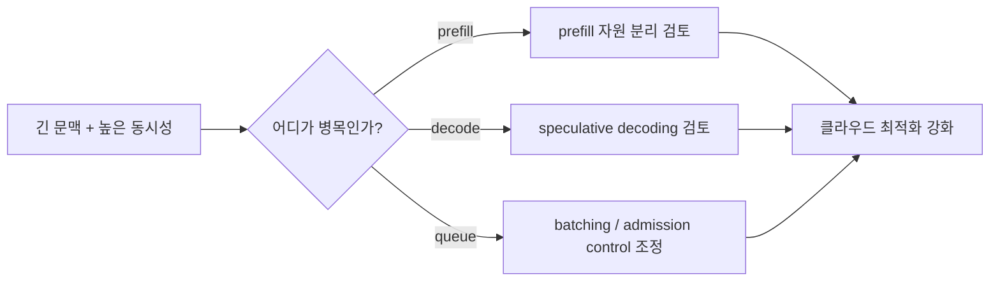
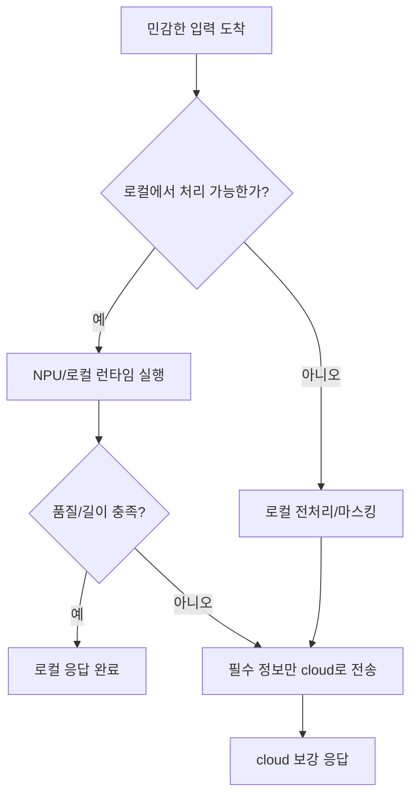

# Cloud vs Edge Inference Tradeoffs

## 수업 개요
이번 챕터의 질문은 단순하다. "이 토큰을 어디에서 만들 것인가?" 같은 모델이라도 데이터센터 GPU에서 생성할지, 사용자 PC나 디바이스의 NPU에서 생성할지, 아니면 둘을 섞을지에 따라 지연 시간, 프라이버시, 운영비, 전력 예산이 전부 달라진다. 2026년 시점에는 클라우드 최적화가 멈춘 것이 아니라 더 정교해졌고, 동시에 Copilot+ PC와 private inference 요구가 edge 설계를 다시 전면으로 끌어올렸다. vLLM의 disaggregated prefill은 클라우드 쪽에서 prefill과 decode를 분리해 자원을 더 세밀하게 쓴다는 흐름을 보여 주고 [S1], Windows ML, QNN EP, OpenVINO NPU, Ryzen AI hybrid workflow는 온디바이스 실행 경로가 실전 제품의 기본 옵션이 되고 있음을 보여 준다 [S3][S4][S5][S6].

## 학습 목표
- 어떤 요구사항이면 cloud, edge, hybrid 중 어디서 시작해야 하는지 설명한다.
- latency, privacy, cost, power가 서로 어떻게 충돌하는지 식과 사례로 말한다.
- 2026년 공식 문서에 나온 클라우드 최적화와 온디바이스 런타임 흐름을 한 그림으로 연결한다.

## 수업 전에 생각할 질문
- 사용자가 가장 싫어할 실패는 무엇인가: 느린 첫 응답, 개인정보 전송, 배터리 급감, 혹은 비용 폭증인가?
- 내 서비스의 요청 길이와 동시성은 안정적인가, 아니면 하루 중 특정 시간에만 폭증하는가?
- "private inference"라고 말할 때 실제로 보호하려는 것은 원문 데이터인가, 파생 로그인가, 아니면 둘 다인가?

## 강의 스크립트
### Part 1. 선택 기준부터 세운다
**교수자:** 오늘은 모델 아키텍처보다 배치 위치를 먼저 고르겠습니다. 이 판단이 흐리면 이후의 프레임워크 선택도 거의 다 흔들립니다. `cloud vs edge`는 유행어가 아니라 SLO 문서 첫 줄에 들어가야 하는 배치 전략입니다.

**학습자:** 보통은 모델 크기부터 보지 않나요? 작은 모델이면 edge, 큰 모델이면 cloud라고 정리하면 안 됩니까?

**교수자:** 그렇게 정리하면 초반에는 편하지만 실제 제품에서는 자주 틀립니다. 작은 모델이어도 사내 문서 100개를 묶어 길게 읽어야 하면 cloud가 자연스럽고, 큰 모델이더라도 민감한 입력을 로컬에서 먼저 가공해야 하면 hybrid가 먼저 나옵니다. 먼저 네 가지를 적으세요. `TTFT`, `데이터 민감도`, `월간 요청량`, `디바이스 전력 한도`. 이 네 줄이 placement의 출발점입니다.

**교수자:** 클라우드는 자원을 합쳐 쓰는 쪽에 강하다. 긴 컨텍스트, 높은 동시성, 빠른 모델 교체, 중앙집중 관측성이 여기서 이긴다. 반대로 edge는 네트워크 왕복을 줄이고 원문을 디바이스 밖으로 내보내지 않아도 된다는 점에서 강하다. 대신 모델 적재 시간, 메모리 제약, 발열, 장치별 편차를 직접 감당해야 한다.

**학습자:** 그러면 "latency만 보면 edge"도 틀린 말이군요?

**교수자:** 맞습니다. 로컬 NPU가 약하거나 모델 로딩이 길면 첫 토큰은 오히려 클라우드가 더 빨리 나올 수 있습니다. TensorRT-LLM의 speculative decoding 같은 기법은 클라우드에서 체감 지연을 줄이는 대표 사례고 [S2], vLLM의 disaggregated prefill은 긴 입력을 처리하는 자원 배치를 따로 가져가게 해 줍니다 [S1]. 클라우드도 계속 빨라지고 있다는 뜻입니다.

### Part 2. 클라우드가 먼저 맞는 장면
**교수자:** 첫 번째 장면을 보죠. 글로벌 전자상거래 고객센터가 있고, 상담사가 주문 이력과 정책 문서를 한꺼번에 넣어 답변 초안을 받습니다. 요청 길이가 길고, 여러 사용자가 동시에 들어오며, 모델 업데이트도 자주 해야 합니다. 여기서는 cloud가 기본값입니다.

**학습자:** 이유가 "큰 모델을 써야 해서"인가요?

**교수자:** 그보다 `shared context`와 `shared fleet`가 더 큽니다. 상담 정책이 바뀌면 서버 한 번 교체로 전체 사용자를 바꿀 수 있어야 하고, 긴 프롬프트를 처리할 때는 prefill 비용을 여러 GPU 자원 전략으로 흡수하는 편이 낫습니다. vLLM 문서가 disaggregated prefill을 별도 기능으로 다루는 이유도 바로 그 지점입니다 [S1].

#### 핵심 수식 1. 클라우드 첫 응답 시간
$$
T_{\mathrm{TTFT}}^{\mathrm{cloud}} = T_{\mathrm{uplink}} + T_{\mathrm{queue}} + T_{\mathrm{prefill}} + T_{\mathrm{first\ decode}}
$$

**교수자:** 이 식은 클라우드가 느리다고 단정하기 전에 어디를 분리해 측정해야 하는지 알려 줍니다. 회선 지연이 큰지, 피크 시간 큐가 긴지, prefill이 긴지, decode가 느린지 나눠 봐야 합니다. speculative decoding은 마지막 항을 줄이는 쪽의 도구이고 [S2], disaggregated prefill은 세 번째 항을 다른 자원 계층으로 보내는 발상에 가깝습니다 [S1].

**학습자:** 결국 클라우드는 "멀리 있어서 느리다"가 아니라 "멀어도 잘 쪼개면 강하다"에 가깝군요.

**교수자:** 정확합니다. 그리고 운영 관점도 중요합니다. 감사 로그, 버전 롤백, 공용 지식베이스 업데이트, A/B 실험은 중앙 서버가 훨씬 수월합니다. 비용도 요청량이 출렁이면 클라우드가 오히려 낫습니다. idle 장치를 수천 대에 깔아 두는 비용은 장부에 늦게 나타날 뿐 사라지지 않습니다.

### Part 3. 엣지가 먼저 맞는 장면
**교수자:** 이제 반대 장면을 봅시다. 영업 담당자가 고객사 회의에서 노트북으로 메모를 정리하고, 원문 음성이나 메모를 외부로 보내면 안 된다고 합시다. 네트워크가 불안정하고, 사용자는 첫 응답이 끊기는 것을 싫어합니다. 여기서는 edge 또는 local-first hybrid가 자연스럽습니다.

**학습자:** 여기서는 프라이버시 때문이라는 건 알겠는데, 실제 구현 경로는 어떻게 잡나요?

**교수자:** 2026년에는 "로컬에서 돌리고 싶다" 수준에서 멈추지 않습니다. Windows ML은 Windows 환경의 on-device AI 실행 경로를 제공하고 [S4], ONNX Runtime의 QNN Execution Provider는 특정 NPU 백엔드에 그래프를 오프로딩하는 구조를 설명합니다 [S3]. Intel 계열에서는 OpenVINO가 NPU target을 별도 장치로 다루고 [S6], AMD 문서는 hybrid on-device GenAI workflow를 별도 흐름으로 정리합니다 [S5]. 즉, edge는 아이디어가 아니라 런타임 조합의 문제입니다.

#### 핵심 수식 2. 엣지 1회 요청의 에너지 비용
$$
E_{\mathrm{req}}^{\mathrm{edge}} = P_{\mathrm{avg}} \times T_{\mathrm{infer}}
$$

**교수자:** edge를 이야기할 때 자주 빠지는 항목이 전력입니다. 서버비가 줄었다고 끝이 아닙니다. 긴 응답을 자주 생성하면 사용자는 배터리와 발열로 불만을 느낍니다. 로컬 배치는 네트워크 비용을 줄여도, 에너지와 열 예산을 넘기면 제품 전체 만족도가 떨어집니다.

**학습자:** 그러면 edge 디버깅은 throughput보다 전력과 fallback부터 봐야 합니까?

**교수자:** 순서를 이렇게 잡으면 됩니다. `1) 실제로 NPU에 얼마나 올라갔는지`, `2) CPU fallback이 얼마나 발생했는지`, `3) 모델 로딩 시간이 사용자 대기 시간을 잡아먹는지`, `4) 장시간 실행 시 발열로 클럭이 떨어지는지`. QNN EP와 OpenVINO NPU 문서를 읽을 때도 "지원한다"보다 "어디서 fallback이 생길 수 있는가"를 보는 습관이 중요합니다 [S3][S6].

### Part 4. private inference는 pure edge와 같은 말이 아니다
**학습자:** private inference 요구가 늘어난다고 해서 결국 다 edge로 간다는 뜻은 아니군요.

**교수자:** 그렇죠. private inference는 종종 `원문은 로컬`, `대규모 추론은 서버`, `로그는 최소화` 같은 조합으로 구현됩니다. 예를 들어 회의 녹취에서는 로컬에서 음성 전사와 PII 마스킹을 하고, 정제된 요약 요청만 클라우드로 보내는 구성이 가능합니다. 이러면 개인정보 노출 위험을 줄이면서도 긴 문맥 요약은 서버 자원을 활용할 수 있습니다.

**교수자:** Copilot+ PC 흐름이 주목받는 이유도 여기에 있습니다. 사용자는 "완전한 오프라인"만 원하는 것이 아니라 "내 데이터가 필요 이상으로 밖에 나가지 않기"를 원합니다. 그래서 local-first, selective escalation, hybrid execution이 실제 제품 언어가 됩니다 [S4][S5].

**학습자:** 그럼 팀 회의에서 architecture를 정할 때 무엇을 먼저 비교해야 합니까?

**교수자:** 네 줄이면 됩니다.
1. `latency`: 첫 토큰이 중요하나, 전체 완료 시간이 중요하나?
2. `privacy`: 원문 자체가 못 나가나, 익명화 후 전송은 가능한가?
3. `cost`: GPU 시간과 egress 비용이 큰가, 아니면 디바이스 fleet 관리 비용이 큰가?
4. `power`: 배터리와 열 예산이 제품 경험을 해치지 않는가?

### Part 5. 실수 패턴과 선택 규칙
**학습자:** 현장에서 가장 많이 틀리는 선택은 어떤 건가요?

**교수자:** 세 가지가 많습니다. 첫째, "edge면 공짜"라고 믿는 경우입니다. 실제로는 QA, 드라이버 편차, 모델 배포, 장치별 fallback 점검이 듭니다. 둘째, "cloud면 무조건 개인정보 위험"이라고 단정하는 경우입니다. 전처리와 최소 전송 정책을 빼고 비교하면 안 됩니다. 셋째, "한 번 정하면 끝"이라고 생각하는 경우입니다. 요청 길이가 길어지거나 동시성이 늘어나면 placement도 다시 바뀝니다.

**교수자:** 선택 규칙을 더 압축해 보죠.
- 긴 문맥과 높은 동시성이 핵심이면 cloud부터 본다. [S1][S2]
- 오프라인성, 데이터 최소 전송, 기기 반응성이 핵심이면 edge부터 본다. [S3][S4][S6]
- 민감 데이터와 고품질 생성이 동시에 필요하면 hybrid부터 본다. [S4][S5]

**학습자:** 결국 답은 하나가 아니라, 실패 비용이 어디서 가장 큰지 먼저 적는 일이군요.

**교수자:** 맞습니다. 좋은 아키텍처 회의는 "우리는 왜 cloud를 택했는가"보다 "무엇을 잃지 않기 위해 이 placement를 택했는가"를 분명히 적습니다.

## 자주 헷갈리는 포인트
- edge가 항상 더 빠른 것은 아니다. 모델 로딩, 약한 NPU, CPU fallback 때문에 TTFT가 cloud보다 나쁠 수 있다.
- cloud가 항상 덜 안전한 것도 아니다. 로컬 마스킹과 최소 전송 정책을 넣으면 private inference 요구를 상당 부분 만족할 수 있다.
- 요청당 GPU 비용만 보면 판단이 흔들린다. edge는 디바이스 배포, 업데이트, 검증 비용이 별도다.
- `NPU 지원` 문구만 보고 판단하면 안 된다. 실제 offload coverage와 fallback 경로를 같이 봐야 한다.
- power는 모바일 기기만의 문제가 아니다. 노트북 assistant도 장시간 사용 시 발열과 배터리 저하가 체감 품질을 결정한다.

## 사례로 다시 보기
| 사례 | 우선 배치 | 이유 | 먼저 확인할 지표 |
| --- | --- | --- | --- |
| 글로벌 고객센터 답변 초안 | Cloud | 긴 문맥, 동시성, 중앙 업데이트가 중요하다. disaggregated prefill과 speculative decoding 같은 서버 최적화가 직접 도움 된다. [S1][S2] | `queue`, `prefill`, `decode throughput` |
| 영업 노트북 회의 요약 | Edge 또는 Hybrid | 원문 외부 반출 제한, 불안정한 네트워크, 즉시 반응이 중요하다. Windows ML, QNN EP, OpenVINO NPU, Ryzen AI hybrid 문맥이 여기에 맞닿는다. [S3][S4][S5][S6] | `offload coverage`, `fallback rate`, `battery drain` |
| 병원 내부 문서 검색 보조 | Hybrid | 질의 원문은 로컬에서 가공하고, 대형 문서 이해는 서버에서 처리하는 방식이 현실적이다. | `redaction 품질`, `cloud escalation 비율` |

**교수자:** 사례를 보면 모델 크기보다 실패 비용이 더 잘 보입니다. 고객센터는 한 번 느려도 되지만 틀린 정책을 대규모로 배포하면 곤란하고, 회의 요약은 조금 덜 화려해도 원문이 밖으로 나가면 안 됩니다. 그래서 placement는 품질 점수표가 아니라 손실 함수의 문제입니다.

## 핵심 정리
- cloud와 edge의 차이는 실행 위치 자체보다 어떤 비용을 중앙에서 흡수하고 어떤 비용을 사용자 기기로 미루는지에 있다.
- 클라우드는 긴 문맥, 높은 동시성, 중앙 운영에 강하고, edge는 프라이버시, 오프라인성, 즉시 반응성에 강하다.
- hybrid는 절충안이 아니라 private inference 요구를 실무적으로 만족시키는 기본 패턴이 되고 있다. [S4][S5]
- 2026년 문서 흐름은 cloud 최적화와 on-device 런타임이 동시에 성숙하고 있음을 보여 준다. [S1][S2][S3][S4][S5][S6]

## 복습 체크리스트
- 내 서비스에서 가장 비싼 실패가 latency, privacy, cost, power 중 무엇인지 한 문장으로 말할 수 있는가?
- cloud TTFT 식에서 어떤 항이 우리 서비스의 병목인지 추정할 수 있는가?
- edge 실험에서 offload coverage와 fallback rate를 왜 같이 봐야 하는지 설명할 수 있는가?
- "private inference"를 pure edge와 구분해 설명할 수 있는가?
- disaggregated prefill과 speculative decoding이 둘 다 클라우드 최적화지만 다른 병목을 겨냥한다는 점을 말할 수 있는가?
- Windows ML, QNN EP, OpenVINO NPU, Ryzen AI hybrid workflow를 하나의 edge 실행 생태계로 연결해 설명할 수 있는가?

## 대안과 비교
| 선택지 | 강한 조건 | 약한 조건 | 적합한 예시 |
| --- | --- | --- | --- |
| Cloud | 긴 문맥, 높은 동시성, 중앙 관측성, 빠른 모델 교체 | 네트워크 의존, 데이터 외부 전송 부담 | 고객센터 초안 작성, 대형 문서 기반 QA |
| Edge | 오프라인 사용, 민감 데이터, 빠른 체감 반응, 단말 독립성 | 메모리 제약, 전력/발열, 장치 편차 | 회의 메모 정리, 현장 점검 보조 |
| Hybrid | 원문 보호와 고품질 생성이 동시에 필요 | 라우팅 설계와 디버깅이 복잡 | 로컬 마스킹 후 cloud 요약, local classifier + server LLM |

## 참고 이미지

- [I1] 캡션: vLLM logo
- 출처 번호: [I1]
- 왜 이 그림이 필요한지: 클라우드 측 최적화 사례로 언급한 disaggregated prefill의 문맥을 시각적으로 고정하기 위해 사용한다.

- [I2] 캡션: Open Neural Network Exchange logo
- 출처 번호: [I2]
- 왜 이 그림이 필요한지: edge 경로에서 ONNX Runtime QNN EP와 모델 이식성 논의를 연결하는 시각적 기준점으로 사용한다.

## 출처
| 번호 | 제목 | 발행 주체 | 날짜 | URL | 사용 이유 |
| --- | --- | --- | --- | --- | --- |
| [S1] | Disaggregated Prefill V1 | vLLM project | 2026-03-08 (accessed) | [https://docs.vllm.ai/en/latest/features/disagg_prefill.html](https://docs.vllm.ai/en/latest/features/disagg_prefill.html) | 긴 문맥 요청에서 prefill과 decode를 분리해 클라우드 자원 배치를 다르게 가져가는 흐름을 설명하기 위해 사용 |
| [S2] | Speculative Decoding | NVIDIA TensorRT-LLM | 2026-03-08 (accessed) | [https://nvidia.github.io/TensorRT-LLM/1.2.0rc3/features/speculative-decoding.html](https://nvidia.github.io/TensorRT-LLM/1.2.0rc3/features/speculative-decoding.html) | 클라우드에서 체감 지연을 줄이는 대표 최적화 사례로 사용 |
| [S3] | QNN Execution Provider | ONNX Runtime | 2026-03-08 (accessed) | [https://onnxruntime.ai/docs/execution-providers/QNN-ExecutionProvider.html](https://onnxruntime.ai/docs/execution-providers/QNN-ExecutionProvider.html) | edge 경로에서 NPU offload와 fallback을 포함한 실행 provider 구조를 설명하기 위해 사용 |
| [S4] | Windows ML overview | Microsoft Learn | 2026-03-08 (accessed) | [https://learn.microsoft.com/en-us/windows/ai/new-windows-ml/overview](https://learn.microsoft.com/en-us/windows/ai/new-windows-ml/overview) | Copilot+ PC 시대의 on-device AI 실행 문맥과 private inference 요구를 연결하기 위해 사용 |
| [S5] | Hybrid On-Device GenAI workflow | AMD Ryzen AI docs | 2026-03-08 (accessed) | [https://ryzenai.docs.amd.com/en/1.6/hybrid_oga.html](https://ryzenai.docs.amd.com/en/1.6/hybrid_oga.html) | hybrid execution이 실제 제품 설계 패턴이라는 점을 설명하기 위해 사용 |
| [S6] | NPU device | OpenVINO | 2026-03-08 (accessed) | [https://docs.openvino.ai/2025/openvino-workflow/running-inference/inference-devices-and-modes/npu-device.html](https://docs.openvino.ai/2025/openvino-workflow/running-inference/inference-devices-and-modes/npu-device.html) | Intel 계열 edge 배치에서 NPU target과 장치 제약을 설명하기 위해 사용 |
