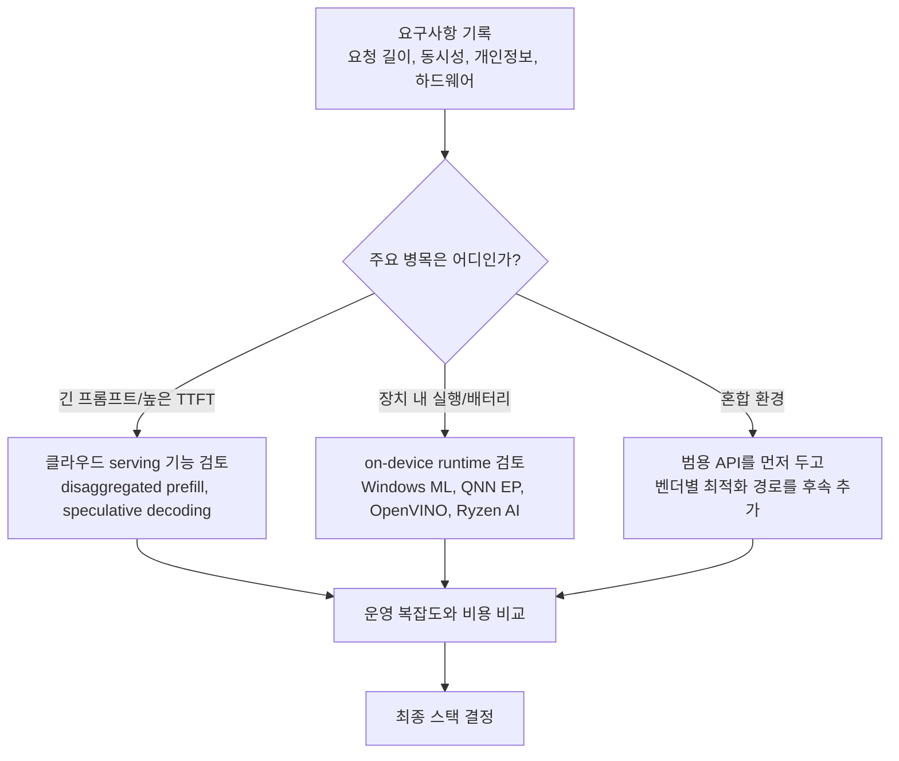
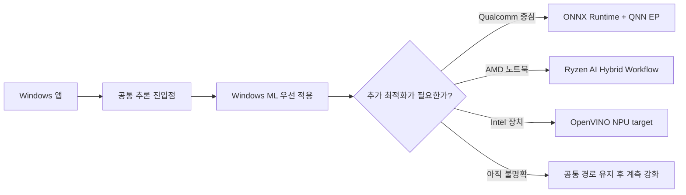

# System Design Scenarios

## 수업 개요
이 챕터는 "무슨 프레임워크가 제일 좋나요?"라는 질문을 "어떤 workload와 제약을 만족해야 하나요?"라는 질문으로 바꾸는 연습이다. 같은 LLM이라도 긴 프롬프트가 몰리는 클라우드 서비스, 배터리와 발열이 중요한 Windows PC, 여러 칩 벤더가 섞인 기업 배포 환경은 출발점이 다르다. 그래서 범용 플랫폼을 먼저 깔고 갈지, 특정 시나리오에 맞춰 더 깊게 최적화할지를 사례 중심으로 정리한다.

## 학습 목표
- 제품 요구사항을 `latency`, `privacy`, `cost`, `portability`, `operations risk`로 나눠 적을 수 있다.
- 클라우드 serving 기능과 on-device runtime 기능을 시나리오에 맞춰 연결할 수 있다.
- 범용 런타임과 벤더별 최적화 경로 중 무엇을 먼저 택해야 하는지 설명할 수 있다.

## 수업 전에 생각할 질문
- 사용자가 기다리는 시간은 `TTFT`가 문제인가, 토큰 생성 속도가 문제인가?
- 모델이 장치 위에서 돈다고 해도 실제로 NPU가 대부분의 연산을 처리하는가?
- 한 번에 여러 하드웨어를 지원해야 할 때, 공통 API의 편의와 벤더별 최적화 중 무엇이 먼저인가?

## 강의 스크립트
### Part 1. 스택을 고르기 전에 적어야 할 것
**교수자:** 오늘은 스택 이름을 외우는 시간이 아닙니다. 먼저 서비스 설명서를 네 줄로 줄여 보죠. 첫째, 요청 길이와 동시성. 둘째, 개인정보와 네트워크 제약. 셋째, 하드웨어 종류. 넷째, 장애가 났을 때 팀이 감당할 디버깅 복잡도. 이 네 줄이 비어 있으면 `vLLM`, `TensorRT-LLM`, `Windows ML`, `ONNX Runtime`, `OpenVINO` 중 무엇을 골라도 설명이 약합니다. [S1] [S2] [S3] [S4] [S6]

**학습자:** 그런데 실무에서는 보통 "우리는 Windows 앱이니까 Windows ML" 또는 "우리는 서버니까 vLLM"처럼 먼저 찍고 시작하지 않나요?

**교수자:** 그렇게 시작하면 나중에 이유를 끼워 맞추게 됩니다. 특히 이 챕터의 tradeoff는 범용성 있는 플랫폼과 특정 시나리오 최적화예요. 범용 플랫폼은 시작이 빠르고 팀 합의가 쉽습니다. 대신 아주 긴 프롬프트, 특정 NPU, 특정 전력 예산 같은 예외 상황에서 성능 천장이 빨리 보입니다. 반대로 최적화 경로는 잘 맞으면 강력하지만, 이식성과 운영 난도가 같이 올라갑니다.

#### 핵심 수식 1. 시나리오 적합도
$$
\mathrm{Fit}(\mathrm{stack}) =
w_{\mathrm{lat}} S_{\mathrm{lat}}
+ w_{\mathrm{priv}} S_{\mathrm{priv}}
+ w_{\mathrm{cost}} S_{\mathrm{cost}}
+ w_{\mathrm{port}} S_{\mathrm{port}}
- w_{\mathrm{ops}} S_{\mathrm{ops}}
$$

**교수자:** 여기서 중요한 건 숫자 자체보다 가중치입니다. 문서 검색 SaaS는 `w_lat`와 `w_cost`가 커지고, 기업용 오프라인 비서라면 `w_priv`와 `w_port`가 커집니다. 같은 모델도 가중치가 바뀌면 정답 스택이 달라집니다.

#### 시각 자료 1. 선택 순서

**학습자:** 결국 "뭘 쓸까?"보다 "어디서 망가질까?"를 먼저 찾는 구조네요.

**교수자:** 맞습니다. 이 다이어그램은 기능 목록이 아니라 디버깅 순서입니다. 제품 팀이 흔히 하는 실수는 모델 정확도 표를 먼저 보고, 그다음 배포 플랫폼을 고르는 겁니다. 시스템 설계는 반대 순서가 더 안전합니다.

### Part 2. 시나리오 A: 긴 문서가 몰리는 클라우드 요약 서비스
**교수자:** 첫 번째 사례는 계약서와 보고서를 길게 올리는 B2B 요약 서비스입니다. 아침 9시에 요청이 몰리고, 사용자는 첫 토큰이 늦는 순간 바로 느리다고 말합니다. 이런 서비스는 `decode`보다 `prefill` 부담이 먼저 튀어오르기 쉽습니다. vLLM이 `Disaggregated Prefill V1`을 별도 기능으로 설명하는 이유도 바로 이 지점입니다. 긴 입력 처리와 생성 단계를 분리해 병목을 다르게 다루겠다는 뜻이죠. [S1]

**학습자:** 그러면 긴 프롬프트 서비스는 무조건 prefill/decode 분리가 답인가요?

**교수자:** 아닙니다. 짧은 요청이 대부분이거나 네트워크 홉 자체가 부담이면 분리 이득이 작을 수 있습니다. 분리 아키텍처는 병목을 찢어 주지만, 분산된 상태 관리와 네트워크 비용을 같이 가져옵니다. 이 장단점을 모른 채 기능만 켜면 "왜 구조는 더 복잡해졌는데 체감 속도는 그대로지?"라는 상황이 나옵니다. [S1]

**교수자:** 여기에 `speculative decoding`을 붙일지 말지도 따로 봐야 합니다. NVIDIA TensorRT-LLM 문서가 이 기능을 별도 주제로 다루는 이유는, 초안 모델이 충분히 싸고 검증 모델이 초안 토큰을 높은 비율로 받아들일 때만 이득이 커지기 때문입니다. acceptance가 낮으면 계산을 두 번 하는 셈이 되어 비용과 운영 복잡도만 늘 수 있습니다. [S2]

#### 핵심 수식 2. end-to-end 지연 시간
$$
T_{\mathrm{e2e}} =
T_{\mathrm{prefill}}
+ T_{\mathrm{decode}}
+ T_{\mathrm{transfer}}
+ T_{\mathrm{fallback}}
$$

**교수자:** 이 식이 중요한 이유는 최적화 위치를 잘라서 보기 때문입니다. `disaggregated prefill`은 주로 첫 항을 다루고, `speculative decoding`은 두 번째 항을 줄이려는 시도에 가깝습니다. 그런데 실제 시스템에서는 세 번째와 네 번째 항이 갑자기 커져서 기대 이득을 잡아먹습니다. 그래서 기능 이름보다 "어느 항을 겨냥하는가"로 이해해야 합니다. [S1] [S2]

**학습자:** 실패 사례를 하나만 꼽는다면요?

**교수자:** "긴 문서 서비스니까 분리 serving을 켰는데, 정작 요청 분포를 안 봐서 짧은 요청이 대부분이었다"가 대표적입니다. 또 하나는 speculative decoding을 켰는데 draft model의 질과 배포 비용을 계산하지 않아 운영비만 오른 경우죠. 클라우드에서는 기능을 켠 뒤 `TTFT`, acceptance, 장치 사용률, 네트워크 hop 비용을 같이 봐야 합니다.

### Part 3. 시나리오 B: Windows 노트북에서 돌아가는 회의 요약 도우미
**교수자:** 두 번째 사례는 기업 노트북에 배포하는 회의 요약 도우미입니다. 여기서는 질문이 달라집니다. "절대 최고 TPS"보다 "오프라인에서도 안정적으로 돌고, 여러 하드웨어에서 배포 가능하며, 배터리 예측이 되는가"가 더 중요합니다. Microsoft가 `Windows ML overview`에서 on-device inference의 공통 진입점을 강조하는 이유는 이식성 때문입니다. 팀이 Windows 앱을 여러 기종에 배포해야 한다면, Windows ML 같은 공통 계층이 초기 제품화 속도를 높여 줍니다. [S4]

**학습자:** 그러면 Windows ML만 쓰면 되는 것 아닌가요?

**교수자:** 베이스라인으로는 좋습니다. 하지만 장치가 무엇인지에 따라 더 깊게 들어갈 이유가 생깁니다. Qualcomm 계열 NPU를 적극 활용해야 한다면 ONNX Runtime의 `QNN Execution Provider`가 자연스러운 선택지입니다. 문서 제목 자체가 보여 주듯 핵심은 "execution provider를 통해 특정 가속기 경로로 넘기는 구조"예요. 즉, 범용 ONNX 실행 프레임을 유지하면서도 NPU offload 범위를 키우는 전략입니다. [S3]

**교수자:** AMD 쪽은 `Hybrid On-Device GenAI workflow`라는 이름이 힌트를 줍니다. 하이브리드라는 말은 단순히 "장치에서 돈다"가 아니라, 장치 내부 자원과 실행 경로를 조합해 사용성을 맞추겠다는 뜻입니다. Windows 노트북에서 발열과 응답성 균형을 맞춰야 할 때 이런 흐름이 중요해집니다. [S5]

**교수자:** Intel 계열 장치라면 OpenVINO의 `NPU device` 문서처럼 목표 장치를 분명히 두고 런타임 모드를 조정하는 사고가 필요합니다. 여기서 중요한 질문은 "정말 대부분의 연산이 NPU로 가는가"입니다. 장치 이름만 NPU라고 해서 전체 그래프가 자동으로 최적으로 배치되지는 않습니다. [S6]

#### 시각 자료 2. Windows 배포에서의 분기

**학습자:** 이 그림을 보니까 "범용 경로를 먼저 세우고, 병목이 확인되면 벤더별로 내려간다"가 핵심 같네요.

**교수자:** 정확합니다. 처음부터 벤더별 SDK만 붙잡으면 섞여 있는 PC 자산을 관리하기 어려워집니다. 반대로 끝까지 공통 경로만 고집하면 특정 장치에서 얻을 수 있는 latency와 전력 이득을 놓칠 수 있죠. 이 챕터의 핵심 tradeoff가 바로 그 균형입니다. [S3] [S4] [S5] [S6]

### Part 4. 시나리오 C: "NPU를 썼는데 왜 더 느리죠?"라는 디버깅
**학습자:** 실무에서 가장 많이 듣는 불만은 이것 같아요. "분명 on-device NPU로 돌렸는데 체감이 더 느리다."

**교수자:** 그 말이 나오면 저는 순서를 고정합니다. 첫째, 연산 커버리지를 봅니다. 둘째, fallback 구간을 봅니다. 셋째, 입력 shape가 자주 바뀌는지 봅니다. 넷째, 복사 비용과 전력 제한을 봅니다. 특히 `QNN Execution Provider`, `Windows ML`, `OpenVINO NPU device` 같은 문서 이름이 알려 주는 공통점은 "가속기 경로를 어떻게 연결하고 제어할 것인가"이지, "무조건 더 빠르다"가 아닙니다. [S3] [S4] [S6]

**교수자:** 여기서 초보자가 자주 하는 오해는 "양자화만 하면 NPU가 해결한다"입니다. 실제로는 지원되지 않는 연산 하나가 CPU fallback을 만들고, 그 한 번의 왕복이 사용자 체감 지연을 망칠 수 있습니다. AMD의 hybrid workflow도 이런 현실을 전제로 읽어야 합니다. 하이브리드는 편법이 아니라, 단일 장치만으로 항상 최선이 되지 않는다는 사실을 인정하는 설계입니다. [S5]

**학습자:** 그러면 특정 벤더 최적화는 언제 들어가야 하나요?

**교수자:** 공통 경로에서 병목이 확인된 다음입니다. 예를 들어 Windows ML로 먼저 제품을 띄우고, 특정 Qualcomm 모델에서 회의 요약 `TTFT`가 목표를 못 맞춘다면 그때 QNN EP를 검토하는 식이죠. 반대로 처음부터 Qualcomm 전용 경로를 택해야 하는 경우도 있습니다. 오프라인 보안 요구가 강하고 배포 대상이 확정된 단일 기기군이라면, 범용성보다 특화 최적화가 더 맞습니다. [S3] [S4]

### Part 5. 세 줄 정리
**교수자:** 오늘 내용을 세 줄로 줄이면 이렇습니다. 첫째, 정답 스택은 없고 workload와 제약을 잘 적는 사람이 유리합니다. 둘째, 클라우드에서는 prefill/decode 병목과 운영비를 같이 봐야 하고, on-device에서는 offload coverage와 fallback을 같이 봐야 합니다. 셋째, 범용 플랫폼은 시작을 빠르게 하고, 특화 경로는 한계 성능을 밀어 올리지만 운영 책임도 함께 가져옵니다.

**학습자:** 결국 질문을 바꿔야 하네요. "무슨 스택?"이 아니라 "어떤 제약을 먼저 만족해야 하나?"

**교수자:** 그 질문만 몸에 붙으면 이 챕터는 성공입니다.

## 자주 헷갈리는 포인트
- `disaggregated prefill`은 긴 입력 병목을 다루는 유력한 방법이지만, 모든 서비스의 기본 설정은 아니다. [S1]
- `speculative decoding`은 생성 속도를 높일 수 있지만, draft model과 acceptance 조건이 맞지 않으면 손해가 날 수 있다. [S2]
- Windows에서 공통 API를 쓴다는 말은 성능을 포기한다는 뜻이 아니다. 다만 병목이 확인되면 벤더별 경로로 내려갈 준비가 필요하다. [S4]
- `NPU 사용`과 `대부분의 연산이 NPU에서 실행`은 같은 문장이 아니다. fallback을 확인해야 한다. [S3] [S6]
- 하이브리드 실행은 타협이 아니라, 장치 내 자원과 사용자 경험을 함께 맞추려는 설계일 수 있다. [S5]

## 사례로 다시 보기
| 사례 | 먼저 적어야 할 조건 | 자연스러운 출발점 | 이후 최적화 후보 | 흔한 실수 |
| --- | --- | --- | --- | --- |
| 계약서 요약 SaaS | 긴 프롬프트, 아침 피크 트래픽, `TTFT` 민감 | vLLM 기반 serving | disaggregated prefill, speculative decoding [S1] [S2] | 짧은 요청 비중을 안 보고 분리 serving을 도입함 |
| Windows 회의 요약 도우미 | 오프라인 가능, 여러 칩 벤더, 배터리 | Windows ML [S4] | QNN EP, Ryzen AI hybrid, OpenVINO NPU [S3] [S5] [S6] | 공통 API만 믿고 fallback 계측을 안 함 |
| 단일 기기군 보안 비서 | 기기 고정, 강한 privacy, 네트워크 제한 | 벤더 특화 런타임 | 장치별 graph/EP 튜닝 [S3] [S6] | 범용성 요구가 없는데도 추상화 계층을 너무 두껍게 쌓음 |

## 핵심 정리
- 시스템 설계에서 스택 선택은 기능 비교가 아니라 요구사항 가중치 설계다.
- 클라우드 시나리오에서는 `prefill`, `decode`, 전송, fallback을 분리해서 봐야 한다. [S1] [S2]
- Windows on-device 시나리오에서는 공통 진입점과 벤더별 최적화 경로를 함께 준비하는 편이 현실적이다. [S3] [S4] [S5] [S6]
- "NPU를 쓴다"보다 "어느 연산이 어디서 실행되고 어디서 되돌아오는가"가 더 중요한 질문이다.

## 복습 체크리스트
- 한 제품 시나리오를 보고 `latency`, `privacy`, `cost`, `portability`, `operations risk` 가중치를 적을 수 있는가?
- `disaggregated prefill`과 `speculative decoding`이 겨냥하는 지연 구간을 구분할 수 있는가? [S1] [S2]
- Windows 배포에서 공통 경로와 벤더별 경로를 어떤 순서로 설계할지 말할 수 있는가? [S3] [S4]
- NPU 최적화가 기대보다 약할 때 fallback부터 의심해야 하는 이유를 설명할 수 있는가? [S3] [S6]
- 하이브리드 실행을 "불완전한 온디바이스"가 아니라 의도된 설계로 설명할 수 있는가? [S5]

## 대안과 비교
| 비교 축 | 범용 플랫폼 우선 | 시나리오 특화 최적화 우선 |
| --- | --- | --- |
| 초기 개발 속도 | 빠르다. 팀 공통 이해를 맞추기 쉽다. | 느릴 수 있다. 장치별 지식이 필요하다. |
| 이식성 | 높다. 여러 하드웨어와 운영 환경에 유리하다. | 낮아질 수 있다. 대상 장치가 고정될수록 유리하다. |
| 최고 성능 | 한계가 빨리 보일 수 있다. | 잘 맞으면 크게 올라간다. |
| 디버깅 난도 | 비교적 단순하다. 대신 병목 세부 제어가 적다. | 높다. fallback, graph 분할, 전력 제약을 직접 봐야 한다. |
| 대표 예시 | Windows ML 기반 배포 [S4] | QNN EP, Ryzen AI hybrid, OpenVINO NPU, disaggregated serving [S1] [S3] [S5] [S6] |
| 추천 상황 | 요구사항이 아직 흔들리거나 대상 장치가 넓게 퍼져 있을 때 | workload와 장치가 명확하고, 수치 목표가 빡빡할 때 |

## 참고 이미지

- [I1] 캡션: vLLM logo
- 출처 번호: [I1]
- 활용 맥락: 클라우드 serving 사례에서 `disaggregated prefill` 같은 기능이 왜 시스템 설계 선택지로 올라오는지 시각적 기준점을 준다.

- [I2] 캡션: Open Neural Network Exchange logo
- 출처 번호: [I2]
- 활용 맥락: Windows on-device 배포에서 ONNX 기반 공통 실행 경로와 execution provider 사고방식을 설명할 때 연결점이 된다.

## 출처
| 번호 | 제목 | 발행 주체 | 날짜 | URL | 사용 이유 |
| --- | --- | --- | --- | --- | --- |
| [S1] | Disaggregated Prefill V1 | vLLM project | 2026-03-08 (accessed) | [https://docs.vllm.ai/en/latest/features/disagg_prefill.html](https://docs.vllm.ai/en/latest/features/disagg_prefill.html) | Prefill/Decode 분리 아키텍처 최신 구현 |
| [S2] | Speculative Decoding | NVIDIA TensorRT-LLM | 2026-03-08 (accessed) | [https://nvidia.github.io/TensorRT-LLM/1.2.0rc3/features/speculative-decoding.html](https://nvidia.github.io/TensorRT-LLM/1.2.0rc3/features/speculative-decoding.html) | speculative decoding의 시스템적 의미 |
| [S3] | QNN Execution Provider | ONNX Runtime | 2026-03-08 (accessed) | [https://onnxruntime.ai/docs/execution-providers/QNN-ExecutionProvider.html](https://onnxruntime.ai/docs/execution-providers/QNN-ExecutionProvider.html) | QNN 기반 NPU offload와 실행 provider 구조 |
| [S4] | Windows ML overview | Microsoft Learn | 2026-03-08 (accessed) | [https://learn.microsoft.com/en-us/windows/ai/new-windows-ml/overview](https://learn.microsoft.com/en-us/windows/ai/new-windows-ml/overview) | Windows on-device inference 런타임의 공식 개요 |
| [S5] | Hybrid On-Device GenAI workflow | AMD Ryzen AI docs | 2026-03-08 (accessed) | [https://ryzenai.docs.amd.com/en/1.6/hybrid_oga.html](https://ryzenai.docs.amd.com/en/1.6/hybrid_oga.html) | Ryzen AI의 hybrid execution과 OGA 흐름 |
| [S6] | NPU device | OpenVINO | 2026-03-08 (accessed) | [https://docs.openvino.ai/2025/openvino-workflow/running-inference/inference-devices-and-modes/npu-device.html](https://docs.openvino.ai/2025/openvino-workflow/running-inference/inference-devices-and-modes/npu-device.html) | Intel NPU target과 runtime mode 설명 |
