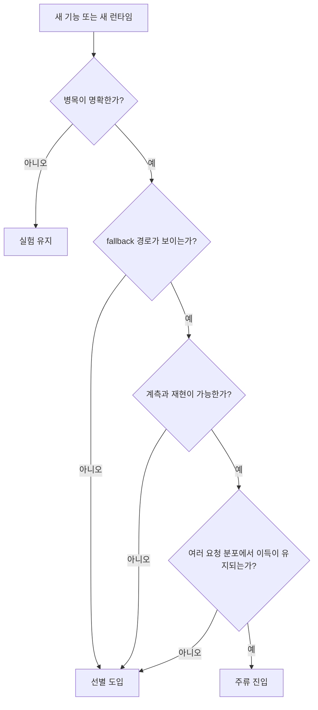
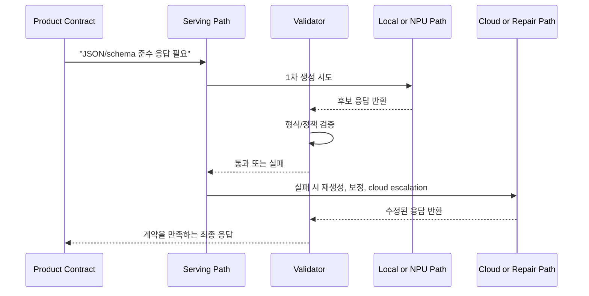

# 2026 Trend Watch

## 수업 개요
이 챕터는 2026년 3월 8일 기준 제공된 공식 자료만으로, 무엇이 이미 반복 가능한 운영 패턴이 되었고 무엇이 아직 실험 신호에 머무는지 가르는 수업이다. 이번 소스 묶음이 직접 다루는 축은 세 가지다. cloud 쪽의 `prefill/decode 분리` [S1], decode 가속 카드인 `speculative decoding` [S2], 그리고 on-device 쪽의 `provider 기반 NPU offload`와 `hybrid execution` [S3][S4][S5][S6]이다. chapter-context가 함께 언급한 `structured outputs`는 이번 챕터에서 별도 인프라 기술로 분류하지 않는다. 현재 소스 집합에는 그것을 직접 설명하는 문서가 없기 때문이다. 대신 `structured outputs`를 제품이 인프라에 가하는 요구 신호로 다룬다. 즉, 출력 형식 준수 요구가 validation path, retry 비용, local/cloud 라우팅 압력을 키운다는 관점으로 읽는다.

## 학습 목표
- 2026년 기술을 `채택 신호`, `실험 신호`, `비분류 요구 신호`로 구분할 수 있다.
- disaggregated serving, speculative decoding, provider 기반 NPU offload, hybrid execution을 같은 판단 축으로 설명할 수 있다.
- `structured outputs`를 인프라 기술이 아니라 제품 요구 신호로 봐야 하는 이유와, 현재 소스 범위에서는 왜 `비분류`로 두는지 설명할 수 있다.
- cloud 서비스와 AI PC 앱 사례에서 latency budget, validation path, fallback 정책을 연결해 의사결정을 정리할 수 있다.

## 수업 전에 생각할 질문
- "새 기능이 문서에 있다"와 "내 팀이 운영할 수 있다" 사이에는 어떤 간격이 있는가?
- JSON이나 schema를 반드시 맞춰야 하는 제품이라면, 응답 생성 외에 어떤 시간이 더 든다고 봐야 하는가?
- on-device 데모가 성공했더라도, 어떤 신호가 보여야 그것을 2026년의 `주류 채택 후보`로 인정할 수 있을까?

## 강의 스크립트
### Part 1. 2026년 트렌드는 이름보다 채택 신호로 읽어야 한다
**교수자:** 이 챕터는 기술 유행 정리를 하는 시간이 아닙니다. 더 정확히 말하면, `유행어를 채택 신호로 번역하는 시간`입니다. 2026년에 중요한 건 "새 기능이 나왔다"가 아니라 "반복 가능한 운영 절차가 생겼는가"예요.

**학습자:** 그러면 기준을 먼저 정해야겠네요. 어떤 기술이 주류고, 어떤 기술이 아직 실험인지 무엇으로 가릅니까?

**교수자:** 수업에서는 네 가지를 봅니다. `반복 가능성`, `관측 가능성`, `workload 적합성`, `fallback 비용`입니다. 이름이 화려해도 이 네 줄이 비면 아직 과감히 `실험`이라고 적는 편이 낫습니다.

#### 핵심 수식 1. 채택 신뢰도
$$
C_{\mathrm{adopt}}=
\frac{R_{\mathrm{repeat}} \times O_{\mathrm{observe}} \times W_{\mathrm{fit}}}
{F_{\mathrm{fallback}} + I_{\mathrm{integration}}}
$$

- $R_{\mathrm{repeat}}$: 여러 요청과 여러 배포 환경에서 같은 이득이 재현되는가
- $O_{\mathrm{observe}}$: 병목, fallback, routing 결과를 실제로 계측할 수 있는가
- $W_{\mathrm{fit}}$: 기능이 내 workload의 병목과 직접 맞닿아 있는가
- $F_{\mathrm{fallback}}$: 미지원 연산, 검증 실패, device miss 때문에 우회 경로가 생길 위험
- $I_{\mathrm{integration}}$: 배포, 검증, 운영 복잡도를 새로 떠안아야 하는 정도

**교수자:** 예를 들어 vLLM의 disaggregated prefill은 긴 prompt workload에서 어떤 병목을 겨냥하는지 분명합니다 [S1]. TensorRT-LLM의 speculative decoding도 decode 병목을 줄인다는 목적이 명확하죠 [S2]. on-device 쪽 문서 묶음은 provider, runtime, workflow, NPU target을 따로 노출하면서 fallback과 실행 경계를 관리해야 한다는 사실을 드러냅니다 [S3][S4][S5][S6]. 문서 존재 자체보다, `어디를 재고 어디서 실패할지`가 보인다는 점이 중요합니다.

#### 시각 자료 1. 2026 채택 신호 판별기

**학습자:** 정리하면 2026년 트렌드라는 말은 사실 `운영 체크리스트`에 가깝군요.

**교수자:** 맞습니다. 이 챕터는 기술 이름 암기가 아니라, 채택 신호와 실험 신호를 읽는 훈련입니다.

### Part 2. Structured Outputs는 인프라 기술이 아니라 제품 요구 신호다
**학습자:** 그런데 chapter-context에는 `structured outputs`도 주요 흐름으로 들어가 있습니다. 왜 여기서는 주류나 선별 도입으로 바로 분류하지 않나요?

**교수자:** 이유가 두 가지입니다. 첫째, structured outputs의 출발점은 인프라가 아니라 제품 계약입니다. 사용자는 자유 텍스트보다 JSON, schema, tool argument처럼 `검증 가능한 결과`를 요구합니다. 둘째, 이번 챕터의 공식 소스 집합에는 structured outputs 자체를 독립 기술로 설명하는 문서가 없습니다. 그래서 이 챕터에서는 이것을 `인프라 기술`로 분류하지 않고 `제품 요구 신호`로 다룹니다. 상태는 `비분류`예요.

**학습자:** 비분류라고 해도 중요하지 않다는 뜻은 아니겠죠?

**교수자:** 오히려 반대입니다. 이 요구가 들어오면 인프라 쪽에서 더 많은 비용을 감당해야 합니다. 응답이 형식을 어기면 validation, repair, retry, route 변경이 연달아 붙기 때문입니다. 그래서 structured outputs는 cloud와 hybrid 설계를 압박하는 신호입니다.

#### 핵심 수식 2. 안전한 구조화 응답 시간
$$
T_{\mathrm{safe\_resp}} =
T_{\mathrm{prefill}} +
T_{\mathrm{decode}} +
T_{\mathrm{validate}} +
T_{\mathrm{repair}} +
T_{\mathrm{route}}
$$

- $T_{\mathrm{validate}}$: schema 검사, tool argument 검사, 정책 검사 시간
- $T_{\mathrm{repair}}$: 형식 오류를 바로잡기 위한 재생성 또는 후처리 시간
- $T_{\mathrm{route}}$: local fallback, CPU/GPU fallback, cloud escalation으로 인한 추가 시간

**교수자:** 제공된 소스는 structured outputs를 직접 설명하지는 않지만, 이 식의 앞뒤 항목을 뒷받침합니다. prefill/decode 분리는 [S1], decode 가속은 [S2], fallback과 offload 경계는 [S3][S4][S5][S6]이 다룹니다. 그래서 이 챕터의 수업용 추론은 이렇습니다. `structured outputs는 인프라 유행어가 아니라, validation과 routing 비용을 인프라에 떠넘기는 제품 요구다.`

#### 시각 자료 2. Structured Outputs가 경로를 늘리는 방식

**학습자:** 그러면 structured outputs가 들어오면 단순히 "JSON 잘 나오나?"만 볼 게 아니라, 실패했을 때 어디로 보내는지도 설계해야겠네요.

**교수자:** 정확합니다. 그래서 이것을 인프라 기술 목록에 넣기보다, 인프라 선택을 밀어붙이는 제품 요구 신호로 읽는 겁니다.

### Part 3. Cloud에서 2026년 주류에 가까운 것은 병목 분리가 보이는 기술이다
**교수자:** cloud 쪽에서 2026년 주류에 가장 가까운 신호는 `prefill과 decode를 다른 문제로 본다`는 점입니다. vLLM이 disaggregated prefill을 별도 기능으로 다루는 것은, 긴 문맥 서비스에서 prefill이 독립 병목으로 취급된다는 뜻입니다 [S1].

**학습자:** 어떤 상황에서 그게 진짜 채택 신호가 되나요?

**교수자:** 이런 체크가 가능할 때입니다.

| cloud 체크포인트 | 채택 신호 | 실험 신호 |
| --- | --- | --- |
| 요청 분포 | 긴 prompt, 짧은 응답이 반복적으로 관측된다 [S1] | 짧은 요청이 대부분인데 긴 문맥 서비스라고 막연히 가정한다 |
| 병목 위치 | TTFT와 prefill 비중이 실제로 크다 [S1] | decode 문제인지도 모른 채 구조만 복잡하게 만든다 |
| 운영 경계 | prefill/decode 분리 후 모니터링 포인트를 팀이 이해한다 | 구조만 분리하고 tail latency 원인을 추적하지 못한다 |

**교수자:** 반대로 speculative decoding은 강력하지만 `선별 도입`입니다. decode 병목이 크고, draft/verify 경로를 운영할 준비가 된 팀에선 분명 매력적입니다 [S2]. 하지만 acceptance가 낮거나 응답이 짧으면 기대 이득이 흐려집니다.

**학습자:** 그러면 structured outputs가 있는 서비스에서는 어떤 순서로 봐야 합니까?

**교수자:** 먼저 응답 계약을 적습니다. 그다음에 `형식 준수 실패 시 repair가 필요한가`, `repair를 로컬에서 할지 cloud에서 할지`, `그 비용이 decode보다 큰가`를 봅니다. 긴 prompt와 짧은 구조화 응답 서비스라면, structured outputs가 있어도 먼저 prefill 병목을 해결해야 할 가능성이 큽니다 [S1]. 반대로 응답이 길고 validation 실패율도 높다면 decode 최적화와 repair path 설계가 같이 올라옵니다 [S2].

**교수자:** 실패 사례 하나를 보죠. 계약서 심사 API가 모든 응답을 JSON으로 강제한다고 합시다. 팀이 speculative decoding을 먼저 붙였는데, 실제론 prompt가 길고 JSON validator가 자주 재시도를 일으켜 p95가 더 나빠졌습니다. 이건 기능이 틀린 게 아니라, 병목과 validation 경로를 반대로 읽은 겁니다.

### Part 4. On-Device는 "NPU 지원"보다 채택 신호 체크리스트가 중요하다
**학습자:** on-device 쪽은 01, 02 챕터에서도 비슷한 문서들이 나왔습니다. 이번 챕터는 무엇이 달라야 하나요?

**교수자:** 이번 챕터는 벤더 이름을 더 적는 대신, `2026년에 어떤 신호가 보여야 도입을 밀어도 되는가`를 봅니다. 제공된 공식 자료를 묶어 읽으면 최소한 세 가지는 분명합니다. provider나 runtime surface가 공식화돼 있고 [S3][S4], hybrid workflow가 문서 언어로 올라왔으며 [S5], NPU target이 독립 실행 대상으로 다뤄집니다 [S6]. 여기까지는 채택 신호예요. 하지만 그 다음 줄을 채워야 실제 제품이 됩니다.

| on-device 체크포인트 | 2026 채택 신호 | 아직 실험으로 남는 신호 |
| --- | --- | --- |
| 실행 surface | provider/runtime 경로가 공식 문서로 정리돼 있다 [S3][S4][S6] | 데모 스크립트만 있고 운영 surface가 불분명하다 |
| fallback 가시성 | 어떤 연산이 NPU에 남고 어디서 되돌아오는지 계측 가능하다 [S3][S6] | "NPU 사용"만 보이고 CPU/GPU fallback 비율을 모른다 |
| hybrid 정책 | local 처리와 cloud 보강의 경계가 workflow로 설명된다 [S5] | 실패 시 무조건 cloud로 던져 버려 privacy 경계가 흔들린다 |
| 제품 계약 | validator, repair, retry가 장치 경로와 충돌하지 않게 설계돼 있다 | structured outputs를 붙인 뒤 validation이 전부 CPU나 cloud로 새어 나간다 |
| 배포 현실성 | 지원 장치군과 운영체제 범위가 분명하다 [S4][S6] | 한 SKU 데모 성공을 범용 호환성으로 착각한다 |

**학습자:** 마지막 두 줄이 특히 03 챕터답네요. 이전 챕터보다 훨씬 제품 냄새가 납니다.

**교수자:** 바로 그 차이가 중요합니다. 2026년에 on-device가 성숙했다는 말은 `모든 것을 NPU에 올릴 수 있다`가 아닙니다. `실패를 어디서, 어떻게 흡수할지 설계 언어가 생겼다`는 뜻에 더 가깝습니다.

**교수자:** 실패 사례도 보겠습니다. 회의 요약 앱이 on-device 데모에서는 잘 돌아갔는데, 실제 배포 뒤에는 특정 모델에서 schema validation이 자주 깨졌다고 합시다. 앱은 형식 보정을 위해 cloud repair를 부르기 시작했고, 그 순간 privacy 약속과 latency 예산이 동시에 흔들렸습니다. 이건 NPU가 느려서가 아닙니다. structured outputs 요구를 제품 계약으로 설계하지 않고, 추론 경로 뒤에 덧붙였기 때문입니다.

### Part 5. 2026년 분류표를 명확히 적어 보자
**학습자:** 이제 표로 딱 정리해 주세요. 무엇이 주류 진입이고, 무엇이 선별 도입이고, 무엇이 비분류입니까?

**교수자:** 아래 표는 이번 수업의 최종 판정입니다. 구조화 출력 row는 의도적으로 `비분류`로 둡니다.

| 항목 | 상태 | 왜 그렇게 보나 | 먼저 확인할 운영 질문 |
| --- | --- | --- | --- |
| Disaggregated serving | 주류 진입 | prefill/decode 분리가 공식 기능 수준으로 다뤄지고, 긴 문맥 workload의 병목이 명확하다 [S1] | 우리 서비스의 TTFT와 prefill 비중이 정말 큰가? |
| Speculative decoding | 선별 도입 | decode 병목에서 강력하지만, draft/verify 경로와 acceptance 편차를 함께 감당해야 한다 [S2] | 응답 길이와 acceptance가 이 기능의 비용을 상쇄하는가? |
| Provider 기반 NPU offload | 주류 진입 | provider/runtime/NPU target이 공식 surface로 정리돼 있어 반복 가능한 진입 경로가 보인다 [S3][S4][S6] | 실제 operator coverage와 fallback 비율은 얼마인가? |
| Hybrid execution | 주류 진입 | workflow 차원에서 local 처리와 cloud 보강 경계가 문서 언어로 올라왔다 [S4][S5][S6] | cloud escalation 조건이 privacy 정책과 충돌하지 않는가? |
| Structured outputs | 비분류인 제품 요구 신호 | 현재 소스 묶음이 이를 직접 문서화하지 않으므로 별도 인프라 maturity 판정은 유보한다. 대신 형식 준수 요구가 validation, repair, routing 비용을 늘려 cloud/hybrid 선택 압력을 높인다고 본다. 이 평가는 본문 수식과 [S1][S2][S3][S4][S5][S6]을 연결한 수업용 추론이다. | schema 실패가 나면 어디서 고치고, 그때 latency budget은 얼마나 남는가? |
| 단일 경로의 범용 NPU 이식성 | 아직 실험 | 제공된 자료가 모두 runtime, provider, workflow, target별 경계를 전제로 한다 [S3][S4][S5][S6] | 장치군이 넓어졌을 때 검증 비용이 감당 가능한가? |

### Part 6. 두 가지 사례로 최종 점검하자
**교수자:** 첫 번째 사례는 `규정 점검 API`입니다. 입력은 길고, 출력은 짧은 JSON입니다. 여기서 채택 신호는 prefill 병목 계측이 되는지와 validator 실패가 얼마나 잦은지입니다. 실험 신호는 "JSON이 필요하니 decode 최적화부터"라고 단정하는 태도예요. 이런 서비스는 구조화 출력 요구가 강해도, 실제 시스템 병목은 여전히 prefill일 수 있습니다 [S1].

**학습자:** 두 번째는요?

**교수자:** `AI PC 현장 점검 도우미`입니다. 기본 동작은 로컬 요약과 체크리스트 생성이고, 복잡한 복구 조언만 cloud에 올립니다. 여기서 채택 신호는 provider coverage 계측, fallback 로그, cloud escalation 규칙이 문서로 남아 있는지입니다 [S3][S4][S5][S6]. 실험 신호는 데모에서 한 기기만 성공했는데 범용 배포를 약속하는 겁니다. structured outputs 요구가 강할수록, local validator와 cloud repair의 경계를 먼저 그려야 합니다.

**학습자:** 결국 2026년 trend watch의 핵심은 "더 멋진 기능 찾기"가 아니라 "제품 계약이 어느 운영 비용을 새로 만들었는지 보기"군요.

**교수자:** 그 문장이 이 챕터의 결론입니다.

## 자주 헷갈리는 포인트
- `structured outputs`는 이번 챕터에서 인프라 기술로 분류하지 않는다. 현재 소스 범위에서는 제품 요구 신호로 읽는 것이 더 정확하다.
- `주류 진입`은 모두가 즉시 기본값으로 써야 한다는 뜻이 아니라, 실패 지점과 계측 포인트가 비교적 또렷하다는 뜻이다.
- speculative decoding은 최신 기술이지만, 최신이라는 이유만으로 도입 우선순위가 올라가지는 않는다. decode 병목과 acceptance가 맞아야 한다 [S2].
- on-device 문서가 많아졌다고 해서 범용 이식성이 확보됐다는 뜻은 아니다. 오히려 fallback과 coverage를 직접 보라는 신호에 가깝다 [S3][S4][S6].
- hybrid execution은 임시 우회로가 아니라, local/privacy 요구와 capability 요구를 동시에 맞추기 위한 제품 설계 패턴이다 [S5].

## 사례로 다시 보기
| 사례 | 채택 신호 | 실험 신호 | structured outputs가 미는 압력 |
| --- | --- | --- | --- |
| 규정 점검 API | prefill 병목, TTFT 계측, validator 실패율 추적 [S1] | JSON 요구만 보고 decode 최적화부터 도입 | validation/retry 때문에 latency budget이 더 빡빡해진다 |
| AI PC 현장 점검 도우미 | provider coverage, fallback 로그, cloud escalation 규칙 [S3][S4][S5][S6] | 한 기기 성공을 범용 배포로 확대 해석 | local validator와 cloud repair 경계를 먼저 정해야 한다 |
| 긴 답변형 코딩 보조 | decode 비중이 높고 acceptance 관리가 된다 [S2] | draft/verify 운영 비용을 무시 | schema 강제가 붙으면 repair path가 decode 이득을 잠식할 수 있다 |

## 핵심 정리
- 2026년 트렌드는 기술 이름보다 `채택 신호`와 `실험 신호`로 읽는 편이 안전하다.
- cloud에서는 disaggregated serving이 `주류 진입`, speculative decoding이 `선별 도입`에 가깝다 [S1][S2].
- on-device에서는 provider 기반 NPU offload와 hybrid execution이 `주류 진입`에 가깝지만, 여전히 coverage와 fallback 계측이 핵심이다 [S3][S4][S5][S6].
- structured outputs는 이번 챕터에서 `비분류인 제품 요구 신호`다. 직접적인 인프라 출처가 없기 때문에 maturity 판정은 유보하고, 대신 validation path와 routing 비용을 늘리는 압력으로 해석한다.
- 03 챕터의 실전 포인트는 벤더 목록이 아니라 `체크리스트`: 병목 계측, fallback 가시성, validator 경계, cloud escalation 조건이다.

## 복습 체크리스트
- 채택 신뢰도 식의 분자와 분모가 각각 무엇을 뜻하는지 설명할 수 있는가?
- structured outputs를 왜 인프라 기술이 아니라 제품 요구 신호로 두었는지 말할 수 있는가?
- 긴 prompt와 짧은 구조화 응답 서비스에서 왜 disaggregated serving이 먼저 검토될 수 있는지 설명할 수 있는가?
- on-device 데모가 성공했더라도 coverage와 fallback 로그가 없으면 왜 아직 실험이라고 보는지 설명할 수 있는가?
- hybrid execution에서 local validator와 cloud repair의 경계를 어떻게 정할지 말할 수 있는가?

## 대안과 비교
| 선택지 | 2026년에 밀어도 되는 신호 | 아직 보류해야 하는 신호 | 적합한 질문 |
| --- | --- | --- | --- |
| Disaggregated serving [S1] | 긴 prompt가 반복되고 TTFT 병목이 뚜렷하다 | 분리 후 관측 포인트를 팀이 설명하지 못한다 | "prefill이 진짜 문제인가?" |
| Speculative decoding [S2] | 긴 응답과 높은 decode 비중, acceptance 관리가 가능하다 | draft/verify가 tail latency를 악화시킨다 | "decode가 주 병목인가?" |
| Provider 기반 NPU offload [S3][S4][S6] | operator coverage와 fallback 비율을 계측한다 | NPU 사용 여부만 보고 성능을 추정한다 | "무엇이 NPU에 남고 무엇이 되돌아오는가?" |
| Hybrid execution [S4][S5][S6] | local/cloud 경계와 escalation 규칙이 문서화돼 있다 | 실패 시 무조건 cloud로 넘겨 privacy 약속이 흔들린다 | "어떤 단계만 cloud를 써야 하는가?" |
| Structured outputs 대응 | validator와 repair 경로를 latency budget 안에 넣어 설계한다 | 생성 뒤에 검증을 덧붙여 route 폭발이 난다 | "schema 실패를 어디서 복구할 것인가?" |

## 참고 이미지

- [I1] 캡션: vLLM logo
- 출처 번호: [I1]
- 왜 이 그림이 필요한지: 본문에서 `disaggregated serving`을 2026년 cloud 주류 진입 사례로 다루기 때문에, 해당 생태계의 기준점을 시각적으로 고정한다. 실제 구조 설명은 위 Mermaid 도식이 담당한다.

- [I2] 캡션: Open Neural Network Exchange logo
- 출처 번호: [I2]
- 왜 이 그림이 필요한지: provider 기반 offload와 runtime 경계라는 on-device 논의를 ONNX 계열 배포 문맥과 연결한다. 실제 fallback/coverage 설명은 본문 체크리스트와 Mermaid 도식이 담당한다.

## 출처
| 번호 | 제목 | 발행 주체 | 날짜 | URL | 사용 이유 |
| --- | --- | --- | --- | --- | --- |
| [S1] | Disaggregated Prefill V1 | vLLM project | 2026-03-08 (accessed) | [https://docs.vllm.ai/en/latest/features/disagg_prefill.html](https://docs.vllm.ai/en/latest/features/disagg_prefill.html) | prefill/decode 분리를 2026년 cloud 채택 신호로 설명하기 위해 사용 |
| [S2] | Speculative Decoding | NVIDIA TensorRT-LLM | 2026-03-08 (accessed) | [https://nvidia.github.io/TensorRT-LLM/1.2.0rc3/features/speculative-decoding.html](https://nvidia.github.io/TensorRT-LLM/1.2.0rc3/features/speculative-decoding.html) | speculative decoding을 선별 도입 카드로 분류하기 위해 사용 |
| [S3] | QNN Execution Provider | ONNX Runtime | 2026-03-08 (accessed) | [https://onnxruntime.ai/docs/execution-providers/QNN-ExecutionProvider.html](https://onnxruntime.ai/docs/execution-providers/QNN-ExecutionProvider.html) | provider 기반 NPU offload와 fallback 가시성 논의를 뒷받침하기 위해 사용 |
| [S4] | Windows ML overview | Microsoft Learn | 2026-03-08 (accessed) | [https://learn.microsoft.com/en-us/windows/ai/new-windows-ml/overview](https://learn.microsoft.com/en-us/windows/ai/new-windows-ml/overview) | on-device runtime surface와 배포 범위 논의를 설명하기 위해 사용 |
| [S5] | Hybrid On-Device GenAI workflow | AMD Ryzen AI docs | 2026-03-08 (accessed) | [https://ryzenai.docs.amd.com/en/1.6/hybrid_oga.html](https://ryzenai.docs.amd.com/en/1.6/hybrid_oga.html) | hybrid execution을 제품 설계 패턴으로 분류하기 위해 사용 |
| [S6] | NPU device | OpenVINO | 2026-03-08 (accessed) | [https://docs.openvino.ai/2025/openvino-workflow/running-inference/inference-devices-and-modes/npu-device.html](https://docs.openvino.ai/2025/openvino-workflow/running-inference/inference-devices-and-modes/npu-device.html) | NPU target과 fallback/coverage 판단 축을 설명하기 위해 사용 |
