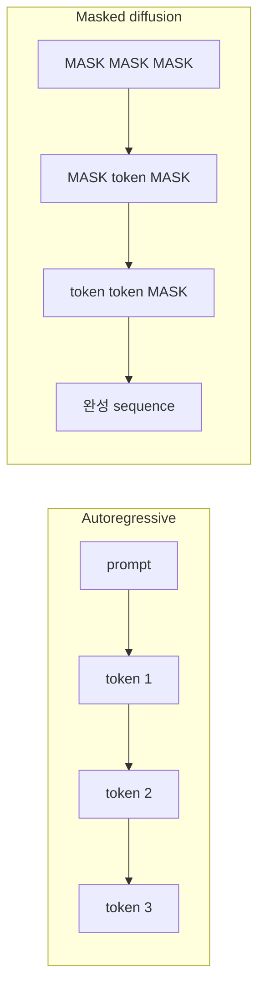
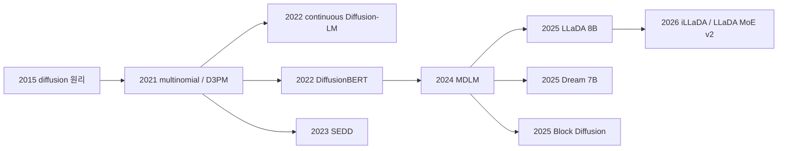
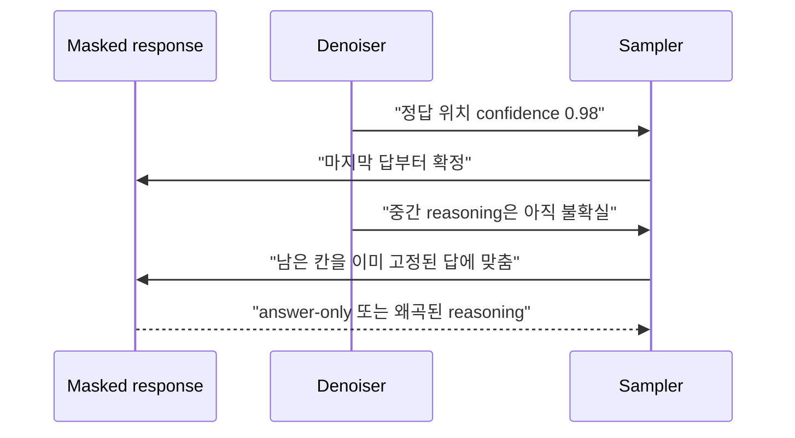

# Diffusion LLM의 계보와 생성 원리

## 수업 개요
Diffusion LLM은 GPT의 decode loop를 조금 빠르게 만든 기법이 아니라, sequence의 확률 분해와 생성 순서를 다시 설계한 LLM 계보다. autoregressive LM이 왼쪽 prefix에서 다음 token 하나를 샘플링하는 반면, diffusion LM은 오염되거나 masking된 sequence를 여러 단계에 걸쳐 복원한다. 한 단계에서 여러 위치를 함께 예측할 수 있고, infilling이나 arbitrary-order generation이 자연스럽지만, 여러 번의 full/block pass와 token dependency 문제가 새로운 비용으로 생긴다 [S3][S6][S9].

이 챕터는 이미지 diffusion의 비유에서 멈추지 않는다. 연속 embedding diffusion, categorical/discrete diffusion, absorbing-mask diffusion, score-based diffusion, block diffusion을 구분하고, LLaDA와 Dream 이후 대규모 diffusion LLM이 무엇을 바꿨는지 살펴본다. 마지막에는 2026년 8월 최신 연구가 드러낸 commitment order와 pretraining-generation mismatch까지 연결한다 [S15][S16].

## 학습 목표
- AR factorization과 diffusion reverse process를 수식과 실행 순서로 비교할 수 있다.
- continuous text diffusion과 discrete/masked diffusion의 차이를 설명할 수 있다.
- D3PM, Diffusion-LM, SEDD, MDLM, LLaDA, Dream, Block Diffusion의 기여를 시간순으로 연결할 수 있다.
- parallel decoding이 실제 latency 개선을 보장하지 않는 이유를 설명할 수 있다.
- arbitrary-order generation, rollback, infilling의 장점과 token dependency 위험을 함께 설명할 수 있다.
- 2026년 최신 논문을 모델 규모, objective, sampler, serving interface 문제로 나눠 읽을 수 있다.

## 수업 전에 생각할 질문
- `[MASK]`를 맞히는 BERT와 masked diffusion LM은 어디서 갈라지는가?
- 한 번에 네 token을 확정하면 왜 항상 네 배 빨라지지 않는가?
- 왼쪽부터 쓰지 않아도 된다는 자유가 수학 문제에서는 왜 실패 원인이 될 수 있는가?

## 강의 스크립트

### Part 1. AR과 diffusion은 무엇을 factorize하는가
**교수자:** autoregressive LM의 생성 계약은 분명합니다. 길이 $n$인 응답의 확률을 왼쪽에서 오른쪽으로 분해합니다.

$$
p_\theta(x_{1:n}\mid c)=\prod_{i=1}^{n}p_\theta(x_i\mid c,x_{<i})
$$

이 식은 causal KV cache, token-level continuous batching, streaming API와 잘 맞습니다. 반면 뒤의 token은 앞 token이 정해져야 샘플링할 수 있습니다 [S1].

**학습자:** diffusion LM은 sequence 전체 확률을 직접 한 번에 내놓습니까?

**교수자:** 한 번에 끝내지는 않습니다. 먼저 clean sequence $x^{(0)}$를 점차 오염시키는 forward process $q$를 정합니다. inference에서는 단순한 prior $x^{(T)}$에서 시작해 학습한 reverse process를 반복합니다.

$$
q(x^{(1:T)}\mid x^{(0)})=\prod_{t=1}^{T}q(x^{(t)}\mid x^{(t-1)}),
\qquad
p_\theta(x^{(0:T)})=p(x^{(T)})\prod_{t=T}^{1}p_\theta(x^{(t-1)}\mid x^{(t)},t,c)
$$

이미지에서는 Gaussian noise가 자연스럽지만 token은 categorical value입니다. 그래서 텍스트 diffusion의 초기 역사는 `어떤 상태 공간에서 무엇을 noise로 볼 것인가`의 역사입니다 [S2][S3][S4].

#### 시각 자료 1. 두 생성 계약

### Part 2. 연속 embedding과 이산 token, 두 갈래의 출발
**학습자:** token에 중간값이 없다면 diffusion을 어떻게 적용했습니까?

**교수자:** 첫 번째 길은 token을 embedding으로 바꾼 뒤 연속 벡터에 Gaussian noise를 더하는 것입니다. Diffusion-LM은 word-vector sequence를 denoise하고, 중간 latent에 gradient guidance를 적용해 syntax나 semantic attribute를 제어했습니다 [S4]. 장점은 연속 diffusion 도구를 활용할 수 있다는 점이고, 난점은 마지막 벡터를 discrete token으로 안정적으로 반올림해야 한다는 점입니다.

두 번째 길은 상태 공간 자체를 discrete하게 두는 것입니다. Multinomial Diffusion은 categorical transition을 사용했고 [S2], D3PM은 uniform replacement, embedding-neighbor transition, absorbing state를 하나의 transition-matrix 틀로 정리했습니다 [S3]. absorbing state가 `[MASK]`라면 forward process는 clean token을 점차 mask로 바꾸고, reverse model은 clean token posterior를 예측합니다.

$$
q(x_i^{(t)}=[MASK]\mid x_i^{(0)})=1-\alpha_t,
\qquad
q(x_i^{(t)}=x_i^{(0)}\mid x_i^{(0)})=\alpha_t
$$

**학습자:** 이 식만 보면 BERT의 random masking과 거의 같습니다.

**교수자:** 단일 training example은 닮을 수 있습니다. 하지만 diffusion LM은 noise level $t$, forward path, reverse likelihood 또는 그에 대응하는 objective, 반복 sampler를 함께 정의합니다. BERT를 한 번 호출해 mask를 채웠다고 diffusion generation이 되는 것은 아닙니다. DiffusionBERT는 바로 그 간극을 absorbing-state diffusion 관점에서 연결했습니다 [S5].

### Part 3. SEDD와 MDLM은 학습 목표를 다시 정리했다
**교수자:** discrete diffusion은 연속 공간의 score $\nabla_x\log p(x)$를 그대로 쓸 수 없습니다. SEDD는 discrete state 사이의 probability ratio를 추정하고 이를 위한 score entropy objective를 제안했습니다 [S6]. 이 계열은 mask 하나에만 의존하지 않는 continuous-time Markov chain diffusion을 가능하게 했습니다.

**학습자:** MDLM은 SEDD보다 더 복잡한 모델입니까?

**교수자:** 오히려 학습식을 단순하게 만든 것이 핵심입니다. absorbing-mask diffusion의 objective를 noise level에 따라 가중된 masked-language-model cross entropy로 정리하고, 현대적인 training recipe와 sampler를 결합했습니다 [S7]. 이 결과는 masked diffusion이 오래전 생각보다 AR perplexity에 가까이 갈 수 있음을 보였습니다.

| 계열 | 상태 | 대표 objective | 주된 강점 | 주된 난점 |
| --- | --- | --- | --- | --- |
| Continuous Diffusion-LM [S4] | word embedding | Gaussian denoising | gradient control | rounding과 embedding geometry |
| D3PM / masked diffusion [S3][S7] | categorical token, `[MASK]` | ELBO + CE 또는 weighted MLM | 단순한 corruption, infilling | 여러 mask의 조건부 의존 |
| SEDD [S6] | discrete CTMC state | score entropy | 일반 discrete transition | score validity와 sampler 복잡도 |
| Block diffusion [S11] | AR block + diffusion block | blockwise likelihood | variable length, cache 친화성 | block size와 양쪽 bias의 절충 |

### Part 4. LLaDA와 Dream은 diffusion을 LLM 규모로 올렸다
**교수자:** 2025년 LLaDA는 8B masked diffusion model을 from scratch로 pretrain하고 SFT까지 연결했습니다 [S8]. 핵심은 diffusion이 작은 text-generation 실험을 넘어 in-context learning과 instruction following을 갖는 대규모 LM이 될 수 있음을 보인 것입니다.

Dream 7B는 다른 길을 택했습니다. AR pretrained model을 초기값으로 사용하고 context-adaptive token-level noise rescheduling을 적용했습니다. arbitrary-order generation, infilling, quality-speed tradeoff를 전면에 내세웠습니다 [S9].

**학습자:** from-scratch diffusion과 AR-to-diffusion 전환 중 어느 쪽이 정답입니까?

**교수자:** 아직 정답이 아닙니다. from-scratch는 objective와 attention을 처음부터 일치시킬 수 있지만 학습비가 큽니다. AR 초기화는 이미 학습된 지식을 활용하지만 causal training에서 bidirectional denoising으로 넘어가는 mismatch를 다뤄야 합니다. Block Diffusion은 block 사이를 AR로 두고 block 안에서 diffusion을 수행해 variable length와 KV cache를 되찾으려는 절충입니다 [S11]. 2026년 연구는 이 설계 공간이 하나의 architecture로 수렴하지 않았음을 보여 줍니다 [S12].

#### 시각 자료 2. Diffusion LLM 계보

### Part 5. Parallel decoding의 이득과 함정
**학습자:** 여러 위치를 같이 예측할 수 있다면 핵심 이득은 network forward 횟수 감소라고 보면 됩니까?

**교수자:** 맞지만 분모를 잊으면 안 됩니다. 단순한 latency 모델은 다음처럼 쓸 수 있습니다.

$$
T_{dLLM}\approx\sum_{t=1}^{T}T_{forward}(L_t,B_t)+T_{select}(t),
\qquad
\text{effective tokens/step}=\frac{\text{새로 확정된 token}}{\text{network evaluation}}
$$

$L_t$는 step에서 처리하는 token 폭, $B_t$는 batch입니다. 한 step에 여러 token을 확정해도 매번 긴 sequence를 양방향 attention으로 다시 읽으면 이득이 줄어듭니다. confidence threshold를 너무 낮추면 서로 의존하는 token을 동시에 잘못 확정합니다. 너무 높이면 한두 token만 확정해 AR과 비슷한 step 수를 씁니다 [S13].

sequence error가 중요한 reasoning에서는 요구 sampling step이 길이에 비례할 수 있다는 이론 결과도 있습니다 [S10]. 따라서 `parallelizable`과 `faster`를 같은 단어로 쓰면 안 됩니다.

### Part 6. 순서 자유도는 장점인 동시에 sampler 책임이다
**교수자:** diffusion LM은 왼쪽부터 확정할 필요가 없습니다. 중간 빈칸 채우기, 답의 양끝 동시 생성, 잘못 확정한 token의 rollback이 가능합니다. 하지만 어느 위치를 먼저 확정할지 모델과 sampler가 결정해야 합니다.

**학습자:** confidence가 가장 높은 위치부터 채우면 자연스럽지 않습니까?

**교수자:** language modeling에는 `지금 높은 confidence`와 `전체 sequence에 좋은 commitment` 사이의 차이가 있습니다. 2026년 `Answer First, Reason Later`는 LLaDA와 Dream의 자유 순서 decoding이 수학 풀이가 채워지기 전에 최종 답 위치를 먼저 확정하고, reasoning을 축약하거나 붕괴시키는 현상을 보고했습니다 [S15]. frontier-gated commitment처럼 확정 가능한 위치 범위를 제한하면 reasoning과 병렬성 사이를 조절할 수 있습니다.

#### 시각 자료 3. Confidence만 보는 sampler의 실패

### Part 7. 2026년 8월, 규모와 interface가 동시에 문제다
**교수자:** iLLaDA는 fully bidirectional masked diffusion을 12T token pretraining까지 확장했습니다 [S12]. LLaDA MoE v2는 30B-A3B 모델을 23.5T token으로 학습하며 MoE diffusion의 compute allocation과 expert scaling을 분석했습니다 [S14]. 다만 다른 AR 모델과의 benchmark는 동일 데이터·동일 compute 통제 실험이 아니므로 architecture 우열로 단정하지 않습니다.

**학습자:** 규모가 해결돼도 prompt를 받아 답하는 interface에는 문제가 남습니까?

**교수자:** 그렇습니다. native dLLM pretraining이 prompt와 continuation을 함께 무작위로 오염시키면, 실제 호출처럼 clean prompt에서 unknown suffix를 생성하는 조건과 어긋납니다. Prefix-Conditioned Diffusion은 clean prefix 쪽과 diffusion suffix 쪽 supervision을 분리해 이 mismatch를 줄였습니다 [S16].

마지막으로 score parameterization도 끝난 문제가 아닙니다. Mean-to-Score는 SEDD의 unconstrained score ratio가 어떤 clean-token posterior에서도 나올 수 없는 값이 될 수 있음을 분석하고, posterior mean에서 score로 가는 유효한 mapping을 제안했습니다 [S17]. 최신 연구가 많다는 사실은 성숙의 증거이면서, 아직 objective와 sampler의 표준형이 정해지지 않았다는 증거이기도 합니다.

## 자주 헷갈리는 포인트
- 모든 diffusion LLM이 `[MASK]`만 쓰는 것은 아니다. uniform-state, categorical CTMC, continuous embedding, deletion-insertion 계열도 있다.
- BERT의 MLM loss를 쓴다는 사실만으로 generative diffusion model이 되지 않는다.
- bidirectional attention은 prompt까지 매 step 동일하게 다시 계산해야 한다는 뜻일 수 있어, AR식 exact KV cache와 충돌한다.
- arbitrary-order generation은 무조건 좋은 planning이 아니다. commitment policy가 reasoning 순서를 망칠 수 있다 [S15].
- 논문의 tokens/s는 sequence length, block size, 품질 허용치, hardware가 다르면 직접 비교할 수 없다.

## 핵심 정리
- diffusion LLM은 clean sequence를 오염시키는 forward process와 이를 되돌리는 learned reverse process로 text distribution을 모델링한다.
- 계보는 continuous embedding과 discrete token 두 갈래에서 출발해 SEDD, MDLM, LLaDA, Dream, block diffusion으로 확장됐다.
- parallel token update, infilling, rollback은 강점이지만 반복 full pass, conditional independence, commitment order가 비용과 품질을 좌우한다.
- 2026년 8월 현재 scaling은 30B-A3B MoE까지 진행됐지만 objective, clean-prefix interface, sampler, cache는 여전히 활발한 연구 대상이다 [S14][S15][S16][S17].

## 복습 체크리스트
- AR factorization과 diffusion reverse process를 각각 식으로 설명할 수 있는가?
- continuous Diffusion-LM, D3PM, SEDD, MDLM의 상태와 objective 차이를 말할 수 있는가?
- LLaDA와 Dream의 pretraining 출발점 차이를 설명할 수 있는가?
- parallel decoding이 느려질 수 있는 두 가지 이유를 말할 수 있는가?
- commitment order가 reasoning 품질을 바꾸는 이유를 설명할 수 있는가?

## 참고 이미지

- [I1] LLaDA 원 저자 프로젝트의 method diagram이다. clean text를 mask로 오염시키는 forward process, masked sequence에서 여러 token을 복원하는 reverse process, prompt를 고정한 conditional generation을 한 그림에서 비교하므로 Part 1, Part 2, Part 4의 연결에 사용한다.

## 출처
| 번호 | 제목 | 발행 주체 | 날짜 | URL | 사용 이유 |
| --- | --- | --- | --- | --- | --- |
| [S1] | Attention Is All You Need | Vaswani et al. | 2017-06-12 | [https://arxiv.org/abs/1706.03762](https://arxiv.org/abs/1706.03762) | causal Transformer와 AR 비교 기준 |
| [S2] | Argmax Flows and Multinomial Diffusion | Hoogeboom et al. | 2021-02-10 | [https://arxiv.org/abs/2102.05379](https://arxiv.org/abs/2102.05379) | categorical diffusion의 초기 계보 |
| [S3] | Structured Denoising Diffusion Models in Discrete State-Spaces | Austin et al. | 2021-07-07 | [https://arxiv.org/abs/2107.03006](https://arxiv.org/abs/2107.03006) | D3PM과 absorbing-mask transition |
| [S4] | Diffusion-LM Improves Controllable Text Generation | Li et al. | 2022-05-27 | [https://arxiv.org/abs/2205.14217](https://arxiv.org/abs/2205.14217) | continuous word-vector diffusion |
| [S5] | DiffusionBERT | He et al. | 2022-11-28 | [https://arxiv.org/abs/2211.15029](https://arxiv.org/abs/2211.15029) | BERT와 absorbing diffusion의 연결 |
| [S6] | Discrete Diffusion Modeling by Estimating the Ratios of the Data Distribution | Lou et al. | 2023-10-25 | [https://arxiv.org/abs/2310.16834](https://arxiv.org/abs/2310.16834) | SEDD와 score entropy |
| [S7] | Simple and Effective Masked Diffusion Language Models | Sahoo et al. | 2024-06-11 | [https://arxiv.org/abs/2406.07524](https://arxiv.org/abs/2406.07524) | MDLM objective와 sampler |
| [S8] | Large Language Diffusion Models | Nie et al. | 2025-02-14 | [https://arxiv.org/abs/2502.09992](https://arxiv.org/abs/2502.09992) | LLaDA 8B pretraining과 SFT |
| [S9] | Dream 7B: Diffusion Large Language Models | Ye et al. | 2025-08-21 | [https://arxiv.org/abs/2508.15487](https://arxiv.org/abs/2508.15487) | AR 초기화와 arbitrary-order generation |
| [S10] | Theoretical Benefit and Limitation of Diffusion Language Model | Feng et al. | 2025-02-13 | [https://arxiv.org/abs/2502.09622](https://arxiv.org/abs/2502.09622) | sequence correctness와 sampling-step 한계 |
| [S11] | Block Diffusion: Interpolating Between Autoregressive and Diffusion Language Models | Arriola et al. | 2025-03-12 | [https://arxiv.org/abs/2503.09573](https://arxiv.org/abs/2503.09573) | AR block과 diffusion block의 결합 |
| [S12] | Improved Large Language Diffusion Models | Nie et al. | 2026-06-24 | [https://arxiv.org/abs/2606.25331](https://arxiv.org/abs/2606.25331) | iLLaDA 12T-token scaling |
| [S13] | Fast-dLLM: Training-free Acceleration of Diffusion LLM | Wu et al. | 2025-05-28 | [https://arxiv.org/abs/2505.22618](https://arxiv.org/abs/2505.22618) | confidence-aware parallel decoding의 dependency 문제 |
| [S14] | LLaDA MoE v2: Scaling Mixture-of-Experts Diffusion Language Models | Zhu et al. | 2026-08-04 | [https://arxiv.org/abs/2608.03457](https://arxiv.org/abs/2608.03457) | 30B-A3B MoE diffusion scaling |
| [S15] | Answer First, Reason Later: Commitment Order in Diffusion LLMs | Yeom et al. | 2026-08-06 | [https://arxiv.org/abs/2608.05687](https://arxiv.org/abs/2608.05687) | arbitrary-order commitment의 reasoning 실패 |
| [S16] | Reducing Pretraining-Generation Mismatch in Diffusion Language Models | Lu et al. | 2026-08-10 | [https://arxiv.org/abs/2608.09424](https://arxiv.org/abs/2608.09424) | clean-prefix prompt continuation mismatch |
| [S17] | Mean-to-Score Discrete Diffusion | Li et al. | 2026-07-23 | [https://arxiv.org/abs/2607.21372](https://arxiv.org/abs/2607.21372) | discrete score의 posterior compatibility |
