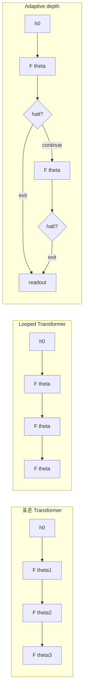
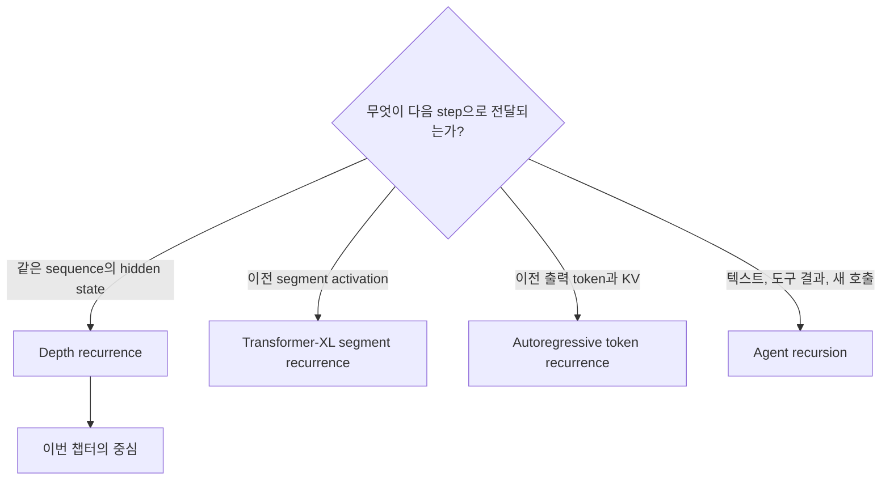
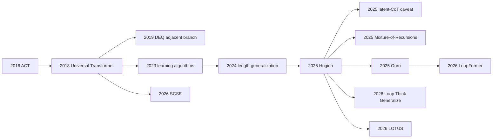

# Looped Transformer와 Recurrent Depth

## 수업 개요
표준 Transformer는 층을 하나 더 쌓을 때마다 새 파라미터를 추가한다. Looped Transformer 또는 recurrent-depth Transformer는 이 결합을 끊는다. 같은 Transformer block이나 작은 layer stack을 깊이 방향으로 여러 번 적용하여, 저장한 파라미터 깊이보다 더 긴 계산 궤적을 만든다. 추론 때 반복 횟수를 늘리면 출력 token을 더 생성하지 않고도 test-time compute를 늘릴 수 있다는 점에서, 이는 단순한 모델 압축을 넘어 새로운 LLM 설계 축이다 [S2][S7].

이 계보는 2016년 Adaptive Computation Time(ACT), 2018년 Universal Transformer에서 시작해 fixed-point를 직접 푸는 Deep Equilibrium Model(DEQ)과 이웃한다. 2023년 looped Transformer가 iterative learning algorithm을 학습하는 구조로 다시 부상했고, length generalization, Huginn, Mixture-of-Recursions, Ouro를 거치며 LLM 규모의 latent computation과 adaptive depth로 확장됐다 [S1][S2][S4][S5][S6][S7][S9][S10]. 2026년에는 LoopFormer, `Loop, Think, & Generalize`, LOTUS, Source-Centered State Evolution(SCSE)이 반복 횟수 외삽, 과잉 반복, latent supervision, 상태 동역학을 각각 더 정교하게 다뤘다 [S11][S12][S13][S14].

다만 `recurrent`라는 이름만 보고 Transformer-XL, recurrent attention, RNN, recursive reasoning agent를 같은 계보로 묶어서는 안 된다. 이 챕터의 중심은 **한 token sequence의 hidden representation에 동일한 깊이 변환을 반복 적용하는 depth recurrence**다. 계보와 원리를 이해한 뒤, 무엇이 실제 latent reasoning의 증거이고 무엇이 저자의 해석인지, adaptive depth가 계산 절감으로 이어지려면 runtime에 어떤 계약이 필요한지까지 구분한다.

## 학습 목표
- parameter depth와 computational depth를 분리해 설명할 수 있다.
- ACT, Universal Transformer, DEQ, 현대 looped LLM의 계보와 차이를 연결할 수 있다.
- depth recurrence를 Transformer-XL의 segment recurrence 및 token-time recurrence와 구분할 수 있다.
- 2023년 learning-algorithm 연구와 length generalization 연구가 반복 구조에 기대하는 inductive bias를 설명할 수 있다.
- Huginn과 Ouro가 LLM 규모에서 recurrent depth를 구현한 방식을 비교할 수 있다.
- hidden state의 반복 갱신과 사람이 읽을 수 있는 latent CoT를 동일시하지 않을 수 있다.
- adaptive depth에서 halting, routing, elastic budget이 각각 해결하는 문제를 설명할 수 있다.
- LoopFormer, `Loop, Think, & Generalize`, LOTUS, SCSE의 주장을 실험 범위 안에서 평가할 수 있다.

## 수업 전에 생각할 질문
- 12개 서로 다른 layer를 한 번 통과하는 모델과 3개 layer를 네 번 반복하는 모델의 "깊이"는 같은가?
- 추론 때 loop를 두 배 늘리면 학습하지 않은 더 어려운 문제를 항상 더 잘 풀까?
- hidden state가 반복해서 바뀐다는 사실만으로 그 안에 자연어 chain-of-thought가 있다고 말할 수 있을까?
- token마다 반복 횟수가 다르면 GPU batch는 어떤 모양이 될까?

## 강의 스크립트

### Part 1. 깊이를 파라미터 수에서 분리한다
**교수자:** 표준 $L$-layer Transformer를 단순화하면 다음처럼 씁니다.

$$
h^{(l+1)}=F_{\theta_l}(h^{(l)}), \qquad l=0,\ldots,L-1
$$

각 층의 파라미터 $\theta_l$가 다릅니다. 반면 looped Transformer는 하나의 block 또는 작은 block 묶음의 파라미터를 공유합니다.

$$
h^{(r+1)}=F_{\theta}(h^{(r)},x,e_r), \qquad r=0,\ldots,R-1
$$

$R$은 recurrent depth, $x$는 원 입력이나 입력에서 만든 anchor, $e_r$은 반복 위치를 알려 주는 선택적 step embedding입니다. 저장 파라미터는 거의 그대로인데 $R$을 늘리면 unrolled computation은 깊어집니다. 그래서 `parameter depth`와 `computational depth`를 따로 적어야 합니다 [S2][S7].

**학습자:** 그렇다면 3개 layer를 네 번 돌리면 12-layer Transformer와 계산량도 표현력도 같습니까?

**교수자:** 계산량의 대략적인 규모는 비슷해질 수 있지만 같은 함수는 아닙니다. 12-layer 모델은 각 위치에 서로 다른 파라미터를 둘 수 있고, looped 모델은 같은 전이 함수가 서로 다른 상태 구간을 모두 처리해야 합니다. parameter sharing은 규제와 알고리즘적 반복이라는 inductive bias를 주지만, 전이 함수 하나가 초기 상태부터 후기 상태까지 감당해야 하는 최적화 부담도 만듭니다 [S5][S14].

**학습자:** 그럼 목적은 작은 모델을 여러 번 실행해 큰 모델 흉내를 내는 것입니까?

**교수자:** 그것은 한 목적일 뿐입니다. 더 중요한 주장은 **문제 난이도에 따라 계산 깊이를 조절하는 축**을 얻는다는 것입니다. 쉬운 입력은 적게, 어려운 입력은 많이 반복할 수 있다면 파라미터 수나 출력 길이를 늘리지 않고 compute를 배분할 수 있습니다. 다만 이 가능성과 실제 wall-clock 절감은 별개의 검증 대상입니다.

#### 시각 자료 1. 세 종류의 깊이

### Part 2. ACT에서 Universal Transformer로
**교수자:** adaptive computation의 직접적인 선행 개념은 Alex Graves의 ACT입니다. ACT는 recurrent model이 입력과 출력을 진행하는 바깥 시간축 사이에서 몇 번의 내부 계산을 할지 학습하게 했습니다. 각 micro-step에서 halting probability를 누적하고, 합이 임계값에 도달하면 멈춥니다. 계산을 오래 쓸수록 ponder cost를 부과해 무한 반복을 막습니다 [S1].

$$
N(x)=\min\left\{n:\sum_{r=1}^{n}p_r\ge 1-\epsilon\right\}
$$

**학습자:** ACT 자체가 Transformer 계열은 아니군요.

**교수자:** 맞습니다. ACT의 유산은 architecture보다 `입력마다 필요한 계산량이 다르다`는 문제 설정입니다. Universal Transformer(UT)는 self-attention과 transition function을 깊이 방향으로 반복하면서 ACT식 dynamic halting을 위치별로 결합했습니다. sequence 위치들은 한 recurrent step 안에서 병렬로 self-attention을 수행하지만, 각 위치가 몇 step 뒤 멈출지는 달라질 수 있습니다 [S2].

**학습자:** "parallel-in-time recurrent model"이라는 설명이 모순처럼 들립니다.

**교수자:** 두 축을 나누면 모순이 아닙니다. 한 step 안에서는 모든 token 위치를 병렬 처리합니다. 그러나 depth step $r$은 $r-1$의 hidden state에 의존하므로 순차적입니다. 즉 token 위치 축의 병렬성과 recurrent-depth 축의 직렬성이 공존합니다.

**학습자:** UT가 오늘날 looped LLM과 완전히 같습니까?

**교수자:** 핵심 모티프는 같지만 구현 계약은 다양합니다. UT는 encoder-decoder와 위치별 halting을 포함한 일반 sequence model로 제안됐습니다. 현대 decoder-only looped LM은 보통 embedding 이후 prelude, 공유 recurrent block, readout용 coda를 두거나, 여러 physical layer를 한 묶음으로 반복합니다 [S7][S10]. 따라서 UT를 출발점으로 보되 모든 후속 모델을 동일한 architecture라고 부르지 않습니다.

### Part 3. DEQ는 인접 계보다
**학습자:** 같은 함수를 계속 적용하면 언젠가 상태가 고정점에 가까워질 텐데, 충분히 반복하면 되는 것 아닙니까?

**교수자:** 그 질문에서 Deep Equilibrium Model이 갈라집니다. DEQ는 weight-tied network를 유한 횟수 unroll하기보다, 다음 고정점을 root finding으로 직접 구합니다 [S4].

$$
h^*=F_\theta(h^*,x), \qquad G(h)=F_\theta(h,x)-h=0
$$

implicit differentiation을 사용하므로 모든 unrolled activation을 저장하지 않고 학습할 수 있다는 것이 핵심입니다. 반복 신경망을 dynamical system으로 읽는 관점을 강화했지만, 현대 looped LLM과 같은 계보로 완전히 합치면 안 됩니다.

**학습자:** 둘 다 shared weights와 반복 상태를 쓰는데 왜 인접 계보라고 합니까?

**교수자:** 종료 계약이 다릅니다. 일반 looped Transformer는 $R$회의 궤적 자체를 계산 budget으로 사용하고 중간 깊이에서 readout할 수 있습니다. DEQ는 수렴한 equilibrium을 모델의 출력 상태로 정의합니다. 실제 solver가 유한 iteration을 쓰더라도 목적은 고정점입니다. 반면 Huginn이나 Ouro에서 loop를 늘린다고 hidden state가 반드시 하나의 고정점으로 수렴해야 하는 것은 아닙니다 [S7][S10].

### Part 4. 무엇과 혼동하면 안 되는가
**교수자:** `recurrent Transformer`라는 표현은 최소 세 축에 쓰입니다.

| 구조 | 반복되는 것 | 이동하는 축 | 주된 목적 |
| --- | --- | --- | --- |
| Looped / recurrent-depth Transformer [S2][S7] | 동일 block 또는 layer stack | 한 sequence의 깊이 $r$ | 유효 깊이, latent computation |
| Transformer-XL [S3] | 이전 segment의 hidden state를 다음 segment가 참조 | sequence segment 시간축 | 고정 context를 넘는 장기 의존성 |
| 일반 autoregressive decoding | 모델 호출과 KV cache | 출력 token 시간축 | 다음 token 생성 |

Transformer-XL은 이전 segment의 activation을 stop-gradient memory로 다음 segment attention에 제공합니다. 이는 같은 입력 표현을 동일 block으로 여러 번 정제하는 depth recurrence가 아닙니다 [S3]. RNN처럼 token마다 state를 전달하는 recurrent attention도 또 다른 축입니다.

**학습자:** chain-of-thought도 이전 출력 token을 다시 context에 넣으니 일종의 loop 아닌가요?

**교수자:** 계산 그래프로 보면 반복이지만 state space와 비용이 다릅니다. explicit CoT는 discrete token을 생성하고 context 길이와 KV cache를 늘립니다. recurrent depth는 보통 한 token을 내기 전 hidden state에서 추가 계산합니다. 외부 도구가 자기 자신을 호출하는 recursive agent도 model architecture의 depth recurrence가 아닙니다.

#### 시각 자료 2. Recurrence 축을 분리하기

### Part 5. 2023-2024년, 반복은 알고리즘의 모양을 준다
**교수자:** 2023년 `Looped Transformers are Better at Learning Learning Algorithms`는 in-context regression 같은 data-fitting 문제를 봤습니다. 전통적인 최적화 알고리즘은 같은 update rule을 여러 번 적용합니다. 저자들은 Transformer block을 loop로 재사용하면 이런 반복 구조를 architecture에 반영할 수 있고, 실험한 문제에서 표준 Transformer와 비슷한 성능을 10% 미만의 parameter count로 얻었다고 보고했습니다 [S5].

**학습자:** 그러면 looped Transformer가 gradient descent를 내부에서 그대로 실행했다고 결론 내려도 됩니까?

**교수자:** 그렇게 넓히면 안 됩니다. 논문의 training setup과 probe가 지지하는 범위에서 iterative learning algorithm을 더 잘 학습했다고 말해야 합니다. 특정 benchmark 결과가 자연어 추론 전체의 알고리즘 실행 증거는 아닙니다. 중요한 점은 weight tying이 단순 압축이 아니라 `같은 연산을 반복한다`는 task structure와 맞을 수 있다는 것입니다.

2024년 length generalization 연구는 이 생각을 입력 길이 외삽으로 확장했습니다. 훈련보다 긴 입력은 더 많은 알고리즘 step을 요구할 수 있습니다. 연구진은 유한 크기 Transformer로 표현 가능한 반복 연산인 RASP-L operation을 여러 번 적용하는 문제를 구성하고, 입력 길이에 맞춰 loop 횟수를 늘리는 모델이 여러 algorithmic task에서 length generalization을 개선한다고 보고했습니다 [S6].

**학습자:** 길이가 두 배면 loop도 두 배로 늘리면 되는 공식이 생긴 것입니까?

**교수자:** 아닙니다. 알려진 iterative solution과 통제된 task에서 얻은 결과입니다. 자연어 문제는 필요한 iteration 수를 정답에서 바로 알 수 없고, 훈련 범위를 넘긴 recurrence에서 상태가 drift할 수 있습니다. 이 간극이 이후 adaptive depth와 trajectory consistency 연구의 핵심이 됩니다.

### Part 6. Huginn, 출력 token 대신 깊이를 늘리다
**교수자:** Huginn으로 알려진 2025년 recurrent-depth 연구는 이 구조를 3.5B parameter, 800B training token 규모로 올렸습니다. architecture는 입력과 출력을 담당하는 비공유 구간 사이에 recurrent block을 두고, 추론 시 recurrent block을 더 많이 반복해 test-time compute를 늘립니다. 논문은 일부 reasoning benchmark에서 반복 증가에 따른 향상을 보고했고, 최대 계산량을 훨씬 큰 dense model의 연산량에 대응시켜 분석했습니다 [S7].

**학습자:** 출력 token 없이 계산을 늘리니 CoT보다 항상 효율적입니까?

**교수자:** `항상`이라는 말은 근거가 없습니다. explicit CoT는 중간 결과를 token으로 남겨 다음 step에서 읽고 사람이 검사할 수 있습니다. recurrent-depth computation은 context를 늘리지 않지만 loop마다 shared block을 다시 실행하며, 내부 상태를 직접 해석하기 어렵습니다. 같은 FLOPs라도 kernel shape, memory traffic, batch utilization이 다릅니다.

**학습자:** 논문 제목의 latent reasoning은 hidden state 안에 압축된 문장이 돌아간다는 뜻입니까?

**교수자:** 운영적으로는 `최종 출력 전에 hidden state를 반복 갱신해 문제 해결 계산을 한다`는 뜻으로 받아들이는 편이 안전합니다. 2025년 `Latent Chain-of-Thought?`는 Huginn-3.5B를 Logit Lens와 Coda Lens 등으로 조사했지만, 사람이 읽을 수 있는 단계별 latent CoT의 증거가 제한적이고 probe 결과가 layer와 decoding 방식에 민감하다고 보고했습니다. 이 실험에서는 recurrence를 늘린 이득도 explicit reasoning 모델과의 격차를 닫지 못했습니다 [S8].

**학습자:** 그렇다면 latent reasoning이라는 표현도 쓰면 안 됩니까?

**교수자:** 약한 의미로는 쓸 수 있습니다. hidden state에서 반복 계산이 일어난다는 사실과, 그 계산이 자연어 CoT와 동형이라는 주장을 분리하면 됩니다. `latent computation`은 architecture 사실에 가깝고, `interpretable latent CoT`는 별도 증거가 필요한 가설입니다.

### Part 7. Adaptive depth는 어디에서 결정하는가
**교수자:** fixed depth는 모든 token과 요청에 같은 $R$을 씁니다. adaptive depth는 세 가지 질문을 만듭니다.

1. 결정 단위가 sequence인가, token인가?
2. 종료 신호는 확률 gate인가, router인가, 외부 compute budget인가?
3. 먼저 끝난 token의 attention과 KV state를 이후 loop에서 어떻게 다룰 것인가?

Mixture-of-Recursions(MoR)는 공유 layer stack을 반복하면서 lightweight router가 token별 recursive depth를 선택합니다. 이후 recurrence에서는 active token을 중심으로 attention을 계산하고 선택적으로 KV를 cache하며, 첫 recurrence의 KV를 공유하는 변형도 제안했습니다. 저자들은 135M부터 1.7B 규모의 실험에서 parameter, training FLOPs, perplexity, throughput의 Pareto 개선을 보고했습니다 [S9].

**학습자:** 쉬운 token을 빼면 무조건 계산이 줄지 않습니까?

**교수자:** 이론적 FLOPs와 장치 utilization은 다릅니다. token마다 active set이 달라지면 dense batch가 ragged해지고, routing과 gather/scatter 비용이 생깁니다. 종료한 token이 key/value로 계속 보이는지, query 계산만 중단하는지도 모델 정의에 따라 다릅니다. 따라서 adaptive depth의 모델 논문 결과를 serving throughput 보장으로 바꿔 말해서는 안 됩니다.

Ouro는 이 방향을 1.4B와 2.6B open model family로 확장했습니다. 논문은 7.7T token pretraining, latent-space iterative computation, entropy-regularized learned depth allocation을 핵심으로 제시합니다. 저자들은 여러 benchmark에서 더 큰 비교 모델과 경쟁하는 결과를 보고했지만, 이는 모든 데이터와 parameterization을 통제한 architecture-only 비교로 읽어서는 안 됩니다 [S10].

**학습자:** entropy regularization은 왜 필요합니까?

**교수자:** depth gate가 한 깊이에만 몰리면 adaptive allocation이 퇴화하기 쉽습니다. 종료 분포에 entropy 항을 둬 여러 깊이를 사용하도록 유도하는 것이 Ouro의 학습 설계입니다. 그러나 실제 배포에서 gate를 그대로 실행할지, 정해진 loop count로 고정할지는 runtime 지원과 latency 목표에 달려 있습니다. 이 serving 문제는 뒤의 전용 챕터에서 다룹니다.

### Part 8. LoopFormer와 `Loop, Think, & Generalize`: 더 돌리면 왜 망가지는가
**교수자:** train에서 네 번 반복한 모델을 inference에서 여덟 번 돌린다고 합시다. $F_\theta$는 네 번째 이후의 상태 분포를 충분히 보지 못했을 수 있습니다. 추가 loop가 refinement가 아니라 drift가 되는 이유입니다.

LoopFormer는 여러 길이의 trajectory를 학습하고, 짧은 trajectory가 유용한 표현을 내면서 긴 trajectory가 계속 정제하도록 shortcut-consistency를 둡니다. 각 loop는 현재 time과 step size를 조건으로 받아 서로 다른 compute budget에서도 동작하도록 설계됩니다 [S11]. `elastic depth`는 한 종료 gate를 배우는 것과 다릅니다. 사용자가 준 budget 자체가 trajectory 조건이 됩니다.

**학습자:** budget을 늘릴수록 품질이 단조롭게 좋아지는 것이 목표군요.

**교수자:** 목표에 가깝지만, 모든 입력에서 단조 개선이 보장된다고 쓰면 안 됩니다. `Loop, Think, & Generalize`는 통제된 compositional reasoning에서 recurrent depth가 systematic generalization과 depth extrapolation에 주는 영향을 연구했습니다. 훈련보다 깊은 composition에서 inference recurrence를 늘려 일반화가 가능해지는 결과와 함께, 너무 많이 반복하면 예측이 나빠지는 `overthinking`도 확인했습니다 [S12].

$$
R^*(x)=\arg\min_R \;\mathcal{L}(g(h^{(R)}),y)
$$

최적 깊이 $R^*(x)$는 입력마다 다를 수 있고, 실제 inference에서는 정답 $y$를 모르므로 직접 계산할 수 없습니다. halting policy는 이 숨은 최적 깊이를 proxy signal로 추정하는 문제입니다.

**학습자:** hidden state 변화량이 작아지면 멈추면 되지 않습니까?

**교수자:** 변화량이 작은 상태가 정답 상태라는 보장은 없습니다. 잘못된 attractor에서 정체될 수도 있고, 올바른 계산이 큰 상태 변화를 요구할 수도 있습니다. 종료 기준은 confidence, learned gate, state convergence, budget을 각각 검증해야 합니다.

### Part 9. LOTUS: latent CoT 주장을 supervision으로 시험하다
**교수자:** LOTUS는 latent reasoning의 해석 가능성 문제를 다른 방식으로 다룹니다. $K$개의 latent block을 병렬로 놓고 $R$회 반복한 뒤, 각 latent 위치에 gold CoT step token을 cross-entropy로 감독합니다. 저자들은 3B 규모에서 explicit CoT와의 성능 격차를 좁히고 thought-phase latency를 2.5배에서 6.9배 줄였다고 보고했습니다. LM head로 post-loop latent를 투영했을 때 gold reasoning step과 대안적 중간 step이 나타났다는 분석도 제시합니다 [S13].

**학습자:** 이것으로 Huginn에도 latent CoT가 있었다고 역으로 결론 내릴 수 있습니까?

**교수자:** 아닙니다. LOTUS의 latent는 gold CoT token에 직접 병렬 supervision을 받습니다. 자연스럽게 발생한 unsupervised latent trace의 증거와는 성격이 다릅니다. 오히려 두 논문을 함께 읽으면 정확한 경계가 보입니다. Huginn probe 연구는 `반복만으로 읽을 수 있는 CoT가 자동 발생한다`는 강한 해석을 경계하게 하고 [S8], LOTUS는 `명시적 정렬 신호를 주면 latent 위치를 CoT-aligned하게 만들 수 있다`는 가능성을 보여 줍니다 [S13].

**학습자:** thought latency가 줄었다는 결과도 전체 응답 latency 감소와 같지는 않겠군요.

**교수자:** 그렇습니다. 논문이 비교한 thought phase, 문제 표현, batch, hardware 조건을 유지해 읽어야 합니다. 최종 답 token 생성, scheduler overhead, recurrent block의 실제 kernel efficiency까지 포함한 end-to-end serving 결과는 별도 측정이 필요합니다.

### Part 10. SCSE와 2026년 8월의 상태 동역학
**교수자:** looped Transformer의 공유 block은 반복마다 다른 hidden-state 분포를 만납니다. additive input injection 구조에서는 원 입력에서 만든 신호를 매 step 다시 넣기도 합니다. 이때 기준 상태에서조차 shared transition이 계속 상태를 밀어내면, 반복 외삽이 불안정해질 수 있습니다.

SCSE(Source-Centered State Evolution)는 learned anchor $a(x)$와 그 anchor로부터의 deviation $\delta^{(r)}$를 나눕니다.

$$
h^{(r)}=a(x)+\delta^{(r)}, \qquad
\delta^{(r+1)}=U_\theta(\delta^{(r)},a(x),r)
$$

설계상 zero deviation을 zero로 보내 anchor가 one-step fixed point가 되게 하면서, nonzero deviation에는 state-dependent update를 허용합니다. 저자들은 WikiText-2/103, web-corpus pretraining과 transfer, LAMBADA에서 통제된 recurrent quality frontier 개선을 보고했습니다 [S14]. 이는 모든 looped LLM이 고정점으로 수렴해야 한다는 주장이 아니라, input conditioning과 reference-preserving recurrence를 양립시키는 한 architecture 제안입니다.

**학습자:** DEQ와 다시 가까워진 것처럼 보입니다.

**교수자:** 좋은 관찰입니다. 둘 다 상태 전이를 dynamical system과 fixed point 언어로 읽습니다. 하지만 DEQ는 equilibrium solve 자체가 모델 계산의 중심이고 [S4], SCSE는 유한한 recurrent trajectory가 anchor에서 불필요하게 밀려나지 않도록 전이 구조를 제약합니다 [S14]. 같은 수학 언어를 공유한다고 같은 모델은 아닙니다.

#### 시각 자료 3. 2016-2026 계보

**학습자:** 2026년 8월 12일 기준으로 이 계보의 가장 방어적인 결론은 무엇입니까?

**교수자:** 네 문장으로 정리할 수 있습니다.

첫째, recurrent depth는 파라미터를 추가하지 않고 유효 계산 깊이를 늘리는 독립적인 scaling axis입니다. 둘째, iterative algorithm과 compositional task에서는 반복 구조가 유용한 inductive bias가 될 수 있지만 자연어 추론 전체로 자동 일반화되지는 않습니다. 셋째, latent computation은 관찰되지만 해석 가능한 latent CoT는 supervision과 probe에 따라 별도로 입증해야 합니다. 넷째, adaptive depth가 실제 효율이 되려면 모델의 halting 신호뿐 아니라 ragged batching, KV semantics, kernel utilization을 처리하는 runtime이 필요합니다.

## 자주 헷갈리는 포인트
- `looped Transformer`, `recurrent-depth Transformer`, `recursive Transformer`는 논문마다 범위가 다르다. 이 챕터에서는 shared block을 깊이 방향으로 반복하는 계열을 중심으로 쓴다.
- parameter sharing은 FLOPs 절감과 동의어가 아니다. 같은 block을 네 번 실행하면 weight memory는 줄어도 네 번의 계산은 남는다.
- Transformer-XL의 recurrence는 이전 segment memory를 전달하는 sequence 축의 recurrence이며 recurrent depth가 아니다 [S3].
- 반복 횟수를 inference에서 늘릴 수 있다는 사실은 품질이 단조롭게 좋아진다는 보장이 아니다. train-test depth mismatch와 overthinking이 있다 [S11][S12].
- hidden state가 변한다는 사실은 자연어 CoT가 그 안에 선형적으로 읽힌다는 증거가 아니다 [S8].
- LOTUS의 해석 가능한 latent는 gold CoT 위치 supervision을 받았다. 순수하게 emergent한 latent CoT와 동일한 증거가 아니다 [S13].
- ACT, token router, elastic budget은 모두 adaptive computation이지만 종료 단위와 학습 신호가 다르다 [S1][S9][S11].
- DEQ와 SCSE는 fixed-point 언어를 공유하지만, 하나는 equilibrium solve이고 다른 하나는 유한 recurrent trajectory를 위한 전이 설계다 [S4][S14].

## 사례로 다시 보기
한 reasoning request에 fixed-depth model, Ouro식 learned depth, MoR식 token-level routing을 적용한다고 하자.

fixed-depth model은 batch의 모든 token에 $R=4$를 적용한다. latency 예측은 쉽지만 쉬운 token에도 같은 계산을 쓴다. Ouro식 sequence 또는 model-defined depth allocation은 요청 난이도에 따라 종료 분포를 바꿀 수 있지만, 서로 다른 요청이 다른 시점에 끝나면 batch slot 관리가 필요하다 [S10]. MoR식 token-level routing은 한 sequence 안에서도 active token set이 달라져 이론적 FLOPs를 더 줄일 수 있지만, attention mask, KV cache, gather/scatter가 복잡해진다 [S9].

따라서 모델 평가표에는 parameter count와 benchmark accuracy만 적어서는 부족하다. 최소한 physical layer 수, maximum/mean recurrent depth, token별 또는 sequence별 종료 단위, recurrent KV 보존 방식, batch에서 실현된 active-token ratio, end-to-end latency를 함께 기록해야 한다. 이 항목은 위 논문들에서 공통 benchmark로 확립된 표준이 아니라, serving 관점에서 서로 다른 계산 계약을 비교하기 위한 분석 틀이다.

## 대안과 비교
| 접근 | test-time compute를 늘리는 방법 | 중간 상태 | 장점 | 경계 |
| --- | --- | --- | --- | --- |
| 더 깊은 dense Transformer | 서로 다른 layer 추가 | hidden state | 높은 parameter capacity | parameter와 memory 증가 |
| Explicit CoT | 출력 token 추가 | 읽을 수 있는 text | 검사와 supervision이 쉬움 | decode latency와 context 증가 |
| Looped Transformer | shared block 반복 | continuous hidden state | parameter와 compute depth 분리 | 직렬 loop와 state drift |
| Adaptive-depth loop | 입력/token별 반복 선택 | hidden state + gate/router | compute allocation 가능 | ragged execution과 종료 오류 |
| DEQ [S4] | equilibrium solver iteration | fixed-point state | effective depth와 activation memory 분리 | solver 수렴과 looped LM과 다른 readout 계약 |

## 핵심 정리
- Looped Transformer는 같은 block을 깊이 방향으로 반복해 parameter depth와 computational depth를 분리한다.
- ACT와 Universal Transformer가 adaptive recurrent computation의 문제와 기본 구조를 만들었고, DEQ는 이를 equilibrium 관점으로 확장한 인접 분기다.
- 2023-2024년 연구는 iterative learning algorithm과 length generalization에서 반복 구조의 inductive bias를 보였다.
- Huginn과 Ouro는 recurrent depth를 billion-parameter pretraining과 test-time compute 축으로 확장했으며, MoR는 token-level adaptive recursion을 제안했다.
- latent computation과 interpretable latent CoT는 다르다. Huginn 분석은 강한 CoT 해석을 경계하게 하고, LOTUS는 직접 supervision된 latent alignment의 가능성을 보인다.
- LoopFormer와 `Loop, Think, & Generalize`는 추가 loop가 항상 이득이 아니며 trajectory consistency와 overthinking이 핵심 문제임을 보여 준다.
- SCSE는 anchor와 deviation을 분리해 반복 상태 동역학을 구조적으로 안정화하려는 2026년 7월의 최신 제안이다.
- 2026년 8월 12일 현재 recurrent depth는 새로운 LLM scaling axis로 볼 근거가 있지만, production efficiency는 runtime과 함께 측정해야 한다.

## 복습 체크리스트
- physical layer 수와 recurrent depth를 분리해 모델 계산량을 설명할 수 있는가?
- ACT와 Universal Transformer의 halting 단위와 계보 관계를 설명할 수 있는가?
- DEQ가 일반 looped Transformer와 다른 종료 계약을 말할 수 있는가?
- Transformer-XL, AR decode loop, depth recurrence를 각각 어느 축의 반복인지 구분할 수 있는가?
- 2023년 learning-algorithm 논문과 length-generalization 논문의 실험 범위를 과장 없이 설명할 수 있는가?
- Huginn의 latent computation과 latent-CoT probe의 반례를 함께 설명할 수 있는가?
- MoR, Ouro, LoopFormer의 adaptive computation 방식 차이를 말할 수 있는가?
- LOTUS의 latent가 왜 unsupervised emergent CoT의 증거는 아닌지 설명할 수 있는가?
- overthinking과 SCSE의 zero-deviation anchor가 서로 다른 문제를 다룬다는 점을 설명할 수 있는가?

## 참고 이미지

- [I1] Ouro 원 저자 프로젝트의 overview다. 왼쪽의 공유 layer stack과 exit gate는 Part 1과 Part 7의 recurrent-depth 구조를 직접 보여 준다. 오른쪽 benchmark radar는 서로 다른 모델의 공개 결과를 요약한 저자 자료이므로 architecture-only 통제 비교로 읽지 않고, 본문에서 그 한계를 함께 설명한다 [S10].

## 출처
| 번호 | 제목 | 발행 주체 | 날짜 | URL | 사용 이유 |
| --- | --- | --- | --- | --- | --- |
| [S1] | Adaptive Computation Time for Recurrent Neural Networks | Graves | 2016-03-29 | [https://arxiv.org/abs/1603.08983](https://arxiv.org/abs/1603.08983) | 입력별 내부 계산 횟수와 differentiable halting의 출발점 |
| [S2] | Universal Transformers | Dehghani et al. | 2018-07-10 | [https://arxiv.org/abs/1807.03819](https://arxiv.org/abs/1807.03819) | self-attention의 depth recurrence와 위치별 dynamic halting |
| [S3] | Transformer-XL: Attentive Language Models Beyond a Fixed-Length Context | Dai et al. | 2019-01-09 | [https://arxiv.org/abs/1901.02860](https://arxiv.org/abs/1901.02860) | segment recurrence와 depth recurrence의 경계 |
| [S4] | Deep Equilibrium Models | Bai et al. | 2019-09-03 | [https://arxiv.org/abs/1909.01377](https://arxiv.org/abs/1909.01377) | weight-tied infinite depth와 fixed-point 해석의 인접 계보 |
| [S5] | Looped Transformers are Better at Learning Learning Algorithms | Yang et al. | 2023-11-21 | [https://arxiv.org/abs/2311.12424](https://arxiv.org/abs/2311.12424) | looped architecture와 iterative in-context learning algorithm |
| [S6] | Looped Transformers for Length Generalization | Fan et al. | 2024-09-24 | [https://arxiv.org/abs/2409.15647](https://arxiv.org/abs/2409.15647) | 입력 길이에 따른 반복 횟수 확장과 algorithmic generalization |
| [S7] | Scaling up Test-Time Compute with Latent Reasoning: A Recurrent Depth Approach | Geiping et al. | 2025-02-07 | [https://arxiv.org/abs/2502.05171](https://arxiv.org/abs/2502.05171) | Huginn, 3.5B recurrent-depth LM과 test-time compute scaling |
| [S8] | Latent Chain-of-Thought? Decoding the Depth-Recurrent Transformer | Lu et al. | 2025-07-02 | [https://arxiv.org/abs/2507.02199](https://arxiv.org/abs/2507.02199) | Huginn의 interpretable latent-CoT 주장에 대한 probe와 제한 |
| [S9] | Mixture-of-Recursions: Learning Dynamic Recursive Depths for Adaptive Token-Level Computation | Bae et al. | 2025-07-14 | [https://arxiv.org/abs/2507.10524](https://arxiv.org/abs/2507.10524) | token-level depth routing, active-token attention, KV variants |
| [S10] | Scaling Latent Reasoning via Looped Language Models | Zhu et al. | 2025-10-29 | [https://arxiv.org/abs/2510.25741](https://arxiv.org/abs/2510.25741) | Ouro의 대규모 pretraining과 entropy-regularized depth allocation |
| [S11] | LoopFormer: Elastic-Depth Looped Transformers for Latent Reasoning via Shortcut Modulation | Jeddi et al. | 2026-02-11 | [https://arxiv.org/abs/2602.11451](https://arxiv.org/abs/2602.11451) | variable-budget trajectory와 shortcut consistency |
| [S12] | Loop, Think, & Generalize: Implicit Reasoning in Recurrent-Depth Transformers | Kohli et al. | 2026-04-09 | [https://arxiv.org/abs/2604.07822](https://arxiv.org/abs/2604.07822) | compositional generalization, depth extrapolation, overthinking |
| [S13] | Bridging the Gap Between Latent and Explicit Reasoning with Looped Transformers | Fan et al. | 2026-06-30 | [https://arxiv.org/abs/2606.31779](https://arxiv.org/abs/2606.31779) | LOTUS의 병렬 latent supervision과 explicit-CoT 비교 |
| [S14] | Looped Transformers with Source-Centered State Evolution | Kim et al. | 2026-07-30 | [https://arxiv.org/abs/2607.27656](https://arxiv.org/abs/2607.27656) | anchor-preserving recurrence와 반복 상태 동역학 |
