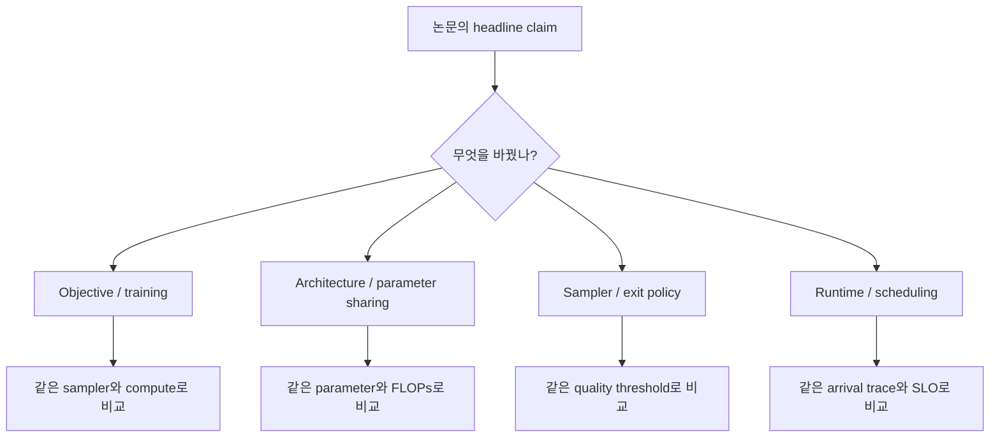
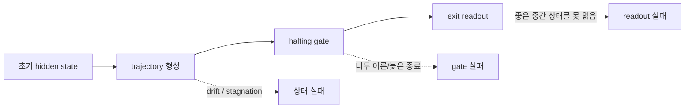
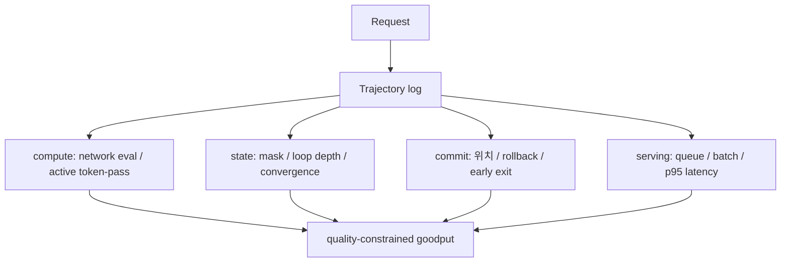

# 2026 Frontier와 평가 방법

## 수업 개요
이 챕터는 2026년 8월 12일 기준 최신 논문을 많이 나열하는 데 목적이 없다. diffusion LLM과 recurrent-depth LM이 실제로 해결해야 할 문제가 `모델이 되느냐`에서 `반복 계산을 어디에 배분하고, 언제 중단하고, 무엇을 확정할 것이냐`로 어떻게 이동했는지를 읽는다. diffusion 쪽은 mask 밖의 noise process, few-step consistency, commitment order, cache, clean-prefix 학습이 분리됐고 [S1][S2][S3][S4][S5], loop 쪽은 elastic depth, latent supervision, halting trajectory, fixed point, overthinking, depth batching이 분리됐다 [S6][S7][S8][S9][S10][S11].

두 계열 모두 benchmark headline만 보면 실제 가치를 오판하기 쉽다. 같은 tokens/s라도 하나는 품질을 낮춘 aggressive parallel decoding일 수 있고, 다른 하나는 쉬운 token만 조기 종료한 평균일 수 있다. 따라서 품질, 지연, 계산량, state update, serving load를 함께 고정한 평가 틀이 필요하다.

## 학습 목표
- 2026년 연구를 objective, sampler, architecture, runtime 문제로 분류할 수 있다.
- diffusion LLM의 perplexity와 sequence correctness가 다른 결론을 줄 수 있음을 설명할 수 있다.
- recurrent-depth 모델에서 fixed depth와 adaptive depth benchmark를 구분할 수 있다.
- 저자 보고 speedup을 production 성능으로 확대 해석하지 않는 비교표를 설계할 수 있다.
- 두 계열을 AR baseline과 비교할 때 고정해야 할 조건을 제시할 수 있다.
- 향후 연구 질문을 model quality와 serving SLO 양쪽에서 도출할 수 있다.

## 수업 전에 생각할 질문
- 8배 많은 tokens/s를 내지만 정확도가 2점 낮은 sampler와 baseline을 같은 모델이라고 비교해도 되는가?
- 평균 loop 수가 줄어도 dynamic batch가 깨져 GPU utilization이 떨어지면 adaptive depth는 성공인가?
- perplexity가 더 좋은 diffusion family가 실제 sampler에서도 더 좋은가?

## 강의 스크립트

### Part 1. 최신 연구를 네 층으로 나누자
**교수자:** 2026년 논문 제목은 모두 `더 빠른`, `더 깊은`, `더 유연한`이라는 말을 씁니다. 하지만 해결하는 층이 다릅니다.

| 층 | Diffusion LLM의 질문 | Recurrent-depth LM의 질문 |
| --- | --- | --- |
| Objective | 어떤 corruption과 posterior parameterization을 학습할까? [S1][S5] | 여러 depth에서 어떤 loss로 trajectory를 만들까? [S6][S7] |
| Architecture | mask, uniform state, deletion-insertion, recursive denoiser 중 무엇을 쓸까? [S1][S12] | 어떤 block을 공유하고 residual drift를 어떻게 제어할까? [S9] |
| Sampler / Exit | 어느 위치를 언제 commit하고 언제 끝낼까? [S2][S3] | token마다 몇 loop를 쓰고 어떤 readout으로 끝낼까? [S8][S10] |
| Runtime | rollback과 cache, prefill/decode interference를 어떻게 다룰까? [S4][S13] | 서로 다른 depth의 token을 어떻게 batch할까? [S11] |

**학습자:** 같은 모델 논문이라도 sampler 개선과 objective 개선을 직접 비교하면 안 되겠군요.

**교수자:** 맞습니다. training-free cache가 baseline보다 빨라졌다는 결과는 architecture가 우수하다는 증거가 아닙니다. 반대로 likelihood가 좋아졌다는 결과는 online serving이 빨라졌다는 증거가 아닙니다.

#### 시각 자료 1. 연구 주장의 층을 먼저 고정한다

### Part 2. Diffusion frontier는 mask 하나로 설명되지 않는다
**교수자:** `Scaling Beyond Masked Diffusion Language Models`는 masked diffusion, uniform-state diffusion, interpolating diffusion을 같은 scaling 관점에서 비교했습니다. 중요한 결론은 validation perplexity가 diffusion family 내부 비교에는 유용해도 family 사이의 실제 sampling Pareto를 대표하지 못할 수 있다는 점입니다 [S1].

**학습자:** likelihood가 더 나쁜 모델이 reasoning이나 sampling에서는 더 좋을 수 있다는 뜻입니까?

**교수자:** 해당 실험에서는 그런 결과가 나왔습니다. 이 때문에 benchmark는 최소 두 축을 가져야 합니다. 모델 분포에 가까운지를 보는 likelihood 계열과, 제한된 network evaluation에서 실제 생성이 얼마나 유용한지를 보는 sampling 계열입니다.

2026년에는 `[MASK]` 자체의 비용도 문제 삼았습니다. deletion-insertion process는 길이가 긴 mask/padding canvas를 항상 계산하는 대신 token 삭제와 삽입을 transition으로 모델링합니다 [S12]. consistency 계열은 긴 teacher trajectory 없이도 적은 step에서 일관된 posterior path를 학습하려 합니다 [S14]. 이들은 아직 범용 표준이 아니라 `few-step 생성과 variable length를 어떻게 얻을까`에 대한 서로 다른 답입니다.

### Part 3. 자유로운 순서에서 commit은 별도 알고리즘이다
**학습자:** confidence가 높은 token부터 확정하는 것이 sampler의 전부가 아닌 이유를 다시 평가 관점에서 설명해 주세요.

**교수자:** token별 confidence는 local signal입니다. reasoning sequence의 correctness는 token 사이의 global dependency를 요구합니다. `Answer First, Reason Later`는 최종 답 위치가 reasoning보다 먼저 확정되는 collapse를 측정했고, ordered commitment가 CoT의 이득과 상호작용함을 보였습니다 [S2]. LATCH는 `어느 위치를 commit할지`와 `언제 전체 generation을 끝낼지`를 분리해 early exit를 설계했습니다 [S3].

따라서 sampler 평가에는 다음 로그가 필요합니다.

- step별 commit 위치와 commit 순서
- step별 새 token 수와 rollback token 수
- reasoning region이 완성되기 전 answer region이 고정된 비율
- 최종 정확도뿐 아니라 trajectory 중간의 sequence consistency
- quality target에 도달한 최초 step과 실제 종료 step의 차이

**학습자:** 최종 문자열만 저장하면 sampler 실패를 거의 볼 수 없겠네요.

**교수자:** 바로 그렇습니다. iterative model은 trajectory가 제품 동작의 일부입니다.

### Part 4. Looped frontier는 더 오래 생각하기와 overthinking 사이에 있다
**교수자:** LoopFormer는 다른 길이의 recurrent trajectory를 shortcut consistency로 맞춰 inference budget이 달라도 의미 있는 state를 만들도록 했습니다 [S6]. LOTUS는 여러 latent block을 병렬로 두고 gold CoT step token으로 직접 감독해 latent reasoning과 explicit reasoning의 간격을 줄였습니다 [S7]. 둘 다 더 많은 loop를 사용할 수 있게 만들지만 supervision의 성격은 다릅니다.

**학습자:** loop를 늘릴수록 품질이 좋아지는 곡선을 기대하면 됩니까?

**교수자:** 아닙니다. `Loop, Think, & Generalize`는 recurrence가 compositional depth generalization을 늘리는 구간과, 지나친 반복이 성능을 다시 떨어뜨리는 overthinking 구간을 함께 보고했습니다 [S10]. SCSE는 반복 전이가 기준점에서도 계속 state를 밀어내는 drift를 fixed-point 관점에서 다뤘습니다 [S9]. 반복 횟수는 단조로운 quality knob가 아닙니다.

$$
R^*(x)=\arg\min_R \left[\mathcal{L}(x,R)+\lambda C(R)+\mu\,\mathrm{SLOPenalty}(R)\right]
$$

$R^*(x)$는 입력마다 다를 수 있습니다. loss만 줄이면 긴 loop가 유리할 수 있지만 compute cost와 latency SLO를 넣으면 최적 depth가 달라집니다.

#### 시각 자료 2. Adaptive depth의 세 실패 지점

Adaptive Depth 연구는 gate와 trajectory를 같은 loss로 함께 학습하면 실패 원인을 분리하기 어렵다고 지적했습니다. frozen trajectory에 post-hoc readout을 붙이는 진단이 필요한 이유입니다 [S8].

### Part 5. 평균 compute 절감과 serving speedup은 다르다
**학습자:** 쉬운 token을 빨리 종료하면 평균 FLOPs가 줄어듭니다. 그런데 왜 serving에서는 별도 논문이 필요합니까?

**교수자:** 같은 batch 안의 token마다 loop 수가 달라지면 하나의 dense forward pass를 유지할 수 없습니다. 일반 token-level continuous batching은 token 생성 경계에서 request를 넣고 빼지만, depth-adaptive model은 한 token의 forward pass 내부 loop에서도 token을 빼야 합니다. Continuous Depth Batching은 boundary stage와 loop stage를 별도 queue로 나누고 loop iteration 단위로 schedule합니다 [S11].

이 관계를 단순화하면 다음과 같습니다.

$$
\mathrm{RealizedGain}
=\mathrm{TheoreticalComputeGain}
\times \mathrm{BatchingEfficiency}
\times \mathrm{SchedulerUtilization}
$$

평균 loop 수가 절반이어도 batch가 잘게 찢어져 utilization이 절반으로 떨어지면 실제 throughput 이득은 사라집니다. 논문은 Ouro와 Huginn에서 높은 theoretical speedup realization을 보고했지만 [S11], 다른 model size와 online arrival distribution에서도 같은지는 별도 검증이 필요합니다.

### Part 6. 공정한 benchmark matrix를 설계하자
**교수자:** AR, diffusion, recurrent depth를 비교할 때는 `같은 것`을 무엇으로 둘지 먼저 선언해야 합니다.

| 비교 목적 | 고정해야 할 것 | 함께 보고할 것 | 피해야 할 비교 |
| --- | --- | --- | --- |
| 모델 품질 | training token, data, active parameter, objective budget | benchmark score, likelihood, contamination 조건 | 공개 checkpoint와 비공개 데이터 모델의 단순 순위 |
| decoding 효율 | model checkpoint, prompt/output set, quality tolerance | network evaluations, active token-pass, latency | quality가 다른 sampler의 tokens/s만 비교 |
| serving 효율 | hardware, arrival trace, SLO, batch policy | TTFT, inter-token/block latency, p95/p99, goodput | offline batch TPS를 online latency로 해석 |
| adaptive depth | 동일 exit quality target | loop histogram, early-exit error, realized speedup | 평균 loop 수만 보고 GPU 활용률 생략 |
| cache | 동일 output과 refresh policy | hit/refresh, approximation error, memory | approximate cache를 exact AR cache처럼 표현 |

**학습자:** diffusion output에는 TPOT가 어색하지 않습니까? 여러 token이 한 번에 commit되니까요.

**교수자:** 그래서 token emission뿐 아니라 block 또는 commit event를 측정해야 합니다. 사용자가 streaming 결과를 보는 제품이라면 `time to first committed token`, `time between commitment events`, `time to stable final answer`를 함께 봅니다. rollback이 가능하면 최초 노출과 최종 안정화도 분리합니다 [S4].

#### 시각 자료 3. 반복 모델 공통 telemetry

### Part 7. 2026년 8월의 판정
**교수자:** 현재 상태를 보수적으로 정리하면 다음과 같습니다.

| 항목 | 2026-08 판정 | 근거 |
| --- | --- | --- |
| 대규모 diffusion pretraining | 성립, 경쟁 진행 중 | iLLaDA 12T token과 LLaDA MoE v2 30B-A3B가 공개됐지만 동일 조건 AR 우월성은 확정되지 않았다 [S15][S16]. |
| dLLM parallel generation | 실용화 진입 | native engine과 cache 연구가 등장했지만 quality-constrained speed는 sampler마다 다르다 [S4][S13]. |
| recurrent-depth pretraining | 대규모 proof가 존재 | Huginn, Ouro가 공개됐지만 AR 주류 모델 대비 생태계와 scale은 아직 작다 [S10][S11]. |
| adaptive recurrent depth | runtime 연구 단계 | exit와 trajectory 연구, CDB 구현 결과가 있으나 일반 엔진 기본 scheduler는 아니다 [S8][S11]. |
| diffusion-loop 결합 | 유망한 architecture 연구 | LoopMDM과 recursive MDM이 두 compute 축의 교환 가능성을 보였지만 범용 production LM 근거는 제한적 [S5][S12]. |

**학습자:** 그러면 이 계보를 AR의 대체제로 가르쳐야 합니까, 보완재로 가르쳐야 합니까?

**교수자:** 둘 중 하나로 고정하면 현재를 놓칩니다. diffusion은 생성 순서와 rollback contract를 바꾸고, recurrent depth는 parameter memory와 latent compute 축을 바꿉니다. block diffusion, diffusion forcing, looped diffusion은 AR·diffusion·recurrence를 섞습니다 [S5][S13]. 2026년의 더 정확한 관찰은 `한 계보가 다른 계보를 제거한다`가 아니라 `token 축, denoising 축, depth 축을 workload에 맞게 조합하는 설계 공간이 열렸다`입니다.

## 자주 헷갈리는 포인트
- 최신 arXiv 공개일이 늦다는 사실은 검증이 더 됐다는 뜻이 아니다.
- 저자 보고 speedup은 해당 hardware, sequence, quality setting의 결과다. production SLO로 일반화하려면 trace replay가 필요하다.
- recurrent depth의 latent state가 사람이 읽을 수 있는 CoT와 같다는 증거는 제한적이다.
- diffusion의 arbitrary order는 sampler가 commitment order를 책임져야 한다는 뜻이기도 하다.
- 평균 FLOPs 절감은 scheduler가 batch 효율을 유지할 때만 wall-clock 이득이 된다.

## 핵심 정리
- 2026년 frontier는 더 큰 모델뿐 아니라 objective, commitment, cache, halting, batching을 별도 연구 문제로 분해하고 있다.
- iterative model은 최종 output만으로 평가할 수 없다. 중간 trajectory와 commit/exit 결정을 기록해야 한다.
- 공정한 비교는 같은 quality target, hardware, arrival trace, compute accounting을 요구한다.
- 두 계열의 실용성은 quality-constrained goodput과 tail latency로 판정해야 한다.
- 2026년 8월 현재 diffusion serving은 범용 엔진 진입 단계, adaptive recurrent-depth serving은 초기 runtime 연구 단계로 보는 편이 정확하다.

## 복습 체크리스트
- objective, architecture, sampler, runtime claim을 구분할 수 있는가?
- perplexity가 diffusion family 간 sampler 품질을 대표하지 못할 수 있는 이유를 말할 수 있는가?
- recurrent-depth에서 overthinking과 early exit error를 함께 설명할 수 있는가?
- quality-constrained goodput benchmark에 필요한 조건을 다섯 가지 이상 적을 수 있는가?
- diffusion streaming에서 TTFT/TPOT 외에 필요한 지표를 제시할 수 있는가?

## 출처
| 번호 | 제목 | 발행 주체 | 날짜 | URL | 사용 이유 |
| --- | --- | --- | --- | --- | --- |
| [S1] | Scaling Beyond Masked Diffusion Language Models | Sahoo et al. | 2026-02-16 | [https://arxiv.org/abs/2602.15014](https://arxiv.org/abs/2602.15014) | diffusion family scaling과 perplexity 한계 |
| [S2] | Answer First, Reason Later | Yeom et al. | 2026-08-06 | [https://arxiv.org/abs/2608.05687](https://arxiv.org/abs/2608.05687) | commitment order와 reasoning collapse |
| [S3] | Where and When to Commit | Lee et al. | 2026-07-30 | [https://arxiv.org/abs/2607.28166](https://arxiv.org/abs/2607.28166) | token commitment와 sequence early exit 분리 |
| [S4] | Archer: Adaptive Reuse of Cached Hidden States | He et al. | 2026-08-08, v2 2026-08-11 | [https://arxiv.org/abs/2608.08086](https://arxiv.org/abs/2608.08086) | rollback-aware cache와 안정화 지표 |
| [S5] | Looped Diffusion Language Models | Lee et al. | 2026-05-25 | [https://arxiv.org/abs/2605.26106](https://arxiv.org/abs/2605.26106) | diffusion과 loop architecture 결합 |
| [S6] | LoopFormer | Jeddi et al. | 2026-02-11 | [https://arxiv.org/abs/2602.11451](https://arxiv.org/abs/2602.11451) | elastic-depth trajectory |
| [S7] | Bridging the Gap Between Latent and Explicit Reasoning with Looped Transformers | Fan et al. | 2026-06-30 | [https://arxiv.org/abs/2606.31779](https://arxiv.org/abs/2606.31779) | LOTUS의 병렬 latent supervision |
| [S8] | Adaptive Depth in Looped Transformers | Popescu et al. | 2026-07-08 | [https://arxiv.org/abs/2607.20519](https://arxiv.org/abs/2607.20519) | trajectory, gate, readout 진단 |
| [S9] | Looped Transformers with Source-Centered State Evolution | Kim et al. | 2026-07-30 | [https://arxiv.org/abs/2607.27656](https://arxiv.org/abs/2607.27656) | recurrent drift와 fixed point |
| [S10] | Loop, Think, & Generalize | Kohli et al. | 2026-04-09, v2 2026-08-11 | [https://arxiv.org/abs/2604.07822](https://arxiv.org/abs/2604.07822) | depth generalization과 overthinking |
| [S11] | Depth-adaptive Inference of Looped Language Models via Continuous Depth Batching | Schwethelm et al. | 2026-08-10 | [https://arxiv.org/abs/2608.09444](https://arxiv.org/abs/2608.09444) | adaptive-depth serving과 realized speedup |
| [S12] | Beyond Masks: Diffusion Language Models via Deletion-Insertion Processes | Ding et al. | 2026-03-04 | [https://arxiv.org/abs/2603.23507](https://arxiv.org/abs/2603.23507) | mask/padding 밖의 variable-length diffusion |
| [S13] | Sangam: Efficiently Serving Diffusion LLMs with the AR Stack | Kedia et al. | 2026-07-05 | [https://arxiv.org/abs/2607.04206](https://arxiv.org/abs/2607.04206) | dLLM prefill/decode interference와 scheduler |
| [S14] | Consistent Diffusion Language Models | Amin et al. | 2026-04-30, v2 2026-05-30 | [https://arxiv.org/abs/2605.00161](https://arxiv.org/abs/2605.00161) | few-step consistency training |
| [S15] | Improved Large Language Diffusion Models | Nie et al. | 2026-06-24 | [https://arxiv.org/abs/2606.25331](https://arxiv.org/abs/2606.25331) | iLLaDA 12T-token scaling |
| [S16] | LLaDA MoE v2 | Zhu et al. | 2026-08-04 | [https://arxiv.org/abs/2608.03457](https://arxiv.org/abs/2608.03457) | 30B-A3B MoE diffusion scaling |
